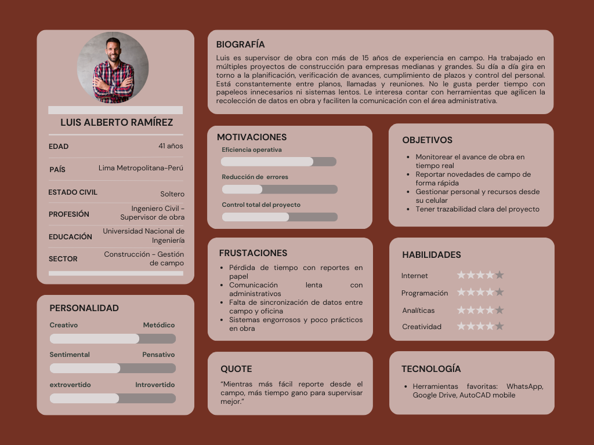
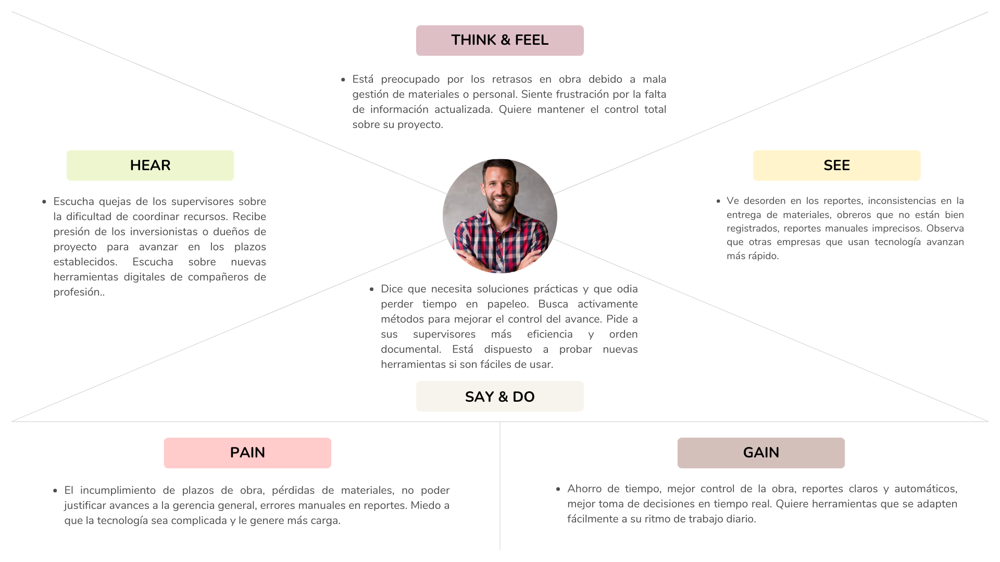
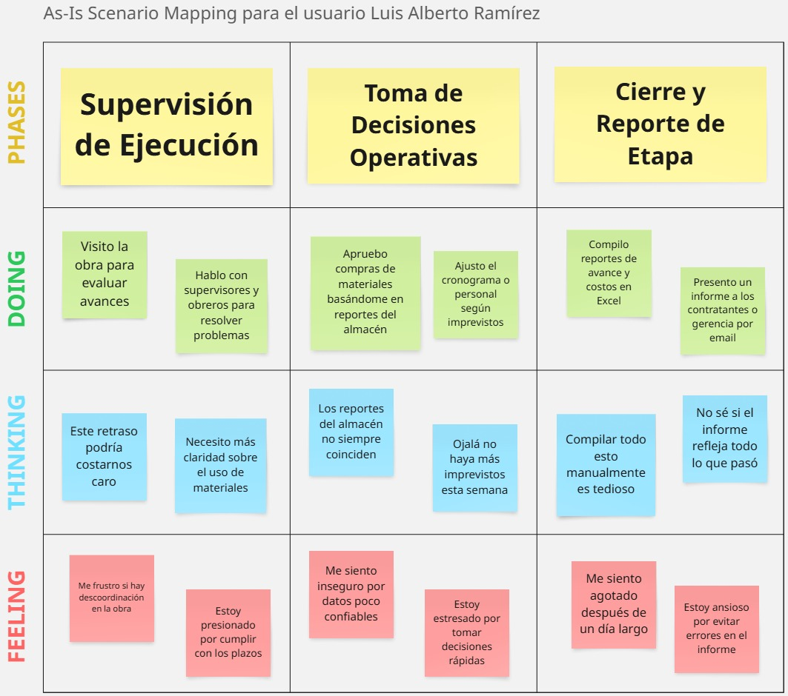
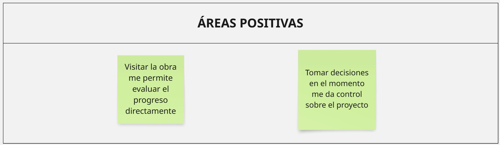
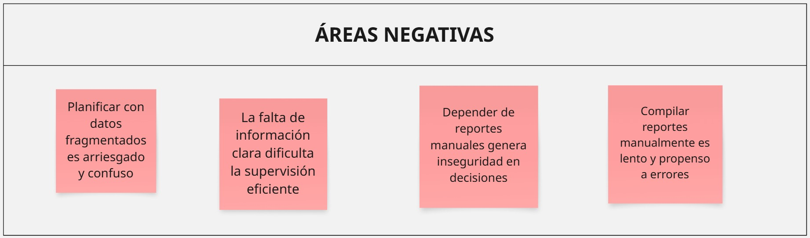
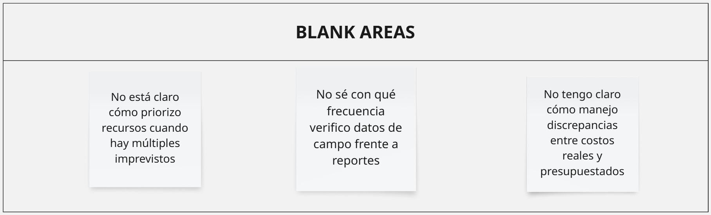
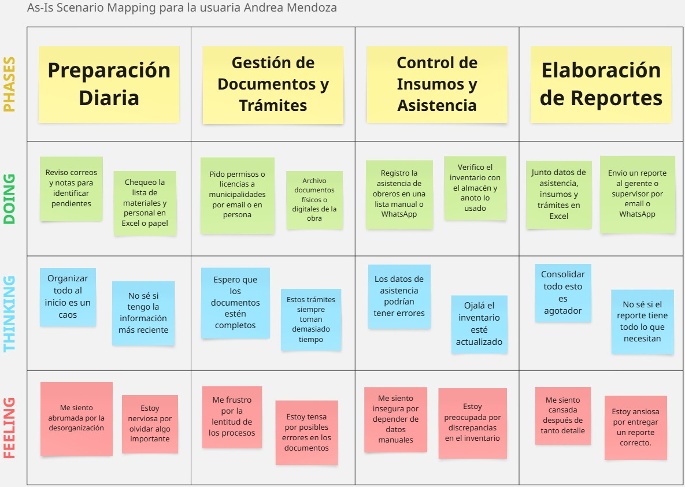
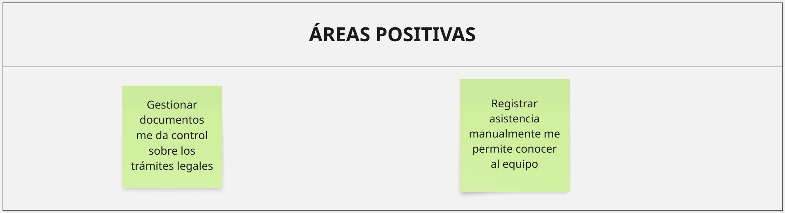
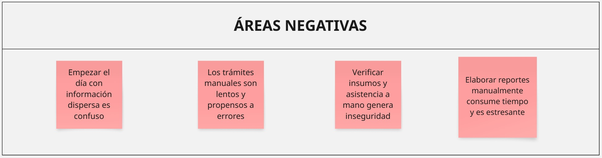
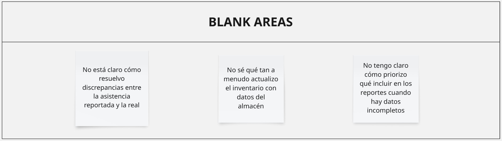

  

    
  

  # 
Universidad Peruana de Ciencias Aplicadas

  ## 
Ingeniería de Software

  
Periodo: 202610

  
1ASI0657 | Fundamentos de Arquitectura de Software

  
NRC: 7940

  
Docente: Daniel Enrique Mori Yzaguirre

  ---
  
   
  
  ## 
Informe del Trabajo Final

  
  
Startup: BuildWise

  
Producto: BuildTruck

  
   
  
  
Integrantes:

  
<code>U202311220</code> - Gutierrez Condo, Maylhy Olinda

  
<code>U202311361</code> - Roca Tineo, Steven Mathew

  
<code>U202311334</code> - Rodriguez Rodriguez, Luis Piero

  
<code>U202123373</code> - Roman Pajuelo, Luis Gustavo

  
   
  
  
<i>Abril 2026</i>

 

# **Registro de Versiones del Informe**

| Versión | Fecha | Autor | Descripción de modificación |
| :---- | :---- | :---- | :---- |
| TB1 | 27/04/2025 | Bellido Salas, Raúl   Gómez Flores, Daniela Araceli   Gutiérrez Condo, Maylhy Olinda   Luyo Correa, Sandra Paula   Roca Tineo, Steven Mathew | En la primera entrega del informe de nuestro proyecto, hemos realizado los primeros 5 capítulos del informe y también entregamos la primera versión del landing page de BuilTruck. |
| TP1 | 15/05/2025 | Bellido Salas, Raúl   Gómez Flores, Daniela Araceli   Gutiérrez Condo, Maylhy Olinda   Luyo Correa, Sandra Paula   Roca Tineo, Steven Mathew | En la segunda entrega, incorporamos la documentación correspondiente al Sprint 2 y realizamos actualizaciones en las conclusiones y anexos del informe de reporte. Asimismo, mejoramos la landing page y desarrollamos la primera versión del Frontend Web Applications. |
| TB2 | 21/06/2025 | Bellido Salas, Raúl   Gómez Flores, Daniela Araceli   Gutiérrez Condo, Maylhy Olinda   Luyo Correa, Sandra Paula   Roca Tineo, Steven Mathew | En esta tercera entrega, en nuestro informe, incluimos la documentación del Sprint 3 realizado, realizamos Validation Interviews (diseño de entrevistas, registro de las mismas y evaluaciones basadas en heurísticas), además de producir el Video About-the-Product y actualizar las conclusiones, la bibliografía y los anexos. |
| TF | 07/07/2025 | Bellido Salas, Raúl   Gómez Flores, Daniela Araceli   Gutiérrez Condo, Maylhy Olinda   Luyo Correa, Sandra Paula   Roca Tineo, Steven Mathew | En esta última entrega, en el reporte del proyecto, agregamos todo lo realizado y requerido del Sprint 4 de BuildTruck. Adjuntamos las versiones finales del Video about the product y Video About the team. También, escribimos las conclusiones y recomendaciones finales de nuestro proyecto |

 

# **Project Report Collaboration Insights**

Elaboramos el informe de nuestro proyecto en un repositorio llamado “ProjectReport” en nuestra organización llamada “BuilTruck” porque ahí desarrollaremos los productos de nuestra aplicación web del mismo nombre.  
Enlace del repositorio “ProjectReport”: [https://github.com/BuildTruck/ProjectReport](https://github.com/BuildTruck/ProjectReport)   

<ins>**TB1:**</ins>  
Para poder lograr la elaboración grupal de este informe del proyecto en GitHub en formato markdown. A continuación, se mostrará una imagen de los insights de los commits realizados por cada miembro en dicho repositorio.  
**Figura 1**  
*Insights de ProjectReports*  

*Nota.* Elaboración propia. 

# **Tabla de contenidos**

<a href="#student-outcome">Student Outcome</a>

<a href="#capítulo-i-introducción">Capítulo I: Introducción</a>
    <ul>
        <a href="#11-startup-profile">1.1. Startup Profile</a> 
        <ul>
            <a href="#111-descripción-de-la-startup">1.1.1. Descripción de la Startup</a> 
            <a href="#112-perfiles-de-integrantes-del-equipo">1.1.2. Perfiles de integrantes del equipo</a> 
        </ul>
        <a href="#12-solution-profile">1.2. Solution Profile</a> 
        <ul>
            <a href="#121-nombre-del-producto">1.2.1. Nombre del producto</a> 
            <a href="#122-antecedentes-y-problemática">1.2.2. Antecedentes y problemática</a> 
            <a href="#123-lean-ux-process">1.2.3. Lean UX Process</a> 
            <ul>
                <a href="#1231-lean-ux-problem-statement">1.2.3.1. Lean UX Problem Statement</a> 
                <a href="#1232-lean-ux-assumptions">1.2.3.2. Lean UX Assumptions</a> 
                <a href="#1233-lean-ux-hypothesis">1.2.3.3. Lean UX Hypothesis</a> 
                <a href="#1234-lean-ux-canvas">1.2.3.4. Lean UX Canvas</a> 
            </ul>
        </ul>
        <a href="#13-segmentos-objetivo">1.3. Segmentos objetivo</a> 
    </ul>

<a href="#capítulo-ii-requirements--analysis">Capítulo II: Requirements & Analysis</a>
    <ul>
        <a href="#21-competidores">2.1. Competidores</a> 
        <a href="#22-entrevistas">2.2. Entrevistas</a> 
        <a href="#23-needfinding">2.3. Needfinding</a> 
        <ul>
            <a href="#231-user-personas">2.3.1. User Personas</a> 
            <a href="#232-user-task-matrix">2.3.2. User Task Matrix</a> 
            <a href="#233-empathy-maps">2.3.3. Empathy Maps</a> 
            <a href="#234-as-is-scenario-mapping">2.3.4. As-is Scenario Mapping</a> 
        </ul>
    </ul>

<a href="#capítulo-iii-requirements-specification">Capítulo III: Requirements Specification</a>
    <ul>
        <a href="#31-to-be-scenario-mapping">3.1. To-Be Scenario Mapping</a> 
        <a href="#32-user-stories">3.2. User Stories</a> 
        <a href="#33-impact-map">3.3. Impact Map</a> 
        <a href="#34-product-backlog">3.4. Product Backlog</a> 
    </ul>

<a href="#capítulo-iv-product-architecture-design">Capítulo IV: Product Architecture Design</a>
    <ul>
        <a href="#41-design-concepts-viewpoints--er-diagrams">4.1. Design Concepts, ViewPoints & ER Diagrams</a> 
        <ul>
            <a href="#411-principles-statements">4.1.1. Principles Statements</a> 
            <a href="#412-approaches-statements-architectural-styles--patterns">4.1.2. Approaches Statements Architectural Styles & Patterns</a> 
            <a href="#413-context-diagram">4.1.3. Context Diagram</a> 
            <a href="#414-approach-driven-viewpoints-diagrams">4.1.4. Approach driven ViewPoints Diagrams</a> 
            <a href="#415-relationalnon-relational-database-diagram">4.1.5. Relational/Non Relational Database Diagram</a> 
            <a href="#416-design-patterns">4.1.6. Design Patterns</a> 
            <a href="#417-tactics">4.1.7. Tactics</a> 
        </ul>
        <a href="#42-architectural-drivers">4.2. Architectural Drivers</a> 
        <ul>
            <a href="#421-design-purpose">4.2.1. Design Purpose</a> 
            <a href="#422-primary-functionality-primary-user-stories">4.2.2. Primary Functionality (Primary User Stories)</a> 
            <a href="#423-quality-attribute-scenarios">4.2.3. Quality Attribute Scenarios</a> 
            <a href="#424-constraints">4.2.4. Constraints</a> 
            <a href="#425-architectural-concerns">4.2.5. Architectural Concerns</a> 
        </ul>
        <a href="#43-add-iterations">4.3. ADD Iterations</a> 
        <ul>
            <a href="#431-iteration-1">4.3.X. Iteration N: [Iteration Name]</a> 
            <ul>
                <a href="#4311-architectural-design-backlog">4.3.X.1. Architectural Design Backlog N</a> 
                <a href="#4312-establish-iteration-goal">4.3.X.2. Establish Iteration Goal by Selecting Drivers</a> 
                <a href="#4313-choose-elements">4.3.X.3. Choose One or More Elements of the System to Refine</a> 
                <a href="#4314-choose-design-concepts">4.3.X.4. Choose One or More Design Concepts That Satisfy the Selected Drivers</a> 
                <a href="#4315-instantiate-elements">4.3.X.5. Instantiate Architectural Elements, Allocate Responsibilities, and Define Interfaces</a> 
                <a href="#4316-sketch-views">4.3.X.6. Sketch Views (C4 & UML) and Record Design Decisions</a> 
                <a href="#4317-analysis">4.3.X.7. Analysis of Current Design and Review Iteration Goal (Kanban Board)</a> 
            </ul>
        </ul>
    </ul>

<a href="#capítulo-v-product-implementation-validation--deployment">Capítulo V: Product Implementation, Validation & Deployment</a>
    <ul>
        <a href="#51-testing-suites--general-patterns">5.1. Testing Suites & General Patterns</a> 
        <ul>
            <a href="#511-backend-application-core-testing-suite">5.1.1. Backend Application Core Testing Suite</a> 
            <a href="#512-pattern-based-backend-applications">5.1.2. Pattern Based Backend Application(s)</a> 
            <a href="#513-pattern-based-custom-software-library">5.1.3. Pattern Based Custom Software Library</a> 
            <a href="#514-framework-pattern-driven-refactoring-report">5.1.4. Framework Pattern Driven Refactoring Report</a> 
        </ul>
        <a href="#52-software-configuration-management">5.2. Software Configuration Management</a> 
        <ul>
            <a href="#521-software-development-environment-configuration">5.2.1. Software Development Environment Configuration</a> 
            <a href="#522-source-code-management">5.2.2. Source Code Management</a> 
            <a href="#523-source-code-style-guide--conventions">5.2.3. Source Code Style Guide & Conventions</a> 
            <a href="#524-software-deployment-configuration">5.2.4. Software Deployment Configuration</a> 
        </ul>
        <a href="#53-microservices-implementation">5.3. Microservices Implementation</a> 
        <ul>
            <a href="#531-sprint-1">5.3.1. Sprint 1</a> 
            <ul>
                <a href="#5311-sprint-backlog-1">5.3.1.1. Sprint Backlog 1</a> 
                <a href="#5312-development-evidence">5.3.1.2. Development Evidence for Sprint Review</a> 
                <a href="#5313-testing-suite-evidence">5.3.1.3. Testing Suite Evidence for Sprint Review</a> 
                <a href="#5314-execution-evidence">5.3.1.4. Execution Evidence for Sprint Review</a> 
                <a href="#5315-microservices-documentation-evidence">5.3.1.5. Microservices Documentation Evidence for Sprint Review</a> 
                <a href="#5316-software-deployment-evidence">5.3.1.6. Software Deployment Evidence for Sprint Review</a> 
                <a href="#5317-team-collaboration-insights">5.3.1.7. Team Collaboration Insights during Sprint</a> 
                <a href="#5318-kanban-board">5.3.1.8. Kanban Board</a> 
            </ul>
            <a href="#532-sprint-2">5.3.2. Sprint 2</a> 
            <ul>
                <a href="#5321-sprint-backlog-2">5.3.2.1. Sprint Backlog 2</a> 
                <a href="#5322-development-evidence">5.3.2.2. Development Evidence for Sprint Review</a> 
                <a href="#5323-testing-suite-evidence">5.3.2.3. Testing Suite Evidence for Sprint Review</a> 
                <a href="#5324-execution-evidence">5.3.2.4. Execution Evidence for Sprint Review</a> 
                <a href="#5325-microservices-documentation-evidence">5.3.2.5. Microservices Documentation Evidence for Sprint Review</a> 
                <a href="#5326-software-deployment-evidence">5.3.2.6. Software Deployment Evidence for Sprint Review</a> 
                <a href="#5327-team-collaboration-insights">5.3.2.7. Team Collaboration Insights during Sprint</a> 
                <a href="#5328-kanban-board">5.3.2.8. Kanban Board</a> 
            </ul>
            <a href="#533-sprint-3">5.3.3. Sprint 3</a> 
            <ul>
                <a href="#5331-sprint-backlog-3">5.3.3.1. Sprint Backlog 3</a> 
                <a href="#5332-development-evidence">5.3.3.2. Development Evidence for Sprint Review</a> 
                <a href="#5333-testing-suite-evidence">5.3.3.3. Testing Suite Evidence for Sprint Review</a> 
                <a href="#5334-execution-evidence">5.3.3.4. Execution Evidence for Sprint Review</a> 
                <a href="#5335-microservices-documentation-evidence">5.3.3.5. Microservices Documentation Evidence for Sprint Review</a> 
                <a href="#5336-software-deployment-evidence">5.3.3.6. Software Deployment Evidence for Sprint Review</a> 
                <a href="#5337-team-collaboration-insights">5.3.3.7. Team Collaboration Insights during Sprint</a> 
                <a href="#5338-kanban-board">5.3.3.8. Kanban Board</a> 
            </ul>
            <a href="#534-sprint-4">5.3.4. Sprint 4</a> 
            <ul>
                <a href="#5341-sprint-backlog-4">5.3.4.1. Sprint Backlog 4</a> 
                <a href="#5342-development-evidence">5.3.4.2. Development Evidence for Sprint Review</a> 
                <a href="#5343-testing-suite-evidence">5.3.4.3. Testing Suite Evidence for Sprint Review</a> 
                <a href="#5344-execution-evidence">5.3.4.4. Execution Evidence for Sprint Review</a> 
                <a href="#5345-microservices-documentation-evidence">5.3.4.5. Microservices Documentation Evidence for Sprint Review</a> 
                <a href="#5346-software-deployment-evidence">5.3.4.6. Software Deployment Evidence for Sprint Review</a> 
                <a href="#5347-team-collaboration-insights">5.3.4.7. Team Collaboration Insights during Sprint</a> 
                <a href="#5348-kanban-board">5.3.4.8. Kanban Board</a> 
            </ul>
        </ul>
        <a href="#54-microservices-deployment">5.4. Microservices Deployment</a> 
        <ul>
            <a href="#541-cloud-architecture-diagram">5.4.1. Cloud Architecture Diagram</a> 
            <a href="#542-cloud-architecture-deployment">5.4.2. Cloud Architecture Deployment</a> 
        </ul>
    </ul>

<a href="#conclusiones">Conclusiones</a>
    <ul>
        <a href="#conclusiones-y-recomendaciones">Conclusiones y recomendaciones</a> 
        <a href="#video-about-the-team">Video About-The-Team</a> 
    </ul>

<a href="#referencias-bibliográficas">Referencias Bibliográficas</a>

<a href="#anexos">Anexos</a>
    <ul>
        <a href="#links">Links</a> 
    </ul>

---

# Student Outcome

# Capítulo I: Introducción

## 1.1. Startup Profile

### 1.1.1. Descripción de la Startup

### 1.1.2. Perfiles de integrantes del equipo

## 1.2. Solution Profile

### 1.2.1. Nombre del producto

### 1.2.2. Antecedentes y problemática

### 1.2.3. Lean UX Process

#### 1.2.3.1. Lean UX Problem Statement

#### 1.2.3.2. Lean UX Assumptions

#### 1.2.3.3. Lean UX Hypothesis

#### 1.2.3.4. Lean UX Canvas

## 1.3. Segmentos objetivo

---

# Capítulo II: Requirements & Analysis

## 2.1. Competidores

En el sector del software de gestión para la construcción, existen diversas plataformas orientadas a optimizar la administración de proyectos, recursos y personal operativo. Los principales competidores en el mercado frente a BuildTruck son:

- Procore: Procore es una plataforma integral que ayuda a administrar proyectos de construcción desde la etapa previa hasta su finalización, abarcando finanzas, recursos y datos. Su principal fortaleza radica en ser una marca consolidada a nivel global, con una amplia base de usuarios y una integración robusta con otras herramientas. Sin embargo, presenta barreras de entrada significativas para las PYMES, principalmente por su elevado costo y una curva de aprendizaje pronunciada para usuarios no técnicos. Esto abre un espacio para alternativas enfocadas en la simplicidad y la accesibilidad económica.

- Buildertrend: Buildertrend es un software de gestión diseñado para simplificar la comunicación y la administración de proyectos, dirigido principalmente a constructores residenciales, remodeladores y contratistas de pequeño a mediano tamaño. Su fortaleza está en su interfaz intuitiva, precios competitivos y herramientas específicas para interactuar con el cliente final. No obstante, ofrece menor escalabilidad para proyectos grandes o de alta complejidad y posee menos integraciones que plataformas líderes, lo que limita su alcance operativo frente a constructoras que requieren un control más estricto de inventario en campo.

- PlanGrid: PlanGrid es una herramienta enfocada en la colaboración en tiempo real y la gestión de planos y documentos, orientada a arquitectos, ingenieros y contratistas en proyectos de mediano a gran tamaño. Su ventaja competitiva es indiscutible gracias al respaldo y la integración directa con el ecosistema Autodesk (como AutoCAD y BIM 360), ofreciendo alta precisión técnica. A pesar de ello, su fuerte dependencia de este ecosistema y su alta especialización en diseño técnico hacen que preste menor atención a la gestión diaria de personal e inventario en obra, dejando una oportunidad clara para soluciones centradas en estas áreas operativas.

### ***2.1.1. Análisis competitivo***

<body>
<table class="c16">
<tr class="c1">
<td class="c13" colspan="6" rowspan="1">
Competitive Analysis Landscape
</td>
</tr>
<tr class="c1">
<td class="c11" colspan="2" rowspan="1">
¿Por qué llevar a cabo este análisis?
</td>
<td class="c17" colspan="4" rowspan="1">
Elaborar este análisis es esencial para entender el posicionamiento de BuildTruck en el mercado de software de gestión para la construcción, identificar oportunidades de diferenciación y anticipar amenazas de competidores establecidos. Esto permite ajustar la propuesta de valor, optimizar estrategias de marketing y producto, y garantizar que BuildTruck responda a las necesidades específicas de las empresas constructoras, especialmente en un sector que está adoptando rápidamente la digitalización.
</td>
</tr>
<tr class="c1">
<td class="c11" colspan="2" rowspan="1">

</td>
<td class="c0" colspan="1" rowspan="1">
BuildTruck

</td>
<td class="c0" colspan="1" rowspan="1">
Procore

</td>
<td class="c0" colspan="1" rowspan="1">
Buildertrend

</td>
<td class="c0" colspan="1" rowspan="1">
PlanGrid

</td>
</tr>
<tr class="c1">
<td class="c0" colspan="1" rowspan="2">
Perfil
</td>
<td class="c0" colspan="1" rowspan="1">
Overview
</td>
<td class="c0" colspan="1" rowspan="1">
BuildTruck es una plataforma web que centraliza la gestión operativa de empresas constructoras en tres áreas clave: inventario, personal y obreros, con un enfoque en accesibilidad y escalabilidad.
</td>
<td class="c0" colspan="1" rowspan="1">
Procore es una plataforma que ayuda a optimizar y administrar proyectos de construcción desde la etapa previa hasta su finalización.
</td>
<td class="c0" colspan="1" rowspan="1">
Buildertrend es un software de gestión de construcción diseñada para simplificar la comunicación y administrar proyectos, con un enfoque en construcciones de casas y remodeladores.
</td>
<td class="c0" colspan="1" rowspan="1">
PlanGrid es una herramienta enfocada en la gestión de planos y documentos en tiempo real, con capacidades extendidas para la gestión de proyectos.
</td>
</tr>
<tr class="c1">
<td class="c0" colspan="1" rowspan="1">
Ventaja competitiva ¿Qué valor ofrece a los clientes?
</td>
<td class="c0" colspan="1" rowspan="1">
Su diseño simple y específico para PYMES constructoras, combinado con un enfoque en seguimiento en tiempo real y costos asequibles, la posiciona como una alternativa práctica frente a soluciones más complejas y costosas.
</td>
<td class="c0" colspan="1" rowspan="1">
Ofrece productos y servicios de gestión de preconstrucción, administración de proyectos, finanzas, recursos y datos. También brinda soporte de expertos de construcción.
</td>
<td class="c0" colspan="1" rowspan="1">
Su facilidad de uso y herramientas específicas para la comunicación con clientes (portales de clientes) lo hacen ideal para pequeñas y medianas empresas que buscan mejorar la experiencia del cliente.
</td>
<td class="c0" colspan="1" rowspan="1">
Su integración con el ecosistema Autodesk (como AutoCAD y BIM 360) y su especialización en la gestión de planos digitales ofrecen un valor único para empresas que dependen de diseños técnicos precisos.
</td>
</tr>
<tr class="c1">
<td class="c0" colspan="1" rowspan="2">
Perfil de Marketing
</td>
<td class="c0" colspan="1" rowspan="1">
Mercado objetivo
</td>
<td class="c0" colspan="1" rowspan="1">
Gerentes de obra de obra y supervisores de obra de obra.
</td>
<td class="c0" colspan="1" rowspan="1">
Empresas constructoras de todos los tamaños, desde pequeñas firmas hasta grandes contratistas generales, con un enfoque en proyectos comerciales y residenciales.
</td>
<td class="c0" colspan="1" rowspan="1">
Principalmente constructores residenciales, remodeladores y contratistas especializados de pequeño a mediano tamaño.
</td>
<td class="c0" colspan="1" rowspan="1">
Contratistas, arquitectos e ingenieros en proyectos comerciales e industriales de mediano a gran tamaño.
</td>
</tr>
<tr class="c1">
<td class="c0" colspan="1" rowspan="1">
Estrategias de marketing
</td>
<td class="c0" colspan="1" rowspan="1">
Enfoque en marketing digital por redes sociales enfocado en gerentes de obra de obra y supervisores de obra de obra, webinars para explicar el funcionamiento de la plataforma y una versión de prueba gratuita.
</td>
<td class="c0" colspan="1" rowspan="1">
Publicidad digital enfocada en la productividad y la escalabilidad, presencia en eventos de la industria (como ferias de construcción), y contenido educativo (webinars, guías) para atraer a gerentes de proyectos y dueños de empresas.
</td>
<td class="c0" colspan="1" rowspan="1">
Marketing de contenido (blogs, videos tutoriales), campañas en redes sociales dirigidas a propietarios de negocios, y programas de referidos para fomentar la adopción.
</td>
<td class="c0" colspan="1" rowspan="1">
Colaboración con Autodesk para campañas globales, enfoque en la digitalización de planos, y presencia en conferencias técnicas y de diseño.
</td>
</tr>
<tr class="c1">
<td class="c0" colspan="1" rowspan="3">
Perfil de Producto
</td>
<td class="c0" colspan="1" rowspan="1">
Productos & Servicios
</td>
<td class="c0" colspan="1" rowspan="1">
Gestión de inventario, seguimiento del personal, reportes operativos en tiempo real, y herramientas móviles.
</td>
<td class="c0" colspan="1" rowspan="1">
Gestión de proyectos, control de documentos, seguimiento de recursos, reportes financieros, y aplicaciones móviles para uso en obra.
</td>
<td class="c0" colspan="1" rowspan="1">
Gestión de proyectos, programación, seguimiento de costos, comunicación con clientes, y herramientas móviles.
</td>
<td class="c0" colspan="1" rowspan="1">
Gestión de planos, colaboración en tiempo real, seguimiento de tareas, y reportes de campo.
</td>
</tr>
<tr class="c1">
<td class="c0" colspan="1" rowspan="1">
Precios & Costos
</td>
<td class="c0" colspan="1" rowspan="1">
Modelo de suscripción desde $50/mes (plan básico) hasta $200/mes para funciones avanzadas, con opciones escalables.
</td>
<td class="c0" colspan="1" rowspan="1">
Modelo de suscripción basado en proyectos o usuarios, con precios que comienzan en aproximadamente $375/mes (plan básico) hasta miles de dólares para grandes empresas.

</td>
<td class="c0" colspan="1" rowspan="1">
Suscripción mensual desde $99/mes (plan inicial) hasta $399/mes para funciones avanzadas, con costos adicionales por usuario.
</td>
<td class="c0" colspan="1" rowspan="1">
Desde $49/mes por usuario (plan básico) hasta planes personalizados para empresas grandes, integrados en el ecosistema Autodesk.
</td>
</tr>
<tr class="c1">
<td class="c0" colspan="1" rowspan="1">
Canales de distribución (Web y/o Móvil)
</td>
<td class="c0" colspan="1" rowspan="1">
Venta directa online a través de la aplicación web, soporte vía chat y email.
</td>
<td class="c0" colspan="1" rowspan="1">
Venta directa a través de su sitio web, equipo de ventas empresariales, y asociaciones con distribuidores de software.
</td>
<td class="c0" colspan="1" rowspan="1">
Venta directa online, soporte a través de equipos de atención al cliente, y partnerships con asociaciones de constructores.
</td>
<td class="c0" colspan="1" rowspan="1">
Venta a través de Autodesk, suscripciones directas online, y distribuidores autorizados.
</td>
</tr>
<tr class="c1">
<td class="c0" colspan="1" rowspan="4">
Análisis SWOT
</td>
<td class="c0" colspan="1" rowspan="1">
Fortalezas
</td>
<td class="c0" colspan="1" rowspan="1">
Costo accesible, facilidad de implementación, enfoque en necesidades operativas básicas.
</td>
<td class="c0" colspan="1" rowspan="1">
Es una marca consolidada con una amplia base de usuarios e integración robusta con otras herramientas.
</td>
<td class="c0" colspan="1" rowspan="1">
Interfaz intuitiva, fuerte enfoque en el cliente final, precios competitivos para PYMES.
</td>
<td class="c0" colspan="1" rowspan="1">
Respaldo de Autodesk, especialización en planos y BIM, alta precisión técnica.
</td>
</tr>
<tr class="c1">
<td class="c0" colspan="1" rowspan="1">
Debilidades
</td>
<td class="c0" colspan="1" rowspan="1">
Falta de reconocimiento de marca.

</td>
<td class="c0" colspan="1" rowspan="1">
Costo elevado para pequeñas empresas, curva de aprendizaje para usuarios no técnicos.
</td>
<td class="c0" colspan="1" rowspan="1">
Menor escalabilidad para proyectos grandes o complejos, menos integraciones que competidores como Procore.
</td>
<td class="c0" colspan="1" rowspan="1">
Dependencia del ecosistema Autodesk, menos enfoque en gestión de personal o inventario.
</td>
</tr>
<tr class="c1">
<td class="c0" colspan="1" rowspan="1">
Oportunidades
</td>
<td class="c0" colspan="1" rowspan="1">
Creciente digitalización en constructoras, nicho en mercados desatendidos por competidores grandes.
</td>
<td class="c0" colspan="1" rowspan="1">
Expansión en mercados emergentes con alta actividad constructiva, adopción de IA para análisis predictivo.
</td>
<td class="c0" colspan="1" rowspan="1">
Crecimiento en el segmento de remodelación residencial, expansión internacional.
</td>
<td class="c0" colspan="1" rowspan="1">
Creciente adopción de BIM en la construcción, expansión en mercados con alta regulación técnica.
</td>
</tr>
<tr class="c1">
<td class="c0" colspan="1" rowspan="1">
Amenazas
</td>
<td class="c0" colspan="1" rowspan="1">
Competencia de soluciones establecidas, riesgo de ser percibida como "básica" frente a plataformas más robustas.
</td>
<td class="c0" colspan="1" rowspan="1">
Competencia de soluciones más económicas, resistencia a la digitalización en algunas regiones.
</td>
<td class="c0" colspan="1" rowspan="1">
Competencia de soluciones más especializadas, saturación en el mercado residencial.
</td>
<td class="c0" colspan="1" rowspan="1">
Competencia de soluciones más completas, costo elevado para pequeñas empresas.
</td>
</tr>
</table>
</body>

#

### ***2.1.2. Estrategias y tácticas frente a competidores***

* Ofreceremos un plan de suscripción básico a $50/mes (como se sugirió) con funciones esenciales (gestión de inventario y personal), mucho más bajo que los $375/mes de Procore o los $99/mes de Buildertrend.  
* Al lanzar contenido gratuito como webinars y guías PDF sobre los beneficios de la digitalización operativa y sobre el funcionamiento de nuestra aplicación web dirigido a empresas que aún usan métodos manuales, posicionaremos a BuildTruck como el primer paso accesible frente a soluciones más avanzadas.  
* Implementaremos una prueba gratuita de 30 días, frente a los 14 días usuales de competidores, con acceso completo a la plataforma, destacando de esta manera la facilidad de uso y la implementación sin necesidad de soporte técnico extenso, a diferencia de otros competidores, que tienes una curva de aprendizaje pronunciada.  
* Desarrollaremos características específicas como alertas automáticas de bajo inventario para así diferenciarnos de las plataformas de competencia que se centran más en planos o que priorizan más la comunicación con clientes.  
* Ofreceremos soporte vía chat o teléfono con tiempos de respuesta rápidos, superando el soporte de la competencia que a menudo requiere obtener tickets y es más tardado.  
* Ofreceremos planes escalables según el número de proyectos, permitiendo a los usuarios crecer con BuildTruck sin sentirse forzados a pagar planes caros desde un inicio, a diferencia de algunos competidores.

#

## 2.2. Entrevistas

### ***2.2.1. Diseño de entrevistas***

***-Segmento objetivo \#1: Gerentes de obra*** 

***Características demográficas:***

*  ¿Cuál es tu edad?  
* ¿En qué lugar trabajas o estás actualmente asignado(a)?  
* ¿Cuál es tu cargo o rol específico dentro de tu trabajo?

***Preguntas Principales***

1. ¿Cuáles son tus principales responsabilidades diarias sobre las obras?  
2. ¿Cómo gestionas actualmente el seguimiento de materiales y personal en campo?  
3. ¿Utilizas algún software o herramienta digital para controlar las actividades en la obra? ¿Cuál(es)?  
4. ¿Cuántos proyectos diriges en tu cargo?  
5. ¿Cuáles son los mayores retos que enfrentas al momento de controlar el avance del proyecto?

***Preguntas sobre el Proyecto*** 

6. ¿Qué te parecería contar con una plataforma que te permita monitorear inventario, personal y actividades?  
7. ¿Qué funcionalidades serían esenciales para ti en una plataforma de gestión de obra?  
8. ¿Con qué frecuencia necesitarías revisar o actualizar la información sobre materiales o personal?  
9. ¿Qué tipo de notificaciones o alertas te serían realmente útiles para tomar decisiones rápidas?

***-Segmento objetivo \#2:  Supervisores de obra*** 

***Características demográficas:***

*  ¿Cuál es tu edad?  
* ¿En qué institución trabaja o estás actualmente asignado(a)?  
* ¿Cuál es tu cargo o rol específico dentro de tu trabajo?

***Preguntas Principales*** 

1. ¿Cómo organizas y almacenas la información relacionada con materiales, personal y documentos en la obra?  
2. ¿Cuánto tiempo te toma preparar reportes?  
3. ¿Qué herramientas digitales (si alguna) utilizas actualmente en tu trabajo?  
4. ¿Qué tan difícil es programar los horarios y reuniones para las coordinaciones a realizar con gerentes de obra, almacén y personal técnico en el día a día?   
5. ¿Has tenido problemas por datos incompletos, pérdidas de documentos o información mal registrada?

***Preguntas sobre el Proyecto***

6. ¿Cómo te ayudaría tener una plataforma centralizada para registrar y consultar entradas/salidas de materiales y datos del personal?  
7. ¿Qué tipo de reportes automatizados te serían más útiles en tu rutina diaria?  
8. ¿Qué esperas de una plataforma que ayude con la gestión operativa de obra?  
9. Si tuvieras que diseñar una app para tu trabajo, ¿qué funciones serían imprescindibles?

### 2.2.2. Registro de entrevistas
A continuación, se detallan las transcripciones, las pruebas recopiladas y un resumen de cada una de las entrevistas realizadas a los usuarios.  

### ***2.2.3. Análisis de entrevistas***

## 2.3. Needfinding

### ***2.3.1. User Personas***

Los user personas son arquetipos construidos a partir de datos reales e investigación que representan a los diferentes segmentos del público objetivo de un proyecto, consolidándose como un recurso estratégico esencial para humanizar a la audiencia. Esta herramienta permite al equipo comprender a profundidad los patrones de comportamiento, las expectativas y las necesidades específicas de los usuarios, actuando como una brújula central durante todas las fases de diseño y desarrollo. Al mantener una visión clara y empática de para quién se está creando la solución, se garantiza que cada funcionalidad, decisión técnica y diseño de experiencia (UX) esté estrictamente enfocada en resolver problemas reales, facilitando así la creación de productos mucho más efectivos, alineados con el mercado y capaces de asegurar la máxima satisfacción final.

**Segmento objetivo \#1 Gerentes de obra:**  

Luis Alberto Ramírez es un gerente de obra que busca mantener un control total sobre sus proyectos de construcción y garantizar la máxima eficiencia operativa. Necesita una herramienta tecnológica ágil que le facilite recolectar datos en campo, monitorear el avance en tiempo real y gestionar a su personal directamente desde su celular, sin tener que lidiar con papeleos innecesarios o sistemas lentos. Su principal desafío es optimizar el tiempo que invierte en la elaboración de reportes y evitar la frustración que genera la mala comunicación y la falta de sincronización de información entre la obra y la oficina.

  

**Segmento objetivo \#2 Supervisores de obra:**  

Andrea Palacios Guzmán es una supervisora de obra que busca mantener el orden, la organización y la precisión en la gestión documental del proyecto. Necesita una plataforma tecnológica intuitiva que centralice la información, permitiéndole generar reportes diarios de forma automatizada y gestionar los registros del personal y el inventario sin errores. Su principal desafío es optimizar su tiempo, evitando el doble trabajo y la frustración que le genera recibir información incompleta o desactualizada desde el campo.

  

### ***2.3.2. User Task Matrix***

El User Task Matrix es una herramienta analítica que permite identificar y estructurar las acciones específicas que ejecutan los distintos segmentos de la audiencia. Su propósito principal es facilitar la comparación visual de estos procesos, evidenciando de forma clara las similitudes y diferencias en cuanto a la frecuencia de uso y el nivel de importancia de cada tarea. Al cruzar esta información, el equipo adquiere una visión objetiva que ayuda a priorizar el desarrollo de funcionalidades, asegurando que los esfuerzos técnicos y de diseño se concentren en las acciones de mayor valor e impacto para los usuarios.

| Tarea | Frecuencia   **Andrea Palacios** | Importancia   **Andrea Palacios** | Frecuencia   **Luis Alberto** | Importancia   **Luis Alberto** |
| :--- | :--- | :--- | :--- | :--- |
| Registrar asistencia del personal | Siempre | Alta | Siempre | Alta |
| Revisar cronogramas de obra | A veces | Alta | Siempre | Alta |
| Supervisar pedidos y uso de materiales | A veces | Alta | - | Alta |
| Comunicar cambios en el proyecto | Siempre | Alta | Siempre | Alta |
| Tramitar permisos y licencias ante instituciones | A veces | Alta | - | Alta |
| Elaborar reportes diarios/semanales | A veces | Alta | - | Alta |
| Inspeccionar cumplimiento de estándares | - | Alta | A veces | Alta |

Mediante el análisis del User Task Matrix, logramos comprender a profundidad las actividades específicas que ejecutan nuestros segmentos de usuarios, evaluando directamente el nivel de impacto e importancia de cada acción. Este mapeo cruzado nos permite visualizar con total claridad las tareas principales previamente identificadas, validando su relevancia real y garantizando que las decisiones de diseño y desarrollo se enfoquen prioritariamente en las funcionalidades de mayor valor para la experiencia final.

### ***2.3.3. Empathy Mapping***

Los Empathy Maps son herramientas visuales y estratégicas fundamentadas en una metodología centrada en el usuario, cuyo propósito es traducir datos cualitativos en una radiografía profunda de lo que cada segmento de la audiencia piensa, siente, dice y hace frente a un producto o servicio. Al articular de manera estructurada los principales miedos, frustraciones, motivaciones y necesidades de los usuarios, este recurso genera una perspectiva empática indispensable que orienta la toma de decisiones durante las fases de diseño y desarrollo, garantizando que cada funcionalidad construida responda de forma genuina y efectiva a las expectativas y preocupaciones reales del público objetivo.

**Segmento objetivo \#1 Gerentes de obra:**  

  

**Segmento objetivo \#2 Supervisores de obra:**  

  

### ***2.3.4. As-is Scenario Mapping***

El escenario As Is representa el estado actual de los procesos y la experiencia del usuario antes de la implementación de nuestra solución. Documentar esta fase es un paso fundamental, ya que establece una línea base clara que permite identificar fricciones, cuellos de botella y oportunidades de mejora en el flujo de trabajo actual. A partir de este diagnóstico, el equipo obtiene el contexto estratégico necesario para estructurar y diseñar el escenario To Be, el cual proyecta el estado futuro ideal donde nuestra propuesta tecnológica ya se encuentra completamente integrada, resolviendo los problemas detectados y optimizando la operación global.

**Segmento objetivo \#1 Gerentes de obra:**  

**Figura n**  
*As-Is Mapping del segmento \#1 de BuilTruck*  

  

 

*Nota.* Elaboración propia. Obtenido de [https://miro.com/app/board/uXjVI9rWV74=/?share\_link\_id=943914608011](https://miro.com/app/board/uXjVI9rWV74=/?share_link_id=943914608011)   

**Figura n**  
*Áreas positivas del As-Is Mapping del segmento \#1 de BuilTruck*

  

 

*Nota.* Elaboración propia. Obtenido de [https://miro.com/app/board/uXjVI9rWV74=/?share\_link\_id=943914608011](https://miro.com/app/board/uXjVI9rWV74=/?share_link_id=943914608011)   

**Figura n**  
*Áreas negativas del As-Is Mapping del segmento \#1 de BuilTruck*  

  

  

*Nota.* Elaboración propia. Obtenido de [https://miro.com/app/board/uXjVI9rWV74=/?share\_link\_id=943914608011](https://miro.com/app/board/uXjVI9rWV74=/?share_link_id=943914608011)   

**Figura n**  
*Blank areas del As-Is Mapping del segmento \#1 de BuilTruck*  

  

  

*Nota.* Elaboración propia. Obtenido de [https://miro.com/app/board/uXjVI9rWV74=/?share\_link\_id=943914608011](https://miro.com/app/board/uXjVI9rWV74=/?share_link_id=943914608011) 

**Segmento objetivo \#2 Supervisores de obra:**  

**Figura n**  
*As-Is Mapping del segmento \#2 de BuilTruck*  

  

 

*Nota.* Elaboración propia. Obtenido de [https://miro.com/app/board/uXjVI9rWV74=/?share\_link\_id=943914608011](https://miro.com/app/board/uXjVI9rWV74=/?share_link_id=943914608011)   

**Figura n**  
*Áreas positivas del As-Is Mapping del segmento \#2 de BuilTruck*  

  

  

*Nota.* Elaboración propia. Obtenido de [https://miro.com/app/board/uXjVI9rWV74=/?share\_link\_id=943914608011](https://miro.com/app/board/uXjVI9rWV74=/?share_link_id=943914608011)   
**Figura n**  
*Áreas negativas del As-Is Mapping del segmento \#2 de BuilTruck*  

  

  

*Nota.* Elaboración propia. Obtenido de [https://miro.com/app/board/uXjVI9rWV74=/?share\_link\_id=943914608011](https://miro.com/app/board/uXjVI9rWV74=/?share_link_id=943914608011)

**Figura n**  
*Blank areas del As-Is Mapping del segmento \#2 de BuilTruck*  

  

*Nota.* Elaboración propia. Obtenido de [https://miro.com/app/board/uXjVI9rWV74=/?share\_link\_id=943914608011](https://miro.com/app/board/uXjVI9rWV74=/?share_link_id=943914608011) 

---

# Capítulo III: Requirements Specification

## 3.1. To-Be Scenario Mapping

## 3.2. User Stories

## 3.3. Impact Map

## 3.4. Product Backlog

---

# Capítulo IV: Product Architecture Design

## 4.1. Design Concepts, ViewPoints & ER Diagrams

### 4.1.1. Principles Statements

### 4.1.2. Approaches Statements Architectural Styles & Patterns

### 4.1.3. Context Diagram

### 4.1.4. Approach driven ViewPoints Diagrams

### 4.1.5. Relational/Non Relational Database Diagram

### 4.1.6. Design Patterns

### 4.1.7. Tactics

## 4.2. Architectural Drivers

### 4.2.1. Design Purpose

### 4.2.2. Primary Functionality (Primary User Stories)

### 4.2.3. Quality Attribute Scenarios

### 4.2.4. Constraints

### 4.2.5. Architectural Concerns

## 4.3. ADD Iterations

### 4.3.X. Iteration N: [Iteration Name]

#### 4.3.X.1. Architectural Design Backlog N

#### 4.3.X.2. Establish Iteration Goal by Selecting Drivers

#### 4.3.X.3. Choose One or More Elements of the System to Refine

#### 4.3.X.4. Choose One or More Design Concepts That Satisfy the Selected Drivers

#### 4.3.X.5. Instantiate Architectural Elements, Allocate Responsibilities, and Define Interfaces

#### 4.3.X.6. Sketch Views (C4 & UML) and Record Design Decisions

#### 4.3.X.7. Analysis of Current Design and Review Iteration Goal (Kanban Board)

---

# Capítulo V: Product Implementation, Validation & Deployment

## 5.1. Testing Suites & General Patterns

### 5.1.1. Backend Application Core Testing Suite

### 5.1.2. Pattern Based Backend Application(s)

### 5.1.3. Pattern Based Custom Software Library

### 5.1.4. Framework Pattern Driven Refactoring Report

## 5.2. Software Configuration Management

### 5.2.1. Software Development Environment Configuration

### 5.2.2. Source Code Management

### 5.2.3. Source Code Style Guide & Conventions

### 5.2.4. Software Deployment Configuration

## 5.3. Microservices Implementation

### 5.3.1. Sprint 1

#### 5.3.1.1. Sprint Backlog 1

#### 5.3.1.2. Development Evidence for Sprint Review

#### 5.3.1.3. Testing Suite Evidence for Sprint Review

#### 5.3.1.4. Execution Evidence for Sprint Review

#### 5.3.1.5. Microservices Documentation Evidence for Sprint Review

#### 5.3.1.6. Software Deployment Evidence for Sprint Review

#### 5.3.1.7. Team Collaboration Insights during Sprint

#### 5.3.1.8. Kanban Board

### 5.3.2. Sprint 2

#### 5.3.2.1. Sprint Backlog 2

#### 5.3.2.2. Development Evidence for Sprint Review

#### 5.3.2.3. Testing Suite Evidence for Sprint Review

#### 5.3.2.4. Execution Evidence for Sprint Review

#### 5.3.2.5. Microservices Documentation Evidence for Sprint Review

#### 5.3.2.6. Software Deployment Evidence for Sprint Review

#### 5.3.2.7. Team Collaboration Insights during Sprint

#### 5.3.2.8. Kanban Board

### 5.3.3. Sprint 3

#### 5.3.3.1. Sprint Backlog 3

#### 5.3.3.2. Development Evidence for Sprint Review

#### 5.3.3.3. Testing Suite Evidence for Sprint Review

#### 5.3.3.4. Execution Evidence for Sprint Review

#### 5.3.3.5. Microservices Documentation Evidence for Sprint Review

#### 5.3.3.6. Software Deployment Evidence for Sprint Review

#### 5.3.3.7. Team Collaboration Insights during Sprint

#### 5.3.3.8. Kanban Board

### 5.3.4. Sprint 4

#### 5.3.4.1. Sprint Backlog 4

#### 5.3.4.2. Development Evidence for Sprint Review

#### 5.3.4.3. Testing Suite Evidence for Sprint Review

#### 5.3.4.4. Execution Evidence for Sprint Review

#### 5.3.4.5. Microservices Documentation Evidence for Sprint Review

#### 5.3.4.6. Software Deployment Evidence for Sprint Review

#### 5.3.4.7. Team Collaboration Insights during Sprint

#### 5.3.4.8. Kanban Board

## 5.4. Microservices Deployment

### 5.4.1. Cloud Architecture Diagram

### 5.4.2. Cloud Architecture Deployment

---

# Conclusiones

## Conclusiones y recomendaciones

## Video About-The-Team

---

# Referencias Bibliográficas

---

# Anexos

## Links
