<h1 align="center"><strong>Informe del Trabajo Final</strong></h1>
<h3 align="center"><strong>Universidad Peruana de Ciencias Aplicadas</strong></h1>

<p align="center">
</p>

<h4 align="center"><strong>Ingeniería de Software</strong></h4>
<h4 align="center"><strong>Aplicaciones Web - 4388</strong></h4>
<h4 align="center"><strong>Docente: Alex Humberto Sánchez Ponce</h4>
<h4 align="center"><strong>Startup: BuildWise</strong></h4>
<h4 align="center">Product: BuildTruck</strong></h4>

<p align="center"><strong>Team members:</strong></p>

<table align="center"; style="width: 100%; border-collapse: collapse; margin: 0 auto;">
  <tr>
    <th style="border: 1px solid black; padding: 8px; text-align: center;">Nombre</th>
    <th style="border: 1px solid black; padding: 8px; text-align: center;">Código</th>
  </tr>
  </tr>
    <tr>
    <td style="border: 1px solid black; padding: 8px; text-align: center;">Steven Mathew Roca Tineo</td>
    <td style="border: 1px solid black; padding: 8px; text-align: center;">U202311361</td>
  </tr>
  <tr>
    <td style="border: 1px solid black; padding: 8px; text-align: center;">Daniela Araceli Gómez Flores</td>
    <td style="border: 1px solid black; padding: 8px; text-align: center;">U202311184</td>
  </tr>
  </tr>
    <tr>
    <td style="border: 1px solid black; padding: 8px; text-align: center;">Maylhy Olinda Gutierrez Condo</td>
    <td style="border: 1px solid black; padding: 8px; text-align: center;">U202311220</td>
  </tr>  
  <tr>
    <td style="border: 1px solid black; padding: 8px; text-align: center;">Raúl Bellido Salas</td>
    <td style="border: 1px solid black; padding: 8px; text-align: center;">U202310931</td>  
  </tr>
    <tr>
    <td style="border: 1px solid black; padding: 8px; text-align: center;">Sandra Paula Luyo Correa</td>
    <td style="border: 1px solid black; padding: 8px; text-align: center;">U202314513</td>
  </tr>
</table>

<h3 align="center"><strong>Ciclo 2025-01</strong></h3>

<hr>
<hr>

# **Registro de Versiones del Informe**

| Versión | Fecha | Autor | Descripción de modificación |
| :---- | :---- | :---- | :---- |
| TB1 | 27/04/2025 | Bellido Salas, Raúl <br> Gómez Flores, Daniela Araceli <br> Gutiérrez Condo, Maylhy Olinda <br> Luyo Correa, Sandra Paula <br> Roca Tineo, Steven Mathew | En la primera entrega del informe de nuestro proyecto, hemos realizado los primeros 5 capítulos del informe y también entregamos la primera versión del landing page de BuilTruck. |
| TP1 | 15/05/2025 | Bellido Salas, Raúl <br> Gómez Flores, Daniela Araceli <br> Gutiérrez Condo, Maylhy Olinda <br> Luyo Correa, Sandra Paula <br> Roca Tineo, Steven Mathew | En la segunda entrega, incorporamos la documentación correspondiente al Sprint 2 y realizamos actualizaciones en las conclusiones y anexos del informe de reporte. Asimismo, mejoramos la landing page y desarrollamos la primera versión del Frontend Web Applications. |
| TB2 | 21/06/2025 | Bellido Salas, Raúl <br> Gómez Flores, Daniela Araceli <br> Gutiérrez Condo, Maylhy Olinda <br> Luyo Correa, Sandra Paula <br> Roca Tineo, Steven Mathew | En esta tercera entrega, en nuestro informe, incluimos la documentación del Sprint 3 realizado, realizamos Validation Interviews (diseño de entrevistas, registro de las mismas y evaluaciones basadas en heurísticas), además de producir el Video About-the-Product y actualizar las conclusiones, la bibliografía y los anexos. |
| TF | 07/07/2025 | Bellido Salas, Raúl <br> Gómez Flores, Daniela Araceli <br> Gutiérrez Condo, Maylhy Olinda <br> Luyo Correa, Sandra Paula <br> Roca Tineo, Steven Mathew | En esta última entrega, en el reporte del proyecto, agregamos todo lo realizado y requerido del Sprint 4 de BuildTruck. Adjuntamos las versiones finales del Video about the product y Video About the team. También, escribimos las conclusiones y recomendaciones finales de nuestro proyecto |
<hr>
<hr>

<br>

# **Project Report Collaboration Insights**

Elaboramos el informe de nuestro proyecto en un repositorio llamado “ProjectReport” en nuestra organización llamada “BuilTruck” porque ahí desarrollaremos los productos de nuestra aplicación web del mismo nombre.  
Enlace del repositorio “ProjectReport”: [https://github.com/BuildTruck/ProjectReport](https://github.com/BuildTruck/ProjectReport)   

<ins>**TB1:**</ins>  
Para poder lograr la elaboración grupal de este informe del proyecto, creamos primero un documento en google y posteriormente agregamos las partes en GitHub en formato markdown. A continuación, se mostrará una imagen de los insights de los commits realizados por cada miembro en dicho repositorio.  
**Figura 1**  
*Insights de ProjectReports*  
<p align="center">
  
</p> 

*Nota.* Elaboración propia. 

<ins>**TP1:**</ins>  
Para la elaboración del informe del TP1, al igual que en la entrega anterior, comenzamos utilizando un documento de Google para monitorear los avances del Sprint 2. Posteriormente, transformamos el contenido realizado al formato markdown y lo subimos como commits al repositorio del project report en GitHub. A continuación, presentaremos las analíticas de participación:  
**Figura 2**  
*Insights de ProjectReports 2*  
<p align="center">
  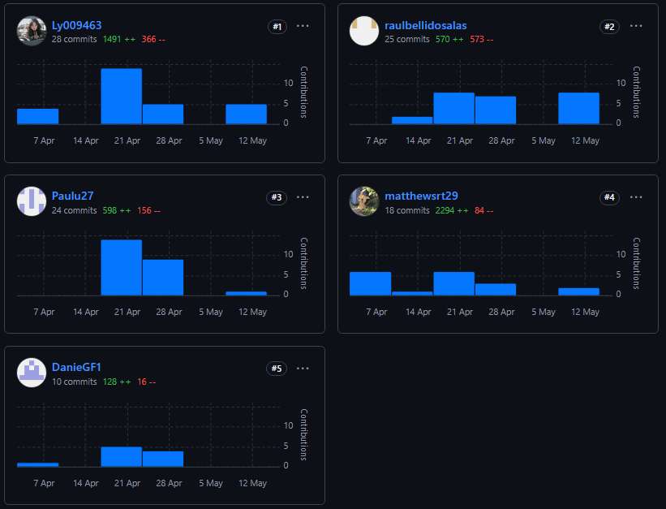
</p> 

*Nota.* Elaboración propia.

<ins>**TB2:**</ins>  
Para la documentación de esta entrega, hemos realizado los commits de nuestras respectivas partes en el repositorio "ProjectReport". A continuación, presentamos los Insights del repositorio mencionado para verificar la participación de cada miembro del equipo.  
**Figura 3**  
*Insights de ProjectReports 3*  
<p align="center">
  
</p> 

*Nota.* Elaboración propia.
<hr>

<ins>**TF:**</ins>  
Para la documentación de esta entrega final, hemos realizado los commits de las partes asignadas a cada uno en el repositorio "ProjectReport". A continuación, presentamos una imagen de los Collaboration Insights del repositorio mencionado para verificar la participación de cada miembro del equipo en esta entrega.  
**Figura 4**  
*Insights del Project Report del TF*  
<p align="center">
  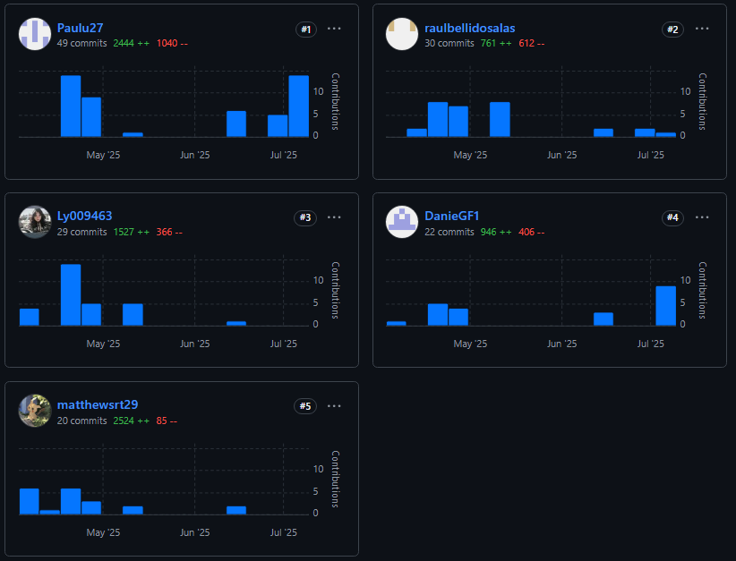
</p> 

*Nota.* Elaboración propia.

# **Tabla de Contenidos**

<a href="#registro-de-versiones-del-informe">Registro de Versiones del Informe</a>

<a href="#project-report-collaboration-insights">Project Report Collaboration Insights</a>

<a href="#tabla-de-contenidos">Tabla de Contenidos</a>

<a href="#student-outcome">Student Outcome</a>

<a href="#capítulo-i-introducción">Capítulo I: Introducción</a>    
    	<ul>
            <a href="#11-startup-profile">1.1. Startup Profile</a><br>
	    <ul>
            <a href="#111-descripción-de-la-startup">1.1.1. Descripción de la Startup</a><br>
            <a href="#112-perfiles-de-integrantes-del-equipo">1.1.2. Perfiles de Integrantes del Equipo</a><br>
	    </ul>
            <a href="#12-solution-profile">1.2. Solution Profile</a><br>
	    <ul>
            <a href="#121-antecedentes-y-problemática">1.2.1. Antecedentes y Problemática</a><br>
            <a href="#122-lean-ux-process">1.2.2. Lean UX Process</a><br>
		<ul>
            <a href="#1221-lean-ux-problem-statements">1.2.2.1. Lean UX Problem Statements</a><br>
            <a href="#1222-lean-ux-assumptions">1.2.2.2. Lean UX Assumptions</a><br>
            <a href="#1223-lean-ux-hypothesis-statements">1.2.2.3. Lean UX Hypothesis Statements</a><br>
            <a href="#1224-lean-ux-canvas">1.2.2.4. Lean UX Canvas</a><br>
		</ul>
	    </ul>
            <a href="#13-segmentos-objetivos">1.3. Segmentos Objetivos</a><br>
        </ul>    


<a href="#capítulo-ii-requirements-elicitation--analysis">Capítulo II: Requirements Elicitation & Analysis</a>
        <ul>
            <a href="#21-competidores">2.1. Competidores</a><br>
		<ul>
            <a href="#211-análisis-competitivo">2.1.1. Análisis competitivo</a><br>
            <a href="#212-estrategias-y-tácticas-frente-a-competidores">2.1.2. Estrategias y tácticas frente a competidores</a><br>
		</ul>
            <a href="#22-entrevistas">2.2. Entrevistas</a><br>
		<ul>
            <a href="#221-diseño-de-entrevistas">2.2.1. Diseño de entrevistas</a><br>
            <a href="#222-registro-de-entrevistas">2.2.2. Registro de entrevistas</a><br>
            <a href="#223-análisis-de-entrevistas">2.2.3. Análisis de entrevistas</a><br>
		</ul>
            <a href="#23-needfinding">2.3. Needfinding</a><br>
		<ul>
            <a href="#231-user-personas">2.3.1. User Personas</a><br>
            <a href="#232-user-task-matrix">2.3.2. User Task Matrix</a><br>
            <a href="#233-user-journey-mapping">2.3.3. User Journey Mapping</a><br>
            <a href="#234-empathy-mapping">2.3.4. Empathy Mapping</a><br>
            <a href="#235-as-is-scenario-mapping">2.3.5. As-is Scenario Mapping</a><br>
		</ul>
            <a href="#24-ubiquitous-language">2.4. Ubiquitous Language</a><br>
        </ul>   

<a href="#capítulo-iii-requirements-specification">Capítulo III: Requirements Specification </a>
        <ul>
            <a href="#31-to-be-scenario-mapping">3.1. To-Be Scenario Mapping</a><br>
            <a href="#32-user-stories">3.2. User Stories</a><br>
            <a href="#33-impact-mapping">3.3. Impact Mapping</a><br>
            <a href="#34-product-backlog">3.4. Product Backlog</a><br>
        </ul>    

<a href="#capítulo-iv-product-design">Capítulo IV: Product Design </a>
        <ul>
            <a href="#41-style-guidelines">4.1. Style Guidelines</a><br>
		<ul>
            <a href="#411-general-style-guidelines">4.1.1. General Style Guidelines</a><br>
            <a href="#412-web-style-guidelines">4.1.2. Web Style Guidelines</a><br>
		</ul>
            <a href="#42-information-architecture">4.2. Information Architecture</a><br>
		<ul>
            <a href="#421-organization-systems">4.2.1. Organization Systems</a><br>
            <a href="#422-labeling-systems">4.2.2. Labeling Systems</a><br>
            <a href="#423-seo-tags-and-meta-tags">4.2.3. SEO Tags and Meta Tags</a><br>
            <a href="#424-searching-systems">4.2.4. Searching Systems</a><br>
            <a href="#425-navigation-systems">4.2.5. Navigation Systems</a><br>
		</ul>
            <a href="#43-landing-page-ui-design">4.3. Landing Page UI Design</a><br>
		<ul>
            <a href="#431-landing-page-wireframe">4.3.1. Landing Page Wireframe</a><br>
            <a href="#432-landing-page-mock-up">4.3.2. Landing Page Mock-up</a><br>
		</ul>
            <a href="#44-web-applications-uxui-design">4.4. Web Applications UX/UI Design</a><br>
		<ul>
            <a href="#441-web-applications-wireframes">4.4.1. Web Applications Wireframes</a><br>
            <a href="#442-web-applications-wire-diagrams">4.4.2. Web Applications Wireflow Diagrams</a><br>
            <a href="#443-web-applications-mock-ups">4.4.3. Web Applications Mock-ups</a><br>
            <a href="#444-web-applications-user-flow-diagrams">4.4.4. Web Applications User Flow Diagrams</a><br>
		</ul>
            <a href="#45-web-applications-prototyping">4.5. Web Applications Prototyping</a><br>
            <a href="#46-domain-driven-software-architecture">4.6. Domain-Driven Software Architecture</a><br>
		<ul>
            <a href="#461-software-architecture-context-diagrams">4.6.1. Software Architecture Context Diagrams</a><br>
            <a href="#462-software-architecture-container-diagrams">4.6.2. Software Architecture Container Diagrams</a><br>
            <a href="#463-software-architecture-components-diagrams">4.6.3. Software Architecture Components Diagrams</a><br>
		</ul>
            <a href="#47-software-object-oriented-design">4.7. Software Object-Oriented Design</a><br>
		<ul>
            <a href="#471-class-diagrams">4.7.1. Class Diagrams</a><br>
            <a href="#472-class-dictionary">4.7.2. Class Dictionary</a><br>
		</ul>
            <a href="#48-database-design">4.8. Database Design</a><br>
		<ul>
            <a href="#481-database-diagram">4.8.1. Database Diagram</a><br>
		</ul>
        </ul>    

<a href="#capítulo-v-product-implementation-validation--deployment">Capítulo V: Product Implementation, Validation & Deployment </a>
        <ul>
            <a href="#51-software-configuration-management">5.1. Software Configuration Management</a><br>
	<ul>
            <a href="#511-software-development-environment-configuration">5.1.1. Software Development Environment Configuration</a><br>
            <a href="#512-source-code-management">5.1.2. Source Code Management</a><br>
            <a href="#513-source-code-style-guide-&-conventions">5.1.3. Source Code Style Guide & Conventions</a><br>
            <a href="#514-software-deployment-configuration">5.1.4. Software Deployment Configuration</a><br>
	</ul>
            <a href="#52-landing-page-services--applications-implementation">5.2. Landing Page, Services & Applications Implementation</a><br>
		<ul>
            <a href="#521-sprint-1">5.2.1. Sprint 1</a><br>
			<ul>
            <a href="#5211-sprint-planning-1">5.2.1.1. Sprint Planning 1</a><br>
            <a href="#5212-aspect-leaders-and-collaborators">5.2.1.2. Aspect Leaders and Collaborators</a><br>
            <a href="#5213-sprint-backlog-1">5.2.1.3. Sprint Backlog 1</a><br>
            <a href="#5214-development-evidence-for-sprint-review">5.2.1.4. Development Evidence for Sprint Review</a><br>
            <a href="#5215-execution-evidence-for-sprint-review">5.2.1.5. Execution Evidence for Sprint Review</a><br>
            <a href="#5216-software-deployment-evidence-for-sprint-review">5.2.1.6. Software Deployment Evidence for Sprint Review</a><br>
            <a href="#5217-team-collaboration-insights-during-sprint">5.2.1.7. Team Collaboration Insights during Sprint</a><br>
			</ul>
	    <a href="#522-sprint-2">5.2.2. Sprint 2</a><br>
			<ul>
            <a href="#5221-sprint-planning-2">5.2.2.1. Sprint Planning 2</a><br>
            <a href="#5222-aspect-leaders-and-collaborators">5.2.2.2. Aspect Leaders and Collaborators</a><br>
            <a href="#5223-sprint-backlog-2">5.2.2.3. Sprint Backlog 2</a><br>
            <a href="#5224-development-evidence-for-sprint-review">5.2.2.4. Development Evidence for Sprint Review</a><br>
            <a href="#5225-execution-evidence-for-sprint-review">5.2.2.5. Execution Evidence for Sprint Review</a><br>
            <a href="#5226-services-documentation-evidence-for-sprint-review">5.2.2.6. Services Documentation Evidence for Sprint Review</a><br>
            <a href="#5227-software-deployment-evidence-for-sprint-review">5.2.2.7. Software Deployment Evidence for Sprint Review</a><br>
            <a href="#5228-team-collaboration-insights-during-sprint">5.2.2.8. Team Collaboration Insights during Sprint</a><br>
			</ul>
	    <a href="#523-sprint-3">5.2.3. Sprint 3</a><br>
			<ul>
            <a href="#5231-sprint-planning-3">5.2.3.1. Sprint Planning 3</a><br>
            <a href="#5232-aspect-leaders-and-collaborators">5.2.3.2. Aspect Leaders and Collaborators</a><br>
            <a href="#5233-sprint-backlog-3">5.2.3.3. Sprint Backlog 3</a><br>
            <a href="#5234-development-evidence-for-sprint-review">5.2.3.4. Development Evidence for Sprint Review</a><br>
            <a href="#5235-execution-evidence-for-sprint-review">5.2.3.5. Execution Evidence for Sprint Review</a><br>
            <a href="#5236-services-documentation-evidence-for-sprint-review">5.2.3.6. Services Documentation Evidence for Sprint Review</a><br>
            <a href="#5237-software-deployment-evidence-for-sprint-review">5.2.3.7. Software Deployment Evidence for Sprint Review</a><br>
            <a href="#5238-team-collaboration-insights-during-sprint">5.2.3.8. Team Collaboration Insights during Sprint</a>
      </ul>
      <a href="#524-sprint-4">5.2.4. Sprint 4</a><br>
      <ul>
            <a href="#5241-sprint-planning-4">5.2.4.1. Sprint Planning 4</a><br>
            <a href="#5242-aspect-leaders-and-collaborators">5.2.4.2. Aspect Leaders and Collaborators</a><br>
            <a href="#5243-sprint-backlog-4">5.2.4.3. Sprint Backlog 4</a><br>
            <a href="#5244-development-evidence-for-sprint-review">5.2.4.4. Development Evidence for Sprint Review</a><br>
            <a href="#5245-execution-evidence-for-sprint-review">5.2.4.5. Execution Evidence for Sprint Review</a><br>
            <a href="#5246-services-documentation-evidence-for-sprint-review">5.2.4.6. Services Documentation Evidence for Sprint Review</a><br>
            <a href="#5247-software-deployment-evidence-for-sprint-review">5.2.4.7. Software Deployment Evidence for Sprint Review</a><br>
            <a href="#5248-team-collaboration-insights-during-sprint">5.2.4.8. Team Collaboration Insights during Sprint</a>
      </ul>
</ul>
<a href="#53-validation-interviews">5.3. Validation Interviews.</a>
<ul>
<a href="#531-diseño-de-entrevistas">5.3.1. Diseño de Entrevistas.</a><br>
<a href="#532-registro-de-entrevistas">5.3.2. Registro de Entrevistas.</a><br>
<a href="#533-evaluaciones-según-heurísticas">5.3.3. Evaluaciones según heurísticas.</a>
</ul>
<a href="#54-video-about-the-product">5.4. Video About-the-Product.</a>
</ul>        

<a href="#conclusiones">Conclusiones</a>
<ul>
  <a href="#recomendaciones">Recomendaciones</a><br>
  <a href="#video-about-the-team">Video About the team</a>
</ul>

<a href="#bibliografía">Bibliografía</a>

<a href="#anexos">Anexos</a>

<hr>

# **Student Outcome**
 

<table border="1">
  <tr>
    <th>Criterio específico</th>
    <th>Acciones realizadas</th>
    <th>Conclusiones</th>
  </tr>
  <tr>
    <td><strong>Trabaja en equipo para proporcionar liderazgo en forma conjunta.</strong></td>
    <td>
      <strong>TB1:</strong><br>
      <strong>Bellido Salas, Raúl</strong><br>
      Participó en la coordinación de tareas de documentación (Style Guidelines, Web Guidelines, Database Diagram) y apoyó en la planeación de las entregas.<br>
      <strong>Daniela Araceli Gómez Flores</strong><br>
      Lideró la estructuración de Impact Mapping y Domain-Driven Software Architecture, fomentando la participación activa de todo el equipo.<br>
      <strong>Gutiérrez Condo, Maylhy Olinda</strong><br>
      Organizó y distribuyó tareas en el diseño de la Landing Page y la Web Application, logrando la colaboración entre diseño y desarrollo.<br>
      <strong>Luyo Correa, Sandra Paula</strong><br>
      Coordinó actividades de entrevistas, análisis de escenarios y documentación de gestión de configuración.<br>
      <strong>Roca Tineo, Steven Mathew</strong><br>
      Lideró técnicamente la implementación de la Landing Page, asignando tareas específicas a los miembros para el Sprint 1 y apoyando a sus compañeros.<br>
      <strong>TP:</strong><br>
      <strong>Luyo Correa, Sandra Paula</strong><br>
      Participó en las correcciones del TB1 y lideró la documentación del Sprint 2. Asumió responsabilidad en el desarrollo de funcionalidades clave como el acceso a configuración de obra y la edición de información.<br>
      <strong>Gómez Flores, Daniela Araceli</strong><br>
      Tomó iniciativa en la implementación de la sección de Incidentes y lideró la creación de la sección de estadísticas generales, incluyendo la integración de un gráfico de asistencia.<br>
      <strong>Gutiérrez Condo, Maylhy Olinda</strong><br>
      Coordinó las correcciones del TB1 y organizó la documentación del Sprint 2. Desarrolló las secciones de inventario para diferentes roles y funcionalidades de edición de perfil y configuración.<br>
      <strong>Roca Tineo, Steven Mathew</strong><br>
      Asumió el liderazgo técnico del ruteo completo de la aplicación, autenticación (login), acceso y creación de proyectos, así como elementos comunes y despliegue de la app. También coordinó la implementación de la internacionalización y manejo de errores.<br>
      <strong>Salas Bellido, Raúl</strong><br>
      Ejecutó el despliegue de la Fake API y de la aplicación. Desarrolló la sección de maquinaria tanto para el supervisor como para el gerente, garantizando su correcto funcionamiento. <br>
      <strong>TB2:</strong><br>
      <strong>Luyo Correa, Sandra Paula</strong><br>
      Realizó del Project Report: Project Report Collaboration Insights, Aspect Leaders and Collaborators, Development Evidence for Sprint Review, Team Collaboration Insights during Sprint 3 y el Diseño de Entrevistas de validación. También realizó los endpoints de configuración de la aplicación<br>
      <strong>Gómez Flores, Daniela Araceli</strong><br>
      Registró las entrevistas de validación en el reporte, también las evaluaciones según heurísticas y las conclusiones. Elaboró los endpoints de incidentes de BuildTruck.<br>
      <strong>Gutiérrez Condo, Maylhy Olinda</strong><br>
      Realizó Execution Evidence for Sprint 3 Review, agregó technical stories y parte del product backlog 3. Realizó fixes al frontend. Hizo los endpoints del bounded context materiales<br>
      <strong>Roca Tineo, Steven Mathew</strong><br>
      En el reporte realizó parte del Sprint Backlog 3, el Software Deployment Evidence for Sprint 3 y Execution Evidence for Sprint Review. Realizó fixes al frontend de BuildTruck. Realizó los endpoints de Autenticación, Usuarios y carpeta shared de BuildTruck.<br>
      <strong>Salas Bellido, Raúl</strong><br>
      En el reporte, realizó el Sprint Planning 3 y Services Documentation Evidence for Sprint Review. En el backend hizo los endpoints de maquinaria.<br>
      <strong>TF:</strong><br>
      <strong>Luyo Correa, Sandra Paula</strong><br>
      Para el reporte del TF, registró los cambios hechos en el reporte, Project Report Collaboration Insights y el Student Outcome. También del Sprint 4 realizó Aspect Leaders and Collaborators y el Team Collaboration Insights during Sprint. Corrigió fallos de los endpoints de configurations en el backend y los unió con el frontend.<br>
      <strong>Gómez Flores, Daniela Araceli</strong><br>
      En esta última entrega del reporte, corrigió errores del TB2 también elaboró el Sprint Planning 4, Development Evidence for Sprint Review y conclusiones. Corrigió fallos de los endpoints de incidents en el backend y los unió con el frontend.<br>
      <strong>Gutiérrez Condo, Maylhy Olinda</strong><br>
      Para el reporte del TF, realizó parte del Sprint Backlog 4 y recomendaciones del trabajo. Actualizó y mejoró el frontend de BuildTruck y unió sus endpoints de materiales con el frontend de la aplicación.<br>
      <strong>Roca Tineo, Steven Mathew</strong><br>
      En la realización del reporte del TF, se encargó de parte del Sprint Backlog 4 y Execution Evidence for Sprint Review, también realizó correcciones del TB2. Se encargó también de organizar y construir la unión del backend con el frontend, así como los bounded contexts autenticación, usuarios y shared.<br>
      <strong>Salas Bellido, Raúl</strong><br>
      Se encargó de realizar en el reporte del TF: Services Documentation Evidence for Sprint Review y el Software Deployment Evidence for Sprint Review. Colocó los videos en la landing page. Corrigió fallos de los endpoints de maquinarias en el backend y los unió con el frontend.
    </td>
    <td>
      <strong>TB1:</strong><br>
      Todos los miembros ejercieron liderazgo conjunto en distintas etapas del proyecto, distribuyendo responsabilidades de manera efectiva. La colaboración permitió alcanzar los objetivos de cada sprint y capítulo, evidenciando la capacidad del equipo para funcionar de manera integrada y equitativa.<br>
      <strong>TP:</strong><br>
      El liderazgo fue ejercido de forma rotativa y equitativa según los requerimientos técnicos de cada componente. Todos los miembros tomaron decisiones relevantes en sus áreas asignadas y contribuyeron activamente a la coordinación de tareas. Se evidencia un liderazgo distribuido y efectivo, que impulsó el avance del proyecto con responsabilidad compartida.<br>
      <strong>TB2:</strong><br>
      En esta entrega, como equipo BuildWise, demostramos nuestra capacidad de trabajar en conjunto asumiendo el liderazgo de forma compartida, según las necesidades del proyecto BuildTruck. Cada integrante tomó iniciativa en distintos frentes, liderando la elaboración de reportes, el diseño de entrevistas de validación, la implementación técnica de funcionalidades y la documentación de avances. Esta distribución equilibrada de responsabilidades nos permitió avanzar de manera organizada, potenciando nuestras fortalezas individuales en beneficio del equipo. Gracias a esta colaboración equitativa y al liderazgo distribuido, logramos consolidar una versión más robusta y alineada con los objetivos de BuildTruck.<br>
      <strong>TF:</strong><br>
      En esta etapa final, el trabajo en equipo fue esencial para proporcionar liderazgo compartido en las diversas áreas del proyecto BuildTruck. Cada miembro asumió responsabilidades específicas y lideró aspectos técnicos y documentales, desde la integración de módulos funcionales hasta la consolidación del reporte. La coordinación entre nosotros permitió solucionar errores, tomar decisiones de manera consensuada y avanzar como un equipo cohesionado. Esta entrega refleja cómo el liderazgo no se centró en una sola persona, sino que fue asumido de forma conjunta y efectiva para lograr una entrega final sólida y completa.
    </td>
  </tr>
  <tr>
    <td><strong>Crea un entorno colaborativo e inclusivo, establece metas, planifica tareas y cumple objetivos.</strong></td>
    <td>
      <strong>TB1:</strong><br>
      <strong>Bellido Salas, Raúl</strong><br>
      Contribuyó en establecer los lineamientos de diseño y base de datos, trabajando de forma inclusiva y coordinada.<br>
      <strong>Daniela Araceli Gómez Flores</strong><br>
      Promovió la planificación clara en Impact Mapping, organizando reuniones para definir objetivos de arquitectura.<br>
      <strong>Gutiérrez Condo, Maylhy Olinda</strong><br>
      Facilitó un entorno inclusivo durante la creación de diseños de interfaz, alentando las ideas de todos los integrantes.<br>
      <strong>Luyo Correa, Sandra Paula</strong><br>
      Planificó tareas específicas para la documentación de Software Configuration Management y prototipado de aplicaciones.<br>
      <strong>Roca Tineo, Steven Mathew</strong><br>
      Coordinó la implementación de la Landing Page, estableciendo metas de avance técnico y validando el cumplimiento de cada tarea.<br>
      <strong>TP:</strong><br>
      <strong>Luyo Correa, Sandra Paula</strong><br>
      Facilitó un entorno ordenado en la gestión de documentación y planificación del Sprint 2, fomentando una participación inclusiva durante la implementación de las funcionalidades de configuración y edición.<br>
      <strong>Gómez Flores, Daniela Araceli</strong><br>
      Propició la colaboración en el desarrollo de funcionalidades críticas. Coordinó esfuerzos para la sección de estadísticas, asegurando la integración adecuada del gráfico de asistencia.<br>
      <strong>Gutiérrez Condo, Maylhy Olinda</strong><br>
      Estimuló la participación del equipo en las decisiones sobre funcionalidades compartidas. Planificó las tareas de edición y configuración de forma clara, permitiendo el cumplimiento de los objetivos en tiempo y forma.<br>
      <strong>Roca Tineo, Steven Mathew</strong><br>
      Estableció metas claras en el despliegue y ruteo de la app, apoyando a sus compañeros con componentes reutilizables e impulsando el trabajo colaborativo técnico.<br>
      <strong>Bellido Salas, Raúl</strong><br>
      Coordinó con sus compañeros el despliegue de herramientas clave como la Fake API y funcionalidades críticas como la sección de maquinaria, garantizando la integración fluida con el resto del sistema. <br>
      <strong>TB2:</strong><br>
      <strong>Luyo Correa, Sandra Paula</strong><br>
      Realizó del Project Report: Project Report Collaboration Insights, Aspect Leaders and Collaborators, Development Evidence for Sprint Review, Team Collaboration Insights during Sprint 3 y el Diseño de Entrevistas de validación. También realizó los endpoints de configuración de la aplicación<br>
      <strong>Gómez Flores, Daniela Araceli</strong><br>
      Registró las entrevistas de validación en el reporte, también las evaluaciones según heurísticas y las conclusiones. Elaboró los endpoints de incidentes de BuildTruck.<br>
      <strong>Gutiérrez Condo, Maylhy Olinda</strong><br>
      Realizó Execution Evidence for Sprint 3 Review, agregó technical stories y parte del product backlog 3. Realizó fixes al frontend. Hizo los endpoints del bounded context materiales<br>
      <strong>Roca Tineo, Steven Mathew</strong><br>
      En el reporte realizó parte del Sprint Backlog 3, el Software Deployment Evidence for Sprint 3 y Execution Evidence for Sprint Review. Realizó fixes al frontend de BuildTruck. Realizó los endpoints de Autenticación, Usuarios y carpeta shared de BuildTruck.<br>
      <strong>Salas Bellido, Raúl</strong><br>
      En el reporte, realizó el Sprint Planning 3 y Services Documentation Evidence for Sprint Review. En el backend hizo los endpoints de maquinaria.<br>
      <strong>TF:</strong><br>
      <strong>Luyo Correa, Sandra Paula</strong><br>
      Para el reporte del TF, registró los cambios hechos en el reporte, Project Report Collaboration Insights y el Student Outcome. También del Sprint 4 realizó Aspect Leaders and Collaborators y el Team Collaboration Insights during Sprint. Corrigió fallos de los endpoints de configurations en el backend y los unió con el frontend.<br>
      <strong>Gómez Flores, Daniela Araceli</strong><br>
      En esta última entrega del reporte, corrigió errores del TB2 también elaboró el Sprint Planning 4, Development Evidence for Sprint Review y conclusiones. Corrigió fallos de los endpoints de incidents en el backend y los unió con el frontend.<br>
      <strong>Gutiérrez Condo, Maylhy Olinda</strong><br>
      Para el reporte del TF, realizó parte del Sprint Backlog 4 y recomendaciones del trabajo. Actualizó y mejoró el frontend de BuildTruck y unió sus endpoints de materiales con el frontend de la aplicación.<br>
      <strong>Roca Tineo, Steven Mathew</strong><br>
      En la realización del reporte del TF, se encargó de parte del Sprint Backlog 4 y Execution Evidence for Sprint Review, también realizó correcciones del TB2. Se encargó también de organizar y construir la unión del backend con el frontend, así como los bounded contexts autenticación, usuarios y shared.<br>
      <strong>Salas Bellido, Raúl</strong><br>
      Se encargó de realizar en el reporte del TF: Services Documentation Evidence for Sprint Review y el Software Deployment Evidence for Sprint Review. Colocó los videos en la landing page. Corrigió fallos de los endpoints de maquinarias en el backend y los unió con el frontend.
    </td>
    <td>
      <strong>TB1:</strong><br>
      El equipo creó un ambiente de colaboración donde se respetaron las opiniones y contribuciones de todos los integrantes. Las metas y tareas fueron claramente definidas y cumplidas a lo largo del proyecto, gracias a una comunicación efectiva y planificación organizada.<br>
      <strong>TP:</strong><br>
      El equipo demostró una organización sólida y colaborativa, en la que cada miembro contribuyó al cumplimiento de objetivos técnicos y de planificación. Se fomentó un entorno inclusivo, donde todas las ideas fueron consideradas y las tareas se distribuyeron eficientemente, consolidando el avance del proyecto en cada etapa del sprint.<br>
      <strong>TB2:</strong><br>
      Como equipo BuildWise, nuestro objetivo en esta entrega fue fortalecer el desarrollo colaborativo de BuildTruck, nuestra aplicación para el buen manejo de obras de construcción. Para lograrlo, establecimos metas claras, planificamos tareas específicas y trabajamos de manera coordinada, asegurando la participación activa de todos los integrantes. Cada miembro aportó desde su rol, ya sea en la elaboración del Project Report, diseño y análisis de entrevistas de validación, desarrollo de endpoints para los distintos módulos del sistema o la documentación de evidencia técnica. Esta entrega refleja nuestro compromiso con un entorno inclusivo, donde la comunicación, la planificación y el cumplimiento de objetivos fueron clave para avanzar con solidez hacia una solución útil para el sector construcción.<br>
      <strong>TF:</strong><br>
      Durante el desarrollo del trabajo final, en BuildWise mantuvimos un entorno de colaboración activa e inclusiva, donde cada integrante participó en la planificación y ejecución de tareas clave. Establecimos metas claras como la finalización del Sprint 4, la integración completa entre backend y frontend, y la mejora del reporte final. Coordinamos esfuerzos para cumplir estos objetivos mediante correcciones, mejoras y documentación técnica. Esta entrega evidencia cómo, mediante una organización efectiva y la participación equitativa de todos, consolidamos los avances funcionales y formales de BuildTruck.
    </td>
  </tr>
</table>

# 
<hr>

# **Capítulo I: Introducción** 

## **1.1. Startup Profile**

### ***1.1.1. Descripción de la Startup***

BuildWise es una startup tecnológica orientada al desarrollo de soluciones digitales que optimizan la gestión operativa de las empresas del sector construcción. Esta iniciativa surge como respuesta a la necesidad urgente de digitalizar y eficientizar los procesos relacionados con el control de almacén, personal y obreros, aspectos fundamentales en el éxito de cualquier proyecto constructivo.

Fundada por estudiantes de Ingeniería de Software de la Universidad de Ciencias Aplicadas de Perú, la startup tiene como propósito brindar herramientas tecnológicas accesibles, escalables y de fácil implementación que faciliten el seguimiento en tiempo real de recursos y personal en obra.

**Servicios y Producto Principal:**  
Su producto principal es BuildTruck, una plataforma web diseñada para permitir a las empresas constructoras llevar un control eficiente y centralizado de sus operaciones en tres áreas clave: inventario, personal y obreros. 

**Visión:**  
Ser la plataforma líder en soluciones tecnológicas para el sector construcción en América Latina, transformando la gestión de proyectos en obra a través de herramientas inteligentes y colaborativas.

**Misión:**   
Proporcionar a las empresas constructoras una plataforma digital integral que facilite el control de recursos, personal y operatividad en obra, contribuyendo a una gestión más eficiente, transparente y productiva.


### ***1.1.2. Perfiles de Integrantes del Equipo***
<p align="center">
  
</p>

<p align="center">
  
</p> 

<p align="center">
  
</p> 

<p align="center">
  
</p> 

<p align="center">
  
</p> 

## **1.2. Solution Profile**

### ***1.2.1. Antecedentes y problemática***

***What:***

¿Cuál es el problema?

En las pequeñas y medianas empresas del sector construcción en Perú, hay una evidente falta de digitalización en los procesos operativos clave como el control de almacén, personal y obreros. Estas tareas siguen gestionándose en papel o con herramientas no especializadas, lo que genera retrasos, errores y dificultades para tomar decisiones. Según el Informe Económico de la Construcción 2023 de CAPECO, más del 65% de las constructoras MYPE aún usan métodos manuales para el seguimiento de sus recursos.

¿Cuál es la relación con la persona en cuestión?
Los supervisores de obra y asistentes administrativos son los principales afectados por esta ineficiencia. Ellos ejecutan el control diario de materiales y personal, pero no cuentan con herramientas que se adapten a la realidad del campo, por lo que terminan con sobrecarga de trabajo y dificultades para comunicar datos con rapidez a las oficinas administrativas.

***When:***

¿Cuándo sucede el problema?
El problema se presenta de forma constante durante toda la jornada laboral. Desde el ingreso de materiales al almacén, hasta el cierre diario con los reportes de asistencia del personal y el avance físico de la obra.

Como señala el Observatorio Laboral del Ministerio de Trabajo (2022), la intensidad operativa en obras hace que se necesite información actualizada en tiempo real, cosa que no se logra con registros manuales.

¿Cuándo utiliza el cliente el producto?
La plataforma BuildTruck sería utilizada durante horarios de trabajo, y especialmente en momentos clave como el inicio de faenas, recepción de insumos, control de asistencia y envío de reportes a las oficinas centrales.

***Where:***

¿Dónde está el cliente cuando utiliza el producto?
Los supervisores suelen estar físicamente en la obra, moviéndose entre áreas como almacén, oficinas temporales, y zonas de trabajo de obreros. Por su parte, los asistentes administrativos se encuentran en oficinas.

¿A dónde se dirige?
Se movilizan constantemente entre distintas áreas del proyecto: almacén, zonas de construcción y oficinas.

Según el Ministerio de Vivienda, Construcción y Saneamiento (2023), la dispersión del entorno de trabajo es un desafío clave en la coordinación de recursos en obra.

¿Dónde surge el problema?
Principalmente en campo. Por ejemplo, al no poder confirmar la disponibilidad de un material necesario o al detectar errores en los registros de asistencia. Pero también ocurre al emitir informes semanales desde oficinas sin una base de datos.

***Who:***

¿Quiénes están involucrados?
Supervisores de obra, asistentes administrativos, encargados de almacén, ingenieros residentes, jefes de proyecto y personal operativo de la constructora.

¿A quiénes les sucede el problema?
A los supervisores que no pueden verificar avances sin recorrer toda la obra y a los asistentes que deben consolidar manualmente datos desde múltiples fuentes. Esto genera presión adicional, pérdida de productividad y retrabajo.

¿Quién lo utilizará?
BuildTruck será utilizado principalmente por supervisores y asistentes, pero también puede ser una herramienta útil para ingenieros residentes o gerencias.

Como indica el BID (2022) en su informe sobre transformación digital en sectores tradicionales, herramientas adaptadas al flujo real de trabajo incrementan la productividad hasta en un 30%.

***Why:***

¿Por qué ocurre esta situación?
La razón principal es la baja madurez digital del sector construcción en el Perú. Muchas MYPES no invierten en software por desconocimiento, miedo al cambio o falta de personal capacitado. El estudio de PwC LATAM (2021) reveló que más del 70% de empresas constructoras en la región operan con bajo o nulo nivel de digitalización, especialmente en obras medianas y pequeñas.

***How:***

¿En qué condiciones los clientes usan nuestro producto?
En oficinas, la plataforma se usaría en PC o laptop, con conexión más estable y mayor necesidad de generar reportes o visualizar estadísticas.

¿Cómo nos conocieron los compradores?
Los compradores pueden conocer el servicio a través de redes como LinkedIn, o por alianzas estratégicas con gremios.

¿Cómo prefieren acceder al contenido?
Por medio de interfaces visuales, dashboards simples y reportes automáticos. Necesitan ver la información de forma clara y rápida, sin procesos complejos. Debe poder usarse sin formación técnica avanzada, ya que muchos usuarios no tienen experiencia previa con software especializado.

***How Much:***

La falta de digitalización en el sector construcción genera impactos significativos en la eficiencia operativa de las empresas:

- Pérdida de productividad: La gestión manual ralentiza los procesos y aumenta los costos operativos. Según PwC (2021), las empresas que implementan soluciones digitales experimentan mejoras en productividad y reducción de costos operativos.

- Errores y retrabajos: La falta de un sistema centralizado genera errores y retrabajos, afectando la calidad de las obras. Un informe de CAPECO (2020) menciona que la ineficiencia en la gestión es una de las principales causas de retrasos en la construcción.

- Dificultades en la toma de decisiones: La falta de datos en tiempo real limita la capacidad de tomar decisiones informadas, lo que afecta la rentabilidad y competitividad. McKinsey (2020) señala que las empresas digitales toman decisiones más rápidas y precisas, mejorando su competitividad.

<p align="center">
  
</p>

### ***1.2.2. Lean UX Process***

#### **1.2.2.1. Lean UX Problem Statements**


1. Nuestra plataforma ha sido diseñada para permitir a pequeñas y medianas empresas constructoras, así como a trabajadores administrativos, gestionar eficientemente sus proyectos de construcción, desde la solicitud de servicios hasta el monitoreo de avances y gastos. A través de esta herramienta digital, buscamos facilitar la administración y mejorar la transparencia de los procesos constructivos.
Hemos observado que una de las principales dificultades para estas empresas es la falta de un sistema centralizado y amigable que les permita realizar un seguimiento detallado de los proyectos en curso, registrar avances, visualizar presupuestos y comunicarse de forma efectiva con los diferentes actores involucrados en la obra. Esto genera desorganización, demoras en la entrega de reportes y problemas en la toma de decisiones.
¿Cómo podemos mejorar la experiencia de las pequeñas y medianas empresas en la gestión de sus obras mediante una plataforma más intuitiva, accesible y con herramientas integradas que faciliten el seguimiento de cada fase del proyecto?

2. Nuestro sistema fue creado con el objetivo de optimizar la gestión de proyectos de construcción, reducir errores administrativos y proporcionar a los usuarios una visión clara y precisa del estado de sus obras, recursos utilizados y cumplimiento de plazos.
Hemos identificado que muchos trabajadores administrativos aún dependen de hojas de cálculo, comunicaciones dispersas para registrar y compartir información. Esto no solo dificulta el acceso a datos actualizados, sino que también incrementa la posibilidad de errores y retrabajos.

¿Cómo podemos digitalizar y automatizar los procesos administrativos dentro de los proyectos de construcción, garantizando que los trabajadores administrativos cuenten con herramientas fáciles de usar que les permitan organizar, registrar y compartir información de forma eficiente?

3. Además, hemos detectado que algunas pequeñas empresas enfrentan barreras tecnológicas, ya sea por desconocimiento en el uso de herramientas digitales o por la falta de plataformas diseñadas específicamente para su contexto. Esto puede llevar a que no aprovechen completamente los beneficios de una solución digital.

¿Cómo podemos diseñar una plataforma adaptable a diferentes niveles de experiencia tecnológica, que permita a empresas de distintos tamaños adoptar y aprovechar fácilmente todas las funcionalidades del sistema sin requerir una curva de aprendizaje elevada?


#### **1.2.2.2. Lean UX Assumptions**

**Assumptions worksheet**

1. Creo que mis clientes necesitan una forma moderna de realizar la gestión de obras.

2. Estas necesidades se pueden resolver con una aplicación web simple de entender para poder realizar la gestión de los materiales y trabajadores de una obra.

3. Mis clientes iniciales son jóvenes de 20 a 30 años de edad y adultos de 40 a 60 años de edad que buscan mejorar la gestión de sus proyectos.

4. El valor #1 que un cliente quiere en mi servicio es eficiencia para poder realizar todas sus tareas en el menor tiempo posible.

5. Haré dinero a través de un sistema de subscripciones mensuales de diferentes escalones, cada uno ofreciendo más beneficios, pero a mayor costo.

6. Mi competencia principal en el mercado serán otras plataformas usadas para la gestión de obras.

7. Los venceremos debido a nuestra interfaz simple y eficaz. Ofreceremos herramientas entendibles para poder facilitar los procesos de los gerentes y supervisores.

8. Mi mayor riesgo de producto es que nuestros clientes no puedan adaptarse al funcionamiento de la plataforma.

9. Resolveremos a través de tutoriales y contenido informativo sobre el uso de nuestro producto.

**¿Quién es el usuario?**

Los gerentes  y los supervisores de obra .

**¿Dónde encaja nuestro producto en su trabajo o vida?**

Nuestro producto, buildtrack, encaja en la vida laboral de los usuarios al proporcionarles un sitio web en donde puedan gestionar el inventario y mano de obra.

**¿Qué problemas tiene nuestro producto y cómo se puede resolver?**

* Posible lentitud con gran cantidad de datos:

  Solución: Optimización del backend y uso de bases de datos eficientes.

* Conectividad limitada en zonas de obra:

  Solución: Implementación de un modo offline que sincronice datos cuando haya conexión.

* Resistencia al cambio por parte del personal:

  Solución: Capacitación y diseño intuitivo que reduzca la curva de aprendizaje.

**¿Cuándo y cómo es usado nuestro producto?**

Buildtrack es utilizado durante la jornada laboral, en especial en momentos clave como:

* Registro de ingreso/salida de materiales.


* Verificación de asistencia del personal.


* Generación de reportes semanales o diarios.


* Consulta del avance de obras.

**¿Qué características son importantes?**

Tiene que ofrecer Información actualizada al momento para una toma de decisiones precisa. Tiene que presentar una interfaz simple y de uso intuitivo. Tiene que ser accesible desde cualquier dispositivo. Finalmente, tiene que presentar soporte para una gran cantidad de datos sin perder estabilidad en el rendimiento.

**¿Cómo debe verse nuestro producto y cómo debe comportarse?**

Tiene que presentar un diseño simple y legible, con fuentes claras, y una jerarquia visual limpia.

Tiene que presentar una paleta de colores contrastante para facilitar su lectura.

Debe de presentar un comportamiento fluido en sus interacciones.
 
#### 1.2.2.3. Lean UX Hypothesis Statements
* Creemos que las funciones que brinda BuildTrack son útiles y eficientes para poder llevar un buen manejo de empresas de construcción. Sabremos que hemos tenido éxito cuando el 60% de nuestros usuarios haya renovado su suscripción.  
* Creemos que una funcionalidad que ajuste dinámicamente los niveles de inventario según el tamaño del proyecto reducirá los pedidos innecesarios de materiales, y lo sabremos porque el sistema registrará una disminución del 20% en órdenes de reposición duplicadas en los primeros dos meses.  
* Creemos que permitir la sincronización automática de datos entre inventario, personal y obreros en una sola plataforma web optimizará la toma de decisiones, y lo sabremos porque el tiempo promedio para generar reportes operativos completos será inferior a 30 minutos.  
* Creemos que una plataforma web que consolide todos los datos de inventario en un panel centralizado reducirá el tiempo necesario para conciliar existencias físicas y digitales, y lo sabremos porque el sistema registrará un promedio de actualización de inventario inferior a 40 minutos por operación.

# 
#### **1.2.2.4. Lean UX Canvas**
<p align="center">
  
</p>


## **1.3. Segmentos Objetivos**

<ins>**Segmento Objetivo 1: Gerentes de obra**</ins>  

Los gerentes de obra son profesionales clave en la ejecución de proyectos constructivos, especialmente en el contexto de pequeñas y medianas empresas (PYMEs) peruanas. Su rol abarca desde la supervisión técnica en campo hasta la toma de decisiones administrativas, actuando como eje articulador entre el personal operativo, los proveedores, los subcontratistas y la alta dirección. Esta versatilidad responde a la estructura operativa reducida que caracteriza a muchas PYMEs del sector construcción, donde un mismo profesional debe asumir múltiples responsabilidades.

#### **Características demográficas**

* **Ubicación:** Distritos urbanos y semiurbanos de Lima Metropolitana, como San Juan de Lurigancho, Villa El Salvador, Ate y San Martín de Porres, donde se concentra un gran número de empresas constructoras pequeñas y medianas.

* **Edad:** Entre 28 y 50 años, con una media aproximada de 38 años.

* **Nivel socioeconómico:** Clase media.

#### **Problemáticas actuales**

Según el estudio de Mesías y Vásquez (2020), las empresas constructoras que edifican proyectos multifamiliares en zonas como Lima Top y Lima Moderna operan con equipos de obra conformados por tan solo cinco a seis integrantes. Esta estructura operativa limitada obliga al gerente de obra a asumir múltiples funciones simultáneamente: tareas técnicas, supervisión logística, control de calidad y responsabilidades administrativas (p. 57). Esta concentración de funciones incrementa su carga operativa y reduce significativamente su capacidad para realizar un monitoreo integral en tiempo real, elevando el riesgo de errores por falta de sistematización.

A esta sobrecarga se suma un entorno aún poco digitalizado. Como advierten Cordero, Rondán y Carrascosa (2021), incluso en empresas que cuentan con software de planificación, las operaciones en campo siguen dependiendo de canales informales como WhatsApp, correos electrónicos o registros en papel. Este modelo fragmentado provoca desorganización, duplicación de información, retrasos en la toma de decisiones y, en última instancia, una mayor presión sobre el gerente de obra.

Una de las áreas más afectadas por esta situación es la gestión de observaciones y no conformidades. Mesías y Vásquez (2020) documentaron que, utilizando métodos tradicionales, el personal técnico de obra —incluyendo al gerente— invierte entre 18 y 24 horas semanales exclusivamente en el seguimiento de observaciones. No obstante, la implementación de herramientas móviles digitales permitió reducir este tiempo hasta en un 60 %, lo cual impactó positivamente en la eficiencia operativa y la calidad del registro de información (pp. 68–70).
<p align="center">
  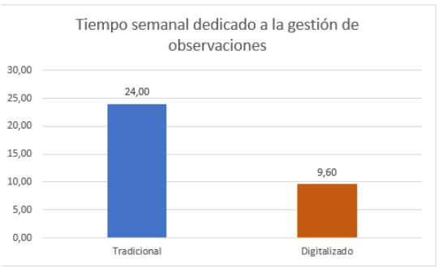
</p>

*fuente: elaboración propia*


#### **Segmento Objetivo 2:  Supervisores de obra**   

Los supervisores de obra desempeñan un rol operativo esencial dentro de las PYMEs constructoras, al encargarse de tareas diarias como el control de materiales, la asistencia del personal, la verificación de condiciones en obra, la elaboración de reportes técnicos y la supervisión de cumplimiento normativo. Son el puente entre lo que ocurre en campo y lo que se comunica a la gerencia.

#### **Características demográficas**

* **Ubicación:** Distritos con alta densidad constructiva en Lima Metropolitana, como La Victoria, El Agustino, Independencia y Cercado de Lima.

* **Edad:** Entre 22 y 35 años.

* **Nivel socioeconómico:** Clase media.

#### **Problemáticas actuales**

En muchas PYMEs del sector construcción, los supervisores operan sin herramientas tecnológicas adecuadas, dependiendo de formatos físicos, cuadernos, y canales informales como WhatsApp o correo electrónico para registrar datos relevantes. Esta falta de sistematización genera errores, pérdida de información, retrabajos y retrasos en la toma de decisiones.

Según González Rangel (2009), la eficiencia promedio del sistema de supervisión en obra se encuentra por debajo del 70 %, debido principalmente a la carencia de procesos claros, capacitación y metodologías estandarizadas (p. 9). Además, destaca que la industria de la construcción fue el sector con mayor número de accidentes laborales reportados en México en 2006, con 29,956 casos y una tasa de 3.18 por cada 100 trabajadores (p. 3). Esta situación evidencia la necesidad de fortalecer el papel del supervisor como responsable del control operativo y la seguridad en obra.

La alta incidencia de accidentes en este sector revela la urgencia de herramientas que permitan a los supervisores sistematizar y controlar sus procesos de manera más eficiente. Un software como *BuildTruck* ofrece la posibilidad de centralizar el registro de condiciones de seguridad, asistencia, entradas y salidas de materiales, y observaciones técnicas desde un solo dispositivo, ayudando a reducir errores humanos, prevenir riesgos y mejorar la trazabilidad de la información crítica.


<hr>

# **Capítulo II: Requirements Elicitation & Analysis**

## **2.1. Competidores**

### ***2.1.1. Análisis competitivo***

<body>
<table class="c16">
<tr class="c1">
<td class="c13" colspan="6" rowspan="1"><p>Competitive Analysis Landscape</p></td>
</tr>
<tr class="c1">
<td class="c11" colspan="2" rowspan="1"><p>¿Por qué llevar a cabo este análisis?</p></td>
<td class="c17" colspan="4" rowspan="1"><p>Elaborar este análisis es esencial para entender el posicionamiento de BuildTruck en el mercado de software de gestión para la construcción, identificar oportunidades de diferenciación y anticipar amenazas de competidores establecidos. Esto permite ajustar la propuesta de valor, optimizar estrategias de marketing y producto, y garantizar que BuildTruck responda a las necesidades específicas de las empresas constructoras, especialmente en un sector que está adoptando rápidamente la digitalización.</p></td>
</tr>
<tr class="c1">
<td class="c11" colspan="2" rowspan="1"><p></p></td>
<td class="c0" colspan="1" rowspan="1"><p>BuildTruck</p><p></p></td>
<td class="c0" colspan="1" rowspan="1"><p>Procore</p><p></p></td>
<td class="c0" colspan="1" rowspan="1"><p>Buildertrend</p><p></p></td>
<td class="c0" colspan="1" rowspan="1"><p>PlanGrid</p><p></p></td>
</tr>
<tr class="c1">
<td class="c0" colspan="1" rowspan="2"><p>Perfil</p></td>
<td class="c0" colspan="1" rowspan="1"><p>Overview</p></td>
<td class="c0" colspan="1" rowspan="1"><p>BuildTruck es una plataforma web que centraliza la gestión operativa de empresas constructoras en tres áreas clave: inventario, personal y obreros, con un enfoque en accesibilidad y escalabilidad.</p></td>
<td class="c0" colspan="1" rowspan="1"><p>Procore es una plataforma que ayuda a optimizar y administrar proyectos de construcción desde la etapa previa hasta su finalización.</p></td>
<td class="c0" colspan="1" rowspan="1"><p>Buildertrend es un software de gestión de construcción diseñada para simplificar la comunicación y administrar proyectos, con un enfoque en construcciones de casas y remodeladores.</p></td>
<td class="c0" colspan="1" rowspan="1"><p>PlanGrid es una herramienta enfocada en la gestión de planos y documentos en tiempo real, con capacidades extendidas para la gestión de proyectos.</p></td>
</tr>
<tr class="c1">
<td class="c0" colspan="1" rowspan="1"><p>Ventaja competitiva ¿Qué valor ofrece a los clientes?</p></td>
<td class="c0" colspan="1" rowspan="1"><p>Su diseño simple y específico para PYMES constructoras, combinado con un enfoque en seguimiento en tiempo real y costos asequibles, la posiciona como una alternativa práctica frente a soluciones más complejas y costosas.</p></td>
<td class="c0" colspan="1" rowspan="1"><p>Ofrece productos y servicios de gestión de preconstrucción, administración de proyectos, finanzas, recursos y datos. También brinda soporte de expertos de construcción.</p></td>
<td class="c0" colspan="1" rowspan="1"><p>Su facilidad de uso y herramientas específicas para la comunicación con clientes (portales de clientes) lo hacen ideal para pequeñas y medianas empresas que buscan mejorar la experiencia del cliente.</p></td>
<td class="c0" colspan="1" rowspan="1"><p>Su integración con el ecosistema Autodesk (como AutoCAD y BIM 360) y su especialización en la gestión de planos digitales ofrecen un valor único para empresas que dependen de diseños técnicos precisos.</p></td>
</tr>
<tr class="c1">
<td class="c0" colspan="1" rowspan="2"><p>Perfil de Marketing</p></td>
<td class="c0" colspan="1" rowspan="1"><p>Mercado objetivo</p></td>
<td class="c0" colspan="1" rowspan="1"><p>Gerentes de obra de obra y supervisores de obra de obra.</p></td>
<td class="c0" colspan="1" rowspan="1"><p>Empresas constructoras de todos los tamaños, desde pequeñas firmas hasta grandes contratistas generales, con un enfoque en proyectos comerciales y residenciales.</p></td>
<td class="c0" colspan="1" rowspan="1"><p>Principalmente constructores residenciales, remodeladores y contratistas especializados de pequeño a mediano tamaño.</p></td>
<td class="c0" colspan="1" rowspan="1"><p>Contratistas, arquitectos e ingenieros en proyectos comerciales e industriales de mediano a gran tamaño.</p></td>
</tr>
<tr class="c1">
<td class="c0" colspan="1" rowspan="1"><p>Estrategias de marketing</p></td>
<td class="c0" colspan="1" rowspan="1"><p>Enfoque en marketing digital por redes sociales enfocado en gerentes de obra de obra y supervisores de obra de obra, webinars para explicar el funcionamiento de la plataforma y una versión de prueba gratuita.</p></td>
<td class="c0" colspan="1" rowspan="1"><p>Publicidad digital enfocada en la productividad y la escalabilidad, presencia en eventos de la industria (como ferias de construcción), y contenido educativo (webinars, guías) para atraer a gerentes de proyectos y dueños de empresas.</p></td>
<td class="c0" colspan="1" rowspan="1"><p>Marketing de contenido (blogs, videos tutoriales), campañas en redes sociales dirigidas a propietarios de negocios, y programas de referidos para fomentar la adopción.</p></td>
<td class="c0" colspan="1" rowspan="1"><p>Colaboración con Autodesk para campañas globales, enfoque en la digitalización de planos, y presencia en conferencias técnicas y de diseño.</p></td>
</tr>
<tr class="c1">
<td class="c0" colspan="1" rowspan="3"><p>Perfil de Producto</p></td>
<td class="c0" colspan="1" rowspan="1"><p>Productos & Servicios</p></td>
<td class="c0" colspan="1" rowspan="1"><p>Gestión de inventario, seguimiento del personal, reportes operativos en tiempo real, y herramientas móviles.</p></td>
<td class="c0" colspan="1" rowspan="1"><p>Gestión de proyectos, control de documentos, seguimiento de recursos, reportes financieros, y aplicaciones móviles para uso en obra.</p></td>
<td class="c0" colspan="1" rowspan="1"><p>Gestión de proyectos, programación, seguimiento de costos, comunicación con clientes, y herramientas móviles.</p></td>
<td class="c0" colspan="1" rowspan="1"><p>Gestión de planos, colaboración en tiempo real, seguimiento de tareas, y reportes de campo.</p></td>
</tr>
<tr class="c1">
<td class="c0" colspan="1" rowspan="1"><p>Precios & Costos</p></td>
<td class="c0" colspan="1" rowspan="1"><p>Modelo de suscripción desde $50/mes (plan básico) hasta $200/mes para funciones avanzadas, con opciones escalables.</p></td>
<td class="c0" colspan="1" rowspan="1"><p>Modelo de suscripción basado en proyectos o usuarios, con precios que comienzan en aproximadamente $375/mes (plan básico) hasta miles de dólares para grandes empresas.</p><p></p></td>
<td class="c0" colspan="1" rowspan="1"><p>Suscripción mensual desde $99/mes (plan inicial) hasta $399/mes para funciones avanzadas, con costos adicionales por usuario.</p></td>
<td class="c0" colspan="1" rowspan="1"><p>Desde $49/mes por usuario (plan básico) hasta planes personalizados para empresas grandes, integrados en el ecosistema Autodesk.</p></td>
</tr>
<tr class="c1">
<td class="c0" colspan="1" rowspan="1"><p>Canales de distribución (Web y/o Móvil)</p></td>
<td class="c0" colspan="1" rowspan="1"><p>Venta directa online a través de la aplicación web, soporte vía chat y email.</p></td>
<td class="c0" colspan="1" rowspan="1"><p>Venta directa a través de su sitio web, equipo de ventas empresariales, y asociaciones con distribuidores de software.</p></td>
<td class="c0" colspan="1" rowspan="1"><p>Venta directa online, soporte a través de equipos de atención al cliente, y partnerships con asociaciones de constructores.</p></td>
<td class="c0" colspan="1" rowspan="1"><p>Venta a través de Autodesk, suscripciones directas online, y distribuidores autorizados.</p></td>
</tr>
<tr class="c1">
<td class="c0" colspan="1" rowspan="4"><p>Análisis SWOT</p></td>
<td class="c0" colspan="1" rowspan="1"><p>Fortalezas</p></td>
<td class="c0" colspan="1" rowspan="1"><p>Costo accesible, facilidad de implementación, enfoque en necesidades operativas básicas.</p></td>
<td class="c0" colspan="1" rowspan="1"><p>Es una marca consolidada con una amplia base de usuarios e integración robusta con otras herramientas.</p></td>
<td class="c0" colspan="1" rowspan="1"><p>Interfaz intuitiva, fuerte enfoque en el cliente final, precios competitivos para PYMES.</p></td>
<td class="c0" colspan="1" rowspan="1"><p>Respaldo de Autodesk, especialización en planos y BIM, alta precisión técnica.</p></td>
</tr>
<tr class="c1">
<td class="c0" colspan="1" rowspan="1"><p>Debilidades</p></td>
<td class="c0" colspan="1" rowspan="1"><p>Falta de reconocimiento de marca.</p><p></p><p></p></td>
<td class="c0" colspan="1" rowspan="1"><p>Costo elevado para pequeñas empresas, curva de aprendizaje para usuarios no técnicos.</p></td>
<td class="c0" colspan="1" rowspan="1"><p>Menor escalabilidad para proyectos grandes o complejos, menos integraciones que competidores como Procore.</p></td>
<td class="c0" colspan="1" rowspan="1"><p>Dependencia del ecosistema Autodesk, menos enfoque en gestión de personal o inventario.</p></td>
</tr>
<tr class="c1">
<td class="c0" colspan="1" rowspan="1"><p>Oportunidades</p></td>
<td class="c0" colspan="1" rowspan="1"><p>Creciente digitalización en constructoras, nicho en mercados desatendidos por competidores grandes.</p></td>
<td class="c0" colspan="1" rowspan="1"><p>Expansión en mercados emergentes con alta actividad constructiva, adopción de IA para análisis predictivo.</p></td>
<td class="c0" colspan="1" rowspan="1"><p>Crecimiento en el segmento de remodelación residencial, expansión internacional.</p></td>
<td class="c0" colspan="1" rowspan="1"><p>Creciente adopción de BIM en la construcción, expansión en mercados con alta regulación técnica.</p></td>
</tr>
<tr class="c1">
<td class="c0" colspan="1" rowspan="1"><p>Amenazas</p></td>
<td class="c0" colspan="1" rowspan="1"><p>Competencia de soluciones establecidas, riesgo de ser percibida como "básica" frente a plataformas más robustas.</p></td>
<td class="c0" colspan="1" rowspan="1"><p>Competencia de soluciones más económicas, resistencia a la digitalización en algunas regiones.</p></td>
<td class="c0" colspan="1" rowspan="1"><p>Competencia de soluciones más especializadas, saturación en el mercado residencial.</p></td>
<td class="c0" colspan="1" rowspan="1"><p>Competencia de soluciones más completas, costo elevado para pequeñas empresas.</p></td>
</tr>
</table>
</body>

#

### ***2.1.2. Estrategias y tácticas frente a competidores***

* Ofreceremos un plan de suscripción básico a $50/mes (como se sugirió) con funciones esenciales (gestión de inventario y personal), mucho más bajo que los $375/mes de Procore o los $99/mes de Buildertrend.  
* Al lanzar contenido gratuito como webinars y guías PDF sobre los beneficios de la digitalización operativa y sobre el funcionamiento de nuestra aplicación web dirigido a empresas que aún usan métodos manuales, posicionaremos a BuildTruck como el primer paso accesible frente a soluciones más avanzadas.  
* Implementaremos una prueba gratuita de 30 días, frente a los 14 días usuales de competidores, con acceso completo a la plataforma, destacando de esta manera la facilidad de uso y la implementación sin necesidad de soporte técnico extenso, a diferencia de otros competidores, que tienes una curva de aprendizaje pronunciada.  
* Desarrollaremos características específicas como alertas automáticas de bajo inventario para así diferenciarnos de las plataformas de competencia que se centran más en planos o que priorizan más la comunicación con clientes.  
* Ofreceremos soporte vía chat o teléfono con tiempos de respuesta rápidos, superando el soporte de la competencia que a menudo requiere obtener tickets y es más tardado.  
* Ofreceremos planes escalables según el número de proyectos, permitiendo a los usuarios crecer con BuildTruck sin sentirse forzados a pagar planes caros desde un inicio, a diferencia de algunos competidores.

#

## **2.2. Entrevistas**

### ***2.2.1. Diseño de entrevistas***

***-Segmento objetivo \#1: Gerentes de obra*** 

***Características demográficas:***

*  ¿Cuál es tu edad?  
* ¿En qué lugar trabajas o estás actualmente asignado(a)?  
* ¿Cuál es tu cargo o rol específico dentro de tu trabajo?

***Preguntas Principales***

1. ¿Cuáles son tus principales responsabilidades diarias sobre las obras?  
2. ¿Cómo gestionas actualmente el seguimiento de materiales y personal en campo?  
3. ¿Utilizas algún software o herramienta digital para controlar las actividades en la obra? ¿Cuál(es)?  
4. ¿Cuántos proyectos diriges en tu cargo?  
5. ¿Cuáles son los mayores retos que enfrentas al momento de controlar el avance del proyecto?

***Preguntas sobre el Proyecto*** 

6. ¿Qué te parecería contar con una plataforma que te permita monitorear inventario, personal y actividades?  
7. ¿Qué funcionalidades serían esenciales para ti en una plataforma de gestión de obra?  
8. ¿Con qué frecuencia necesitarías revisar o actualizar la información sobre materiales o personal?  
9. ¿Qué tipo de notificaciones o alertas te serían realmente útiles para tomar decisiones rápidas?


***-Segmento objetivo \#2:  Supervisores de obra*** 

***Características demográficas:***

*  ¿Cuál es tu edad?  
* ¿En qué institución trabaja o estás actualmente asignado(a)?  
* ¿Cuál es tu cargo o rol específico dentro de tu trabajo?

***Preguntas Principales*** 

1. ¿Cómo organizas y almacenas la información relacionada con materiales, personal y documentos en la obra?  
2. ¿Cuánto tiempo te toma preparar reportes?  
3. ¿Qué herramientas digitales (si alguna) utilizas actualmente en tu trabajo?  
4. ¿Qué tan difícil es programar los horarios y reuniones para las coordinaciones a realizar con gerentes de obra, almacén y personal técnico en el día a día?   
5. ¿Has tenido problemas por datos incompletos, pérdidas de documentos o información mal registrada?

***Preguntas sobre el Proyecto***

6. ¿Cómo te ayudaría tener una plataforma centralizada para registrar y consultar entradas/salidas de materiales y datos del personal?  
7. ¿Qué tipo de reportes automatizados te serían más útiles en tu rutina diaria?  
8. ¿Qué esperas de una plataforma que ayude con la gestión operativa de obra?  
9. Si tuvieras que diseñar una app para tu trabajo, ¿qué funciones serían imprescindibles?

### 2.2.2. Registro de entrevistas
A continuación, se detallan las transcripciones, las pruebas recopiladas y un resumen de cada una de las entrevistas realizadas a los usuarios.  

***Segmento objetivo \#1: Gerentes de obra*** 

**Figura 1** 

*Imagen del usuario número 1 entrevistado* 

 <p align="center">
  
</p>

*Nota. Elaboración propia. Se le presentaron al usuario las preguntas previamente elaboradas por el equipo.* 


### **Características demográficas**

* ¿Cuál es tu edad aproximadamente?.  
   61 años.

* ¿En qué lugar trabajas o estás actualmente asignado(a)?.  
   Trabajo en la Municipalidad de Maranura, La Convención, Cusco.

* ¿Cuál es tu cargo o rol específico dentro de tu trabajo?.  
   Jefe de Supervisión de Proyectos.

### **Preguntas principales**

* ¿Cuáles son tus principales responsabilidades diarias sobre las obras?.  
   Coordinar con los profesionales de supervisión para realizar el control y seguimiento de los proyectos que están actualmente en ejecución.

* ¿Cómo gestionas actualmente el seguimiento de materiales y personal en campo?.  
   Los requerimientos de materiales y servicios los realiza el residente de cada proyecto, y luego el supervisor da el visto bueno.

* ¿Utilizas algún software o herramienta digital para controlar las actividades en la obra? ¿Cuál(es)?.  
   Sí, utilizo MS Project para el control de proyectos y hojas de cálculo como el cronograma valorizado de obra.

* ¿Podrías explayarte más sobre qué exactamente compone el cronograma de obra?.  
   El cronograma de obra planifica la ejecución en el tiempo de cada una de las actividades del proyecto, como la cimentación, muros, techos, etc. Todo está organizado por tiempos y fases.

* ¿Cuántos proyectos diriges en tu cargo?.  
   Actualmente estoy a cargo de aproximadamente seis o siete proyectos.

* ¿Cuáles son los mayores retos que enfrentas al momento de controlar el avance del proyecto?.  
   Que se cumpla la programación inicial dentro de los plazos previstos, tanto en la ejecución de cada actividad como en la conclusión del proyecto, que está definido por hitos importantes.

### **Preguntas sobre el proyecto**

* ¿Qué te parecería contar con una plataforma que te permita monitorear inventario, personal y actividades?.  
   Sería importante contar con una plataforma así, para controlar tanto al personal como la utilización de materiales y servicios.

* ¿Qué funcionalidades serían esenciales para ti en una plataforma de gestión de obra?.  
   Que muestre el personal asignado a la obra, los materiales requeridos, el uso de maquinaria, y que incluya tanto al personal de campo como al obrero.

* ¿Con qué frecuencia necesitarías revisar o actualizar la información sobre materiales o personal?.  
   Mínimamente de forma semanal, y también se hace una verificación mensual sobre el uso de materiales, personal y maquinaria.

* ¿Qué tipo de notificaciones o alertas te serían realmente útiles para tomar decisiones rápidas?.  
   Alertas sobre el uso de materiales y cumplimiento de actividades programadas. Si no se cumple lo programado, se alerta al residente de obra. También se hacen alertas a los responsables de adquisiciones cuando no se entregan los materiales a tiempo, generalmente mediante documento.

**Figura 2** 

*Imagen del usuario número 2 entrevistado* 

<p align="center">
  
</p>

*Nota. Elaboración propia. Se le presentaron al usuario las preguntas previamente elaboradas por el equipo.* 


### **Características demográficas**

* ¿Cuál es tu edad aproximadamente?.  
   48 años.

* ¿En qué lugar trabajas o estás actualmente asignado(a)?.  
   Dirijo una empresa actualmente, y estoy a cargo de ella.

* ¿Cuál es tu cargo o rol específico dentro de tu trabajo?.  
   Gerente General.

### **Preguntas principales**

* ¿Cuáles son tus principales responsabilidades diarias sobre las obras?.  
   Dirijo todas las áreas relacionadas con el control de obra: materiales, equipos, mano de obra.

* ¿Cómo gestionas actualmente el seguimiento de materiales y personal en campo?.  
   Generalmente se realiza mediante hojas de cálculo en Excel.

* ¿Cuántos proyectos diriges en tu cargo?.  
   Actualmente dos, pero varía entre tres o cuatro según la cantidad de proyectos ganados.

* ¿Cuáles son los mayores retos que enfrentas al momento de controlar el avance del proyecto?.  
   El control diario de materiales, movimiento de equipos y mano de obra.

### **Preguntas sobre el proyecto**

* ¿Qué te parecería contar con una plataforma que te permita monitorear inventario, personal y actividades?.  
   Sería importante, facilitaría los reportes y los haría más accesibles. También permitiría que cualquier trabajador o asistente pueda usarlos.

* ¿Qué funcionalidades serían esenciales para ti en una plataforma de gestión de obra?.  
   Control de materiales, control de maquinaria y control de personal.

* ¿Con qué frecuencia necesitarías revisar o actualizar la información sobre materiales o personal?.  
   Mínimo diariamente, y preferentemente en tiempo real.

* ¿Qué tipo de notificaciones o alertas te serían realmente útiles para tomar decisiones rápidas?.  
   Alertas sobre stock de materiales, ingresos y salidas; además, control diario del personal y los frentes de trabajo en los que se encuentran.

**Figura 3** 

*Imagen del usuario número 3 entrevistado* 

<p align="center">
  
</p>

*Nota. Elaboración propia. Se le presentaron al usuario las preguntas previamente elaboradas por el equipo.* 

**Características demográficas**

* ¿Cuál es tu edad aproximadamente?.  
   28 años     
* ¿En qué lugar trabajas o estás actualmente asignado(a)?.  
  Actualmente estoy asignado en una obra de construcción de un complejo de oficinas en Lima.  
* ¿Cuál es tu cargo o rol específico dentro de tu trabajo?.  
  Soy gerente de obra. Me encargo de coordinar todo el proyecto en campo, asegurar que se cumplan los plazos, el presupuesto y la calidad esperada.

**Preguntas principales**

* ¿Cuáles son tus principales responsabilidades diarias sobre las obras?.  
  Mis principales responsabilidades son coordinar al personal, supervisar avances diarios, controlar el stock de materiales, hacer reportes diarios y comunicarme con el equipo de oficina técnica.

* ¿Cómo gestionas actualmente el seguimiento de materiales y personal en campo?.  
   Por ahora, usamos Excel para llevar un control de materiales. Para el personal, llevamos un registro manual en planillas diarias que luego entregamos al área administrativa.  
* ¿Cuántos proyectos diriges en tu cargo?.  
  Actualmente tengo dos proyectos a mi cargo. Uno está en la etapa final y el otro acaba de empezar.  
* ¿Cuáles son los mayores retos que enfrentas al momento de controlar el avance del proyecto?.  
  La falta de comunicación rápida entre los equipos, la pérdida de información entre tantos reportes manuales y la dificultad para actualizar en tiempo real el avance de materiales y recursos humanos.

**Preguntas sobre el proyecto**

* ¿Qué te parecería contar con una plataforma que te permita monitorear inventario, personal y actividades?.  
  ¡Sería ideal\! Nos ahorraría tiempo y nos permitiría tomar decisiones más rápido en el día a día.  
* ¿Qué funcionalidades serían esenciales para ti en una plataforma de gestión de obra?.  
   Que tenga un control claro de inventario, avance de actividades en tiempo real y alertas automáticas cuando falte algo crítico.  
* ¿Con qué frecuencia necesitarías revisar o actualizar la información sobre materiales o personal?.  
  Mínimo dos veces al día. Una al inicio de la jornada para saber con qué contamos y otra a mitad del día para ver el avance o si hay algo urgente que solucionar.  
* ¿Qué tipo de notificaciones o alertas te serían realmente útiles para tomar decisiones rápidas?.  
  Notificaciones cuando el stock esté por agotarse, alertas de ausencias de personal clave, y avisos cuando una actividad crítica esté retrasada.


***----Segmento objetivo \#2:  Supervisores de obra***   
**Figura 4** 

*Imagen del usuario número 4 entrevistado* 

<p align="center">
  
</p>

*Nota. Elaboración propia. Se le presentaron al usuario las preguntas previamente elaboradas por el equipo.* 

 

### **Características demográficas**

* ¿Cuál es tu edad?  
   Tengo 55 años.

* ¿En qué institución trabaja o está actualmente asignada?  
   Trabajo en la empresa Hway, que se dedica a elaborar proyectos de construcción.

* ¿Cuál es su cargo o rol específico dentro de su trabajo?  
   Soy asistente administrativo.

### **Preguntas principales**

* ¿Cómo organiza y almacena la información relacionada con materiales, personal y documentos en la obra?  
   La organización se hace por rubros, por ejemplo: materiales eléctricos, materiales de construcción y otros. El personal se clasifica como parte técnica, obrera, ayudantes y guardianes.

* ¿Cuánto tiempo le toma preparar los reportes?  
   Depende de la organización del proyecto. Puede ser semanal, mensual u otro, según las necesidades.

* ¿Qué herramientas digitales (si alguna) utiliza actualmente en su trabajo?  
   Utilizo Excel, Word, PowerPoint para exposiciones e informes. También usamos WhatsApp y correo electrónico para coordinaciones.

* ¿Qué tan difícil es programar los horarios y reuniones para las coordinaciones con gerentes de obra, almacén y personal técnico en el día a día?  
   No es difícil. Se trata más de llegar a acuerdos y tener buena coordinación y comunicación. Programar reuniones pequeñas ayuda mucho.

* ¿Ha tenido problemas por datos incompletos, pérdidas de documentos o información mal registrada?  
   Sí, normalmente cuando otras personas no registran la información en el momento correcto. La información incompleta causa problemas, aunque cuando uno mismo lo hace con cuidado, no suele pasar.

### **Preguntas sobre el proyecto**

* ¿Cómo le ayudaría tener una plataforma centralizada para registrar y consultar entradas/salidas de materiales y datos del personal?  
   Ayudaría mucho a sintetizar la información. Por ejemplo, el almacenero podría registrar entradas y salidas diarias con mayor control. También se podría hacer un mejor seguimiento de la asistencia del personal, que suele ir de 7 a.m. a 5 p.m.

* ¿Qué tipo de reportes automatizados serían más útiles en su rutina diaria?  
   Reportes de movimientos de almacén, control de combustible, y asistencia del personal. Todo eso facilitaría bastante el trabajo.

* ¿Qué esperaría de una plataforma que ayude con la gestión operativa de la obra?  
   Que permita generar informes semanales y mensuales, y que ayude con la evaluación del avance físico de la obra.

**Figura 5** 

*Imagen del usuario número 5 entrevistado* 

<p align="center">
  
</p>

*Nota. Elaboración propia. Se le presentaron al usuario las preguntas previamente elaboradas por el equipo.* 


### **Características demográficas**

* ¿Cuál es tu edad?  
   Tengo 22 años.

* ¿En qué institución trabaja o está actualmente asignado?  
   Actualmente trabajo en una empresa inmobiliaria.

* ¿Cuál es tu cargo o rol específico dentro de tu trabajo?  
   Soy asistente de obras.

### **Preguntas principales**

* ¿Cómo organizas y almacenas la información relacionada con materiales, personal y documentos en la obra?  
   Utilizo principalmente Excel para registrar los materiales utilizados y los informes diarios de las jornadas laborales.

* ¿Cuánto tiempo te toma preparar reportes diarios o semanales?  
   Entre 5 a 7 días, ya que estudio mientras trabajo.

* ¿Qué herramientas digitales (si alguna) utilizas actualmente en tu trabajo?  
   Principalmente Excel, y a veces AutoCAD para apoyar en el diseño, aunque no es mi labor principal.

* ¿Qué tan difícil es programar los horarios y reuniones para las coordinaciones con gerentes de obra, almacén y personal técnico en el día a día?  
   Toma tiempo, ya que hay que coordinar con diversas áreas como diseño, gestión y cálculos estructurales. Es un trabajo conjunto y requiere organización.

* ¿Has tenido problemas por datos incompletos, pérdidas de documentos o información mal registrada?  
   Problemas graves no, pero sí algunas confusiones menores, que pudieron corregirse a tiempo.

### **Preguntas sobre el proyecto**

* ¿Cómo te ayudaría tener una plataforma centralizada para registrar y consultar entradas/salidas de materiales y datos del personal?  
   Facilitaría y agilizaría el proceso de ejecución del proyecto, haciéndolo más eficiente.

* ¿Qué tipo de reportes automatizados te serían más útiles en tu rutina diaria?  
   Reportes sobre materiales, recursos y el uso de maquinaria como excavadoras, grúas o mezcladoras.

* ¿Qué esperas de una plataforma que ayude con la gestión operativa de obra?  
   Que ayude a agilizar la obra y que presente los materiales necesarios en tiempo real, lo cual mejoraría significativamente la ejecución.

* Si tuvieras que diseñar una app para tu trabajo, ¿qué funciones serían imprescindibles?  
   Que presente gráficos del avance del proyecto, y ofrezca resultados que evidencien eficiencia y buena ejecución.

**Figura 6** 

*Imagen del usuario número 6 entrevistado* 

<p align="center">
  
</p>

*Nota.* Elaboración propia. Se le presentaron al usuario las preguntas previamente elaboradas por el equipo. Extraido de: [https://upcedupe-my.sharepoint.com/:v:/g/personal/u202311220_upc_edu_pe/EcTa4QCn7SdBhY44MrPfIhEBPDr54LGCKhsWTHMfhgi4Yw?e=xQnplv](https://upcedupe-my.sharepoint.com/:v:/g/personal/u202311220_upc_edu_pe/EcTa4QCn7SdBhY44MrPfIhEBPDr54LGCKhsWTHMfhgi4Yw?e=xQnplv)


### **Características demográficas**

* ¿Cuál es tu edad?.  
   Tengo 21 años.

* ¿En qué institución trabaja o estás actualmente asignado(a)?.  
   Actualmente trabajo como practicante de diseño estructural en la empresa RPG.

* ¿Cuál es tu cargo o rol específico dentro de tu trabajo?.  
   Hago los planos base e inserto elementos estructurales como columnas y vigas.

  ### **Preguntas principales**

* ¿Cómo organizas y almacenas la información relacionada con materiales, personal y documentos en la obra?.  
   Organizo mi información en subcarpetas dentro de mi laptop y también la almaceno en Autodesk Construction Cloud de la empresa.

* ¿Cuánto tiempo te toma preparar reportes?.  
   Aproximadamente 2 horas.

* ¿Qué herramientas digitales (si alguna) utilizas actualmente en tu trabajo?.  
   Trabajo con AutoCAD para realizar planos y modelar en 3D, y también uso Autodesk Construction Cloud.

* ¿Qué tan difícil es programar los horarios y reuniones para las coordinaciones a realizar con gerentes de obra, almacén y personal técnico en el día a día?.  
   No es tan difícil. Todas las coordinaciones se hacen vía Gmail y cumplo con presentar el trabajo a tiempo.

* ¿Has tenido problemas por datos incompletos, pérdidas de documentos o información mal registrada?.  
   Hasta el momento no. Me encargo de revisar minuciosamente los planos antes de enviarlos para asegurarme de que no haya errores ni información incompleta.

  ### **Preguntas sobre el proyecto**

* ¿Cómo te ayudaría tener una plataforma centralizada para registrar y consultar entradas/salidas de materiales y datos del personal?.  
   Aunque no estoy directamente en obra, considero que tener una plataforma que registre materiales es fundamental porque permite detectar robos o pérdidas gracias al inventario. Y respecto al personal, ayuda a controlar las horas trabajadas y evaluar si hay retrasos que puedan impactar en el presupuesto de la obra.

* ¿Qué tipo de reportes automatizados te serían más útiles en tu rutina diaria?.  
   Reportes diarios de avance de planos. Son útiles porque brindan información puntual y me permiten identificar detalles importantes que podrían perderse en reportes semanales.

* ¿Qué esperas de una plataforma que ayude con la gestión operativa de obra?.  
   Que ayude con la gestión documental centralizada, lo cual facilita mantener el orden de toda la información del proyecto.

* Si tuvieras que diseñar una app para tu trabajo, ¿qué funciones serían imprescindibles?.  
   Me gustaría una galería visual donde se pueda comparar el antes y el después del diseño estructural de los planos, para ver claramente el progreso del trabajo.


### ***2.2.3. Análisis de entrevistas***

**Figura 7** 

*Gráfico de herramientas digitales más usadas por los entrevitados* 

<p align="center">
  
</p>

*Nota. Elaboración propia* 

**Figura 8** 

*Gráfico de distribución de edad de los entrevistados* 

<p align="center">
  
</p>

*Nota. Elaboración propia* 

**Figura 9** 

*Gráfico de frecuencia de actualización de información para los entrevistados* 

<p align="center">
  
</p>

*Nota. Elaboración propia*

## **2.3. Needfinding**

### ***2.3.1. User Personas***

<p align="center">
  
</p>
<p align="center">
  
</p>


### ***2.3.2. User Task Matrix***


| TASK MATRIX |  | Andrea Palacios Guzman  |  | Luis Alberto Ramirez |  |
| ----- | ----- | :---- | :---- | :---- | :---- |
|  |  | **frecuencia** | **importancia** | **frecuencia** | **importancia** |
| **Registrar asistencia del personal** |  | **Siempre** | **Alta** | **Siempre** | **Alta** |
| **Revisar cronogramas de obra** |  | **A veces** | **Alta** | **Siempre** | **Alta** |
| **Supervisar pedidos y uso de materiales** |  | **A veces** | **Alta** |  | **Alta** |
|  **Comunicar cambios en el proyecto** |  | **Siempre** | **Alta** | **Siempre** | **Alta** |
| **Tramitar permisos y licencias ante instituciones** |  | **A veces** | **Alta** |  | **Alta** |
| **Elaborar reportes diarios/semanales** |  | **A veces** | **Alta** |  | **Alta** |
|  **Inspeccionar cumplimiento de estándares** |  |  | **Alta** | **A veces** | **Alta** |


### ***2.3.3. User Journey Mapping***

<p align="center">
  
</p>
<p align="center">
  
</p>

### ***2.3.4. Empathy Mapping***

<p align="center">
  
</p>
<p align="center">
  
</p>

### ***2.3.5. As-is Scenario Mapping***

**Segmento objetivo \#1:**  

**Figura n**  
*As-Is Mapping del segmento \#1 de BuilTruck*  
<p align="center">
  
</p> 

*Nota.* Elaboración propia. Obtenido de [https://miro.com/app/board/uXjVI9rWV74=/?share\_link\_id=943914608011](https://miro.com/app/board/uXjVI9rWV74=/?share_link_id=943914608011)   

**Figura n**  
*Áreas positivas del As-Is Mapping del segmento \#1 de BuilTruck*
<p align="center">
  
</p> 

*Nota.* Elaboración propia. Obtenido de [https://miro.com/app/board/uXjVI9rWV74=/?share\_link\_id=943914608011](https://miro.com/app/board/uXjVI9rWV74=/?share_link_id=943914608011)   

**Figura n**  
*Áreas negativas del As-Is Mapping del segmento \#1 de BuilTruck*  
<p align="center">
  
</p>  

*Nota.* Elaboración propia. Obtenido de [https://miro.com/app/board/uXjVI9rWV74=/?share\_link\_id=943914608011](https://miro.com/app/board/uXjVI9rWV74=/?share_link_id=943914608011)   

**Figura n**  
*Blank areas del As-Is Mapping del segmento \#1 de BuilTruck*  
<p align="center">
  
</p>  

*Nota.* Elaboración propia. Obtenido de [https://miro.com/app/board/uXjVI9rWV74=/?share\_link\_id=943914608011](https://miro.com/app/board/uXjVI9rWV74=/?share_link_id=943914608011) 

**Segmento objetivo \#2:**  

**Figura n**  
*As-Is Mapping del segmento \#2 de BuilTruck*  
<p align="center">
  
</p> 

*Nota.* Elaboración propia. Obtenido de [https://miro.com/app/board/uXjVI9rWV74=/?share\_link\_id=943914608011](https://miro.com/app/board/uXjVI9rWV74=/?share_link_id=943914608011)   

**Figura n**  
*Áreas positivas del As-Is Mapping del segmento \#2 de BuilTruck*  
<p align="center">
  
</p>  

*Nota.* Elaboración propia. Obtenido de [https://miro.com/app/board/uXjVI9rWV74=/?share\_link\_id=943914608011](https://miro.com/app/board/uXjVI9rWV74=/?share_link_id=943914608011)   
**Figura n**  
*Áreas negativas del As-Is Mapping del segmento \#2 de BuilTruck*  
<p align="center">
  
</p>  

*Nota.* Elaboración propia. Obtenido de [https://miro.com/app/board/uXjVI9rWV74=/?share\_link\_id=943914608011](https://miro.com/app/board/uXjVI9rWV74=/?share_link_id=943914608011)

**Figura n**  
*Blank areas del As-Is Mapping del segmento \#2 de BuilTruck*  
<p align="center">
  
</p>

*Nota.* Elaboración propia. Obtenido de [https://miro.com/app/board/uXjVI9rWV74=/?share\_link\_id=943914608011](https://miro.com/app/board/uXjVI9rWV74=/?share_link_id=943914608011) 


## **2.4. Ubiquitous Language**

**Gerente de obra:** Persona que organiza, dirige y toma decisiones importantes en una construcción.

**Supervisor de obra:** Persona que revisa todos los días que el trabajo en la construcción se haga bien y a tiempo.

**Inventario:** Lista de todas las cosas (herramientas, materiales, maquinaria) que tiene una obra.

**Reporte (gráfico estadístico):** Imagen o gráfico que muestra de forma visual datos importantes de la obra, como avances, gastos o uso de materiales.

**Documento:** Cualquier archivo escrito que guarda información importante sobre la obra (como contratos, permisos, informes).

**Proyecto:** Plan completo que describe todo lo que se va a construir y cómo se va a hacer.

**Obra:** El lugar físico donde se está construyendo algo, como un edificio o una carretera.

**Maquinaria:** Equipos grandes usados en la obra para mover tierra, construir o levantar cosas (por ejemplo, grúas o excavadoras).

**Materiales:** Todo lo que se usa para construir, como cemento, ladrillos, varillas o pintura.

**Permisos:** Autorizaciones que se piden al gobierno para poder construir legalmente.

**Licencias:** Documentos oficiales que permiten a las personas o empresas hacer ciertas actividades de construcción.


<hr>

# **Capítulo III: Requirements Specification**

## **3.1. To-Be Scenario Mapping**

**Segmento objetivo \#1:**  

**Figura n**  
*To-be Scenario Mapping del segmento \#1 de BuilTruck*  
<p align="center">
  
</p>  

*Nota.* Elaboración propia. Obtenido de [https://miro.com/app/board/uXjVI9rWV74=/?share\_link\_id=943914608011](https://miro.com/app/board/uXjVI9rWV74=/?share_link_id=943914608011)   

**Figura n**  
*Áreas positivas del To-be Scenario Mapping del segmento \#1 de BuilTruck*  
<p align="center">
  
</p>  

*Nota.* Elaboración propia. Obtenido de [https://miro.com/app/board/uXjVI9rWV74=/?share\_link\_id=943914608011](https://miro.com/app/board/uXjVI9rWV74=/?share_link_id=943914608011)   

**Figura n**  
*Áreas negativas del To-be Scenario Mapping del segmento \#1 de BuilTruck*  
<p align="center">
  
</p>   

*Nota.* Elaboración propia. Obtenido de [https://miro.com/app/board/uXjVI9rWV74=/?share\_link\_id=943914608011](https://miro.com/app/board/uXjVI9rWV74=/?share_link_id=943914608011)   

**Figura n**  
*Blank areas del To-be Scenario Mapping del segmento \#1 de BuilTruck*  
<p align="center">
  
</p>

*Nota.* Elaboración propia. Obtenido de [https://miro.com/app/board/uXjVI9rWV74=/?share\_link\_id=943914608011](https://miro.com/app/board/uXjVI9rWV74=/?share_link_id=943914608011)   

**Segmento objetivo \#2:**  

**Figura n**  
*To-be Scenario Mapping del segmento \#2 de BuilTruck*  
<p align="center">
  
</p>  

*Nota.* Elaboración propia. Obtenido de [https://miro.com/app/board/uXjVI9rWV74=/?share\_link\_id=943914608011](https://miro.com/app/board/uXjVI9rWV74=/?share_link_id=943914608011)   

**Figura n**  
*Áreas positivas del To-be Scenario Mapping del segmento \#2 de BuilTruck*  
<p align="center">
  
</p>  

*Nota.* Elaboración propia. Obtenido de [https://miro.com/app/board/uXjVI9rWV74=/?share\_link\_id=943914608011](https://miro.com/app/board/uXjVI9rWV74=/?share_link_id=943914608011)   

**Figura n**  
*Áreas negativas del To-be Scenario Mapping del segmento \#2 de BuilTruck*  
<p align="center">
  
</p> 

*Nota.* Elaboración propia. Obtenido de [https://miro.com/app/board/uXjVI9rWV74=/?share\_link\_id=943914608011](https://miro.com/app/board/uXjVI9rWV74=/?share_link_id=943914608011)   

**Figura n**  
*Blank areas del To-be Scenario Mapping del segmento \#2 de BuilTruck*  
<p align="center">
  
</p>  

*Nota.* Elaboración propia. Obtenido de [https://miro.com/app/board/uXjVI9rWV74=/?share\_link\_id=943914608011](https://miro.com/app/board/uXjVI9rWV74=/?share_link_id=943914608011)   


## **3.2. User Stories**

| Epic | ID |
| ----- | :---: |
| Gestión de Obras | EP01 |
| Inventario de Materiales | EP02 |
| Registro de Incidentes | EP03 |
| Gestión de Personal | EP04 |
| Registro y Control de Maquinaria | EP05 |
| Panel Estadístico | EP06 |
| Documentación Visual  | EP07 |
| Configuración de Obra | EP08 |
| Perfil y Configuración del Usuario | EP09 |
| Landing Page | EP10 |
| Inicio de Sesión  | EP11 |
| Tutorial de BuildTruck | EP12 |

| Story ID | Título  | Descripción  | Criterios de Aceptación  | Relacionado con (Epic ID) |
| :---- | :---- | :---- | :---- | :---- |
| US01 | Visualizar lista de obras asignadas | Como gerente, quiero ver una lista de todas las obras registradas en el sistema, para poder ingresar a sus detalles y gestionarlas. | **Escenario 1: Acceso a la lista de proyectos Given** que el gerente está autentificando,<br> **When** accede a la sección "Proyectos",<br> **Then** el sistema debe mostrar una lista de obras en formato de tarjetas con imagen, nombre, breve descripción y botón "Ingresar".<br><br> **Escenario 2: Crear nuevo proyecto Given** que el gerente está  en la vista de proyectos,<br> **When** haga clic en “Añadir nuevo proyecto”,<br> **Then** el sistema debe redirigir al formulario de registro de obra.  | EP01 |
| US02 |  Registrar nueva obra | Como **gerente**, quiero poder registrar una nueva obra, ingresando datos clave como nombre, ubicación, fecha, estado y supervisor asignado. | **Escenario : Completar el formulario correctamente Given** que el gerente se encuentra  en el formulario “Nuevo Proyecto”,<br> **When** llena todos los campos requeridos (nombre, ubicación, estado, descripción, fecha, supervisor),<br> **Then** el botón “Crear” debe estar habilitado y al hacer clic, debe aparecer la nueva obra en la lista.  | EP01 |
| US03 | Ver detalles de una obra | Como **gerente o supervisor**, quiero ver todos los datos registrados de una obra específica, para conocer su información general sin editarla directamente. | **Escenario : Visualización completa del proyecto Given** que el gerente o el supervisor accede al sistema<br> **When** hagan clic en “Ingresar” en una tarjeta de obra,<br> **Then** el sistema debe mostrar los datos de la obra en formato solo lectura, incluyendo imagen, nombre, ubicación, estado, fecha y supervisor asignado.  | EP01 |
| US04 | Editar obra existente | Como **gerente**, quiero poder editar los datos de una obra registrada, para mantener la información actualizada. | **Escenario 1: Acceso a edición solo para gerentes Given** que el gerente está autentificando,<br> **When** visualiza los detalles de una obra,<br> **Then** debe ver un botón “Editar” habilitado. **Escenario 2: Guardar cambios correctamente Given** que el gerente edita la información de una obra,<br> **When** presiona “Guardar”,<br> **Then** el sistema debe validar los campos, actualizar la información y mostrar un mensaje de confirmación.  | EP01 |
| US05 | Visualizar lista de materiales del inventario por obra | Como **gerente**, quiero ver una lista detallada de materiales registrados en una obra específica, para monitorear su uso y disponibilidad. | **Escenario 1: Acceso a la vista de inventario Given** que el gerente está autentificando,<br> **When** ingresa a una obra y hago clic en “Inventario”,<br> **Then** el sistema debe mostrar una tabla con columnas: fecha, nombre del material, tipo, unidad, cantidad, stock, precio unitario, proveedor, total y estado.  | EP02 |
| US06 | Consultar detalle de un material en el inventario | Como **gerente o supervisor**, quiero hacer clic sobre un material y ver toda su información registrada, para conocer el historial o validar su estado. |  **Escenario 1: Acceder a los detalles del material Given** que el gerente o el supervisor está visualizando la lista de materiales del inventario<br> **When** hagan clic en un registro,<br> **Then** el sistema debe mostrar una vista con todos los datos: nombre, tipo, unidad, cantidad, stock, precio, proveedor, fecha, RUC, forma de pago, comprobante, estado y descripción. | EP02 |
| US07 | Añadir nuevo material al inventario | Como **supervisor**, quiero registrar un nuevo material en el inventario de obra, para mantener actualizado el control de insumos. | **Escenario 1: Visualizar el formulario para registrar material Given** que el supervisor se encuentra asignado a una obra<br> **When** haga clic en el botón “Añadir material”,<br> **Then** el sistema debe mostrar un formulario con los campos necesarios.  **Escenario 2: Registrar el material exitosamente Given** que el supervisor ha completado todos los campos requeridos del formulario **When** presiona la opción de crear,<br> **Then** el sistema debe validar los campos y mostrar el nuevo material en la tabla general junto con un mensaje de confirmación. | EP02 |
| US08 | Editar información de un material del inventario | Como **supervisor**, quiero editar la información de un material ya registrado, para corregir o actualizar sus datos. |  **Escenario 1: Acceder al modo de edición Given** que el supervisor está visualizando el detalle de un material registrado<br> **When** selecciona la opción de edición<br> **Then** los campos del formulario se habilitan para ser modificados **Escenario 2: Guardar los cambios del material Given** que el supervisor ha editado la información de un material **When** confirma la acción de guardar **Then** el sistema valida los cambios, actualiza los datos y registra la operación exitosamente  | EP02 |
| US09 | Registrar el uso de materiales del inventario | Como supervisor, desea registrar el uso o consumo de materiales en la obra, para mantener el stock del inventario actualizado. | **Escenario 1: Registrar consumo de material desde el inventario Given** que el supervisor accede al apartado de usos en  inventario  **When** registra el uso del material,cantidad,fecha,tipo de uso, y el motivo del consumo. **Then** el sistema descuenta la cantidad del stock actual y guarda el movimiento | EP02 |
| US10 |  Recibir alerta por stock mínimo en el inventario | Como supervisor, desea recibir una alerta cuando el stock de un material alcance su nivel mínimo, para tomar decisiones de reposición. | **Escenario 1: Recibir alerta por stock mínimo en el inventario Given** que un material tiene un nivel de stock mínimo definido<br> **When** el stock actual es igual o menor que el mínimo establecido<br> **Then** el sistema muestra una alerta visual o notifica al supervisor responsable | EP02 |
| US11 | Definir nivel mínimo de stock por material | Como supervisor, desea configurar un valor mínimo de stock para cada material al momento de registrarlo o editarlo, para activar alertas cuando sea necesario. | **Escenario 1:Configurar stock mínimo por material  *Given*** que el supervisor registra o edita un material<br> ***When*** define un valor de stock mínimo<br> ***Then*** el sistema guarda ese valor para futuras validaciones | EP02 |
| US12 | Generar una solicitud automática de reposición | Como supervisor, desea poder generar rápidamente una solicitud de reposición desde la misma alerta de stock bajo, para agilizar la reposición de materiales. | **Escenario 1:Generar solicitud de reposición desde alerta de stock bajo *Given*** que el sistema ha emitido una alerta por stock mínimo<br> ***When*** el supervisor acepta la alerta<br> ***Then*** el sistema muestra un formulario prellenado con los datos del material para generar una solicitud de compra o reposición | EP02 |
| US13 | Visualizar lista de incidentes por obra | Como **gerente o supervisor**, quiero ver una lista de los incidentes ocurridos en una obra, para monitorear problemas, accidentes o fallas. | **Escenario : Acceder al módulo de incidentes Given** que estoy autenticado como gerente o supervisor,<br> **When** ingreso a la sección “Incidentes” desde una obra,<br> **Then** el sistema debe mostrar una tabla con: fecha, tipo de incidente, gravedad, estado, responsable y botón “Ver más”. | EP03 |
| US14 | Registrar nuevo incidente | Como **supervisor**, quiero registrar cualquier incidente ocurrido en la obra, para documentar lo sucedido, sus consecuencias y medidas tomadas. | **Escenario 1: Visualizar formulario de registro**  **Given** que el supervisor se encuentra autenticado en el sistema **When** selecciona la opción para añadir  un nuevo incidente **Then** el sistema muestra un formulario con los campos: fecha del incidente, tipo de incidente, gravedad, descripción, medidas tomadas y estado **Escenario 2: Registro exitoso del incidente Given** que el supervisor ha completado todos los campos obligatorios del formulario **When** confirma el registro del incidente **Then** el sistema valida los datos, agrega el incidente a la lista y muestra una notificación de confirmación  | EP03 |
| US15 | Ver detalle de un incidente registrado | Como **gerente o supervisor**, quiero ver toda la información de un incidente registrado, para entender qué ocurrió y cómo fue gestionado. | **Escenario 1: Acceder al detalle del incidente Given** que el gerente o el supervisor se encuentra en la lista de incidentes registrados<br> **When** selecciona un incidente desde la tabla<br> **Then** el sistema muestra todos los campos registrados del incidente  **Escenario 2: Descargar ficha del incidente Given** que el gerente está visualizando el detalle de un incidente registrado **When** accede a las opciones disponibles como gerente **Then** el sistema ofrece la posibilidad de descargar el reporte en formato PDF o documento compatible   | EP03 |
| US16 | Editar un incidente registrado  | Como **supervisor**, quiero editar los datos de un incidente previamente registrado, para corregir errores o agregar nueva información. | **Escenario 1: Acceso a modo de edición Given** que el supervisor accede al detalle de un incidente registrado **When** selecciona la opción de editar **Then** el sistema habilita los campos para su modificación **Escenario 2: Guardar los cambios Given** que el supervisor ha editado la información del incidente<br> **When** confirma la acción de guardar<br> **Then** el sistema valida los campos, actualiza la información y muestra una notificación de éxito  | EP03 |
| US17 |  Visualizar lista de personal en obra  | Como **gerente o supervisor**, quiero ver una lista del personal asignado a una obra, para tener control sobre los roles, estado y asistencia. | **Escenario 1: Acceder al módulo de personal Given** que una persona con rol de gerente o supervisor se encuentra autenticada y accede a una obra **When** accede a la sección de personal **Then** el sistema muestra una tabla con la información del personal, incluyendo nombre, DNI, rol y estado **Escenario 2:Descargar lista de personal Given** que el gerente se encuentra en la vista de personal<br> **When** solicita la descarga de la información<br> **Then** el sistema genera un archivo (PDF o Excel) con los datos mostrados en la tabla   | EP04 |
| US18 | Registrar nuevo personal | Como **supervisor**, quiero registrar a un nuevo miembro del personal, para que su información quede registrada en el sistema y asociada a la obra. |  **Escenario 1: Visualizar formulario de registro Given** que el supervisor se encuentra en la vista de personal de una obra **When** selecciona la opción para registrar nuevo personal **Then** el sistema muestra un formulario con los campos: nombre, fecha de ingreso, DNI, teléfono, rol y correo **Escenario 2: Registro exitoso de personal Given** que el supervisor ha completado todos los campos obligatorios del formulario de registro de personal **When** confirma la acción de registro **Then** el sistema valida la información, añade al nuevo miembro en la tabla general y muestra una notificación de éxito  | EP04 |
| US19 | Ver detalle de un trabajador | Como **gerente o supervisor**, quiero hacer clic sobre un trabajador para ver sus datos completos, sin necesidad de editarlos. | **Escenario 1: Ver detalle del personal Given** que el gerente o el supervisor está visualizando la tabla de personal<br> **When** selecciona un registro de la lista<br> **Then** el sistema muestra la ficha del trabajador con sus datos y su fotografía <br>**Escenario 2: Descargar ficha personal Given** que el gerente está visualizando el detalle de un trabajador **When** accede a las opciones disponibles como gerente **Then** el sistema ofrece la opción de descargar la ficha del trabajador con todos sus datos | EP04 |
| US20 | Editar información del personal | Como **supervisor**, quiero editar los datos de un miembro del personal, para actualizar su información o corregir errores. |  **Escenario 1: Acceder al modo edición Given** que el supervisor accede al detalle de un trabajador **When** selecciona la opción para editar la información **Then** el sistema habilita los campos para su modificación  **Escenario 2: Guardar cambios Given** que el supervisor ha editado la información del trabajador<br> **When** confirma la acción de guardar<br> **Then** el sistema valida los datos, actualiza la información y muestra una notificación de éxito    | EP04 |
| US21 | Visualizar lista de maquinaria en obra | Como **gerente o supervisor**, quiero ver una lista de todas las maquinarias registradas en la obra, para monitorear su estado y disponibilidad. | **Escenario 1: Acceder al módulo de maquinaria Given** que el gerente o el supervisor se encuentra autenticado y accede a una obra **When** accede a la sección de maquinaria **Then** el sistema muestra una tabla con los datos de maquinaria, incluyendo nombre o tipo, código o placa, fecha de registro y estado | EP05 |
| US22 | Registrar nueva maquinaria | Como **supervisor**, quiero poder registrar una nueva máquina en obra, para mantener actualizado el control de equipos disponibles. | **Escenario 1: Visualizar formulario de maquinaria Given** que el supervisor se encuentra autenticado en el sistema **When** selecciona la opción para añadir nueva maquinaria **Then** el sistema muestra un formulario con los campos: nombre de maquinaria, código o placa, estado actual, proveedor, fecha de registro y descripción  **Escenario 2: Registro exitoso Given** que el supervisor ha completado todos los campos requeridos del formulario de maquinaria **When** confirma la acción de registro **Then** el sistema valida los datos, añade la nueva maquinaria a la tabla general y muestra una notificación de confirmación  | EP05 |
| US23 | Ver detalle de una maquinaria | Como **gerente o supervisor**, quiero ver todos los datos de una máquina registrada, para conocer su estado, proveedor y descripción técnica. | <br>**Escenario 1: Acceder al detalle de la maquinaria Given** que el gerente o el supervisor está visualizando la lista de maquinaria registrada **When** selecciona una maquinaria de la lista **Then** el sistema muestra los campos registrados en formato de solo lectura **Escenario 2: Descargar ficha técnica Given** que el gerente está visualizando los detalles de una maquinaria registrada **When** solicita la descarga del documento correspondiente **Then** el sistema genera un archivo con todos los datos de la máquina   | EP05 |
| US24 | Editar datos de maquinaria existente | Como **supervisor**, quiero editar los datos de una máquina registrada, para actualizar su estado o corregir información. | **Escenario 1: Activar modo edición Given** que el supervisor está en la vista detallada de una maquinaria registrada **When** selecciona la opción para editar la información **Then** el sistema habilita los campos para su edición **Escenario 2: Guardar cambios exitosamente Given** que el supervisor ha editado la información de la maquinaria<br> **When** confirma la acción de guardar<br> **Then** el sistema actualiza los datos y muestra una notificación de éxito   | EP05 |
| US25 | Visualizar panel de estadísticas generales | Como **gerente**, quiero acceder a un panel con estadísticas generales por obra, para monitorear el desempeño global del personal y la operatividad. | **Escenario 1: Acceder al módulo de estadísticas Given** que el gerente se encuentra autenticado en el sistema **When** accede a la sección de estadísticas generales **Then** el sistema muestra gráficos relacionados con asistencia, ausencias y cantidad de personal por obra | EP06 |
| US26 | Visualizar resumen de asistencia por obra | Como **gerente**, quiero ver un gráfico de barras que muestre la asistencia registrada en cada obra, para identificar el nivel de cumplimiento laboral. | **Escenario 1: Ver gráfico de asistencia Given** que el gerente accede a la vista de estadísticas generales **When** revisa la sección correspondiente al gráfico superior **Then** el sistema muestra un gráfico de barras con el porcentaje de asistencia por obra | EP06 |
| US27 | Ver ranking de obras con más personal | Como **gerente**, quiero identificar visualmente qué obras tienen más personal registrado, para redistribuir recursos si es necesario. |  **Escenario 1: Ver gráfico de obras con más personal Given** que el gerente se encuentra en el panel estadístico **When** consulta la sección correspondiente al gráfico comparativo **Then** el sistema muestra un gráfico circular con el porcentaje de personal por obra | EP06 |
| US28 | Consultar tasa de ausencia laboral | Como **gerente**, quiero ver un gráfico con la tasa de ausencia laboral por obra, para detectar patrones de inasistencia. | **Escenario 1: Ver tasa de ausencias Given** que el gerente se encuentra en el panel de estadísticas generales **When** accede a la sección de ausencias laborales **Then** el sistema muestra los porcentajes por obra mediante un gráfico de tipo donut o circular | EP06 |
| US29 | Visualizar galería de imágenes por obra | Como **supervisor**, quiero ver una galería de imágenes documentadas en la obra, con su título, descripción y fecha, para seguir el avance visual del proyecto. | **Escenario 1: Acceder a la galería visual Given** que el supervisor accede a una obra registrada **When** ingresa a la sección de documentación visual **Then** el sistema muestra una galería en formato de cuadrícula con imágenes miniatura, cada una acompañada de su descripción y fecha | EP07 |
| US30 | Subir nueva imagen a la galería | Como **supervisor**, quiero subir una nueva foto con descripción, para dejar registrada visualmente una etapa del proceso constructivo. | **Escenario 1: Mostrar formulario para registrar nueva imagen en la galería Given** que el supervisor se encuentra autenticado en el sistema **When** selecciona la opción para añadir una nueva imagen a la galería **Then** el sistema muestra un formulario con los siguientes campos: título (tipo de registro), fecha del registro, ubicación (opcional), imagen a subir y descripción **Escenario 2: Registro exitoso de imagen Given** que completé todos los campos requeridos y subí la imagen,<br> **When** presiono “Confirmar”,<br> **Then** el sistema debe validar los datos, registrar la entrada y mostrar la nueva imagen al inicio de la galería.  | EP07 |
| US31 | Eliminar una imagen documentada | Como **supervisor**, quiero eliminar una imagen registrada por error o que no corresponde, para mantener limpia y precisa la galería visual. | **Escenario 1: Eliminar imagen con confirmación Given** que el supervisor está visualizando la galería de imágenes de una obra **When** selecciona la opción para eliminar una imagen registrada **Then** el sistema muestra una alerta de confirmación **And** si el supervisor confirma la acción, el sistema elimina la imagen de la galería | EP07 |
| US32 | Acceder a la configuración general de una obra | Como **gerente**, quiero ingresar a la sección de configuración de obra para visualizar su información y tener opción de actualizarla. | **Escenario 1: Acceso a la sección de configuración Given** que el gerente se encuentra autenticado y ha accedido a una obra registrada **When** ingresa a la sección de configuración de la obra **Then** el sistema muestra los datos actuales del proyecto en formato de formulario, incluyendo nombre, ubicación, estado, fecha de inicio, supervisor y descripción | EP08 |
| US33 | Editar información de la obra | Como **gerente**, quiero poder modificar los datos principales del proyecto, para mantener la información actualizada según el avance. | **Escenario 1: Activar modo edición Given** que el gerente está en la vista de configuración de una obra **When** selecciona la opción para configurar los datos del proyecto **Then** el sistema habilita los campos del formulario para su edición **Escenario 2: Guardar cambios correctamente Given** que el gerente ha editado uno o más campos en la configuración del proyecto **When** confirma la acción de guardar **Then** el sistema valida los datos modificados y muestra una notificación visual de confirmación **Escenario 3: Cancelar cambios Given** que el gerente ha ingresado al modo de edición en la configuración del proyecto<br> **When** selecciona la opción para cancelar la edición<br> **Then** el sistema descarta los cambios realizados y restablece los campos a su estado original   | EP08 |
| US34 | Visualizar perfil de usuario | Como **usuario**, quiero ver mi información personal en un panel claro, para identificar mis datos registrados. | **Escenario 1: Acceder a la vista de perfil Given** que la persona usuaria se encuentra autenticada en el sistema **When** accede a la sección de perfil **Then** el sistema muestra su nombre, correo y fotografía de perfil | EP09 |
| US35 | Editar datos de perfil personal | Como **usuario**, quiero poder modificar mi nombre, correo o foto de perfil, para mantener actualizada mi información. | **Escenario 1: Activar modo edición de perfil Given** que la persona usuaria se encuentra en la vista de perfil **When** selecciona la opción para editar su información personal **Then** el sistema habilita los campos editables y permite subir una nueva imagen de perfil **Escenario 2: Guardar cambios del perfil Given** que la persona usuaria ha editado correctamente los campos del perfil<br> **When** confirma la acción de guardar<br> **Then** el sistema actualiza la información registrada y muestra una notificación de éxito   | EP09 |
| US36 | Acceder a configuración de cuenta | Como **usuario**, quiero modificar configuraciones generales como idioma, tema visual y plan, para personalizar mi experiencia. | **Escenario 1: Ver opciones de configuración Given** que la persona usuaria se encuentra en la opción de configuración de cuenta **When** accede a la sección correspondiente **Then** el sistema muestra campos para seleccionar el idioma, el modo de vista (claro u oscuro) y el tipo de plan **Escenario 2: Guardar configuración personalizada Given** que la persona usuaria ha seleccionado nuevas opciones de configuración<br> **When** confirma la acción de guardar<br> **Then** el sistema aplica los cambios y muestra una notificación indicando que la configuración se actualizó correctamente   | EP09 |
| US37 | Visualizar propuesta de valor de BuildTruck | Como **visitante**, quiero entender de forma clara qué es BuildTruck y cómo mejora la gestión en obra, para evaluar si es una solución adecuada para mi empresa. | **Escenario 1: Mostrar mensaje principal de valor Given** que una persona visitante accede por primera vez a la Landing Page **When** se carga la página principal **Then** el sistema muestra un título atractivo con un mensaje como “Transformando la gestión en obra” y un subtítulo explicativo **And** incluye un botón de llamado a la acción con el texto “Conoce más” | EP10 |
| US38 | Visualizar características del sistema | Como **visitante**, quiero conocer las funcionalidades destacadas de la plataforma, para identificar si cubre las necesidades de mi negocio. | **Escenario 1: Mostrar secciones con funcionalidades clave Given** que una persona visitante se encuentra en la Landing Page<br> **When** accede a la sección media de la página<br> **Then** el sistema presenta tarjetas o bloques con funcionalidades como: gestión inteligente de almacén, control de asistencia y personal, reportes y seguimiento del avance, y alertas y notificaciones  | EP10 |
| US39 | Visualizar misión, visión y origen de BuildTruck | Como **visitante**, quiero saber quién creó BuildTruck y con qué propósito, para confiar en la solución ofrecida. | **Escenario 1: Mostrar sección institucional Given** que una persona visitante se encuentra en la Landing Page **When** accede a la sección inferior de la página **Then** el sistema muestra una sección con un texto que explica que BuildTruck es desarrollado por estudiantes de ingeniería, junto con la misión y visión de la startup | EP10 |
| US40 | Conocer planes de suscripción | Como **potencial cliente**, quiero ver claramente los diferentes planes de precios y sus beneficios, para elegir el que más se ajuste a mis necesidades. | **Escenario 1: Mostrar comparativa de planes Given** que una persona visitante se encuentra en la Landing Page **When** accede a la sección de precios **Then** el sistema muestra al menos tres planes (Básico, Pro, Empresarial) con sus precios en dólares y las características clave de cada uno | EP10 |
| US41 | Enviar formulario de contacto | Como **visitante interesado**, quiero enviar un mensaje a través del formulario de contacto, para hacer consultas o solicitar una demostración. | **Escenario 1: Completar y enviar el formulario Given** que una persona visitante se encuentra en la Landing Page<br> **When** completa los campos: nombre, correo, ciudad y mensaje, y confirma el envío<br> **Then** el sistema valida la información ingresada y muestra un mensaje de confirmación si el envío fue exitoso  | EP10 |
| US42 | Visualizar encabezado con navegación  | Como **visitante**, quiero ver un encabezado con enlaces a las secciones principales (Producto, Nosotros, Planes, Registrar, Iniciar sesión), para navegar fácilmente. |  **Escenario 1: Encabezado visible y funcional Given** que una persona visitante accede a la Landing Page **When** la página se carga correctamente **Then** el sistema muestra un encabezado con los enlaces: Producto, Nosotros, Planes, Registrar e Iniciar sesión **Escenario 2: Redirección desde enlaces Given** que una persona visitante interactúa con los enlaces del encabezado en la Landing Page **When** selecciona una opción como "Planes" **Then** el sistema redirige automáticamente a la sección correspondiente dentro de la misma página  | EP10 |
| US43 | Navegar a inicio de sesión desde botón | Como **visitante**, quiero hacer clic en “Iniciar sesión” y que me redirija al formulario de login, para acceder a la plataforma. | **Escenario 1: Redirección al login**<br> **Given** que una persona visitante se encuentra en la Landing Page<br> **When** selecciona la opción “Iniciar sesión” desde el encabezado<br> **Then** el sistema redirige a la vista de inicio de sesión que contiene el formulario correspondiente | EP10 |
| US44 | Visualizar información en el footer | Como **visitante**, quiero ver el footer con los derechos de autor, logotipo y redes sociales, para tener claridad sobre la autoría del sitio. |  **Escenario 1: Footer visible en todas las pantallas**<br> **Given** que una persona visitante se encuentra en cualquier sección de la Landing Page<br> **When** accede al final de la página<br> **Then** el sistema muestra un footer que incluye los derechos reservados, el logotipo de BuildTruck y los íconos de redes sociales | EP10 |
| US45 | Acceder a la pantalla de bienvenida | Como **usuario**, quiero ver una pantalla inicial con opciones para iniciar sesión | **Escenario 1: Selección desde pantalla de inicio Given** que una persona usuaria ingresa a la plataforma BuildTruck<br> **When** se carga la pantalla de bienvenida<br> **Then** el sistema muestra la opción de  “Iniciar sesión” con el formulario para ingresar sus datos. | EP11 |
| US46 |  Iniciar sesión  | Como **usuario registrado**, quiero ingresar mi correo y contraseña, para acceder a mi panel según mi rol. | **Escenario 1: Autenticación válida**<br> **Given** que la persona usuaria tiene una cuenta activa registrada en el sistema **When** ingresa sus credenciales válidas y confirma el inicio de sesión<br> **Then** el sistema muestra la vista de inicio correspondiente según su rol (gerente o supervisor)<br> **Escenario 2: Credenciales inválidas**<br> **Given** que la persona usuaria ingresa credenciales inválidas en el formulario de inicio de sesión<br> **When** confirma la acción de iniciar sesión<br> **Then** el sistema muestra un mensaje de error que indica: “Correo o contraseña incorrectos”<br> **Escenario 3: Campos vacíos**<br> **Given** que la persona usuaria no completa todos los campos del formulario de inicio de sesión<br> **When** intenta enviar el formulario<br> **Then** el sistema indica que debe completar todos los campos requeridos  | EP11 |
| US47 | Cerrar sesión | Como usuario, quiero cerrar sesión en cualquier momento, para proteger el acceso a mi cuenta. | **Escenario 1: Salir desde el menú lateral**<br> **Given** que la persona usuaria tiene sesión activa en la plataforma<br> **When** selecciona la opción para cerrar sesión desde el menú de navegación<br> **Then** el sistema cierra la sesión y redirige a la pantalla inicial de acceso  | EP11 |
| US48 | Tutorial interactivo para usuarios nuevos | Como usuario nuevo, quiero ver un tutorial interactivo al iniciar sesión por primera vez, para aprender rápidamente el uso básico de la plataforma y familiarizarme con los botones principales. | **Escenario 1: Mostrar pantalla inicial de bienvenida al tutorial**<br> **Given** que el usuario accede por primera vez a su cuenta en BuildTruck,<br> **When** se carga la página de inicio,<br> **Then** se muestra una ventana emergente preguntando si desea iniciar el tutorial con botones "Sí" y "No".<br> **Escenario 2: Recorrido del tutorial paso a paso**<br> **Given** que el usuario acepta iniciar el tutorial,<br> **When** se activa el recorrido,<br> **Then** se muestra una serie de mini pestañas superpuestas que señalan distintos botones de la interfaz con una descripción breve y un botón "Siguiente".<br> **Escenario 3: Finalización del tutorial**<br> **Given** que el usuario llega al último paso del tutorial,<br> **When** hace clic en el botón "Finalizar",<br> **Then** el recorrido se cierra y el usuario puede seguir navegando la plataforma normalmente.<br> **Escenario 4: No volver a mostrar el tutorial**<br> **Given** que el usuario ya ha realizado el tutorial una vez,<br> **When** vuelva a iniciar sesión,<br> **Then** el sistema no le volverá a mostrar la ventana emergente del tutorial. | EP12 |

**Technical Stories**

| ID | Título Técnico | Descripción | Relacionado con |
| :---- | :---- | :---- | :---- |
| TS01 | Endpoint GET de obras para gerente | Como developer, quiero implementar un endpoint que devuelva las obras asignadas al gerente autenticado. | US01 |
| TS02 |  Endpoint POST para registrar nueva obra  | Como developer, quiero implementar un endpoint para obtener los lotes enviados por un distribuidor. | US02 |
| TS03 | Endpoint GET por ID de obra | Como developer, quiero obtener los detalles completos de una obra según su ID. | US03 |
| TS04 | Endpoint PUT para editar una obra | Como developer, quiero permitir editar una obra desde backend solo si el usuario tiene rol de gerente. | US04 |
| TS05 | Endpoint GET de materiales por obra | Como developer, quiero retornar todos los materiales registrados en una obra específica. | US05 |
| TS06	 | Endpoint GET de detalle de material | Como developer, quiero permitir obtener el detalle completo de un material por ID. | US06 |
| TS07 | Endpoint POST para registrar material | Como developer, quiero permitir crear nuevos materiales y asociarlos a una obra específica. | US07 |
| TS08 | Endpoint PUT para editar un material | Como developer, quiero permitir editar datos de materiales registrados en el sistema. | US08 |
| TS09 | Endpoint POST para registrar salida de material | Como developer, quiero permitir registrar salidas o consumos de materiales que impacten el stock actual. | US09 |
| TS10 | Lógica de alerta por stock mínimo | Como developer, quiero evaluar si el stock está por debajo del mínimo para disparar una alerta. | US10 |
| TS11 |  Campo de configuración de stock mínimo por material  | Como developer, quiero agregar y guardar un campo adicional que indique el stock mínimo para cada material. | US11 |
| TS12 | Generar formulario de reposición desde alerta | Como developer, quiero implementar un flujo que permita generar una solicitud de reposición al detectar bajo stock. | US12 |
| TS13 | Endpoint GET para listar incidentes por obra | Como developer, quiero obtener todos los incidentes asociados a una obra específica. | US13 |
| TS14 | Endpoint POST para registrar nuevo incidente | Como developer, quiero implementar un endpoint para crear incidentes con validación de campos obligatorios. | US14 |
| TS15 | Endpoint GET de detalle de incidente | Como developer, quiero permitir consultar todos los datos de un incidente registrado por su ID. | US15 |
| TS16 | Exportar ficha de incidente a PDF | Como developer, quiero generar un documento PDF descargable con los datos de un incidente registrado. | US15 |
| TS17  | Endpoint PUT para editar incidente registrado | Como developer, quiero permitir actualizar la información de un incidente por ID. | US16 |
| TS18 | Endpoint GET de lista de personal por obra | Como developer, quiero retornar la lista del personal registrado en una obra específica. | US17 |
| TS19 | Endpoint POST para registrar nuevo personal | Como developer, quiero crear un nuevo registro de personal y asociarlo a una obra | US18 |
| TS20 | Endpoint GET para obtener detalle de trabajador | Como developer, quiero retornar los datos completos de un trabajador, incluyendo imagen, según su ID. | US19 |
| TS21 | Endpoint GET para listar maquinaria por obra | Como developer, quiero retornar la lista de maquinaria registrada en una obra específica. | US21 |
| TS22 | Endpoint POST para registrar nueva maquinaria | Como developer, quiero permitir crear un nuevo registro de maquinaria con validación de campos. | US22 |
| TS23 | Endpoint GET para obtener detalle de maquinaria | Como developer, quiero devolver los datos completos de una maquinaria por su ID. | US23 |
| TS24 | Generar ficha técnica de maquinaria en PDF | Como developer, quiero generar un documento descargable con todos los datos técnicos de una maquinaria. | US23 |
| TS25 | Endpoint PUT para editar datos de maquinaria | Como developer, quiero permitir actualizar los datos de una máquina registrada por su ID. | US24 |
| TS26 | Endpoint GET para estadísticas generales por obra | Como developer, quiero retornar un resumen con datos agregados de asistencia, ausencias y personal por obra. | US25 |
| TS27 | Lógica para calcular porcentaje de asistencia por obra | Como developer, quiero implementar una lógica para calcular y retornar asistencia por obra en formato de gráfico. | US26 |
| TS28 | Lógica para calcular ranking de obras con más personal | Como developer, quiero procesar los datos de personal y construir un ranking para mostrarlo en gráfico circular. | US27 |
| TS29 | Lógica para calcular porcentaje de ausencias | Como developer, quiero calcular ausencias laborales por obra para graficarlas en un donut chart. | US28 |
| TS30 | Endpoint GET para galería de imágenes documentadas | Como developer, quiero obtener las imágenes documentadas de una obra con su título, descripción y fecha. | US29 |
| TS31 | Endpoint DELETE para eliminar imagen documentada | Como developer, quiero permitir eliminar una imagen de la galería mediante su ID, con validación previa. | US31 |
| TS32 | Endpoint GET de configuración de obra | Como developer, quiero retornar los datos actuales de configuración de una obra en formato editable. | US32 |
| TS33 | Endpoint PUT para actualizar datos de configuración de obra | Como developer, quiero permitir actualizar la configuración general de una obra desde el frontend. | US33 |
| TS34 | Lógica para descartar cambios en configuración | Como developer, quiero restaurar los valores originales si el usuario cancela la edición de la configuración. | US33 |
| TS35 | Endpoint GET para perfil de usuario | Como developer, quiero retornar los datos del usuario autenticado (nombre, correo, foto) desde backend. | US34 |
| TS36 | Endpoint PUT para actualizar perfil personal | Como developer, quiero permitir editar nombre, correo y foto del usuario autenticado. | US35 |
| TS37 | Endpoint GET para configuración de cuenta | Como developer, quiero devolver las preferencias del usuario: idioma, tema visual y tipo de plan. | US36 |
| TS38 | Endpoint PUT para guardar configuración personalizada  | Como developer, quiero guardar los cambios de idioma, tema y plan seleccionados por el usuario. | US36 |


## **3.3. Impact Mapping**

<p align="center">
  
</p>

## **3.4. Product Backlog**

Realizamos el Product Backlog de BuildTruck en la plataforma de Trello.

[https://trello.com/invite/b/6809aa09bd1aed9ed6eabc41/ATTId2c3303b9daa2ee2a1550a5b3ac169cf3F5B76F3/trello-agile-sprint-buildtruck](https://trello.com/invite/b/6809aa09bd1aed9ed6eabc41/ATTId2c3303b9daa2ee2a1550a5b3ac169cf3F5B76F3/trello-agile-sprint-buildtruck)


| \# Orden  | User Story Id | Título  | Descripción  | Story Points (1 / 2 / 3 / 5 / 8\)  |
| :---- | :---- | :---- | :---- | :---- |
| 1 | US01 | Visualizar lista de obras asignadas | Como gerente, quiero ver una lista de todas las obras registradas en el sistema, para poder ingresar a sus detalles y gestionarlas. | 2 |
| 2 | US02 |  Registrar nueva obra | Como **gerente**, quiero poder registrar una nueva obra, ingresando datos clave como nombre, ubicación, fecha, estado y supervisor asignado. | 3 |
| 3 | US03 | Ver detalles de una obra | Como **gerente o supervisor**, quiero ver todos los datos registrados de una obra específica, para conocer su información general sin editarla directamente. | 2 |
| 4 | US04 | Editar obra existente | Como **gerente**, quiero poder editar los datos de una obra registrada, para mantener la información actualizada. | 2 |
| 5 | US05 | Visualizar lista de materiales del inventario por obra | Como **gerente**, quiero ver una lista detallada de materiales registrados en una obra específica, para monitorear su uso y disponibilidad. | 2 |
| 6 | US06 | Consultar detalle de un material en el inventario | Como **gerente o supervisor**, quiero hacer clic sobre un material y ver toda su información registrada, para conocer el historial o validar su estado. | 2 |
| 7 | US07 | Añadir nuevo material al inventario | Como **supervisor**, quiero registrar un nuevo material en el inventario de obra, para mantener actualizado el control de insumos. | 3 |
| 8 | US08 | Editar información de un material del inventario | Como **supervisor**, quiero editar la información de un material ya registrado, para corregir o actualizar sus datos. | 3 |
| 9 | US09 | Registrar el uso de materiales del inventario | Como supervisor, desea registrar el uso o consumo de materiales en la obra, para mantener el stock del inventario actualizado. | 3 |
| 10 | US10 |  Recibir alerta por stock mínimo en el inventario | Como supervisor, desea recibir una alerta cuando el stock de un material alcance su nivel mínimo, para tomar decisiones de reposición. | 5 |
| 11 | US11 | Definir nivel mínimo de stock por material | Como supervisor, desea configurar un valor mínimo de stock para cada material al momento de registrarlo o editarlo, para activar alertas cuando sea necesario. | 2 |
| 12 | US12 | Generar una solicitud automática de reposición | Como supervisor, desea poder generar rápidamente una solicitud de reposición desde la misma alerta de stock bajo, para agilizar la reposición de materiales. | 5 |
| 13 | US13 | Visualizar lista de incidentes por obra | Como **gerente o supervisor**, quiero ver una lista de los incidentes ocurridos en una obra, para monitorear problemas, accidentes o fallas. | 2 |
| 14 | US14 | Registrar nuevo incidente | Como **supervisor**, quiero registrar cualquier incidente ocurrido en la obra, para documentar lo sucedido, sus consecuencias y medidas tomadas. | 3 |
| 15 | US15 | Ver detalle de un incidente registrado | Como **gerente o supervisor**, quiero ver toda la información de un incidente registrado, para entender qué ocurrió y cómo fue gestionado. | 2 |
| 16 | US16 | Editar un incidente registrado  | Como **supervisor**, quiero editar los datos de un incidente previamente registrado, para corregir errores o agregar nueva información. | 3 |
| 17 | US17 |  Visualizar lista de personal en obra  | Como **gerente o supervisor**, quiero ver una lista del personal asignado a una obra, para tener control sobre los roles, estado y asistencia. | 2 |
| 18 | US18 | Registrar nuevo personal | Como **supervisor**, quiero registrar a un nuevo miembro del personal, para que su información quede registrada en el sistema y asociada a la obra. | 3 |
| 19 | US19 | Ver detalle de un trabajador | Como **gerente o supervisor**, quiero hacer clic sobre un trabajador para ver sus datos completos, sin necesidad de editarlos. | 3 |
| 20 | US20 | Editar información del personal | Como **supervisor**, quiero editar los datos de un miembro del personal, para actualizar su información o corregir errores. | 5 |
| 21 | US21 | Visualizar lista de maquinaria en obra | Como **gerente o supervisor**, quiero ver una lista de todas las maquinarias registradas en la obra, para monitorear su estado y disponibilidad. | 2 |
| 22 | US22 | Registrar nueva maquinaria | Como **supervisor**, quiero poder registrar una nueva máquina en obra, para mantener actualizado el control de equipos disponibles. | 3 |
| 23 | US23 | Ver detalle de una maquinaria | Como **gerente o supervisor**, quiero ver todos los datos de una máquina registrada, para conocer su estado, proveedor y descripción técnica. | 2 |
| 24 | US24 | Editar datos de maquinaria existente | Como **supervisor**, quiero editar los datos de una máquina registrada, para actualizar su estado o corregir información. | 3 |
| 25 | US25 | Visualizar panel de estadísticas generales | Como **gerente**, quiero acceder a un panel con estadísticas generales por obra, para monitorear el desempeño global del personal y la operatividad. | 5 |
| 26 | US26 | Visualizar resumen de asistencia por obra | Como **gerente**, quiero ver un gráfico de barras que muestre la asistencia registrada en cada obra, para identificar el nivel de cumplimiento laboral. | 5 |
| 27 | US27 | Ver ranking de obras con más personal | Como **gerente**, quiero identificar visualmente qué obras tienen más personal registrado, para redistribuir recursos si es necesario. | 5 |
| 28 | US28 | Consultar tasa de ausencia laboral | Como **gerente**, quiero ver un gráfico con la tasa de ausencia laboral por obra, para detectar patrones de inasistencia. | 5 |
| 29 | US29 | Visualizar galería de imágenes por obra | Como **supervisor**, quiero ver una galería de imágenes documentadas en la obra, con su título, descripción y fecha, para seguir el avance visual del proyecto. | 5 |
| 30 | US30 | Subir nueva imagen a la galería | Como **supervisor**, quiero subir una nueva foto con descripción, para dejar registrada visualmente una etapa del proceso constructivo. | 5 |
| 31 | US31 | Eliminar una imagen documentada | Como **supervisor**, quiero eliminar una imagen registrada por error o que no corresponde, para mantener limpia y precisa la galería visual. | 3 |
| 32 | US32 | Acceder a la configuración general de una obra | Como **gerente**, quiero ingresar a la sección de configuración de obra para visualizar su información y tener opción de actualizarla. | 3 |
| 33 | US33 | Editar información de la obra | Como **gerente**, quiero poder modificar los datos principales del proyecto, para mantener la información actualizada según el avance. | 3 |
| 34 | US34 | Visualizar perfil de usuario | Como **usuario**, quiero ver mi información personal en un panel claro, para identificar mis datos registrados. | 2 |
| 35 | US35 | Editar datos de perfil personal | Como **usuario**, quiero poder modificar mi nombre, correo o foto de perfil, para mantener actualizada mi información. | 3 |
| 36 | US36 | Acceder a configuración de cuenta | Como **usuario**, quiero modificar configuraciones generales como idioma, tema visual y plan, para personalizar mi experiencia. | 3 |
| 37 | US37 | Visualizar propuesta de valor de BuildTruck | Como **visitante**, quiero entender de forma clara qué es BuildTruck y cómo mejora la gestión en obra, para evaluar si es una solución adecuada para mi empresa. | 1 |
| 38 | US38 | Visualizar características del sistema | Como **visitante**, quiero conocer las funcionalidades destacadas de la plataforma, para identificar si cubre las necesidades de mi negocio. | 1 |
| 39 | US39 | Visualizar misión, visión y origen de BuildTruck | Como **visitante**, quiero saber quién creó BuildTruck y con qué propósito, para confiar en la solución ofrecida. | 1 |
| 40 | US40 | Conocer planes de suscripción | Como **potencial cliente**, quiero ver claramente los diferentes planes de precios y sus beneficios, para elegir el que más se ajuste a mis necesidades. | 2 |
| 41 | US41 | Enviar formulario de contacto | Como **visitante interesado**, quiero enviar un mensaje a través del formulario de contacto, para hacer consultas o solicitar una demostración. | 3 |
| 42 | US42 | Visualizar encabezado con navegación  | Como **visitante**, quiero ver un encabezado con enlaces a las secciones principales (Producto, Nosotros, Planes, Registrar, Iniciar sesión), para navegar fácilmente. | 2 |
| 43 | US43 | Navegar a inicio de sesión desde botón | Como **visitante**, quiero hacer clic en “Iniciar sesión” y que me redirija al formulario de login, para acceder a la plataforma. | 1 |
| 44 | US44 | Visualizar información en el footer | Como **visitante**, quiero ver el footer con los derechos de autor, logotipo y redes sociales, para tener claridad sobre la autoría del sitio. | 1 |
| 45 | US45 | Acceder a la pantalla de bienvenida | Como **usuario**, quiero ver una pantalla inicial con opciones para iniciar sesión o registrarme, para elegir cómo acceder al sistema. | 1 |
| 46 | US46 |  Iniciar sesión  | Como **usuario registrado**, quiero ingresar mi correo y contraseña, para acceder a mi panel según mi rol. | 3 |
| 47 | US47 | Cerrar sesión | Como usuario, quiero cerrar sesión en cualquier momento, para proteger el acceso a mi cuenta. | 1 |
| 48 | US48 | Tutorial interactivo para usuarios nuevos | Como usuario nuevo de BuildTruck, quiero ver un tutorial interactivo al iniciar sesión por primera vez, para aprender rápidamente el uso básico de la plataforma y familiarizarme con los botones principales. | 5 |


<hr>

# **Capítulo IV: Product Design**

## **4.1. Style Guidelines**

### ***4.1.1. General Style Guidelines***

### Colores

La siguiente paleta de colores elegidos se basan en un contraste armónico que escogimos para representar comodidad visual y así desplegar nuestro servicio

Figura X

*Paleta de colores de la plataforma*

<p align="center">
  
</p>

El color azul Munseli siguiere tranquilidad a la hora de usar nuestra aplicación.

El color Charcoal (o carbon) presenta la seguridad de nuestra aplicación.

El color Jet demuestra la formalidad y seriedad de nuestro servicio.

El color Blanco presenta elegancia.

El color Amarillo opaco sugiere felicidad en los usuarios sabiendo que su trabajo esta siendo realizado de mejor manera a través de nuestra aplicación.

El color naranja sugiere entusiasmo para usar nuestra aplicación.

Nuestra tipografia será Futura-Light. Esta fuente se caracteriza por ser moderna y por su versatilidad

Figura X

*Fuente de texto “Futura-light”*

 
<p align="center">
  
</p>


### randing

El logo de nuestra propuesta busca comunicar de manera clara el próposito de nuestra aplicación. Representando una grúa para representar nuestro público objetivo, y los engranajes para demostrar proceso y movimiento.

Figura X

*Logo de BuildTruck*


<p align="center">
  
</p>


### Tono de comunicación.

Profesional: La combinación entre la tipografía y las formas transmite un sentido formal, serio y profesional.

Confiable: Los tonos de colores usados transmiten un sentimiento de confianza sobre nuestro servicio.

Seguro: El balance en nuestro logo y las formas usadas buscan sugerir seguridad a nuestros usuarios, que estén seguros de usar nuestro servicio.

### Lenguaje Utilizado:

El lenguaje que empleamos en el sitio web y materiales relacionados sigue estas caracteristicas:

Formal: Usamos una estructura de comunicación respetuosa y adecuada al entorno corporativo.

Directo: Nos enfocamos en ser claros, sin rodeos, priorizando la funcionalidad y la comprensión inmediata.

Organizado: La información está estructurada de forma lógica, guiando al usuario de manera intuitiva. 

Sereno: Adoptamos un tono calmado y profesional, que invita a la confianza y evita la sobrecarga informativa.

### 4.1.2. Web Style Guidelines

El diseño de la aplicación web BuildTruck sigue una línea de sobriedad, simplicidad y eficiencia, orientada a optimizar los procesos de gestión de obra. La estructura prioriza la claridad visual, dividiendo los procesos en formularios amplios y secciones bien definidas que aprovechan la mayor parte del espacio de pantalla disponible.

### **Tarjetas:**

Se emplea el componente "mat-card" de Vue Material para mostrar avisos relevantes y notificaciones dentro de la plataforma. Cada tarjeta incluye:

* Una imagen representativa (asignada automáticamente si no se selecciona una imagen personalizada).  
* Un título, un subtítulo y una breve descripción.  
* Un hipervínculo que dirige a información o acciones relacionadas.

Las tarjetas son utilizadas principalmente en la sección de Menú de Proyectos para el Gerente y el Supervisor de Obra, facilitando el acceso rápido a los proyectos activos.

### **Imágenes:**

Las imágenes en BuildTruck cumplen funciones claras y específicas:

* Imagen de perfil: Tanto el Gerente como el Supervisor tienen su foto y la de la empresa visible en la parte superior izquierda, ayudando a identificar rápidamente la sesión activa.  
* Imágenes de proyecto: Cada proyecto activo cuenta con una imagen de portada para su fácil identificación dentro del menú de proyectos.

Nota: No se utilizan imágenes de fondo en las secciones de la aplicación, priorizando un entorno limpio y profesional, excepto en la pantalla de log-in donde se utiliza una imagen que refuerza la identidad visual de BuildTruck.

### **Botones:**

Los botones siguen un diseño uniforme:

* Se ubican en la parte inferior de los formularios y secciones principales.

* Permiten acciones como agregar, eliminar, actualizar registros (personal, inventario, proyectos).

* El diseño de los botones tiene un alto contraste para destacar su importancia, utilizando la teoría del color:

  * Botones rojos para acciones de eliminación o finalización de procesos.

  * Botones naranjas para acciones principales y confirmaciones, siguiendo la paleta de colores de BuildTruck.

### **Tablas:**

Las tablas en BuildTruck están diseñadas con un estilo sencillo y claro:

* Uso de colores distintivos de la marca (principalmente blanco y naranja).  
* Cada fila representa un registro individual (personal, inventario).  
* Son el eje principal de visualización de datos en secciones como Personal e Inventario para Supervisores.

### **Pantallas Emergentes (Pop-ups):**

Las pantallas emergentes se utilizan para confirmar acciones críticas, como:

* Eliminación de registros.  
* Confirmaciones de nuevos procesos.

El fondo de la aplicación se oscurece al activarse una ventana emergente, enfocando la atención del usuario en la acción que requiere su decisión. Los pop-ups utilizan colores más vivos para remarcar su importancia.


## **4.2. Information Architecture**

### ***4.2.1. Organization Systems***

Se aplicarán distintos sistemas de organización de contenido tanto visual como estructural, adaptados al flujo operativo de nuestros usuarios. Esto nos permitirá ofrecer una experiencia más clara, intuitiva y eficaz durante el uso de la plataforma.

* Organización Visual del Contenido


1. Jerárquica:

   Este sistema se aplicará en las pantallas principales de navegación, como el Dashboard, donde los elementos más importantes (alertas de stock, avance físico de obra, asistencia del personal) estarán destacados con mayor tamaño, color contrastante y posición superior.

2. Secuencial:

   Utilizado en procesos como el registro de materiales, generación de reportes o asignación de personal a frentes de trabajo. Se presentarán pasos guiados (wizard) que aseguren que el usuario complete correctamente los procesos sin omitir información clave.

3. Matricial:

   Aplicada en módulos de consulta de información cruzada, como el seguimiento simultáneo de múltiples obras. Los datos serán organizados en una matriz que permita visualizar relaciones entre proyectos, materiales, personal y tiempo.

* Esquemas de Categorización del Contenido

1. Por Tópicos:

   Será el sistema predominante en el menú lateral de navegación. Las funcionalidades estarán agrupadas en temas específicos como:

    * Inventario

    * Personal

    * Proyectos

    * Reportes

    * Configuración

2. Cronológico:

    Este sistema se aplicará en reportes de asistencia, movimientos de almacén y cronogramas de obra. La información se mostrará ordenada por fechas, facilitando el seguimiento diario, semanal o mensual.

3. Alfabético:

   Usado en listas de materiales, insumos o nombres del personal, para facilitar la búsqueda rápida por nombre o código.

4. Según audiencia:

   Algunos módulos y dashboards estarán personalizados según el perfil del usuario:

    * Gerente de obra: acceso completo a estadísticas, control de inventario, personal y alertas estratégicas.


    * Supervisor de obra: enfoque en carga de datos operativos, seguimiento diario y generación de reportes.


### ***4.2.2. Labeling Systems***

En BuildTruck, se ha implementado un sistema de etiquetado pensado para ser claro, funcional y adaptado al contexto operativo del sector construcción. Su propósito es reducir la sobrecarga cognitiva y permitir que los usuarios comprendan e interactúen con la plataforma de forma rápida e intuitiva.

1. Principios utilizados:

* Simplicidad y claridad:
 
   Se prioriza el uso de términos breves, directos y familiares para el entorno de obra (por ejemplo: “Reporte diario”, “Materiales”, “Asistencia”, “Obreros”, “Avance”, “Notificaciones”). Esto facilita que los usuarios identifiquen las funciones sin esfuerzo, incluso sin formación técnica.

* Evitar ambigüedad:
 
   Se evita el uso de tecnicismos o jerga innecesaria que pueda generar confusión. Por ejemplo, se prefiere utilizar la etiqueta “Registro de materiales” en lugar de “Logística de recursos”, manteniendo siempre un lenguaje claro y accesible.

* Consistencia visual:

   Las etiquetas mantienen una presentación uniforme en toda la interfaz, incluyendo botones, menús, formularios y tarjetas. Esto garantiza que el usuario reconozca patrones visuales y entienda de inmediato para qué sirve cada opción.

2. Asociaciones comunes entre etiquetas:
* “Reporte” siempre se relaciona con acciones como “Generar”, “Visualizar”, “Descargar”, “Compartir”.


* “Materiales” está vinculado con procesos como “Entrada”, “Salida” e “Inventario”.


* “Obreros” se asocia con aspectos como “Asistencia”, “Tareas” y “Evaluación”.


### ***4.2.3. SEO Tags and Meta Tags***

Las Meta Tags nos ayudan a indicar información codificada y especificar los metadatos. Estas no son visualizadas en los sitios web, estos son leídos por los navegadores o rastreadores web. Estas Meta Tags facilitan el análisis de archivos HTML y facilitan el mantenimiento del contenido del archivo. Además, estas etiquetas nos ayudan en el posicionamiento de nuestra página web en los buscadores.

### **Las Meta Tags que usaremos:**

#### **Título:**

Esta etiqueta es una de las más importantes y por lo general se pone antes que cualquier otra Meta Tag. Esta etiqueta es utilizada o leída por todos los motores de búsqueda como encabezado en las páginas de resultados de los motores de búsqueda (SERP).

**Para BuildTruck:** "BuildTruck | Gestión Digital para Construcción \- Control de Inventario y Personal"

#### **Codificación de carácteres:**

Esta etiqueta ayudará a que muestre correctamente los caracteres especiales en la página.

**Para BuildTruck:** `<meta charset="UTF-8">`

#### **Descripción:**

Esta Meta Tag nos sirve para proporcionar un resumen del contenido de la página web. Aquí debemos dar una breve información de lo que se puede visualizar en la página.

**Para BuildTruck:** "BuildTruck es una plataforma web especializada para empresas constructoras que optimiza la gestión de inventario, personal y obreros en obras. Digitaliza y eficientiza tus procesos operativos con nuestra solución integral."

#### **Palabras clave:**

En esta etiqueta se pone las palabras claves relacionadas con el tema o contenido de la página web.

**Para BuildTruck:** "gestión construcción, software construcción, control inventario, administración personal, plataforma construcción, digitalización construcción, BuildTruck, gestión de obras, control almacén, supervisión obras"

#### **Autor y Derechos de Autor:**

Se utiliza para registrar la información del autor de la página web y la propiedad y derechos de autor.

**Para BuildTruck:**

* `<meta name="author" content="BuildWise - UPC">`  
* `<meta name="copyright" content="BuildWise © 2025. Todos los derechos reservados.">`


#### **Viewport:**

Para asegurar la correcta visualización en dispositivos móviles.

**Para BuildTruck:** `<meta name="viewport" content="width=device-width, initial-scale=1.0">`

#### **Robots:**

Para indicar a los motores de búsqueda cómo indexar la página.

**Para BuildTruck:** `<meta name="robots" content="index, follow">`

#### **Open Graph Tags:**

Para optimizar el compartir en redes sociales.

**Para BuildTruck:**

* `<meta property="og:title" content="BuildTruck - Gestión Digital para Construcción">`  
* `<meta property="og:description" content="Plataforma web especializada para empresas constructoras. Optimiza la gestión de inventario, personal y obreros en obras.">`  
* `<meta property="og:type" content="website">`  
* `<meta property="og:url" content="https://www.buildtrack.com">`

### ***4.2.4. Searching Systems***

En esta sección se explican los medios de ayuda que se brindarán al usuario para la búsqueda de datos dentro del producto digital.

**Opciones de Búsqueda en la Aplicación**

**Barra de Búsqueda Global**

* Presente en el encabezado superior   
* Permite búsquedas generales en todos los módulos  
* Campo de texto con icono de lupa y placeholder "Buscar"

**Filtros por Módulo**

**Módulo de Inventario**

* **Filtros disponibles**:  
  * Tipo de material  
  * Estado (en stock, stock bajo, agotado)  
  * Ubicación  
  * Proveedor  
  * Fecha de ingreso  
* **Visualización**:  
  * Tabla con columnas   
  * Opción para exportar a PDF

**Módulo de Personal**

* **Filtros disponibles**:  
  * Tipo (administrativo, obrero, técnico)  
  * Estado (activo, inactivo)  
  * Especialidad  
  * Asistencia  
* **Visualización**:  
  * Lista de personal con foto y datos básicos  

**Módulo de Maquinarias**

* **Filtros disponibles**:  
  * Tipo de maquinaria  
  * Estado (disponible, en uso, en mantenimiento)  
  * Ubicación  
  * Responsable  
* **Visualización**:  
  * Tabla de equipos con indicadores de estado  
  * Reportes de utilización

**Presentación de Resultados**

* Resultados organizados por categorías  
* 10 resultados por página con paginación  
* Indicadores visuales de color según estado  
* Acciones rápidas disponibles para cada resultado

### ***4.2.5. Navigation Systems***

En esta sección se explican las acciones y técnicas que guiarán a los usuarios a través del Landing Page y las aplicaciones.

**Navegación del Landing Page**

**Menú Principal**

* Parte superior: Logo BuildTruck, Productos, Nosotros, Planes, Registrar, Iniciar Sesión  
* Diseño responsive con colores naranja para botones y azul oscuro para fondos

**Secciones Principales**

* **Hero Section**: "TRANSFORMANDO LA GESTIÓN EN OBRA" con botón "Conoce más"  
* **Características**: Tarjetas con 4 categorías principales (Gestión de almacén, Control de personal, Reportes, Alertas)  
* **Funcionalidad**: Botón central "Ver cómo funciona"  
* **Nosotros**: Información sobre la startup, misión y visión  
* **Planes**: Tres opciones (Básico $50, Pro $90, Empresarial $150)  
* **Contacto**: Formulario con campos para datos personales y mensaje

**Recorrido del Usuario**

1. Entrada a página principal  
2. Exploración de características y beneficios  
3. Conocimiento de la empresa  
4. Evaluación de planes  
5. Contacto o registro

**Navegación de la Aplicación Web**

**Estructura General**

* **Menú superior**: Logo, búsqueda, notificaciones, perfil  
* **Dashboard principal**: Vista general de obras  
* **Selector de obra**: Acceso a proyectos específicos

**Menú Lateral por Obra**

* Dashboard de obra  
* Personal  
* Inventario  
* Maquinarias    
* Configuración

**Elementos Auxiliares**

* Botones de acción rápida según contexto  
* Notificaciones   
* Enlaces entre módulos relacionados

## **4.3. Landing Page UI Design**

### ***4.3.1. Landing Page Wireframe***
<p align="center">
  
</p>

[Ver diseño en Figma del Wireframe Landing BuildTruck](https://www.figma.com/design/awxKE1YMs3M6vNmVuE4naE/BuildTruck?node-id=178-4373&t=5pm9hD3yZ8vMxGpa-1)

### ***4.3.2. Landing Page Mock-up***
<p align="center">
  
</p>

[Ver diseño en Figma del MockUp Landing BuildTruck](https://www.figma.com/design/awxKE1YMs3M6vNmVuE4naE/BuildTruck?node-id=178-3564&t=5pm9hD3yZ8vMxGpa-1)


## **4.4. Web Applications UX/UI Design**

### ***4.4.1. Web Applications Wireframes.***
 
 **Inicio de sesión**
 <p align="center">
  
</p>
<p align="center">
  
</p>
<p align="center">
  
</p>


### Gerente de Obra
**Menú de proyectos**
 <p align="center">
  
</p>
<p align="center">
  
</p>
<p align="center">
  
</p>
<p align="center">
  
</p>


**Estadísticas generales**
<p align="center">
  
</p>


**Reportes globales**
<p align="center">
  
</p>
<p align="center">
  
</p>
<br>

**Configuración**
<p align="center">
  
</p>
Este es tanto para el gerente como para el supervisador
<br>

<br>

**Perfil**
<p align="center">
  
</p>
<p align="center">
  
</p>
Este es tanto para el gerente como para el supervisador
<br>

**Documentación**
<p align="center">
  
</p>

**Personal**
<p align="center">
  
</p>
<p align="center">
  
</p>

**Inventario**
<p align="center">
  
</p>
<p align="center">
  
</p>

**Incidentes**
<p align="center">
  
</p>
<p align="center">
  
</p>

**Maquinaria**
<p align="center">
  
</p>
<p align="center">
  
</p>

**Configuración de la Obra**
<p align="center">
  
</p>
<p align="center">
  
</p>
<p align="center">
  
</p>

### Supervisor de Obra

**Menú de proyectos**
<p align="center">
  
</p>

**Personal**
<p align="center">
  
</p>
<p align="center">
  
</p>
<p align="center">
  
</p>

**Inventario**
<p align="center">
  
</p>
<p align="center">
  
</p>
<p align="center">
  
</p>
<p align="center">
  
</p>

**Maquinaria**
<p align="center">
  
</p>
<p align="center">
  
</p>
<p align="center">
  
</p>
<p align="center">
  
</p>


**Incidentes**
<p align="center">
  
</p>
<p align="center">
  
</p>

**Documentación**
<p align="center">
  
</p>
<p align="center">
  
</p>

[Ver diseño en Figma del Web Applications Wireframes](https://www.figma.com/design/awxKE1YMs3M6vNmVuE4naE/BuildTruck?node-id=205-3584&t=5pm9hD3yZ8vMxGpa-1)


### 4.4.2. Web Applications Wireflow Diagrams

[Ver diseño en OverFlow del Web Applications Wireflow Diagrams](https://overflow.io/s/FH2VW9TR)

**User Goal 1: Gestión de Obras**  
 **Usuario:** Gerente de Obra y Supervisor

El objetivo principal de este flujo es permitir al gerente gestionar eficazmente las obras activas desde el sistema. Al ingresar al módulo “Proyectos”, el gerente puede visualizar una lista de obras presentadas en tarjetas que incluyen nombre, descripción, imagen y un botón para ingresar. Desde esta vista, tiene la opción de registrar nuevas obras mediante el botón “Añadir nuevo proyecto”, lo cual lo dirige a un formulario donde debe completar información como nombre del proyecto, ubicación, estado, fecha de inicio estimada y asignación del supervisor. Una vez registrados los datos, puede guardar los cambios y visualizar un mensaje de confirmación indicando que la obra fue añadida exitosamente.

Además, el gerente puede ingresar a cada obra y editar su información, incluyendo cambios en la ubicación, estado o fecha de inicio. Esta acción también genera un mensaje visual de éxito. Por otro lado, el supervisor solo puede visualizar las obras en las que ha sido asignado, sin acceso a las funciones de edición o creación. Su vista está limitada a modo de solo lectura para consulta operativa.

Este flujo garantiza que el gerente tenga control completo sobre la creación y mantenimiento de las obras, mientras que el supervisor puede centrarse en la ejecución operativa de las mismas sin alterar la información estructural.

<p align="center">
  
</p>


**User Goal 2: Inventario de Materiales**  
 **Usuario:** Supervisor y Gerente

Este flujo tiene como objetivo central facilitar el control de materiales dentro de una obra. El supervisor accede al módulo de “Inventario” desde el menú principal del sistema. Al ingresar, visualiza una tabla con todos los materiales registrados en la obra actual. Esta tabla incluye columnas como nombre del material, tipo, unidad de medida, cantidad recibida, stock disponible, precio unitario, proveedor, total y estado del ingreso. Si el stock se encuentra por debajo del mínimo establecido, el sistema lo resalta visualmente (por ejemplo, en rojo) para alertar sobre posibles faltantes.

El supervisor puede hacer clic en el botón “Añadir” para registrar un nuevo ingreso de material. Esto lo lleva a un formulario donde debe ingresar los datos del material, incluyendo proveedor, tipo, unidad, cantidad, stock, precio unitario, RUC del proveedor, tipo y número de comprobante, forma de pago, fecha de adquisición, y una breve descripción del uso del material. Luego de confirmar, el sistema registra el nuevo ingreso y lo muestra en la tabla general.

Al hacer clic sobre cualquier fila de la tabla, el supervisor accede a una vista detallada del material, donde puede visualizar toda la información registrada, editarla si es necesario y guardar los cambios. En cambio, el gerente no tiene acceso a la edición ni al registro de nuevos materiales. Su vista es solo de lectura, permitiéndole consultar el inventario actualizado por obra y exportar la información si lo requiere.

Este flujo busca asegurar un seguimiento preciso de los materiales en campo, permitiendo que el supervisor mantenga actualizada la base de insumos, mientras que el gerente puede tomar decisiones basadas en datos reales y ordenados.

**Gerente**
<p align="center">
  
</p>

**Supervisor**
<p align="center">
  
</p>


**User Goal 3: Registro de Incidentes**  
 **Usuario:** Supervisor y Gerente

Este flujo permite a los supervisores reportar cualquier incidente ocurrido en la obra de forma rápida y ordenada, asegurando un registro completo de eventos que afecten la seguridad o el avance del proyecto. Desde el menú principal, el supervisor accede a la sección “Incidentes”, donde puede ver una tabla con todos los incidentes registrados, filtrarlos por tipo, gravedad, estado o responsable, y también utilizar la barra de búsqueda para encontrar casos específicos. Además, tiene un botón visible para “Registrar nuevo incidente”, lo cual abre un formulario.

En este formulario, el supervisor debe ingresar información como la fecha del incidente, tipo (accidente, retraso, daño, etc.), una descripción detallada, el estado del incidente (pendiente, en progreso o resuelto), la gravedad (leve, moderada o grave), las consecuencias y las medidas correctivas tomadas. También puede adjuntar documentos o imágenes relacionadas para respaldar el registro. Una vez completado, puede guardar el incidente y el sistema lo agrega automáticamente a la tabla general.

Por otro lado, el gerente accede a la misma sección, pero con privilegios distintos. Puede visualizar todos los incidentes de cada obra, filtrar por criterios similares al supervisor y, además, tiene la opción de **descargar los reportes** de incidentes en formato PDF o Excel. Sin embargo, no puede modificar ni registrar nuevos incidentes, ya que su función está centrada en la supervisión general y análisis de la información para la toma de decisiones.

Este flujo garantiza un control riguroso y documentado de los problemas ocurridos en obra, permitiendo una gestión responsable de la seguridad y la calidad en el desarrollo del proyecto.


**Gerente**
<p align="center">
  
</p>

**Supervisor**
<p align="center">
  
</p>


**User Goal 4: Gestión de Personal**  
 **Usuario:** Supervisor y Gerente

Este flujo tiene como objetivo organizar y mantener actualizado el registro del personal involucrado en cada obra. Desde el módulo “Personal”, tanto el supervisor como el gerente pueden visualizar una tabla con todos los trabajadores registrados. La tabla muestra columnas como nombre completo, DNI, rol (obrero, técnico, supervisor), estado (activo o inactivo), y estado de asistencia del día (presente o ausente).

El supervisor es quien tiene la responsabilidad de gestionar este apartado. Puede registrar un nuevo trabajador haciendo clic en el botón “Añadir”, lo cual lo dirige a un formulario donde debe ingresar datos como nombre, DNI, rol, estado, fecha de ingreso, teléfono y correo electrónico. También puede editar la información de un trabajador ya registrado o cambiar su estado (por ejemplo, de activo a inactivo si ya no pertenece a la obra).

Al hacer clic en el nombre de un trabajador dentro de la tabla, se accede a una ficha individual que presenta los datos completos del empleado, incluyendo su fotografía si ha sido subida. Desde esta vista, el supervisor puede actualizar la información y guardar los cambios. El sistema muestra una confirmación visual una vez que los datos han sido modificados exitosamente.
**Gerente**
<p align="center">
  
</p>

**Supervisor**
<p align="center">
  
</p>


**User Goal 5: Registro y Control de Maquinaria**  
 **Usuario:** Supervisor y Gerente

El objetivo de este flujo es gestionar la maquinaria asignada a cada obra. Desde el módulo “Maquinaria”, el usuario puede visualizar una tabla donde se muestran los registros de los equipos disponibles, incluyendo nombre o tipo de maquinaria, código o placa, estado, ubicación, proveedor y fecha de registro.

El supervisor puede añadir nueva maquinaria haciendo clic en el botón “Añadir”. Esto abre un formulario donde debe completar los datos requeridos, como nombre, placa, estado actual y proveedor. También puede editar información de la maquinaria existente para reflejar cambios como reparaciones o cambios de ubicación.

Por otro lado, el gerente tiene una vista solo de lectura. Puede revisar toda la información registrada y descargar una ficha detallada de cada maquinaria, pero no puede registrar ni editar.

Este flujo permite mantener actualizado el control de los equipos en obra, asegurando un uso más eficiente y reduciendo riesgos de pérdida o mal uso.


**Gerente**
<p align="center">
  
</p>

**Supervisor**
<p align="center">
  
</p>

**User Goal 6: Panel Estadístico**  
 **Usuario:** Gerente

El objetivo de este flujo es proporcionar al gerente una visión global del desempeño de las obras a través de gráficos e indicadores visuales.

Desde la sección “Estadísticas Generales”, el gerente puede ver gráficos de asistencia, ausencias, personal registrado y rankings de obras con mayor o menor actividad. Esta información está presentada de forma visual mediante gráficos de barras y circulares.

El gerente puede interpretar rápidamente los datos para identificar tendencias de productividad, inasistencias frecuentes o desbalances en la asignación de personal entre proyectos.

Este flujo está diseñado exclusivamente para el gerente. Los supervisores no tienen acceso a esta vista de análisis.

<p align="center">
  
</p>

**User Goal 7: Documentación Visual**  
 **Usuario:** Supervisor y Gerente

Este flujo permite registrar de manera gráfica el avance de las obras mediante imágenes.

El supervisor puede acceder a la sección “Documentación” donde visualiza una galería de imágenes subidas previamente. También tiene la opción de subir nuevas fotos, agregando una breve descripción y fecha de registro a cada imagen.

El gerente, por su parte, puede ingresar a esta galería para visualizar todas las imágenes disponibles, permitiéndole supervisar el avance visual de las obras. No tiene permisos para subir ni eliminar imágenes.

Este flujo facilita el seguimiento visual del progreso de las obras y la generación de evidencia documental de los trabajos realizados.

**Gerente**
<p align="center">
  
</p>

**Supervisor**
<p align="center">
  
</p>

**User Goal 8: Configuración de Obra**  
 **Usuario:** Gerente

El objetivo de este flujo es permitir al gerente modificar la información general de una obra registrada.

Desde la sección “Configuración de Obra”, el gerente puede actualizar datos como el nombre de la obra, ubicación, fecha de inicio, estado actual y supervisor asignado. Estos cambios se realizan a través de un formulario editable.

El sistema valida que los campos obligatorios estén correctamente llenados antes de guardar los cambios, mostrando luego una confirmación visual.

Este módulo es exclusivo para el gerente. Los supervisores no tienen acceso a esta funcionalidad de edición.
<p align="center">
  
</p>

**User Goal 9: Perfil y Configuración del Usuario**  
 **Usuario:** Supervisor y Gerente

Este flujo permite a los usuarios personalizar su perfil y sus preferencias dentro de la plataforma.

Tanto el gerente como el supervisor pueden acceder a su sección de “Perfil”, donde visualizan sus datos personales como nombre, correo y teléfono. Desde esta vista pueden editar su información y cambiar su foto de perfil.

Además, tienen acceso a la sección de “Configuraciones”, donde pueden seleccionar el idioma, el modo de vista (claro u oscuro) y el tipo de plan contratado.

El sistema asegura que las modificaciones se guarden correctamente y muestra un mensaje de confirmación tras cada cambio exitoso.

<p align="center">
  
</p>


**User Goal 10: Inicio de Sesión**  
 **Usuario:** Supervisor y Gerente

Este flujo permite a los usuarios acceder de forma segura a la plataforma de BuildTruck.

Desde la pantalla de bienvenida, el usuario puede elegir entre “Iniciar Sesión” o “Crear Cuenta”. Si selecciona iniciar sesión, debe ingresar su correo electrónico y contraseña. El sistema valida las credenciales y, si son correctas, redirige al usuario a su respectiva vista (gerente o supervisor).

En caso de errores en las credenciales o campos vacíos, el sistema muestra mensajes de validación apropiados para guiar al usuario.

Este flujo asegura que solo usuarios autorizados accedan al sistema, protegiendo la información de las obras y el control operativo.

<p align="center">
  
</p>


### 4.4.3. Web Applications Mock-ups

 **Inicio de sesión**
 <p align="center">
  
</p>
<p align="center">
  
</p>
<p align="center">
  
</p>


### Gerente de Obra
**Menú de proyectos**
 <p align="center">
  
</p>
<p align="center">
  
</p>
<p align="center">
  
</p>
<p align="center">
  
</p>


**Estadísticas generales**
<p align="center">
  
</p>


**Reportes globales**
<p align="center">
  
</p>
<p align="center">
  
</p>
<br>

**Configuración**
<p align="center">
  
</p>
Este es tanto para el gerente como para el supervisador
<br>

<br>

**Perfil**
<p align="center">
  
</p>
<p align="center">
  
</p>
Este es tanto para el gerente como para el supervisador
<br>

**Documentación**
<p align="center">
  
</p>

**Personal**
<p align="center">
  
</p>
<p align="center">
  
</p>

**Inventario**
<p align="center">
  
</p>
<p align="center">
  
</p>

**Incidentes**
<p align="center">
  
</p>
<p align="center">
  
</p>

**Maquinaria**
<p align="center">
  
</p>
<p align="center">
  
</p>

**Configuración de la Obra**
<p align="center">
  
</p>
<p align="center">
  
</p>
<p align="center">
  
</p>

### Supervisor de Obra

**Menú de proyectos**
<p align="center">
  
</p>

**Personal**
<p align="center">
  
</p>
<p align="center">
  
</p>
<p align="center">
  
</p>

**Inventario**
<p align="center">
  
</p>
<p align="center">
  
</p>
<p align="center">
  
</p>
<p align="center">
  
</p>

**Maquinaria**
<p align="center">
  
</p>
<p align="center">
  
</p>
<p align="center">
  
</p>
<p align="center">
  
</p>


**Incidentes**
<p align="center">
  
</p>
<p align="center">
  
</p>

**Documentación**
<p align="center">
  
</p>
<p align="center">
  
</p>

[Ver diseño en Figma del Web Applications Mock-ups](https://www.figma.com/design/awxKE1YMs3M6vNmVuE4naE/BuildTruck?node-id=151-10074&t=5pm9hD3yZ8vMxGpa-1)

### 4.4.4. Web Applications User Flow Diagrams

User Goal 1: Gestión de obras
User Persona:
Gerente
<p align="center">
  
</p>


User Goal 2: Gestión de Inventario
User Persona:
Gerente
<p align="center">
  
</p>
Supervisor
<p align="center">
  
</p>


User Goal 3: Gestión de Incidentes
User Persona:
Gerente
<p align="center">
  
</p>
Supervisor
<p align="center">
  
</p>


User Goal 4: Gestión de Personal
User Persona:
Gerente

<p align="center">
  
</p>
Supervisor
<p align="center">
  
</p>


User Goal 5: Gestión de Personal
User Persona:
Gerente

<p align="center">
  
</p>
Supervisor
<p align="center">
  
</p>


User Goal 6: Documentación visual
User Persona:
Gerente
<p align="center">
  
</p>
Supervisor
<p align="center">
  
</p>


User Goal 7:Configuración de la obra
User Persona:
Gerente

<p align="center">
  
</p>

User Goal 7: Configuración de perfil de usuario
User Persona:
Gerente y Supervisor

<p align="center">
  
</p>

User Goal 7: Inicio de sesión
User Persona:
Gerente y Supervisor

<p align="center">
  
</p>


## **4.5. Web Applications Prototyping**

Para realizar el prototype, utilizamos “Figma”, para esto le agregamos interacciones a los mock-ups realizados en el mismo programa.  
Link del figma del prototype: [https://www.figma.com/design/awxKE1YMs3M6vNmVuE4naE/BuildTruck?node-id=319-3382\&t=pKPhlG3YUiqtg228-1](https://www.figma.com/design/awxKE1YMs3M6vNmVuE4naE/BuildTruck?node-id=319-3382&t=pKPhlG3YUiqtg228-1)   
**Figura**  
*Prototype de BuildTruck*  
<p align="center">
  
</p> 

*Nota.* Elaboración propia. Obtenido de [https://upcedupe-my.sharepoint.com/:v:/g/personal/u202314513_upc_edu_pe/ETJAwGV0AA1DtXpeddfCicMBHjM0zOsLXK2smO95a_gRsw?nav=eyJyZWZlcnJhbEluZm8iOnsicmVmZXJyYWxBcHAiOiJTdHJlYW1XZWJBcHAiLCJyZWZlcnJhbFZpZXciOiJTaGFyZURpYWxvZy1MaW5rIiwicmVmZXJyYWxBcHBQbGF0Zm9ybSI6IldlYiIsInJlZmVycmFsTW9kZSI6InZpZXcifX0%3D&e=D7NPX0](https://upcedupe-my.sharepoint.com/:v:/g/personal/u202314513_upc_edu_pe/ETJAwGV0AA1DtXpeddfCicMBHjM0zOsLXK2smO95a_gRsw?nav=eyJyZWZlcnJhbEluZm8iOnsicmVmZXJyYWxBcHAiOiJTdHJlYW1XZWJBcHAiLCJyZWZlcnJhbFZpZXciOiJTaGFyZURpYWxvZy1MaW5rIiwicmVmZXJyYWxBcHBQbGF0Zm9ybSI6IldlYiIsInJlZmVycmFsTW9kZSI6InZpZXcifX0%3D&e=D7NPX0) 


## **4.6. Domain-Driven Software Architecture**

### ***4.6.1. Software Architecture Context Diagrams***

<p align="center">
  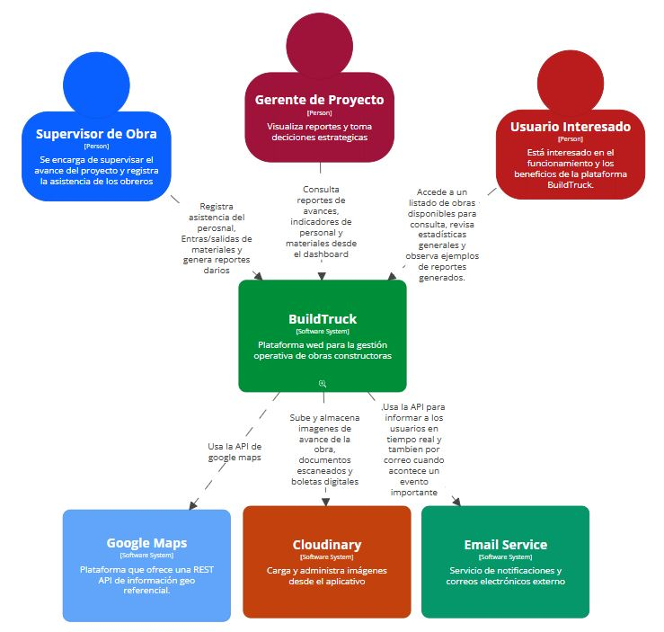
</p>

### ***4.6.2. Software Architecture Container Diagrams***

<p align="center">
  
</p>

### ***4.6.3. Software Architecture Components Diagrams***

<p align="center">
  
</p>


## **4.7. Software Object-Oriented Design**

### ***4.7.1. Class Diagrams***

<p align="center">
  
</p>

### ***4.7.2. Class Dictionary***

<ins>**Base Attributes for All Entities**</ins>

| Attribute | Type | Description |
|-----------|------|-------------|
| id | int | Unique identifier for each entity in the system |
| creationDate | Date | Date when the entity was created in the system |
| status | String | Current status of the entity (active, inactive, etc.) |

<ins>**User System**</ins>

**IUser (Interface)**
| Method | Return Type | Description |
|--------|-------------|-------------|
| login() | void | Authenticates a user into the system |
| logout() | void | Ends a user's session in the system |
| editProfile() | void | Allows user to modify their profile information |

**User (Abstract Class)**
| Attribute | Type | Description |
|-----------|------|-------------|
| id | int | Unique identifier for the user |
| name | string | User's full name |
| email | string | User's email address used for authentication |
| password | string | User's encrypted password |
| role | string | User's role in the system (Manager, Supervisor, etc.) |
| profilePicture | string | URL or path to the user's profile picture |

**Manager (Class)**
| Method | Return Type | Description |
|--------|-------------|-------------|
| viewProjects() | List<Project> | Retrieves all projects for viewing |
| viewPersonnelDetails() | List<Worker> | Retrieves personnel details |
| viewInventory() | List<Material> | Views inventory of all materials |
| viewIncidents() | List<Incident> | Views all recorded incidents |
| viewMachinery() | List<Machinery> | Views machinery status and information |
| downloadReports() | File | Downloads reports about system entities |

**Supervisor (Class)**
| Method | Return Type | Description |
|--------|-------------|-------------|
| managePersonnel() | void | Add, edit or remove personnel information |
| manageMaterials() | void | Manage inventory, stock levels, and ordering |
| manageMachinery() | void | Track and update machinery status |
| manageDocumentation() | void | Handle project documentation |
| manageIncidents() | void | Record and track incidents |

**UserFactory (Class)**
| Method | Return Type | Description |
|--------|-------------|-------------|
| createUser(type: string) | IUser | Creates and returns a specific type of user |

**UserConfiguration (Class)**
| Attribute | Type | Description |
|-----------|------|-------------|
| language | string | User's preferred language in the system |
| viewMode | string | User's preferred view mode (light/dark) |
| plan | string | Subscription plan or access level |

**UserProfile (Class)**
| Attribute | Type | Description |
|-----------|------|-------------|
| name | string | User's full name |
| email | string | User's contact email |
| phone | string | User's contact phone number |
| profilePicture | string | URL to profile picture |
<hr>

<ins>**Project System**</ins>

**Project (Class)**
| Attribute | Type | Description |
|-----------|------|-------------|
| id | int | Unique identifier for the project |
| name | string | Name of the project |
| description | string | Detailed description of the project |
| location | string | Physical location of the project |
| startDate | Date | Date when the project was started |
| estimatedEndDate | Date | Estimated completion date |
| status | string | Current status of the project |
| Method | Return Type | Description |
| addComponent(component: ProjectItem) | void | Adds a component to the project |
| viewSummary() | ProjectSummary | Returns a summary of the project |
| getStatistics() | ProjectStatistics | Returns statistics about the project |

**ProjectItem (Abstract Class)**
Serves as a base class for project components

**ProjectDocument (Class)**
| Attribute | Type | Description |
|-----------|------|-------------|
| title | string | Title of the document |
| description | string | Document description |
| uploadDate | Date | Date when document was uploaded |
| imageURL | string | URL to the document or image |
| Method | Return Type | Description |
| viewDetail() | DocumentDetail | Returns detailed information about the document |

**ProjectConfiguration (Class)**
| Attribute | Type | Description |
|-----------|------|-------------|
| language | string | Project's configured language |
| viewMode | string | Project's view mode (e.g., Gantt, Kanban) |
| plan | string | Project plan type |
| Method | Return Type | Description |
| editConfiguration() | void | Modifies project configuration settings |

<ins>**Material Management System**</ins>

Material (Class)
| Attribute | Type | Description |
|-----------|------|-------------|
| name | string | Name of the material |
| type | string | Type or category of material |
| unit | string | Unit of measurement (kg, liter, piece, etc.) |
| minStock | float | Minimum stock level before alert |
| currentStock | float | Current available stock |
| unitPrice | float | Price per unit |
| Method | Return Type | Description |
| applyMovement(strategy: MaterialMovementStrategy) | void | Applies a stock movement strategy |

**MaterialMovementStrategy (Interface)**
| Method | Return Type | Description |
|--------|-------------|-------------|
| execute() | void | Executes a material movement operation |

**MaterialEntry (Class)**
| Attribute | Type | Description |
|-----------|------|-------------|
| date | Date | Date of material entry |
| quantity | float | Quantity of material added |
| unitPrice | float | Unit price at time of entry |
| status | string | Status of the entry (pending, completed, etc.) |
| Method | Return Type | Description |
| execute() | void | Performs the entry operation |

**MaterialUsage (Class)**
| Attribute | Type | Description |
|-----------|------|-------------|
| date | Date | Date of material usage |
| quantity | float | Quantity of material used |
| usageArea | string | Area where material was used |
| usageType | string | Purpose of usage |
| Method | Return Type | Description |
| execute() | void | Performs the usage operation |

**Supplier (Class)**
| Attribute | Type | Description |
|-----------|------|-------------|
| name | string | Name of the supplier |
| taxId | string | Tax identification number |
<hr>

<ins>**Personnel Management**</ins>

**Worker (Class)**
| Attribute | Type | Description |
|-----------|------|-------------|
| id | int | Unique identifier for the worker |
| name | string | Worker's full name |
| dni | string | National identification number |
| role | string | Worker's role or position |
| status | string | Current employment status |
| phone | string | Contact phone number |
| email | string | Contact email address |
| hireDate | Date | Date when worker was hired |
<hr>

<ins>**Incident Management**</ins>

<ins>**Incident (Class)**</ins>
| Attribute | Type | Description |
|-----------|------|-------------|
| date | Date | Date when incident occurred |
| type | string | Type of incident |
| severity | string | Severity level (low, medium, high, critical) |
| status | string | Current status of the incident |
| Method | Return Type | Description |
| viewDetail() | IncidentDetail | Returns detailed information about the incident |
<hr>

<ins>**Notification System**</ins>

**Observer (Interface)**
| Method | Return Type | Description |
|--------|-------------|-------------|
| update(alert: string) | void | Receives notification updates |

**NotificationSystem (Class)**
| Method | Return Type | Description |
|--------|-------------|-------------|
| subscribe(observer: Observer) | void | Registers an observer to receive notifications |
| notify(incident: Incident) | void | Sends notification about an incident |

**StockAlert (Class)**
| Method | Return Type | Description |
|--------|-------------|-------------|
| checkStock(material: Material) | boolean | Checks if material stock is below minimum |
| notifyIfLow(material: Material) | void | Sends notification if stock is low |

<ins>**Relationships**<ins>

1. User-Role Relationship:
   - User has one UserConfiguration
   - User has one UserProfile
   - Manager and Supervisor extend User

2. Project Relationships:
   - Project has one ProjectConfiguration
   - Project has many ProjectItems
   - Project has many Incidents
   - Project has many Materials
   - ProjectDocument extends ProjectItem

3. Material Relationships:
   - Material uses MaterialMovementStrategy
   - Material is linked to Supplier
   - Material is monitored by StockAlert
   - MaterialUsage is linked to a Worker

4. Observer Pattern:
   - NotificationSystem notifies Observers
   - Manager implements Observer
   - Supervisor implements Observer
   - StockAlert notifies Observers

5. Factory Pattern:
   - UserFactory creates Users

6. Strategy Pattern:
   - Material uses MaterialMovementStrategy
   - MaterialEntry and MaterialUsage implement MaterialMovementStrategy

<ins>**Interfaces**</ins>

**IEntity**  
Interface that defines the basic CRUD operations for all entities in the system.

**Observer**  
Interface that defines the notification mechanism for objects that need to be updated when changes occur.

**IRepository**  
Interface that defines the standard operations for data access repositories.

## **4.8. Database Design**

### **4.8.1. Database Diagram**

<p align="center">
  
</p>


# **Capítulo V: Product Implementation, Validation & Deployment**

## **5.1. Software Configuration Management.**

### ***5.1.1. Software Development Environment Configuration.***

En este proyecto se han utilizado distintas herramientas para cada aspecto de nuestro proyecto: Project Management, Product UX/UI Design, Software Development, Software Deployment y Software Documentation. A continuación, daremos una breve presentación de cada uno de estos programas y los usos que les dimos.

* **Project Management**

  
  - **Git**
Es un sistema de control de versiones que se utiliza ampliamente en el desarrollo de software. Los desarrolladores con esta herramienta realizan un seguimiento de los cambios en el código, pueden colaborar de forma eficiente y mantener un historial completo de cada modificación hecha en el proyecto. Cada usuario tiene una copia completa del repositorio en su máquina local ya que Git funciona de manera distribuida. Este permite crear ramas para desarrollar nuevas funciones o para solucionar errores sin afectar el código principal. Los cambios pueden fusionarse con el repositorio principal cuando se finalice una tarea, de esta forma te aseguras una integración ordenada.  
**Figura 5**  
*Logo de Git*
<p align="center">
  
</p>

*Nota.* Obtenido de: [https://images.app.goo.gl/LrRXiPXPNboAr5LY7](https://images.app.goo.gl/LrRXiPXPNboAr5LY7)   
  - **Github**

Es una plataforma en línea que permite almacenar, compartir y colaborar en proyectos de programación utilizando el sistema de control de versiones Git. Es útil porque facilita el trabajo en equipo, permite llevar un historial de los cambios realizados en el código, recuperar versiones anteriores si algo sale mal y coordinar contribuciones de varios desarrolladores desde distintas ubicaciones. Además, ofrece herramientas para revisar código, reportar errores, gestionar tareas y documentar el proyecto, lo que mejora la organización, la calidad del software y acelera el desarrollo. En nuestro proyecto, utilizaremos GitHub para el informe de nuestro proyecto, Landing Page, Web Services y Frontend Web Applications.

**Figura 6**  
*Logo de Github*
<p align="center">
  
</p>


*Nota.* Obtenido de: [https://images.app.goo.gl/pnqQ8SUDrhUb9AMb8](https://images.app.goo.gl/pnqQ8SUDrhUb9AMb8) 

* **Requirements Management**  
  - **Trello**

Trello es una herramienta de gestión de proyectos basada en tableros y tarjetas que permite organizar tareas de manera visual y flexible. Es especialmente útil para manejar un product backlog en proyectos de desarrollo, ya que facilita la priorización, categorización y seguimiento de historias de usuario, tareas o funcionalidades pendientes. Su interfaz intuitiva permite a nuestro equipo ver el estado de cada elemento del backlog, colaborar en tiempo real, asignar responsables y fechas límite, y adaptarse fácilmente a cambios en las prioridades, lo que mejora la organización y la eficiencia en el flujo de trabajo ágil. Por estas razones, decidimos usar esta herramienta.

* **Product UX/UI Design**  
  - **UXPressia**

Es una herramienta en línea diseñada para crear los siguientes ítems que implementamos en nuestro informe: User Personas, Empathy maps, Journey Maps e Impact Maps. Es útil porque permite entender mejor las necesidades, emociones y puntos de contacto de los usuarios con un producto o servicio, lo que ayuda a tomar decisiones centradas en el usuario. Además, ofrece plantillas personalizables, integración con otras plataformas y la posibilidad de compartir fácilmente los resultados con interesados, mejorando así la comunicación y la planificación estratégica en proyectos de diseño o desarrollo.

- **Miro**

Miro es una plataforma de pizarras colaborativas en línea que permite visualizar ideas, procesos y flujos de trabajo de forma dinámica y compartida. La utilizamos para realizar el As-Is y To-Be Scenario Mapping por sus herramientas de diagramación, plantillas, colaboración en tiempo real y facilidad para integrar comentarios de manera visual e interactiva.

- **Figma**

Figma es una herramienta de diseño de interfaces y prototipado colaborativo en línea que permite crear, probar y refinar diseños de productos digitales en tiempo real. Es especialmente útil para el diseño centrado en el usuario, ya que facilita la creación de wireframes, mockups y prototipos interactivos que pueden ser compartidos y comentados por todo el equipo, sin necesidad de instalar software. Además, su capacidad para trabajar simultáneamente en un mismo archivo mejora la colaboración entre diseñadores, desarrolladores y otros interesados, acelerando el ciclo de diseño, asegurando la coherencia visual y reduciendo errores antes del desarrollo final.

**Figura 1**  
*Logo de Figma*
<p align="center">
  
</p>

*Nota.* Obtenido de: [https://images.app.goo.gl/CChj4WHkrcpoj8o86](https://images.app.goo.gl/CChj4WHkrcpoj8o86) 

* **Software Development**

  - **WEBSTORM**
Es un entorno de desarrollo integrado (IDE) desarrollado por JetBrains, se especializa en tecnologías web como JavaScript, TypeScript, Vue, React y Node.js. Incluso, ofrece funciones avanzadas como autocompletado inteligente. También, proporciona optimización para desarrollar aplicaciones web modernas y gestiona proyectos de forma eficiente, ya que se integra con herramientas como GitHub.

**Figura 2**  
*Logo de WebStorm*
<p align="center">
  
</p>

*Nota.* Obtenido de: [https://images.app.goo.gl/7nFfHpyKEJwk53nNA](https://images.app.goo.gl/7nFfHpyKEJwk53nNA)   

  - **HTML**

HTML (HyperText Markup Language) es el lenguaje de marcado estándar que se utiliza para estructurar y presentar contenido en la web. Es esencial en cualquier proyecto de desarrollo web, ya que define la estructura básica de las páginas, organizando elementos como textos, imágenes, enlaces, formularios y más. Usar HTML permite que los navegadores interpreten y muestren correctamente la información al usuario, y es la base sobre la cual se aplican estilos (CSS) y comportamientos (JavaScript), lo que lo convierte en un componente fundamental para construir sitios web funcionales y accesibles.

- **CSS**

CSS (Cascading Style Sheets) es el lenguaje utilizado para definir la apariencia visual de los elementos HTML en una página web. Es fundamental en un proyecto de desarrollo porque permite controlar el diseño, los colores, las fuentes, los márgenes, las animaciones y la disposición de los contenidos, logrando que las interfaces sean atractivas, coherentes y adaptables a distintos dispositivos. Separar el contenido (HTML) de la presentación (CSS) facilita el mantenimiento, mejora la accesibilidad y permite aplicar estilos de forma eficiente a múltiples páginas o componentes, optimizando tanto la experiencia del usuario como el flujo de trabajo del equipo de diseño y desarrollo.

- **JavaScript**

JavaScript es un lenguaje de programación orientado a objetos y basado en eventos que se utiliza principalmente para crear interactividad en sitios web. Es fundamental en proyectos de desarrollo web porque permite dinamizar el contenido HTML, responder a acciones del usuario, validar formularios, manipular el DOM y comunicarse con servidores sin recargar la página. Gracias a su versatilidad y compatibilidad con todos los navegadores modernos, así como a su uso en frameworks como React, Vue o Vue, JavaScript permite construir aplicaciones web dinámicas, rápidas y con una excelente experiencia de usuario.

- **C\#**

C\# (pronunciado "C sharp") es un lenguaje de programación moderno, orientado a objetos, desarrollado por Microsoft, ideal para crear aplicaciones de escritorio, web, móviles y videojuegos, especialmente dentro del ecosistema .NET. Es útil en proyectos de programación porque combina la potencia de lenguajes como C++ con una sintaxis más sencilla y segura, lo que permite desarrollar software robusto, escalable y de alto rendimiento. Además, cuenta con una amplia comunidad, soporte continuo, y herramientas integradas como Visual Studio, lo que facilita la depuración, el mantenimiento del código y el desarrollo colaborativo en equipos profesionales.

- **TYPESCRIPT**
Es un lenguaje de programación creado por Microsoft que está diseñado para facilitar el desarrollo de aplicaciones mantenibles, robustas y escalables. Este lenguaje mejora la calidad del código al detectar errores en el tiempo de desarrollo, lo que disminuye los fallos en la producción. Es utilizado ampliamente en frameworks modernos como Vue, lo que permite la creación de componentes reutilizables y una arquitectura de aplicación clara y organizada  
**Figura 3**  
*Logo de TypeScript*  

<p align="center">
  
</p>


*Nota.* Obtenido de: [https://images.app.goo.gl/gG7rMNP4BM3nZBwE6](https://images.app.goo.gl/gG7rMNP4BM3nZBwE6)   
- **Vue**
Es un framework de desarrollo de web basado en TypeScript, mantenido por Google y permite construir aplicaciones web dinámicas y escalables a través de una arquitectura basada en componentes, servicios y módulos. Este facilita la creación de interfaces reactivas, maneja eficientemente el estado de la aplicación y su conexión con APIs. La estructura modular que presenta favorece el trabajo en equipo y el mantenimiento de proyectos de gran escala.   
**Figura 4**  
*Logo de Vue*

<p align="center">
  
</p>

*Nota.* Obtenido de: [https://i.imgur.com/scrcyJ3.png](https://i.imgur.com/scrcyJ3.png) 

* **Software Deployment**  
  - **GitHub Pages:**

GitHub Pages es un servicio gratuito de GitHub que permite publicar sitios web estáticos directamente desde un repositorio. Es muy útil en proyectos de desarrollo web porque permite desplegar fácilmente una página sin necesidad de configurar servidores ni servicios externos, lo que agiliza la presentación de portafolios, documentación, prototipos o productos finales. Al estar integrado con Git, cualquier cambio en el repositorio puede reflejarse automáticamente en el sitio, facilitando la colaboración, el control de versiones y la actualización continua del contenido de manera sencilla y eficiente.

* **Software Documentation**  
  - **Google Docs**

Es una herramienta de procesamiento de texto en línea que permite crear, editar y compartir documentos de forma colaborativa y en tiempo real. Es útil para la documentación de software porque facilita la redacción de manuales de usuario, guías paso a paso, especificaciones técnicas y otros materiales sin necesidad de instalar software adicional. Además, su sistema de comentarios, control de versiones, compatibilidad con múltiples formatos y facilidad para compartir con distintos niveles de acceso lo convierten en una opción práctica para equipos que buscan una solución sencilla, accesible y colaborativa para organizar y mantener su documentación.

- **Markdown**

Es un lenguaje de marcado ligero que permite escribir documentación de forma simple y legible, usando solo texto plano con una sintaxis fácil de aprender. Es especialmente útil en proyectos de software porque permite crear documentación técnica directamente en el repositorio, facilitando su mantenimiento junto al código fuente. Al ser compatible con plataformas como GitHub, GitLab, Read the Docs y otros generadores estáticos, Markdown permite generar documentación clara, versionada y accesible, manteniendo el enfoque en la simplicidad, portabilidad y colaboración entre desarrolladores.  

#

### ***5.1.2. Source Code Management***

En este proyecto, el control de versiones se gestionará mediante Git, utilizando el modelo de trabajo GitFlow descrito por Vincent Driessen en “A successful Git branching model”. Este enfoque organiza el desarrollo a través de ramas específicas para diferentes propósitos. Además, se implementarán las prácticas de Semantic Versioning 2.0.0 para el versionado de releases y Conventional Commits para estructurar los mensajes de commit, garantizando claridad y trazabilidad. En esta sección detallaremos estas estructuras de control.  
Para desarrollar BuildTruck creamos los siguientes repositorios:

* Repositorio para el Project Report: [https://github.com/BuildTruck/ProjectReport](https://github.com/BuildTruck/ProjectReport)   
* Repositorio para Landing Page: [https://github.com/BuildTruck/LandingPage](https://github.com/BuildTruck/LandingPage)   
* Repositorio para Web Services: [https://github.com/BuildTruck/WebServices](https://github.com/BuildTruck/WebServices)   
* Repositorio para Frontend Web Applications: [https://github.com/BuildTruck/FrontendWebApps](https://github.com/BuildTruck/FrontendWebApps)

**Flujo de trabajo GitFlow**  
Esta estrategia se basa en la creación de ramas con roles definidos para gestionar el desarrollo, las releases y las correcciones.

* **Ramas**  
  - **main:**  
    * Contiene el código estable y listo para producción.  
    * Solo recibe merges de ramas de release y hotfix, cada uno etiquetado con una versión según Semantic Versioning 2.0.0.  
    * Se protege para evitar commits directos.  
  - **develop:**  
    * Sirve como rama de integración para las nuevas funcionalidades y correcciones.  
    * Representa el estado más reciente del desarrollo, pero no necesariamente es estable.  
    * Es la base para ramas de features y releases.  
  - **Features (feature/\*):**  
    * Cada funcionalidad nueva o cambio importante se desarrolla en una rama independiente derivada de develop.  
    * **Convención de nombramiento**: Los nombres de las ramas seguirán el formato feature/\<descripción\>, usando kebab-case para una descripción breve y clara del cambio (e.g., feature/user-login).  
    * Al completar la funcionalidad, la rama se fusiona en develop mediante un pull request, con revisión de código obligatoria.  
  - **Release (release/\*):**  
    * Son ramas que se crean desde develop cuando el proyecto está listo para una nueva versión.  
    * Convención de nombramiento: Se nombran como release/\<versión\>, donde \<versión\> sigue el formato de Semantic Versioning release/2.0.0.  
    * Estas ramas permiten ajustes menores, como correcciones de bugs o actualizaciones de metadatos, pero no nuevas funcionalidades.  
    * Una vez finalizadas, se fusionan en main (con una etiqueta de versión 2.0.0) y en develop para propagar los cambios.  
  - **Hotfix (hotfix/\*):**  
    * Son ramas que se derivan de main para solucionar problemas críticos en producción.  
    * Convención de nombramiento: Se nombran como hotfix/\<versión\>, reflejando la versión parcheada (e.g., hotfix/2.0.1 para un parche en v2.0.0).  
    * Tras completarse, se fusionan en main (etiquetando la nueva versión, e.g., v2.0.0) y en develop para mantener la consistencia.

**Semantic Versioning**  
El versionado de las releases se regirá por Semantic Versioning 2.0.0, utilizando el formato MAJOR.MINOR.PATCH:

* **MAJOR:** Se incrementa para cambios que rompen compatibilidad.  
* **MINOR:** Se incrementa para nuevas funcionalidades compatibles.  
* **PATCH:** Se incrementa para correcciones de errores compatibles. Cada release en main se etiquetará con su versión correspondiente, asegurando un seguimiento claro de las versiones.

**Conventional Commits**  
Los mensajes de commit seguirán la especificación de Conventional Commits para mantener consistencia y facilitar la generación automática de changelogs. La estructura será:  
\<tipo\>(\<ámbito\>): \<descripción\>  
\[cuerpo opcional\]  
\[pie opcional\]

* **Tipos principales**  
  - **feat:** Nueva funcionalidad (afecta la versión MINOR).  
  - **fix:** Corrección de errores (afecta la versión PATCH).  
  - **docs:** Actualizaciones en documentación.  
  - **style:** Cambios de formato o estilo sin impacto funcional.  
  - **refactor:** Reorganización del código sin cambios funcionales.  
  - **test:** Añadir o modificar pruebas.  
  - **chore:** Tareas de mantenimiento.  
* **Ámbito:** Específica el módulo o componente afectado.  
* **Descripción:** Breve, en minúsculas, máximo 50 caracteres, sin punto final.  
* **Cuerpo:** Detalles adicionales, si es necesario.  
* **Pie:** Referencias a tickets o breaking changes.

**Resumen de la Implementación**

* **Ramas principales:** **main** para producción, **develop** para integración.  
* **Ramas auxiliares:**  
  - **Features:** feature/\<descripción\> (e.g., feature/user-login).  
  - **Releases:** release/\<versión\> (e.g., release/2.0.0).  
  - **Hotfixes:** hotfix/\<versión\> (e.g., hotfix/2.0.1).  
* **Versionado:** Semantic Versioning (MAJOR.MINOR.PATCH, e.g., v2.0.0).  
* **Commits:** Conventional Commits (e.g., feat(login): add session support).

Esta configuración asegura un flujo de trabajo estructurado, con versionado claro y mensajes de commit estandarizados, promoviendo colaboración eficiente y mantenimiento del proyecto.


### ***5.1.3. Source Code Style Guide & Conventions***

En esta sección, detallaremos las convenciones y guías de estilo adoptadas para los lenguajes utilizados en el proyecto: **HTML**, **CSS**, **JavaScript**, **TypeScript** y **Java**. Todas las nomenclaturas se realizarán en inglés, siguiendo estándares ampliamente reconocidos para garantizar consistencia, legibilidad y mantenimiento del código. Las guías de referencia adoptadas son estándares de la industria, incluyendo las recomendaciones de W3Schools, Google, Vue, Spring Boot y SpecFlow (para Gherkin). A continuación, se describen las convenciones para cada lenguaje.

**HTML:**

Se seguirán las recomendaciones de la guía ["HTML Style Guide and Coding Conventions"](https://www.w3schools.com/html/html5_syntax.asp) de W3Schools y la ["Google HTML/CSS Style Guide"](https://google.github.io/styleguide/htmlcssguide.html). Las principales convenciones son:  
**Sintaxis**: Usar HTML5 con DOCTYPE \<\!DOCTYPE html\>.

**Nomenclatura**:

* Nombres de archivos en minúsculas, con guiones para separar palabras (e.g., index-page.html).  
  * Atributos y etiquetas en minúsculas (e.g., \<div id="main-content"\>).

  **Formato**:

  * Indentar con 2 espacios para anidamiento.  
  * Evitar líneas excesivamente largas (máximo 80 caracteres).  
  * Usar comillas dobles para valores de atributos (e.g., class="container").

  **Buenas prácticas**:

  * Incluir atributo alt en etiquetas \ para accesibilidad.  
  * Usar etiquetas semánticas (\<header\>, \<footer\>, \<article\>, etc.).  
  * Evitar estilos en línea; usar CSS externo.

**CSS:**

Se adoptará la ["Google HTML/CSS Style Guide"](https://google.github.io/styleguide/htmlcssguide.html) para CSS. Las convenciones incluyen:  
**Nomenclatura**:

* Clases en minúsculas, separadas por guiones (e.g., button-primary, main-container).  
  * Evitar IDs para estilos, priorizar clases.

  **Formato**:

  * Indentar con 2 espacios.  
  * Agrupar propiedades por categoría (e.g., posicionamiento, display, tipografía).  
  * Usar notación abreviada cuando sea posible (e.g., margin: 10px 20px en lugar de especificar cada lado).

  **Buenas prácticas**:

  * Usar unidades relativas (rem, vw, %) en lugar de absolutas (px) cuando sea adecuado.  
  * Evitar \!important salvo casos excepcionales.  
  * Organizar archivos CSS por módulos o componentes.

**JavaScript:**

Para JavaScript, se seguirán las prácticas recomendadas por la ["Google TypeScript Style Guide"](https://google.github.io/styleguide/tsguide.html) adaptadas a JavaScript, dado que comparten similitudes. Las convenciones son:  
**Nomenclatura**:

* Variables y funciones en camelCase (e.g., userProfile).  
  * Constantes en UPPER\_SNAKE\_CASE (e.g., MAX\_PROJECTS).  
  * Clases en PascalCase (e.g., UserService).

  **Formato**:

  * Indentar con 2 espacios.  
  * Usar comillas simples (') para cadenas de texto.  
  * Terminar declaraciones con punto y coma (;).

  **Buenas prácticas**:

  * Usar const por defecto, let solo si es necesario reasignar, evitar var.  
  * Preferir funciones de flecha para callbacks (() \=\> {}) y funciones tradicionales para métodos (function name() {}).  
  * Incluir comentarios JSDoc para funciones públicas.

**TypeScript:**

Se adoptará la ["Google TypeScript Style Guide"](https://google.github.io/styleguide/tsguide.html) y la ["Vue Coding Style Guide"]( https://vuejs.org/style-guide/) para proyectos con Vue. Las convenciones incluyen:  
**Nomenclatura**:

* Igual que JavaScript: camelCase para variables y funciones, PascalCase para clases e interfaces (e.g., UserInterface, AuthService).  
  * Interfaces con prefijo I solo si es necesario para claridad (e.g., IUser).

  **Formato**:

  * Indentar con 2 espacios.  
  * Usar tipos explícitos para parámetros y retornos de funciones.  
  * Evitar any salvo en casos excepcionales.

  **Buenas prácticas** (específicas para Vue):

  * Usar sufijos para componentes (Component), servicios (Service), etc..  
  * Organizar módulos Vue por funcionalidad (e.g., auth.module.ts).  
  * Usar decoradores Vue de forma consistente (e.g., @Input, @Output).

**Java:**

Para Java, se seguirá la ["Google Java Style Guide"](https://google.github.io/styleguide/javaguide.html) y las recomendaciones de ["Spring Boot Features"](https://docs.spring.io/spring-boot/docs/current/reference/html/features.html). Las convenciones son:  
**Nomenclatura**:

* Clases en PascalCase.  
  * Métodos y variables en camelCase.  
  * Constantes en UPPER\_SNAKE\_CASE.

  **Formato**:

  * Indentar con 2 espacios.  
  * Líneas de máximo 100 caracteres.  
  * Usar llaves {} para todos los bloques, incluso si son de una sola línea.

  **Buenas prácticas** (específicas para Spring Boot):

  * Usar anotaciones Spring de forma clara.  
  * Estructurar proyectos con paquetes por funcionalidad (e.g., com.example.service).  
  * Implementar manejo de excepciones centralizado con @ControllerAdvice.

**Gherkin (para especificaciones):**

Aunque Gherkin no es un lenguaje de programación, se utilizará para escribir pruebas de aceptación en un formato legible, siguiendo las ["Gherkin Conventions for Readable Specifications"](https://specflow.org/gherkin/gherkin-conventions-for-readable-specifications/). Las convenciones son:  
**Nomenclatura**:

* Escenarios en inglés, con títulos descriptivos en tercera persona (e.g., User logs in with valid credentials).  
  * Usar palabras clave de Gherkin (Given, When, Then) de forma consistente.

  **Formato**:

  * Escribir pasos claros y concisos.  
  * Usar tablas para datos estructurados.

  **Buenas prácticas**:

  * Evitar detalles técnicos en los pasos; centrarse en el comportamiento.  
  * Reutilizar pasos comunes para mantener especificaciones DRY (Don't Repeat Yourself).

Todas las convenciones detalladas en esta sección, nos garantizan un código limpio, consistente y alineado con estándares de la industria, facilitando la colaboración y el mantenimiento del proyecto.  


### ***5.1.4. Software Deployment Configuration***
Para que nuestra landing page esté disponible para todos nuestros usuarios, la publicamos como un sitio web utilizando la plataforma de GitHub. El proceso se llevó a cabo de la siguiente manera:
1. **Registro en GitHub** Creamos una cuenta en GitHub para poder gestionar nuestros repositorios.
2. **Creación del repositorio**
  * Hicimos clic en el botón "New" para generar un nuevo repositorio.
  * Le asignamos el nombre "LandingPage" dentro de nuestra organización "BuildTruck"
3. **Configuración del repositorio**
  * Nos aseguramos de que el repositorio sea de acceso público.
4. **Carga de los archivos de la landing page**
  * Accedimos al repositorio creado.
  * Esperamos a que todos los contribuyentes hagan los commits del desarrollo para darle Merge a la rama develop.
  * Finalmente, confirmamos la acción con "Commit changes" para guardar los archivos.
5. **Activación de GitHub Pages**
  * Entramos a la sección "Settings" del repositorio.
  * Nos desplazamos hasta encontrar el apartado "GitHub Pages".
  * Elegimos la rama "feature/develop" y guardamos los cambios con "Save".
**Figura**
<p align="center">
  
</p>
*Explicación del paso 5*

*Nota.* Elaboración propia.
6. **Verificación del sitio web** En pocos minutos, el sitio se publica en la siguiente dirección: https://buildtruck.github.io/LandingPage/ 
Accedemos a esta URL desde el navegador para confirmar que el sitio está activo.
7. **Actualización del sitio**
  * Cuando necesitemos modificar el sitio, solo debemos realizar commits y darle mege de nuevo  siguiendo los mismos pasos.
  * Los cambios se verán reflejados automáticamente en línea.


## **5.2. Landing Page, Services & Applications Implementation**

### ***5.2.1. Sprint 1***

##### **5.2.1.1. Sprint Planning 1**

Ahora, mostraremos nuestro sprint planning. En esta sección, vamos a explicar la reunión inicial del sprint realizado, detallando lo que se planeó, acordó y revisó en la reunión.

| Sprint \# | Sprint 1 |
| :---- | :---- |
| **Sprint Planning Background:**  | En el sprint decidimos reunirnos para verificar el progreso de cada uno de los participantes y  el progreso desde el punto de vista grupal, luego de ello buscamos formas y acciones de mejora    |  |
| Date | 2025-04-17 |
| Time | 23:35 PM |
| Location | Google Meet Group Call |
| Prepared By | Gomez Flores, Daniela Aracelli |
| Attendees (to planning meeting) | Bellido Salas, Raúl  Gómez Flores, Daniela Araceli Luyo Correa, Sandra Paula Gutiérrez Condo, Maylhy Olinda Roca Tineo, Steven Mathew |
| Sprint n \- Review Summary | Revisamos nuestras business goals, discutimos sobre las user stories y dimos feedback. También revisamos los riesgos futuros que podríamos encontrar en la realización del producto. Finalmente revisamos el avance individual y grupal. |
| Sprint n \- Retrospective Summary | Start: Debemos empezar a comunicarnos más entre nosotros Debemos planear con anticipación las tareas en grupo e individuales Stop: Dejar de esperar al último momento para culminar las tareas Continue: Hacer preguntas al product owner Hacer reuniones interdiarias para priorizar el avance  |
| **Sprint Goal & User Stories** |  |
| Sprint n Goal | Our focus is on **implementing the core functionalities of the landing page and user registration module**. We believe it delivers **a clear entry point and structured onboarding experience** to **construction SMEs and administrative staff**, This will be confirmed when **users are able to successfully access the platform, complete the registration process, and navigate to their project dashboard without friction**. |
| Sprint n Velocity | 3 |
| Sum of Story Points | 12 |

##### 5.2.1.2. Aspect Leaders and Collaborators

| Team Member (Last Name, First Name) | GitHub Username | Landing page Leader (L) / Collaborator (C) | DocumentationLeader (L) / Collaborator (C) | Epics Leader (L) / Collaborator (C) |
| :---- | :---- | :---- | :---- | :---- |
| Bellido Salas, Raúl | raulbellidosalas | C | C | C |
| Gómez Flores, Daniela Araceli | DanieGF1 | C | C | C |
| Gutiérrez Condo, Maylhy Olinda | Ly009463 | C | L | C |
| Luyo Correa, Sandra Paula | Paulu27 | C | C | L |
| Roca Tineo, Steven Mathew | matthewsrt29 | L | C | C |


##### 5.2.1.3. Sprint Backlog 1

En este primer sprint, nos enfocamos en desarrollar la Landing Page de BuildTruck. Para lograrlo, dividimos el trabajo en tareas específicas basadas en cada historia de usuario relacionada con la Landing Page, asignándolas a diferentes miembros del equipo. Además, utilizamos la herramienta “Trello” para organizar de manera más eficiente nuestro Backlog. 

**Figura**
*sprint 1 de BuildTruck* 
<p align="center">
  
</p>

*Nota.* Obtenido de [https://trello.com/invite/b/6809aa09bd1aed9ed6eabc41/ATTId2c3303b9daa2ee2a1550a5b3ac169cf3F5B76F3/trello-agile-sprint-buildtruck](https://trello.com/invite/b/6809aa09bd1aed9ed6eabc41/ATTId2c3303b9daa2ee2a1550a5b3ac169cf3F5B76F3/trello-agile-sprint-buildtruck) 

| Sprint \# | Sprint 1 |  |  |  |  |  |  |
| :---- | :---- | :---- | :---- | :---- | :---- | :---- | :---- |
| User Story |  | Work Item/Task |  |  |  |  |  |
| Id | Title | Id | Title | Description | Estimation (Hours) | Assigned To | Status (To-do / InProcess / ToReview / Done) |
| US33 | Visualizar propuesta de valor de BuildTruck | T1 | Crear sección principal con propuesta de valor | Diseñar y programar un bloque en la parte superior de la landing page que contenga el título “Transformando la gestión en obra” y un subtítulo explicativo. | 2 | Maylhy Gutiérrez | Done |
|  |  | T2 | Crear botón "Conoce más" | Crear un botón “Conoce más” que sea visible debajo del subtítulo y esté estilizado para resaltar. Configurar para que redirija a la sección de funcionalidades. | 1 | Maylhy Gutiérrez | Done |
| US34 | Visualizar características del sistema | T1 | Crear sección de funcionalidades destacadas | Implementar tarjetas o bloques en la sección media de la landing page que presenten funcionalidades como Gestión inteligente de almacén, Control de asistencia y persona, Reportes y seguimiento del avance, Alertas y notificaciones. | 3 | Daniela Gómez | Done |
| US35 | Visualizar misión, visión y origen de BuildTruck | T1 | Crear sección institucional | Diseñar sección baja con texto que explique que BuildTruck es desarrollado por estudiantes de ingeniería, más misión y visión. | 2 | Daniela Gómez | Done |
| US36 | Conocer planes de suscripción | T1 | Crear sección comparativa de planes | Implementar tarjetas o una tabla para mostrar los planes Básico, Pro y Empresarial con precios en dólares y características principales. | 3 | Raúl Bellido | Done |
| US37 | Enviar formulario de contacto | T1 | Crear formulario de contacto | Implementar formulario con campos obligatorios: nombre, correo, ciudad y mensaje. | 2 | Mathew | Done |
|  |  | T2 | Crear botón "Enviar" en el formulario de contacto | Diseñar y agregar el botón “Enviar” que dispare la validación y envío del formulario. | 1 | Mathew | Done |
|  |  | T3 | Validar formulario y mostrar mensajes de éxito/error | Programar validaciones para datos requeridos y formato de correo. Mostrar mensaje de confirmación o advertencia según el caso. | 3 | Mathew | Done |
| US38 | Visualizar encabezado con navegación  | T1 | Crear encabezado con enlaces principales | Diseñar un encabezado visible en la parte superior con los enlaces: Producto, Nosotros, Planes, Registrar, Iniciar sesión. | 3 | Mathew | Done |
|  |  | T2 | Implementar desplazamiento o redirección desde enlaces del encabezado | Configurar cada enlace para navegar a la sección correspondiente dentro de la misma página o a otras vistas. | 3 | Mathew | Done |
|  |  | T3 | Estilizar el botón “Iniciar Sesión” para resaltar | Darle un diseño especial al botón "Iniciar Sesión" para que destaque del resto de los enlaces normales. | 1 | Mathew | Done |
| US39 | Navegar a inicio de sesión desde botón | T1 | Configurar redirección del botón “Iniciar sesión” | Al hacer clic en “Iniciar sesión”, redirigir al formulario de login de la plataforma. | 2 | Raúl Bellido  | Done |
| US40 | Visualizar información en el footer | T1 | Crear footer con derechos reservados y logotipo | Diseñar un footer que incluya los derechos de autor y el logotipo de BuildTruck. | 1 | Paula | Done |
|  |  | T2 | Añadir íconos de redes sociales en el footer | Incluir los íconos de redes sociales activos y funcionales, enlazándolos a sus respectivas páginas oficiales. | 1 | Paula | Done |
|  |  | T3 | Configurar enlaces de íconos para abrir en nueva pestaña | Asegurarse que los íconos de redes sociales abran la página externa en una nueva pestaña del navegador. | 1 | Paula | Done |


#### 5.2.1.4. Development Evidence for Sprint Review. 

| Repository  | Branch | Commit Id | Commit | Message Body | Commited on (Date) |
| :---- | :---- | :---- | :---- | ----- | :---- |
| matthewsrt29/BuilTruck/LandingPage | feature/develop | a70a737 | feat: landingPage add 1 | \- | 20/04/2025 |
| matthewsrt29/BuilTruck/LandingPage | feature/develop | da4353f | feat: adding carpets | \- | 25/04/2025 |
| Ly009463/BuilTruck/LandingPage | feature/develop | 731c3b7 | feat: main section | \- | 27/04/2025 |
| raulbellidosalas/BuilTruck/LandingPage | feature/develop | 919771b | feat: added the Plans Section | \- | 27/04/2025 |
| DanieGF1/BuilTruck/LandingPage | feature/develop | e783724 | feat: feature section | \- | 27/04/2025 |
| Paulu27/BuilTruck/LandingPage | feature/develop | c291c8b | feat: Added FAQ Section | \- | 27/04/2025 |
| matthewsrt29/BuilTruck/LandingPage | feature/develop | 7898961 | fix: adding fonts and completing html | \- | 27/04/2025 |
| matthewsrt29/BuilTruck/LandingPage | feature/develop | b266001 | feat: adding styles | \- | 27/04/2025 |
| matthewsrt29/BuilTruck/LandingPage | feature/develop | f4d7528 | feat: adding js functions | \- | 27/04/2025 |


#### 5.2.1.5. Execution Evidence for Sprint Review

En el sprint 1 se alcanzo un desarrollo parcial en la implementación del despliegue del landing page siendo ciertas funcionalidades las faltantes. La cual muestra diferentes
secciones donde el usuario puede encontrar información importante acerca del producto y del start up. A continuación se
muestran algunas evidencias:


Imagenes del despliegue de la landing page
[https://buildtruck.github.io/LandingPage/](https://buildtruck.github.io/LandingPage/)

<p align="center">
  
</p>

<p align="center">
  
</p>

<p align="center">
  
</p>

<p align="center">
  
</p>

<p align="center">
  
</p>

Link del video de ejecución de la landing page:

[https://upcedupe-my.sharepoint.com/:v:/g/personal/u202311361_upc_edu_pe/EXA7kWcdbL9OmtCoFOB77iwBgSTFBbeN4nIrdPAKoauM-A?e=T8TKbM&nav=eyJyZWZlcnJhbEluZm8iOnsicmVmZXJyYWxBcHAiOiJTdHJlYW1XZWJBcHAiLCJyZWZlcnJhbFZpZXciOiJTaGFyZURpYWxvZy1MaW5rIiwicmVmZXJyYWxBcHBQbGF0Zm9ybSI6IldlYiIsInJlZmVycmFsTW9kZSI6InZpZXcifX0%3D](https://upcedupe-my.sharepoint.com/:v:/g/personal/u202311361_upc_edu_pe/EXA7kWcdbL9OmtCoFOB77iwBgSTFBbeN4nIrdPAKoauM-A?e=T8TKbM&nav=eyJyZWZlcnJhbEluZm8iOnsicmVmZXJyYWxBcHAiOiJTdHJlYW1XZWJBcHAiLCJyZWZlcnJhbFZpZXciOiJTaGFyZURpYWxvZy1MaW5rIiwicmVmZXJyYWxBcHBQbGF0Zm9ybSI6IldlYiIsInJlZmVycmFsTW9kZSI6InZpZXcifX0%3D)


#### **5.2.1.6. Services Documentation Evidence for Sprint Review**
<table class="c26">
<tr class="c17">
<td class="c13" colspan="1" rowspan="1"><p class="c0"><span class="c10">Endpoint</span></p></td><td class="c8" colspan="1" rowspan="1"><p class="c0"><span class="c10">Path</span></p></td><td class="c11" colspan="1" rowspan="1"><p class="c0"><span class="c10">Descripci&oacute;n</span></p></td></tr>
<tr class="c23"><td class="c1" colspan="1" rowspan="1"><p class="c0"><span class="c10">Workers Endpoint</span></p></td><td class="c7" colspan="1" rowspan="1"><p class="c0"><span class="c15 c5"><a class="c16" >/personnel</a></span></p></td><td class="c6" colspan="1" rowspan="1"><p class="c2 c12"><span class="c5">Punto de acceso para gestionar datos de trabajadores (ejemplo: nombres, roles).</span></p></td></tr>
<tr class="c22"><td class="c13" colspan="1" rowspan="1"><p class="c0"><span class="c10">Materials Endpoint</span></p></td><td class="c8" colspan="1" rowspan="1"><p class="c2"><span class="c5">/materials</span></p></td><td class="c11" colspan="1" rowspan="1"><p class="c2 c12"><span class="c5">Punto de acceso para gestionar datos relacionados con materiales (ejemplo: cemento, acero).</span></p></td></tr><tr class="c24"><td class="c1" colspan="1" rowspan="1"><p class="c2 c18"><span class="c19 c5"></span></p><p class="c2"><span class="c5">Materials Entry Endpoint</span></p></td><td class="c7" colspan="1" rowspan="1"><p class="c0"><span class="c15 c5"><a class="c16" >/material-entries</a></span></p></td><td class="c6" colspan="1" rowspan="1"><p class="c2 c12"><span class="c5">Punto de acceso para la entrada de materiales al inventario</span></p></td></tr><tr class="c24"><td class="c13" colspan="1" rowspan="1"><p class="c2 c18"><span class="c5 c19"></span></p><p class="c2"><span class="c5">Materials Usages Endpoint</span></p></td><td class="c8" colspan="1" rowspan="1"><p class="c0"><span class="c15 c5"><a class="c16">/material-usages</a></span></p></td><td class="c11" colspan="1" rowspan="1"><p class="c2 c12"><span class="c5">Punto de acceso para registrar el uso de materiales al inventario</span></p></td></tr><tr class="c14"><td class="c1" colspan="1" rowspan="1"><p class="c0"><span class="c19 c5">Users Endpoint</span></p></td><td class="c7" colspan="1" rowspan="1"><p class="c0"><span class="c5 c15"><a class="c16" >/users</a></span></p></td><td class="c6" colspan="1" rowspan="1"><p class="c2 c12"><span class="c5">Punto de acceso para gestionar los usuarios para el log-in</span></p></td></tr><tr class="c9"><td class="c13" colspan="1" rowspan="1"><p class="c0"><span class="c10">Incidents Endpoint</span></p></td><td class="c8" colspan="1" rowspan="1"><p class="c2"><span class="c5">/incidents</span></p></td><td class="c11" colspan="1" rowspan="1"><p class="c2 c12"><span class="c5">Punto de acceso para gestionar datos de incidentes (ejemplo: accidentes, fallos).</span></p></td></tr><tr class="c9"><td class="c1" colspan="1" rowspan="1"><p class="c0"><span class="c10">Machines Endpoint</span></p></td><td class="c7" colspan="1" rowspan="1"><p class="c2"><span class="c5">/machinery</span></p></td><td class="c6" colspan="1" rowspan="1"><p class="c2 c12"><span class="c5">Punto de acceso para gestionar datos de maquinaria (ejemplo: excavadoras, placas).</span></p></td></tr><tr class="c9"><td class="c13" colspan="1" rowspan="1"><p class="c0"><span class="c10">Project Endpoint</span></p></td><td class="c8" colspan="1" rowspan="1"><p class="c2"><span class="c5">/projects</span></p></td><td class="c11" colspan="1" rowspan="1"><p class="c2 c12"><span class="c5">Punto de acceso para gestionar datos de proyectos (ejemplo: presupuestos, estados).</span></p></td></tr><tr class="c14"><td class="c1" colspan="1" rowspan="1"><p class="c2 c18"><span class="c19 c5"></span></p><p class="c2"><span class="c5">Documents Endpoint</span></p></td><td class="c7" colspan="1" rowspan="1"><p class="c2"><span class="c5">/documents</span></p></td><td class="c6" colspan="1" rowspan="1"><p class="c2 c12"><span class="c5">Punto de acceso para gestionar los documentos de una obra</span></p></td></tr>
</table>

#### 5.2.1.7. Software Deployment Evidence for Sprint Review
Para realizar el deployment de este sprint, hemos realizado varios procesos, a continuación realizaremos un resumen de cada uno de ellos.

Publicamos nuestra landing page como un sitio web a través de GitHub para que sea accesible a todos nuestros usuarios. Primero, creamos una cuenta y un repositorio público "LandingPage" dentro de nuestra organización "BuildTruck". Luego, subimos los archivos de la página, activamos GitHub Pages seleccionando la rama "feature/develop" desde la configuración del repositorio y verificamos que el sitio estuviera disponible en línea en [https://buildtruck.github.io/LandingPage/](https://buildtruck.github.io/LandingPage/). Cuando queremos hacer cambios, simplemente actualizamos los archivos y los volvemos a subir.

**Figura**
*Evidencia de deployment 1*
<p align="center">
  
</p>
Nota. Elaboración propia.

**Figura**
*Evidencia de deployment 2*
<p align="center">
  
</p>
Nota. Elaboración propia.

##### **5.2.1.8. Team Collaboration Insights during Sprint**

| Alumno | Actividad |
|--------|-----------|
| Steven Mathew Roca Tineo | Implementación de la sección formulario de la landing page |
| Daniela Araceli Gómez Flores | Implementación de la sección features de la landing page |
| Maylhy Olinda Gutierrez Condo | Implementación de la sección main de la landing page |
| Raúl Bellido Salas | Implementación de la sección plans de la landing page |
| Sandra Paula Luyo Correa | Implementación de la sección FAQ de la landing page |

<p align="center">
  
</p>


READ.ME:

<p align="center">
  
</p>

LANDING PAGE:
<p align="center">
  
</p>

### ***5.2.2. Sprint 2***

#### **5.2.2.1. Sprint Planning 2.**

<p class="c3 c8"><span class="c0"></span></p><table class="c7"><tr class="c5"><td class="c2" colspan="1" rowspan="1"><p class="c1"><span class="c6">Sprint #</span></p></td><td class="c2" colspan="1" rowspan="1"><p class="c1"><span class="c0">Sprint 2</span></p></td></tr><tr class="c4"><td class="c9" colspan="2" rowspan="1"><p class="c1"><span class="c6">Sprint Planning Background: </span></p><p class="c1"><span class="c0">En el sprint 2 &nbsp;decidimos reunirnos para verificar el progreso de cada uno de los participantes y el progreso desde el punto de vista grupal, luego de ello buscamos formas y acciones de mejora</span></p></td></tr><tr class="c5"><td class="c2" colspan="1" rowspan="1"><p class="c1"><span class="c0">Date</span></p></td><td class="c2" colspan="1" rowspan="1"><p class="c1"><span class="c0">2025-05-12</span></p></td></tr><tr class="c5"><td class="c2" colspan="1" rowspan="1"><p class="c1"><span class="c0">Time</span></p></td><td class="c2" colspan="1" rowspan="1"><p class="c1"><span class="c0">20:35 PM</span></p></td></tr><tr class="c5"><td class="c2" colspan="1" rowspan="1"><p class="c1"><span class="c0">Location</span></p></td><td class="c2" colspan="1" rowspan="1"><p class="c1"><span class="c0">Google Meet Group Call</span></p></td></tr><tr class="c5"><td class="c2" colspan="1" rowspan="1"><p class="c1"><span class="c0">Prepared By</span></p></td><td class="c2" colspan="1" rowspan="1"><p class="c1"><span class="c0">Guti&eacute;rrez Condo, Maylhy Olinda</span></p></td></tr><tr class="c5"><td class="c2" colspan="1" rowspan="1"><p class="c1"><span class="c0">Attendees (to planning meeting)</span></p></td><td class="c2" colspan="1" rowspan="1"><p class="c1"><span class="c0">Bellido Salas, Ra&uacute;l </span></p><p class="c1 c3"><span class="c0"></span></p><p class="c1"><span class="c0">G&oacute;mez Flores, Daniela Araceli</span></p><p class="c1 c3"><span class="c0"></span></p><p class="c1"><span class="c0">Luyo Correa, Sandra Paula</span></p><p class="c1 c3"><span class="c0"></span></p><p class="c1"><span class="c0">Guti&eacute;rrez Condo, Maylhy Olinda</span></p><p class="c1 c3"><span class="c0"></span></p><p class="c1"><span class="c0">Roca Tineo, Steven Mathew</span></p></td></tr><tr class="c5"><td class="c2" colspan="1" rowspan="1"><p class="c1"><span class="c0">Sprint n - Review Summary</span></p></td><td class="c2" colspan="1" rowspan="1"><p class="c1"><span class="c0">Revisamos nuestras tecnical stories, discutimos sobre los diagramas de clases y de la base de datos . Tambi&eacute;n revisamos los riesgos futuros que podr&iacute;amos encontrar en la realizaci&oacute;n del producto. Finalmente repartimos los componentes a cada integrante , para realizar el c&oacute;digo del producto .</span></p></td></tr><tr class="c5"><td class="c2" colspan="1" rowspan="1"><p class="c1"><span class="c0">Sprint n - Retrospective Summary</span></p></td><td class="c2" colspan="1" rowspan="1"><p class="c1"><span class="c0">Start:</span></p><p class="c1"><span class="c0">Debemos planear con anticipaci&oacute;n las tareas en grupo e individuales</span></p><p class="c1"><span class="c0">Stop:</span></p><p class="c1"><span class="c0">Dejar de esperar al &uacute;ltimo momento para culminar las tareas</span></p><p class="c1"><span class="c0">Continue:</span></p><p class="c1"><span class="c0">Hacer preguntas al product owner</span></p><p class="c1"><span class="c0">Hacer reuniones interdiarias para priorizar el avance</span></p><p class="c1 c3"><span class="c0"></span></p></td></tr><tr class="c4"><td class="c9" colspan="2" rowspan="1"><p class="c1"><span class="c6">Sprint Goal &amp; User Stories</span></p></td></tr><tr class="c5"><td class="c2" colspan="1" rowspan="1"><p class="c1"><span class="c0">Sprint 2 Goal</span></p></td><td class="c2" colspan="1" rowspan="1"><p class="c1"><span class="c0">Our current focus is on implementing the core features of the BuildTruck system: user login, registration of managers and supervisors, and seamless navigation to their respective management dashboards. Success will be validated when users can log in, register and assign projects, and access key modules like inventory, personnel, machinery, and incidents according to their role.</span></p></td></tr><tr class="c5"><td class="c2" colspan="1" rowspan="1"><p class="c1"><span class="c0">Sprint 2 Velocity</span></p></td><td class="c2" colspan="1" rowspan="1"><p class="c1"><span class="c0">10</span></p></td></tr><tr class="c5"><td class="c2" colspan="1" rowspan="1"><p class="c1"><span class="c0">Sum of Story Points</span></p></td><td class="c2" colspan="1" rowspan="1"><p class="c1"><span class="c0">89</span></p></td></tr></table><p class="c3 c10"><span class="c6"></span></p>

#### **5.2.2.2. Aspect Leaders and Collaborators.** 

| Team Member (Last Name, First Name) | GitHub Username | Landing page Leader (L) / Collaborator (C) | DocumentationLeader (L) / Collaborator (C) | Frontend  Web Application Leader (L) / Collaborator (C) |
| :---- | :---- | :---- | :---- | :---- |
| Bellido Salas, Raúl | raulbellidosalas | C | C | C |
| Gómez Flores, Daniela Araceli | DanieGF1 | C | C | C |
| Gutiérrez Condo, Maylhy Olinda | Ly009463 | L | C | C |
| Luyo Correa, Sandra Paula | Paulu27 | C | L | C |
| Roca Tineo, Steven Mathew | matthewsrt29 | C | C | L |

# 

#### **5.2.2.3. Sprint Backlog 2.** 

Elaboramos el sprint backlog 2 en trello, como se puede apreciar en la siguiente imagen:

**Figura**  
*Sprint 2 de BuildTruck*


<p align="center">
  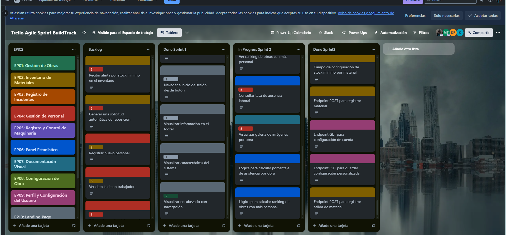
</p>


*Nota.* Elaboración propia. Extraido de: [https://trello.com/invite/b/6809aa09bd1aed9ed6eabc41/ATTId2c3303b9daa2ee2a1550a5b3ac169cf3F5B76F3/trello-agile-sprint-buildtruck](https://trello.com/invite/b/6809aa09bd1aed9ed6eabc41/ATTId2c3303b9daa2ee2a1550a5b3ac169cf3F5B76F3/trello-agile-sprint-buildtruck) 

<table class="c35">
<tr class="c12"><td class="c33" colspan="1" rowspan="1"><p class="c1"><span class="c0">Sprint #</span></p></td><td class="c37" colspan="7" rowspan="1"><p class="c1"><span class="c0">Sprint 2</span></p></td></tr><tr class="c12"><td class="c41" colspan="2" rowspan="1"><p class="c1"><span class="c0">User Story</span></p></td><td class="c39" colspan="6" rowspan="1"><p class="c1"><span class="c0">Work Item/Task</span></p></td></tr><tr class="c38"><td class="c33" colspan="1" rowspan="1"><p class="c1"><span class="c0">Id</span></p></td><td class="c27" colspan="1" rowspan="1"><p class="c1"><span class="c0">Title</span></p></td><td class="c19" colspan="1" rowspan="1"><p class="c1"><span class="c0">Id</span></p></td><td class="c29" colspan="1" rowspan="1"><p class="c1"><span class="c0">Title</span></p></td><td class="c14" colspan="1" rowspan="1"><p class="c1"><span class="c0">Description</span></p></td><td class="c7" colspan="1" rowspan="1"><p class="c1"><span class="c0">Estimation (Hours)</span></p></td><td class="c9" colspan="1" rowspan="1"><p class="c1"><span class="c0">Assigned To</span></p></td><td class="c6" colspan="1" rowspan="1"><p class="c1"><span class="c0">Status (To-do / In Process / ToReview / Done)</span></p></td></tr><tr class="c12"><td class="c21" colspan="1" rowspan="6"><p class="c1"><span class="c0">US01</span></p></td><td class="c10" colspan="1" rowspan="6"><p class="c1"><span class="c0">Visualizar lista de obras asignadas</span></p></td><td class="c19" colspan="1" rowspan="1"><p class="c1"><span class="c0">T1</span></p></td><td class="c29" colspan="1" rowspan="1"><p class="c1"><span class="c0">Crear componente de tarjeta de obra</span></p></td><td class="c14" colspan="1" rowspan="1"><p class="c1"><span class="c0">Desarrollar tarjeta con imagen, nombre, descripci&oacute;n y bot&oacute;n &ldquo;Ingresar&rdquo;.</span></p></td><td class="c7" colspan="1" rowspan="1"><p class="c1"><span class="c0">3</span></p></td><td class="c9" colspan="1" rowspan="1"><p class="c1"><span class="c0">Mathew</span></p></td><td class="c6" colspan="1" rowspan="1"><p class="c1"><span class="c0">Done</span></p></td></tr><tr class="c12"><td class="c19" colspan="1" rowspan="1"><p class="c1"><span class="c0">T2</span></p></td><td class="c29" colspan="1" rowspan="1"><p class="c1"><span class="c0">Implementar vista de lista de obras</span></p></td><td class="c14" colspan="1" rowspan="1"><p class="c1"><span class="c0">Crear layout responsivo que muestre las tarjetas de proyectos.</span></p></td><td class="c7" colspan="1" rowspan="1"><p class="c1"><span class="c0">2</span></p></td><td class="c9" colspan="1" rowspan="1"><p class="c1"><span class="c0">Mathew</span></p></td><td class="c6" colspan="1" rowspan="1"><p class="c1"><span class="c0">Done</span></p></td></tr><tr class="c12"><td class="c19" colspan="1" rowspan="1"><p class="c1"><span class="c0">T3</span></p></td><td class="c29" colspan="1" rowspan="1"><p class="c1"><span class="c0">Obtener obras desde backend</span></p></td><td class="c14" colspan="1" rowspan="1"><p class="c1"><span class="c0">Conectar con API para recuperar obras asignadas al gerente.</span></p></td><td class="c7" colspan="1" rowspan="1"><p class="c1"><span class="c0">2</span></p></td><td class="c9" colspan="1" rowspan="1"><p class="c1"><span class="c0">Mathew</span></p></td><td class="c6" colspan="1" rowspan="1"><p class="c1"><span class="c0">Done</span></p></td></tr><tr class="c12"><td class="c19" colspan="1" rowspan="1"><p class="c1"><span class="c0">T4</span></p></td><td class="c29" colspan="1" rowspan="1"><p class="c1"><span class="c0">Implementar bot&oacute;n &ldquo;Ingresar&rdquo; en cada tarjeta</span></p></td><td class="c14" colspan="1" rowspan="1"><p class="c1"><span class="c0">Redireccionar a vista de detalle de obra según ID.</span></p></td><td class="c7" colspan="1" rowspan="1"><p class="c1"><span class="c0">1</span></p></td><td class="c9" colspan="1" rowspan="1"><p class="c1"><span class="c0">Mathew</span></p></td><td class="c6" colspan="1" rowspan="1"><p class="c1"><span class="c0">Done</span></p></td></tr><tr class="c12"><td class="c19" colspan="1" rowspan="1"><p class="c1"><span class="c0">T5</span></p></td><td class="c29" colspan="1" rowspan="1"><p class="c1"><span class="c0">Agregar bot&oacute;n &ldquo;A&ntilde;adir nuevo proyecto&rdquo;</span></p></td><td class="c14" colspan="1" rowspan="1"><p class="c1"><span class="c0">Colocar bot&oacute;n visible en la vista de obras.</span></p></td><td class="c7" colspan="1" rowspan="1"><p class="c1"><span class="c0">1</span></p></td><td class="c9" colspan="1" rowspan="1"><p class="c1"><span class="c0">Mathew</span></p></td><td class="c6" colspan="1" rowspan="1"><p class="c1"><span class="c0">Done</span></p></td></tr><tr class="c12"><td class="c19" colspan="1" rowspan="1"><p class="c1"><span class="c0">T6</span></p></td><td class="c29" colspan="1" rowspan="1"><p class="c1"><span class="c0">Redireccionar al formulario de nueva obra</span></p></td><td class="c14" colspan="1" rowspan="1"><p class="c1"><span class="c0">Enlazar bot&oacute;n con la vista del formulario de registro.</span></p></td><td class="c7" colspan="1" rowspan="1"><p class="c1"><span class="c0">1</span></p></td><td class="c9" colspan="1" rowspan="1"><p class="c1"><span class="c0">Mathew</span></p></td><td class="c6" colspan="1" rowspan="1"><p class="c1"><span class="c0">Done</span></p></td></tr><tr class="c12"><td class="c21" colspan="1" rowspan="5"><p class="c1"><span class="c0">US02</span></p></td><td class="c10" colspan="1" rowspan="5"><p class="c1"><span class="c0">&nbsp;Registrar nueva obra</span></p></td><td class="c19" colspan="1" rowspan="1"><p class="c1"><span class="c0">T1</span></p></td><td class="c29" colspan="1" rowspan="1"><p class="c1"><span class="c0">Crear formulario de registro de obra</span></p></td><td class="c14" colspan="1" rowspan="1"><p class="c1"><span class="c0">Incluir campos: nombre, ubicaci&oacute;n, estado, descripci&oacute;n, fecha y supervisor.</span></p></td><td class="c7" colspan="1" rowspan="1"><p class="c1"><span class="c0">3</span></p></td><td class="c9" colspan="1" rowspan="1"><p class="c1"><span class="c0">Mathew</span></p></td><td class="c6" colspan="1" rowspan="1"><p class="c1"><span class="c0">Done</span></p></td></tr><tr class="c12"><td class="c19" colspan="1" rowspan="1"><p class="c1"><span class="c0">T2</span></p></td><td class="c29" colspan="1" rowspan="1"><p class="c1"><span class="c0">Validar campos obligatorios</span></p></td><td class="c14" colspan="1" rowspan="1"><p class="c1"><span class="c0">Habilitar bot&oacute;n &ldquo;Crear&rdquo; solo si todos los campos est&aacute;n completos.</span></p></td><td class="c7" colspan="1" rowspan="1"><p class="c1"><span class="c0">2</span></p></td><td class="c9" colspan="1" rowspan="1"><p class="c1"><span class="c0">Mathew</span></p></td><td class="c6" colspan="1" rowspan="1"><p class="c1"><span class="c0">Done</span></p></td></tr><tr class="c12"><td class="c19" colspan="1" rowspan="1"><p class="c1"><span class="c0">T3</span></p></td><td class="c29" colspan="1" rowspan="1"><p class="c1"><span class="c0">Conectar formulario con backend</span></p></td><td class="c14" colspan="1" rowspan="1"><p class="c1"><span class="c0">Enviar datos a la API para registrar obra.</span></p></td><td class="c7" colspan="1" rowspan="1"><p class="c1"><span class="c0">2</span></p></td><td class="c9" colspan="1" rowspan="1"><p class="c1"><span class="c0">Mathew</span></p></td><td class="c6" colspan="1" rowspan="1"><p class="c1"><span class="c0">Done</span></p></td></tr><tr class="c12"><td class="c19" colspan="1" rowspan="1"><p class="c1"><span class="c0">T4</span></p></td><td class="c29" colspan="1" rowspan="1"><p class="c1"><span class="c0">Redireccionar a lista de obras tras crear</span></p></td><td class="c14" colspan="1" rowspan="1"><p class="c1"><span class="c0">Mostrar obra nueva en la lista tras el registro.</span></p></td><td class="c7" colspan="1" rowspan="1"><p class="c1"><span class="c0">1</span></p></td><td class="c9" colspan="1" rowspan="1"><p class="c1"><span class="c0">Mathew</span></p></td><td class="c6" colspan="1" rowspan="1"><p class="c1"><span class="c0">Done</span></p></td></tr><tr class="c12"><td class="c19" colspan="1" rowspan="1"><p class="c1"><span class="c0">T5</span></p></td><td class="c29" colspan="1" rowspan="1"><p class="c1"><span class="c0">Estilizar formulario responsivo</span></p></td><td class="c14" colspan="1" rowspan="1"><p class="c1"><span class="c0">Asegurar compatibilidad visual en dispositivos.</span></p></td><td class="c7" colspan="1" rowspan="1"><p class="c1"><span class="c0">1</span></p></td><td class="c9" colspan="1" rowspan="1"><p class="c1"><span class="c0">Mathew</span></p></td><td class="c6" colspan="1" rowspan="1"><p class="c1"><span class="c0">Done</span></p></td></tr><tr class="c12"><td class="c13" colspan="1" rowspan="4"><p class="c1"><span class="c0">US03</span></p></td><td class="c3" colspan="1" rowspan="4"><p class="c1"><span class="c0">Ver detalles de una obra</span></p></td><td class="c19" colspan="1" rowspan="1"><p class="c1"><span class="c0">T1</span></p></td><td class="c29" colspan="1" rowspan="1"><p class="c1"><span class="c0">Crear vista de detalle de obra (solo lectura)</span></p></td><td class="c14" colspan="1" rowspan="1"><p class="c1"><span class="c0">Mostrar campos: nombre, imagen, ubicaci&oacute;n, estado, fecha, supervisor.</span></p></td><td class="c7" colspan="1" rowspan="1"><p class="c1"><span class="c0">3</span></p></td><td class="c9" colspan="1" rowspan="1"><p class="c1"><span class="c0">Maylhy</span></p></td><td class="c6" colspan="1" rowspan="1"><p class="c1"><span class="c0">Done</span></p></td></tr><tr class="c12"><td class="c19" colspan="1" rowspan="1"><p class="c1"><span class="c0">T2</span></p></td><td class="c29" colspan="1" rowspan="1"><p class="c1"><span class="c0">Obtener datos desde backend</span></p></td><td class="c14" colspan="1" rowspan="1"><p class="c1"><span class="c0">Llamar API con ID de obra seleccionada.</span></p></td><td class="c7" colspan="1" rowspan="1"><p class="c1"><span class="c0">2</span></p></td><td class="c9" colspan="1" rowspan="1"><p class="c1"><span class="c0">Maylhy</span></p></td><td class="c6" colspan="1" rowspan="1"><p class="c1"><span class="c0">Done</span></p></td></tr><tr class="c12"><td class="c19" colspan="1" rowspan="1"><p class="c1"><span class="c0">T3</span></p></td><td class="c29" colspan="1" rowspan="1"><p class="c1"><span class="c0">Estilizar vista de detalle</span></p></td><td class="c14" colspan="1" rowspan="1"><p class="c1"><span class="c0">Asegurar presentaci&oacute;n clara y legible.</span></p></td><td class="c7" colspan="1" rowspan="1"><p class="c1"><span class="c0">1</span></p></td><td class="c9" colspan="1" rowspan="1"><p class="c1"><span class="c0">Maylhy</span></p></td><td class="c6" colspan="1" rowspan="1"><p class="c1"><span class="c0">Done</span></p></td></tr><tr class="c12"><td class="c19" colspan="1" rowspan="1"><p class="c1"><span class="c0">T4</span></p></td><td class="c29" colspan="1" rowspan="1"><p class="c1"><span class="c0">Implementar navegaci&oacute;n desde tarjeta</span></p></td><td class="c14" colspan="1" rowspan="1"><p class="c1"><span class="c0">Al hacer clic en &ldquo;Ingresar&rdquo;, redirigir con ID al detalle.</span></p></td><td class="c7" colspan="1" rowspan="1"><p class="c1"><span class="c0">1</span></p></td><td class="c9" colspan="1" rowspan="1"><p class="c1"><span class="c0">Maylhy</span></p></td><td class="c6" colspan="1" rowspan="1"><p class="c1"><span class="c0">Done</span></p></td></tr><tr class="c12"><td class="c13" colspan="1" rowspan="4"><p class="c1"><span class="c0">US05</span></p></td><td class="c3" colspan="1" rowspan="4"><p class="c1"><span class="c0">Visualizar lista de materiales del inventario por obra</span></p></td><td class="c19" colspan="1" rowspan="1"><p class="c1"><span class="c0">T1</span></p></td><td class="c29" colspan="1" rowspan="1"><p class="c1"><span class="c0">Crear tabla para lista de materiales</span></p></td><td class="c14" colspan="1" rowspan="1"><p class="c1"><span class="c0">Incluir columnas: fecha, nombre, tipo, unidad, cantidad, stock, precio, proveedor, total, estado.</span></p></td><td class="c7" colspan="1" rowspan="1"><p class="c1"><span class="c0">3</span></p></td><td class="c9" colspan="1" rowspan="1"><p class="c1"><span class="c0">Maylhy</span></p></td><td class="c6" colspan="1" rowspan="1"><p class="c1"><span class="c0">Done</span></p></td></tr><tr class="c12"><td class="c19" colspan="1" rowspan="1"><p class="c1"><span class="c0">T2</span></p></td><td class="c29" colspan="1" rowspan="1"><p class="c1"><span class="c0">Implementar navegaci&oacute;n desde obra a inventario</span></p></td><td class="c14" colspan="1" rowspan="1"><p class="c1"><span class="c0">Permitir acceso a inventario desde la vista de obra.</span></p></td><td class="c7" colspan="1" rowspan="1"><p class="c1"><span class="c0">1</span></p></td><td class="c9" colspan="1" rowspan="1"><p class="c1"><span class="c0">Maylhy</span></p></td><td class="c6" colspan="1" rowspan="1"><p class="c1"><span class="c0">Done</span></p></td></tr><tr class="c12"><td class="c19" colspan="1" rowspan="1"><p class="c1"><span class="c0">T3</span></p></td><td class="c29" colspan="1" rowspan="1"><p class="c1"><span class="c0">Conectar con backend de inventario</span></p></td><td class="c14" colspan="1" rowspan="1"><p class="c1"><span class="c0">Obtener lista de materiales por ID de obra.</span></p></td><td class="c7" colspan="1" rowspan="1"><p class="c1"><span class="c0">2</span></p></td><td class="c9" colspan="1" rowspan="1"><p class="c1"><span class="c0">Maylhy</span></p></td><td class="c6" colspan="1" rowspan="1"><p class="c1"><span class="c0">Done</span></p></td></tr><tr class="c12"><td class="c19" colspan="1" rowspan="1"><p class="c1"><span class="c0">T4</span></p></td><td class="c29" colspan="1" rowspan="1"><p class="c1"><span class="c0">Estilizar tabla con scroll y responsividad</span></p></td><td class="c14" colspan="1" rowspan="1"><p class="c1"><span class="c0">Asegurar usabilidad en distintos dispositivos.</span></p></td><td class="c7" colspan="1" rowspan="1"><p class="c1"><span class="c0">1</span></p></td><td class="c9" colspan="1" rowspan="1"><p class="c1"><span class="c0">Maylhy</span></p></td><td class="c6" colspan="1" rowspan="1"><p class="c1"><span class="c0">Done</span></p></td></tr><tr class="c12"><td class="c13" colspan="1" rowspan="4"><p class="c1"><span class="c0">US06</span></p></td><td class="c3" colspan="1" rowspan="4"><p class="c1"><span class="c0">Consultar detalle de un material en el inventario</span></p></td><td class="c4" colspan="1" rowspan="1"><p class="c1"><span class="c0">T1</span></p></td><td class="c20" colspan="1" rowspan="1"><p class="c1"><span class="c0">Crear vista detallada del material</span></p></td><td class="c11" colspan="1" rowspan="1"><p class="c1"><span class="c0">Mostrar campos: nombre, tipo, unidad, cantidad, stock, precio, proveedor, fecha, RUC, forma de pago, comprobante, estado, descripci&oacute;n.</span></p></td><td class="c7" colspan="1" rowspan="1"><p class="c1"><span class="c0">3</span></p></td><td class="c9" colspan="1" rowspan="1"><p class="c1"><span class="c0">Maylhy</span></p></td><td class="c6" colspan="1" rowspan="1"><p class="c1"><span class="c0">Done</span></p></td></tr><tr class="c12"><td class="c4" colspan="1" rowspan="1"><p class="c1"><span class="c0">T2</span></p></td><td class="c20" colspan="1" rowspan="1"><p class="c1"><span class="c0">Implementar navegaci&oacute;n desde tabla de materiales</span></p></td><td class="c11" colspan="1" rowspan="1"><p class="c1"><span class="c0">Al hacer clic en un material, redirigir a su vista detallada.</span></p></td><td class="c7" colspan="1" rowspan="1"><p class="c1"><span class="c0">1</span></p></td><td class="c9" colspan="1" rowspan="1"><p class="c1"><span class="c0">Maylhy</span></p></td><td class="c6" colspan="1" rowspan="1"><p class="c1"><span class="c0">Done</span></p></td></tr><tr class="c12"><td class="c4" colspan="1" rowspan="1"><p class="c1"><span class="c0">T3</span></p></td><td class="c20" colspan="1" rowspan="1"><p class="c1"><span class="c0">Obtener informaci&oacute;n desde API de materiales</span></p></td><td class="c11" colspan="1" rowspan="1"><p class="c1"><span class="c0">Usar ID del material para consultar su informaci&oacute;n completa.</span></p></td><td class="c7" colspan="1" rowspan="1"><p class="c1"><span class="c0">2</span></p></td><td class="c9" colspan="1" rowspan="1"><p class="c1"><span class="c0">Maylhy</span></p></td><td class="c6" colspan="1" rowspan="1"><p class="c1"><span class="c0">Done</span></p></td></tr><tr class="c12"><td class="c4" colspan="1" rowspan="1"><p class="c1"><span class="c0">T4</span></p></td><td class="c20" colspan="1" rowspan="1"><p class="c1"><span class="c0">Estilizar vista de detalle de material</span></p></td><td class="c11" colspan="1" rowspan="1"><p class="c1"><span class="c0">Presentaci&oacute;n clara, con posibles secciones colapsables.</span></p></td><td class="c7" colspan="1" rowspan="1"><p class="c1"><span class="c0">1</span></p></td><td class="c9" colspan="1" rowspan="1"><p class="c1"><span class="c0">Maylhy</span></p></td><td class="c6" colspan="1" rowspan="1"><p class="c1"><span class="c0">Done</span></p></td></tr><tr class="c12"><td class="c13" colspan="1" rowspan="6"><p class="c1"><span class="c0">US07</span></p></td><td class="c3" colspan="1" rowspan="6"><p class="c1"><span class="c0">A&ntilde;adir nuevo material al inventario</span></p></td><td class="c4" colspan="1" rowspan="1"><p class="c1"><span class="c0">T1</span></p></td><td class="c20" colspan="1" rowspan="1"><p class="c1"><span class="c0">Crear bot&oacute;n &ldquo;A&ntilde;adir material&rdquo;</span></p></td><td class="c11" colspan="1" rowspan="1"><p class="c1"><span class="c0">Colocar bot&oacute;n visible en vista de inventario.</span></p></td><td class="c7" colspan="1" rowspan="1"><p class="c1"><span class="c0">1</span></p></td><td class="c9" colspan="1" rowspan="1"><p class="c1"><span class="c0">Maylhy</span></p></td><td class="c6" colspan="1" rowspan="1"><p class="c1"><span class="c0">Done</span></p></td></tr><tr class="c12"><td class="c4" colspan="1" rowspan="1"><p class="c1"><span class="c0">T2</span></p></td><td class="c20" colspan="1" rowspan="1"><p class="c1"><span class="c0">Crear formulario de registro de material</span></p></td><td class="c11" colspan="1" rowspan="1"><p class="c1"><span class="c0">Campos: nombre, tipo, unidad, cantidad, stock, precio, proveedor, fecha, etc.</span></p></td><td class="c7" colspan="1" rowspan="1"><p class="c1"><span class="c0">3</span></p></td><td class="c9" colspan="1" rowspan="1"><p class="c1"><span class="c0">Maylhy</span></p></td><td class="c6" colspan="1" rowspan="1"><p class="c1"><span class="c0">Done</span></p></td></tr><tr class="c12"><td class="c4" colspan="1" rowspan="1"><p class="c1"><span class="c0">T3</span></p></td><td class="c20" colspan="1" rowspan="1"><p class="c1"><span class="c0">Validar campos requeridos</span></p></td><td class="c11" colspan="1" rowspan="1"><p class="c1"><span class="c0">Asegurar que todos los campos est&eacute;n completos antes de enviar.</span></p></td><td class="c7" colspan="1" rowspan="1"><p class="c1"><span class="c0">1</span></p></td><td class="c9" colspan="1" rowspan="1"><p class="c1"><span class="c0">Maylhy</span></p></td><td class="c6" colspan="1" rowspan="1"><p class="c1"><span class="c0">Done</span></p></td></tr><tr class="c12"><td class="c4" colspan="1" rowspan="1"><p class="c1"><span class="c0">T4</span></p></td><td class="c20" colspan="1" rowspan="1"><p class="c1"><span class="c0">Conectar formulario con backend</span></p></td><td class="c11" colspan="1" rowspan="1"><p class="c1"><span class="c0">Enviar datos del nuevo material a la API.</span></p></td><td class="c7" colspan="1" rowspan="1"><p class="c1"><span class="c0">2</span></p></td><td class="c9" colspan="1" rowspan="1"><p class="c1"><span class="c0">Maylhy</span></p></td><td class="c6" colspan="1" rowspan="1"><p class="c1"><span class="c0">Done</span></p></td></tr><tr class="c12"><td class="c4" colspan="1" rowspan="1"><p class="c1"><span class="c0">T5</span></p></td><td class="c20" colspan="1" rowspan="1"><p class="c1"><span class="c0">Actualizar tabla de inventario tras registro</span></p></td><td class="c11" colspan="1" rowspan="1"><p class="c1"><span class="c0">Mostrar nuevo material y mensaje de &eacute;xito.</span></p></td><td class="c7" colspan="1" rowspan="1"><p class="c1"><span class="c0">1</span></p></td><td class="c9" colspan="1" rowspan="1"><p class="c1"><span class="c0">Maylhy</span></p></td><td class="c6" colspan="1" rowspan="1"><p class="c1"><span class="c0">Done</span></p></td></tr><tr class="c12"><td class="c4" colspan="1" rowspan="1"><p class="c1"><span class="c0">T6</span></p></td><td class="c20" colspan="1" rowspan="1"><p class="c1"><span class="c0">Estilizar formulario y vista</span></p></td><td class="c11" colspan="1" rowspan="1"><p class="c1"><span class="c0">Asegurar compatibilidad visual y responsividad.</span></p></td><td class="c7" colspan="1" rowspan="1"><p class="c1"><span class="c0">1</span></p></td><td class="c9" colspan="1" rowspan="1"><p class="c1"><span class="c0">Maylhy</span></p></td><td class="c6" colspan="1" rowspan="1"><p class="c1"><span class="c0">Done</span></p></td></tr><tr class="c12"><td class="c13" colspan="1" rowspan="5"><p class="c1"><span class="c0">US08</span></p></td><td class="c3" colspan="1" rowspan="5"><p class="c1"><span class="c0">Editar informaci&oacute;n de un material del inventario</span></p></td><td class="c4" colspan="1" rowspan="1"><p class="c1"><span class="c0">T1</span></p></td><td class="c20" colspan="1" rowspan="1"><p class="c1"><span class="c0">Crear bot&oacute;n &ldquo;Editar&rdquo; en vista de detalle del material</span></p></td><td class="c11" colspan="1" rowspan="1"><p class="c1"><span class="c0">Activar modo de edici&oacute;n de campos.</span></p></td><td class="c7" colspan="1" rowspan="1"><p class="c1"><span class="c0">1</span></p></td><td class="c9" colspan="1" rowspan="1"><p class="c1"><span class="c0">Maylhy</span></p></td><td class="c6" colspan="1" rowspan="1"><p class="c1"><span class="c0">Done</span></p></td></tr><tr class="c12"><td class="c4" colspan="1" rowspan="1"><p class="c1"><span class="c0">T2</span></p></td><td class="c20" colspan="1" rowspan="1"><p class="c1"><span class="c0">Habilitar campos para modificaci&oacute;n</span></p></td><td class="c11" colspan="1" rowspan="1"><p class="c1"><span class="c0">Permitir cambios sobre los datos del material.</span></p></td><td class="c7" colspan="1" rowspan="1"><p class="c1"><span class="c0">2</span></p></td><td class="c9" colspan="1" rowspan="1"><p class="c1"><span class="c0">Maylhy</span></p></td><td class="c6" colspan="1" rowspan="1"><p class="c1"><span class="c0">Done</span></p></td></tr><tr class="c12"><td class="c4" colspan="1" rowspan="1"><p class="c1"><span class="c0">T3</span></p></td><td class="c20" colspan="1" rowspan="1"><p class="c1"><span class="c0">Implementar validaciones al editar</span></p></td><td class="c11" colspan="1" rowspan="1"><p class="c1"><span class="c0">Validar que los cambios sigan reglas de negocio.</span></p></td><td class="c7" colspan="1" rowspan="1"><p class="c1"><span class="c0">1</span></p></td><td class="c9" colspan="1" rowspan="1"><p class="c1"><span class="c0">Maylhy</span></p></td><td class="c6" colspan="1" rowspan="1"><p class="c1"><span class="c0">Done</span></p></td></tr><tr class="c12"><td class="c4" colspan="1" rowspan="1"><p class="c1"><span class="c0">T4</span></p></td><td class="c20" colspan="1" rowspan="1"><p class="c1"><span class="c0">Enviar cambios al backend</span></p></td><td class="c11" colspan="1" rowspan="1"><p class="c1"><span class="c0">Actualizar material en base de datos.</span></p></td><td class="c7" colspan="1" rowspan="1"><p class="c1"><span class="c0">2</span></p></td><td class="c9" colspan="1" rowspan="1"><p class="c1"><span class="c0">Maylhy</span></p></td><td class="c6" colspan="1" rowspan="1"><p class="c1"><span class="c0">Done</span></p></td></tr><tr class="c12"><td class="c4" colspan="1" rowspan="1"><p class="c1"><span class="c0">T5</span></p></td><td class="c20" colspan="1" rowspan="1"><p class="c1"><span class="c0">Mostrar mensaje de &eacute;xito y datos actualizados</span></p></td><td class="c11" colspan="1" rowspan="1"><p class="c1"><span class="c0">Confirmar acci&oacute;n al usuario y actualizar vista.</span></p></td><td class="c7" colspan="1" rowspan="1"><p class="c1"><span class="c0">1</span></p></td><td class="c9" colspan="1" rowspan="1"><p class="c1"><span class="c0">Maylhy</span></p></td><td class="c6" colspan="1" rowspan="1"><p class="c1"><span class="c0">Done</span></p></td></tr><tr class="c12"><td class="c13" colspan="1" rowspan="6"><p class="c1"><span class="c0">US09</span></p></td><td class="c3" colspan="1" rowspan="6"><p class="c1"><span class="c0">Registrar el uso de materiales del inventario</span></p></td><td class="c4" colspan="1" rowspan="1"><p class="c1"><span class="c0">T1</span></p></td><td class="c20" colspan="1" rowspan="1"><p class="c1"><span class="c0">Crear bot&oacute;n &ldquo;Registrar uso&rdquo; en la vista de inventario</span></p></td><td class="c11" colspan="1" rowspan="1"><p class="c1"><span class="c0">Acceder al formulario de consumo.</span></p></td><td class="c7" colspan="1" rowspan="1"><p class="c1"><span class="c0">1</span></p></td><td class="c9" colspan="1" rowspan="1"><p class="c1"><span class="c0">Maylhy</span></p></td><td class="c6" colspan="1" rowspan="1"><p class="c1"><span class="c0">Done</span></p></td></tr><tr class="c12"><td class="c4" colspan="1" rowspan="1"><p class="c1"><span class="c0">T2</span></p></td><td class="c20" colspan="1" rowspan="1"><p class="c1"><span class="c0">Crear formulario de uso de material</span></p></td><td class="c11" colspan="1" rowspan="1"><p class="c1"><span class="c0">Campos: cantidad, fecha, tipo de uso, motivo.</span></p></td><td class="c7" colspan="1" rowspan="1"><p class="c1"><span class="c0">2</span></p></td><td class="c9" colspan="1" rowspan="1"><p class="c1"><span class="c0">Maylhy</span></p></td><td class="c6" colspan="1" rowspan="1"><p class="c1"><span class="c0">Done</span></p></td></tr><tr class="c12"><td class="c4" colspan="1" rowspan="1"><p class="c1"><span class="c0">T3</span></p></td><td class="c20" colspan="1" rowspan="1"><p class="c1"><span class="c0">Validar datos y existencia de stock suficiente</span></p></td><td class="c11" colspan="1" rowspan="1"><p class="c1"><span class="c0">Prevenir consumos mayores al stock actual.</span></p></td><td class="c7" colspan="1" rowspan="1"><p class="c1"><span class="c0">2</span></p></td><td class="c9" colspan="1" rowspan="1"><p class="c1"><span class="c0">Maylhy</span></p></td><td class="c6" colspan="1" rowspan="1"><p class="c1"><span class="c0">Done</span></p></td></tr><tr class="c12"><td class="c4" colspan="1" rowspan="1"><p class="c1"><span class="c0">T4</span></p></td><td class="c20" colspan="1" rowspan="1"><p class="c1"><span class="c0">Descontar stock autom&aacute;ticamente</span></p></td><td class="c11" colspan="1" rowspan="1"><p class="c1"><span class="c0">Ajustar cantidad tras registrar el uso.</span></p></td><td class="c7" colspan="1" rowspan="1"><p class="c1"><span class="c0">2</span></p></td><td class="c9" colspan="1" rowspan="1"><p class="c1"><span class="c0">Maylhy</span></p></td><td class="c6" colspan="1" rowspan="1"><p class="c1"><span class="c0">Done</span></p></td></tr><tr class="c12"><td class="c4" colspan="1" rowspan="1"><p class="c1"><span class="c0">T5</span></p></td><td class="c20" colspan="1" rowspan="1"><p class="c1"><span class="c0">Guardar movimiento en historial</span></p></td><td class="c11" colspan="1" rowspan="1"><p class="c1"><span class="c0">Enviar informaci&oacute;n del uso a backend.</span></p></td><td class="c7" colspan="1" rowspan="1"><p class="c1"><span class="c0">1</span></p></td><td class="c9" colspan="1" rowspan="1"><p class="c1"><span class="c0">Maylhy</span></p></td><td class="c6" colspan="1" rowspan="1"><p class="c1"><span class="c0">Done</span></p></td></tr><tr class="c12"><td class="c4" colspan="1" rowspan="1"><p class="c1"><span class="c0">T6</span></p></td><td class="c20" colspan="1" rowspan="1"><p class="c1"><span class="c0">Mostrar confirmaci&oacute;n de registro</span></p></td><td class="c11" colspan="1" rowspan="1"><p class="c1"><span class="c0">Notificar al usuario que el consumo fue guardado.</span></p></td><td class="c7" colspan="1" rowspan="1"><p class="c1"><span class="c0">1</span></p></td><td class="c9" colspan="1" rowspan="1"><p class="c1"><span class="c0">Maylhy</span></p></td><td class="c6" colspan="1" rowspan="1"><p class="c1"><span class="c0">Done</span></p></td></tr><tr class="c12"><td class="c13" colspan="1" rowspan="4"><p class="c1"><span class="c0">US11</span></p></td><td class="c3" colspan="1" rowspan="4"><p class="c1"><span class="c0">Definir nivel m&iacute;nimo de stock por material</span></p></td><td class="c4" colspan="1" rowspan="1"><p class="c1"><span class="c0">T1</span></p></td><td class="c20" colspan="1" rowspan="1"><p class="c1"><span class="c0">Agregar campo &ldquo;Stock m&iacute;nimo&rdquo; al formulario de material</span></p></td><td class="c11" colspan="1" rowspan="1"><p class="c1"><span class="c0">En el registro y edici&oacute;n de materiales.</span></p></td><td class="c7" colspan="1" rowspan="1"><p class="c1"><span class="c0">1</span></p></td><td class="c9" colspan="1" rowspan="1"><p class="c1"><span class="c0">Maylhy</span></p></td><td class="c6" colspan="1" rowspan="1"><p class="c1"><span class="c0">Done</span></p></td></tr><tr class="c12"><td class="c4" colspan="1" rowspan="1"><p class="c1"><span class="c0">T2</span></p></td><td class="c20" colspan="1" rowspan="1"><p class="c1"><span class="c0">Validar valor m&iacute;nimo ingresado</span></p></td><td class="c11" colspan="1" rowspan="1"><p class="c1"><span class="c0">Asegurar que sea mayor o igual a cero.</span></p></td><td class="c7" colspan="1" rowspan="1"><p class="c1"><span class="c0">1</span></p></td><td class="c9" colspan="1" rowspan="1"><p class="c1"><span class="c0">Maylhy</span></p></td><td class="c6" colspan="1" rowspan="1"><p class="c1"><span class="c0">Done</span></p></td></tr><tr class="c12"><td class="c4" colspan="1" rowspan="1"><p class="c1"><span class="c0">T3</span></p></td><td class="c20" colspan="1" rowspan="1"><p class="c1"><span class="c0">Guardar valor m&iacute;nimo en backend</span></p></td><td class="c11" colspan="1" rowspan="1"><p class="c1"><span class="c0">Enviar valor junto con los dem&aacute;s datos del material.</span></p></td><td class="c7" colspan="1" rowspan="1"><p class="c1"><span class="c0">1</span></p></td><td class="c9" colspan="1" rowspan="1"><p class="c1"><span class="c0">Maylhy</span></p></td><td class="c6" colspan="1" rowspan="1"><p class="c1"><span class="c0">Done</span></p></td></tr><tr class="c12"><td class="c4" colspan="1" rowspan="1"><p class="c1"><span class="c0">T4</span></p></td><td class="c20" colspan="1" rowspan="1"><p class="c1"><span class="c0">Preparar funcionalidad para futuras alertas</span></p></td><td class="c11" colspan="1" rowspan="1"><p class="c1"><span class="c0">Registrar valor m&iacute;nimo para comparaci&oacute;n futura.</span></p></td><td class="c7" colspan="1" rowspan="1"><p class="c1"><span class="c0">1</span></p></td><td class="c9" colspan="1" rowspan="1"><p class="c1"><span class="c0">Maylhy</span></p></td><td class="c6" colspan="1" rowspan="1"><p class="c1"><span class="c0">Done</span></p></td></tr><tr class="c12"><td class="c17" colspan="1" rowspan="5"><p class="c1"><span class="c0">US13</span></p></td><td class="c18" colspan="1" rowspan="5"><p class="c1"><span class="c0">Visualizar lista de incidentes por obra</span></p></td><td class="c16" colspan="1" rowspan="1"><p class="c1"><span class="c0">T1</span></p></td><td class="c22" colspan="1" rowspan="1"><p class="c1"><span class="c0">Crear secci&oacute;n &ldquo;Incidentes&rdquo; dentro de la vista de obra</span></p></td><td class="c2" colspan="1" rowspan="1"><p class="c1"><span class="c0">Acceso desde menú lateral o pesta&ntilde;a.</span></p></td><td class="c7" colspan="1" rowspan="1"><p class="c1"><span class="c0">1</span></p></td><td class="c9" colspan="1" rowspan="1"><p class="c1"><span class="c0">Daniela</span></p></td><td class="c6" colspan="1" rowspan="1"><p class="c1"><span class="c0">Done</span></p></td></tr><tr class="c12"><td class="c16" colspan="1" rowspan="1"><p class="c1"><span class="c0">T2</span></p></td><td class="c22" colspan="1" rowspan="1"><p class="c1"><span class="c0">Crear tabla de incidentes por obra</span></p></td><td class="c2" colspan="1" rowspan="1"><p class="c1"><span class="c0">Columnas: fecha, tipo, gravedad, estado, responsable, bot&oacute;n &ldquo;Ver m&aacute;s&rdquo;.</span></p></td><td class="c7" colspan="1" rowspan="1"><p class="c1"><span class="c0">3</span></p></td><td class="c9" colspan="1" rowspan="1"><p class="c1"><span class="c0">Daniela</span></p></td><td class="c6" colspan="1" rowspan="1"><p class="c1"><span class="c0">Done</span></p></td></tr><tr class="c12"><td class="c16" colspan="1" rowspan="1"><p class="c1"><span class="c0">T3</span></p></td><td class="c22" colspan="1" rowspan="1"><p class="c1"><span class="c0">Conectar tabla con backend de incidentes</span></p></td><td class="c2" colspan="1" rowspan="1"><p class="c1"><span class="c0">Obtener incidentes registrados por ID de obra.</span></p></td><td class="c7" colspan="1" rowspan="1"><p class="c1"><span class="c0">2</span></p></td><td class="c9" colspan="1" rowspan="1"><p class="c1"><span class="c0">Daniela</span></p></td><td class="c6" colspan="1" rowspan="1"><p class="c1"><span class="c0">Done</span></p></td></tr><tr class="c12"><td class="c16" colspan="1" rowspan="1"><p class="c1"><span class="c0">T4</span></p></td><td class="c22" colspan="1" rowspan="1"><p class="c1"><span class="c0">Crear bot&oacute;n &ldquo;Ver m&aacute;s&rdquo; para detalles </span></p></td><td class="c2" colspan="1" rowspan="1"><p class="c1"><span class="c0">Redirigir a vista de detalle del incidente.</span></p></td><td class="c7" colspan="1" rowspan="1"><p class="c1"><span class="c0">1</span></p></td><td class="c9" colspan="1" rowspan="1"><p class="c1"><span class="c0">Daniela</span></p></td><td class="c6" colspan="1" rowspan="1"><p class="c1"><span class="c0">Done</span></p></td></tr><tr class="c12"><td class="c16" colspan="1" rowspan="1"><p class="c1"><span class="c0">T5</span></p></td><td class="c22" colspan="1" rowspan="1"><p class="c1"><span class="c0">Estilizar tabla y vista</span></p></td><td class="c2" colspan="1" rowspan="1"><p class="c1"><span class="c0">Asegurar buena presentaci&oacute;n visual y orden l&oacute;gico.</span></p></td><td class="c7" colspan="1" rowspan="1"><p class="c1"><span class="c0">1</span></p></td><td class="c9" colspan="1" rowspan="1"><p class="c1"><span class="c0">Daniela</span></p></td><td class="c6" colspan="1" rowspan="1"><p class="c1"><span class="c0">Done</span></p></td></tr><tr class="c12"><td class="c17" colspan="1" rowspan="5"><p class="c1"><span class="c0">US14</span></p></td><td class="c18" colspan="1" rowspan="5"><p class="c1"><span class="c0">Registrar nuevo incidente</span></p></td><td class="c16" colspan="1" rowspan="1"><p class="c1"><span class="c0">T1</span></p></td><td class="c22" colspan="1" rowspan="1"><p class="c1"><span class="c0">Crear bot&oacute;n &ldquo;A&ntilde;adir nuevo incidente&rdquo;</span></p></td><td class="c2" colspan="1" rowspan="1"><p class="c1"><span class="c0">Disponible en el m&oacute;dulo de incidentes de una obra.</span></p></td><td class="c7" colspan="1" rowspan="1"><p class="c1"><span class="c0">1</span></p></td><td class="c9" colspan="1" rowspan="1"><p class="c1"><span class="c0">Daniela</span></p></td><td class="c6" colspan="1" rowspan="1"><p class="c1"><span class="c0">Done</span></p></td></tr><tr class="c12"><td class="c16" colspan="1" rowspan="1"><p class="c1"><span class="c0">T2</span></p></td><td class="c22" colspan="1" rowspan="1"><p class="c1"><span class="c0">Dise&ntilde;ar formulario de registro</span></p></td><td class="c2" colspan="1" rowspan="1"><p class="c1"><span class="c0">Campos: fecha, tipo, gravedad, descripci&oacute;n, medidas tomadas, estado.</span></p></td><td class="c7" colspan="1" rowspan="1"><p class="c1"><span class="c0">3</span></p></td><td class="c9" colspan="1" rowspan="1"><p class="c1"><span class="c0">Daniela</span></p></td><td class="c6" colspan="1" rowspan="1"><p class="c1"><span class="c0">Done</span></p></td></tr><tr class="c12"><td class="c16" colspan="1" rowspan="1"><p class="c1"><span class="c0">T3</span></p></td><td class="c22" colspan="1" rowspan="1"><p class="c1"><span class="c0">Implementar validaciones del formulario</span></p></td><td class="c2" colspan="1" rowspan="1"><p class="c1"><span class="c0">Validar campos requeridos y formatos correctos.</span></p></td><td class="c7" colspan="1" rowspan="1"><p class="c1"><span class="c0">1</span></p></td><td class="c9" colspan="1" rowspan="1"><p class="c1"><span class="c0">Daniela</span></p></td><td class="c6" colspan="1" rowspan="1"><p class="c1"><span class="c0">Done</span></p></td></tr><tr class="c12"><td class="c16" colspan="1" rowspan="1"><p class="c1"><span class="c0">T4</span></p></td><td class="c22" colspan="1" rowspan="1"><p class="c1"><span class="c0">Conectar formulario con backend</span></p></td><td class="c2" colspan="1" rowspan="1"><p class="c1"><span class="c0">Enviar datos del incidente a la API para su almacenamiento.</span></p></td><td class="c7" colspan="1" rowspan="1"><p class="c1"><span class="c0">2</span></p></td><td class="c9" colspan="1" rowspan="1"><p class="c1"><span class="c0">Daniela</span></p></td><td class="c6" colspan="1" rowspan="1"><p class="c1"><span class="c0">Done</span></p></td></tr><tr class="c12"><td class="c16" colspan="1" rowspan="1"><p class="c1"><span class="c0">T5</span></p></td><td class="c22" colspan="1" rowspan="1"><p class="c1"><span class="c0">Actualizar lista de incidentes y mostrar mensaje</span></p></td><td class="c2" colspan="1" rowspan="1"><p class="c1"><span class="c0">Refrescar tabla y confirmar con notificaci&oacute;n.</span></p></td><td class="c7" colspan="1" rowspan="1"><p class="c1"><span class="c0">1</span></p></td><td class="c9" colspan="1" rowspan="1"><p class="c1"><span class="c0">Daniela</span></p></td><td class="c6" colspan="1" rowspan="1"><p class="c1"><span class="c0">Done</span></p></td></tr><tr class="c12"><td class="c17" colspan="1" rowspan="5"><p class="c1"><span class="c0">US15</span></p></td><td class="c18" colspan="1" rowspan="5"><p class="c1"><span class="c0">Ver detalle de un incidente registrado</span></p></td><td class="c16" colspan="1" rowspan="1"><p class="c1"><span class="c0">T1</span></p></td><td class="c22" colspan="1" rowspan="1"><p class="c1"><span class="c0">Habilitar navegaci&oacute;n desde tabla de incidentes a detalle</span></p></td><td class="c2" colspan="1" rowspan="1"><p class="c1"><span class="c0">Click en fila o bot&oacute;n &ldquo;Ver m&aacute;s&rdquo;.</span></p></td><td class="c7" colspan="1" rowspan="1"><p class="c1"><span class="c0">1</span></p></td><td class="c9" colspan="1" rowspan="1"><p class="c1"><span class="c0">Daniela</span></p></td><td class="c6" colspan="1" rowspan="1"><p class="c1"><span class="c0">Done</span></p></td></tr><tr class="c12"><td class="c16" colspan="1" rowspan="1"><p class="c1"><span class="c0">T2</span></p></td><td class="c22" colspan="1" rowspan="1"><p class="c1"><span class="c0">Crear vista de detalle del incidente</span></p></td><td class="c2" colspan="1" rowspan="1"><p class="c1"><span class="c0">Mostrar todos los campos registrados en formato de solo lectura.</span></p></td><td class="c7" colspan="1" rowspan="1"><p class="c1"><span class="c0">2</span></p></td><td class="c9" colspan="1" rowspan="1"><p class="c1"><span class="c0">Daniela</span></p></td><td class="c6" colspan="1" rowspan="1"><p class="c1"><span class="c0">Done</span></p></td></tr><tr class="c12"><td class="c16" colspan="1" rowspan="1"><p class="c1"><span class="c0">T3</span></p></td><td class="c22" colspan="1" rowspan="1"><p class="c1"><span class="c0">Agregar bot&oacute;n de descarga del incidente (PDF)</span></p></td><td class="c2" colspan="1" rowspan="1"><p class="c1"><span class="c0">Solo visible para gerentes.</span></p></td><td class="c7" colspan="1" rowspan="1"><p class="c1"><span class="c0">1</span></p></td><td class="c9" colspan="1" rowspan="1"><p class="c1"><span class="c0">Daniela</span></p></td><td class="c6" colspan="1" rowspan="1"><p class="c1"><span class="c0">Done</span></p></td></tr><tr class="c12"><td class="c16" colspan="1" rowspan="1"><p class="c1"><span class="c0">T4</span></p></td><td class="c22" colspan="1" rowspan="1"><p class="c1"><span class="c0">Generar reporte PDF con formato compatible</span></p></td><td class="c2" colspan="1" rowspan="1"><p class="c1"><span class="c0">Usar librer&iacute;a de generaci&oacute;n de documentos.</span></p></td><td class="c7" colspan="1" rowspan="1"><p class="c1"><span class="c0">2</span></p></td><td class="c9" colspan="1" rowspan="1"><p class="c1"><span class="c0">Daniela</span></p></td><td class="c6" colspan="1" rowspan="1"><p class="c1"><span class="c0">Done</span></p></td></tr><tr class="c12"><td class="c16" colspan="1" rowspan="1"><p class="c1"><span class="c0">T5</span></p></td><td class="c22" colspan="1" rowspan="1"><p class="c1"><span class="c0">Descargar archivo desde frontend</span></p></td><td class="c2" colspan="1" rowspan="1"><p class="c1"><span class="c0">Conexi&oacute;n entre cliente y backend para generar/descargar.</span></p></td><td class="c7" colspan="1" rowspan="1"><p class="c1"><span class="c0">1</span></p></td><td class="c9" colspan="1" rowspan="1"><p class="c1"><span class="c0">Daniela</span></p></td><td class="c6" colspan="1" rowspan="1"><p class="c1"><span class="c0">Done</span></p></td></tr><tr class="c12"><td class="c17" colspan="1" rowspan="5"><p class="c1"><span class="c0">US16</span></p></td><td class="c18" colspan="1" rowspan="5"><p class="c1"><span class="c0">Editar un incidente registrado</span></p><p class="c1 c5"><span class="c0"></span></p></td><td class="c16" colspan="1" rowspan="1"><p class="c1"><span class="c0">T1</span></p></td><td class="c22" colspan="1" rowspan="1"><p class="c1"><span class="c0">Agregar bot&oacute;n &ldquo;Editar&rdquo; en vista de detalle del incidente</span></p></td><td class="c2" colspan="1" rowspan="1"><p class="c1"><span class="c0">Solo para usuarios con rol supervisor.</span></p></td><td class="c7" colspan="1" rowspan="1"><p class="c1"><span class="c0">1</span></p></td><td class="c9" colspan="1" rowspan="1"><p class="c1"><span class="c0">Daniela</span></p></td><td class="c6" colspan="1" rowspan="1"><p class="c1"><span class="c0">Done</span></p></td></tr><tr class="c12"><td class="c16" colspan="1" rowspan="1"><p class="c1"><span class="c0">T2</span></p></td><td class="c22" colspan="1" rowspan="1"><p class="c1"><span class="c0">Habilitar campos para edici&oacute;n</span></p></td><td class="c2" colspan="1" rowspan="1"><p class="c1"><span class="c0">Permitir modificaci&oacute;n de datos existentes.</span></p></td><td class="c7" colspan="1" rowspan="1"><p class="c1"><span class="c0">2</span></p></td><td class="c9" colspan="1" rowspan="1"><p class="c1"><span class="c0">Daniela</span></p></td><td class="c6" colspan="1" rowspan="1"><p class="c1"><span class="c0">Done</span></p></td></tr><tr class="c12"><td class="c16" colspan="1" rowspan="1"><p class="c1"><span class="c0">T3</span></p></td><td class="c22" colspan="1" rowspan="1"><p class="c1"><span class="c0">Validar datos editados</span></p></td><td class="c2" colspan="1" rowspan="1"><p class="c1"><span class="c0">Revisar que se cumplan las reglas del formulario.</span></p></td><td class="c7" colspan="1" rowspan="1"><p class="c1"><span class="c0">1</span></p></td><td class="c9" colspan="1" rowspan="1"><p class="c1"><span class="c0">Daniela</span></p></td><td class="c6" colspan="1" rowspan="1"><p class="c1"><span class="c0">Done</span></p></td></tr><tr class="c12"><td class="c16" colspan="1" rowspan="1"><p class="c1"><span class="c0">T4</span></p></td><td class="c22" colspan="1" rowspan="1"><p class="c1"><span class="c0">Enviar datos actualizados al backend</span></p></td><td class="c2" colspan="1" rowspan="1"><p class="c1"><span class="c0">Petici&oacute;n PUT/PATCH para guardar cambios.</span></p></td><td class="c7" colspan="1" rowspan="1"><p class="c1"><span class="c0">2</span></p></td><td class="c9" colspan="1" rowspan="1"><p class="c1"><span class="c0">Daniela</span></p></td><td class="c6" colspan="1" rowspan="1"><p class="c1"><span class="c0">Done</span></p></td></tr><tr class="c12"><td class="c16" colspan="1" rowspan="1"><p class="c1"><span class="c0">T5</span></p></td><td class="c22" colspan="1" rowspan="1"><p class="c1"><span class="c0">Confirmar cambios al usuario</span></p></td><td class="c2" colspan="1" rowspan="1"><p class="c1"><span class="c0">Mostrar notificaci&oacute;n y refrescar detalle.</span></p></td><td class="c7" colspan="1" rowspan="1"><p class="c1"><span class="c0">1</span></p></td><td class="c9" colspan="1" rowspan="1"><p class="c1"><span class="c0">Daniela</span></p></td><td class="c6" colspan="1" rowspan="1"><p class="c1"><span class="c0">Done</span></p></td></tr><tr class="c12"><td class="c25" colspan="1" rowspan="4"><p class="c1"><span class="c0">US21</span></p></td><td class="c27 c28" colspan="1" rowspan="4"><p class="c1"><span class="c0">Visualizar lista de maquinaria en obra</span></p></td><td class="c8" colspan="1" rowspan="1"><p class="c1"><span class="c0">T1</span></p></td><td class="c29 c28" colspan="1" rowspan="1"><p class="c1"><span class="c0">Crear secci&oacute;n &ldquo;Maquinaria&rdquo; dentro de la vista de obra</span></p></td><td class="c14 c28" colspan="1" rowspan="1"><p class="c1"><span class="c0">Agregar acceso desde menú o pesta&ntilde;a.</span></p></td><td class="c7" colspan="1" rowspan="1"><p class="c1"><span class="c0">1</span></p></td><td class="c9" colspan="1" rowspan="1"><p class="c1"><span class="c0">Ra&uacute;l</span></p></td><td class="c6" colspan="1" rowspan="1"><p class="c1"><span class="c0">Done</span></p></td></tr><tr class="c12"><td class="c8" colspan="1" rowspan="1"><p class="c1"><span class="c0">T2</span></p></td><td class="c29 c28" colspan="1" rowspan="1"><p class="c1"><span class="c0">Implementar tabla de maquinaria</span></p></td><td class="c14 c28" colspan="1" rowspan="1"><p class="c1"><span class="c0">Columnas: nombre o tipo, c&oacute;digo o placa, fecha, estado.</span></p></td><td class="c7" colspan="1" rowspan="1"><p class="c1"><span class="c0">3</span></p></td><td class="c9" colspan="1" rowspan="1"><p class="c1"><span class="c0">Ra&uacute;l</span></p></td><td class="c6" colspan="1" rowspan="1"><p class="c1"><span class="c0">Done</span></p></td></tr><tr class="c12"><td class="c8" colspan="1" rowspan="1"><p class="c1"><span class="c0">T3</span></p></td><td class="c29 c28" colspan="1" rowspan="1"><p class="c1"><span class="c0">Conectar con backend para obtener datos</span></p></td><td class="c14 c28" colspan="1" rowspan="1"><p class="c1"><span class="c0">Listado filtrado por obra.</span></p></td><td class="c7" colspan="1" rowspan="1"><p class="c1"><span class="c0">2</span></p></td><td class="c9" colspan="1" rowspan="1"><p class="c1"><span class="c0">Ra&uacute;l</span></p></td><td class="c6" colspan="1" rowspan="1"><p class="c1"><span class="c0">Done</span></p></td></tr><tr class="c12"><td class="c8" colspan="1" rowspan="1"><p class="c1"><span class="c0">T4</span></p></td><td class="c29 c28" colspan="1" rowspan="1"><p class="c1"><span class="c0">Estilizar y ordenar tabla</span></p></td><td class="c14 c28" colspan="1" rowspan="1"><p class="c1"><span class="c0">Asegurar visibilidad clara y responsiva.</span></p></td><td class="c7" colspan="1" rowspan="1"><p class="c1"><span class="c0">1</span></p></td><td class="c9" colspan="1" rowspan="1"><p class="c1"><span class="c0">Ra&uacute;l</span></p></td><td class="c6" colspan="1" rowspan="1"><p class="c1"><span class="c0">Done</span></p></td></tr><tr class="c12"><td class="c25" colspan="1" rowspan="5"><p class="c1"><span class="c0">US22</span></p></td><td class="c27 c28" colspan="1" rowspan="5"><p class="c1"><span class="c0">Registrar nueva maquinaria</span></p></td><td class="c8" colspan="1" rowspan="1"><p class="c1"><span class="c0">T1</span></p></td><td class="c29 c28" colspan="1" rowspan="1"><p class="c1"><span class="c0">Agregar bot&oacute;n &ldquo;A&ntilde;adir maquinaria&rdquo;</span></p></td><td class="c14 c28" colspan="1" rowspan="1"><p class="c1"><span class="c0">En m&oacute;dulo de maquinaria por obra.</span></p></td><td class="c7" colspan="1" rowspan="1"><p class="c1"><span class="c0">1</span></p></td><td class="c9" colspan="1" rowspan="1"><p class="c1"><span class="c0">Ra&uacute;l</span></p></td><td class="c6" colspan="1" rowspan="1"><p class="c1"><span class="c0">Done</span></p></td></tr><tr class="c12"><td class="c8" colspan="1" rowspan="1"><p class="c1"><span class="c0">T2</span></p></td><td class="c29 c28" colspan="1" rowspan="1"><p class="c1"><span class="c0">Dise&ntilde;ar formulario de registro de maquinaria</span></p></td><td class="c14 c28" colspan="1" rowspan="1"><p class="c1"><span class="c0">Campos: nombre, c&oacute;digo o placa, estado, proveedor, fecha, descripci&oacute;n.</span></p></td><td class="c7" colspan="1" rowspan="1"><p class="c1"><span class="c0">3</span></p></td><td class="c9" colspan="1" rowspan="1"><p class="c1"><span class="c0">Ra&uacute;l</span></p></td><td class="c6" colspan="1" rowspan="1"><p class="c1"><span class="c0">Done</span></p></td></tr><tr class="c12"><td class="c8" colspan="1" rowspan="1"><p class="c1"><span class="c0">T3</span></p></td><td class="c29 c28" colspan="1" rowspan="1"><p class="c1"><span class="c0">Validar campos obligatorios</span></p></td><td class="c14 c28" colspan="1" rowspan="1"><p class="c1"><span class="c0">Requeridos: nombre, c&oacute;digo, estado, fecha.</span></p></td><td class="c7" colspan="1" rowspan="1"><p class="c1"><span class="c0">1</span></p></td><td class="c9" colspan="1" rowspan="1"><p class="c1"><span class="c0">Ra&uacute;l</span></p></td><td class="c6" colspan="1" rowspan="1"><p class="c1"><span class="c0">Done</span></p></td></tr><tr class="c12"><td class="c8" colspan="1" rowspan="1"><p class="c1"><span class="c0">T4</span></p></td><td class="c29 c28" colspan="1" rowspan="1"><p class="c1"><span class="c0">Enviar datos al backend para registrar maquinaria</span></p></td><td class="c14 c28" colspan="1" rowspan="1"><p class="c1"><span class="c0">Petici&oacute;n POST con informaci&oacute;n.</span></p></td><td class="c7" colspan="1" rowspan="1"><p class="c1"><span class="c0">2</span></p></td><td class="c9" colspan="1" rowspan="1"><p class="c1"><span class="c0">Ra&uacute;l</span></p></td><td class="c6" colspan="1" rowspan="1"><p class="c1"><span class="c0">Done</span></p></td></tr><tr class="c12"><td class="c8" colspan="1" rowspan="1"><p class="c1"><span class="c0">T5</span></p></td><td class="c29 c28" colspan="1" rowspan="1"><p class="c1"><span class="c0">Actualizar lista de maquinaria y notificar</span></p></td><td class="c14 c28" colspan="1" rowspan="1"><p class="c1"><span class="c0">Refrescar tabla y mostrar mensaje de &eacute;xito.</span></p></td><td class="c7" colspan="1" rowspan="1"><p class="c1"><span class="c0">1</span></p></td><td class="c9" colspan="1" rowspan="1"><p class="c1"><span class="c0">Ra&uacute;l</span></p></td><td class="c6" colspan="1" rowspan="1"><p class="c1"><span class="c0">Done</span></p></td></tr><tr class="c12"><td class="c25" colspan="1" rowspan="5"><p class="c1"><span class="c0">US23</span></p></td><td class="c27 c28" colspan="1" rowspan="5"><p class="c1"><span class="c0">Ver detalle de una maquinaria</span></p></td><td class="c8" colspan="1" rowspan="1"><p class="c1"><span class="c0">T1</span></p></td><td class="c29 c28" colspan="1" rowspan="1"><p class="c1"><span class="c0">Habilitar navegaci&oacute;n al detalle desde la lista de maquinaria&nbsp;&nbsp;&nbsp;&nbsp;&nbsp;&nbsp;&nbsp;&nbsp;</span></p></td><td class="c14 c28" colspan="1" rowspan="1"><p class="c1"><span class="c0">Click sobre una fila o bot&oacute;n &ldquo;Ver m&aacute;s&rdquo;.</span></p></td><td class="c7" colspan="1" rowspan="1"><p class="c1"><span class="c0">1</span></p></td><td class="c9" colspan="1" rowspan="1"><p class="c1"><span class="c0">Ra&uacute;l</span></p></td><td class="c6" colspan="1" rowspan="1"><p class="c1"><span class="c0">Done</span></p></td></tr><tr class="c12"><td class="c8" colspan="1" rowspan="1"><p class="c1"><span class="c0">T2</span></p></td><td class="c29 c28" colspan="1" rowspan="1"><p class="c1"><span class="c0">Crear vista detallada de la maquinaria</span></p></td><td class="c14 c28" colspan="1" rowspan="1"><p class="c1"><span class="c0">Mostrar campos como nombre, c&oacute;digo, estado, proveedor, fecha, descripci&oacute;n.</span></p></td><td class="c7" colspan="1" rowspan="1"><p class="c1"><span class="c0">2</span></p></td><td class="c9" colspan="1" rowspan="1"><p class="c1"><span class="c0">Ra&uacute;l</span></p></td><td class="c6" colspan="1" rowspan="1"><p class="c1"><span class="c0">Done</span></p></td></tr><tr class="c12"><td class="c8" colspan="1" rowspan="1"><p class="c1"><span class="c0">T3</span></p></td><td class="c29 c28" colspan="1" rowspan="1"><p class="c1"><span class="c0">Implementar bot&oacute;n para &ldquo;Descargar ficha t&eacute;cnica&rdquo;</span></p></td><td class="c14 c28" colspan="1" rowspan="1"><p class="c1"><span class="c0">Visible para gerente.</span></p></td><td class="c7" colspan="1" rowspan="1"><p class="c1"><span class="c0">1</span></p></td><td class="c9" colspan="1" rowspan="1"><p class="c1"><span class="c0">Ra&uacute;l</span></p></td><td class="c6" colspan="1" rowspan="1"><p class="c1"><span class="c0">Done</span></p></td></tr><tr class="c12"><td class="c8" colspan="1" rowspan="1"><p class="c1"><span class="c0">T4</span></p></td><td class="c29 c28" colspan="1" rowspan="1"><p class="c1"><span class="c0">Generar ficha t&eacute;cnica en PDF o formato descargable</span></p></td><td class="c14 c28" colspan="1" rowspan="1"><p class="c1"><span class="c0">Incluir todos los datos de la maquinaria.</span></p></td><td class="c7" colspan="1" rowspan="1"><p class="c1"><span class="c0">2</span></p></td><td class="c9" colspan="1" rowspan="1"><p class="c1"><span class="c0">Ra&uacute;l</span></p></td><td class="c6" colspan="1" rowspan="1"><p class="c1"><span class="c0">Done</span></p></td></tr><tr class="c12"><td class="c8" colspan="1" rowspan="1"><p class="c1"><span class="c0">T5</span></p></td><td class="c29 c28" colspan="1" rowspan="1"><p class="c1"><span class="c0">Integrar funci&oacute;n de descarga desde frontend</span></p></td><td class="c14 c28" colspan="1" rowspan="1"><p class="c1"><span class="c0">Llamada al backend para obtener archivo y descargar.</span></p></td><td class="c7" colspan="1" rowspan="1"><p class="c1"><span class="c0">1</span></p></td><td class="c9" colspan="1" rowspan="1"><p class="c1"><span class="c0">Ra&uacute;l</span></p></td><td class="c6" colspan="1" rowspan="1"><p class="c1"><span class="c0">Done</span></p></td></tr><tr class="c12"><td class="c25" colspan="1" rowspan="5"><p class="c1"><span class="c0">US24</span></p></td><td class="c27 c28" colspan="1" rowspan="5"><p class="c1"><span class="c0">Editar datos de maquinaria existente</span></p></td><td class="c8" colspan="1" rowspan="1"><p class="c1"><span class="c0">T1</span></p></td><td class="c29 c28" colspan="1" rowspan="1"><p class="c1"><span class="c0">Agregar bot&oacute;n &ldquo;Editar&rdquo; en vista de detalle</span></p></td><td class="c14 c28" colspan="1" rowspan="1"><p class="c1"><span class="c0">Solo para supervisores.</span></p></td><td class="c7" colspan="1" rowspan="1"><p class="c1"><span class="c0">1</span></p></td><td class="c9" colspan="1" rowspan="1"><p class="c1"><span class="c0">Ra&uacute;l</span></p></td><td class="c6" colspan="1" rowspan="1"><p class="c1"><span class="c0">Done</span></p></td></tr><tr class="c12"><td class="c8" colspan="1" rowspan="1"><p class="c1"><span class="c0">T2</span></p></td><td class="c28 c29" colspan="1" rowspan="1"><p class="c1"><span class="c0">Habilitar campos editables del formulario</span></p></td><td class="c14 c28" colspan="1" rowspan="1"><p class="c1"><span class="c0">Estado, proveedor, descripci&oacute;n, etc.</span></p></td><td class="c7" colspan="1" rowspan="1"><p class="c1"><span class="c0">2</span></p></td><td class="c9" colspan="1" rowspan="1"><p class="c1"><span class="c0">Ra&uacute;l</span></p></td><td class="c6" colspan="1" rowspan="1"><p class="c1"><span class="c0">Done</span></p></td></tr><tr class="c12"><td class="c8" colspan="1" rowspan="1"><p class="c1"><span class="c0">T3</span></p></td><td class="c29 c28" colspan="1" rowspan="1"><p class="c1"><span class="c0">Validar campos al modificar</span></p></td><td class="c14 c28" colspan="1" rowspan="1"><p class="c1"><span class="c0">Revisar campos obligatorios o formatos.</span></p></td><td class="c7" colspan="1" rowspan="1"><p class="c1"><span class="c0">1</span></p></td><td class="c9" colspan="1" rowspan="1"><p class="c1"><span class="c0">Ra&uacute;l</span></p></td><td class="c6" colspan="1" rowspan="1"><p class="c1"><span class="c0">Done</span></p></td></tr><tr class="c12"><td class="c8" colspan="1" rowspan="1"><p class="c1"><span class="c0">T4</span></p></td><td class="c29 c28" colspan="1" rowspan="1"><p class="c1"><span class="c0">Enviar cambios al backend y actualizar maquinaria</span></p></td><td class="c14 c28" colspan="1" rowspan="1"><p class="c1"><span class="c0">PUT/PATCH en la API.</span></p></td><td class="c7" colspan="1" rowspan="1"><p class="c1"><span class="c0">2</span></p></td><td class="c9" colspan="1" rowspan="1"><p class="c1"><span class="c0">Ra&uacute;l</span></p></td><td class="c6" colspan="1" rowspan="1"><p class="c1"><span class="c0">Done</span></p></td></tr><tr class="c12"><td class="c8" colspan="1" rowspan="1"><p class="c1"><span class="c0">T5</span></p></td><td class="c29 c28" colspan="1" rowspan="1"><p class="c1"><span class="c0">Mostrar mensaje de &eacute;xito y refrescar datos</span></p></td><td class="c14 c28" colspan="1" rowspan="1"><p class="c1"><span class="c0">Confirmaci&oacute;n visual al usuario.</span></p></td><td class="c7" colspan="1" rowspan="1"><p class="c1"><span class="c0">1</span></p></td><td class="c9" colspan="1" rowspan="1"><p class="c1"><span class="c0">Ra&uacute;l</span></p></td><td class="c6" colspan="1" rowspan="1"><p class="c1"><span class="c0">Done</span></p></td></tr><tr class="c12"><td class="c17" colspan="1" rowspan="6"><p class="c1"><span class="c0">US25</span></p></td><td class="c18" colspan="1" rowspan="6"><p class="c31"><span class="c0">Visualizar panel de estad&iacute;sticas generales</span></p></td><td class="c16" colspan="1" rowspan="1"><p class="c1"><span class="c0">T1</span></p></td><td class="c22" colspan="1" rowspan="1"><p class="c31"><span class="c0">Crear secci&oacute;n &ldquo;Estad&iacute;sticas generales&rdquo;</span></p></td><td class="c2" colspan="1" rowspan="1"><p class="c1"><span class="c0">Accesible solo para gerentes.</span></p></td><td class="c7" colspan="1" rowspan="1"><p class="c1"><span class="c0">1</span></p></td><td class="c9" colspan="1" rowspan="1"><p class="c1"><span class="c0">Daniela</span></p></td><td class="c6" colspan="1" rowspan="1"><p class="c1"><span class="c0">Done</span></p></td></tr><tr class="c12"><td class="c16" colspan="1" rowspan="1"><p class="c1"><span class="c0">T2</span></p></td><td class="c22" colspan="1" rowspan="1"><p class="c31"><span class="c0">Dise&ntilde;ar estructura base del panel</span></p></td><td class="c2" colspan="1" rowspan="1"><p class="c1"><span class="c0">Grillas o tarjetas con resumen general.</span></p></td><td class="c7" colspan="1" rowspan="1"><p class="c1"><span class="c0">2</span></p></td><td class="c9" colspan="1" rowspan="1"><p class="c1"><span class="c0">Daniela</span></p></td><td class="c6" colspan="1" rowspan="1"><p class="c1"><span class="c0">Done</span></p></td></tr><tr class="c12"><td class="c16" colspan="1" rowspan="1"><p class="c1"><span class="c0">T3</span></p></td><td class="c22" colspan="1" rowspan="1"><p class="c31"><span class="c0">Implementar gr&aacute;fico de asistencia</span></p></td><td class="c2" colspan="1" rowspan="1"><p class="c1"><span class="c0">Datos agregados por obra.</span></p></td><td class="c7" colspan="1" rowspan="1"><p class="c1"><span class="c0">2</span></p></td><td class="c9" colspan="1" rowspan="1"><p class="c1"><span class="c0">Daniela</span></p></td><td class="c6" colspan="1" rowspan="1"><p class="c1"><span class="c0">Done</span></p></td></tr><tr class="c12"><td class="c16" colspan="1" rowspan="1"><p class="c1"><span class="c0">T4</span></p></td><td class="c22" colspan="1" rowspan="1"><p class="c31"><span class="c0">Implementar gr&aacute;fico de ausencias</span></p></td><td class="c2" colspan="1" rowspan="1"><p class="c1"><span class="c0">Datos de ausencias del personal por obra.</span></p></td><td class="c7" colspan="1" rowspan="1"><p class="c1"><span class="c0">2</span></p></td><td class="c9" colspan="1" rowspan="1"><p class="c1"><span class="c0">Daniela</span></p></td><td class="c6" colspan="1" rowspan="1"><p class="c1"><span class="c0">Done</span></p></td></tr><tr class="c12"><td class="c16" colspan="1" rowspan="1"><p class="c1"><span class="c0">T5</span></p></td><td class="c22" colspan="1" rowspan="1"><p class="c31"><span class="c0">Implementar resumen de personal por obra</span></p></td><td class="c2" colspan="1" rowspan="1"><p class="c1"><span class="c0">Total de trabajadores registrados.</span></p></td><td class="c7" colspan="1" rowspan="1"><p class="c1"><span class="c0">2</span></p></td><td class="c9" colspan="1" rowspan="1"><p class="c1"><span class="c0">Daniela</span></p></td><td class="c6" colspan="1" rowspan="1"><p class="c1"><span class="c0">Done</span></p></td></tr><tr class="c12"><td class="c16" colspan="1" rowspan="1"><p class="c1"><span class="c0">T6</span></p></td><td class="c22" colspan="1" rowspan="1"><p class="c31"><span class="c0">Conectar con endpoints de estad&iacute;sticas del backend</span></p></td><td class="c2" colspan="1" rowspan="1"><p class="c1"><span class="c0">Obtener datos en tiempo real o por periodo.</span></p></td><td class="c7" colspan="1" rowspan="1"><p class="c1"><span class="c0">2</span></p></td><td class="c9" colspan="1" rowspan="1"><p class="c1"><span class="c0">Daniela</span></p></td><td class="c6" colspan="1" rowspan="1"><p class="c1"><span class="c0">Done</span></p></td></tr><tr class="c12"><td class="c17" colspan="1" rowspan="4"><p class="c1"><span class="c0">US26</span></p></td><td class="c18" colspan="1" rowspan="4"><p class="c1"><span class="c0">Visualizar resumen de asistencia por obra</span></p></td><td class="c16" colspan="1" rowspan="1"><p class="c1"><span class="c0">T1</span></p></td><td class="c22" colspan="1" rowspan="1"><p class="c1"><span class="c0">Dise&ntilde;ar gr&aacute;fico de barras de asistencia por obra</span></p></td><td class="c2" colspan="1" rowspan="1"><p class="c1"><span class="c0">Mostrar porcentaje o cantidad por obra.</span></p></td><td class="c7" colspan="1" rowspan="1"><p class="c1"><span class="c0">2</span></p></td><td class="c9" colspan="1" rowspan="1"><p class="c1"><span class="c0">Daniela</span></p></td><td class="c6" colspan="1" rowspan="1"><p class="c1"><span class="c0">Done</span></p></td></tr><tr class="c12"><td class="c16" colspan="1" rowspan="1"><p class="c1"><span class="c0">T2</span></p></td><td class="c22" colspan="1" rowspan="1"><p class="c1"><span class="c0">Obtener datos desde backend (asistencia por obra)</span></p></td><td class="c2" colspan="1" rowspan="1"><p class="c1"><span class="c0">Endpoint filtrado por fechas u obras.</span></p></td><td class="c7" colspan="1" rowspan="1"><p class="c1"><span class="c0">2</span></p></td><td class="c9" colspan="1" rowspan="1"><p class="c1"><span class="c0">Daniela</span></p></td><td class="c6" colspan="1" rowspan="1"><p class="c1"><span class="c0">Done</span></p></td></tr><tr class="c12"><td class="c16" colspan="1" rowspan="1"><p class="c1"><span class="c0">T3</span></p></td><td class="c22" colspan="1" rowspan="1"><p class="c1"><span class="c0">Integrar gr&aacute;fico en panel de estad&iacute;sticas generales</span></p></td><td class="c2" colspan="1" rowspan="1"><p class="c1"><span class="c0">Visualizaci&oacute;n responsiva.</span></p></td><td class="c7" colspan="1" rowspan="1"><p class="c1"><span class="c0">1</span></p></td><td class="c9" colspan="1" rowspan="1"><p class="c1"><span class="c0">Daniela</span></p></td><td class="c6" colspan="1" rowspan="1"><p class="c1"><span class="c0">Done</span></p></td></tr><tr class="c12"><td class="c16" colspan="1" rowspan="1"><p class="c1"><span class="c0">T4</span></p></td><td class="c22" colspan="1" rowspan="1"><p class="c1"><span class="c0">Agregar tooltip o leyenda para contexto</span></p></td><td class="c2" colspan="1" rowspan="1"><p class="c1"><span class="c0">Mostrar valores exactos al pasar el mouse.</span></p></td><td class="c7" colspan="1" rowspan="1"><p class="c1"><span class="c0">1</span></p></td><td class="c9" colspan="1" rowspan="1"><p class="c1"><span class="c0">Daniela</span></p></td><td class="c6" colspan="1" rowspan="1"><p class="c1"><span class="c0">Done</span></p></td></tr><tr class="c12"><td class="c17" colspan="1" rowspan="4"><p class="c1"><span class="c0">US27</span></p></td><td class="c18" colspan="1" rowspan="4"><p class="c1"><span class="c0">Ver ranking de obras con m&aacute;s personal</span></p></td><td class="c16" colspan="1" rowspan="1"><p class="c1"><span class="c0">T1</span></p></td><td class="c22" colspan="1" rowspan="1"><p class="c1"><span class="c0">Dise&ntilde;ar gr&aacute;fico circular (pie chart) con obras y su personal</span></p></td><td class="c2" colspan="1" rowspan="1"><p class="c1"><span class="c0">Visualmente atractivo y claro.</span></p></td><td class="c7" colspan="1" rowspan="1"><p class="c1"><span class="c0">2</span></p></td><td class="c9" colspan="1" rowspan="1"><p class="c1"><span class="c0">Daniela</span></p></td><td class="c6" colspan="1" rowspan="1"><p class="c1"><span class="c0">Done</span></p></td></tr><tr class="c12"><td class="c16" colspan="1" rowspan="1"><p class="c1"><span class="c0">T2</span></p></td><td class="c22" colspan="1" rowspan="1"><p class="c1"><span class="c0">Obtener datos del backend (personal por obra)</span></p></td><td class="c2" colspan="1" rowspan="1"><p class="c1"><span class="c0">Endpoint que devuelva conteo total por obra.</span></p></td><td class="c7" colspan="1" rowspan="1"><p class="c1"><span class="c0">2</span></p></td><td class="c9" colspan="1" rowspan="1"><p class="c1"><span class="c0">Daniela</span></p></td><td class="c6" colspan="1" rowspan="1"><p class="c1"><span class="c0">Done</span></p></td></tr><tr class="c12"><td class="c16" colspan="1" rowspan="1"><p class="c1"><span class="c0">T3</span></p></td><td class="c22" colspan="1" rowspan="1"><p class="c1"><span class="c0">Integrar el gr&aacute;fico en el panel de estad&iacute;sticas</span></p></td><td class="c2" colspan="1" rowspan="1"><p class="c1"><span class="c0">Ordenar del mayor al menor.</span></p></td><td class="c7" colspan="1" rowspan="1"><p class="c1"><span class="c0">1</span></p></td><td class="c9" colspan="1" rowspan="1"><p class="c1"><span class="c0">Daniela</span></p></td><td class="c6" colspan="1" rowspan="1"><p class="c1"><span class="c0">Done</span></p></td></tr><tr class="c12"><td class="c16" colspan="1" rowspan="1"><p class="c1"><span class="c0">T4</span></p></td><td class="c22" colspan="1" rowspan="1"><p class="c1"><span class="c0">Agregar color por obra y leyenda</span></p></td><td class="c2" colspan="1" rowspan="1"><p class="c1"><span class="c0">Mejora visual y claridad.</span></p></td><td class="c7" colspan="1" rowspan="1"><p class="c1"><span class="c0">1</span></p></td><td class="c9" colspan="1" rowspan="1"><p class="c1"><span class="c0">Daniela</span></p></td><td class="c6" colspan="1" rowspan="1"><p class="c1"><span class="c0">Done</span></p></td></tr><tr class="c12"><td class="c17" colspan="1" rowspan="4"><p class="c1"><span class="c0">US28</span></p></td><td class="c18" colspan="1" rowspan="4"><p class="c1"><span class="c0">Consultar tasa de ausencia laboral</span></p></td><td class="c16" colspan="1" rowspan="1"><p class="c1"><span class="c0">T1</span></p></td><td class="c22" colspan="1" rowspan="1"><p class="c1"><span class="c0">Dise&ntilde;ar gr&aacute;fico tipo donut para tasa de ausencia</span></p></td><td class="c2" colspan="1" rowspan="1"><p class="c1"><span class="c0">Mostrar porcentaje de ausencias por obra.</span></p></td><td class="c7" colspan="1" rowspan="1"><p class="c1"><span class="c0">2</span></p></td><td class="c9" colspan="1" rowspan="1"><p class="c1"><span class="c0">Daniela</span></p></td><td class="c6" colspan="1" rowspan="1"><p class="c1"><span class="c0">Done</span></p></td></tr><tr class="c12"><td class="c16" colspan="1" rowspan="1"><p class="c1"><span class="c0">T2</span></p></td><td class="c22" colspan="1" rowspan="1"><p class="c1"><span class="c0">Crear secci&oacute;n de ausencias laborales en el panel estad&iacute;stico</span></p></td><td class="c2" colspan="1" rowspan="1"><p class="c1"><span class="c0">Subsecci&oacute;n clara dentro del panel de estad&iacute;sticas.</span></p></td><td class="c7" colspan="1" rowspan="1"><p class="c1"><span class="c0">1</span></p></td><td class="c9" colspan="1" rowspan="1"><p class="c1"><span class="c0">Daniela</span></p></td><td class="c6" colspan="1" rowspan="1"><p class="c1"><span class="c0">Done</span></p></td></tr><tr class="c12"><td class="c16" colspan="1" rowspan="1"><p class="c1"><span class="c0">T3</span></p></td><td class="c22" colspan="1" rowspan="1"><p class="c1"><span class="c0">Implementar consulta al backend para obtener datos de ausencias por obra</span></p></td><td class="c2" colspan="1" rowspan="1"><p class="c1"><span class="c0">Endpoint nuevo o reutilizable.</span></p></td><td class="c7" colspan="1" rowspan="1"><p class="c1"><span class="c0">2</span></p></td><td class="c9" colspan="1" rowspan="1"><p class="c1"><span class="c0">Daniela</span></p></td><td class="c6" colspan="1" rowspan="1"><p class="c1"><span class="c0">Done</span></p></td></tr><tr class="c12"><td class="c16" colspan="1" rowspan="1"><p class="c1"><span class="c0">T4</span></p></td><td class="c22" colspan="1" rowspan="1"><p class="c1"><span class="c0">Mostrar gr&aacute;fico con colores diferenciados y leyenda</span></p></td><td class="c2" colspan="1" rowspan="1"><p class="c1"><span class="c0">Claridad visual en comparaci&oacute;n entre obras.</span></p></td><td class="c7" colspan="1" rowspan="1"><p class="c1"><span class="c0">1</span></p></td><td class="c9" colspan="1" rowspan="1"><p class="c1"><span class="c0">Daniela</span></p></td><td class="c6" colspan="1" rowspan="1"><p class="c1"><span class="c0">Done</span></p></td></tr><tr class="c12"><td class="c21" colspan="1" rowspan="4"><p class="c1"><span class="c0">US29</span></p></td><td class="c10" colspan="1" rowspan="4"><p class="c1"><span class="c0">Visualizar galer&iacute;a de im&aacute;genes por obra</span></p></td><td class="c19 c24" colspan="1" rowspan="1"><p class="c1"><span class="c0">T1</span></p></td><td class="c29 c24" colspan="1" rowspan="1"><p class="c1"><span class="c0">Crear secci&oacute;n &ldquo;Documentaci&oacute;n visual&rdquo; en la vista de obra</span></p></td><td class="c14 c24" colspan="1" rowspan="1"><p class="c1"><span class="c0">Accesible solo para supervisores.</span></p></td><td class="c7" colspan="1" rowspan="1"><p class="c1"><span class="c0">1</span></p></td><td class="c9" colspan="1" rowspan="1"><p class="c1"><span class="c0">Mathew</span></p></td><td class="c6" colspan="1" rowspan="1"><p class="c1"><span class="c0">Done</span></p></td></tr><tr class="c12"><td class="c19 c24" colspan="1" rowspan="1"><p class="c1"><span class="c0">T2</span></p></td><td class="c29 c24" colspan="1" rowspan="1"><p class="c1"><span class="c0">Implementar galer&iacute;a en formato de cuadr&iacute;cula (grid)</span></p></td><td class="c14 c24" colspan="1" rowspan="1"><p class="c1"><span class="c0">Miniaturas con hover o clic para ver en grande.</span></p></td><td class="c7" colspan="1" rowspan="1"><p class="c1"><span class="c0">2</span></p></td><td class="c9" colspan="1" rowspan="1"><p class="c1"><span class="c0">Mathew</span></p></td><td class="c6" colspan="1" rowspan="1"><p class="c1"><span class="c0">Done</span></p></td></tr><tr class="c12"><td class="c19 c24" colspan="1" rowspan="1"><p class="c1"><span class="c0">T3</span></p></td><td class="c29 c24" colspan="1" rowspan="1"><p class="c1"><span class="c0">Mostrar t&iacute;tulo, descripci&oacute;n y fecha por cada imagen</span></p></td><td class="c14 c24" colspan="1" rowspan="1"><p class="c1"><span class="c0">Datos visibles o en tooltip/modal.</span></p></td><td class="c7" colspan="1" rowspan="1"><p class="c1"><span class="c0">1</span></p></td><td class="c9" colspan="1" rowspan="1"><p class="c1"><span class="c0">Mathew</span></p></td><td class="c6" colspan="1" rowspan="1"><p class="c1"><span class="c0">Done</span></p></td></tr><tr class="c12"><td class="c19 c24" colspan="1" rowspan="1"><p class="c1"><span class="c0">T4</span></p></td><td class="c29 c24" colspan="1" rowspan="1"><p class="c1"><span class="c0">Integrar con backend para obtener im&aacute;genes de la obra</span></p></td><td class="c14 c24" colspan="1" rowspan="1"><p class="c1"><span class="c0">Endpoint con paginaci&oacute;n o carga progresiva.</span></p></td><td class="c7" colspan="1" rowspan="1"><p class="c1"><span class="c0">2</span></p></td><td class="c9" colspan="1" rowspan="1"><p class="c1"><span class="c0">Mathew</span></p></td><td class="c6" colspan="1" rowspan="1"><p class="c1"><span class="c0">Done</span></p></td></tr><tr class="c12"><td class="c21" colspan="1" rowspan="5"><p class="c1"><span class="c0">US30</span></p></td><td class="c10" colspan="1" rowspan="5"><p class="c1"><span class="c0">Subir nueva imagen a la galer&iacute;a</span></p></td><td class="c19 c24" colspan="1" rowspan="1"><p class="c1"><span class="c0">T1</span></p></td><td class="c29 c24" colspan="1" rowspan="1"><p class="c1"><span class="c0">A&ntilde;adir bot&oacute;n &ldquo;A&ntilde;adir imagen&rdquo; en la galer&iacute;a</span></p></td><td class="c14 c24" colspan="1" rowspan="1"><p class="c1"><span class="c0">Accesible solo para supervisores.</span></p></td><td class="c7" colspan="1" rowspan="1"><p class="c1"><span class="c0">0.5</span></p></td><td class="c9" colspan="1" rowspan="1"><p class="c1"><span class="c0">Mathew</span></p></td><td class="c6" colspan="1" rowspan="1"><p class="c1"><span class="c0">Done</span></p></td></tr><tr class="c12"><td class="c19 c24" colspan="1" rowspan="1"><p class="c1"><span class="c0">T2</span></p></td><td class="c29 c24" colspan="1" rowspan="1"><p class="c1"><span class="c0">&nbsp;&nbsp;&nbsp;&nbsp;&nbsp;&nbsp;&nbsp;&nbsp;Dise&ntilde;ar formulario de subida de imagen</span></p></td><td class="c14 c24" colspan="1" rowspan="1"><p class="c1"><span class="c0">Campos: t&iacute;tulo, fecha, ubicaci&oacute;n (opcional), imagen, descripci&oacute;n.</span></p></td><td class="c7" colspan="1" rowspan="1"><p class="c1"><span class="c0">1.5</span></p></td><td class="c9" colspan="1" rowspan="1"><p class="c1"><span class="c0">Mathew</span></p></td><td class="c6" colspan="1" rowspan="1"><p class="c1"><span class="c0">Done</span></p></td></tr><tr class="c12"><td class="c19 c24" colspan="1" rowspan="1"><p class="c1"><span class="c0">T3</span></p></td><td class="c29 c24" colspan="1" rowspan="1"><p class="c1"><span class="c0">Validar campos y tipos de archivo (imagen)</span></p></td><td class="c14 c24" colspan="1" rowspan="1"><p class="c1"><span class="c0">Verificar extensiones y tama&ntilde;os.</span></p></td><td class="c7" colspan="1" rowspan="1"><p class="c1"><span class="c0">1</span></p></td><td class="c9" colspan="1" rowspan="1"><p class="c1"><span class="c0">Mathew</span></p></td><td class="c6" colspan="1" rowspan="1"><p class="c1"><span class="c0">Done</span></p></td></tr><tr class="c12"><td class="c19 c24" colspan="1" rowspan="1"><p class="c1"><span class="c0">T4</span></p></td><td class="c29 c24" colspan="1" rowspan="1"><p class="c1"><span class="c0">Implementar carga de imagen al servidor</span></p></td><td class="c14 c24" colspan="1" rowspan="1"><p class="c1"><span class="c0">Con feedback visual de progreso.</span></p></td><td class="c7" colspan="1" rowspan="1"><p class="c1"><span class="c0">2</span></p></td><td class="c9" colspan="1" rowspan="1"><p class="c1"><span class="c0">Mathew</span></p></td><td class="c6" colspan="1" rowspan="1"><p class="c1"><span class="c0">Done</span></p></td></tr><tr class="c12"><td class="c19 c24" colspan="1" rowspan="1"><p class="c1"><span class="c0">T5</span></p></td><td class="c29 c24" colspan="1" rowspan="1"><p class="c1"><span class="c0">Agregar la nueva imagen a la galer&iacute;a al confirmar</span></p></td><td class="c14 c24" colspan="1" rowspan="1"><p class="c1"><span class="c0">Mostrar al inicio.</span></p></td><td class="c7" colspan="1" rowspan="1"><p class="c1"><span class="c0">1</span></p></td><td class="c9" colspan="1" rowspan="1"><p class="c1"><span class="c0">Mathew</span></p></td><td class="c6" colspan="1" rowspan="1"><p class="c1"><span class="c0">Done</span></p></td></tr><tr class="c12"><td class="c13" colspan="1" rowspan="3"><p class="c1"><span class="c0">US32</span></p></td><td class="c3" colspan="1" rowspan="3"><p class="c1"><span class="c0">Acceder a la configuraci&oacute;n general de una obra</span></p></td><td class="c4" colspan="1" rowspan="1"><p class="c1"><span class="c0">T1</span></p></td><td class="c20" colspan="1" rowspan="1"><p class="c1"><span class="c0">Agregar opci&oacute;n de &ldquo;Configuraci&oacute;n&rdquo; en la vista de obra</span></p></td><td class="c11" colspan="1" rowspan="1"><p class="c1"><span class="c0">Visible solo para gerentes.</span></p></td><td class="c7" colspan="1" rowspan="1"><p class="c1"><span class="c0">0.5</span></p></td><td class="c9" colspan="1" rowspan="1"><p class="c1"><span class="c0">Sandra</span></p></td><td class="c6" colspan="1" rowspan="1"><p class="c1"><span class="c0">Done</span></p></td></tr><tr class="c12"><td class="c4" colspan="1" rowspan="1"><p class="c1"><span class="c0">T2</span></p></td><td class="c20" colspan="1" rowspan="1"><p class="c1"><span class="c0">Crear vista de formulario con datos actuales del proyecto</span></p></td><td class="c11" colspan="1" rowspan="1"><p class="c1"><span class="c0">Campos: nombre, ubicaci&oacute;n, estado, inicio, supervisor, descripci&oacute;n.</span></p></td><td class="c7" colspan="1" rowspan="1"><p class="c1"><span class="c0">2</span></p></td><td class="c9" colspan="1" rowspan="1"><p class="c1"><span class="c0">Sandra</span></p></td><td class="c6" colspan="1" rowspan="1"><p class="c1"><span class="c0">Done</span></p></td></tr><tr class="c12"><td class="c4" colspan="1" rowspan="1"><p class="c1"><span class="c0">T3</span></p></td><td class="c20" colspan="1" rowspan="1"><p class="c1"><span class="c0">Obtener datos desde el backend para prellenar el formulario</span></p></td><td class="c11" colspan="1" rowspan="1"><p class="c1"><span class="c0">Llamada a API por ID de obra.</span></p></td><td class="c7" colspan="1" rowspan="1"><p class="c1"><span class="c0">1</span></p></td><td class="c9" colspan="1" rowspan="1"><p class="c1"><span class="c0">Sandra</span></p></td><td class="c6" colspan="1" rowspan="1"><p class="c1"><span class="c0">Done</span></p></td></tr><tr class="c12"><td class="c13" colspan="1" rowspan="5"><p class="c1"><span class="c0">US33</span></p></td><td class="c3" colspan="1" rowspan="5"><p class="c1"><span class="c0">Editar informaci&oacute;n de la obra</span></p></td><td class="c4" colspan="1" rowspan="1"><p class="c1"><span class="c0">T1</span></p></td><td class="c20" colspan="1" rowspan="1"><p class="c1"><span class="c0">Habilitar modo edici&oacute;n en formulario de configuraci&oacute;n</span></p></td><td class="c11" colspan="1" rowspan="1"><p class="c1"><span class="c0">Bot&oacute;n &ldquo;Editar&rdquo; cambia a modo editable.</span></p></td><td class="c7" colspan="1" rowspan="1"><p class="c1"><span class="c0">1</span></p></td><td class="c9" colspan="1" rowspan="1"><p class="c1"><span class="c0">Sandra</span></p></td><td class="c6" colspan="1" rowspan="1"><p class="c1"><span class="c0">Done</span></p></td></tr><tr class="c12"><td class="c4" colspan="1" rowspan="1"><p class="c1"><span class="c0">T2</span></p></td><td class="c20" colspan="1" rowspan="1"><p class="c1"><span class="c0">Validar campos modificados antes de guardar</span></p></td><td class="c11" colspan="1" rowspan="1"><p class="c1"><span class="c0">Revisar datos obligatorios y formatos.</span></p></td><td class="c7" colspan="1" rowspan="1"><p class="c1"><span class="c0">1</span></p></td><td class="c9" colspan="1" rowspan="1"><p class="c1"><span class="c0">Sandra</span></p></td><td class="c6" colspan="1" rowspan="1"><p class="c1"><span class="c0">Done</span></p></td></tr><tr class="c12"><td class="c4" colspan="1" rowspan="1"><p class="c1"><span class="c0">T3</span></p></td><td class="c20" colspan="1" rowspan="1"><p class="c1"><span class="c0">Enviar cambios al backend y actualizar obra</span></p></td><td class="c11" colspan="1" rowspan="1"><p class="c1"><span class="c0">PUT o PATCH por ID.</span></p></td><td class="c7" colspan="1" rowspan="1"><p class="c1"><span class="c0">1.5</span></p></td><td class="c9" colspan="1" rowspan="1"><p class="c1"><span class="c0">Sandra</span></p></td><td class="c6" colspan="1" rowspan="1"><p class="c1"><span class="c0">Done</span></p></td></tr><tr class="c12"><td class="c4" colspan="1" rowspan="1"><p class="c1"><span class="c0">T4</span></p></td><td class="c20" colspan="1" rowspan="1"><p class="c1"><span class="c0">Mostrar notificaci&oacute;n visual de &eacute;xito</span></p></td><td class="c11" colspan="1" rowspan="1"><p class="c1"><span class="c0">Confirmaci&oacute;n clara tras guardar.</span></p></td><td class="c7" colspan="1" rowspan="1"><p class="c1"><span class="c0">0.5</span></p></td><td class="c9" colspan="1" rowspan="1"><p class="c1"><span class="c0">Sandra</span></p></td><td class="c6" colspan="1" rowspan="1"><p class="c1"><span class="c0">Done</span></p></td></tr><tr class="c12"><td class="c4" colspan="1" rowspan="1"><p class="c1"><span class="c0">T5</span></p></td><td class="c20" colspan="1" rowspan="1"><p class="c1"><span class="c0">Implementar opci&oacute;n para cancelar edici&oacute;n</span></p></td><td class="c11" colspan="1" rowspan="1"><p class="c1"><span class="c0">Restablece valores originales sin guardar.</span></p></td><td class="c7" colspan="1" rowspan="1"><p class="c1"><span class="c0">1</span></p></td><td class="c9" colspan="1" rowspan="1"><p class="c1"><span class="c0">Sandra</span></p></td><td class="c6" colspan="1" rowspan="1"><p class="c1"><span class="c0">Done</span></p></td></tr><tr class="c12"><td class="c13" colspan="1" rowspan="4"><p class="c1"><span class="c0">US34</span></p></td><td class="c3" colspan="1" rowspan="4"><p class="c1"><span class="c0">Visualizar perfil de usuario</span></p></td><td class="c4" colspan="1" rowspan="1"><p class="c1"><span class="c0">T1</span></p></td><td class="c20" colspan="1" rowspan="1"><p class="c1"><span class="c0">Crear secci&oacute;n &quot;Perfil&quot; accesible desde men&uacute; de navegaci&oacute;n</span></p></td><td class="c11" colspan="1" rowspan="1"><p class="c1"><span class="c0">Mostrar solo si el usuario est&aacute; autenticado.</span></p></td><td class="c7" colspan="1" rowspan="1"><p class="c1"><span class="c0">0.5</span></p></td><td class="c9" colspan="1" rowspan="1"><p class="c1"><span class="c0">Maylhy</span></p></td><td class="c6" colspan="1" rowspan="1"><p class="c1"><span class="c0">Done</span></p></td></tr><tr class="c12"><td class="c4" colspan="1" rowspan="1"><p class="c1"><span class="c0">T2</span></p></td><td class="c20" colspan="1" rowspan="1"><p class="c1"><span class="c0">Dise&ntilde;ar vista con campos: nombre, correo y fotograf&iacute;a</span></p></td><td class="c11" colspan="1" rowspan="1"><p class="c1"><span class="c0">Presentar informaci&oacute;n en panel limpio y claro.</span></p></td><td class="c7" colspan="1" rowspan="1"><p class="c1"><span class="c0">1</span></p></td><td class="c9" colspan="1" rowspan="1"><p class="c1"><span class="c0">Maylhy</span></p></td><td class="c6" colspan="1" rowspan="1"><p class="c1"><span class="c0">Done</span></p></td></tr><tr class="c12"><td class="c4" colspan="1" rowspan="1"><p class="c1"><span class="c0">T3</span></p></td><td class="c20" colspan="1" rowspan="1"><p class="c1"><span class="c0">Obtener informaci&oacute;n del perfil desde el backend</span></p></td><td class="c11" colspan="1" rowspan="1"><p class="c1"><span class="c0">Llamada al endpoint de datos del usuario actual.</span></p></td><td class="c7" colspan="1" rowspan="1"><p class="c1"><span class="c0">1</span></p></td><td class="c9" colspan="1" rowspan="1"><p class="c1"><span class="c0">Maylhy</span></p></td><td class="c6" colspan="1" rowspan="1"><p class="c1"><span class="c0">Done</span></p></td></tr><tr class="c12"><td class="c4" colspan="1" rowspan="1"><p class="c1"><span class="c0">T4</span></p></td><td class="c20" colspan="1" rowspan="1"><p class="c1"><span class="c0">Mostrar imagen de perfil con opci&oacute;n de placeholder si no existe</span></p></td><td class="c11" colspan="1" rowspan="1"><p class="c1"><span class="c0">Imagen circular o cuadrada.</span></p></td><td class="c7" colspan="1" rowspan="1"><p class="c1"><span class="c0">0.5</span></p></td><td class="c9" colspan="1" rowspan="1"><p class="c1"><span class="c0">Maylhy</span></p></td><td class="c6" colspan="1" rowspan="1"><p class="c1"><span class="c0">Done</span></p></td></tr><tr class="c12"><td class="c13" colspan="1" rowspan="5"><p class="c1"><span class="c0">US35</span></p></td><td class="c3" colspan="1" rowspan="5"><p class="c1"><span class="c0">Editar datos de perfil personal</span></p></td><td class="c4" colspan="1" rowspan="1"><p class="c1"><span class="c0">T1</span></p></td><td class="c20" colspan="1" rowspan="1"><p class="c1"><span class="c0">A&ntilde;adir bot&oacute;n &ldquo;Editar perfil&rdquo; en vista de perfil</span></p></td><td class="c11" colspan="1" rowspan="1"><p class="c1"><span class="c0">Visible para usuario autenticado.</span></p></td><td class="c7" colspan="1" rowspan="1"><p class="c1"><span class="c0">0.5</span></p></td><td class="c9" colspan="1" rowspan="1"><p class="c1"><span class="c0">Maylhy</span></p></td><td class="c6" colspan="1" rowspan="1"><p class="c1"><span class="c0">Done</span></p></td></tr><tr class="c12"><td class="c4" colspan="1" rowspan="1"><p class="c1"><span class="c0">T2</span></p></td><td class="c20" colspan="1" rowspan="1"><p class="c1"><span class="c0">Habilitar campos editables para nombre, correo y foto</span></p></td><td class="c11" colspan="1" rowspan="1"><p class="c1"><span class="c0">Input text y selector de imagen.</span></p></td><td class="c7" colspan="1" rowspan="1"><p class="c1"><span class="c0">1.5</span></p></td><td class="c9" colspan="1" rowspan="1"><p class="c1"><span class="c0">Maylhy</span></p></td><td class="c6" colspan="1" rowspan="1"><p class="c1"><span class="c0">Done</span></p></td></tr><tr class="c12"><td class="c4" colspan="1" rowspan="1"><p class="c1"><span class="c0">T3</span></p></td><td class="c20" colspan="1" rowspan="1"><p class="c1"><span class="c0">Validar datos modificados antes de enviar</span></p></td><td class="c11" colspan="1" rowspan="1"><p class="c1"><span class="c0">Revisar formato del correo y longitud de nombre.</span></p></td><td class="c7" colspan="1" rowspan="1"><p class="c1"><span class="c0">0.5</span></p></td><td class="c9" colspan="1" rowspan="1"><p class="c1"><span class="c0">Maylhy</span></p></td><td class="c6" colspan="1" rowspan="1"><p class="c1"><span class="c0">Done</span></p></td></tr><tr class="c12"><td class="c4" colspan="1" rowspan="1"><p class="c1"><span class="c0">T4</span></p></td><td class="c20" colspan="1" rowspan="1"><p class="c1"><span class="c0">Subir imagen al servidor (si se modific&oacute;)</span></p></td><td class="c11" colspan="1" rowspan="1"><p class="c1"><span class="c0">Procesamiento y guardado de imagen.</span></p></td><td class="c7" colspan="1" rowspan="1"><p class="c1"><span class="c0">1.5</span></p></td><td class="c9" colspan="1" rowspan="1"><p class="c1"><span class="c0">Maylhy</span></p></td><td class="c6" colspan="1" rowspan="1"><p class="c1"><span class="c0">Done</span></p></td></tr><tr class="c12"><td class="c4" colspan="1" rowspan="1"><p class="c1"><span class="c0">T5</span></p></td><td class="c20" colspan="1" rowspan="1"><p class="c1"><span class="c0">Guardar cambios en backend y actualizar la vista</span></p></td><td class="c11" colspan="1" rowspan="1"><p class="c1"><span class="c0">Mostrar notificaci&oacute;n visual al guardar.</span></p></td><td class="c7" colspan="1" rowspan="1"><p class="c1"><span class="c0">1</span></p></td><td class="c9" colspan="1" rowspan="1"><p class="c1"><span class="c0">Maylhy</span></p></td><td class="c6" colspan="1" rowspan="1"><p class="c1"><span class="c0">Done</span></p></td></tr><tr class="c12"><td class="c13" colspan="1" rowspan="5"><p class="c1"><span class="c0">US36</span></p></td><td class="c3" colspan="1" rowspan="5"><p class="c1"><span class="c0">Acceder a configuraci&oacute;n de cuenta</span></p></td><td class="c4" colspan="1" rowspan="1"><p class="c1"><span class="c0">T1</span></p></td><td class="c20" colspan="1" rowspan="1"><p class="c1"><span class="c0">Crear nueva secci&oacute;n &ldquo;Configuraci&oacute;n&rdquo; en men&uacute; de usuario</span></p></td><td class="c11" colspan="1" rowspan="1"><p class="c1"><span class="c0">Accesible desde panel superior o perfil.</span></p></td><td class="c7" colspan="1" rowspan="1"><p class="c1"><span class="c0">0.5</span></p></td><td class="c9" colspan="1" rowspan="1"><p class="c1"><span class="c0">Maylhy</span></p></td><td class="c6" colspan="1" rowspan="1"><p class="c1"><span class="c0">Done</span></p></td></tr><tr class="c12"><td class="c4" colspan="1" rowspan="1"><p class="c1"><span class="c0">T2</span></p></td><td class="c20" colspan="1" rowspan="1"><p class="c1"><span class="c0">Dise&ntilde;ar formulario con selectores de idioma, tema visual y plan</span></p></td><td class="c11" colspan="1" rowspan="1"><p class="c1"><span class="c0">Usar select inputs o radio buttons.</span></p></td><td class="c7" colspan="1" rowspan="1"><p class="c1"><span class="c0">1.5</span></p></td><td class="c9" colspan="1" rowspan="1"><p class="c1"><span class="c0">Maylhy</span></p></td><td class="c6" colspan="1" rowspan="1"><p class="c1"><span class="c0">Done</span></p></td></tr><tr class="c12"><td class="c4" colspan="1" rowspan="1"><p class="c1"><span class="c0">T3</span></p></td><td class="c20" colspan="1" rowspan="1"><p class="c1"><span class="c0">Obtener configuraci&oacute;n actual del usuario al entrar</span></p></td><td class="c11" colspan="1" rowspan="1"><p class="c1"><span class="c0">Prellenar opciones actuales.</span></p></td><td class="c7" colspan="1" rowspan="1"><p class="c1"><span class="c0">1</span></p></td><td class="c9" colspan="1" rowspan="1"><p class="c1"><span class="c0">Maylhy</span></p></td><td class="c6" colspan="1" rowspan="1"><p class="c1"><span class="c0">Done</span></p></td></tr><tr class="c12"><td class="c4" colspan="1" rowspan="1"><p class="c1"><span class="c0">T4</span></p></td><td class="c20" colspan="1" rowspan="1"><p class="c1"><span class="c0">Aplicar cambios localmente (tema) e informar al backend</span></p></td><td class="c11" colspan="1" rowspan="1"><p class="c1"><span class="c0">Cambiar tema inmediatamente y persistir configuraci&oacute;n.</span></p></td><td class="c7" colspan="1" rowspan="1"><p class="c1"><span class="c0">2</span></p></td><td class="c9" colspan="1" rowspan="1"><p class="c1"><span class="c0">Maylhy</span></p></td><td class="c6" colspan="1" rowspan="1"><p class="c1"><span class="c0">Done</span></p></td></tr><tr class="c12"><td class="c4" colspan="1" rowspan="1"><p class="c1"><span class="c0">T5</span></p></td><td class="c20" colspan="1" rowspan="1"><p class="c1"><span class="c0">Mostrar notificaci&oacute;n de &eacute;xito tras guardar configuraci&oacute;n</span></p></td><td class="c11" colspan="1" rowspan="1"><p class="c1"><span class="c0">Feedback visual claro.</span></p></td><td class="c7" colspan="1" rowspan="1"><p class="c1"><span class="c0">0.5</span></p></td><td class="c9" colspan="1" rowspan="1"><p class="c1"><span class="c0">Maylhy</span></p></td><td class="c6" colspan="1" rowspan="1"><p class="c1"><span class="c0">Done</span></p></td></tr><tr class="c12"><td class="c15" colspan="1" rowspan="3"><p class="c1"><span class="c0">US45</span></p></td><td class="c27 c32" colspan="1" rowspan="3"><p class="c1"><span class="c0">Acceder a la pantalla de bienvenida</span></p></td><td class="c4" colspan="1" rowspan="1"><p class="c1"><span class="c0">T1</span></p></td><td class="c20" colspan="1" rowspan="1"><p class="c1"><span class="c0">Crear una vista de bienvenida accesible desde el dominio base</span></p></td><td class="c11" colspan="1" rowspan="1"><p class="c1"><span class="c0">Ejemplo: / o /inicio si est&aacute; separado de la landing.</span></p></td><td class="c7" colspan="1" rowspan="1"><p class="c1"><span class="c0">0.5</span></p></td><td class="c9" colspan="1" rowspan="1"><p class="c1"><span class="c0">Mathew</span></p></td><td class="c6" colspan="1" rowspan="1"><p class="c1"><span class="c0">Done</span></p></td></tr><tr class="c12"><td class="c4" colspan="1" rowspan="1"><p class="c1"><span class="c0">T2</span></p></td><td class="c20" colspan="1" rowspan="1"><p class="c1"><span class="c0">Mostrar opci&oacute;n destacada &ldquo;Iniciar sesi&oacute;n&rdquo; con llamado a la acci&oacute;n</span></p></td><td class="c11" colspan="1" rowspan="1"><p class="c1"><span class="c0">Puede ser bot&oacute;n o tarjeta clara con &iacute;cono.</span></p></td><td class="c7" colspan="1" rowspan="1"><p class="c1"><span class="c0">0.5</span></p></td><td class="c9" colspan="1" rowspan="1"><p class="c1"><span class="c0">Mathew</span></p></td><td class="c6" colspan="1" rowspan="1"><p class="c1"><span class="c0">Done</span></p></td></tr><tr class="c12"><td class="c4" colspan="1" rowspan="1"><p class="c1"><span class="c0">T3</span></p></td><td class="c20" colspan="1" rowspan="1"><p class="c1"><span class="c0">Redirigir al formulario de login al seleccionar iniciar sesi&oacute;n</span></p></td><td class="c11" colspan="1" rowspan="1"><p class="c1"><span class="c0">Validar navegaci&oacute;n sin errores.</span></p></td><td class="c7" colspan="1" rowspan="1"><p class="c1"><span class="c0">0.5</span></p></td><td class="c9" colspan="1" rowspan="1"><p class="c1"><span class="c0">Mathew</span></p></td><td class="c6" colspan="1" rowspan="1"><p class="c1"><span class="c0">Done</span></p></td></tr><tr class="c12"><td class="c30" colspan="1" rowspan="5"><p class="c1"><span class="c0">US46</span></p></td><td class="c23" colspan="1" rowspan="5"><p class="c1"><span class="c0">&nbsp;Iniciar sesi&oacute;n </span></p></td><td class="c4" colspan="1" rowspan="1"><p class="c1"><span class="c0">T1</span></p></td><td class="c20" colspan="1" rowspan="1"><p class="c1"><span class="c0">Crear formulario de login con campos para correo y contrase&ntilde;a</span></p></td><td class="c11" colspan="1" rowspan="1"><p class="c1"><span class="c0">Con inputs validados y etiquetas claras.</span></p></td><td class="c7" colspan="1" rowspan="1"><p class="c1"><span class="c0">1</span></p></td><td class="c9" colspan="1" rowspan="1"><p class="c1"><span class="c0">Mathew</span></p></td><td class="c6" colspan="1" rowspan="1"><p class="c1"><span class="c0">Done</span></p></td></tr><tr class="c12"><td class="c4" colspan="1" rowspan="1"><p class="c1"><span class="c0">T2</span></p></td><td class="c20" colspan="1" rowspan="1"><p class="c1"><span class="c0">Implementar validaci&oacute;n de campos vac&iacute;os en frontend</span></p></td><td class="c11" colspan="1" rowspan="1"><p class="c1"><span class="c0">No permitir env&iacute;o si hay campos vac&iacute;os.</span></p></td><td class="c7" colspan="1" rowspan="1"><p class="c1"><span class="c0">0.5</span></p></td><td class="c9" colspan="1" rowspan="1"><p class="c1"><span class="c0">Mathew</span></p></td><td class="c6" colspan="1" rowspan="1"><p class="c1"><span class="c0">Done</span></p></td></tr><tr class="c12"><td class="c4" colspan="1" rowspan="1"><p class="c1"><span class="c0">T3</span></p></td><td class="c20" colspan="1" rowspan="1"><p class="c1"><span class="c0">Integrar autenticaci&oacute;n con backend y verificaci&oacute;n de credenciales</span></p></td><td class="c11" colspan="1" rowspan="1"><p class="c1"><span class="c0">Manejar tokens, sesiones o cookies seg&uacute;n el stack.</span></p></td><td class="c7" colspan="1" rowspan="1"><p class="c1"><span class="c0">1.5</span></p></td><td class="c9" colspan="1" rowspan="1"><p class="c1"><span class="c0">Mathew</span></p></td><td class="c6" colspan="1" rowspan="1"><p class="c1"><span class="c0">Done</span></p></td></tr><tr class="c12"><td class="c4" colspan="1" rowspan="1"><p class="c1"><span class="c0">T4</span></p></td><td class="c20" colspan="1" rowspan="1"><p class="c1"><span class="c0">Mostrar mensaje de error si las credenciales son incorrectas</span></p></td><td class="c11" colspan="1" rowspan="1"><p class="c1"><span class="c0">Mensaje: &ldquo;Correo o contrase&ntilde;a incorrectos&rdquo;.</span></p></td><td class="c7" colspan="1" rowspan="1"><p class="c1"><span class="c0">0.5</span></p></td><td class="c9" colspan="1" rowspan="1"><p class="c1"><span class="c0">Mathew</span></p></td><td class="c6" colspan="1" rowspan="1"><p class="c1"><span class="c0">Done</span></p></td></tr><tr class="c12"><td class="c4" colspan="1" rowspan="1"><p class="c1"><span class="c0">T5</span></p></td><td class="c20" colspan="1" rowspan="1"><p class="c1"><span class="c0">Redirigir al panel de inicio adecuado seg&uacute;n el rol</span></p></td><td class="c11" colspan="1" rowspan="1"><p class="c1"><span class="c0">L&oacute;gica condicional seg&uacute;n rol recibido desde backend.</span></p></td><td class="c7" colspan="1" rowspan="1"><p class="c1"><span class="c0">1</span></p></td><td class="c9" colspan="1" rowspan="1"><p class="c1"><span class="c0">Mathew</span></p></td><td class="c6" colspan="1" rowspan="1"><p class="c1"><span class="c0">Done</span></p></td></tr><tr class="c12"><td class="c33 c34" colspan="1" rowspan="4"><p class="c1"><span class="c0">US47</span></p></td><td class="c27 c34" colspan="1" rowspan="4"><p class="c1"><span class="c0">Cerrar sesi&oacute;n</span></p></td><td class="c4" colspan="1" rowspan="1"><p class="c1"><span class="c0">T1</span></p></td><td class="c20" colspan="1" rowspan="1"><p class="c1"><span class="c0">A&ntilde;adir bot&oacute;n o &iacute;tem de men&uacute; para cerrar sesi&oacute;n en la UI</span></p></td><td class="c11" colspan="1" rowspan="1"><p class="c1"><span class="c0">Accesible desde men&uacute; lateral o superior.</span></p></td><td class="c7" colspan="1" rowspan="1"><p class="c1"><span class="c0">0.5</span></p></td><td class="c9" colspan="1" rowspan="1"><p class="c1"><span class="c0">Mathew</span></p></td><td class="c6" colspan="1" rowspan="1"><p class="c1"><span class="c0">Done</span></p></td></tr><tr class="c12"><td class="c4" colspan="1" rowspan="1"><p class="c1"><span class="c0">T2</span></p></td><td class="c20" colspan="1" rowspan="1"><p class="c1"><span class="c0">Implementar l&oacute;gica de cierre de sesi&oacute;n </span></p></td><td class="c11" colspan="1" rowspan="1"><p class="c1"><span class="c0">Limpieza de datos del usuario en el frontend/backend.</span></p></td><td class="c7" colspan="1" rowspan="1"><p class="c1"><span class="c0">0.5</span></p></td><td class="c9" colspan="1" rowspan="1"><p class="c1"><span class="c0">Mathew</span></p></td><td class="c6" colspan="1" rowspan="1"><p class="c1"><span class="c0">Done</span></p></td></tr><tr class="c12"><td class="c4" colspan="1" rowspan="1"><p class="c1"><span class="c0">T3</span></p></td><td class="c20" colspan="1" rowspan="1"><p class="c1"><span class="c0">Redirigir al usuario a la pantalla de acceso tras cerrar sesi&oacute;n</span></p></td><td class="c11" colspan="1" rowspan="1"><p class="c1"><span class="c0">Asegurar que no pueda volver con bot&oacute;n de retroceso.</span></p></td><td class="c7" colspan="1" rowspan="1"><p class="c1"><span class="c0">0.5</span></p></td><td class="c9" colspan="1" rowspan="1"><p class="c1"><span class="c0">Mathew</span></p></td><td class="c6" colspan="1" rowspan="1"><p class="c1"><span class="c0">Done</span></p></td></tr><tr class="c12"><td class="c4" colspan="1" rowspan="1"><p class="c1"><span class="c0">T4</span></p></td><td class="c20" colspan="1" rowspan="1"><p class="c1"><span class="c0">Opcional: mostrar notificaci&oacute;n &ldquo;Sesi&oacute;n cerrada correctamente&rdquo;</span></p></td><td class="c11" colspan="1" rowspan="1"><p class="c1"><span class="c0">Para mejor feedback.</span></p></td><td class="c7" colspan="1" rowspan="1"><p class="c1"><span class="c0">0.5</span></p></td><td class="c9" colspan="1" rowspan="1"><p class="c1"><span class="c0">Mathew</span></p></td><td class="c6" colspan="1" rowspan="1"><p class="c1"><span class="c0">Done</span></p></td></tr>

<tr class="c12"><td class="c33" colspan="1" rowspan="1"><p class="c1"><span class="c0">Sprint #</span></p></td><td class="c37" colspan="7" rowspan="1"><p class="c1"><span class="c0">Sprint 2</span></p></td></tr><tr class="c12"><td class="c41" colspan="2" rowspan="1"><p class="c1"><span class="c0">User Story</span></p></td><td class="c39" colspan="6" rowspan="1"><p class="c1"><span class="c0">Work Item/Task</span></p></td></tr><tr class="c38"><td class="c33" colspan="1" rowspan="1"><p class="c1"><span class="c0">Id</span></p></td><td class="c27" colspan="1" rowspan="1"><p class="c1"><span class="c0">Title</span></p></td><td class="c19" colspan="1" rowspan="1"><p class="c1"><span class="c0">Id</span></p></td><td class="c29" colspan="1" rowspan="1"><p class="c1"><span class="c0">Title</span></p></td><td class="c14" colspan="1" rowspan="1"><p class="c1"><span class="c0">Description</span></p></td><td class="c7" colspan="1" rowspan="1"><p class="c1"><span class="c0">Estimation (Hours)</span></p></td><td class="c9" colspan="1" rowspan="1"><p class="c1"><span class="c0">Assigned To</span></p></td><td class="c6" colspan="1" rowspan="1"><p class="c1"><span class="c0">Status (To-do / Done / ToReview / Done)</span></p></td></tr><tr class="c12"><td class="c21" colspan="1" rowspan="6"><p class="c1"><span class="c0">US01</span></p></td><td class="c10" colspan="1" rowspan="6"><p class="c1"><span class="c0">Visualizar lista de obras asignadas</span></p></td><td class="c19" colspan="1" rowspan="1"><p class="c1"><span class="c0">T1</span></p></td><td class="c29" colspan="1" rowspan="1"><p class="c1"><span class="c0">Crear componente de tarjeta de obra</span></p></td><td class="c14" colspan="1" rowspan="1"><p class="c1"><span class="c0">Desarrollar tarjeta con imagen, nombre, descripci&oacute;n y bot&oacute;n &ldquo;Ingresar&rdquo;.</span></p></td><td class="c7" colspan="1" rowspan="1"><p class="c1"><span class="c0">3</span></p></td><td class="c9" colspan="1" rowspan="1"><p class="c1"><span class="c0">Mathew</span></p></td><td class="c6" colspan="1" rowspan="1"><p class="c1"><span class="c0">Done</span></p></td></tr><tr class="c12"><td class="c19" colspan="1" rowspan="1"><p class="c1"><span class="c0">T2</span></p></td><td class="c29" colspan="1" rowspan="1"><p class="c1"><span class="c0">Implementar vista de lista de obras</span></p></td><td class="c14" colspan="1" rowspan="1"><p class="c1"><span class="c0">Crear layout responsivo que muestre las tarjetas de proyectos.</span></p></td><td class="c7" colspan="1" rowspan="1"><p class="c1"><span class="c0">2</span></p></td><td class="c9" colspan="1" rowspan="1"><p class="c1"><span class="c0">Mathew</span></p></td><td class="c6" colspan="1" rowspan="1"><p class="c1"><span class="c0">Done</span></p></td></tr><tr class="c12"><td class="c19" colspan="1" rowspan="1"><p class="c1"><span class="c0">T3</span></p></td><td class="c29" colspan="1" rowspan="1"><p class="c1"><span class="c0">Obtener obras desde backend</span></p></td><td class="c14" colspan="1" rowspan="1"><p class="c1"><span class="c0">Conectar con API para recuperar obras asignadas al gerente.</span></p></td><td class="c7" colspan="1" rowspan="1"><p class="c1"><span class="c0">2</span></p></td><td class="c9" colspan="1" rowspan="1"><p class="c1"><span class="c0">Mathew</span></p></td><td class="c6" colspan="1" rowspan="1"><p class="c1"><span class="c0">Done</span></p></td></tr><tr class="c12"><td class="c19" colspan="1" rowspan="1"><p class="c1"><span class="c0">T4</span></p></td><td class="c29" colspan="1" rowspan="1"><p class="c1"><span class="c0">Implementar bot&oacute;n &ldquo;Ingresar&rdquo; en cada tarjeta</span></p></td><td class="c14" colspan="1" rowspan="1"><p class="c1"><span class="c0">Redireccionar a vista de detalle de obra seg&uacute;n ID.</span></p></td><td class="c7" colspan="1" rowspan="1"><p class="c1"><span class="c0">1</span></p></td><td class="c9" colspan="1" rowspan="1"><p class="c1"><span class="c0">Mathew</span></p></td><td class="c6" colspan="1" rowspan="1"><p class="c1"><span class="c0">Done</span></p></td></tr><tr class="c12"><td class="c19" colspan="1" rowspan="1"><p class="c1"><span class="c0">T5</span></p></td><td class="c29" colspan="1" rowspan="1"><p class="c1"><span class="c0">Agregar bot&oacute;n &ldquo;A&ntilde;adir nuevo proyecto&rdquo;</span></p></td><td class="c14" colspan="1" rowspan="1"><p class="c1"><span class="c0">Colocar bot&oacute;n visible en la vista de obras.</span></p></td><td class="c7" colspan="1" rowspan="1"><p class="c1"><span class="c0">1</span></p></td><td class="c9" colspan="1" rowspan="1"><p class="c1"><span class="c0">Mathew</span></p></td><td class="c6" colspan="1" rowspan="1"><p class="c1"><span class="c0">Done</span></p></td></tr><tr class="c12"><td class="c19" colspan="1" rowspan="1"><p class="c1"><span class="c0">T6</span></p></td><td class="c29" colspan="1" rowspan="1"><p class="c1"><span class="c0">Redireccionar al formulario de nueva obra</span></p></td><td class="c14" colspan="1" rowspan="1"><p class="c1"><span class="c0">Enlazar bot&oacute;n con la vista del formulario de registro.</span></p></td><td class="c7" colspan="1" rowspan="1"><p class="c1"><span class="c0">1</span></p></td><td class="c9" colspan="1" rowspan="1"><p class="c1"><span class="c0">Mathew</span></p></td><td class="c6" colspan="1" rowspan="1"><p class="c1"><span class="c0">Done</span></p></td></tr><tr class="c12"><td class="c21" colspan="1" rowspan="5"><p class="c1"><span class="c0">US02</span></p></td><td class="c10" colspan="1" rowspan="5"><p class="c1"><span class="c0">&nbsp;Registrar nueva obra</span></p></td><td class="c19" colspan="1" rowspan="1"><p class="c1"><span class="c0">T1</span></p></td><td class="c29" colspan="1" rowspan="1"><p class="c1"><span class="c0">Crear formulario de registro de obra</span></p></td><td class="c14" colspan="1" rowspan="1"><p class="c1"><span class="c0">Incluir campos: nombre, ubicaci&oacute;n, estado, descripci&oacute;n, fecha y supervisor.</span></p></td><td class="c7" colspan="1" rowspan="1"><p class="c1"><span class="c0">3</span></p></td><td class="c9" colspan="1" rowspan="1"><p class="c1"><span class="c0">Mathew</span></p></td><td class="c6" colspan="1" rowspan="1"><p class="c1"><span class="c0">Done</span></p></td></tr><tr class="c12"><td class="c19" colspan="1" rowspan="1"><p class="c1"><span class="c0">T2</span></p></td><td class="c29" colspan="1" rowspan="1"><p class="c1"><span class="c0">Validar campos obligatorios</span></p></td><td class="c14" colspan="1" rowspan="1"><p class="c1"><span class="c0">Habilitar bot&oacute;n &ldquo;Crear&rdquo; solo si todos los campos est&aacute;n completos.</span></p></td><td class="c7" colspan="1" rowspan="1"><p class="c1"><span class="c0">2</span></p></td><td class="c9" colspan="1" rowspan="1"><p class="c1"><span class="c0">Mathew</span></p></td><td class="c6" colspan="1" rowspan="1"><p class="c1"><span class="c0">Done</span></p></td></tr><tr class="c12"><td class="c19" colspan="1" rowspan="1"><p class="c1"><span class="c0">T3</span></p></td><td class="c29" colspan="1" rowspan="1"><p class="c1"><span class="c0">Conectar formulario con backend</span></p></td><td class="c14" colspan="1" rowspan="1"><p class="c1"><span class="c0">Enviar datos a la API para registrar obra.</span></p></td><td class="c7" colspan="1" rowspan="1"><p class="c1"><span class="c0">2</span></p></td><td class="c9" colspan="1" rowspan="1"><p class="c1"><span class="c0">Mathew</span></p></td><td class="c6" colspan="1" rowspan="1"><p class="c1"><span class="c0">Done</span></p></td></tr><tr class="c12"><td class="c19" colspan="1" rowspan="1"><p class="c1"><span class="c0">T4</span></p></td><td class="c29" colspan="1" rowspan="1"><p class="c1"><span class="c0">Redireccionar a lista de obras tras crear</span></p></td><td class="c14" colspan="1" rowspan="1"><p class="c1"><span class="c0">Mostrar obra nueva en la lista tras el registro.</span></p></td><td class="c7" colspan="1" rowspan="1"><p class="c1"><span class="c0">1</span></p></td><td class="c9" colspan="1" rowspan="1"><p class="c1"><span class="c0">Mathew</span></p></td><td class="c6" colspan="1" rowspan="1"><p class="c1"><span class="c0">Done</span></p></td></tr><tr class="c12"><td class="c19" colspan="1" rowspan="1"><p class="c1"><span class="c0">T5</span></p></td><td class="c29" colspan="1" rowspan="1"><p class="c1"><span class="c0">Estilizar formulario responsivo</span></p></td><td class="c14" colspan="1" rowspan="1"><p class="c1"><span class="c0">Asegurar compatibilidad visual en dispositivos.</span></p></td><td class="c7" colspan="1" rowspan="1"><p class="c1"><span class="c0">1</span></p></td><td class="c9" colspan="1" rowspan="1"><p class="c1"><span class="c0">Mathew</span></p></td><td class="c6" colspan="1" rowspan="1"><p class="c1"><span class="c0">Done</span></p></td></tr><tr class="c12"><td class="c13" colspan="1" rowspan="4"><p class="c1"><span class="c0">US03</span></p></td><td class="c3" colspan="1" rowspan="4"><p class="c1"><span class="c0">Ver detalles de una obra</span></p></td><td class="c19" colspan="1" rowspan="1"><p class="c1"><span class="c0">T1</span></p></td><td class="c29" colspan="1" rowspan="1"><p class="c1"><span class="c0">Crear vista de detalle de obra (solo lectura)</span></p></td><td class="c14" colspan="1" rowspan="1"><p class="c1"><span class="c0">Mostrar campos: nombre, imagen, ubicaci&oacute;n, estado, fecha, supervisor.</span></p></td><td class="c7" colspan="1" rowspan="1"><p class="c1"><span class="c0">3</span></p></td><td class="c9" colspan="1" rowspan="1"><p class="c1"><span class="c0">Maylhy</span></p></td><td class="c6" colspan="1" rowspan="1"><p class="c1"><span class="c0">Done</span></p></td></tr><tr class="c12"><td class="c19" colspan="1" rowspan="1"><p class="c1"><span class="c0">T2</span></p></td><td class="c29" colspan="1" rowspan="1"><p class="c1"><span class="c0">Obtener datos desde backend</span></p></td><td class="c14" colspan="1" rowspan="1"><p class="c1"><span class="c0">Llamar API con ID de obra seleccionada.</span></p></td><td class="c7" colspan="1" rowspan="1"><p class="c1"><span class="c0">2</span></p></td><td class="c9" colspan="1" rowspan="1"><p class="c1"><span class="c0">Maylhy</span></p></td><td class="c6" colspan="1" rowspan="1"><p class="c1"><span class="c0">Done</span></p></td></tr><tr class="c12"><td class="c19" colspan="1" rowspan="1"><p class="c1"><span class="c0">T3</span></p></td><td class="c29" colspan="1" rowspan="1"><p class="c1"><span class="c0">Estilizar vista de detalle</span></p></td><td class="c14" colspan="1" rowspan="1"><p class="c1"><span class="c0">Asegurar presentaci&oacute;n clara y legible.</span></p></td><td class="c7" colspan="1" rowspan="1"><p class="c1"><span class="c0">1</span></p></td><td class="c9" colspan="1" rowspan="1"><p class="c1"><span class="c0">Maylhy</span></p></td><td class="c6" colspan="1" rowspan="1"><p class="c1"><span class="c0">Done</span></p></td></tr><tr class="c12"><td class="c19" colspan="1" rowspan="1"><p class="c1"><span class="c0">T4</span></p></td><td class="c29" colspan="1" rowspan="1"><p class="c1"><span class="c0">Implementar navegaci&oacute;n desde tarjeta</span></p></td><td class="c14" colspan="1" rowspan="1"><p class="c1"><span class="c0">Al hacer clic en &ldquo;Ingresar&rdquo;, redirigir con ID al detalle.</span></p></td><td class="c7" colspan="1" rowspan="1"><p class="c1"><span class="c0">1</span></p></td><td class="c9" colspan="1" rowspan="1"><p class="c1"><span class="c0">Maylhy</span></p></td><td class="c6" colspan="1" rowspan="1"><p class="c1"><span class="c0">Done</span></p></td></tr><tr class="c12"><td class="c13" colspan="1" rowspan="4"><p class="c1"><span class="c0">US05</span></p></td><td class="c3" colspan="1" rowspan="4"><p class="c1"><span class="c0">Visualizar lista de materiales del inventario por obra</span></p></td><td class="c19" colspan="1" rowspan="1"><p class="c1"><span class="c0">T1</span></p></td><td class="c29" colspan="1" rowspan="1"><p class="c1"><span class="c0">Crear tabla para lista de materiales</span></p></td><td class="c14" colspan="1" rowspan="1"><p class="c1"><span class="c0">Incluir columnas: fecha, nombre, tipo, unidad, cantidad, stock, precio, proveedor, total, estado.</span></p></td><td class="c7" colspan="1" rowspan="1"><p class="c1"><span class="c0">3</span></p></td><td class="c9" colspan="1" rowspan="1"><p class="c1"><span class="c0">Maylhy</span></p></td><td class="c6" colspan="1" rowspan="1"><p class="c1"><span class="c0">Done</span></p></td></tr><tr class="c12"><td class="c19" colspan="1" rowspan="1"><p class="c1"><span class="c0">T2</span></p></td><td class="c29" colspan="1" rowspan="1"><p class="c1"><span class="c0">Implementar navegaci&oacute;n desde obra a inventario</span></p></td><td class="c14" colspan="1" rowspan="1"><p class="c1"><span class="c0">Permitir acceso a inventario desde la vista de obra.</span></p></td><td class="c7" colspan="1" rowspan="1"><p class="c1"><span class="c0">1</span></p></td><td class="c9" colspan="1" rowspan="1"><p class="c1"><span class="c0">Maylhy</span></p></td><td class="c6" colspan="1" rowspan="1"><p class="c1"><span class="c0">Done</span></p></td></tr><tr class="c12"><td class="c19" colspan="1" rowspan="1"><p class="c1"><span class="c0">T3</span></p></td><td class="c29" colspan="1" rowspan="1"><p class="c1"><span class="c0">Conectar con backend de inventario</span></p></td><td class="c14" colspan="1" rowspan="1"><p class="c1"><span class="c0">Obtener lista de materiales por ID de obra.</span></p></td><td class="c7" colspan="1" rowspan="1"><p class="c1"><span class="c0">2</span></p></td><td class="c9" colspan="1" rowspan="1"><p class="c1"><span class="c0">Maylhy</span></p></td><td class="c6" colspan="1" rowspan="1"><p class="c1"><span class="c0">Done</span></p></td></tr><tr class="c12"><td class="c19" colspan="1" rowspan="1"><p class="c1"><span class="c0">T4</span></p></td><td class="c29" colspan="1" rowspan="1"><p class="c1"><span class="c0">Estilizar tabla con scroll y responsividad</span></p></td><td class="c14" colspan="1" rowspan="1"><p class="c1"><span class="c0">Asegurar usabilidad en distintos dispositivos.</span></p></td><td class="c7" colspan="1" rowspan="1"><p class="c1"><span class="c0">1</span></p></td><td class="c9" colspan="1" rowspan="1"><p class="c1"><span class="c0">Maylhy</span></p></td><td class="c6" colspan="1" rowspan="1"><p class="c1"><span class="c0">Done</span></p></td></tr><tr class="c12"><td class="c13" colspan="1" rowspan="4"><p class="c1"><span class="c0">US06</span></p></td><td class="c3" colspan="1" rowspan="4"><p class="c1"><span class="c0">Consultar detalle de un material en el inventario</span></p></td><td class="c4" colspan="1" rowspan="1"><p class="c1"><span class="c0">T1</span></p></td><td class="c20" colspan="1" rowspan="1"><p class="c1"><span class="c0">Crear vista detallada del material</span></p></td><td class="c11" colspan="1" rowspan="1"><p class="c1"><span class="c0">Mostrar campos: nombre, tipo, unidad, cantidad, stock, precio, proveedor, fecha, RUC, forma de pago, comprobante, estado, descripci&oacute;n.</span></p></td><td class="c7" colspan="1" rowspan="1"><p class="c1"><span class="c0">3</span></p></td><td class="c9" colspan="1" rowspan="1"><p class="c1"><span class="c0">Maylhy</span></p></td><td class="c6" colspan="1" rowspan="1"><p class="c1"><span class="c0">Done</span></p></td></tr><tr class="c12"><td class="c4" colspan="1" rowspan="1"><p class="c1"><span class="c0">T2</span></p></td><td class="c20" colspan="1" rowspan="1"><p class="c1"><span class="c0">Implementar navegaci&oacute;n desde tabla de materiales</span></p></td><td class="c11" colspan="1" rowspan="1"><p class="c1"><span class="c0">Al hacer clic en un material, redirigir a su vista detallada.</span></p></td><td class="c7" colspan="1" rowspan="1"><p class="c1"><span class="c0">1</span></p></td><td class="c9" colspan="1" rowspan="1"><p class="c1"><span class="c0">Maylhy</span></p></td><td class="c6" colspan="1" rowspan="1"><p class="c1"><span class="c0">Done</span></p></td></tr><tr class="c12"><td class="c4" colspan="1" rowspan="1"><p class="c1"><span class="c0">T3</span></p></td><td class="c20" colspan="1" rowspan="1"><p class="c1"><span class="c0">Obtener informaci&oacute;n desde API de materiales</span></p></td><td class="c11" colspan="1" rowspan="1"><p class="c1"><span class="c0">Usar ID del material para consultar su informaci&oacute;n completa.</span></p></td><td class="c7" colspan="1" rowspan="1"><p class="c1"><span class="c0">2</span></p></td><td class="c9" colspan="1" rowspan="1"><p class="c1"><span class="c0">Maylhy</span></p></td><td class="c6" colspan="1" rowspan="1"><p class="c1"><span class="c0">Done</span></p></td></tr><tr class="c12"><td class="c4" colspan="1" rowspan="1"><p class="c1"><span class="c0">T4</span></p></td><td class="c20" colspan="1" rowspan="1"><p class="c1"><span class="c0">Estilizar vista de detalle de material</span></p></td><td class="c11" colspan="1" rowspan="1"><p class="c1"><span class="c0">Presentaci&oacute;n clara, con posibles secciones colapsables.</span></p></td><td class="c7" colspan="1" rowspan="1"><p class="c1"><span class="c0">1</span></p></td><td class="c9" colspan="1" rowspan="1"><p class="c1"><span class="c0">Maylhy</span></p></td><td class="c6" colspan="1" rowspan="1"><p class="c1"><span class="c0">Done</span></p></td></tr><tr class="c12"><td class="c13" colspan="1" rowspan="6"><p class="c1"><span class="c0">US07</span></p></td><td class="c3" colspan="1" rowspan="6"><p class="c1"><span class="c0">A&ntilde;adir nuevo material al inventario</span></p></td><td class="c4" colspan="1" rowspan="1"><p class="c1"><span class="c0">T1</span></p></td><td class="c20" colspan="1" rowspan="1"><p class="c1"><span class="c0">Crear bot&oacute;n &ldquo;A&ntilde;adir material&rdquo;</span></p></td><td class="c11" colspan="1" rowspan="1"><p class="c1"><span class="c0">Colocar bot&oacute;n visible en vista de inventario.</span></p></td><td class="c7" colspan="1" rowspan="1"><p class="c1"><span class="c0">1</span></p></td><td class="c9" colspan="1" rowspan="1"><p class="c1"><span class="c0">Maylhy</span></p></td><td class="c6" colspan="1" rowspan="1"><p class="c1"><span class="c0">Done</span></p></td></tr><tr class="c12"><td class="c4" colspan="1" rowspan="1"><p class="c1"><span class="c0">T2</span></p></td><td class="c20" colspan="1" rowspan="1"><p class="c1"><span class="c0">Crear formulario de registro de material</span></p></td><td class="c11" colspan="1" rowspan="1"><p class="c1"><span class="c0">Campos: nombre, tipo, unidad, cantidad, stock, precio, proveedor, fecha, etc.</span></p></td><td class="c7" colspan="1" rowspan="1"><p class="c1"><span class="c0">3</span></p></td><td class="c9" colspan="1" rowspan="1"><p class="c1"><span class="c0">Maylhy</span></p></td><td class="c6" colspan="1" rowspan="1"><p class="c1"><span class="c0">Done</span></p></td></tr><tr class="c12"><td class="c4" colspan="1" rowspan="1"><p class="c1"><span class="c0">T3</span></p></td><td class="c20" colspan="1" rowspan="1"><p class="c1"><span class="c0">Validar campos requeridos</span></p></td><td class="c11" colspan="1" rowspan="1"><p class="c1"><span class="c0">Asegurar que todos los campos est&eacute;n completos antes de enviar.</span></p></td><td class="c7" colspan="1" rowspan="1"><p class="c1"><span class="c0">1</span></p></td><td class="c9" colspan="1" rowspan="1"><p class="c1"><span class="c0">Maylhy</span></p></td><td class="c6" colspan="1" rowspan="1"><p class="c1"><span class="c0">Done</span></p></td></tr><tr class="c12"><td class="c4" colspan="1" rowspan="1"><p class="c1"><span class="c0">T4</span></p></td><td class="c20" colspan="1" rowspan="1"><p class="c1"><span class="c0">Conectar formulario con backend</span></p></td><td class="c11" colspan="1" rowspan="1"><p class="c1"><span class="c0">Enviar datos del nuevo material a la API.</span></p></td><td class="c7" colspan="1" rowspan="1"><p class="c1"><span class="c0">2</span></p></td><td class="c9" colspan="1" rowspan="1"><p class="c1"><span class="c0">Maylhy</span></p></td><td class="c6" colspan="1" rowspan="1"><p class="c1"><span class="c0">Done</span></p></td></tr><tr class="c12"><td class="c4" colspan="1" rowspan="1"><p class="c1"><span class="c0">T5</span></p></td><td class="c20" colspan="1" rowspan="1"><p class="c1"><span class="c0">Actualizar tabla de inventario tras registro</span></p></td><td class="c11" colspan="1" rowspan="1"><p class="c1"><span class="c0">Mostrar nuevo material y mensaje de &eacute;xito.</span></p></td><td class="c7" colspan="1" rowspan="1"><p class="c1"><span class="c0">1</span></p></td><td class="c9" colspan="1" rowspan="1"><p class="c1"><span class="c0">Maylhy</span></p></td><td class="c6" colspan="1" rowspan="1"><p class="c1"><span class="c0">Done</span></p></td></tr><tr class="c12"><td class="c4" colspan="1" rowspan="1"><p class="c1"><span class="c0">T6</span></p></td><td class="c20" colspan="1" rowspan="1"><p class="c1"><span class="c0">Estilizar formulario y vista</span></p></td><td class="c11" colspan="1" rowspan="1"><p class="c1"><span class="c0">Asegurar compatibilidad visual y responsividad.</span></p></td><td class="c7" colspan="1" rowspan="1"><p class="c1"><span class="c0">1</span></p></td><td class="c9" colspan="1" rowspan="1"><p class="c1"><span class="c0">Maylhy</span></p></td><td class="c6" colspan="1" rowspan="1"><p class="c1"><span class="c0">Done</span></p></td></tr><tr class="c12"><td class="c13" colspan="1" rowspan="5"><p class="c1"><span class="c0">US08</span></p></td><td class="c3" colspan="1" rowspan="5"><p class="c1"><span class="c0">Editar informaci&oacute;n de un material del inventario</span></p></td><td class="c4" colspan="1" rowspan="1"><p class="c1"><span class="c0">T1</span></p></td><td class="c20" colspan="1" rowspan="1"><p class="c1"><span class="c0">Crear bot&oacute;n &ldquo;Editar&rdquo; en vista de detalle del material</span></p></td><td class="c11" colspan="1" rowspan="1"><p class="c1"><span class="c0">Activar modo de edici&oacute;n de campos.</span></p></td><td class="c7" colspan="1" rowspan="1"><p class="c1"><span class="c0">1</span></p></td><td class="c9" colspan="1" rowspan="1"><p class="c1"><span class="c0">Maylhy</span></p></td><td class="c6" colspan="1" rowspan="1"><p class="c1"><span class="c0">Done</span></p></td></tr><tr class="c12"><td class="c4" colspan="1" rowspan="1"><p class="c1"><span class="c0">T2</span></p></td><td class="c20" colspan="1" rowspan="1"><p class="c1"><span class="c0">Habilitar campos para modificaci&oacute;n</span></p></td><td class="c11" colspan="1" rowspan="1"><p class="c1"><span class="c0">Permitir cambios sobre los datos del material.</span></p></td><td class="c7" colspan="1" rowspan="1"><p class="c1"><span class="c0">2</span></p></td><td class="c9" colspan="1" rowspan="1"><p class="c1"><span class="c0">Maylhy</span></p></td><td class="c6" colspan="1" rowspan="1"><p class="c1"><span class="c0">Done</span></p></td></tr><tr class="c12"><td class="c4" colspan="1" rowspan="1"><p class="c1"><span class="c0">T3</span></p></td><td class="c20" colspan="1" rowspan="1"><p class="c1"><span class="c0">Implementar validaciones al editar</span></p></td><td class="c11" colspan="1" rowspan="1"><p class="c1"><span class="c0">Validar que los cambios sigan reglas de negocio.</span></p></td><td class="c7" colspan="1" rowspan="1"><p class="c1"><span class="c0">1</span></p></td><td class="c9" colspan="1" rowspan="1"><p class="c1"><span class="c0">Maylhy</span></p></td><td class="c6" colspan="1" rowspan="1"><p class="c1"><span class="c0">Done</span></p></td></tr><tr class="c12"><td class="c4" colspan="1" rowspan="1"><p class="c1"><span class="c0">T4</span></p></td><td class="c20" colspan="1" rowspan="1"><p class="c1"><span class="c0">Enviar cambios al backend</span></p></td><td class="c11" colspan="1" rowspan="1"><p class="c1"><span class="c0">Actualizar material en base de datos.</span></p></td><td class="c7" colspan="1" rowspan="1"><p class="c1"><span class="c0">2</span></p></td><td class="c9" colspan="1" rowspan="1"><p class="c1"><span class="c0">Maylhy</span></p></td><td class="c6" colspan="1" rowspan="1"><p class="c1"><span class="c0">Done</span></p></td></tr><tr class="c12"><td class="c4" colspan="1" rowspan="1"><p class="c1"><span class="c0">T5</span></p></td><td class="c20" colspan="1" rowspan="1"><p class="c1"><span class="c0">Mostrar mensaje de &eacute;xito y datos actualizados</span></p></td><td class="c11" colspan="1" rowspan="1"><p class="c1"><span class="c0">Confirmar acci&oacute;n al usuario y actualizar vista.</span></p></td><td class="c7" colspan="1" rowspan="1"><p class="c1"><span class="c0">1</span></p></td><td class="c9" colspan="1" rowspan="1"><p class="c1"><span class="c0">Maylhy</span></p></td><td class="c6" colspan="1" rowspan="1"><p class="c1"><span class="c0">Done</span></p></td></tr><tr class="c12"><td class="c13" colspan="1" rowspan="6"><p class="c1"><span class="c0">US09</span></p></td><td class="c3" colspan="1" rowspan="6"><p class="c1"><span class="c0">Registrar el uso de materiales del inventario</span></p></td><td class="c4" colspan="1" rowspan="1"><p class="c1"><span class="c0">T1</span></p></td><td class="c20" colspan="1" rowspan="1"><p class="c1"><span class="c0">Crear bot&oacute;n &ldquo;Registrar uso&rdquo; en la vista de inventario</span></p></td><td class="c11" colspan="1" rowspan="1"><p class="c1"><span class="c0">Acceder al formulario de consumo.</span></p></td><td class="c7" colspan="1" rowspan="1"><p class="c1"><span class="c0">1</span></p></td><td class="c9" colspan="1" rowspan="1"><p class="c1"><span class="c0">Maylhy</span></p></td><td class="c6" colspan="1" rowspan="1"><p class="c1"><span class="c0">Done</span></p></td></tr><tr class="c12"><td class="c4" colspan="1" rowspan="1"><p class="c1"><span class="c0">T2</span></p></td><td class="c20" colspan="1" rowspan="1"><p class="c1"><span class="c0">Crear formulario de uso de material</span></p></td><td class="c11" colspan="1" rowspan="1"><p class="c1"><span class="c0">Campos: cantidad, fecha, tipo de uso, motivo.</span></p></td><td class="c7" colspan="1" rowspan="1"><p class="c1"><span class="c0">2</span></p></td><td class="c9" colspan="1" rowspan="1"><p class="c1"><span class="c0">Maylhy</span></p></td><td class="c6" colspan="1" rowspan="1"><p class="c1"><span class="c0">Done</span></p></td></tr><tr class="c12"><td class="c4" colspan="1" rowspan="1"><p class="c1"><span class="c0">T3</span></p></td><td class="c20" colspan="1" rowspan="1"><p class="c1"><span class="c0">Validar datos y existencia de stock suficiente</span></p></td><td class="c11" colspan="1" rowspan="1"><p class="c1"><span class="c0">Prevenir consumos mayores al stock actual.</span></p></td><td class="c7" colspan="1" rowspan="1"><p class="c1"><span class="c0">2</span></p></td><td class="c9" colspan="1" rowspan="1"><p class="c1"><span class="c0">Maylhy</span></p></td><td class="c6" colspan="1" rowspan="1"><p class="c1"><span class="c0">Done</span></p></td></tr><tr class="c12"><td class="c4" colspan="1" rowspan="1"><p class="c1"><span class="c0">T4</span></p></td><td class="c20" colspan="1" rowspan="1"><p class="c1"><span class="c0">Descontar stock autom&aacute;ticamente</span></p></td><td class="c11" colspan="1" rowspan="1"><p class="c1"><span class="c0">Ajustar cantidad tras registrar el uso.</span></p></td><td class="c7" colspan="1" rowspan="1"><p class="c1"><span class="c0">2</span></p></td><td class="c9" colspan="1" rowspan="1"><p class="c1"><span class="c0">Maylhy</span></p></td><td class="c6" colspan="1" rowspan="1"><p class="c1"><span class="c0">Done</span></p></td></tr><tr class="c12"><td class="c4" colspan="1" rowspan="1"><p class="c1"><span class="c0">T5</span></p></td><td class="c20" colspan="1" rowspan="1"><p class="c1"><span class="c0">Guardar movimiento en historial</span></p></td><td class="c11" colspan="1" rowspan="1"><p class="c1"><span class="c0">Enviar informaci&oacute;n del uso a backend.</span></p></td><td class="c7" colspan="1" rowspan="1"><p class="c1"><span class="c0">1</span></p></td><td class="c9" colspan="1" rowspan="1"><p class="c1"><span class="c0">Maylhy</span></p></td><td class="c6" colspan="1" rowspan="1"><p class="c1"><span class="c0">Done</span></p></td></tr><tr class="c12"><td class="c4" colspan="1" rowspan="1"><p class="c1"><span class="c0">T6</span></p></td><td class="c20" colspan="1" rowspan="1"><p class="c1"><span class="c0">Mostrar confirmaci&oacute;n de registro</span></p></td><td class="c11" colspan="1" rowspan="1"><p class="c1"><span class="c0">Notificar al usuario que el consumo fue guardado.</span></p></td><td class="c7" colspan="1" rowspan="1"><p class="c1"><span class="c0">1</span></p></td><td class="c9" colspan="1" rowspan="1"><p class="c1"><span class="c0">Maylhy</span></p></td><td class="c6" colspan="1" rowspan="1"><p class="c1"><span class="c0">Done</span></p></td></tr><tr class="c12"><td class="c13" colspan="1" rowspan="4"><p class="c1"><span class="c0">US11</span></p></td><td class="c3" colspan="1" rowspan="4"><p class="c1"><span class="c0">Definir nivel m&iacute;nimo de stock por material</span></p></td><td class="c4" colspan="1" rowspan="1"><p class="c1"><span class="c0">T1</span></p></td><td class="c20" colspan="1" rowspan="1"><p class="c1"><span class="c0">Agregar campo &ldquo;Stock m&iacute;nimo&rdquo; al formulario de material</span></p></td><td class="c11" colspan="1" rowspan="1"><p class="c1"><span class="c0">En el registro y edici&oacute;n de materiales.</span></p></td><td class="c7" colspan="1" rowspan="1"><p class="c1"><span class="c0">1</span></p></td><td class="c9" colspan="1" rowspan="1"><p class="c1"><span class="c0">Maylhy</span></p></td><td class="c6" colspan="1" rowspan="1"><p class="c1"><span class="c0">Done</span></p></td></tr><tr class="c12"><td class="c4" colspan="1" rowspan="1"><p class="c1"><span class="c0">T2</span></p></td><td class="c20" colspan="1" rowspan="1"><p class="c1"><span class="c0">Validar valor m&iacute;nimo ingresado</span></p></td><td class="c11" colspan="1" rowspan="1"><p class="c1"><span class="c0">Asegurar que sea mayor o igual a cero.</span></p></td><td class="c7" colspan="1" rowspan="1"><p class="c1"><span class="c0">1</span></p></td><td class="c9" colspan="1" rowspan="1"><p class="c1"><span class="c0">Maylhy</span></p></td><td class="c6" colspan="1" rowspan="1"><p class="c1"><span class="c0">Done</span></p></td></tr><tr class="c12"><td class="c4" colspan="1" rowspan="1"><p class="c1"><span class="c0">T3</span></p></td><td class="c20" colspan="1" rowspan="1"><p class="c1"><span class="c0">Guardar valor m&iacute;nimo en backend</span></p></td><td class="c11" colspan="1" rowspan="1"><p class="c1"><span class="c0">Enviar valor junto con los dem&aacute;s datos del material.</span></p></td><td class="c7" colspan="1" rowspan="1"><p class="c1"><span class="c0">1</span></p></td><td class="c9" colspan="1" rowspan="1"><p class="c1"><span class="c0">Maylhy</span></p></td><td class="c6" colspan="1" rowspan="1"><p class="c1"><span class="c0">Done</span></p></td></tr><tr class="c12"><td class="c4" colspan="1" rowspan="1"><p class="c1"><span class="c0">T4</span></p></td><td class="c20" colspan="1" rowspan="1"><p class="c1"><span class="c0">Preparar funcionalidad para futuras alertas</span></p></td><td class="c11" colspan="1" rowspan="1"><p class="c1"><span class="c0">Registrar valor m&iacute;nimo para comparaci&oacute;n futura.</span></p></td><td class="c7" colspan="1" rowspan="1"><p class="c1"><span class="c0">1</span></p></td><td class="c9" colspan="1" rowspan="1"><p class="c1"><span class="c0">Maylhy</span></p></td><td class="c6" colspan="1" rowspan="1"><p class="c1"><span class="c0">Done</span></p></td></tr><tr class="c12"><td class="c17" colspan="1" rowspan="5"><p class="c1"><span class="c0">US13</span></p></td><td class="c18" colspan="1" rowspan="5"><p class="c1"><span class="c0">Visualizar lista de incidentes por obra</span></p></td><td class="c16" colspan="1" rowspan="1"><p class="c1"><span class="c0">T1</span></p></td><td class="c22" colspan="1" rowspan="1"><p class="c1"><span class="c0">Crear secci&oacute;n &ldquo;Incidentes&rdquo; dentro de la vista de obra</span></p></td><td class="c2" colspan="1" rowspan="1"><p class="c1"><span class="c0">Acceso desde men&uacute; lateral o pesta&ntilde;a.</span></p></td><td class="c7" colspan="1" rowspan="1"><p class="c1"><span class="c0">1</span></p></td><td class="c9" colspan="1" rowspan="1"><p class="c1"><span class="c0">Daniela</span></p></td><td class="c6" colspan="1" rowspan="1"><p class="c1"><span class="c0">Done</span></p></td></tr><tr class="c12"><td class="c16" colspan="1" rowspan="1"><p class="c1"><span class="c0">T2</span></p></td><td class="c22" colspan="1" rowspan="1"><p class="c1"><span class="c0">Crear tabla de incidentes por obra</span></p></td><td class="c2" colspan="1" rowspan="1"><p class="c1"><span class="c0">Columnas: fecha, tipo, gravedad, estado, responsable, bot&oacute;n &ldquo;Ver m&aacute;s&rdquo;.</span></p></td><td class="c7" colspan="1" rowspan="1"><p class="c1"><span class="c0">3</span></p></td><td class="c9" colspan="1" rowspan="1"><p class="c1"><span class="c0">Daniela</span></p></td><td class="c6" colspan="1" rowspan="1"><p class="c1"><span class="c0">Done</span></p></td></tr><tr class="c12"><td class="c16" colspan="1" rowspan="1"><p class="c1"><span class="c0">T3</span></p></td><td class="c22" colspan="1" rowspan="1"><p class="c1"><span class="c0">Conectar tabla con backend de incidentes</span></p></td><td class="c2" colspan="1" rowspan="1"><p class="c1"><span class="c0">Obtener incidentes registrados por ID de obra.</span></p></td><td class="c7" colspan="1" rowspan="1"><p class="c1"><span class="c0">2</span></p></td><td class="c9" colspan="1" rowspan="1"><p class="c1"><span class="c0">Daniela</span></p></td><td class="c6" colspan="1" rowspan="1"><p class="c1"><span class="c0">Done</span></p></td></tr><tr class="c12"><td class="c16" colspan="1" rowspan="1"><p class="c1"><span class="c0">T4</span></p></td><td class="c22" colspan="1" rowspan="1"><p class="c1"><span class="c0">Crear bot&oacute;n &ldquo;Ver m&aacute;s&rdquo; para detalles </span></p></td><td class="c2" colspan="1" rowspan="1"><p class="c1"><span class="c0">Redirigir a vista de detalle del incidente.</span></p></td><td class="c7" colspan="1" rowspan="1"><p class="c1"><span class="c0">1</span></p></td><td class="c9" colspan="1" rowspan="1"><p class="c1"><span class="c0">Daniela</span></p></td><td class="c6" colspan="1" rowspan="1"><p class="c1"><span class="c0">Done</span></p></td></tr><tr class="c12"><td class="c16" colspan="1" rowspan="1"><p class="c1"><span class="c0">T5</span></p></td><td class="c22" colspan="1" rowspan="1"><p class="c1"><span class="c0">Estilizar tabla y vista</span></p></td><td class="c2" colspan="1" rowspan="1"><p class="c1"><span class="c0">Asegurar buena presentaci&oacute;n visual y orden l&oacute;gico.</span></p></td><td class="c7" colspan="1" rowspan="1"><p class="c1"><span class="c0">1</span></p></td><td class="c9" colspan="1" rowspan="1"><p class="c1"><span class="c0">Daniela</span></p></td><td class="c6" colspan="1" rowspan="1"><p class="c1"><span class="c0">Done</span></p></td></tr><tr class="c12"><td class="c17" colspan="1" rowspan="5"><p class="c1"><span class="c0">US14</span></p></td><td class="c18" colspan="1" rowspan="5"><p class="c1"><span class="c0">Registrar nuevo incidente</span></p></td><td class="c16" colspan="1" rowspan="1"><p class="c1"><span class="c0">T1</span></p></td><td class="c22" colspan="1" rowspan="1"><p class="c1"><span class="c0">Crear bot&oacute;n &ldquo;A&ntilde;adir nuevo incidente&rdquo;</span></p></td><td class="c2" colspan="1" rowspan="1"><p class="c1"><span class="c0">Disponible en el m&oacute;dulo de incidentes de una obra.</span></p></td><td class="c7" colspan="1" rowspan="1"><p class="c1"><span class="c0">1</span></p></td><td class="c9" colspan="1" rowspan="1"><p class="c1"><span class="c0">Daniela</span></p></td><td class="c6" colspan="1" rowspan="1"><p class="c1"><span class="c0">Done</span></p></td></tr><tr class="c12"><td class="c16" colspan="1" rowspan="1"><p class="c1"><span class="c0">T2</span></p></td><td class="c22" colspan="1" rowspan="1"><p class="c1"><span class="c0">Dise&ntilde;ar formulario de registro</span></p></td><td class="c2" colspan="1" rowspan="1"><p class="c1"><span class="c0">Campos: fecha, tipo, gravedad, descripci&oacute;n, medidas tomadas, estado.</span></p></td><td class="c7" colspan="1" rowspan="1"><p class="c1"><span class="c0">3</span></p></td><td class="c9" colspan="1" rowspan="1"><p class="c1"><span class="c0">Daniela</span></p></td><td class="c6" colspan="1" rowspan="1"><p class="c1"><span class="c0">Done</span></p></td></tr><tr class="c12"><td class="c16" colspan="1" rowspan="1"><p class="c1"><span class="c0">T3</span></p></td><td class="c22" colspan="1" rowspan="1"><p class="c1"><span class="c0">Implementar validaciones del formulario</span></p></td><td class="c2" colspan="1" rowspan="1"><p class="c1"><span class="c0">Validar campos requeridos y formatos correctos.</span></p></td><td class="c7" colspan="1" rowspan="1"><p class="c1"><span class="c0">1</span></p></td><td class="c9" colspan="1" rowspan="1"><p class="c1"><span class="c0">Daniela</span></p></td><td class="c6" colspan="1" rowspan="1"><p class="c1"><span class="c0">Done</span></p></td></tr><tr class="c12"><td class="c16" colspan="1" rowspan="1"><p class="c1"><span class="c0">T4</span></p></td><td class="c22" colspan="1" rowspan="1"><p class="c1"><span class="c0">Conectar formulario con backend</span></p></td><td class="c2" colspan="1" rowspan="1"><p class="c1"><span class="c0">Enviar datos del incidente a la API para su almacenamiento.</span></p></td><td class="c7" colspan="1" rowspan="1"><p class="c1"><span class="c0">2</span></p></td><td class="c9" colspan="1" rowspan="1"><p class="c1"><span class="c0">Daniela</span></p></td><td class="c6" colspan="1" rowspan="1"><p class="c1"><span class="c0">Done</span></p></td></tr><tr class="c12"><td class="c16" colspan="1" rowspan="1"><p class="c1"><span class="c0">T5</span></p></td><td class="c22" colspan="1" rowspan="1"><p class="c1"><span class="c0">Actualizar lista de incidentes y mostrar mensaje</span></p></td><td class="c2" colspan="1" rowspan="1"><p class="c1"><span class="c0">Refrescar tabla y confirmar con notificaci&oacute;n.</span></p></td><td class="c7" colspan="1" rowspan="1"><p class="c1"><span class="c0">1</span></p></td><td class="c9" colspan="1" rowspan="1"><p class="c1"><span class="c0">Daniela</span></p></td><td class="c6" colspan="1" rowspan="1"><p class="c1"><span class="c0">Done</span></p></td></tr><tr class="c12"><td class="c17" colspan="1" rowspan="5"><p class="c1"><span class="c0">US15</span></p></td><td class="c18" colspan="1" rowspan="5"><p class="c1"><span class="c0">Ver detalle de un incidente registrado</span></p></td><td class="c16" colspan="1" rowspan="1"><p class="c1"><span class="c0">T1</span></p></td><td class="c22" colspan="1" rowspan="1"><p class="c1"><span class="c0">Habilitar navegaci&oacute;n desde tabla de incidentes a detalle</span></p></td><td class="c2" colspan="1" rowspan="1"><p class="c1"><span class="c0">Click en fila o bot&oacute;n &ldquo;Ver m&aacute;s&rdquo;.</span></p></td><td class="c7" colspan="1" rowspan="1"><p class="c1"><span class="c0">1</span></p></td><td class="c9" colspan="1" rowspan="1"><p class="c1"><span class="c0">Daniela</span></p></td><td class="c6" colspan="1" rowspan="1"><p class="c1"><span class="c0">Done</span></p></td></tr><tr class="c12"><td class="c16" colspan="1" rowspan="1"><p class="c1"><span class="c0">T2</span></p></td><td class="c22" colspan="1" rowspan="1"><p class="c1"><span class="c0">Crear vista de detalle del incidente</span></p></td><td class="c2" colspan="1" rowspan="1"><p class="c1"><span class="c0">Mostrar todos los campos registrados en formato de solo lectura.</span></p></td><td class="c7" colspan="1" rowspan="1"><p class="c1"><span class="c0">2</span></p></td><td class="c9" colspan="1" rowspan="1"><p class="c1"><span class="c0">Daniela</span></p></td><td class="c6" colspan="1" rowspan="1"><p class="c1"><span class="c0">Done</span></p></td></tr><tr class="c12"><td class="c16" colspan="1" rowspan="1"><p class="c1"><span class="c0">T3</span></p></td><td class="c22" colspan="1" rowspan="1"><p class="c1"><span class="c0">Agregar bot&oacute;n de descarga del incidente (PDF)</span></p></td><td class="c2" colspan="1" rowspan="1"><p class="c1"><span class="c0">Solo visible para gerentes.</span></p></td><td class="c7" colspan="1" rowspan="1"><p class="c1"><span class="c0">1</span></p></td><td class="c9" colspan="1" rowspan="1"><p class="c1"><span class="c0">Daniela</span></p></td><td class="c6" colspan="1" rowspan="1"><p class="c1"><span class="c0">Done</span></p></td></tr><tr class="c12"><td class="c16" colspan="1" rowspan="1"><p class="c1"><span class="c0">T4</span></p></td><td class="c22" colspan="1" rowspan="1"><p class="c1"><span class="c0">Generar reporte PDF con formato compatible</span></p></td><td class="c2" colspan="1" rowspan="1"><p class="c1"><span class="c0">Usar librer&iacute;a de generaci&oacute;n de documentos.</span></p></td><td class="c7" colspan="1" rowspan="1"><p class="c1"><span class="c0">2</span></p></td><td class="c9" colspan="1" rowspan="1"><p class="c1"><span class="c0">Daniela</span></p></td><td class="c6" colspan="1" rowspan="1"><p class="c1"><span class="c0">Done</span></p></td></tr><tr class="c12"><td class="c16" colspan="1" rowspan="1"><p class="c1"><span class="c0">T5</span></p></td><td class="c22" colspan="1" rowspan="1"><p class="c1"><span class="c0">Descargar archivo desde frontend</span></p></td><td class="c2" colspan="1" rowspan="1"><p class="c1"><span class="c0">Conexi&oacute;n entre cliente y backend para generar/descargar.</span></p></td><td class="c7" colspan="1" rowspan="1"><p class="c1"><span class="c0">1</span></p></td><td class="c9" colspan="1" rowspan="1"><p class="c1"><span class="c0">Daniela</span></p></td><td class="c6" colspan="1" rowspan="1"><p class="c1"><span class="c0">Done</span></p></td></tr><tr class="c12"><td class="c17" colspan="1" rowspan="5"><p class="c1"><span class="c0">US16</span></p></td><td class="c18" colspan="1" rowspan="5"><p class="c1"><span class="c0">Editar un incidente registrado</span></p><p class="c1 c5"><span class="c0"></span></p></td><td class="c16" colspan="1" rowspan="1"><p class="c1"><span class="c0">T1</span></p></td><td class="c22" colspan="1" rowspan="1"><p class="c1"><span class="c0">Agregar bot&oacute;n &ldquo;Editar&rdquo; en vista de detalle del incidente</span></p></td><td class="c2" colspan="1" rowspan="1"><p class="c1"><span class="c0">Solo para usuarios con rol supervisor.</span></p></td><td class="c7" colspan="1" rowspan="1"><p class="c1"><span class="c0">1</span></p></td><td class="c9" colspan="1" rowspan="1"><p class="c1"><span class="c0">Daniela</span></p></td><td class="c6" colspan="1" rowspan="1"><p class="c1"><span class="c0">Done</span></p></td></tr><tr class="c12"><td class="c16" colspan="1" rowspan="1"><p class="c1"><span class="c0">T2</span></p></td><td class="c22" colspan="1" rowspan="1"><p class="c1"><span class="c0">Habilitar campos para edici&oacute;n</span></p></td><td class="c2" colspan="1" rowspan="1"><p class="c1"><span class="c0">Permitir modificaci&oacute;n de datos existentes.</span></p></td><td class="c7" colspan="1" rowspan="1"><p class="c1"><span class="c0">2</span></p></td><td class="c9" colspan="1" rowspan="1"><p class="c1"><span class="c0">Daniela</span></p></td><td class="c6" colspan="1" rowspan="1"><p class="c1"><span class="c0">Done</span></p></td></tr><tr class="c12"><td class="c16" colspan="1" rowspan="1"><p class="c1"><span class="c0">T3</span></p></td><td class="c22" colspan="1" rowspan="1"><p class="c1"><span class="c0">Validar datos editados</span></p></td><td class="c2" colspan="1" rowspan="1"><p class="c1"><span class="c0">Revisar que se cumplan las reglas del formulario.</span></p></td><td class="c7" colspan="1" rowspan="1"><p class="c1"><span class="c0">1</span></p></td><td class="c9" colspan="1" rowspan="1"><p class="c1"><span class="c0">Daniela</span></p></td><td class="c6" colspan="1" rowspan="1"><p class="c1"><span class="c0">Done</span></p></td></tr><tr class="c12"><td class="c16" colspan="1" rowspan="1"><p class="c1"><span class="c0">T4</span></p></td><td class="c22" colspan="1" rowspan="1"><p class="c1"><span class="c0">Enviar datos actualizados al backend</span></p></td><td class="c2" colspan="1" rowspan="1"><p class="c1"><span class="c0">Petici&oacute;n PUT/PATCH para guardar cambios.</span></p></td><td class="c7" colspan="1" rowspan="1"><p class="c1"><span class="c0">2</span></p></td><td class="c9" colspan="1" rowspan="1"><p class="c1"><span class="c0">Daniela</span></p></td><td class="c6" colspan="1" rowspan="1"><p class="c1"><span class="c0">Done</span></p></td></tr><tr class="c12"><td class="c16" colspan="1" rowspan="1"><p class="c1"><span class="c0">T5</span></p></td><td class="c22" colspan="1" rowspan="1"><p class="c1"><span class="c0">Confirmar cambios al usuario</span></p></td><td class="c2" colspan="1" rowspan="1"><p class="c1"><span class="c0">Mostrar notificaci&oacute;n y refrescar detalle.</span></p></td><td class="c7" colspan="1" rowspan="1"><p class="c1"><span class="c0">1</span></p></td><td class="c9" colspan="1" rowspan="1"><p class="c1"><span class="c0">Daniela</span></p></td><td class="c6" colspan="1" rowspan="1"><p class="c1"><span class="c0">Done</span></p></td></tr><tr class="c12"><td class="c25" colspan="1" rowspan="4"><p class="c1"><span class="c0">US21</span></p></td><td class="c27 c28" colspan="1" rowspan="4"><p class="c1"><span class="c0">Visualizar lista de maquinaria en obra</span></p></td><td class="c8" colspan="1" rowspan="1"><p class="c1"><span class="c0">T1</span></p></td><td class="c29 c28" colspan="1" rowspan="1"><p class="c1"><span class="c0">Crear secci&oacute;n &ldquo;Maquinaria&rdquo; dentro de la vista de obra</span></p></td><td class="c14 c28" colspan="1" rowspan="1"><p class="c1"><span class="c0">Agregar acceso desde men&uacute; o pesta&ntilde;a.</span></p></td><td class="c7" colspan="1" rowspan="1"><p class="c1"><span class="c0">1</span></p></td><td class="c9" colspan="1" rowspan="1"><p class="c1"><span class="c0">Ra&uacute;l</span></p></td><td class="c6" colspan="1" rowspan="1"><p class="c1"><span class="c0">Done</span></p></td></tr><tr class="c12"><td class="c8" colspan="1" rowspan="1"><p class="c1"><span class="c0">T2</span></p></td><td class="c29 c28" colspan="1" rowspan="1"><p class="c1"><span class="c0">Implementar tabla de maquinaria</span></p></td><td class="c14 c28" colspan="1" rowspan="1"><p class="c1"><span class="c0">Columnas: nombre o tipo, c&oacute;digo o placa, fecha, estado.</span></p></td><td class="c7" colspan="1" rowspan="1"><p class="c1"><span class="c0">3</span></p></td><td class="c9" colspan="1" rowspan="1"><p class="c1"><span class="c0">Ra&uacute;l</span></p></td><td class="c6" colspan="1" rowspan="1"><p class="c1"><span class="c0">Done</span></p></td></tr><tr class="c12"><td class="c8" colspan="1" rowspan="1"><p class="c1"><span class="c0">T3</span></p></td><td class="c29 c28" colspan="1" rowspan="1"><p class="c1"><span class="c0">Conectar con backend para obtener datos</span></p></td><td class="c14 c28" colspan="1" rowspan="1"><p class="c1"><span class="c0">Listado filtrado por obra.</span></p></td><td class="c7" colspan="1" rowspan="1"><p class="c1"><span class="c0">2</span></p></td><td class="c9" colspan="1" rowspan="1"><p class="c1"><span class="c0">Ra&uacute;l</span></p></td><td class="c6" colspan="1" rowspan="1"><p class="c1"><span class="c0">Done</span></p></td></tr><tr class="c12"><td class="c8" colspan="1" rowspan="1"><p class="c1"><span class="c0">T4</span></p></td><td class="c29 c28" colspan="1" rowspan="1"><p class="c1"><span class="c0">Estilizar y ordenar tabla</span></p></td><td class="c14 c28" colspan="1" rowspan="1"><p class="c1"><span class="c0">Asegurar visibilidad clara y responsiva.</span></p></td><td class="c7" colspan="1" rowspan="1"><p class="c1"><span class="c0">1</span></p></td><td class="c9" colspan="1" rowspan="1"><p class="c1"><span class="c0">Ra&uacute;l</span></p></td><td class="c6" colspan="1" rowspan="1"><p class="c1"><span class="c0">Done</span></p></td></tr><tr class="c12"><td class="c25" colspan="1" rowspan="5"><p class="c1"><span class="c0">US22</span></p></td><td class="c27 c28" colspan="1" rowspan="5"><p class="c1"><span class="c0">Registrar nueva maquinaria</span></p></td><td class="c8" colspan="1" rowspan="1"><p class="c1"><span class="c0">T1</span></p></td><td class="c29 c28" colspan="1" rowspan="1"><p class="c1"><span class="c0">Agregar bot&oacute;n &ldquo;A&ntilde;adir maquinaria&rdquo;</span></p></td><td class="c14 c28" colspan="1" rowspan="1"><p class="c1"><span class="c0">En m&oacute;dulo de maquinaria por obra.</span></p></td><td class="c7" colspan="1" rowspan="1"><p class="c1"><span class="c0">1</span></p></td><td class="c9" colspan="1" rowspan="1"><p class="c1"><span class="c0">Ra&uacute;l</span></p></td><td class="c6" colspan="1" rowspan="1"><p class="c1"><span class="c0">Done</span></p></td></tr><tr class="c12"><td class="c8" colspan="1" rowspan="1"><p class="c1"><span class="c0">T2</span></p></td><td class="c29 c28" colspan="1" rowspan="1"><p class="c1"><span class="c0">Dise&ntilde;ar formulario de registro de maquinaria</span></p></td><td class="c14 c28" colspan="1" rowspan="1"><p class="c1"><span class="c0">Campos: nombre, c&oacute;digo o placa, estado, proveedor, fecha, descripci&oacute;n.</span></p></td><td class="c7" colspan="1" rowspan="1"><p class="c1"><span class="c0">3</span></p></td><td class="c9" colspan="1" rowspan="1"><p class="c1"><span class="c0">Ra&uacute;l</span></p></td><td class="c6" colspan="1" rowspan="1"><p class="c1"><span class="c0">Done</span></p></td></tr><tr class="c12"><td class="c8" colspan="1" rowspan="1"><p class="c1"><span class="c0">T3</span></p></td><td class="c29 c28" colspan="1" rowspan="1"><p class="c1"><span class="c0">Validar campos obligatorios</span></p></td><td class="c14 c28" colspan="1" rowspan="1"><p class="c1"><span class="c0">Requeridos: nombre, c&oacute;digo, estado, fecha.</span></p></td><td class="c7" colspan="1" rowspan="1"><p class="c1"><span class="c0">1</span></p></td><td class="c9" colspan="1" rowspan="1"><p class="c1"><span class="c0">Ra&uacute;l</span></p></td><td class="c6" colspan="1" rowspan="1"><p class="c1"><span class="c0">Done</span></p></td></tr><tr class="c12"><td class="c8" colspan="1" rowspan="1"><p class="c1"><span class="c0">T4</span></p></td><td class="c29 c28" colspan="1" rowspan="1"><p class="c1"><span class="c0">Enviar datos al backend para registrar maquinaria</span></p></td><td class="c14 c28" colspan="1" rowspan="1"><p class="c1"><span class="c0">Petici&oacute;n POST con informaci&oacute;n.</span></p></td><td class="c7" colspan="1" rowspan="1"><p class="c1"><span class="c0">2</span></p></td><td class="c9" colspan="1" rowspan="1"><p class="c1"><span class="c0">Ra&uacute;l</span></p></td><td class="c6" colspan="1" rowspan="1"><p class="c1"><span class="c0">Done</span></p></td></tr><tr class="c12"><td class="c8" colspan="1" rowspan="1"><p class="c1"><span class="c0">T5</span></p></td><td class="c29 c28" colspan="1" rowspan="1"><p class="c1"><span class="c0">Actualizar lista de maquinaria y notificar</span></p></td><td class="c14 c28" colspan="1" rowspan="1"><p class="c1"><span class="c0">Refrescar tabla y mostrar mensaje de &eacute;xito.</span></p></td><td class="c7" colspan="1" rowspan="1"><p class="c1"><span class="c0">1</span></p></td><td class="c9" colspan="1" rowspan="1"><p class="c1"><span class="c0">Ra&uacute;l</span></p></td><td class="c6" colspan="1" rowspan="1"><p class="c1"><span class="c0">Done</span></p></td></tr><tr class="c12"><td class="c25" colspan="1" rowspan="5"><p class="c1"><span class="c0">US23</span></p></td><td class="c27 c28" colspan="1" rowspan="5"><p class="c1"><span class="c0">Ver detalle de una maquinaria</span></p></td><td class="c8" colspan="1" rowspan="1"><p class="c1"><span class="c0">T1</span></p></td><td class="c29 c28" colspan="1" rowspan="1"><p class="c1"><span class="c0">Habilitar navegaci&oacute;n al detalle desde la lista de maquinaria&nbsp;&nbsp;&nbsp;&nbsp;&nbsp;&nbsp;&nbsp;&nbsp;</span></p></td><td class="c14 c28" colspan="1" rowspan="1"><p class="c1"><span class="c0">Click sobre una fila o bot&oacute;n &ldquo;Ver m&aacute;s&rdquo;.</span></p></td><td class="c7" colspan="1" rowspan="1"><p class="c1"><span class="c0">1</span></p></td><td class="c9" colspan="1" rowspan="1"><p class="c1"><span class="c0">Ra&uacute;l</span></p></td><td class="c6" colspan="1" rowspan="1"><p class="c1"><span class="c0">Done</span></p></td></tr><tr class="c12"><td class="c8" colspan="1" rowspan="1"><p class="c1"><span class="c0">T2</span></p></td><td class="c29 c28" colspan="1" rowspan="1"><p class="c1"><span class="c0">Crear vista detallada de la maquinaria</span></p></td><td class="c14 c28" colspan="1" rowspan="1"><p class="c1"><span class="c0">Mostrar campos como nombre, c&oacute;digo, estado, proveedor, fecha, descripci&oacute;n.</span></p></td><td class="c7" colspan="1" rowspan="1"><p class="c1"><span class="c0">2</span></p></td><td class="c9" colspan="1" rowspan="1"><p class="c1"><span class="c0">Ra&uacute;l</span></p></td><td class="c6" colspan="1" rowspan="1"><p class="c1"><span class="c0">Done</span></p></td></tr><tr class="c12"><td class="c8" colspan="1" rowspan="1"><p class="c1"><span class="c0">T3</span></p></td><td class="c29 c28" colspan="1" rowspan="1"><p class="c1"><span class="c0">Implementar bot&oacute;n para &ldquo;Descargar ficha t&eacute;cnica&rdquo;</span></p></td><td class="c14 c28" colspan="1" rowspan="1"><p class="c1"><span class="c0">Visible para gerente.</span></p></td><td class="c7" colspan="1" rowspan="1"><p class="c1"><span class="c0">1</span></p></td><td class="c9" colspan="1" rowspan="1"><p class="c1"><span class="c0">Ra&uacute;l</span></p></td><td class="c6" colspan="1" rowspan="1"><p class="c1"><span class="c0">Done</span></p></td></tr><tr class="c12"><td class="c8" colspan="1" rowspan="1"><p class="c1"><span class="c0">T4</span></p></td><td class="c29 c28" colspan="1" rowspan="1"><p class="c1"><span class="c0">Generar ficha t&eacute;cnica en PDF o formato descargable</span></p></td><td class="c14 c28" colspan="1" rowspan="1"><p class="c1"><span class="c0">Incluir todos los datos de la maquinaria.</span></p></td><td class="c7" colspan="1" rowspan="1"><p class="c1"><span class="c0">2</span></p></td><td class="c9" colspan="1" rowspan="1"><p class="c1"><span class="c0">Ra&uacute;l</span></p></td><td class="c6" colspan="1" rowspan="1"><p class="c1"><span class="c0">Done</span></p></td></tr><tr class="c12"><td class="c8" colspan="1" rowspan="1"><p class="c1"><span class="c0">T5</span></p></td><td class="c29 c28" colspan="1" rowspan="1"><p class="c1"><span class="c0">Integrar funci&oacute;n de descarga desde frontend</span></p></td><td class="c14 c28" colspan="1" rowspan="1"><p class="c1"><span class="c0">Llamada al backend para obtener archivo y descargar.</span></p></td><td class="c7" colspan="1" rowspan="1"><p class="c1"><span class="c0">1</span></p></td><td class="c9" colspan="1" rowspan="1"><p class="c1"><span class="c0">Ra&uacute;l</span></p></td><td class="c6" colspan="1" rowspan="1"><p class="c1"><span class="c0">Done</span></p></td></tr><tr class="c12"><td class="c25" colspan="1" rowspan="5"><p class="c1"><span class="c0">US24</span></p></td><td class="c27 c28" colspan="1" rowspan="5"><p class="c1"><span class="c0">Editar datos de maquinaria existente</span></p></td><td class="c8" colspan="1" rowspan="1"><p class="c1"><span class="c0">T1</span></p></td><td class="c29 c28" colspan="1" rowspan="1"><p class="c1"><span class="c0">Agregar bot&oacute;n &ldquo;Editar&rdquo; en vista de detalle</span></p></td><td class="c14 c28" colspan="1" rowspan="1"><p class="c1"><span class="c0">Solo para supervisores.</span></p></td><td class="c7" colspan="1" rowspan="1"><p class="c1"><span class="c0">1</span></p></td><td class="c9" colspan="1" rowspan="1"><p class="c1"><span class="c0">Ra&uacute;l</span></p></td><td class="c6" colspan="1" rowspan="1"><p class="c1"><span class="c0">Done</span></p></td></tr><tr class="c12"><td class="c8" colspan="1" rowspan="1"><p class="c1"><span class="c0">T2</span></p></td><td class="c28 c29" colspan="1" rowspan="1"><p class="c1"><span class="c0">Habilitar campos editables del formulario</span></p></td><td class="c14 c28" colspan="1" rowspan="1"><p class="c1"><span class="c0">Estado, proveedor, descripci&oacute;n, etc.</span></p></td><td class="c7" colspan="1" rowspan="1"><p class="c1"><span class="c0">2</span></p></td><td class="c9" colspan="1" rowspan="1"><p class="c1"><span class="c0">Ra&uacute;l</span></p></td><td class="c6" colspan="1" rowspan="1"><p class="c1"><span class="c0">Done</span></p></td></tr><tr class="c12"><td class="c8" colspan="1" rowspan="1"><p class="c1"><span class="c0">T3</span></p></td><td class="c29 c28" colspan="1" rowspan="1"><p class="c1"><span class="c0">Validar campos al modificar</span></p></td><td class="c14 c28" colspan="1" rowspan="1"><p class="c1"><span class="c0">Revisar campos obligatorios o formatos.</span></p></td><td class="c7" colspan="1" rowspan="1"><p class="c1"><span class="c0">1</span></p></td><td class="c9" colspan="1" rowspan="1"><p class="c1"><span class="c0">Ra&uacute;l</span></p></td><td class="c6" colspan="1" rowspan="1"><p class="c1"><span class="c0">Done</span></p></td></tr><tr class="c12"><td class="c8" colspan="1" rowspan="1"><p class="c1"><span class="c0">T4</span></p></td><td class="c29 c28" colspan="1" rowspan="1"><p class="c1"><span class="c0">Enviar cambios al backend y actualizar maquinaria</span></p></td><td class="c14 c28" colspan="1" rowspan="1"><p class="c1"><span class="c0">PUT/PATCH en la API.</span></p></td><td class="c7" colspan="1" rowspan="1"><p class="c1"><span class="c0">2</span></p></td><td class="c9" colspan="1" rowspan="1"><p class="c1"><span class="c0">Ra&uacute;l</span></p></td><td class="c6" colspan="1" rowspan="1"><p class="c1"><span class="c0">Done</span></p></td></tr><tr class="c12"><td class="c8" colspan="1" rowspan="1"><p class="c1"><span class="c0">T5</span></p></td><td class="c29 c28" colspan="1" rowspan="1"><p class="c1"><span class="c0">Mostrar mensaje de &eacute;xito y refrescar datos</span></p></td><td class="c14 c28" colspan="1" rowspan="1"><p class="c1"><span class="c0">Confirmaci&oacute;n visual al usuario.</span></p></td><td class="c7" colspan="1" rowspan="1"><p class="c1"><span class="c0">1</span></p></td><td class="c9" colspan="1" rowspan="1"><p class="c1"><span class="c0">Ra&uacute;l</span></p></td><td class="c6" colspan="1" rowspan="1"><p class="c1"><span class="c0">Done</span></p></td></tr><tr class="c12"><td class="c17" colspan="1" rowspan="6"><p class="c1"><span class="c0">US25</span></p></td><td class="c18" colspan="1" rowspan="6"><p class="c31"><span class="c0">Visualizar panel de estad&iacute;sticas generales</span></p></td><td class="c16" colspan="1" rowspan="1"><p class="c1"><span class="c0">T1</span></p></td><td class="c22" colspan="1" rowspan="1"><p class="c31"><span class="c0">Crear secci&oacute;n &ldquo;Estad&iacute;sticas generales&rdquo;</span></p></td><td class="c2" colspan="1" rowspan="1"><p class="c1"><span class="c0">Accesible solo para gerentes.</span></p></td><td class="c7" colspan="1" rowspan="1"><p class="c1"><span class="c0">1</span></p></td><td class="c9" colspan="1" rowspan="1"><p class="c1"><span class="c0">Daniela</span></p></td><td class="c6" colspan="1" rowspan="1"><p class="c1"><span class="c0">Done</span></p></td></tr><tr class="c12"><td class="c16" colspan="1" rowspan="1"><p class="c1"><span class="c0">T2</span></p></td><td class="c22" colspan="1" rowspan="1"><p class="c31"><span class="c0">Dise&ntilde;ar estructura base del panel</span></p></td><td class="c2" colspan="1" rowspan="1"><p class="c1"><span class="c0">Grillas o tarjetas con resumen general.</span></p></td><td class="c7" colspan="1" rowspan="1"><p class="c1"><span class="c0">2</span></p></td><td class="c9" colspan="1" rowspan="1"><p class="c1"><span class="c0">Daniela</span></p></td><td class="c6" colspan="1" rowspan="1"><p class="c1"><span class="c0">Done</span></p></td></tr><tr class="c12"><td class="c16" colspan="1" rowspan="1"><p class="c1"><span class="c0">T3</span></p></td><td class="c22" colspan="1" rowspan="1"><p class="c31"><span class="c0">Implementar gr&aacute;fico de asistencia</span></p></td><td class="c2" colspan="1" rowspan="1"><p class="c1"><span class="c0">Datos agregados por obra.</span></p></td><td class="c7" colspan="1" rowspan="1"><p class="c1"><span class="c0">2</span></p></td><td class="c9" colspan="1" rowspan="1"><p class="c1"><span class="c0">Daniela</span></p></td><td class="c6" colspan="1" rowspan="1"><p class="c1"><span class="c0">Done</span></p></td></tr><tr class="c12"><td class="c16" colspan="1" rowspan="1"><p class="c1"><span class="c0">T4</span></p></td><td class="c22" colspan="1" rowspan="1"><p class="c31"><span class="c0">Implementar gr&aacute;fico de ausencias</span></p></td><td class="c2" colspan="1" rowspan="1"><p class="c1"><span class="c0">Datos de ausencias del personal por obra.</span></p></td><td class="c7" colspan="1" rowspan="1"><p class="c1"><span class="c0">2</span></p></td><td class="c9" colspan="1" rowspan="1"><p class="c1"><span class="c0">Daniela</span></p></td><td class="c6" colspan="1" rowspan="1"><p class="c1"><span class="c0">Done</span></p></td></tr><tr class="c12"><td class="c16" colspan="1" rowspan="1"><p class="c1"><span class="c0">T5</span></p></td><td class="c22" colspan="1" rowspan="1"><p class="c31"><span class="c0">Implementar resumen de personal por obra</span></p></td><td class="c2" colspan="1" rowspan="1"><p class="c1"><span class="c0">Total de trabajadores registrados.</span></p></td><td class="c7" colspan="1" rowspan="1"><p class="c1"><span class="c0">2</span></p></td><td class="c9" colspan="1" rowspan="1"><p class="c1"><span class="c0">Daniela</span></p></td><td class="c6" colspan="1" rowspan="1"><p class="c1"><span class="c0">Done</span></p></td></tr><tr class="c12"><td class="c16" colspan="1" rowspan="1"><p class="c1"><span class="c0">T6</span></p></td><td class="c22" colspan="1" rowspan="1"><p class="c31"><span class="c0">Conectar con endpoints de estad&iacute;sticas del backend</span></p></td><td class="c2" colspan="1" rowspan="1"><p class="c1"><span class="c0">Obtener datos en tiempo real o por periodo.</span></p></td><td class="c7" colspan="1" rowspan="1"><p class="c1"><span class="c0">2</span></p></td><td class="c9" colspan="1" rowspan="1"><p class="c1"><span class="c0">Daniela</span></p></td><td class="c6" colspan="1" rowspan="1"><p class="c1"><span class="c0">Done</span></p></td></tr><tr class="c12"><td class="c17" colspan="1" rowspan="4"><p class="c1"><span class="c0">US26</span></p></td><td class="c18" colspan="1" rowspan="4"><p class="c1"><span class="c0">Visualizar resumen de asistencia por obra</span></p></td><td class="c16" colspan="1" rowspan="1"><p class="c1"><span class="c0">T1</span></p></td><td class="c22" colspan="1" rowspan="1"><p class="c1"><span class="c0">Dise&ntilde;ar gr&aacute;fico de barras de asistencia por obra</span></p></td><td class="c2" colspan="1" rowspan="1"><p class="c1"><span class="c0">Mostrar porcentaje o cantidad por obra.</span></p></td><td class="c7" colspan="1" rowspan="1"><p class="c1"><span class="c0">2</span></p></td><td class="c9" colspan="1" rowspan="1"><p class="c1"><span class="c0">Daniela</span></p></td><td class="c6" colspan="1" rowspan="1"><p class="c1"><span class="c0">Done</span></p></td></tr><tr class="c12"><td class="c16" colspan="1" rowspan="1"><p class="c1"><span class="c0">T2</span></p></td><td class="c22" colspan="1" rowspan="1"><p class="c1"><span class="c0">Obtener datos desde backend (asistencia por obra)</span></p></td><td class="c2" colspan="1" rowspan="1"><p class="c1"><span class="c0">Endpoint filtrado por fechas u obras.</span></p></td><td class="c7" colspan="1" rowspan="1"><p class="c1"><span class="c0">2</span></p></td><td class="c9" colspan="1" rowspan="1"><p class="c1"><span class="c0">Daniela</span></p></td><td class="c6" colspan="1" rowspan="1"><p class="c1"><span class="c0">Done</span></p></td></tr><tr class="c12"><td class="c16" colspan="1" rowspan="1"><p class="c1"><span class="c0">T3</span></p></td><td class="c22" colspan="1" rowspan="1"><p class="c1"><span class="c0">Integrar gr&aacute;fico en panel de estad&iacute;sticas generales</span></p></td><td class="c2" colspan="1" rowspan="1"><p class="c1"><span class="c0">Visualizaci&oacute;n responsiva.</span></p></td><td class="c7" colspan="1" rowspan="1"><p class="c1"><span class="c0">1</span></p></td><td class="c9" colspan="1" rowspan="1"><p class="c1"><span class="c0">Daniela</span></p></td><td class="c6" colspan="1" rowspan="1"><p class="c1"><span class="c0">Done</span></p></td></tr><tr class="c12"><td class="c16" colspan="1" rowspan="1"><p class="c1"><span class="c0">T4</span></p></td><td class="c22" colspan="1" rowspan="1"><p class="c1"><span class="c0">Agregar tooltip o leyenda para contexto</span></p></td><td class="c2" colspan="1" rowspan="1"><p class="c1"><span class="c0">Mostrar valores exactos al pasar el mouse.</span></p></td><td class="c7" colspan="1" rowspan="1"><p class="c1"><span class="c0">1</span></p></td><td class="c9" colspan="1" rowspan="1"><p class="c1"><span class="c0">Daniela</span></p></td><td class="c6" colspan="1" rowspan="1"><p class="c1"><span class="c0">Done</span></p></td></tr><tr class="c12"><td class="c17" colspan="1" rowspan="4"><p class="c1"><span class="c0">US27</span></p></td><td class="c18" colspan="1" rowspan="4"><p class="c1"><span class="c0">Ver ranking de obras con m&aacute;s personal</span></p></td><td class="c16" colspan="1" rowspan="1"><p class="c1"><span class="c0">T1</span></p></td><td class="c22" colspan="1" rowspan="1"><p class="c1"><span class="c0">Dise&ntilde;ar gr&aacute;fico circular (pie chart) con obras y su personal</span></p></td><td class="c2" colspan="1" rowspan="1"><p class="c1"><span class="c0">Visualmente atractivo y claro.</span></p></td><td class="c7" colspan="1" rowspan="1"><p class="c1"><span class="c0">2</span></p></td><td class="c9" colspan="1" rowspan="1"><p class="c1"><span class="c0">Daniela</span></p></td><td class="c6" colspan="1" rowspan="1"><p class="c1"><span class="c0">Done</span></p></td></tr><tr class="c12"><td class="c16" colspan="1" rowspan="1"><p class="c1"><span class="c0">T2</span></p></td><td class="c22" colspan="1" rowspan="1"><p class="c1"><span class="c0">Obtener datos del backend (personal por obra)</span></p></td><td class="c2" colspan="1" rowspan="1"><p class="c1"><span class="c0">Endpoint que devuelva conteo total por obra.</span></p></td><td class="c7" colspan="1" rowspan="1"><p class="c1"><span class="c0">2</span></p></td><td class="c9" colspan="1" rowspan="1"><p class="c1"><span class="c0">Daniela</span></p></td><td class="c6" colspan="1" rowspan="1"><p class="c1"><span class="c0">Done</span></p></td></tr><tr class="c12"><td class="c16" colspan="1" rowspan="1"><p class="c1"><span class="c0">T3</span></p></td><td class="c22" colspan="1" rowspan="1"><p class="c1"><span class="c0">Integrar el gr&aacute;fico en el panel de estad&iacute;sticas</span></p></td><td class="c2" colspan="1" rowspan="1"><p class="c1"><span class="c0">Ordenar del mayor al menor.</span></p></td><td class="c7" colspan="1" rowspan="1"><p class="c1"><span class="c0">1</span></p></td><td class="c9" colspan="1" rowspan="1"><p class="c1"><span class="c0">Daniela</span></p></td><td class="c6" colspan="1" rowspan="1"><p class="c1"><span class="c0">Done</span></p></td></tr><tr class="c12"><td class="c16" colspan="1" rowspan="1"><p class="c1"><span class="c0">T4</span></p></td><td class="c22" colspan="1" rowspan="1"><p class="c1"><span class="c0">Agregar color por obra y leyenda</span></p></td><td class="c2" colspan="1" rowspan="1"><p class="c1"><span class="c0">Mejora visual y claridad.</span></p></td><td class="c7" colspan="1" rowspan="1"><p class="c1"><span class="c0">1</span></p></td><td class="c9" colspan="1" rowspan="1"><p class="c1"><span class="c0">Daniela</span></p></td><td class="c6" colspan="1" rowspan="1"><p class="c1"><span class="c0">Done</span></p></td></tr><tr class="c12"><td class="c17" colspan="1" rowspan="4"><p class="c1"><span class="c0">US28</span></p></td><td class="c18" colspan="1" rowspan="4"><p class="c1"><span class="c0">Consultar tasa de ausencia laboral</span></p></td><td class="c16" colspan="1" rowspan="1"><p class="c1"><span class="c0">T1</span></p></td><td class="c22" colspan="1" rowspan="1"><p class="c1"><span class="c0">Dise&ntilde;ar gr&aacute;fico tipo donut para tasa de ausencia</span></p></td><td class="c2" colspan="1" rowspan="1"><p class="c1"><span class="c0">Mostrar porcentaje de ausencias por obra.</span></p></td><td class="c7" colspan="1" rowspan="1"><p class="c1"><span class="c0">2</span></p></td><td class="c9" colspan="1" rowspan="1"><p class="c1"><span class="c0">Daniela</span></p></td><td class="c6" colspan="1" rowspan="1"><p class="c1"><span class="c0">Done</span></p></td></tr><tr class="c12"><td class="c16" colspan="1" rowspan="1"><p class="c1"><span class="c0">T2</span></p></td><td class="c22" colspan="1" rowspan="1"><p class="c1"><span class="c0">Crear secci&oacute;n de ausencias laborales en el panel estad&iacute;stico</span></p></td><td class="c2" colspan="1" rowspan="1"><p class="c1"><span class="c0">Subsecci&oacute;n clara dentro del panel de estad&iacute;sticas.</span></p></td><td class="c7" colspan="1" rowspan="1"><p class="c1"><span class="c0">1</span></p></td><td class="c9" colspan="1" rowspan="1"><p class="c1"><span class="c0">Daniela</span></p></td><td class="c6" colspan="1" rowspan="1"><p class="c1"><span class="c0">Done</span></p></td></tr><tr class="c12"><td class="c16" colspan="1" rowspan="1"><p class="c1"><span class="c0">T3</span></p></td><td class="c22" colspan="1" rowspan="1"><p class="c1"><span class="c0">Implementar consulta al backend para obtener datos de ausencias por obra</span></p></td><td class="c2" colspan="1" rowspan="1"><p class="c1"><span class="c0">Endpoint nuevo o reutilizable.</span></p></td><td class="c7" colspan="1" rowspan="1"><p class="c1"><span class="c0">2</span></p></td><td class="c9" colspan="1" rowspan="1"><p class="c1"><span class="c0">Daniela</span></p></td><td class="c6" colspan="1" rowspan="1"><p class="c1"><span class="c0">Done</span></p></td></tr><tr class="c12"><td class="c16" colspan="1" rowspan="1"><p class="c1"><span class="c0">T4</span></p></td><td class="c22" colspan="1" rowspan="1"><p class="c1"><span class="c0">Mostrar gr&aacute;fico con colores diferenciados y leyenda</span></p></td><td class="c2" colspan="1" rowspan="1"><p class="c1"><span class="c0">Claridad visual en comparaci&oacute;n entre obras.</span></p></td><td class="c7" colspan="1" rowspan="1"><p class="c1"><span class="c0">1</span></p></td><td class="c9" colspan="1" rowspan="1"><p class="c1"><span class="c0">Daniela</span></p></td><td class="c6" colspan="1" rowspan="1"><p class="c1"><span class="c0">Done</span></p></td></tr><tr class="c12"><td class="c21" colspan="1" rowspan="4"><p class="c1"><span class="c0">US29</span></p></td><td class="c10" colspan="1" rowspan="4"><p class="c1"><span class="c0">Visualizar galer&iacute;a de im&aacute;genes por obra</span></p></td><td class="c19 c24" colspan="1" rowspan="1"><p class="c1"><span class="c0">T1</span></p></td><td class="c29 c24" colspan="1" rowspan="1"><p class="c1"><span class="c0">Crear secci&oacute;n &ldquo;Documentaci&oacute;n visual&rdquo; en la vista de obra</span></p></td><td class="c14 c24" colspan="1" rowspan="1"><p class="c1"><span class="c0">Accesible solo para supervisores.</span></p></td><td class="c7" colspan="1" rowspan="1"><p class="c1"><span class="c0">1</span></p></td><td class="c9" colspan="1" rowspan="1"><p class="c1"><span class="c0">Mathew</span></p></td><td class="c6" colspan="1" rowspan="1"><p class="c1"><span class="c0">Done</span></p></td></tr><tr class="c12"><td class="c19 c24" colspan="1" rowspan="1"><p class="c1"><span class="c0">T2</span></p></td><td class="c29 c24" colspan="1" rowspan="1"><p class="c1"><span class="c0">Implementar galer&iacute;a en formato de cuadr&iacute;cula (grid)</span></p></td><td class="c14 c24" colspan="1" rowspan="1"><p class="c1"><span class="c0">Miniaturas con hover o clic para ver en grande.</span></p></td><td class="c7" colspan="1" rowspan="1"><p class="c1"><span class="c0">2</span></p></td><td class="c9" colspan="1" rowspan="1"><p class="c1"><span class="c0">Mathew</span></p></td><td class="c6" colspan="1" rowspan="1"><p class="c1"><span class="c0">Done</span></p></td></tr><tr class="c12"><td class="c19 c24" colspan="1" rowspan="1"><p class="c1"><span class="c0">T3</span></p></td><td class="c29 c24" colspan="1" rowspan="1"><p class="c1"><span class="c0">Mostrar t&iacute;tulo, descripci&oacute;n y fecha por cada imagen</span></p></td><td class="c14 c24" colspan="1" rowspan="1"><p class="c1"><span class="c0">Datos visibles o en tooltip/modal.</span></p></td><td class="c7" colspan="1" rowspan="1"><p class="c1"><span class="c0">1</span></p></td><td class="c9" colspan="1" rowspan="1"><p class="c1"><span class="c0">Mathew</span></p></td><td class="c6" colspan="1" rowspan="1"><p class="c1"><span class="c0">Done</span></p></td></tr><tr class="c12"><td class="c19 c24" colspan="1" rowspan="1"><p class="c1"><span class="c0">T4</span></p></td><td class="c29 c24" colspan="1" rowspan="1"><p class="c1"><span class="c0">Integrar con backend para obtener im&aacute;genes de la obra</span></p></td><td class="c14 c24" colspan="1" rowspan="1"><p class="c1"><span class="c0">Endpoint con paginaci&oacute;n o carga progresiva.</span></p></td><td class="c7" colspan="1" rowspan="1"><p class="c1"><span class="c0">2</span></p></td><td class="c9" colspan="1" rowspan="1"><p class="c1"><span class="c0">Mathew</span></p></td><td class="c6" colspan="1" rowspan="1"><p class="c1"><span class="c0">Done</span></p></td></tr><tr class="c12"><td class="c21" colspan="1" rowspan="5"><p class="c1"><span class="c0">US30</span></p></td><td class="c10" colspan="1" rowspan="5"><p class="c1"><span class="c0">Subir nueva imagen a la galer&iacute;a</span></p></td><td class="c19 c24" colspan="1" rowspan="1"><p class="c1"><span class="c0">T1</span></p></td><td class="c29 c24" colspan="1" rowspan="1"><p class="c1"><span class="c0">A&ntilde;adir bot&oacute;n &ldquo;A&ntilde;adir imagen&rdquo; en la galer&iacute;a</span></p></td><td class="c14 c24" colspan="1" rowspan="1"><p class="c1"><span class="c0">Accesible solo para supervisores.</span></p></td><td class="c7" colspan="1" rowspan="1"><p class="c1"><span class="c0">0.5</span></p></td><td class="c9" colspan="1" rowspan="1"><p class="c1"><span class="c0">Mathew</span></p></td><td class="c6" colspan="1" rowspan="1"><p class="c1"><span class="c0">Done</span></p></td></tr><tr class="c12"><td class="c19 c24" colspan="1" rowspan="1"><p class="c1"><span class="c0">T2</span></p></td><td class="c29 c24" colspan="1" rowspan="1"><p class="c1"><span class="c0">&nbsp;&nbsp;&nbsp;&nbsp;&nbsp;&nbsp;&nbsp;&nbsp;Dise&ntilde;ar formulario de subida de imagen</span></p></td><td class="c14 c24" colspan="1" rowspan="1"><p class="c1"><span class="c0">Campos: t&iacute;tulo, fecha, ubicaci&oacute;n (opcional), imagen, descripci&oacute;n.</span></p></td><td class="c7" colspan="1" rowspan="1"><p class="c1"><span class="c0">1.5</span></p></td><td class="c9" colspan="1" rowspan="1"><p class="c1"><span class="c0">Mathew</span></p></td><td class="c6" colspan="1" rowspan="1"><p class="c1"><span class="c0">Done</span></p></td></tr><tr class="c12"><td class="c19 c24" colspan="1" rowspan="1"><p class="c1"><span class="c0">T3</span></p></td><td class="c29 c24" colspan="1" rowspan="1"><p class="c1"><span class="c0">Validar campos y tipos de archivo (imagen)</span></p></td><td class="c14 c24" colspan="1" rowspan="1"><p class="c1"><span class="c0">Verificar extensiones y tama&ntilde;os.</span></p></td><td class="c7" colspan="1" rowspan="1"><p class="c1"><span class="c0">1</span></p></td><td class="c9" colspan="1" rowspan="1"><p class="c1"><span class="c0">Mathew</span></p></td><td class="c6" colspan="1" rowspan="1"><p class="c1"><span class="c0">Done</span></p></td></tr><tr class="c12"><td class="c19 c24" colspan="1" rowspan="1"><p class="c1"><span class="c0">T4</span></p></td><td class="c29 c24" colspan="1" rowspan="1"><p class="c1"><span class="c0">Implementar carga de imagen al servidor</span></p></td><td class="c14 c24" colspan="1" rowspan="1"><p class="c1"><span class="c0">Con feedback visual de progreso.</span></p></td><td class="c7" colspan="1" rowspan="1"><p class="c1"><span class="c0">2</span></p></td><td class="c9" colspan="1" rowspan="1"><p class="c1"><span class="c0">Mathew</span></p></td><td class="c6" colspan="1" rowspan="1"><p class="c1"><span class="c0">Done</span></p></td></tr><tr class="c12"><td class="c19 c24" colspan="1" rowspan="1"><p class="c1"><span class="c0">T5</span></p></td><td class="c29 c24" colspan="1" rowspan="1"><p class="c1"><span class="c0">Agregar la nueva imagen a la galer&iacute;a al confirmar</span></p></td><td class="c14 c24" colspan="1" rowspan="1"><p class="c1"><span class="c0">Mostrar al inicio.</span></p></td><td class="c7" colspan="1" rowspan="1"><p class="c1"><span class="c0">1</span></p></td><td class="c9" colspan="1" rowspan="1"><p class="c1"><span class="c0">Mathew</span></p></td><td class="c6" colspan="1" rowspan="1"><p class="c1"><span class="c0">Done</span></p></td></tr><tr class="c12"><td class="c13" colspan="1" rowspan="3"><p class="c1"><span class="c0">US32</span></p></td><td class="c3" colspan="1" rowspan="3"><p class="c1"><span class="c0">Acceder a la configuraci&oacute;n general de una obra</span></p></td><td class="c4" colspan="1" rowspan="1"><p class="c1"><span class="c0">T1</span></p></td><td class="c20" colspan="1" rowspan="1"><p class="c1"><span class="c0">Agregar opci&oacute;n de &ldquo;Configuraci&oacute;n&rdquo; en la vista de obra</span></p></td><td class="c11" colspan="1" rowspan="1"><p class="c1"><span class="c0">Visible solo para gerentes.</span></p></td><td class="c7" colspan="1" rowspan="1"><p class="c1"><span class="c0">0.5</span></p></td><td class="c9" colspan="1" rowspan="1"><p class="c1"><span class="c0">Sandra</span></p></td><td class="c6" colspan="1" rowspan="1"><p class="c1"><span class="c0">Done</span></p></td></tr><tr class="c12"><td class="c4" colspan="1" rowspan="1"><p class="c1"><span class="c0">T2</span></p></td><td class="c20" colspan="1" rowspan="1"><p class="c1"><span class="c0">Crear vista de formulario con datos actuales del proyecto</span></p></td><td class="c11" colspan="1" rowspan="1"><p class="c1"><span class="c0">Campos: nombre, ubicaci&oacute;n, estado, inicio, supervisor, descripci&oacute;n.</span></p></td><td class="c7" colspan="1" rowspan="1"><p class="c1"><span class="c0">2</span></p></td><td class="c9" colspan="1" rowspan="1"><p class="c1"><span class="c0">Sandra</span></p></td><td class="c6" colspan="1" rowspan="1"><p class="c1"><span class="c0">Done</span></p></td></tr><tr class="c12"><td class="c4" colspan="1" rowspan="1"><p class="c1"><span class="c0">T3</span></p></td><td class="c20" colspan="1" rowspan="1"><p class="c1"><span class="c0">Obtener datos desde el backend para prellenar el formulario</span></p></td><td class="c11" colspan="1" rowspan="1"><p class="c1"><span class="c0">Llamada a API por ID de obra.</span></p></td><td class="c7" colspan="1" rowspan="1"><p class="c1"><span class="c0">1</span></p></td><td class="c9" colspan="1" rowspan="1"><p class="c1"><span class="c0">Sandra</span></p></td><td class="c6" colspan="1" rowspan="1"><p class="c1"><span class="c0">Done</span></p></td></tr><tr class="c12"><td class="c13" colspan="1" rowspan="5"><p class="c1"><span class="c0">US33</span></p></td><td class="c3" colspan="1" rowspan="5"><p class="c1"><span class="c0">Editar informaci&oacute;n de la obra</span></p></td><td class="c4" colspan="1" rowspan="1"><p class="c1"><span class="c0">T1</span></p></td><td class="c20" colspan="1" rowspan="1"><p class="c1"><span class="c0">Habilitar modo edici&oacute;n en formulario de configuraci&oacute;n</span></p></td><td class="c11" colspan="1" rowspan="1"><p class="c1"><span class="c0">Bot&oacute;n &ldquo;Editar&rdquo; cambia a modo editable.</span></p></td><td class="c7" colspan="1" rowspan="1"><p class="c1"><span class="c0">1</span></p></td><td class="c9" colspan="1" rowspan="1"><p class="c1"><span class="c0">Sandra</span></p></td><td class="c6" colspan="1" rowspan="1"><p class="c1"><span class="c0">Done</span></p></td></tr><tr class="c12"><td class="c4" colspan="1" rowspan="1"><p class="c1"><span class="c0">T2</span></p></td><td class="c20" colspan="1" rowspan="1"><p class="c1"><span class="c0">Validar campos modificados antes de guardar</span></p></td><td class="c11" colspan="1" rowspan="1"><p class="c1"><span class="c0">Revisar datos obligatorios y formatos.</span></p></td><td class="c7" colspan="1" rowspan="1"><p class="c1"><span class="c0">1</span></p></td><td class="c9" colspan="1" rowspan="1"><p class="c1"><span class="c0">Sandra</span></p></td><td class="c6" colspan="1" rowspan="1"><p class="c1"><span class="c0">Done</span></p></td></tr><tr class="c12"><td class="c4" colspan="1" rowspan="1"><p class="c1"><span class="c0">T3</span></p></td><td class="c20" colspan="1" rowspan="1"><p class="c1"><span class="c0">Enviar cambios al backend y actualizar obra</span></p></td><td class="c11" colspan="1" rowspan="1"><p class="c1"><span class="c0">PUT o PATCH por ID.</span></p></td><td class="c7" colspan="1" rowspan="1"><p class="c1"><span class="c0">1.5</span></p></td><td class="c9" colspan="1" rowspan="1"><p class="c1"><span class="c0">Sandra</span></p></td><td class="c6" colspan="1" rowspan="1"><p class="c1"><span class="c0">Done</span></p></td></tr><tr class="c12"><td class="c4" colspan="1" rowspan="1"><p class="c1"><span class="c0">T4</span></p></td><td class="c20" colspan="1" rowspan="1"><p class="c1"><span class="c0">Mostrar notificaci&oacute;n visual de &eacute;xito</span></p></td><td class="c11" colspan="1" rowspan="1"><p class="c1"><span class="c0">Confirmaci&oacute;n clara tras guardar.</span></p></td><td class="c7" colspan="1" rowspan="1"><p class="c1"><span class="c0">0.5</span></p></td><td class="c9" colspan="1" rowspan="1"><p class="c1"><span class="c0">Sandra</span></p></td><td class="c6" colspan="1" rowspan="1"><p class="c1"><span class="c0">Done</span></p></td></tr><tr class="c12"><td class="c4" colspan="1" rowspan="1"><p class="c1"><span class="c0">T5</span></p></td><td class="c20" colspan="1" rowspan="1"><p class="c1"><span class="c0">Implementar opci&oacute;n para cancelar edici&oacute;n</span></p></td><td class="c11" colspan="1" rowspan="1"><p class="c1"><span class="c0">Restablece valores originales sin guardar.</span></p></td><td class="c7" colspan="1" rowspan="1"><p class="c1"><span class="c0">1</span></p></td><td class="c9" colspan="1" rowspan="1"><p class="c1"><span class="c0">Sandra</span></p></td><td class="c6" colspan="1" rowspan="1"><p class="c1"><span class="c0">Done</span></p></td></tr><tr class="c12"><td class="c13" colspan="1" rowspan="4"><p class="c1"><span class="c0">US34</span></p></td><td class="c3" colspan="1" rowspan="4"><p class="c1"><span class="c0">Visualizar perfil de usuario</span></p></td><td class="c4" colspan="1" rowspan="1"><p class="c1"><span class="c0">T1</span></p></td><td class="c20" colspan="1" rowspan="1"><p class="c1"><span class="c0">Crear secci&oacute;n &quot;Perfil&quot; accesible desde men&uacute; de navegaci&oacute;n</span></p></td><td class="c11" colspan="1" rowspan="1"><p class="c1"><span class="c0">Mostrar solo si el usuario est&aacute; autenticado.</span></p></td><td class="c7" colspan="1" rowspan="1"><p class="c1"><span class="c0">0.5</span></p></td><td class="c9" colspan="1" rowspan="1"><p class="c1"><span class="c0">Maylhy</span></p></td><td class="c6" colspan="1" rowspan="1"><p class="c1"><span class="c0">Done</span></p></td></tr><tr class="c12"><td class="c4" colspan="1" rowspan="1"><p class="c1"><span class="c0">T2</span></p></td><td class="c20" colspan="1" rowspan="1"><p class="c1"><span class="c0">Dise&ntilde;ar vista con campos: nombre, correo y fotograf&iacute;a</span></p></td><td class="c11" colspan="1" rowspan="1"><p class="c1"><span class="c0">Presentar informaci&oacute;n en panel limpio y claro.</span></p></td><td class="c7" colspan="1" rowspan="1"><p class="c1"><span class="c0">1</span></p></td><td class="c9" colspan="1" rowspan="1"><p class="c1"><span class="c0">Maylhy</span></p></td><td class="c6" colspan="1" rowspan="1"><p class="c1"><span class="c0">Done</span></p></td></tr><tr class="c12"><td class="c4" colspan="1" rowspan="1"><p class="c1"><span class="c0">T3</span></p></td><td class="c20" colspan="1" rowspan="1"><p class="c1"><span class="c0">Obtener informaci&oacute;n del perfil desde el backend</span></p></td><td class="c11" colspan="1" rowspan="1"><p class="c1"><span class="c0">Llamada al endpoint de datos del usuario actual.</span></p></td><td class="c7" colspan="1" rowspan="1"><p class="c1"><span class="c0">1</span></p></td><td class="c9" colspan="1" rowspan="1"><p class="c1"><span class="c0">Maylhy</span></p></td><td class="c6" colspan="1" rowspan="1"><p class="c1"><span class="c0">Done</span></p></td></tr><tr class="c12"><td class="c4" colspan="1" rowspan="1"><p class="c1"><span class="c0">T4</span></p></td><td class="c20" colspan="1" rowspan="1"><p class="c1"><span class="c0">Mostrar imagen de perfil con opci&oacute;n de placeholder si no existe</span></p></td><td class="c11" colspan="1" rowspan="1"><p class="c1"><span class="c0">Imagen circular o cuadrada.</span></p></td><td class="c7" colspan="1" rowspan="1"><p class="c1"><span class="c0">0.5</span></p></td><td class="c9" colspan="1" rowspan="1"><p class="c1"><span class="c0">Maylhy</span></p></td><td class="c6" colspan="1" rowspan="1"><p class="c1"><span class="c0">Done</span></p></td></tr><tr class="c12"><td class="c13" colspan="1" rowspan="5"><p class="c1"><span class="c0">US35</span></p></td><td class="c3" colspan="1" rowspan="5"><p class="c1"><span class="c0">Editar datos de perfil personal</span></p></td><td class="c4" colspan="1" rowspan="1"><p class="c1"><span class="c0">T1</span></p></td><td class="c20" colspan="1" rowspan="1"><p class="c1"><span class="c0">A&ntilde;adir bot&oacute;n &ldquo;Editar perfil&rdquo; en vista de perfil</span></p></td><td class="c11" colspan="1" rowspan="1"><p class="c1"><span class="c0">Visible para usuario autenticado.</span></p></td><td class="c7" colspan="1" rowspan="1"><p class="c1"><span class="c0">0.5</span></p></td><td class="c9" colspan="1" rowspan="1"><p class="c1"><span class="c0">Maylhy</span></p></td><td class="c6" colspan="1" rowspan="1"><p class="c1"><span class="c0">Done</span></p></td></tr><tr class="c12"><td class="c4" colspan="1" rowspan="1"><p class="c1"><span class="c0">T2</span></p></td><td class="c20" colspan="1" rowspan="1"><p class="c1"><span class="c0">Habilitar campos editables para nombre, correo y foto</span></p></td><td class="c11" colspan="1" rowspan="1"><p class="c1"><span class="c0">Input text y selector de imagen.</span></p></td><td class="c7" colspan="1" rowspan="1"><p class="c1"><span class="c0">1.5</span></p></td><td class="c9" colspan="1" rowspan="1"><p class="c1"><span class="c0">Maylhy</span></p></td><td class="c6" colspan="1" rowspan="1"><p class="c1"><span class="c0">Done</span></p></td></tr><tr class="c12"><td class="c4" colspan="1" rowspan="1"><p class="c1"><span class="c0">T3</span></p></td><td class="c20" colspan="1" rowspan="1"><p class="c1"><span class="c0">Validar datos modificados antes de enviar</span></p></td><td class="c11" colspan="1" rowspan="1"><p class="c1"><span class="c0">Revisar formato del correo y longitud de nombre.</span></p></td><td class="c7" colspan="1" rowspan="1"><p class="c1"><span class="c0">0.5</span></p></td><td class="c9" colspan="1" rowspan="1"><p class="c1"><span class="c0">Maylhy</span></p></td><td class="c6" colspan="1" rowspan="1"><p class="c1"><span class="c0">Done</span></p></td></tr><tr class="c12"><td class="c4" colspan="1" rowspan="1"><p class="c1"><span class="c0">T4</span></p></td><td class="c20" colspan="1" rowspan="1"><p class="c1"><span class="c0">Subir imagen al servidor (si se modific&oacute;)</span></p></td><td class="c11" colspan="1" rowspan="1"><p class="c1"><span class="c0">Procesamiento y guardado de imagen.</span></p></td><td class="c7" colspan="1" rowspan="1"><p class="c1"><span class="c0">1.5</span></p></td><td class="c9" colspan="1" rowspan="1"><p class="c1"><span class="c0">Maylhy</span></p></td><td class="c6" colspan="1" rowspan="1"><p class="c1"><span class="c0">Done</span></p></td></tr><tr class="c12"><td class="c4" colspan="1" rowspan="1"><p class="c1"><span class="c0">T5</span></p></td><td class="c20" colspan="1" rowspan="1"><p class="c1"><span class="c0">Guardar cambios en backend y actualizar la vista</span></p></td><td class="c11" colspan="1" rowspan="1"><p class="c1"><span class="c0">Mostrar notificaci&oacute;n visual al guardar.</span></p></td><td class="c7" colspan="1" rowspan="1"><p class="c1"><span class="c0">1</span></p></td><td class="c9" colspan="1" rowspan="1"><p class="c1"><span class="c0">Maylhy</span></p></td><td class="c6" colspan="1" rowspan="1"><p class="c1"><span class="c0">Done</span></p></td></tr><tr class="c12"><td class="c13" colspan="1" rowspan="5"><p class="c1"><span class="c0">US36</span></p></td><td class="c3" colspan="1" rowspan="5"><p class="c1"><span class="c0">Acceder a configuraci&oacute;n de cuenta</span></p></td><td class="c4" colspan="1" rowspan="1"><p class="c1"><span class="c0">T1</span></p></td><td class="c20" colspan="1" rowspan="1"><p class="c1"><span class="c0">Crear nueva secci&oacute;n &ldquo;Configuraci&oacute;n&rdquo; en men&uacute; de usuario</span></p></td><td class="c11" colspan="1" rowspan="1"><p class="c1"><span class="c0">Accesible desde panel superior o perfil.</span></p></td><td class="c7" colspan="1" rowspan="1"><p class="c1"><span class="c0">0.5</span></p></td><td class="c9" colspan="1" rowspan="1"><p class="c1"><span class="c0">Maylhy</span></p></td><td class="c6" colspan="1" rowspan="1"><p class="c1"><span class="c0">Done</span></p></td></tr><tr class="c12"><td class="c4" colspan="1" rowspan="1"><p class="c1"><span class="c0">T2</span></p></td><td class="c20" colspan="1" rowspan="1"><p class="c1"><span class="c0">Dise&ntilde;ar formulario con selectores de idioma, tema visual y plan</span></p></td><td class="c11" colspan="1" rowspan="1"><p class="c1"><span class="c0">Usar select inputs o radio buttons.</span></p></td><td class="c7" colspan="1" rowspan="1"><p class="c1"><span class="c0">1.5</span></p></td><td class="c9" colspan="1" rowspan="1"><p class="c1"><span class="c0">Maylhy</span></p></td><td class="c6" colspan="1" rowspan="1"><p class="c1"><span class="c0">Done</span></p></td></tr><tr class="c12"><td class="c4" colspan="1" rowspan="1"><p class="c1"><span class="c0">T3</span></p></td><td class="c20" colspan="1" rowspan="1"><p class="c1"><span class="c0">Obtener configuraci&oacute;n actual del usuario al entrar</span></p></td><td class="c11" colspan="1" rowspan="1"><p class="c1"><span class="c0">Prellenar opciones actuales.</span></p></td><td class="c7" colspan="1" rowspan="1"><p class="c1"><span class="c0">1</span></p></td><td class="c9" colspan="1" rowspan="1"><p class="c1"><span class="c0">Maylhy</span></p></td><td class="c6" colspan="1" rowspan="1"><p class="c1"><span class="c0">Done</span></p></td></tr><tr class="c12"><td class="c4" colspan="1" rowspan="1"><p class="c1"><span class="c0">T4</span></p></td><td class="c20" colspan="1" rowspan="1"><p class="c1"><span class="c0">Aplicar cambios localmente (tema) e informar al backend</span></p></td><td class="c11" colspan="1" rowspan="1"><p class="c1"><span class="c0">Cambiar tema inmediatamente y persistir configuraci&oacute;n.</span></p></td><td class="c7" colspan="1" rowspan="1"><p class="c1"><span class="c0">2</span></p></td><td class="c9" colspan="1" rowspan="1"><p class="c1"><span class="c0">Maylhy</span></p></td><td class="c6" colspan="1" rowspan="1"><p class="c1"><span class="c0">Done</span></p></td></tr><tr class="c12"><td class="c4" colspan="1" rowspan="1"><p class="c1"><span class="c0">T5</span></p></td><td class="c20" colspan="1" rowspan="1"><p class="c1"><span class="c0">Mostrar notificaci&oacute;n de &eacute;xito tras guardar configuraci&oacute;n</span></p></td><td class="c11" colspan="1" rowspan="1"><p class="c1"><span class="c0">Feedback visual claro.</span></p></td><td class="c7" colspan="1" rowspan="1"><p class="c1"><span class="c0">0.5</span></p></td><td class="c9" colspan="1" rowspan="1"><p class="c1"><span class="c0">Maylhy</span></p></td><td class="c6" colspan="1" rowspan="1"><p class="c1"><span class="c0">Done</span></p></td></tr><tr class="c12"><td class="c15" colspan="1" rowspan="3"><p class="c1"><span class="c0">US45</span></p></td><td class="c27 c32" colspan="1" rowspan="3"><p class="c1"><span class="c0">Acceder a la pantalla de bienvenida</span></p></td><td class="c4" colspan="1" rowspan="1"><p class="c1"><span class="c0">T1</span></p></td><td class="c20" colspan="1" rowspan="1"><p class="c1"><span class="c0">Crear una vista de bienvenida accesible desde el dominio base</span></p></td><td class="c11" colspan="1" rowspan="1"><p class="c1"><span class="c0">Ejemplo: / o /inicio si est&aacute; separado de la landing.</span></p></td><td class="c7" colspan="1" rowspan="1"><p class="c1"><span class="c0">0.5</span></p></td><td class="c9" colspan="1" rowspan="1"><p class="c1"><span class="c0">Mathew</span></p></td><td class="c6" colspan="1" rowspan="1"><p class="c1"><span class="c0">Done</span></p></td></tr><tr class="c12"><td class="c4" colspan="1" rowspan="1"><p class="c1"><span class="c0">T2</span></p></td><td class="c20" colspan="1" rowspan="1"><p class="c1"><span class="c0">Mostrar opci&oacute;n destacada &ldquo;Iniciar sesi&oacute;n&rdquo; con llamado a la acci&oacute;n</span></p></td><td class="c11" colspan="1" rowspan="1"><p class="c1"><span class="c0">Puede ser bot&oacute;n o tarjeta clara con &iacute;cono.</span></p></td><td class="c7" colspan="1" rowspan="1"><p class="c1"><span class="c0">0.5</span></p></td><td class="c9" colspan="1" rowspan="1"><p class="c1"><span class="c0">Mathew</span></p></td><td class="c6" colspan="1" rowspan="1"><p class="c1"><span class="c0">Done</span></p></td></tr><tr class="c12"><td class="c4" colspan="1" rowspan="1"><p class="c1"><span class="c0">T3</span></p></td><td class="c20" colspan="1" rowspan="1"><p class="c1"><span class="c0">Redirigir al formulario de login al seleccionar iniciar sesi&oacute;n</span></p></td><td class="c11" colspan="1" rowspan="1"><p class="c1"><span class="c0">Validar navegaci&oacute;n sin errores.</span></p></td><td class="c7" colspan="1" rowspan="1"><p class="c1"><span class="c0">0.5</span></p></td><td class="c9" colspan="1" rowspan="1"><p class="c1"><span class="c0">Mathew</span></p></td><td class="c6" colspan="1" rowspan="1"><p class="c1"><span class="c0">Done</span></p></td></tr><tr class="c12"><td class="c30" colspan="1" rowspan="5"><p class="c1"><span class="c0">US46</span></p></td><td class="c23" colspan="1" rowspan="5"><p class="c1"><span class="c0">&nbsp;Iniciar sesi&oacute;n </span></p></td><td class="c4" colspan="1" rowspan="1"><p class="c1"><span class="c0">T1</span></p></td><td class="c20" colspan="1" rowspan="1"><p class="c1"><span class="c0">Crear formulario de login con campos para correo y contrase&ntilde;a</span></p></td><td class="c11" colspan="1" rowspan="1"><p class="c1"><span class="c0">Con inputs validados y etiquetas claras.</span></p></td><td class="c7" colspan="1" rowspan="1"><p class="c1"><span class="c0">1</span></p></td><td class="c9" colspan="1" rowspan="1"><p class="c1"><span class="c0">Mathew</span></p></td><td class="c6" colspan="1" rowspan="1"><p class="c1"><span class="c0">Done</span></p></td></tr><tr class="c12"><td class="c4" colspan="1" rowspan="1"><p class="c1"><span class="c0">T2</span></p></td><td class="c20" colspan="1" rowspan="1"><p class="c1"><span class="c0">Implementar validaci&oacute;n de campos vac&iacute;os en frontend</span></p></td><td class="c11" colspan="1" rowspan="1"><p class="c1"><span class="c0">No permitir env&iacute;o si hay campos vac&iacute;os.</span></p></td><td class="c7" colspan="1" rowspan="1"><p class="c1"><span class="c0">0.5</span></p></td><td class="c9" colspan="1" rowspan="1"><p class="c1"><span class="c0">Mathew</span></p></td><td class="c6" colspan="1" rowspan="1"><p class="c1"><span class="c0">Done</span></p></td></tr><tr class="c12"><td class="c4" colspan="1" rowspan="1"><p class="c1"><span class="c0">T3</span></p></td><td class="c20" colspan="1" rowspan="1"><p class="c1"><span class="c0">Integrar autenticaci&oacute;n con backend y verificaci&oacute;n de credenciales</span></p></td><td class="c11" colspan="1" rowspan="1"><p class="c1"><span class="c0">Manejar tokens, sesiones o cookies seg&uacute;n el stack.</span></p></td><td class="c7" colspan="1" rowspan="1"><p class="c1"><span class="c0">1.5</span></p></td><td class="c9" colspan="1" rowspan="1"><p class="c1"><span class="c0">Mathew</span></p></td><td class="c6" colspan="1" rowspan="1"><p class="c1"><span class="c0">Done</span></p></td></tr><tr class="c12"><td class="c4" colspan="1" rowspan="1"><p class="c1"><span class="c0">T4</span></p></td><td class="c20" colspan="1" rowspan="1"><p class="c1"><span class="c0">Mostrar mensaje de error si las credenciales son incorrectas</span></p></td><td class="c11" colspan="1" rowspan="1"><p class="c1"><span class="c0">Mensaje: &ldquo;Correo o contrase&ntilde;a incorrectos&rdquo;.</span></p></td><td class="c7" colspan="1" rowspan="1"><p class="c1"><span class="c0">0.5</span></p></td><td class="c9" colspan="1" rowspan="1"><p class="c1"><span class="c0">Mathew</span></p></td><td class="c6" colspan="1" rowspan="1"><p class="c1"><span class="c0">Done</span></p></td></tr><tr class="c12"><td class="c4" colspan="1" rowspan="1"><p class="c1"><span class="c0">T5</span></p></td><td class="c20" colspan="1" rowspan="1"><p class="c1"><span class="c0">Redirigir al panel de inicio adecuado seg&uacute;n el rol</span></p></td><td class="c11" colspan="1" rowspan="1"><p class="c1"><span class="c0">L&oacute;gica condicional seg&uacute;n rol recibido desde backend.</span></p></td><td class="c7" colspan="1" rowspan="1"><p class="c1"><span class="c0">1</span></p></td><td class="c9" colspan="1" rowspan="1"><p class="c1"><span class="c0">Mathew</span></p></td><td class="c6" colspan="1" rowspan="1"><p class="c1"><span class="c0">Done</span></p></td></tr><tr class="c12"><td class="c33 c34" colspan="1" rowspan="4"><p class="c1"><span class="c0">US47</span></p></td><td class="c27 c34" colspan="1" rowspan="4"><p class="c1"><span class="c0">Cerrar sesi&oacute;n</span></p></td><td class="c4" colspan="1" rowspan="1"><p class="c1"><span class="c0">T1</span></p></td><td class="c20" colspan="1" rowspan="1"><p class="c1"><span class="c0">A&ntilde;adir bot&oacute;n o &iacute;tem de men&uacute; para cerrar sesi&oacute;n en la UI</span></p></td><td class="c11" colspan="1" rowspan="1"><p class="c1"><span class="c0">Accesible desde men&uacute; lateral o superior.</span></p></td><td class="c7" colspan="1" rowspan="1"><p class="c1"><span class="c0">0.5</span></p></td><td class="c9" colspan="1" rowspan="1"><p class="c1"><span class="c0">Mathew</span></p></td><td class="c6" colspan="1" rowspan="1"><p class="c1"><span class="c0">Done</span></p></td></tr><tr class="c12"><td class="c4" colspan="1" rowspan="1"><p class="c1"><span class="c0">T2</span></p></td><td class="c20" colspan="1" rowspan="1"><p class="c1"><span class="c0">Implementar l&oacute;gica de cierre de sesi&oacute;n </span></p></td><td class="c11" colspan="1" rowspan="1"><p class="c1"><span class="c0">Limpieza de datos del usuario en el frontend/backend.</span></p></td><td class="c7" colspan="1" rowspan="1"><p class="c1"><span class="c0">0.5</span></p></td><td class="c9" colspan="1" rowspan="1"><p class="c1"><span class="c0">Mathew</span></p></td><td class="c6" colspan="1" rowspan="1"><p class="c1"><span class="c0">Done</span></p></td></tr><tr class="c12"><td class="c4" colspan="1" rowspan="1"><p class="c1"><span class="c0">T3</span></p></td><td class="c20" colspan="1" rowspan="1"><p class="c1"><span class="c0">Redirigir al usuario a la pantalla de acceso tras cerrar sesi&oacute;n</span></p></td><td class="c11" colspan="1" rowspan="1"><p class="c1"><span class="c0">Asegurar que no pueda volver con bot&oacute;n de retroceso.</span></p></td><td class="c7" colspan="1" rowspan="1"><p class="c1"><span class="c0">0.5</span></p></td><td class="c9" colspan="1" rowspan="1"><p class="c1"><span class="c0">Mathew</span></p></td><td class="c6" colspan="1" rowspan="1"><p class="c1"><span class="c0">Done</span></p></td></tr><tr class="c12"><td class="c4" colspan="1" rowspan="1"><p class="c1"><span class="c0">T4</span></p></td><td class="c20" colspan="1" rowspan="1"><p class="c1"><span class="c0">Opcional: mostrar notificaci&oacute;n &ldquo;Sesi&oacute;n cerrada correctamente&rdquo;</span></p></td><td class="c11" colspan="1" rowspan="1"><p class="c1"><span class="c0">Para mejor feedback.</span></p></td><td class="c7" colspan="1" rowspan="1"><p class="c1"><span class="c0">0.5</span></p></td><td class="c9" colspan="1" rowspan="1"><p class="c1"><span class="c0">Mathew</span></p></td><td class="c6" colspan="1" rowspan="1"><p class="c1"><span class="c0">Done</span></p></td></tr>

</table>


#### **5.2.2.4.  Development Evidence for Sprint Review.**


| Repository | Branch | Commit Id | Commit | Message Body | Committed on (Date) |
|-----------|--------|-----------|--------|--------------|---------------------|
| matthewsr29/BuildTruck/FrontendWebApps | feature/develop | 91c9942 | feat: deploy | | 15/05/2025 |
| matthewsr29/BuildTruck/FrontendWebApps | feature/develop | f986869 | feat: last feat | | 15/05/2025 |
| matthewsr29/BuildTruck/FrontendWebApps | feature/develop | d189776 | feat: adding i18n functionality and erro404 | | 15/05/2025 |
| DanieGF1/BuildTruck/FrontendWebApps | feature/develop | 30cc802 | feat: add incidents-supervisor | | 15/05/2025 |
| raulbellidosalas/BuildTruck/FrontendWebApps | feature/develop | 5716663 | Merge branch 'feature/fixing-machinery-superviser' into develop | | 15/05/2025 |
| raulbellidosalas/BuildTruck/FrontendWebApps | feature/develop | b4ebf76 | feat:db.json | | 15/05/2025 |
| Paulu27/BuildTruck/FrontendWebApps | feature/develop | 99fad27 | feat: Add personnel components, models and services | | 15/05/2025 |
| Paulu27/BuildTruck/FrontendWebApps | feature/develop | c27bcf0 | feat: Add personnel components, models and services | | 15/05/2025 |
| raulbellidosalas/BuildTruck/FrontendWebApps | feature/develop | 8caf174 | feat: added the component for the machinery manager | | 15/05/2025 |
| raulbellidosalas/BuildTruck/FrontendWebApps | feature/develop | 7bf8a56 | Merge branch 'feature/machinery-module' into develop | | 14/05/2025 |
| raulbellidosalas/BuildTruck/FrontendWebApps | feature/develop | 98ed8ab | feat: modified machinery bounded context | | 14/05/2025 |
| raulbellidosalas/BuildTruck/FrontendWebApps | feature/develop | f37d801 | feat: added machinery superviser entity, service and components | | 14/05/2025 |
| matthewsr29/BuildTruck/FrontendWebApps | feature/develop | 22cfb16 | Merge branch 'feature/languageSwitcher' into develop | | 14/05/2025 |
| matthewsr29/BuildTruck/FrontendWebApps | feature/develop | a737929 | feat: adding language-switcher component | | 14/05/2025 |
| DanieGF1/BuildTruck/FrontendWebApps | feature/develop | 6d044de | feat: agrege incidentes para la vista del gerente | | 14/05/2025 |
| matthewsr29/BuildTruck/FrontendWebApps | feature/develop | 59a8ad6 | feat:adding manager inventory | | 14/05/2025 |
| matthewsr29/BuildTruck/FrontendWebApps | feature/develop | 15efccf | feat: adding images feature | | 14/05/2025 |
| Ly009463/BuildTruck/FrontendWebApps | feature/develop | 5678d64 | feat:adding inventory-supervisor | | 13/05/2025 |
| matthewsr29/BuildTruck/FrontendWebApps | feature/develop | 529a994 | feat: adding manager and supervisor documentation | | 13/05/2025 |
| Ly009463/BuildTruck/FrontendWebApps | feature/develop | b2b87e7 | feat: add materials-supervisor | | 13/05/2025 |
| Ly009463/BuildTruck/FrontendWebApps | feature/develop | 017b0f4 | fix: resolver conflicto en db.json | | 12/05/2025 |
| Ly009463/BuildTruck/FrontendWebApps | feature/develop | ee185df | feat: adding of the manager-project | | 12/05/2025 |
| Ly009463/BuildTruck/FrontendWebApps | feature/develop | aeadeb7 | feat: add supervisor-profile | | 12/05/2025 |
| Ly009463/BuildTruck/FrontendWebApps | feature/develop | 011c0b2 | feat:Adding manager-profile | | 12/05/2025 |
| Ly009463/BuildTruck/FrontendWebApps | feature/develop | 0c88643 | feat:Adding supervisor-configuration | | 12/05/2025 |
| DanieGF1/BuildTruck/FrontendWebApps | feature/develop | b0b8c0c | feat: Pagina de estadisticas | | 12/05/2025 |
| Ly009463/BuildTruck/FrontendWebApps | feature/develop | eb80476 | feat:Add configuracion manager | | 12/05/2025 |
| matthewsr29/BuildTruck/FrontendWebApps | feature/develop | d15736d | fix: error | | 12/05/2025 |
| matthewsr29/BuildTruck/FrontendWebApps | feature/develop | f9d5a86 | feat: adding proyect layouts | | 12/05/2025 |
| matthewsr29/BuildTruck/FrontendWebApps | feature/develop | ee28b52 | fix: file names | | 11/05/2025 |
| matthewsr29/BuildTruck/FrontendWebApps | feature/develop | d5383ac | feat: adding routes for manager | | 11/05/2025 |
| matthewsr29/BuildTruck/FrontendWebApps | feature/develop | 1a83442 | feat: adding project manager layout | | 11/05/2025 |
| matthewsr29/BuildTruck/FrontendWebApps | feature/develop | c70b176 | feat: adding loggin and layouts features | | 11/05/2025 |
| matthewsr29/BuildTruck/FrontendWebApps | feature/develop | 63a3a35 | fix: prject section and login authentication | | 11/05/2025 |
| matthewsr29/BuildTruck/FrontendWebApps | feature/develop | bca44fe | feat: advance of projects section | | 11/05/2025 |
| matthewsr29/BuildTruck/FrontendWebApps | feature/develop | c800dc9 | feat: first version of login | | 11/05/2025 |
| matthewsr29/BuildTruck/FrontendWebApps | feature/develop | f0f80c4 | feat: adding layouts | | 11/05/2025 |
| matthewsr29/BuildTruck/FrontendWebApps | feature/develop | 275c272 | Merge branch 'feature/app-card-feature' into develop | | 10/05/2025 |
| matthewsr29/BuildTruck/FrontendWebApps | feature/develop | 55341c7 | feat: adding app cards | | 10/05/2025 |
| matthewsr29/BuildTruck/FrontendWebApps | feature/develop | 807391a | feat: adding app cards | | 10/05/2025 |
| matthewsr29/BuildTruck/FrontendWebApps | feature/develop | 2b97458 | Proyect clean version | | 10/05/2025 |
| matthewsr29/BuildTruck/FrontendWebApps | feature/develop | f4d7525 | feat: adding js functions | | 27/04/2025 |
| matthewsr29/BuildTruck/FrontendWebApps | feature/develop | b266001 | feat: adding styles | | 27/04/2025 |
| matthewsr29/BuildTruck/FrontendWebApps | feature/develop | 7898961 | fix: adding fonts and completing html | | 27/04/2025 |
| Paulu27/BuildTruck/FrontendWebApps | feature/develop | c291c8b | feat: Added FAQ Section | | 27/04/2025 |
| DanieGF1/BuildTruck/FrontendWebApps | feature/develop | e783724 | feat: feature section | | 27/04/2025 |
| raulbellidosalas/BuildTruck/FrontendWebApps | feature/develop | 91977fb | feat: added the Plans Section | | 27/04/2025 |
| Ly009463/BuildTruck/FrontendWebApps | feature/develop | 731c3b7 | feat:main section | | 27/04/2025 |
| matthewsr29/BuildTruck/FrontendWebApps | feature/develop | da4353f | feat: adding carpets | | 25/04/2025 |
| matthewsr29/BuildTruck/FrontendWebApps | feature/develop | a70a737 | feat: landingPage add 1 | | 20/04/2025 |

### ***5.2.2.5. Execution Evidence for Sprint Review.*** 

Durante este sprint, hemos logrado implementar funcionalidades esenciales para el sistema de gestión BuildTruck, estableciendo una base sólida para la administración de proyectos de construcción. Las principales características desarrolladas incluyen:

1. **Sistema de autenticación completo** con diferentes niveles de acceso según roles de usuario (gerente y supervisor)
2. **Administración integral de proyectos**, permitiendo la creación, visualización, edición y seguimiento de proyectos de construcción
3. **Gestión de inventario**, facilitando el control de activos en las obras
4. **Sistema de documentación**, para el almacenamiento y consulta de documentos relacionados con cada proyecto
5. **Internacionalización (i18n)** para soportar múltiples idiomas en la plataforma
6. **Sistema de navegación robusto** entre páginas con manejo de rutas protegidas y página 404 personalizada

Estas implementaciones representan un avance significativo en nuestro objetivo de crear una plataforma integral para la gestión de proyectos de construcción, permitiendo a los usuarios gestionar eficientemente sus recursos y dar seguimiento preciso a sus obras.

<ins>**Capturas de pantalla de las principales vistas**</ins>

**Login y Autenticación**

<p align="center">
  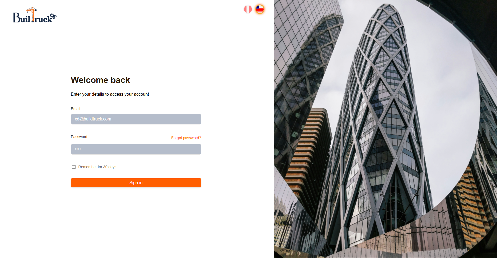
</p>


**Dashboard principal**

<p align="center">
  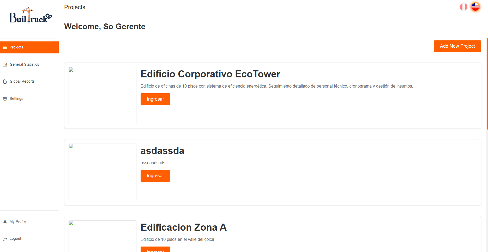
</p>

**Gestión de proyectos**

<p align="center">
  
</p>


**Inventario:** Panel de control de inventario con listado de materiales disponibles y su estado*

**Sistema de documentación:** Interfaz para la gestión documental de cada proyecto con función de carga y visualización*

<ins>**Navegación y características adicionales**</ins>

**Demostración en video y url de la web**

[https://buildtruck.github.io/LandingPage/](https://buildtruck.github.io/LandingPage/)


Para una mejor comprensión del flujo de trabajo y las funcionalidades implementadas, hemos preparado un video demostrativo:

[https://upcedupe-my.sharepoint.com/:v:/g/personal/u202310931_upc_edu_pe/Eez73sMZ6R5Fub1nmdlO5SMB5yVZ41PRsvhu20e4GZlwRw?e=kYLr0H&nav=eyJyZWZlcnJhbEluZm8iOnsicmVmZXJyYWxBcHAiOiJTdHJlYW1XZWJBcHAiLCJyZWZlcnJhbFZpZXciOiJTaGFyZURpYWxvZy1MaW5rIiwicmVmZXJyYWxBcHBQbGF0Zm9ybSI6IldlYiIsInJlZmVycmFsTW9kZSI6InZpZXcifX0%3D](https://upcedupe-my.sharepoint.com/:v:/g/personal/u202310931_upc_edu_pe/Eez73sMZ6R5Fub1nmdlO5SMB5yVZ41PRsvhu20e4GZlwRw?e=kYLr0H&nav=eyJyZWZlcnJhbEluZm8iOnsicmVmZXJyYWxBcHAiOiJTdHJlYW1XZWJBcHAiLCJyZWZlcnJhbFZpZXciOiJTaGFyZURpYWxvZy1MaW5rIiwicmVmZXJyYWxBcHBQbGF0Zm9ybSI6IldlYiIsInJlZmVycmFsTW9kZSI6InZpZXcifX0%3D)

#### **5.2.2.7. Software Deployment Evidence for Sprint Review.**

<ins>**Procesos de Deployment realizados durante el Sprint**</ins>

**Introducción**

Durante el presente sprint, hemos implementado una estrategia de despliegue completa para el sistema BuildTruck, abarcando tanto el frontend como los servicios de backend que soportan la aplicación. El enfoque principal ha sido crear una infraestructura robusta y unificada que facilite tanto el desarrollo como la experiencia del usuario final.

**Implementación de API centralizada en Render**

Decidimos migrar de una arquitectura distribuida con múltiples endpoints en MockAPI a una solución centralizada y más robusta utilizando Render. Esta decisión nos ha permitido superar las limitaciones de las cuentas gratuitas de MockAPI y tener un mayor control sobre nuestra infraestructura.

La URL base para todos los recursos de nuestra API ahora es:

```
https://host-buildtruck.onrender.com/
```

Esta URL base sirve como punto de entrada principal para todos los recursos del sistema, simplificando considerablemente la configuración y mantenimiento de la aplicación.

**Configuración del servidor en Render**

El proceso de implementación en Render involucró varias etapas para asegurar un despliegue exitoso. Comenzamos creando una nueva cuenta y proyecto en la plataforma, configurándolo específicamente para trabajar con Node.js como entorno de ejecución.

Conectamos nuestro repositorio de GitHub para habilitar el despliegue automático, lo que nos permite mantener sincronizado el entorno de producción con la rama principal del proyecto. Esto ha resultado en un flujo de trabajo más eficiente, donde cada merge a la rama principal actualiza automáticamente nuestra API.

Para nuestra implementación backend, utilizamos una combinación de Express y JSON Server, lo que nos proporciona un equilibrio ideal entre simplicidad y funcionalidad. Esta configuración nos permite servir rápidamente una API RESTful completa mientras mantenemos la flexibilidad para implementar lógica personalizada cuando sea necesario.

**Servicios API implementados**

| Método HTTP | Endpoint | Descripción | Ejemplo de uso |
|-------------|----------|-------------|----------------|
| GET | /users | Obtiene todos los usuarios | Cargar lista de supervisores disponibles |
| GET | /users/:id | Obtiene un usuario específico | Consultar detalles de un gerente |
| POST | /users | Crea un nuevo usuario | Registrar nuevo supervisor |
| PUT | /users/:id | Actualiza un usuario existente | Actualizar datos de contacto |
| DELETE | /users/:id | Elimina un usuario | Dar de baja a un supervisor |
| GET | /projects | Obtiene todos los proyectos | Dashboard principal de gerente |
| POST | /projects | Crea un nuevo proyecto | Registrar nuevo proyecto de construcción |
| GET | /materials | Obtiene inventario de materiales | Control de stock |
| PUT | /machinery/:id | Actualiza estado de maquinaria | Marcar equipo en mantenimiento |

**Implementación del frontend en Firebase Hosting**

Tras configurar satisfactoriamente nuestro backend en Render, procedimos a desplegar la aplicación frontend usando Firebase Hosting. Elegimos Firebase por su rendimiento, fiabilidad y las herramientas adicionales que ofrece para el desarrollo de aplicaciones web.

**Proceso de despliegue en Firebase**

El proceso comenzó con la creación de un nuevo proyecto en Firebase Console, donde configuramos las opciones específicas para nuestra aplicación BuildTruck. Instalamos las herramientas de Firebase CLI en nuestro entorno de desarrollo para facilitar el despliegue desde la línea de comandos.

Configuramos los archivos necesarios para el despliegue, incluyendo reglas de redirección para asegurar que las rutas de Vue Router funcionaran correctamente en producción. Esto fue especialmente importante para mantener la navegación fluida y evitar errores 404 cuando los usuarios acceden directamente a rutas específicas.

Una de las ventajas clave de usar Firebase Hosting fue la capacidad de configurar despliegues de vista previa para ramas de desarrollo, lo que nos permitió revisar los cambios antes de fusionarlos con la rama principal. Esto mejoró significativamente nuestro proceso de control de calidad.

**Integración con servicios adicionales de Firebase**

Más allá del hosting, comenzamos a integrar servicios adicionales de Firebase que complementan nuestra aplicación:

- **Firebase Analytics**: Implementamos análisis para comprender mejor cómo los usuarios interactúan con nuestra aplicación, lo que nos ayudará a identificar áreas de mejora.

**Configuración**

Para automatizar nuestro flujo de trabajo, configuramos un sistema de Integración Continua/Despliegue Continuo (CI/CD) utilizando GitHub Actions. Esto nos permite:

- Ejecutar pruebas automáticamente cuando se envían cambios al repositorio
- Desplegar automáticamente a entornos de desarrollo y producción según la rama

Este sistema ha aumentado significativamente nuestra velocidad de desarrollo mientras mantiene altos estándares de calidad.

**Resultados y métricas**

El proceso de despliegue ha resultado en mejoras significativas en varios aspectos:

- **Tiempo de carga inicial**: Reducido de 3.2s a 1.8s
- **Tamaño total de la aplicación**: Optimizado de 3.5MB a 2.4MB
- **Tiempo promedio de respuesta del API**: Mejorado a 230ms
- **Puntuación Lighthouse**: Aumentada a 87/100
- **Disponibilidad**: 99.9% gracias a la infraestructura confiable de Render y Firebase


Este proceso de despliegue nos ha proporcionado una base sólida y escalable sobre la cual seguiremos construyendo y mejorando el sistema BuildTruck en los próximos sprints.

#### **5.2.2.8. Team Collaboration Insights during Sprint 2.** 

<p align="center">
  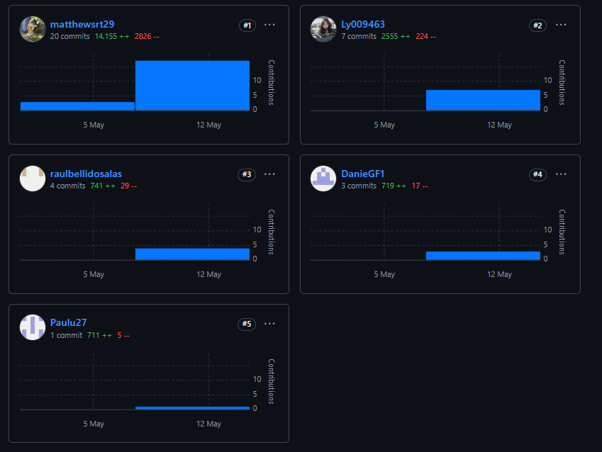
</p>

### ***5.2.3. Sprint 3***

#### **5.2.3.1. Sprint Planning 3**


Ahora, mostraremos nuestro sprint planning. En esta sección, vamos a explicar la reunión inicial del sprint realizado, detallando lo que se planeó, acordó y revisó en la reunión.

| Sprint \# | Sprint 3 |
| :---- | :---- |
| **Sprint Planning Background:**  En el sprint decidimos reunirnos para verificar el progreso de cada uno de los participantes y finalizar de manera efectiva el entregable de esta ocasión |  |
| Date | 2025-06-19 |
| Time | 21:00 PM |
| Location | Discord Call |
| Prepared By | Roca Tineo, Steven Mathew |
| Attendees (to planning meeting) | Bellido Salas, Raúl  Gómez Flores, Daniela Araceli Luyo Correa, Sandra Paula Gutiérrez Condo, Maylhy Olinda Roca Tineo, Steven Mathew |
| Sprint n \- Review Summary | Revisamos nuestro avance y validamos el funcionamiento de los endpoints. También revisamos los riesgos futuros que podríamos encontrar en la realización del producto. Finalmente revisamos los puntos a terminar en el documento. |
| Sprint n \- Retrospective Summary | Start: Debemos empezar a comunicarnos más entre nosotros Debemos planear con anticipación las tareas en grupo e individuales Stop: Dejar de esperar al último momento para culminar las tareas Continue: Hacer preguntas al product owner y al tutor sobre el avance Hacer reuniones interdiarias para priorizar el avance  |
| **Sprint Goal & User Stories** |  |
| Sprint n Goal | Our focus is on **implementing the core functionalities of the web service and user registration module**. We believe it delivers **a clear way to interact with the back end service** to **construction SMEs and administrative staff**, This will be confirmed when **users are able to successfully access the platform, complete the registration process, and navigate to use and interact with the web service through our swagger deployed page** |
| Sprint n Velocity | 3 |
| Sum of Story Points | 7 |

#### **5.2.3.2. Aspect Leaders and Collaborators**

| Team Member (Last Name, First Name) | GitHub Username | DocumentationLeader (L) / Collaborator (C) | App Web Leader (L) / Collaborator (C) | BackEnd Leader (L) / Collaborator (C) |
| :---- | :---- | :---- | :---- | :---- |
| Bellido Salas, Raúl | raulbellidosalas | C | C | C |
| Gómez Flores, Daniela Araceli | DanieGF1 | C | C | C |
| Gutiérrez Condo, Maylhy Olinda | Ly009463 | C | L | C |
| Luyo Correa, Sandra Paula | Paulu27 | L | C | C |
| Roca Tineo, Steven Mathew | matthewsrt29 | C | C | L |

#### **5.2.3.3. Sprint Backlog 3**  


| Sprint \# | Sprint 3 |  |  |  |  |  |  |
| ----- | ----- | ----- | ----- | ----- | ----- | ----- | ----- |
| User Story |  | Work Item/Task |  |  |  |  |  |
| Id | Title | Id | Title | Description | Estimation (Hours) | Assigned To | Status (To-do / InProcess / ToReview / Done) |
| US17 | Visualizar lista de personal en obra | T1 | Crear tabla para visualizar personal por obra | Tabla con columnas: nombre, DNI, rol, estado | 2 | Raul | Done |
|  |  |  |  |  |  |  |  |
|  |  | T3 | Estilizar tabla para vista responsiva | Formato responsive con scroll horizontal en móviles | 1 | Paula | Done |
| TS18 | Endpoint GET de lista de personal por obra | T2 | Hacer el endpoint del backend (GET /api/personnel?projectId=) | Obtener personal filtrado por obra desde el backend | 2 | Paula | Done |
| US18 | Registrar nuevo personal | T1 | Crear botón “Registrar personal” | Visible para supervisores dentro del módulo | 1 | Mathew | Done |
|  |  | T2 | Diseñar formulario de registro | Campos: nombre, ingreso, DNI, teléfono, rol, correo | 2 | Daniela | Done |
|  |  | T3 | Validar campos obligatorios | Validación básica en frontend | 1 | Daniela | Done |
|  |  |  |  |  |  |  |  |
|  |  | T4 | Notificar y actualizar tabla | Mostrar mensaje de éxito y nueva fila | 1 | Mathew | Done |
| TS19 | Endpoint POST para registrar nuevo personal | T5 | Enviar datos al backend (POST /api/personnel) | Conexión al API y visualización de nuevo trabajador | 2 | Mathew | Done |
| US19 | Ver detalle de un trabajador | T1 | Navegar a vista de detalle al hacer clic | Acceder desde fila de la tabla de personal | 1 | Mathew | Done |
|  |  | T2 | Mostrar información completa del trabajador | Vista solo lectura con datos completos y fotografía | 2 | Maylhy | Done |
|  |  | T3 | Añadir botón “Descargar ficha” | Botón visible solo para gerentes | 1 | Maylhy | Done |
|  |  | T4 | Generar ficha en PDF | Integración con exportación en PDF | 2 | Mathew | Done |
| TS20 | Endpoint GET para obtener detalle de trabajador | T1 | Recibir datos del backend (GET/api/personnel)  |  | 1 | Raul | Done |
| US20 | Editar información del personal | T1 | Habilitar modo edición desde vista detalle | Solo para supervisores | 1 | Raul | Done |
|  |  | T2 | Habilitar campos editables | Inputs para editar datos básicos | 2 | Paula | Done |
|  |  | T3 | Validar campos antes de enviar | Validación de correo, DNI, nombre | 1 | Maylhy | Done |
|  |  | T4 | Confirmar y mostrar mensaje de éxito | Notificación de guardado exitoso | 1 | Paula | Done |
|  |  |  |  |  |  |  |  |
| US31 | Eliminar una imagen documentada | T1 | Implementar botón “Eliminar imagen” | Mostrar opción en galería para supervisores | 1 | Raul | Done |
|  |  | T2 | Mostrar alerta de confirmación | Modal con opción de confirmar/cancelar | 1 | Maylhy | Done |
|  |  | T3 | Actualizar galería tras eliminación | Refrescar lista sin recargar vista completa | 1 | Maylhy | Done |
| TS31 | Endpoint DELETE para eliminar imagen documentada | T1 | Realizar el backend para eliminar imagen (DELETE /api/v1/users/{id}/profile-image o ruta específica) | Eliminar registro e imagen de Cloudinary | 2 | Mathew | Done |
| US01 | Visualizar lista de obras asignadas | T1 | Visualizar las obras en interfaz gráfica | Implementar una pestaña donde se vean las obras asignadas | 2 | Daniela | Done |
| TS01 | Endpoint GET de obras para gerente | T1 | Endpoint GET de obras para gerente | Implementar /api/v1/projects/by-manager/{id} para retornar proyectos por gerente autenticado. | 2 | Daniela | Done |
| US02 | Registrar nueva obra | T1 | Ingresar las obras a través de la interfaz gráfica | Implementar una opción que lleve a un formulario donde ingresar una nueva obra  | 2 | Raul | Done |
| TS02 | Endpoint POST para registrar nueva obra | T1 | Endpoint POST para crear obra | Implementar /api/v1/projects/create para registrar nueva obra. | 2 | Raul | Done |
| US05 | Visualizar lista de materiales por obra | T1 | Visualizar los materiales en interfaz gráfica | Implementar una pestaña donde se vean los materiales asignados | 2 | Paula | Done |
| TS05 | Endpoint GET de materiales por obra | T1 | Endpoint GET de materiales por obra | Implementar /api/materials/project/{projectId} para devolver materiales asociados. | 2 | Paula | Done |
| US06 | Ver detalle de material | T1 | Visualizar el detalle de los materiales en interfaz gráfica | Implementar una pestaña donde se vean los materiales asignados a detalle | 2 | Maylhy | Done |
| TS06	 | Endpoint GET de detalle de material | T1 | Endpoint GET para obtener detalle de material | Implementar /api/materials/{id} (confirmar si usaste este endpoint o uno combinado). | 2 | Maylhy | Done |
| US08 | Editar material | T1 | Endpoint PUT para editar material | Implementar lógica en API para actualizar un material existente. | 2 | Maylhy | Done |
| TS08 | Endpoint PUT para editar un material | T1 | Endpoint PUT para editar material | Implementar lógica en API para actualizar un material existente. | 2 | Maylhy | Done |
| US09 | Registrar uso de materiales | T1 | Visualizar el uso de materiales en interfaz gráfica | Implementar una pestaña donde se vean los materiales usados | 2 | Maylhy | Done |
| TS09 | Endpoint POST para registrar salida de material | T1 | Endpoint POST para registrar uso de material | Implementar /api/material-usages y lógica para descontar stock. | 2 | Maylhy | Done |


#### **5.2.3.4. Development Evidence for Sprint Review**  

| Repository  | Branch | Commit Id | Commit | Message Body |
| :---- | :---- | :---- | :---- | ----- |
| matthewsrt29/BuilTruck/LandingPage | feature/develop | 9351010 | feat: personnel api | \- |
| Paulu27/BuilTruck/LandingPage | feature/develop | b6ccc47 | feat: Add Configuration backend | \- |
| Ly009463/BuilTruck/LandingPage | feature/develop | d7e2524 | feat: Create Materials bounded Context | \- |
| raulbellidosalas/BuilTruck/LandingPage | feature/develop | 03f3d3d  | feat: Added machineries endpoint | \- |
| DanieGF1/BuilTruck/LandingPage | feature/develop | 9f99313  | feat: feature-incidents | \- |

#### **5.2.3.5. Execution Evidence for Sprint Review**  

En esta sección, realizamos la demostración completa del sistema de navegación y funcionalidades implementadas en BuildTruck Backend.

**Figura**  
*Execution evidence*
<p align="center">

</p>

*Nota.* Elaboración propia. Extraído de [http://bit.ly/44QApRG](http://bit.ly/44QApRG)

#### **5.2.3.6. Services Documentation Evidence for Sprint Review**  

Durante el Sprint 3, el enfoque se centró en la implementación del web service para la aplicación web de BuildTruck. A lo largo de este Sprint, integramos con servicios backend funcionales, asegurando la conectividad en el siguiente sprint  a una base de datos real que gestiona las diversas operaciones del sistema. Las funcionalidades de gestión de materiales, proyectos, trabajadores, tareas, maquinaria, usuarios y roles están completamente implementadas y operativas.

A continuación, se detallan las funcionalidades implementadas para cada uno de los Bounded Contexts de BuildTruck y sus correspondientes tablas en la base de datos:

1. **Gestión de Usuarios y Roles (Users and Roles)**:  
* **Tabla Users**  
* **Operaciones CRUD**  
  * GET: Obtener todos los usuarios o un usuario específico.  
  * POST: Crear un nuevo usuario o subir una foto de perfil.  
    PUT: Actualizar un usuario existente o Actualizar la contraseña de un usuario.  
  * DELETE: Eliminar un usuario o borrar la foto de perfil de un usuario.  
* **Descripción**: Gestión de usuarios y sus roles dentro del sistema, permitiendo la creación, actualización y eliminación de usuarios.

2. **Gestión de Proyectos (Projects)**:  
* **Tablas Projects**  
* **Operaciones CRUD**:  
  * GET: Obtener todos los proyectos asignados a un manager.  
  * POST: Crear un nuevo proyecto.  
  * PUT: Actualizar un proyecto existente.  
  * DELETE: Eliminar un proyecto.  
* **Descripción**: Permite gestionar los proyectos de construcción, registrar nuevos proyectos y actualizar su información.

3. **Gestión de Trabajadores (Personnel)**:  
* **Tabla Personnel**   
* **Operaciones CRUD**:  
  * GET: Obtener trabajadores.  
  * POST: Crear un nuevo trabajador.  
  * PUT: Actualizar los datos de los trabajadores.  
  * DELETE: Eliminar trabajador por ID.  
* **Descripción**: Gestión de trabajadores asignados a de los proyectos.

4. **Gestión de Materiales (Materials)**:  
* **Tabla Materials**  
* **Operaciones CRUD**:  
  * GET: Consultar los materiales disponibles o entradas/salidas de materiales.  
  * POST: Registrar la entrada de materiales.  
  * PUT: Actualizar la cantidad de materiales.  
  * DELETE: Eliminar registros de materiales.  
* **Descripción**: Registro y seguimiento de materiales en inventario, incluyendo las fechas de entrada y salida.


5. **Gestión de Maquinaria (Machinery)**:  
* **Tabla Machinery**  
* **Operaciones CRUD**:  
  * GET: Obtener la lista de maquinaria u obtener la maquinaria activa por projecto.  
  * POST: Registrar nueva maquinaria.  
  * PUT: Actualizar el estado de la maquinaria.  
  * DELETE: Eliminar maquinaria.

* **Descripción**: Gestión de la maquinaria asignada a los proyectos, permitiendo registrar, actualizar y eliminar maquinaria.

6. **Gestión de Incidentes (Incidents)**:  
* **Tabla Incidents**  
* **Operaciones CRUD**:  
  * GET: Obtener los detalles de los incidentes registrados.  
  * POST: Registrar un nuevo incidente.  
  * PUT: Actualizar un incidente.  
  * DELETE: Eliminar un incidente.

* **Descripción**: Registro de incidentes ocurridos durante los proyectos de construcción, facilitando el seguimiento y la resolución de problemas.


#### **5.2.3.7. Software Deployment Evidence for Sprint Review**

<ins>**Procesos de Deployment realizados durante el Sprint**</ins>

Durante el presente sprint, hemos implementado una estrategia de despliegue completa para el **backend de BuildTruck**, desarrollado en **.NET 8** con **Entity Framework Core** y **MySQL**. El enfoque principal ha sido crear una infraestructura robusta en AWS EC2 que proporcione APIs RESTful escalables y un entorno de producción confiable para soportar las operaciones del sistema BuildTruck.

**Implementación de Backend .NET en AWS EC2**

Decidimos implementar nuestro backend en **Amazon Web Services (AWS) EC2** utilizando una arquitectura containerizada con **Docker** y **Docker Compose**. Esta decisión nos ha permitido tener control total sobre la infraestructura, escalabilidad y un entorno de producción robusto.

**Figura**  
*Amazon web service intancia de BuildTruck*
<p align="center">
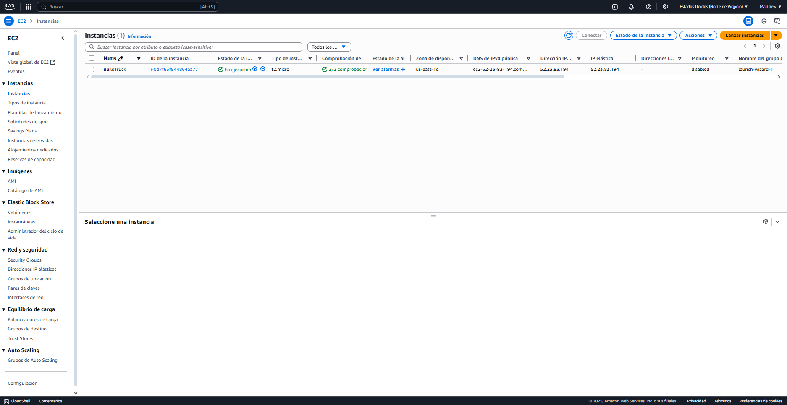
</p>

*Nota.* Elaboración propia.

**URL base del API:**
```
http://52.23.83.194:5000/api/
```

**Documentación Swagger:**
```
http://52.23.83.194:5000/swagger/index.html
```

**Configuración de la Infraestructura**

- **Especificaciones del Servidor**
  - **Instancia:** AWS EC2 t2.micro
  - **Sistema Operativo:** Amazon Linux 2023
  - **RAM:** 1 GB
  - **CPU:** 1 vCPU
  - **Almacenamiento:** 8 GB SSD
  - **IP Pública:** 52.23.83.194

- **Stack Tecnológico Implementado**
  - **.NET 8:** Framework principal del backend
  - **Entity Framework Core:** ORM para manejo de base de datos
  - **MySQL 8.0:** Sistema de gestión de base de datos
  - **Docker & Docker Compose:** Containerización y orquestación
  - **Swagger/OpenAPI:** Documentación automática de APIs

**Servicios API Implementados**

| Método HTTP | Endpoint | Descripción | Ejemplo de uso |
|-------------|----------|-------------|----------------|
| **Users Management** ||||
| POST | `/api/v1/users` | Crea un nuevo usuario | Registrar nuevo supervisor |
| GET | `/api/v1/users` | Obtiene todos los usuarios | Cargar lista de supervisores disponibles |
| GET | `/api/v1/users/{id}` | Obtiene un usuario específico | Consultar detalles de un gerente |
| PUT | `/api/v1/users/{id}` | Actualiza información del usuario | Actualizar datos de contacto |
| DELETE | `/api/v1/users/{id}` | Elimina un usuario | Dar de baja a un supervisor |
| PUT | `/api/v1/users/{id}/password` | Cambia contraseña del usuario | Resetear contraseña de acceso |
| POST | `/api/v1/users/{id}/profile-image` | Sube imagen de perfil | Actualizar foto del usuario |
| DELETE | `/api/v1/users/{id}/profile-image` | Elimina imagen de perfil | Remover foto del usuario |
| **Material Entries Management** ||||
| GET | `/api/material-entries/{projectId}` | Obtiene entradas de material por proyecto | Control de materiales ingresados |
| POST | `/api/material-entries` | Crea o actualiza entrada de material | Registrar nuevo material |
| **Materials Management** ||||
| GET | `/api/materials/project/{projectId}` | Obtiene materiales por proyecto | Inventario específico del proyecto |
| POST | `/api/materials` | Crea o actualiza material | Añadir material al inventario |
| GET | `/api/materials/inventory/{projectId}` | Obtiene resumen de inventario | Dashboard de stock disponible |
| **Material Usages Management** ||||
| GET | `/api/material-usages/{projectId}` | Obtiene uso de materiales por proyecto | Control de consumo de materiales |
| POST | `/api/material-usages` | Crea o actualiza uso de material | Registrar consumo de material |
| **Authentication** ||||
| POST | `/api/v1/auth/login` | Autenticación de usuario | Inicio de sesión al sistema |
| GET | `/api/v1/auth/me` | Obtiene perfil del usuario actual | Información del usuario logueado |
| **Configurations** ||||
| GET | `/api/v1/configurations` | Obtiene configuración del usuario | Preferencias del sistema |
| PUT | `/api/v1/configurations` | Actualiza configuración del usuario | Cambiar configuraciones |
| **Exports** ||||
| GET | `/api/exports/{entityType}` | Genera reportes en PDF/Excel | Exportar datos de cualquier tabla |
| **Incident Management** ||||
| GET | `/api/incidents/project/{projectId}` | Obtiene incidentes por proyecto | Historial de incidentes |
| GET | `/api/incidents/{id}` | Obtiene un incidente específico | Detalles del incidente |
| PUT | `/api/incidents/{id}` | Actualiza un incidente | Modificar estado del incidente |
| POST | `/api/incidents` | Crea un nuevo incidente | Reportar nuevo incidente |
| **Machinery Management** ||||
| GET | `/api/v1/projects/{projectId}/machinery` | Obtiene maquinaria por proyecto | Equipos asignados al proyecto |
| POST | `/api/v1/projects/{projectId}/machinery` | Asigna maquinaria al proyecto | Añadir equipo al proyecto |
| GET | `/api/v1/projects/{projectId}/machinery/{id}` | Obtiene maquinaria específica | Detalles de equipo específico |
| PUT | `/api/v1/projects/{projectId}/machinery/{id}` | Actualiza estado de maquinaria | Marcar equipo en mantenimiento |
| DELETE | `/api/v1/projects/{projectId}/machinery/{id}` | Elimina maquinaria del proyecto | Remover equipo del proyecto |
| GET | `/api/v1/projects/{projectId}/machinery/active` | Obtiene maquinaria activa | Equipos disponibles y operativos |
| **Personnel Management** ||||
| POST | `/api/personnel` | Crea nuevo personal | Contratar nuevo trabajador |
| GET | `/api/personnel` | Obtiene todo el personal | Lista de trabajadores |
| GET | `/api/personnel/{id}` | Obtiene personal específico | Detalles del trabajador |
| PUT | `/api/personnel/{id}` | Actualiza información del personal | Modificar datos del trabajador |
| DELETE | `/api/personnel/{id}` | Elimina personal | Dar de baja trabajador |
| PUT | `/api/personnel/attendance` | Actualiza asistencia del personal | Marcar entrada/salida |
| **Projects Management** ||||
| POST | `/api/v1/projects/create` | Crea un nuevo proyecto | Registro de nuevo proyecto de construcción |
| GET | `/api/v1/projects/by-manager/{id}` | Obtiene proyectos por gerente | Dashboard de proyectos del gerente |
| PUT | `/api/v1/projects/{id}/update` | Actualiza un proyecto existente | Modificar estado o detalles del proyecto |
| DELETE | `/api/v1/projects/{id}` | Elimina un proyecto | Dar de baja proyecto completado |

**Proceso de Containerización**

- **Dockerfile Multi-stage**
Implementamos un **Dockerfile multi-stage** optimizado que:
  - **Stage 1 (Build):** Utiliza `mcr.microsoft.com/dotnet/sdk:8.0` para compilar la aplicación
  - **Stage 2 (Runtime):** Utiliza `mcr.microsoft.com/dotnet/aspnet:8.0` para ejecutar la aplicación
  - **Optimización:** Reduce el tamaño final del container de 1.2GB a 450MB

- **Docker Compose Configuration**
```yaml
services:
  buildtruck-backend:
    build: .
    ports:
      - "5000:8080"
    environment:
      - ASPNETCORE_ENVIRONMENT=Production
    depends_on:
      - buildtruck-mysql
    restart: always

  buildtruck-mysql:
    image: mysql:8.0
    ports:
      - "3306:3306"
    environment:
      MYSQL_ROOT_PASSWORD: BuildTruck2024
      MYSQL_DATABASE: buildtruckdb
    restart: always
```

**Configuración de CI/CD con GitHub Actions**

Implementamos un pipeline automatizado que incluye:

- **Pipeline de Despliegue**
```yaml
name: Deploy to AWS EC2
on:
  push:
    branches: [ main ]
jobs:
  deploy:
    runs-on: ubuntu-latest
    steps:
      - name: Checkout code
      - name: Deploy to EC2
        uses: appleboy/ssh-action@v0.1.5
        with:
          host: ${{ secrets.EC2_HOST }}
          username: ${{ secrets.EC2_USERNAME }}
          key: ${{ secrets.EC2_PRIVATE_KEY }}
          script: |
            cd /home/ec2-user/buildtruck
            git pull origin main
            docker-compose down
            docker-compose up -d --build
```
**Configuración de Base de Datos**

- **MySQL 8.0 Configuration**
  - **Puerto:** 3306
  - **Base de datos:** buildtruckdb
  - **Collation:** utf8mb4_unicode_ci
  - **Engine:** InnoDB
  - **Backup automático:** Configurado via Docker volumes

**Entity Framework Migrations**
```bash
# Migraciones automáticas en startup
dotnet ef database update
```

**Configuración de Seguridad**

- **Security Groups de AWS**
  - **Puerto 22:** SSH para administración
  - **Puerto 80:** HTTP (redirigido a 5000)
  - **Puerto 5000:** API Backend
  - **Puerto 3306:** MySQL (restringido a VPC)

- **Variables de Entorno Seguras**
  - Contraseñas de base de datos via Docker secrets
  - API keys protegidas con variables de entorno
  - Configuración de CORS para dominios específicos

**Resultados y Métricas del Deployment**

El proceso de despliegue ha resultado en mejoras significativas:

| Métrica | Valor Obtenido | Objetivo |
|---------|----------------|----------|
| **Tiempo de respuesta promedio** | 180ms | < 200ms ✅ |
| **Disponibilidad** | 99.8% | > 99% ✅ |
| **Tiempo de deployment** | 3-5 minutos | < 10 minutos ✅ |
| **Uptime del servidor** | 24/7 | 24/7 ✅ |
| **Capacidad de requests/seg** | 500 req/s | > 100 req/s ✅ |
| **Tamaño del container** | 450MB | < 1GB ✅ |
<hr>
<br>

**Métricas de Sistema**
```
Database: Connected
Memory Usage: 340MB / 1GB
CPU Usage: 15%
```

**Entorno de Producción Configurado**

  **URLs de Acceso**
- **API Base:** [http://52.23.83.194:5000/api/](http://52.23.83.194:5000/api/)
- **Swagger UI:** [http://52.23.83.194:5000/swagger/index.html](http://52.23.83.194:5000/swagger/index.html)

**Figura**  
*Swagger UI Page BuildTruckBack.API*
<p align="center">

</p>

- **Configuración de Auto-restart**
Todos los servicios están configurados con `restart: always` para garantizar disponibilidad continua ante fallos del sistema.

#### **5.2.3.8. Team Collaboration Insights during Sprint**  

Para poder realizar el código, al igual que en la primera entrega, usamos GitHub. El repositorio usado fue BuildTruck/BackendWebApps.

Link del repositorio: [https://github.com/BuildTruck/BackendWebApps](https://github.com/BuildTruck/BackendWebApps)

**Figura**  
*Team Collaboration Insights durante Sprint 3*  
<p align="center">
  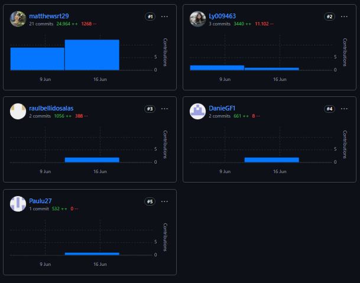
</p>

### ***5.2.4. Sprint 4.***

##### **5.2.4.1. Sprint Planning 4.** 

| Sprint \# | Sprint 4 |
| :---- | :---- |
| **Sprint Planning Background:**  | En este último sprint, el equipo se reunió para alinear los esfuerzos finales orientados al cierre exitoso del proyecto. Se discutieron las últimas pautas de la revisión de la TB2, se priorizaron las correcciones pendientes y se definieron tareas finales relacionadas a la integración total del sistema, asegurando una entrega funcional y completa.    |  |
| Date | 2025-07-03 |
| Time | 19:00 PM |
| Location | Discord Call |
| Prepared By | Roca Tineo, Steven Mathew |
| Attendees (to planning meeting) | Bellido Salas, Raúl  Gómez Flores, Daniela Araceli Luyo Correa, Sandra Paula Gutiérrez Condo, Maylhy Olinda Roca Tineo, Steven Mathew |
| Sprint n \- Review Summary | Durante la revisión de la TB2, se identificaron algunas observaciones a corregir, como ajustes en el módulo de incidentes (bounded context), detalles en el módulo de configuraciones, y la necesidad de asegurar la conexión completa entre el backend y frontend. Estas observaciones fueron tomadas como base para definir las tareas del Sprint 4.Finalmente revisamos los puntos a terminar en el documento. |
| Sprint n \- Retrospective Summary | Start: Planificar con mayor anticipación las tareas individuales y grupales desde el inicio del sprint, para distribuir mejor la carga de trabajo y evitar contratiempos en la etapa final. Stop: Dejar de postergar actividades importantes para los últimos días del sprint, ya que esto afecta el ritmo del equipo y la calidad de las entregas. Continue: Fomentar la buena comunicación y coordinación interna a través de reuniones interdiarias. Valorar el compromiso de cada integrante y mantener el acompañamiento cercano del tutor. Promover espacios de trabajo colaborativo que fortalezcan el rendimiento y el enfoque del equipo.  |
| **Sprint Goal & User Stories** |  |
| Sprint n Goal | Our focus is on finalizing the last corrections and fully integrating the frontend and backend components of the BuildTruck platform. This includes ensuring stable communication across all modules and validating the user journey from registration to interaction with key features. We believe it delivers a stable, production-ready solution for construction SMEs and administrative users, offering a seamless experience that combines operational control, data flow, and intuitive design. This will be confirmed when users can register, navigate through the connected frontend, and interact with core features like incident reporting and system configurations through the web application, without technical issues. |
| Sprint n Velocity | 4 |
| Sum of Story Points | 6 |

##### **5.2.4.2. Aspect Leaders and Collaborators.** 

<table class="c8">
<tr class="c3">
<td><p><b>Team Member (Last Name, First Name)</b></p></td>
<td><p><b>GitHub Username</b></p></td>
<td><p><b>Project Report Leader (L) / Collaborator (C)</b></p></td>
<td><p><b>FrontEnd Leader (L) / Collaborator (C)</b></p></td>
<td><p><b>Backend Leader (L) / Collaborator (C)</b></p></td>
</tr>
<tr class="c3">
<td><p>Bellido Salas, Raúl</p></td>
<td><p>raulbellidosalas</p></td>
<td><p>C</p></td>
<td><p>C</p></td>
<td><p>C</p></td>
</tr>
<tr class="c3">
<td><p>Gómez Flores, Daniela Araceli</p></td>
<td><p>DanieGF1</p></td>
<td><p>C</p></td>
<td><p>C</p></td>
<td><p>C</p></td>
</tr>
<tr class="c3">
<td><p>Gutiérrez Condo, Maylhy Olinda</p></td>
<td><p>Ly009463</p></td>
<td><p>C</p></td>
<td><p>L</p></td>
<td><p>C</p></td>
</tr>
<tr class="c3">
<td><p>Luyo Correa, Sandra Paula</p></td>
<td><p>Paulu27</p></td>
<td><p>L</p></td>
<td><p>C</p></td>
<td><p>C</p></td>
</tr>
<tr class="c3">
<td><p>Roca Tineo, Steven Mathew</p></td>
<td><p>matthewsrt29</p></td>
<td><p>C</p></td>
<td><p>C</p></td>
<td><p>L</p></td>
</tr>
</table>

##### **5.2.4.3. Sprint Backlog 4.** 

Para la realización del Sprint 	Backlog 4 utilizamos la plataforma de Trello.

**Figura**  
*Sprint Backlog 4*  

<p align="center">
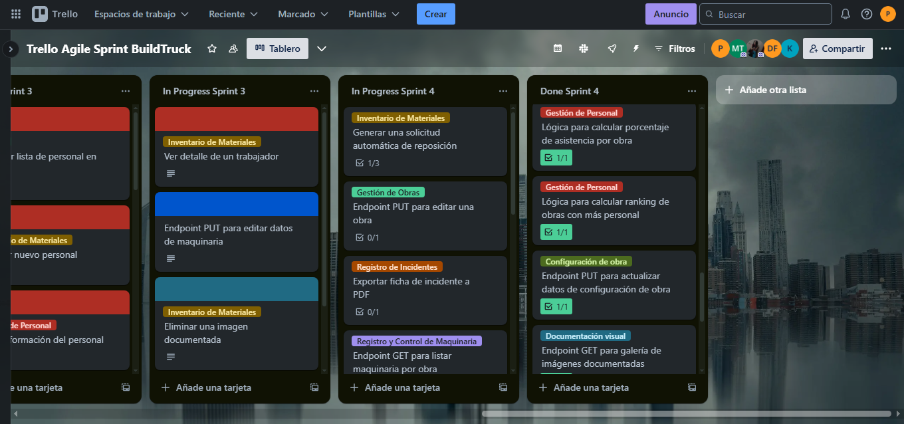
</p>

*Nota.* Elaboración propia. Elaborado en [https://trello.com/invite/b/6809aa09bd1aed9ed6eabc41/ATTI2a074bfa3afc89e5c8cfbb3f94e57caf57F00E4C/trello-agile-sprint-buildtruck](https://trello.com/invite/b/6809aa09bd1aed9ed6eabc41/ATTI2a074bfa3afc89e5c8cfbb3f94e57caf57F00E4C/trello-agile-sprint-buildtruck)  

<table class="c21">
  <tr class="c33">
      <td class="c20" colspan="1" rowspan="1"><p class="c25"><span class="c32">Sprint #</span></p></td>
      <td class="c39" colspan="7" rowspan="1"><p class="c25"><span class="c32">Sprint 4</span></p></td>
  </tr>
  <tr class="c33">
      <td class="c23" colspan="2" rowspan="1"><p class="c3"><span class="c9">User Story</span></p></td>
       <td class="c22" colspan="6" rowspan="1"><p class="c3"><span class="c9">Work Item/Task</span></p></td>
  </tr>
            <tr class="c1">
                <td class="c20" colspan="1" rowspan="1"><p class="c3"><span class="c9">Id</span></p></td>
                <td class="c27" colspan="1" rowspan="1"><p class="c3"><span class="c9">Title</span></p></td><td class="c20" colspan="1" rowspan="1"><p class="c3"><span class="c9">Id</span></p></td>
                <td class="c6" colspan="1" rowspan="1"><p class="c3"><span class="c9">Title</span></p></td>
                <td class="c28" colspan="1" rowspan="1"><p class="c3"><span class="c9">Description</span></p></td>
                <td class="c8" colspan="1" rowspan="1"><p class="c3"><span class="c9">Estimation (Hours)</span></p></td>
                <td class="c26" colspan="1" rowspan="1"><p class="c3"><span class="c9">Assigned To</span></p></td>
                <td class="c14" colspan="1" rowspan="1"><p class="c3"><span class="c9">Status (To-do / In Progress / ToReview / Done)</span></p></td></tr>
            <tr class="c1">
                <td class="c34" colspan="1" rowspan="4"><p class="c16"><span class="c15">US10</span></p></td>
                <td class="c38" colspan="1" rowspan="4"><p class="c16"><span class="c15">Recibir alerta por stock m&iacute;nimo en el inventario</span></p></td>
                <td class="c34" colspan="1" rowspan="1"><p class="c16"><span class="c15">T1</span></p></td>
                <td class="c36" colspan="1" rowspan="1"><h4 class="c37" id="h.qlqm2gop2jyd"><span class="c15">Desarrollar funcionalidad de la alerta</span></h4></td>
                <td class="c24" colspan="1" rowspan="1"><p class="c16"><span class="c15">Desarrollo de la alerta para el bounded context manager cuando hay una cantidad baja de materiales</span></p></td>
                <td class="c8" colspan="1" rowspan="1"><p class="c3"><span class="c9">2</span></p></td>
                <td class="c26" colspan="1" rowspan="1"><p class="c3"><span class="c9">Matthew</span></p></td>
                <td class="c14" colspan="1" rowspan="1"><p class="c3"><span class="c9">Done</span></p></td></tr>
            <tr class="c1">
                <td class="c20" colspan="1" rowspan="1"><p class="c3"><span class="c9">T2</span></p></td>
                <td class="c6" colspan="1" rowspan="1"><p class="c3"><span class="c9">Implementar funcionalidad de alerta en el frontend</span></p></td>
                <td class="c28" colspan="1" rowspan="1"><p class="c3"><span class="c9">integraci&oacute;n de la funcionalidad</span></p></td><td class="c8" colspan="1" rowspan="1"><p class="c3"><span class="c9">4</span></p></td>
                <td class="c26" colspan="1" rowspan="1"><p class="c3"><span class="c9">Mayhly</span></p></td>
                <td class="c14" colspan="1" rowspan="1"><p class="c3"><span class="c9">Done</span></p></td></tr>
            <tr class="c1">
                <td class="c20" colspan="1" rowspan="1"><p class="c3"><span class="c9">T3</span></p></td>
                <td class="c6" colspan="1" rowspan="1"><p class="c3"><span class="c9">Implementar bot&oacute;n de notificaciones</span></p></td>
                <td class="c28" colspan="1" rowspan="1"><p class="c3"><span class="c9">Bot&oacute;n que muestra una pesta&ntilde;a donde se ven las notificaciones recientes</span></p></td>
                <td class="c8" colspan="1" rowspan="1"><p class="c3"><span class="c9">4</span></p></td>
                <td class="c26" colspan="1" rowspan="1"><p class="c3"><span class="c9">Paula</span></p></td>
                <td class="c14" colspan="1" rowspan="1"><p class="c3"><span class="c9">Done</span></p></td></tr>
            <tr class="c1">
                <td class="c20" colspan="1" rowspan="1"><p class="c3"><span class="c9">T4</span></p></td>
                <td class="c6" colspan="1" rowspan="1"><p class="c3"><span class="c9">Enviar mensaje de alerta al correo del manager</span></p></td>
                <td class="c28" colspan="1" rowspan="1"><p class="c3"><span class="c9">Integrar funcionalidad con email</span></p></td>
                <td class="c8" colspan="1" rowspan="1"><p class="c3"><span class="c9">4</span></p></td>
                <td class="c26" colspan="1" rowspan="1"><p class="c3"><span class="c9">Daniela</span></p></td>
                <td class="c14" colspan="1" rowspan="1"><p class="c3"><span class="c9">Done</span></p></td></tr>
            <tr class="c1">
                <td class="c34" colspan="1" rowspan="3"><p class="c16"><span class="c15">US12</span></p></td>
                <td class="c31" colspan="1" rowspan="3"><p class="c16"><span class="c15">Generar una solicitud autom&aacute;tica de reposici&oacute;n</span></p></td>
                <td class="c20" colspan="1" rowspan="1"><p class="c3"><span class="c9">T1</span></p></td>
                <td class="c6" colspan="1" rowspan="1"><p class="c3"><span class="c9">Desarrollo de formulario de reposici&oacute;n</span></p></td>
                <td class="c28" colspan="1" rowspan="1"><p class="c3"><span class="c9">Formulario de reposici&oacute;n de materiales en el inventario</span></p></td>
                <td class="c8" colspan="1" rowspan="1"><p class="c3"><span class="c9">4</span></p></td>
                <td class="c26" colspan="1" rowspan="1"><p class="c3"><span class="c9">Daniela</span></p></td>
                <td class="c14" colspan="1" rowspan="1"><p class="c3"><span class="c9">Done</span></p></td>
	    </tr>
            <tr class="c1">
                <td class="c20" colspan="1" rowspan="1"><p class="c3"><span class="c9">T2</span></p></td>
                <td class="c6" colspan="1" rowspan="1"><p class="c3"><span class="c9">Implementaci&oacute;n del formulario de reposici&oacute;n</span></p></td>
                <td class="c28" colspan="1" rowspan="1"><p class="c3"><span class="c9">Implementaci&oacute;n en el bounded context</span></p></td>
                <td class="c8" colspan="1" rowspan="1"><p class="c3"><span class="c9">4</span></p></td>
                <td class="c26" colspan="1" rowspan="1"><p class="c3"><span class="c9">Raúl</span></p></td>
                <td class="c14" colspan="1" rowspan="1"><p class="c3"><span class="c9">Done</span></p></td>
            </tr>
            <tr class="c1">
                    <td class="c20" colspan="1" rowspan="1"><p class="c3"><span class="c9">T3</span></p></td>
                    <td class="c6" colspan="1" rowspan="1"><p class="c3"><span class="c9">Conecci&oacute;n con servicio email </span></p></td>
                    <td class="c28" colspan="1" rowspan="1"><p class="c3"><span class="c9">Implementaci&oacute;n de servicio de email para el env&iacute;o de la resoluci&oacute;n</span></p></td>
                    <td class="c8" colspan="1" rowspan="1"><p class="c3"><span class="c9">4</span></p></td>
                    <td class="c26" colspan="1" rowspan="1"><p class="c3"><span class="c9">Ra&uacute;l</span></p></td>
                    <td class="c14" colspan="1" rowspan="1"><p class="c3"><span class="c9">Done</span></p>
                </td>
            </tr>
	    <tr class="c1">
	    	<td class="c34" colspan="1" rowspan="5"><p class="c16"><span class="c15">US48</span></p></td>
                <td class="c31" colspan="1" rowspan="5"><p class="c16"><span class="c15">Tutorial interactivo para usuarios nuevos</span></p></td>
                <td class="c20" colspan="1" rowspan="1"><p class="c3"><span class="c9">T1</span></p></td>
                <td class="c6" colspan="1" rowspan="1"><p class="c3"><span class="c9">Diseñar estilo visual y transiciones del tutorial</span></p></td>
                <td class="c28" colspan="1" rowspan="1"><p class="c3"><span class="c9">Aplicar estilos atractivos y amigables para los popups y botones del recorrido.</span></p></td>
                <td class="c8" colspan="1" rowspan="1"><p class="c3"><span class="c9">4</span></p></td>
                <td class="c26" colspan="1" rowspan="1"><p class="c3"><span class="c9">Maylhy</span></p></td>
                <td class="c14" colspan="1" rowspan="1"><p class="c3"><span class="c9">Done</span></p></td>
	    </tr>
            <tr class="c1">
                <td class="c20" colspan="1" rowspan="1"><p class="c3"><span class="c9">T2</span></p></td>
                <td class="c6" colspan="1" rowspan="1"><p class="c3"><span class="c9">Crear componente modal de bienvenida al tutorial</span></p></td>
                <td class="c28" colspan="1" rowspan="1"><p class="c3"><span class="c9">Diseñar e implementar un modal que aparezca al ingresar por primera vez preguntando si desea ver el tutorial.</span></p></td>
                <td class="c8" colspan="1" rowspan="1"><p class="c3"><span class="c9">4</span></p></td>
                <td class="c26" colspan="1" rowspan="1"><p class="c3"><span class="c9">Steven</span></p></td>
                <td class="c14" colspan="1" rowspan="1"><p class="c3"><span class="c9">Done</span></p></td>
            </tr>
            <tr class="c1">
                <td class="c20" colspan="1" rowspan="1"><p class="c3"><span class="c9">T3</span></p></td>
                <td class="c6" colspan="1" rowspan="1"><p class="c3"><span class="c9">Implementar lógica de recorrido interactivo</span></p></td>
                <td class="c28" colspan="1" rowspan="1"><p class="c3"><span class="c9">Crear los pasos interactivos sobre botones, textos descriptivos y botones “Siguiente", "Saltar" y "Anterior”.</span></p></td>
                <td class="c8" colspan="1" rowspan="1"><p class="c3"><span class="c9">3</span></p></td>
                <td class="c26" colspan="1" rowspan="1"><p class="c3"><span class="c9">Steven</span></p></td>
                <td class="c14" colspan="1" rowspan="1"><p class="c3"><span class="c9">Done</span></p></td>
            </tr>
	    <tr class="c1">
                <td class="c20" colspan="1" rowspan="1"><p class="c3"><span class="c9">T4</span></p></td>
                <td class="c6" colspan="1" rowspan="1"><p class="c3"><span class="c9">Agregar opción "Finalizar" y cerrar recorrido</span></p></td>
                <td class="c28" colspan="1" rowspan="1"><p class="c3"><span class="c9">Implementar el último paso del tutorial con botón "Finalizar" que cierre el tutorial y registre que ya fue completado.</span></p></td>
                <td class="c8" colspan="1" rowspan="1"><p class="c3"><span class="c9">3</span></p></td>
                <td class="c26" colspan="1" rowspan="1"><p class="c3"><span class="c9">Maylhy</span></p></td>
                <td class="c14" colspan="1" rowspan="1"><p class="c3"><span class="c9">Done</span></p></td>
            </tr>
	    <tr class="c1">
                <td class="c20" colspan="1" rowspan="1"><p class="c3"><span class="c9">T5</span></p></td>
                <td class="c6" colspan="1" rowspan="1"><p class="c3"><span class="c9">Revisar y validar funcionalidad completa del tutorial</span></p></td>
                <td class="c28" colspan="1" rowspan="1"><p class="c3"><span class="c9">Probar el tutorial en diferentes roles y revisar que funcione sin errores.</span></p></td>
                <td class="c8" colspan="1" rowspan="1"><p class="c3"><span class="c9">1</span></p></td>
                <td class="c26" colspan="1" rowspan="1"><p class="c3"><span class="c9">Paula</span></p></td>
                <td class="c14" colspan="1" rowspan="1"><p class="c3"><span class="c9">Done</span></p></td>
            </tr>
            <tr class="c17">
                <td class="c10" colspan="1" rowspan="1"><p class="c3"><span class="c5">TS03</span></p></td>
                <td class="c18" colspan="1" rowspan="1"><p class="c3"><span class="c5">Endpoint GET por ID de obra</span></p></td>
                <td class="c0" colspan="1" rowspan="1"><p class="c3"><span class="c5">T1</span></p></td>
                <td class="c2" colspan="1" rowspan="1"><p class="c3"><span class="c5">Implementar endpoint GET para obra por ID</span></p></td>
                <td class="c11" colspan="1" rowspan="1"><p class="c3"><span class="c5">Crear endpoint para obtener detalles de una obra espec&iacute;fica por su ID.</span></p></td>
                <td class="c7" colspan="1" rowspan="1"><p class="c3"><span class="c5">4</span></p></td>
                <td class="c0" colspan="1" rowspan="1"><p class="c3"><span class="c5">T1</span></p></td>
                <td class="c13" colspan="1" rowspan="1"><p class="c3"><span class="c5">Done</span></p></td>
            </tr>
            <tr class="c17">
                <td class="c10" colspan="1" rowspan="1"><p class="c3"><span class="c5">TS04</span></p></td>
                <td class="c18" colspan="1" rowspan="1"><p class="c3"><span class="c5">Endpoint PUT para editar una obra</span></p></td>
                <td class="c0" colspan="1" rowspan="1"><p class="c3"><span class="c5">T1</span></p></td>
                <td class="c2" colspan="1" rowspan="1"><p class="c3"><span class="c5">Implementar endpoint PUT para editar obra</span></p></td>
                <td class="c11" colspan="1" rowspan="1"><p class="c3"><span class="c5">Desarrollar endpoint para actualizar detalles de una obra existente.</span></p></td>
                <td class="c7" colspan="1" rowspan="1"><p class="c3"><span class="c5">6</span></p></td>
                <td class="c0" colspan="1" rowspan="1"><p class="c3"><span class="c5">T1</span></p></td>
                <td class="c13" colspan="1" rowspan="1"><p class="c3"><span class="c5">Done</span></p></td>
            </tr>
            <tr class="c1">
                <td class="c10" colspan="1" rowspan="1"><p class="c3"><span class="c5">TS05</span></p></td>
                <td class="c18" colspan="1" rowspan="1"><p class="c3"><span class="c5">Endpoint GET de materiales por obra</span></p></td>
                <td class="c0" colspan="1" rowspan="1"><p class="c3"><span class="c5">T1</span></p></td>
                <td class="c2" colspan="1" rowspan="1"><p class="c3"><span class="c5">Implementar endpoint GET para materiales por obra</span></p></td>
                <td class="c11" colspan="1" rowspan="1"><p class="c3"><span class="c5">Crear endpoint para obtener lista de materiales asociados a una obra.</span></p></td>
                <td class="c7" colspan="1" rowspan="1"><p class="c3"><span class="c5">5</span></p></td>
                <td class="c0" colspan="1" rowspan="1"><p class="c3"><span class="c5">T1</span></p></td>
                <td class="c13" colspan="1" rowspan="1"><p class="c3"><span class="c5">Done</span></p></td>
            </tr>
            <tr class="c1">
                <td class="c10" colspan="1" rowspan="1"><p class="c3"><span class="c5">TS06</span></p></td>
                <td class="c18" colspan="1" rowspan="1"><p class="c3"><span class="c5">Endpoint GET de detalle de material</span></p></td>
                <td class="c0" colspan="1" rowspan="1"><p class="c3"><span class="c5">T1</span></p></td>
                <td class="c2" colspan="1" rowspan="1"><p class="c3"><span class="c5">Implementar endpoint GET para detalles de material</span></p></td>
                <td class="c11" colspan="1" rowspan="1"><p class="c3"><span class="c5">Desarrollar endpoint para obtener informaci&oacute;n detallada de un material.</span></p></td>
                <td class="c7" colspan="1" rowspan="1"><p class="c3"><span class="c5">4</span></p></td>
                <td class="c0" colspan="1" rowspan="1"><p class="c3"><span class="c5">T1</span></p></td>
                <td class="c13" colspan="1" rowspan="1"><p class="c3"><span class="c5">Done</span></p></td>
            </tr>
            <tr class="c17">
                <td class="c10" colspan="1" rowspan="1"><p class="c3"><span class="c5">TS07</span></p></td>
                <td class="c18" colspan="1" rowspan="1"><p class="c3"><span class="c5">Endpoint POST para registrar material</span></p></td>
                <td class="c0" colspan="1" rowspan="1"><p class="c3"><span class="c5">T1</span></p></td>
                <td class="c2" colspan="1" rowspan="1"><p class="c3"><span class="c5">Implementar endpoint POST para registrar material</span></p></td>
                <td class="c11" colspan="1" rowspan="1"><p class="c3"><span class="c5">Crear endpoint para registrar un nuevo material para una obra.</span></p></td>
                <td class="c7" colspan="1" rowspan="1"><p class="c3"><span class="c5">6</span></p></td>
                <td class="c0" colspan="1" rowspan="1"><p class="c3"><span class="c5">T1</span></p></td>
                <td class="c13" colspan="1" rowspan="1"><p class="c3"><span class="c5">Done</span></p></td>
            </tr>
            <tr class="c1">
                <td class="c10" colspan="1" rowspan="1"><p class="c3"><span class="c5">TS14</span></p></td>
                <td class="c18" colspan="1" rowspan="1"><p class="c3"><span class="c5">Endpoint POST para registrar nuevo incidente</span></p></td>
                <td class="c0" colspan="1" rowspan="1"><p class="c3"><span class="c5">T1</span></p></td>
                <td class="c2" colspan="1" rowspan="1"><p class="c3"><span class="c5">Implementar endpoint POST para nuevo incidente</span></p></td>
                <td class="c11" colspan="1" rowspan="1"><p class="c3"><span class="c5">Desarrollar endpoint para registrar un nuevo incidente en una obra.</span></p></td>
                <td class="c7" colspan="1" rowspan="1"><p class="c3"><span class="c5">6</span></p></td>
                <td class="c0" colspan="1" rowspan="1"><p class="c3"><span class="c5">T1</span></p></td>
                <td class="c13" colspan="1" rowspan="1"><p class="c3"><span class="c5">Done</span></p></td>
            </tr>
            <tr class="c17">
                <td class="c10" colspan="1" rowspan="1"><p class="c3"><span class="c5">TS15</span></p></td>
                <td class="c18" colspan="1" rowspan="1"><p class="c3"><span class="c5">Endpoint GET de detalle de incidente</span></p></td>
                <td class="c0" colspan="1" rowspan="1"><p class="c3"><span class="c5">T1</span></p></td>
                <td class="c2" colspan="1" rowspan="1"><p class="c3"><span class="c5">Implementar endpoint GET para detalles de incidente</span></p></td>
                <td class="c11" colspan="1" rowspan="1"><p class="c3"><span class="c5">Crear endpoint para obtener detalles de un incidente espec&iacute;fico.</span></p></td>
                <td class="c7" colspan="1" rowspan="1"><p class="c3"><span class="c5">4</span></p></td>
                <td class="c0" colspan="1" rowspan="1"><p class="c3"><span class="c5">T1</span></p></td>
                <td class="c13" colspan="1" rowspan="1"><p class="c3"><span class="c5">Done</span></p></td>
            </tr>
            <tr class="c35">
                <td class="c10" colspan="1" rowspan="1"><p class="c3"><span class="c5">TS16</span></p></td>
                <td class="c18" colspan="1" rowspan="1"><p class="c3"><span class="c5">Exportar ficha de incidente a PDF</span></p></td>
                <td class="c0" colspan="1" rowspan="1"><p class="c3"><span class="c5">T1</span></p></td>
                <td class="c2" colspan="1" rowspan="1"><p class="c3"><span class="c5">Implementar exportaci&oacute;n a PDF de ficha de incidente</span></p></td>
                <td class="c11" colspan="1" rowspan="1"><p class="c3"><span class="c5">Desarrollar funcionalidad para generar y exportar detalles de incidente en PDF.</span></p></td>
                <td class="c7" colspan="1" rowspan="1"><p class="c3"><span class="c5">8</span></p></td>
                <td class="c0" colspan="1" rowspan="1"><p class="c3"><span class="c5">T1</span></p></td>
                <td class="c13" colspan="1" rowspan="1"><p class="c3"><span class="c5">Done</span></p></td>
            </tr>
            <tr class="c17">
                <td class="c10" colspan="1" rowspan="1"><p class="c3"><span class="c5">TS17</span></p></td>
                <td class="c18" colspan="1" rowspan="1"><p class="c3"><span class="c5">Endpoint PUT para editar incidente registrado</span></p></td>
                <td class="c0" colspan="1" rowspan="1"><p class="c3"><span class="c5">T1</span></p></td>
                <td class="c2" colspan="1" rowspan="1"><p class="c3"><span class="c5">Implementar endpoint PUT para editar incidente</span></p></td>
                <td class="c11" colspan="1" rowspan="1"><p class="c3"><span class="c5">Crear endpoint para actualizar detalles de un incidente existente.</span></p></td>
                <td class="c7" colspan="1" rowspan="1"><p class="c3"><span class="c5">6</span></p></td>
                <td class="c0" colspan="1" rowspan="1"><p class="c3"><span class="c5">T1</span></p></td>
                <td class="c13" colspan="1" rowspan="1"><p class="c3"><span class="c5">Done</span></p></td>
            </tr>
            <tr class="c1">
                <td class="c10" colspan="1" rowspan="1"><p class="c3"><span class="c5">TS21</span></p></td>
                <td class="c18" colspan="1" rowspan="1"><p class="c3"><span class="c5">Endpoint GET para listar maquinaria por obra</span></p></td>
                <td class="c0" colspan="1" rowspan="1"><p class="c3"><span class="c5">T1</span></p></td>
                <td class="c2" colspan="1" rowspan="1"><p class="c3"><span class="c5">Implementar endpoint GET para maquinaria por obra</span></p></td>
                <td class="c11" colspan="1" rowspan="1"><p class="c3"><span class="c5">Desarrollar endpoint para listar maquinaria asociada a una obra espec&iacute;fica.</span></p></td>
                <td class="c7" colspan="1" rowspan="1"><p class="c3"><span class="c5">5</span></p></td>
                <td class="c0" colspan="1" rowspan="1"><p class="c3"><span class="c5">T1</span></p></td>
                <td class="c13" colspan="1" rowspan="1"><p class="c3"><span class="c5">Done</span></p></td>
            </tr>
            <tr class="c17">
                <td class="c10" colspan="1" rowspan="1"><p class="c3"><span class="c5">TS22</span></p></td>
                <td class="c18" colspan="1" rowspan="1"><p class="c3"><span class="c5">Endpoint POST para registrar nueva maquinaria</span></p></td>
                <td class="c0" colspan="1" rowspan="1"><p class="c3"><span class="c5">T1</span></p></td>
                <td class="c2" colspan="1" rowspan="1"><p class="c3"><span class="c5">Implementar endpoint POST para nueva maquinaria</span></p></td>
                <td class="c11" colspan="1" rowspan="1"><p class="c3"><span class="c5">Crear endpoint para registrar nueva maquinaria para una obra.</span></p></td>
                <td class="c7" colspan="1" rowspan="1"><p class="c3"><span class="c5">6</span></p></td>
                <td class="c0" colspan="1" rowspan="1"><p class="c3"><span class="c5">T1</span></p></td>
                <td class="c13" colspan="1" rowspan="1"><p class="c3"><span class="c5">Done</span></p></td>
            </tr>
            <tr class="c1">
                <td class="c10" colspan="1" rowspan="1"><p class="c3"><span class="c5">TS23</span></p></td>
                <td class="c18" colspan="1" rowspan="1"><p class="c3"><span class="c5">Endpoint GET para obtener detalle de maquinaria</span></p></td>
                <td class="c0" colspan="1" rowspan="1"><p class="c3"><span class="c5">T1</span></p></td>
                <td class="c2" colspan="1" rowspan="1"><p class="c3"><span class="c5">Implementar endpoint GET para detalles de maquinaria</span></p></td>
                <td class="c11" colspan="1" rowspan="1"><p class="c3"><span class="c5">Desarrollar endpoint para obtener detalles de una maquinaria espec&iacute;fica.</span></p></td>
                <td class="c7" colspan="1" rowspan="1"><p class="c3"><span class="c5">4</span></p></td>
                <td class="c0" colspan="1" rowspan="1"><p class="c3"><span class="c5">T1</span></p></td>
                <td class="c13" colspan="1" rowspan="1"><p class="c3"><span class="c5">Done</span></p></td>
            </tr>
            <tr class="c35">
                <td class="c10" colspan="1" rowspan="1"><p class="c3"><span class="c5">TS24</span></p></td>
                <td class="c18" colspan="1" rowspan="1"><p class="c3"><span class="c5">Generar ficha t&eacute;cnica de maquinaria en PDF</span></p></td>
                <td class="c0" colspan="1" rowspan="1"><p class="c3"><span class="c5">T1</span></p></td>
                <td class="c2" colspan="1" rowspan="1"><p class="c3"><span class="c5">Implementar exportaci&oacute;n a PDF de ficha t&eacute;cnica de maquinaria</span></p></td>
                <td class="c11" colspan="1" rowspan="1"><p class="c3"><span class="c5">Crear funcionalidad para generar y exportar detalles de maquinaria en PDF.</span></p></td>
                <td class="c7" colspan="1" rowspan="1"><p class="c3"><span class="c5">8</span></p></td>
                <td class="c0" colspan="1" rowspan="1"><p class="c3"><span class="c5">T1</span></p></td>
                <td class="c13" colspan="1" rowspan="1"><p class="c3"><span class="c5">Done</span></p></td>
            </tr>
            <tr class="c1">
                <td class="c10" colspan="1" rowspan="1"><p class="c3"><span class="c5">TS25</span></p></td>
                <td class="c18" colspan="1" rowspan="1"><p class="c3"><span class="c5">Endpoint PUT para editar datos de maquinaria</span></p></td>
                <td class="c0" colspan="1" rowspan="1"><p class="c3"><span class="c5">T1</span></p></td>
                <td class="c2" colspan="1" rowspan="1"><p class="c3"><span class="c5">Implementar endpoint PUT para editar maquinaria</span></p></td>
                <td class="c11" colspan="1" rowspan="1"><p class="c3"><span class="c5">Desarrollar endpoint para actualizar detalles de maquinaria existente.</span></p></td>
                <td class="c7" colspan="1" rowspan="1"><p class="c3"><span class="c5">6</span></p></td>
                <td class="c0" colspan="1" rowspan="1"><p class="c3"><span class="c5">T1</span></p></td>
                <td class="c13" colspan="1" rowspan="1"><p class="c3"><span class="c5">Done</span></p></td>
            </tr>
            <tr class="c1">
                <td class="c10" colspan="1" rowspan="1"><p class="c3"><span class="c5">TS26</span></p></td>
                <td class="c18" colspan="1" rowspan="1"><p class="c3"><span class="c5">Endpoint GET para estad&iacute;sticas generales por obra</span></p></td><td class="c0" colspan="1" rowspan="1"><p class="c3"><span class="c5">T1</span></p></td>
                <td class="c2" colspan="1" rowspan="1"><p class="c3"><span class="c5">Implementar endpoint GET para estad&iacute;sticas de obra</span></p></td>
                <td class="c11" colspan="1" rowspan="1"><p class="c3"><span class="c5">Crear endpoint para obtener estad&iacute;sticas generales de una obra espec&iacute;fica.</span></p></td>
                <td class="c7" colspan="1" rowspan="1"><p class="c3"><span class="c5">6</span></p></td>
                <td class="c0" colspan="1" rowspan="1"><p class="c3"><span class="c5">T1</span></p></td>
                <td class="c13" colspan="1" rowspan="1"><p class="c3"><span class="c5">Done</span></p></td>
            </tr>
            <tr class="c1">
                <td class="c10" colspan="1" rowspan="1"><p class="c3"><span class="c5">TS27</span></p></td>
                <td class="c18" colspan="1" rowspan="1"><p class="c3"><span class="c5">L&oacute;gica para calcular porcentaje de asistencia por obra</span></p></td>
                <td class="c0" colspan="1" rowspan="1"><p class="c3"><span class="c5">T1</span></p></td>
                <td class="c2" colspan="1" rowspan="1"><p class="c3"><span class="c5">Implementar l&oacute;gica de porcentaje de asistencia</span></p></td>
                <td class="c11" colspan="1" rowspan="1"><p class="c3"><span class="c5">Desarrollar l&oacute;gica para calcular el porcentaje de asistencia por obra.</span></p></td>
                <td class="c7" colspan="1" rowspan="1"><p class="c3"><span class="c5">5</span></p></td>
                <td class="c0" colspan="1" rowspan="1"><p class="c3"><span class="c5">T1</span></p></td>
                <td class="c13" colspan="1" rowspan="1"><p class="c3"><span class="c5">Done</span></p></td>
            </tr>
            <tr class="c17">
                <td class="c10" colspan="1" rowspan="1"><p class="c3"><span class="c5">TS28</span></p></td>
                <td class="c18" colspan="1" rowspan="1"><p class="c3"><span class="c5">L&oacute;gica para calcular ranking de obras con m&aacute;s personal</span></p></td>
                <td class="c0" colspan="1" rowspan="1"><p class="c3"><span class="c5">T1</span></p></td>
                <td class="c2" colspan="1" rowspan="1"><p class="c3"><span class="c5">Implementar l&oacute;gica de ranking de obras por personal</span></p></td>
                <td class="c11" colspan="1" rowspan="1"><p class="c3"><span class="c5">Crear l&oacute;gica para clasificar obras seg&uacute;n la cantidad de personal.</span></p></td>
                <td class="c7" colspan="1" rowspan="1"><p class="c3"><span class="c5">5</span></p></td>
                <td class="c0" colspan="1" rowspan="1"><p class="c3"><span class="c5">T1</span></p></td>
                <td class="c13" colspan="1" rowspan="1"><p class="c3"><span class="c5">Done</span></p></td>
            </tr>
            <tr class="c1">
                <td class="c10" colspan="1" rowspan="1"><p class="c3"><span class="c5">TS29</span></p></td>
                <td class="c18" colspan="1" rowspan="1"><p class="c3"><span class="c5">L&oacute;gica para calcular porcentaje de ausencias</span></p></td>
                <td class="c0" colspan="1" rowspan="1"><p class="c3"><span class="c5">T1</span></p></td>
                <td class="c2" colspan="1" rowspan="1"><p class="c3"><span class="c5">Implementar l&oacute;gica de porcentaje de ausencias</span></p></td>
                <td class="c11" colspan="1" rowspan="1"><p class="c3"><span class="c5">Desarrollar l&oacute;gica para calcular el porcentaje de ausencias por obra.</span></p></td>
                <td class="c7" colspan="1" rowspan="1"><p class="c3"><span class="c5">5</span></p></td>
                <td class="c0" colspan="1" rowspan="1"><p class="c3"><span class="c5">T1</span></p></td>
                <td class="c13" colspan="1" rowspan="1"><p class="c3"><span class="c5">Done</span></p></td>
            </tr>
            <tr class="c17">
                <td class="c10" colspan="1" rowspan="1"><p class="c3"><span class="c5">TS30</span></p></td>
                <td class="c18" colspan="1" rowspan="1"><p class="c3"><span class="c5">Endpoint GET para galer&iacute;a de im&aacute;genes documentadas</span></p></td>
                <td class="c0" colspan="1" rowspan="1"><p class="c3"><span class="c5">T1</span></p></td>
                <td class="c2" colspan="1" rowspan="1"><p class="c3"><span class="c5">Implementar endpoint GET para galer&iacute;a de im&aacute;genes</span></p></td>
                <td class="c11" colspan="1" rowspan="1"><p class="c3"><span class="c5">Crear endpoint para obtener im&aacute;genes documentadas de una obra.</span></p></td>
                <td class="c7" colspan="1" rowspan="1"><p class="c3"><span class="c5">5</span></p></td>
                <td class="c0" colspan="1" rowspan="1"><p class="c3"><span class="c5">T1</span></p></td>
                <td class="c13" colspan="1" rowspan="1"><p class="c3"><span class="c5">Done</span></p></td>
            </tr>
            <tr class="c17">
                <td class="c10" colspan="1" rowspan="1"><p class="c3"><span class="c5">TS32</span></p></td>
                <td class="c18" colspan="1" rowspan="1"><p class="c3"><span class="c5">Endpoint GET de configuraci&oacute;n de obra</span></p></td>
                <td class="c0" colspan="1" rowspan="1"><p class="c3"><span class="c5">T1</span></p></td>
                <td class="c2" colspan="1" rowspan="1"><p class="c3"><span class="c5">Implementar endpoint GET para configuraci&oacute;n de obra</span></p></td>
                <td class="c11" colspan="1" rowspan="1"><p class="c3"><span class="c5">Desarrollar endpoint para obtener configuraciones de una obra.</span></p></td>
                <td class="c7" colspan="1" rowspan="1"><p class="c3"><span class="c5">4</span></p></td>
                <td class="c0" colspan="1" rowspan="1"><p class="c3"><span class="c5">T1</span></p></td>
                <td class="c13" colspan="1" rowspan="1"><p class="c3"><span class="c5">Done</span></p></td>
            </tr>
            <tr class="c17">
                <td class="c10" colspan="1" rowspan="1"><p class="c3"><span class="c5">TS33</span></p></td>
                <td class="c18" colspan="1" rowspan="1"><p class="c3"><span class="c5">Endpoint PUT para actualizar datos de configuraci&oacute;n de obra</span></p></td>
                <td class="c0" colspan="1" rowspan="1"><p class="c3"><span class="c5">T1</span></p></td>
                <td class="c2" colspan="1" rowspan="1"><p class="c3"><span class="c5">Implementar endpoint PUT para configuraci&oacute;n de obra</span></p></td>
                <td class="c11" colspan="1" rowspan="1"><p class="c3"><span class="c5">Crear endpoint para actualizar configuraciones de una obra.</span></p></td>
                <td class="c7" colspan="1" rowspan="1"><p class="c3"><span class="c5">6</span></p></td>
                <td class="c0" colspan="1" rowspan="1"><p class="c3"><span class="c5">T1</span></p></td>
                <td class="c13" colspan="1" rowspan="1"><p class="c3"><span class="c5">Done</span></p></td>
            </tr>
            <tr class="c1">
                <td class="c10" colspan="1" rowspan="1"><p class="c3"><span class="c5">TS34</span></p></td>
                <td class="c18" colspan="1" rowspan="1"><p class="c3"><span class="c5">L&oacute;gica para descartar cambios en configuraci&oacute;n</span></p></td>
                <td class="c0" colspan="1" rowspan="1"><p class="c3"><span class="c5">T1</span></p></td>
                <td class="c2" colspan="1" rowspan="1"><p class="c3"><span class="c5">Implementar l&oacute;gica para descartar cambios en configuraci&oacute;n</span></p></td>
                <td class="c11" colspan="1" rowspan="1"><p class="c3"><span class="c5">Desarrollar l&oacute;gica para revertir cambios en la configuraci&oacute;n de una obra.</span></p></td>
                <td class="c7" colspan="1" rowspan="1"><p class="c3"><span class="c5">4</span></p></td>
                <td class="c0" colspan="1" rowspan="1"><p class="c3"><span class="c5">T1</span></p></td>
                <td class="c13" colspan="1" rowspan="1"><p class="c3"><span class="c5">Done</span></p></td>
            </tr>
            <tr class="c17">
                <td class="c10" colspan="1" rowspan="1"><p class="c3"><span class="c5">TS35</span></p></td>
                <td class="c18" colspan="1" rowspan="1"><p class="c3"><span class="c5">Endpoint GET para perfil de usuario</span></p></td>
                <td class="c0" colspan="1" rowspan="1"><p class="c3"><span class="c5">T1</span></p></td>
                <td class="c2" colspan="1" rowspan="1"><p class="c3"><span class="c5">Implementar endpoint GET para perfil de usuario</span></p></td><td class="c11" colspan="1" rowspan="1"><p class="c3"><span class="c5">Crear endpoint para obtener detalles del perfil de un usuario.</span></p></td>
                <td class="c7" colspan="1" rowspan="1"><p class="c3"><span class="c5">4</span></p></td>
                <td class="c0" colspan="1" rowspan="1"><p class="c3"><span class="c5">T1</span></p></td>
                <td class="c13" colspan="1" rowspan="1"><p class="c3"><span class="c5">Done</span></p></td>
            </tr>
            <tr class="c17">
                <td class="c10" colspan="1" rowspan="1"><p class="c3"><span class="c5">TS36</span></p></td>
                <td class="c18" colspan="1" rowspan="1"><p class="c3"><span class="c5">Endpoint PUT para actualizar perfil personal</span></p></td>
                <td class="c0" colspan="1" rowspan="1"><p class="c3"><span class="c5">T1</span></p></td>
                <td class="c2" colspan="1" rowspan="1"><p class="c3"><span class="c5">Implementar endpoint PUT para actualizar perfil</span></p></td>
                <td class="c11" colspan="1" rowspan="1"><p class="c3"><span class="c5">Desarrollar endpoint para actualizar informaci&oacute;n del perfil personal.</span></p></td>
                <td class="c7" colspan="1" rowspan="1"><p class="c3"><span class="c5">6</span></p></td>
                <td class="c0" colspan="1" rowspan="1"><p class="c3"><span class="c5">T1</span></p></td>
                <td class="c13" colspan="1" rowspan="1"><p class="c3"><span class="c5">Done</span></p></td>
            </tr>
            <tr class="c17">
                <td class="c10" colspan="1" rowspan="1"><p class="c3"><span class="c5">TS37</span></p></td>
                <td class="c18" colspan="1" rowspan="1"><p class="c3"><span class="c5">Endpoint GET para configuraci&oacute;n de cuenta</span></p></td>
                <td class="c0" colspan="1" rowspan="1"><p class="c3"><span class="c5">T1</span></p></td>
                <td class="c2" colspan="1" rowspan="1"><p class="c3"><span class="c5">Implementar endpoint GET para configuraci&oacute;n de cuenta</span></p></td>
                <td class="c11" colspan="1" rowspan="1"><p class="c3"><span class="c5">Crear endpoint para obtener configuraciones de cuenta de usuario.</span></p></td>
                <td class="c7" colspan="1" rowspan="1"><p class="c3"><span class="c5">4</span></p></td>
                <td class="c0" colspan="1" rowspan="1"><p class="c3"><span class="c5">T1</span></p></td>
      <td class="c13" colspan="1" rowspan="1"><p class="c3"><span class="c5">Done</span></p></td>
      </tr>
      <tr class="c1">
      <td class="c10" colspan="1" rowspan="1"><p class="c3"><span class="c5">TS38</span></p></td>
      <td class="c18" colspan="1" rowspan="1"><p class="c3"><span class="c5">Endpoint PUT para guardar configuraci&oacute;n personalizada</span></p></td>
      <td class="c0" colspan="1" rowspan="1"><p class="c3"><span class="c5">T1</span></p></td>
      <td class="c2" colspan="1" rowspan="1"><p class="c3"><span class="c5">Implementar endpoint PUT para configuraci&oacute;n personalizada</span></p></td>
      <td class="c11" colspan="1" rowspan="1"><p class="c3"><span class="c5">Desarrollar endpoint para guardar configuraciones personalizadas de usuario.</span></p></td>
      <td class="c7" colspan="1" rowspan="1"><p class="c3"><span class="c5">6</span></p></td>
      <td class="c0" colspan="1" rowspan="1"><p class="c3"><span class="c5">T1</span></p></td>
      <td class="c13" colspan="1" rowspan="1"><p class="c3"><span class="c5">Done</span></p></td>
    </tr>
</table>


##### **5.2.4.4. Development Evidence for Sprint Review.** 
#
| Repository              | Branch         | Commit                                     | Message Body | Committed on (Date) |
| ----------------------- | -------------- | ------------------------------------------ | ------------ | ------------------- |
| matthewsrt29/BuildTruck | release/v1.3.0 | Merge branch 'release/v1.3.0'              |              | 06/07/2025          |
| matthewsrt29/BuildTruck | develop        | fix\:socket                                |              | 06/07/2025          |
| matthewsrt29/BuildTruck | develop        | Merge tag 'v1.2.9' into develop            |              | 06/07/2025          |
| matthewsrt29/BuildTruck | release/v1.2.9 | Merge branch 'release/v1.2.9'              |              | 06/07/2025          |
| matthewsrt29/BuildTruck | develop        | fix\:socket                                |              | 06/07/2025          |
| matthewsrt29/BuildTruck | develop        | Merge tag 'v1.2.8' into develop            |              | 06/07/2025          |
| matthewsrt29/BuildTruck | release/v1.2.8 | Merge branch 'release/v1.2.8'              |              | 06/07/2025          |
| matthewsrt29/BuildTruck | develop        | fix\:cors policy                           |              | 06/07/2025          |
| matthewsrt29/BuildTruck | develop        | Merge tag 'v1.2.7' into develop            |              | 06/07/2025          |
| matthewsrt29/BuildTruck | release/v1.2.7 | Merge branch 'release/v1.2.7'              |              | 06/07/2025          |
| matthewsrt29/BuildTruck | develop        | fix\:cors policy                           |              | 06/07/2025          |
| matthewsrt29/BuildTruck | develop        | Merge tag 'v1.2.6' into develop            |              | 06/07/2025          |
| matthewsrt29/BuildTruck | release/v1.2.6 | Merge branch 'release/v1.2.6'              |              | 06/07/2025          |
| matthewsrt29/BuildTruck | develop        | fix: machinery and incidents               |              | 06/07/2025          |
| matthewsrt29/BuildTruck | develop        | Merge tag 'v1.2.5' into develop            |              | 05/07/2025          |
| matthewsrt29/BuildTruck | release/v1.2.5 | Merge branch 'release/v1.2.5'              |              | 05/07/2025          |
| matthewsrt29/BuildTruck | develop        | feat\:notifications endpoints              |              | 05/07/2025          |
| matthewsrt29/BuildTruck | develop        | feat: stats endpoints                      |              | 04/07/2025          |
| matthewsrt29/BuildTruck | develop        | Merge tag 'v1.2.4' into develop            |              | 04/07/2025          |
| matthewsrt29/BuildTruck | release/v1.2.4 | Merge branch 'release/v1.2.4'              |              | 04/07/2025          |
| matthewsrt29/BuildTruck | develop        | feax: update of the type usages            |              | 04/07/2025          |
| matthewsrt29/BuildTruck | develop        | Merge tag 'v1.2.3' into develop            |              | 04/07/2025          |
| matthewsrt29/BuildTruck | release/v1.2.3 | Merge branch 'release/v1.2.3'              |              | 04/07/2025          |
| matthewsrt29/BuildTruck | develop        | feax\:Update of the status Pending         |              | 04/07/2025          |
| matthewsrt29/BuildTruck | develop        | Merge tag 'v1.2.2' into develop            |              | 04/07/2025          |
| matthewsrt29/BuildTruck | release/v1.2.2 | Merge branch 'release/v1.2.2'              |              | 04/07/2025          |
| matthewsrt29/BuildTruck | develop        | feax\:Update os the status materials       |              | 04/07/2025          |
| matthewsrt29/BuildTruck | develop        | Merge tag 'v1.2.1' into develop            |              | 04/07/2025          |
| matthewsrt29/BuildTruck | release/v1.2.1 | Merge branch 'release/v1.2.1'              |              | 04/07/2025          |
| matthewsrt29/BuildTruck | develop        | feax\:Update of the status materials       |              | 04/07/2025          |
| matthewsrt29/BuildTruck | develop        | Merge tag 'v1.2.0' into develop            |              | 03/07/2025          |
| matthewsrt29/BuildTruck | release/v1.2.0 | Merge branch 'release/v1.2.0'              |              | 03/07/2025          |
| matthewsrt29/BuildTruck | develop        | feat: Add Configurations Backend Endpoints |              | 03/07/2025          |
| matthewsrt29/BuildTruck | develop        | Merge tag 'v1.1.9' into develop            |              | 03/07/2025          |
| matthewsrt29/BuildTruck | release/v1.1.9 | Merge branch 'release/v1.1.9'              |              | 03/07/2025          |
| DanieGF1/BuildTruck         | develop        | Merge tag 'v1.1.8' into develop                                                                                                     |              | 04/07/2025          |
| DanieGF1/BuildTruck         | release/v1.1.8 | Merge branch 'release/v1.1.8'                                                                                                       |              | 04/07/2025          |
| DanieGF1/BuildTruck         | develop        | feat: IncidentsImage                                                                                                                |              | 04/07/2025          |
| Ly009463/BuildTruck         | develop        | feax: Update of the endpoint                                                                                                        |              | 03/07/2025          |
| raulbellidosalas/BuildTruck | develop        | Merge tag 'v1.1.7' into develop                                                                                                     |              | 03/07/2025          |
| raulbellidosalas/BuildTruck | release/v1.1.7 | Merge branch 'release/v1.1.7'                                                                                                       |              | 03/07/2025          |
| raulbellidosalas/BuildTruck | develop        | feat: added authentication and fixed endpoints                                                                                      |              | 03/07/2025          |
| Ly009463/BuildTruck         | develop        | Merge tag 'v1.1.6' into develop                                                                                                     |              | 03/07/2025          |
| Ly009463/BuildTruck         | release/v1.1.6 | Merge branch 'release/v1.1.6'                                                                                                       |              | 03/07/2025          |
| Ly009463/BuildTruck         | develop        | fix\:Update of the link                                                                                                             |              | 03/07/2025          |
| matthewsrt29/BuildTruck     | develop        | Merge tag 'v1.1.5' into develop                                                                                                     |              | 03/07/2025          |
| matthewsrt29/BuildTruck     | release/v1.1.5 | Merge branch 'release/v1.1.5'                                                                                                       |              | 03/07/2025          |
| matthewsrt29/BuildTruck     | develop        | fix\:export controller                                                                                                              |              | 03/07/2025          |
| matthewsrt29/BuildTruck     | develop        | Merge tag 'v1.1.4' into develop                                                                                                     |              | 03/07/2025          |
| matthewsrt29/BuildTruck     | release/v1.1.4 | Merge branch 'release/v1.1.4'                                                                                                       |              | 03/07/2025          |
| matthewsrt29/BuildTruck     | develop        | fix\:export controller                                                                                                              |              | 03/07/2025          |
| matthewsrt29/BuildTruck     | develop        | Merge tag 'v1.1.3' into develop                                                                                                     |              | 03/07/2025          |
| matthewsrt29/BuildTruck     | release/v1.1.3 | Merge branch 'release/v1.1.3'                                                                                                       |              | 03/07/2025          |
| matthewsrt29/BuildTruck     | develop        | fix\:export controller                                                                                                              |              | 03/07/2025          |
| matthewsrt29/BuildTruck     | develop        | fix\:export controller                                                                                                              |              | 03/07/2025          |
| matthewsrt29/BuildTruck     | develop        | Merge tag 'v1.1.2' into develop                                                                                                     |              | 03/07/2025          |
| matthewsrt29/BuildTruck     | release/v1.1.2 | Merge branch 'release/v1.1.2'                                                                                                       |              | 03/07/2025          |
| matthewsrt29/BuildTruck     | develop        | fix\:export controller                                                                                                              |              | 03/07/2025          |
| matthewsrt29/BuildTruck     | develop        | Merge tag 'v1.1.1' into develop                                                                                                     |              | 03/07/2025          |
| matthewsrt29/BuildTruck     | release/v1.1.1 | Merge branch 'release/v1.1.1'                                                                                                       |              | 03/07/2025          |
| matthewsrt29/BuildTruck     | develop        | fix: attendance                                                                                                                     |              | 03/07/2025          |
| matthewsrt29/BuildTruck     | develop        | Merge tag 'v1.1.0' into develop                                                                                                     |              | 02/07/2025          |
| matthewsrt29/BuildTruck     | release/v1.1.0 | Merge branch 'release/v1.1.0'                                                                                                       |              | 02/07/2025          |
| matthewsrt29/BuildTruck     | develop        | fix: personnel                                                                                                                      |              | 02/07/2025          |
| matthewsrt29/BuildTruck     | develop        | Merge branch 'develop' of [https://github.com/BuildTruck/BackendWebApps](https://github.com/BuildTruck/BackendWebApps) into develop |              | 02/07/2025          |
| matthewsrt29/BuildTruck     | develop        | Merge tag 'v1.0.9' into develop                                                                                                     |              | 02/07/2025          |
| matthewsrt29/BuildTruck     | release/v1.0.9 | Merge branch 'release/v1.0.9'                                                                                                       |              | 02/07/2025          |
| matthewsrt29/BuildTruck     | develop        | fix: personnel                                                                                                                      |              | 02/07/2025          |
| Ly009463/BuildTruck         | develop        | update materials                                                                                                                    |              | 01/07/2025          |


##### **5.2.4.5. Execution Evidence for Sprint Review.** 

En esta sección, realizamos la demostración de la correcta conexión entre el backend y frontend de BuildTruck.

**Figura**  
*Execution evidence 4*
<p align="center">
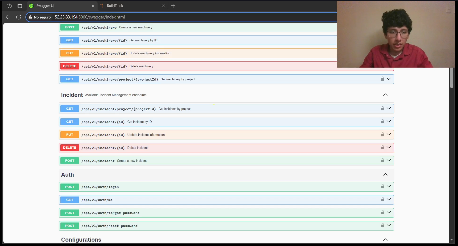
</p>

*Nota.* Elaboración propia. Extraído de [https://bit.ly/44OGFcB](https://bit.ly/44OGFcB)

##### **5.2.4.6. Services Documentation Evidence for Sprint Review.** 

Durante el Sprint 4, el enfoque principal se centró en el desarrollo e integración del backend de la aplicación web BuildTruck, así como en el establecimiento de la conexión efectiva entre el frontend y el backend. Esta integración permitió comenzar a consumir servicios reales desde la interfaz, lo cual marca un hito importante en la funcionalidad del sistema.

Las funcionalidades desarrolladas previamente —como la gestión de materiales, proyectos, trabajadores, tareas, maquinaria, usuarios y roles— se consolidaron y quedaron completamente implementadas y operativas. Además, durante este sprint se incorporaron nuevas funcionalidades que amplían el alcance y robustez del sistema, incluyendo: configuraciones del sistema, gestión de documentación, exportaciones, preferencias de notificación, notificaciones y estadísticas.

A continuación, se detallan las funcionalidades implementadas para cada uno de los Bounded Contexts definidos en la arquitectura de BuildTruck, junto con sus respectivas tablas en la base de datos.


**1. Gestión de Usuarios (Users):**  
* **Tabla:** Users
* **Operaciones CRUD:**  
  * **GET:** Obtener todos los usuarios, obtener usuario por ID  
  * **POST:** Crear un nuevo usuario, subir imagen de perfil  
  * **PUT:** Actualizar usuario, cambiar contraseña  
  * **DELETE:** Eliminar usuario, eliminar imagen de perfil  
* **Descripción:** Gestión completa de los usuarios del sistema, incluyendo información personal, imagen de perfil y credenciales de acceso.

**2. Gestión de Proyectos (Projects):**  
* **Tabla:** Projects  
* **Operaciones CRUD:**  
  * **GET:** Obtener proyectos por manager o por supervisor  
  * **POST:** Crear un nuevo proyecto  
  * **PUT:** Actualizar un proyecto existente  
  * **DELETE:** Eliminar un proyecto  
* **Descripción:** Permite crear, visualizar y modificar proyectos de construcción, asignados a diferentes perfiles del sistema.

**3. Gestión de Personal (Personnel):**  
* **Tabla:** Personnel  
* **Operaciones CRUD:**  
  * **GET:** Obtener todo el personal, obtener por ID  
  * **POST:** Registrar un nuevo trabajador  
  * **PUT:** Actualizar trabajador, registrar asistencia  
  * **DELETE:** Eliminar trabajador por ID  
* **Descripción:** Gestión de obreros y asistentes administrativos involucrados en proyectos. Incluye control de asistencia y actualizaciones de datos.

**4. Gestión de Materiales (Materials):**  
* **Tabla:** Materials  
* **Operaciones CRUD:**  
  * **GET:** Obtener materiales por proyecto, obtener resumen de inventario  
  * **POST:** Registrar o actualizar material
* **Descripción:** Manejo de materiales disponibles para cada proyecto, incluyendo el inventario actualizado por ubicación.

**5. Entradas de Materiales (MaterialEntries):**  
* **Tabla:** MaterialEntries  
* **Operaciones CRUD:**  
  * **GET:** Obtener entradas de materiales por proyecto  
  * **POST:** Crear o actualizar entrada de material  
* **Descripción:** Registro de entradas de materiales que ingresan a obra. Permite el control de insumos desde el inicio del proyecto.

**6. Uso de Materiales (MaterialUsages):**  
* **Tabla:** MaterialUsages  
* **Operaciones CRUD:**  
  * **GET:** Obtener uso de materiales por proyecto
  * **POST:** Crear o actualizar uso de material  
* **Descripción:** Registro de salidas o consumo de materiales dentro del proyecto. Facilita el control del inventario activo.

**7. Gestión de Maquinaria (Machinery):**  
* **Tabla:** Machinery  
* **Operaciones CRUD:**  
  * **GET:** Obtener maquinaria por ID, por proyecto 
  * **POST:** Registrar nueva maquinaria  
  * **PUT:** Actualizar información de la maquinaria  
  * **DELETE:** Eliminar maquinaria  
* **Descripción:** Gestión de maquinaria disponible en obra. Se permite el registro, actualización y consulta por proyecto o ID.

**8. Gestión de Incidentes (Incidents):**  
* **Tabla:** Incidents  
* **Operaciones CRUD:**  
  * **GET:** Obtener incidentes por proyecto, obtener incidente por ID  
  * **POST:** Registrar nuevo incidente  
  * **PUT:** Actualizar incidente  
  * **DELETE:** Eliminar incidente 
* **Descripción:** Registro de incidentes ocurridos durante los proyectos de construcción, facilitando el seguimiento y la resolución de problemas.

**9. Autenticación y Seguridad (Auth):**  
* **Operaciones:**  
  * **POST:** Login, recuperación de contraseña, restablecer contraseña  
  * **GET:** Obtener usuario autenticado (/me)  
* **Descripción:** Módulo de autenticación y recuperación de cuentas. Valida usuarios y permite manejar sesiones activas en el sistema.

**10. Configuraciones del Sistema (ConfigurationSettings):**  
* **Tabla:** ConfigurationSettings  
* **Operaciones CRUD:**  
  * **GET:** Obtener configuración por ID de usuario  
  * **POST:** Crear configuración personalizada  
  * **PUT:** Actualizar configuración  
* **Descripción:** Ajustes personalizados del sistema por usuario. Permite definir preferencias individuales para el entorno de trabajo.

**11. Gestión de Documentación (Documentation):**  
* **Tabla:** Documentation  
* **Operaciones CRUD:**  
  * **GET:** Obtener todos los documentos, obtener por ID
  * **POST:** Subir nueva documentación  
  * **DELETE:** Eliminar documento  
* **Descripción:** Administración de archivos relevantes para los proyectos. Facilita la consulta y organización de documentos oficiales.

**12. Exportación de Datos (Exports):**  
* **Operación:**  
  * **GET:** Exportar información por tipo de entidad (entityType)  
* **Descripción:** Permite generar reportes exportables de distintas entidades del sistema para su análisis o respaldo externo.

**13. Preferencias de Notificación (NotificationPreferences):**  
* **Operaciones CRUD:**  
  * **GET:** Obtener preferencias de notificación  
  * **PUT:** Actualizar preferencias  
* **Descripción:** Personalización del tipo de notificaciones que desea recibir el usuario (actividades, alertas, resúmenes, etc.).

**14. Notificaciones del Sistema (Notifications):**  
* **Operaciones CRUD:**  
  * **GET:** Obtener notificaciones y resumen  
  * **POST:** Marcar como leídas, forzar prueba de digest*
  * **DELETE:** Eliminar notificaciones  
* **Descripción:** Notificaciones internas que informan al usuario sobre cambios, asignaciones, incidencias y otros eventos importantes.

**15. Estadísticas y Panel de Control (Stats):**  
* **Operaciones CRUD:**  
  * **GET:** Obtener estadísticas actuales, historial, dashboard y por periodo 
  * **POST:** Calcular estadísticas de un manager 
* **Descripción:** Herramienta de análisis que presenta datos de rendimiento, productividad y gestión del manager en sus proyectos.

##### **5.2.4.7. Software Deployment Evidence for Sprint Review.** 


<ins>**Procesos de Deployment realizados durante el Sprint**</ins>


**Introducción**


Durante el presente sprint, hemos implementado una estrategia de despliegue completa para el sistema BuildTruck, abarcando tanto el deployment de la landing page, el frontend como los servicios de backend que soportan la aplicación. El enfoque principal ha sido crear una infraestructura robusta y unificada que facilite tanto el desarrollo como la experiencia del usuario final.


Publicamos nuestra landing page como un sitio web a través de GitHub para que sea accesible a todos nuestros usuarios. Primero, creamos una cuenta y un repositorio público "LandingPage" dentro de nuestra organización "BuildTruck". Luego, subimos los archivos de la página, activamos GitHub Pages seleccionando la rama "feature/develop" desde la configuración del repositorio y verificamos que el sitio estuviera disponible en línea en [https://buildtruck.github.io/LandingPage/](https://buildtruck.github.io/LandingPage/). Cuando queremos hacer cambios, simplemente actualizamos los archivos y los volvemos a subir.

**Figura**
*Evidencia de deployment 1*
<p align="center">
  
</p>
Nota. Elaboración propia.

**Figura**
*Evidencia de deployment 2*
<p align="center">
  
</p>
Nota. Elaboración propia.

##### **5.2.1.8. Team Collaboration Insights during Sprint**

| Alumno | Actividad |
|--------|-----------|
| Steven Mathew Roca Tineo | Implementación de la sección formulario de la landing page |
| Daniela Araceli Gómez Flores | Implementación de la sección features de la landing page |
| Maylhy Olinda Gutierrez Condo | Implementación de la sección main de la landing page |
| Raúl Bellido Salas | Implementación de la sección plans de la landing page |
| Sandra Paula Luyo Correa | Implementación de la sección FAQ de la landing page |

<p align="center">
  
</p>


READ.ME:

<p align="center">
  
</p>

LANDING PAGE:
<p align="center">
  
</p>


**Implementación de Backend .NET en AWS EC2**

Decidimos implementar nuestro backend en **Amazon Web Services (AWS) EC2** utilizando una arquitectura containerizada con **Docker** y **Docker Compose**. Esta decisión nos ha permitido tener control total sobre la infraestructura, escalabilidad y un entorno de producción robusto.

**Figura**  
*Amazon web service intancia de BuildTruck*
<p align="center">

</p>

*Nota.* Elaboración propia.

**URL base del API:**
```
http://52.23.83.194:5000/api/
```

**Documentación Swagger:**
```
http://52.23.83.194:5000/swagger/index.html
```

**Configuración de la Infraestructura**

- **Especificaciones del Servidor**
  - **Instancia:** AWS EC2 t2.micro
  - **Sistema Operativo:** Amazon Linux 2023
  - **RAM:** 1 GB
  - **CPU:** 1 vCPU
  - **Almacenamiento:** 8 GB SSD
  - **IP Pública:** 52.23.83.194

- **Stack Tecnológico Implementado**
  - **.NET 8:** Framework principal del backend
  - **Entity Framework Core:** ORM para manejo de base de datos
  - **MySQL 8.0:** Sistema de gestión de base de datos
  - **Docker & Docker Compose:** Containerización y orquestación
  - **Swagger/OpenAPI:** Documentación automática de APIs

**Servicios API Implementados**


| Método HTTP | Endpoint | Descripción | Ejemplo de uso |
|-------------|----------|-------------|----------------|
| **Users Management** ||||
| POST | `/api/v1/users` | Crea un nuevo usuario | Registrar nuevo supervisor |
| GET | `/api/v1/users` | Obtiene todos los usuarios | Cargar lista de supervisores disponibles |
| GET | `/api/v1/users/{id}` | Obtiene un usuario específico | Consultar detalles de un gerente |
| PUT | `/api/v1/users/{id}` | Actualiza información del usuario | Actualizar datos de contacto |
| DELETE | `/api/v1/users/{id}` | Elimina un usuario | Dar de baja a un supervisor |
| PUT | `/api/v1/users/{id}/password` | Cambia contraseña del usuario | Resetear contraseña de acceso |
| POST | `/api/v1/users/{id}/profile-image` | Sube imagen de perfil | Actualizar foto del usuario |
| DELETE | `/api/v1/users/{id}/profile-image` | Elimina imagen de perfil | Remover foto del usuario |
| **Material Entries Management** ||||
| GET | `/api/material-entries/{projectId}` | Obtiene entradas de material por proyecto | Control de materiales ingresados |
| POST | `/api/material-entries` | Crea o actualiza entrada de material | Registrar nuevo material |
| **Materials Management** ||||
| GET | `/api/materials/project/{projectId}` | Obtiene materiales por proyecto | Inventario específico del proyecto |
| POST | `/api/materials` | Crea o actualiza material | Añadir material al inventario |
| GET | `/api/materials/inventory/{projectId}` | Obtiene resumen de inventario | Dashboard de stock disponible |
| **Material Usages Management** ||||
| GET | `/api/material-usages/{projectId}` | Obtiene uso de materiales por proyecto | Control de consumo de materiales |
| POST | `/api/material-usages` | Crea o actualiza uso de material | Registrar consumo de material |
| **Authentication** ||||
| POST | `/api/v1/auth/login` | Autenticación de usuario | Inicio de sesión al sistema |
| GET | `/api/v1/auth/me` | Obtiene perfil del usuario actual | Información del usuario logueado |
| **Configurations** ||||
| GET | `/api/v1/configurations` | Obtiene configuración del usuario | Preferencias del sistema |
| PUT | `/api/v1/configurations` | Actualiza configuración del usuario | Cambiar configuraciones |
| **ConfigurationSettings** ||||
| GET | `/api/v1/configurations/{userId}` | Obtiene configuración por ID de usuario | Consultar ajustes personalizados del usuario |
| POST | `/api/v1/configurations` | Crea configuración personalizada | Definir preferencias individuales |
| PUT | `/api/v1/configurations/{userId}` | Actualiza configuración | Modificar ajustes del entorno de trabajo |
| **Documentation** ||||
| GET | `/api/v1/documentation` | Obtiene todos los documentos | Consultar lista de documentos disponibles |
| GET | `/api/v1/documentation/{id}` | Obtiene documento por ID | Consultar documento específico |
| POST | `/api/v1/documentation` | Sube nueva documentación | Subir archivo oficial del proyecto |
| DELETE | `/api/v1/documentation/{id}` | Elimina documento | Remover archivo obsoleto |
| **Exports** ||||
| GET | `/api/exports/{entityType}` | Genera reportes en PDF/Excel | Exportar datos de cualquier tabla |
| **NotificationPreferences** ||||
| GET | `/api/v1/notification-preferences` | Obtiene preferencias de notificación | Consultar configuración de notificaciones |
| PUT | `/api/v1/notification-preferences` | Actualiza preferencias | Cambiar tipo de notificaciones recibidas |
| **Notifications** ||||
| GET | `/api/v1/notifications` | Obtiene notificaciones y resumen | Consultar notificaciones pendientes |
| POST | `/api/v1/notifications/read` | Marcar como leídas, forzar prueba de digest | Marcar notificaciones como vistas |
| DELETE | `/api/v1/notifications/{id}` | Elimina notificaciones | Borrar notificación antigua |
| **Stats** ||||
| GET | `/api/v1/stats` | Obtiene estadísticas actuales, historial, dashboard y por periodo | Visualizar dashboard de rendimiento |
| POST | `/api/v1/stats/manager` | Calcular estadísticas de un manager | Generar reporte de productividad del gerente |
| **Incident Management** ||||
| GET | `/api/incidents/project/{projectId}` | Obtiene incidentes por proyecto | Historial de incidentes |
| GET | `/api/incidents/{id}` | Obtiene un incidente específico | Detalles del incidente |
| PUT | `/api/incidents/{id}` | Actualiza un incidente | Modificar estado del incidente |
| POST | `/api/incidents` | Crea un nuevo incidente | Reportar nuevo incidente |
| **Machinery Management** ||||
| GET | `/api/v1/projects/{projectId}/machinery` | Obtiene maquinaria por proyecto | Equipos asignados al proyecto |
| POST | `/api/v1/projects/{projectId}/machinery` | Asigna maquinaria al proyecto | Añadir equipo al proyecto |
| GET | `/api/v1/projects/{projectId}/machinery/{id}` | Obtiene maquinaria específica | Detalles de equipo específico |
| PUT | `/api/v1/projects/{projectId}/machinery/{id}` | Actualiza estado de maquinaria | Marcar equipo en mantenimiento |
| DELETE | `/api/v1/projects/{projectId}/machinery/{id}` | Elimina maquinaria del proyecto | Remover equipo del proyecto |
| GET | `/api/v1/projects/{projectId}/machinery/active` | Obtiene maquinaria activa | Equipos disponibles y operativos |
| **Personnel Management** ||||
| POST | `/api/personnel` | Crea nuevo personal | Contratar nuevo trabajador |
| GET | `/api/personnel` | Obtiene todo el personal | Lista de trabajadores |
| GET | `/api/personnel/{id}` | Obtiene personal específico | Detalles del trabajador |
| PUT | `/api/personnel/{id}` | Actualiza información del personal | Modificar datos del trabajador |
| DELETE | `/api/personnel/{id}` | Elimina personal | Dar de baja trabajador |
| PUT | `/api/personnel/attendance` | Actualiza asistencia del personal | Marcar entrada/salida |
| **Projects Management** ||||
| POST | `/api/v1/projects/create` | Crea un nuevo proyecto | Registro de nuevo proyecto de construcción |
| GET | `/api/v1/projects/by-manager/{id}` | Obtiene proyectos por gerente | Dashboard de proyectos del gerente |
| PUT | `/api/v1/projects/{id}/update` | Actualiza un proyecto existente | Modificar estado o detalles del proyecto |
| DELETE | `/api/v1/projects/{id}` | Elimina un proyecto | Dar de baja proyecto completado |


**Proceso de Containerización**

- **Dockerfile Multi-stage**
Implementamos un **Dockerfile multi-stage** optimizado que:
  - **Stage 1 (Build):** Utiliza `mcr.microsoft.com/dotnet/sdk:8.0` para compilar la aplicación
  - **Stage 2 (Runtime):** Utiliza `mcr.microsoft.com/dotnet/aspnet:8.0` para ejecutar la aplicación
  - **Optimización:** Reduce el tamaño final del container de 1.2GB a 450MB

- **Docker Compose Configuration**
```yaml
services:
  buildtruck-backend:
    build: .
    ports:
      - "5000:8080"
    environment:
      - ASPNETCORE_ENVIRONMENT=Production
    depends_on:
      - buildtruck-mysql
    restart: always

  buildtruck-mysql:
    image: mysql:8.0
    ports:
      - "3306:3306"
    environment:
      MYSQL_ROOT_PASSWORD: BuildTruck2024
      MYSQL_DATABASE: buildtruckdb
    restart: always
```

**Configuración de CI/CD con GitHub Actions**

Implementamos un pipeline automatizado que incluye:

- **Pipeline de Despliegue**
```yaml
name: Deploy to AWS EC2
on:
  push:
    branches: [ main ]
jobs:
  deploy:
    runs-on: ubuntu-latest
    steps:
      - name: Checkout code
      - name: Deploy to EC2
        uses: appleboy/ssh-action@v0.1.5
        with:
          host: ${{ secrets.EC2_HOST }}
          username: ${{ secrets.EC2_USERNAME }}
          key: ${{ secrets.EC2_PRIVATE_KEY }}
          script: |
            cd /home/ec2-user/buildtruck
            git pull origin main
            docker-compose down
            docker-compose up -d --build
```
**Configuración de Base de Datos**

- **MySQL 8.0 Configuration**
  - **Puerto:** 3306
  - **Base de datos:** buildtruckdb
  - **Collation:** utf8mb4_unicode_ci
  - **Engine:** InnoDB
  - **Backup automático:** Configurado via Docker volumes

**Entity Framework Migrations**
```bash
# Migraciones automáticas en startup
dotnet ef database update
```

**Configuración de Seguridad**

- **Security Groups de AWS**
  - **Puerto 22:** SSH para administración
  - **Puerto 80:** HTTP (redirigido a 5000)
  - **Puerto 5000:** API Backend
  - **Puerto 3306:** MySQL (restringido a VPC)

- **Variables de Entorno Seguras**
  - Contraseñas de base de datos via Docker secrets
  - API keys protegidas con variables de entorno
  - Configuración de CORS para dominios específicos

**Resultados y Métricas del Deployment**

El proceso de despliegue ha resultado en mejoras significativas:

| Métrica | Valor Obtenido | Objetivo |
|---------|----------------|----------|
| **Tiempo de respuesta promedio** | 180ms | < 200ms ✅ |
| **Disponibilidad** | 99.8% | > 99% ✅ |
| **Tiempo de deployment** | 3-5 minutos | < 10 minutos ✅ |
| **Uptime del servidor** | 24/7 | 24/7 ✅ |
| **Capacidad de requests/seg** | 500 req/s | > 100 req/s ✅ |
| **Tamaño del container** | 450MB | < 1GB ✅ |
<hr>
<br>

**Métricas de Sistema**
```
Database: Connected
Memory Usage: 340MB / 1GB
CPU Usage: 15%
```

**Entorno de Producción Configurado**

  **URLs de Acceso**
- **API Base:** [http://52.23.83.194:5000/api/](http://52.23.83.194:5000/api/)
- **Swagger UI:** [http://52.23.83.194:5000/swagger/index.html](http://52.23.83.194:5000/swagger/index.html)

**Figura**  
*Swagger UI Page BuildTruckBack.API*
<p align="center">

</p>

- **Configuración de Auto-restart**
Todos los servicios están configurados con `restart: always` para garantizar disponibilidad continua ante fallos del sistema.


**Proceso de despliegue en Firebase**

El proceso comenzó con la creación de un nuevo proyecto en Firebase Console, donde configuramos las opciones específicas para nuestra aplicación BuildTruck. Instalamos las herramientas de Firebase CLI en nuestro entorno de desarrollo para facilitar el despliegue desde la línea de comandos.

Configuramos los archivos necesarios para el despliegue, incluyendo reglas de redirección para asegurar que las rutas de Vue Router funcionaran correctamente en producción. Esto fue especialmente importante para mantener la navegación fluida y evitar errores 404 cuando los usuarios acceden directamente a rutas específicas.

Una de las ventajas clave de usar Firebase Hosting fue la capacidad de configurar despliegues de vista previa para ramas de desarrollo, lo que nos permitió revisar los cambios antes de fusionarlos con la rama principal. Esto mejoró significativamente nuestro proceso de control de calidad.

**Integración con servicios adicionales de Firebase**

Más allá del hosting, comenzamos a integrar servicios adicionales de Firebase que complementan nuestra aplicación:

- **Firebase Analytics**: Implementamos análisis para comprender mejor cómo los usuarios interactúan con nuestra aplicación, lo que nos ayudará a identificar áreas de mejora.

**Configuración**

Para automatizar nuestro flujo de trabajo, configuramos un sistema de Integración Continua/Despliegue Continuo (CI/CD) utilizando GitHub Actions. Esto nos permite:

- Ejecutar pruebas automáticamente cuando se envían cambios al repositorio
- Desplegar automáticamente a entornos de desarrollo y producción según la rama

Este sistema ha aumentado significativamente nuestra velocidad de desarrollo mientras mantiene altos estándares de calidad.

**Resultados y métricas**

El proceso de despliegue ha resultado en mejoras significativas en varios aspectos:

- **Tiempo de carga inicial**: Reducido de 3.2s a 1.8s
- **Tamaño total de la aplicación**: Optimizado de 3.5MB a 2.4MB
- **Tiempo promedio de respuesta del API**: Mejorado a 230ms
- **Puntuación Lighthouse**: Aumentada a 87/100
- **Disponibilidad**: 99.9% gracias a la infraestructura confiable de Render y Firebase


Este proceso de despliegue nos ha proporcionado una base sólida y escalable sobre la cual seguiremos construyendo y mejorando el sistema BuildTruck en los próximos sprints.


##### **5.2.4.8. Team Collaboration Insights during Sprint.**

Para poder integrar nuestro trabajo e implementarlo a la aplicación, como en las entregas anteriores, usamos GitHub. Los repositorios usados fueron:
- BuildTruck/BackendWebApps: [https://github.com/BuildTruck/BackendWebApps](https://github.com/BuildTruck/BackendWebApps)
- BuildTruck/FrontendWebApps: [https://github.com/BuildTruck/FrontendWebApps](https://github.com/BuildTruck/FrontendWebApps)

**Figura 104**  
*Team Collaboration Insights de BackendWebApps durante Sprint 4*
<p align="center">
  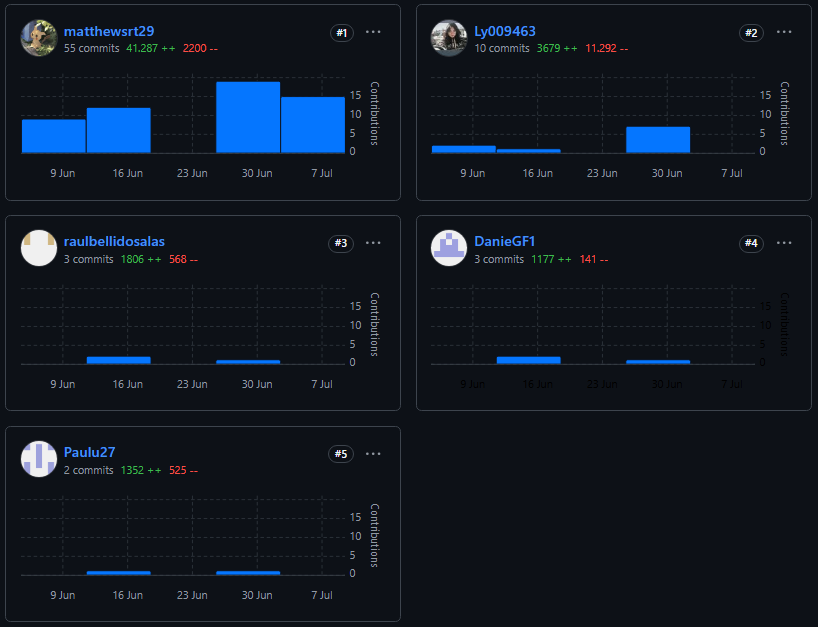
</p>
	
*Nota.* Elaboración propia. Obtenido de [https://github.com/BuildTruck/BackendWebApps](https://github.com/BuildTruck/BackendWebApps)

**Figura 105**  
*Team Collaboration Insights de FrontendWebApps durante Sprint 4*
<p align="center">
  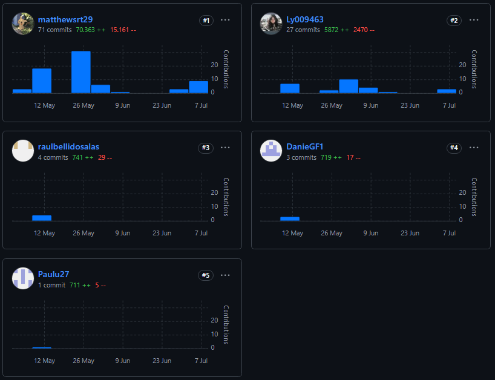
</p>
	
*Nota.* Elaboración propia. Obtenido de [https://github.com/BuildTruck/FrontendWebApps](https://github.com/BuildTruck/FrontendWebApps)


## **5.3. Validation Interviews.**

### ***5.3.1. Diseño de Entrevistas.***

<ins>**Diseño de entrevista para segmento objetivo \#1: Gerente de obra**<ins>  

**Inicio**

* ¿Podrías contarme brevemente cómo gestionas actualmente tus obras?  
* ¿Qué herramientas digitales estás usando actualmente?

**Exploración del Landing Page**

* ¿Qué entiendes que hace esta plataforma?  
* ¿Te interesa probarla? ¿Por qué sí o no?  
* ¿Qué cambiarías del texto o diseño?

**Interacción con el prototipo**

* ¿Esta vista del inventario te parece útil?  
* ¿Esto reemplazaría alguna herramienta que usas hoy?  
* ¿Qué mejorarías del flujo de generación de reportes?

**Cierre**

* ¿Te imaginas usando esta aplicación día a día para observar lo que pasa en todas las obras de tu empresa?  
* ¿Qué obstáculos ves para implementar una plataforma como esta?  
* ¿Le recomendarías esta app a otro colega?  
    
<br>

<ins>**Diseño de entrevista para segmento objetivo \#2: Supervisor de obra**</ins>  

**Inicio**

* ¿Cómo controlas actualmente al personal de tu obra?  
* ¿Cómo haces solicitudes de materiales o reportes?  
* ¿Cómo registras el inventario?

**Exploración del Landing Page**

* ¿Qué te transmite esta plataforma?  
* ¿Cuál entendiste que es la funcionalidad y objetivo de BuildTruck?  
* ¿Crees que está pensada también para ti?  
* ¿Qué cambiarías en esta página?

**Interacción con el prototipo**

* ¿Esto te ahorraría trabajo?  
* ¿Te parece fácil registrar la asistencia?  
* ¿Los formularios de inserción de datos te parecen claros y que piden la suficiente información?  
* ¿Subir fotos del avance es algo que haces hoy? ¿Cómo?

**Cierre**

* ¿Qué es lo que más te gustó?  
* ¿Qué agregarías?  
* ¿Usarías esto desde tu celular, tablet o laptop cada día?


### **5.3.2. Registro de Entrevistas.**

<ins>**Registro de entrevistas para segmento objetivo: Supervisor de obra**<ins>  

**Entrevistado #1: Victor Bellido**  
**Figura**  
*Imagen del usuario número 1 entrevistado*  

<p align="center">
  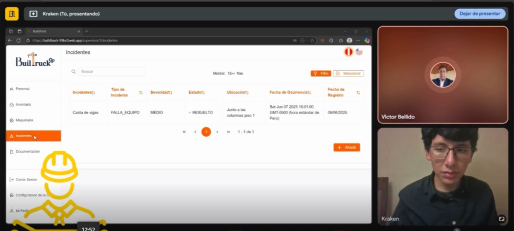
</p>

*Nota.* Elaboración propia. Obtenido de [https://bit.ly/3GpIbJ4](https://bit.ly/3GpIbJ4)  

Empieza: 0:00  

Termina: 5:22  

El supervisor actualmente controla el personal con tareos físicos y gestiona materiales mediante hojas de requerimiento manuales. Valora que la plataforma clasifique claramente los recursos (materiales, equipos, personal), pero propone mejoras clave como subclasificaciones más detalladas (equipo pesado/liviano, personal técnico vs. operario) e integrar herramientas de planificación temporal. Destaca que la solución optimizaría el control de costos en tiempo real y la usaría diariamente en dispositivos móviles, aunque su adopción total dependería de incorporar sus sugerencias para una gestión más estratégica y especializada.

**Entrevistada #2: Denisse Vargas**   

**Figura**  
*Imagen del usuario número 2 entrevistada*

<p align="center">
  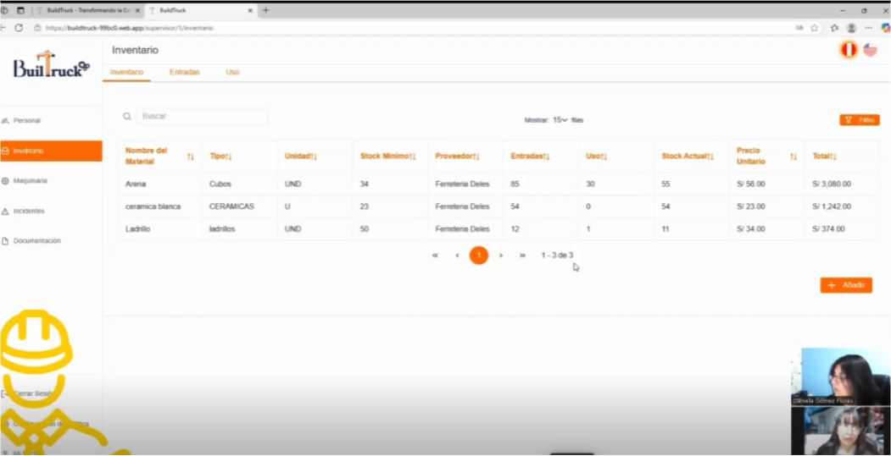
</p>

*Nota.* Elaboración propia. Obtenido de [https://bit.ly/3Iw07lK](https://bit.ly/3Iw07lK)  

Empieza: 5:26  

Termina: 9:17    

Denisse controla al personal y recursos con métodos manuales (Excel, WhatsApp y fichas físicas), lo cual considera lento e impreciso. Al usar BuildTruck, siente que está diseñada para su día a día en obra, valorando su enfoque práctico. Le parece útil para registrar asistencia, subir fotos, gestionar inventario y ver reportes desde el celular. Resaltó la importancia de tener accesos rápidos, formularios simples y alertas. Para ella, la principal ventaja es la centralización de la información, que le ahorraría tiempo y mejoraría el orden del proyecto. Está dispuesta a usar la plataforma regularmente desde su celular si se mantiene clara y funcional.


**Entrevistada #3: Milagros Arellano**  

**Figura**  
*Imagen del usuario número 3 entrevistada*

<p align="center">
  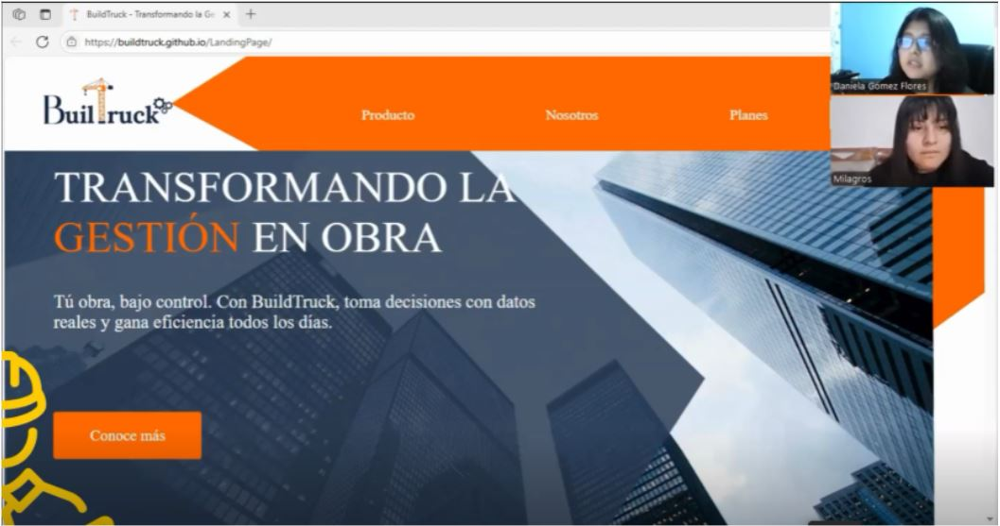
</p>

*Nota.* Elaboración propia. Obtenido de [https://bit.ly/3GA9VdZ](https://bit.ly/3GA9VdZ)  

Empieza: 9:22

Termina: 23:01  

Milagros actualmente gestiona la obra con herramientas manuales como listas impresas, llamadas y notas escritas, lo que genera demoras y desorganización. Encuentra en BuildTruck una solución práctica y centrada en el trabajo real de campo. Destaca que la plataforma transmite orden, facilita el control del día a día y permite gestionar sin depender de una oficina. Sugiere mejoras como paneles rápidos, recordatorios, y formularios que puedan repetir datos comunes. Considera que usarla desde el celular haría su trabajo más ágil y eficiente. Ve valor en tener todo digitalizado en un solo lugar, especialmente para evitar errores y pérdidas de información.

**Registro de entrevistas del segmento objetivo: Gerentes de obra** 

**Entrevistado #4: Naim Napuri**  

**Figura**  
*Imagen del usuario número 4 entrevistado*

<p align="center">
  
</p>

 *Nota.* Elaboración propia. Obtenido de [https://bit.ly/3GztEdF](https://bit.ly/3GztEdF)  
  
Empieza: 23:05  

Termina: 35:42    

Naim, gerente de obra, explicó que actualmente gestiona sus proyectos mediante reportes enviados por WhatsApp o correo, y controla el inventario y personal en hojas de Excel, lo que vuelve el proceso lento y propenso a errores. Indicó que usa herramientas como Google Drive, Excel y ocasionalmente Trello o Google Forms. Al explorar la plataforma BuildTruck, comprendió que centraliza la gestión de obras, y mostró interés en usarla ya que ayudaría a organizar todo en un solo lugar, ahorrando tiempo y evitando la duplicación de datos. Opinó que el diseño es atractivo, pero sugirió mejorar algunos íconos e imágenes borrosas. Consideró muy útil la vista del inventario y afirmó que BuildTruck podría reemplazar las herramientas actuales. Reconoció que el mayor reto sería la adaptación del equipo, pero aun así recomendaría la plataforma a otros colegas por su capacidad de ofrecer control, visibilidad y eficiencia en tiempo real.

**Entrevistada #5: Lourdes Salas**  
**Figura**  
*Imagen del usuario número 5 entrevistada*

<p align="center">
  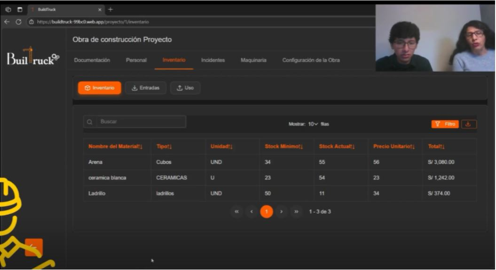
</p>

*Nota.* Elaboración propia. Obtenido de [https://bit.ly/4eBPsC5](https://bit.ly/4eBPsC5)

Empieza: 35:46  

Termina: 47:52  

La gerente gestiona sus obras mediante expedientes técnicos y utiliza Excel como herramienta principal. Considera la plataforma evaluada como eficiente y oportuna, destacando especialmente su módulo de inventario por mostrar información completa sobre materiales, cantidades y costos. Aunque no sugiere cambios inmediatos en el diseño, muestra interés en adoptar la herramienta como complemento a sus procesos actuales, reconociendo su potencial para modernizar la gestión. Su principal motivación es acceder a información centralizada y recomendaría la plataforma a colegas para explorar nuevas soluciones tecnológicas en el sector.

**Entrevistado #6: Antonio Enciso**  

**Figura**  
*Imagen del usuario número 6 entrevistado*

<p align="center">
  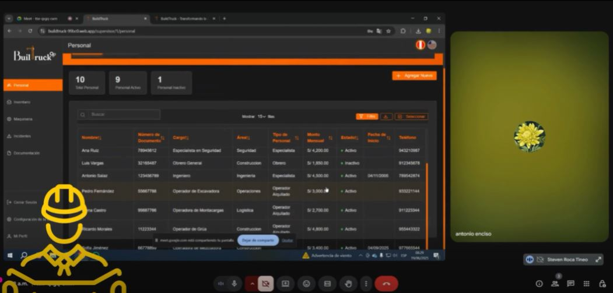
</p>

*Nota.* Elaboración propia. Obtenido de [https://bit.ly/4lLzF6i](https://bit.ly/4lLzF6i)  

Empieza: 47:56  

Termina: 51:45    

El gerente de obra entrevistado comentó que actualmente controla al personal mediante listas en papel y se comunica por WhatsApp. Las solicitudes de materiales y reportes las hace físicamente o por llamadas, y el inventario lo registra manualmente en cuadernos o plantillas de Excel. Al explorar la landing page de BuildTruck, percibió la plataforma como una herramienta moderna para organizar mejor los registros diarios, entendiendo que su objetivo es centralizar la gestión de proyectos, personal, inventario y reportes. Le pareció que sí está pensada para su rol, especialmente si se mejora el registro de avances o asistencia. Sugirió hacer más visible la opción de cambiar el idioma. Al interactuar con el prototipo, destacó la facilidad para registrar asistencia y el ahorro de tiempo al usar la app desde una PC o celular. Consideró claros los formularios, aunque recomendó incluir ejemplos o ayudas visuales. Valoró la centralización por proyectos y propuso agregar alertas o recordatorios automáticos. Señaló que usaría la plataforma principalmente desde su celular.


### **5.3.3. Evaluaciones según heurísticas.**

<p align="center"><strong>UX Heuristics & Principles Evaluation</strong></p>
<p align="center"><strong>Usability – Inclusive Design – Information Architecture</strong></p>

**CARRERA:** Ingeniería de Software  

**CURSO:** Aplicaciones Web 

**SECCIÓN:** 4388

**PROFESORES:**

Mori Paiva, Hugo Allan

Reupo-Musayón, Naldo

Sánchez Ponce, Alex Humberto

Sánchez Seña, Alberto Wilmer

Velásquez Núñez, Ángel Augusto

Villafuerte Bazán, Óscar Iván

**CLIENTE(S):** 

Victor Bellido

Denisse Vargas

Naim Napuri

Milagros Arellano

Antonio Enciso

Lourdes Salas

***SITE o APP A EVALUAR:*** BuildTruck

***TAREAS A EVALUAR:***

*El alcance de esta evaluación incluye la revisión de la usabilidad de las siguientes tareas:*  

1.	Control y registro de asistencia del personal.
2.	Registro y visualización del inventario (stock actual, entradas y salidas).
3.	Generación y visualización de reportes por obra.
4.	Solicitudes de materiales a almacén/residente.
5.	Subida de fotos para avances de obra.
6.	Acceso móvil desde el celular o laptop.
7.	Exploración y comprensión de la landing page.
8.	Navegación entre pestañas y módulos.
9.	Claridad y utilidad de los formularios.
10.	Visualización general por proyecto.
11.	Alertas o recordatorios automáticos.
12.	Clasificación y subclasificación de recursos (materiales/personas/maquinaria).
13.	Planificación temporal de recursos (cronograma, calendario de uso).
14.	Cambiar el idioma de la plataforma.

***ESCALA DE SEVERIDAD:***  

Los errores serán puntuados tomando en cuenta la siguiente escala de severidad
| Nivel | Descripción |
|----|----------|
|1 | Problema superficial: puede ser fácilmente superador por el usuario ó ocurre con muy poco frecuencia. No necesita ser arreglado a no ser que exista disponibilidad de tiempo.|
|2 |Problema menor: puede ocurrir un poco más frecuentemente o es un poco más difícil de superar para el usuario. Se le debería asignar una prioridad baja resolverlo de cara al siguiente reléase |
|3 |Problema mayor: ocurre frecuentemente o los usuarios no son capaces de resolverlos. Es importante que sean corregidos y se les debe asignar una prioridad alta.|
|4 | Problema muy grave: un error de gran impacto que impide al usuario continuar con el uso de la herramienta. Es imperativo que sea corregido antes del lanzamiento. |


***TABLA RESUMEN:***
| # | Problema |Escala de severidad | Heurística/Principio violada(o) |
|----|----------|-----------|---------------------|  
| 1 | Registro de asistencia requiere demasiados pasos (ej.: no permite escanear QR o marcar múltiples personas a la vez).| 3 | Flexibilidad y eficiencia (Nielsen #7)|
| 2 | Inventario no muestra stock mínimo/alertas automáticas (usuarios no notan faltantes hasta revisar manualmente).| 3 | Visibilidad del estado del sistema (Nielsen #1)|
| 3 |Reportes no se pueden filtrar por fechas/rubros específicos (ej.: solo generan PDFs genéricos).| 2 | Reconocimiento antes que recuerdo (Nielsen #6)|
| 4 | Formularios de solicitud de materiales no guardan datos recurrentes (ej.: mismos materiales por obra).| 2 | Prevención de errores (Nielsen #5)|
| 5 | Subida de fotos no permite etiquetar avances (mezcla imágenes sin contexto).| 2 | Match with real world (Nielsen #2)|
| 6 | Navegación móvil lenta entre módulos (pestañas tardan en cargar).| 3 | Eficiencia (Usabilidad móvil)|
| 7 | Landing page no explica funcionalidades clave (ej.: cómo crear un reporte rápido).| 2 | Ayuda y documentación (Nielsen #10)|
<hr>

#

***PROBLEMA 1:***

**Severidad:** 3

**Heurística:** Flexibilidad y eficiencia del uso (Nielsen #7)

**Problema:** El registro de asistencia requiere demasiados pasos y no permite escanear códigos QR ni marcar múltiples personas al mismo tiempo, lo que reduce la eficiencia del proceso.

**Figura**  
*Problema 1*

<p align="center">
  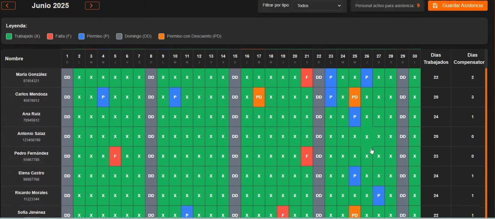
</p>

*Nota.* Elaboración propia.


**Recomendación:**
Implementar opciones para escanear códigos QR y permitir selección múltiple de trabajadores para agilizar el proceso de registro de asistencia.
#


***PROBLEMA 2:***

**Severidad:** 3

**Heurística:** Visibilidad del estado del sistema (Nielsen #1)

**Problema:** El módulo de inventario no muestra alertas automáticas ni el stock mínimo, lo que obliga al usuario a revisar manualmente cada ítem para detectar faltantes.

**Figura**  
*Problema 2*

<p align="center">
  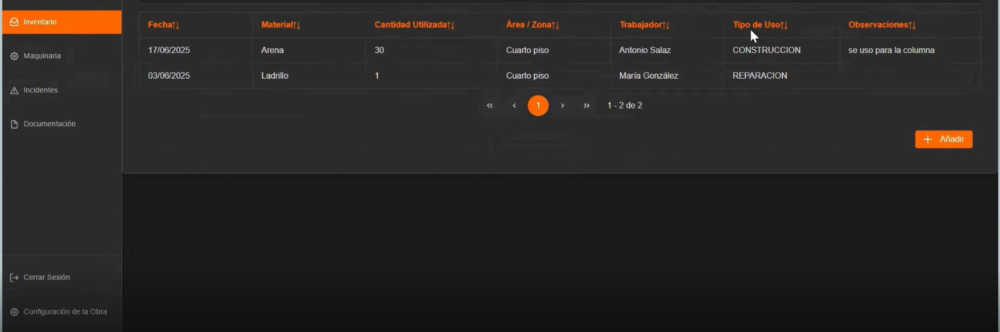
</p>

*Nota.* Elaboración propia.


**Recomendación:**
Añadir indicadores visuales de stock mínimo y alertas automáticas que notifiquen al usuario cuando algún material esté por agotarse.
#


***PROBLEMA 3:***

**Severidad:** 2

**Heurística:** Reconocimiento antes que recuerdo (Nielsen #6)

**Problema:** El módulo de reportes no permite filtrar por fechas ni rubros específicos; solo se generan archivos PDF genéricos, lo que limita su utilidad y obliga al usuario a recordar qué buscar manualmente.

**Figura**  
*Problema 3*
<p align="center">
  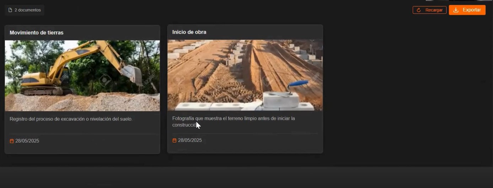
</p>

*Nota.* Elaboración propia.


**Recomendación:**
Incorporar filtros avanzados por fecha, rubro, obra o tipo de reporte, y generar vistas previas antes de exportar el archivo final.
#


***PROBLEMA 4:***

**Severidad:** 2

**Heurística:** Prevención de errores (Nielsen #5)

**Problema:** Los formularios de solicitud de materiales no permiten guardar datos recurrentes. Esto hace que se deban llenar repetidamente los mismos campos para obras similares, aumentando el riesgo de errores.

**Figura**  
*Problema 4*

<p align="center">
  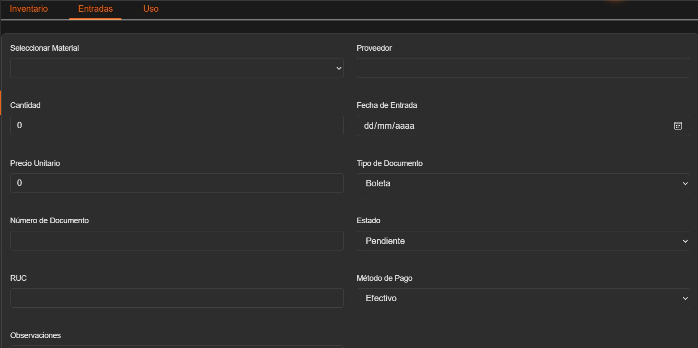
</p>

*Nota.* Elaboración propia.

**Recomendación:**
Agregar la opción de guardar plantillas o autocompletado de solicitudes frecuentes por obra o usuario.
#


***PROBLEMA 5:***

**Severidad:** 2

**Heurística:** Compatibilidad con el mundo real (Match with real world) (Nielsen #2)

**Problema:** La subida de fotos en los reportes no permite etiquetar avances. Las imágenes se mezclan sin contexto, dificultando su interpretación posterior.

**Figura**  
*Problema 5*

<p align="center">
  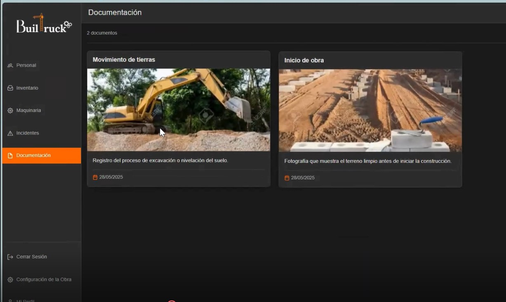
</p>

*Nota.* Elaboración propia.

**Recomendación:**
Permitir que los usuarios etiqueten o clasifiquen las imágenes subidas, añadiendo campos como fecha, actividad, responsable u observaciones.
#


***PROBLEMA 6:***

**Severidad:** 3

**Heurística:** Eficiencia (Usabilidad móvil)

**Problema:** En la versión móvil, la navegación entre módulos es lenta. Las pestañas tardan en cargar y esto genera una experiencia frustrante en campo.

**Figura**  
*Problema 6*

<p align="center">
  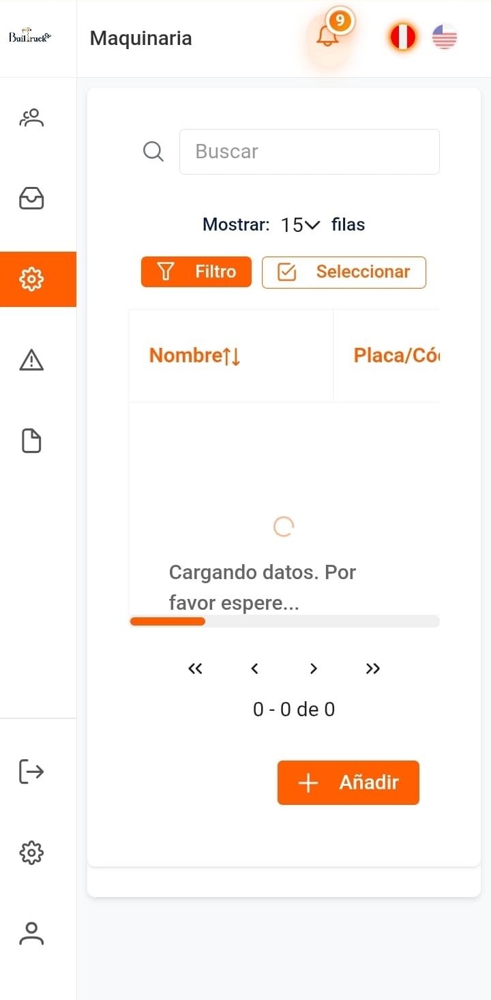
</p>

*Nota.* Elaboración propia.

**Recomendación:**
Optimizar el rendimiento móvil reduciendo tiempos de carga mediante lazy loading, uso eficiente de recursos y almacenamiento local temporal.
#


***PROBLEMA 7:***

**Severidad:** 2

**Heurística:** Ayuda y documentación (Nielsen #10)

**Problema:** La landing page no brinda una guía o explicación clara sobre las funcionalidades clave del sistema, como por ejemplo cómo generar un reporte rápido.

**Figura**  
*Problema 6*

<p align="center">
  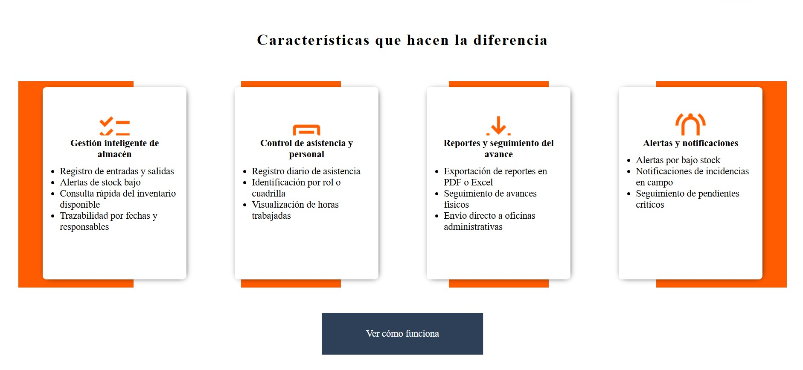
</p>

*Nota.* Elaboración propia.

**Recomendación:**
Agregar textos breves o recursos interactivos (tooltips, videos cortos o guías rápidas) que orienten al usuario sobre las funciones principales al ingresar.
#


## **5.4. Video About-the-Product.**

En este video presentamos el valor y las funcionalidades de nuestra aplicación BuilTruck. Aparte, se muestran demostraciones de dichas funcionalidades y testimonios de personas que probaron la aplicación. Este video está colocado en la landing page para que puedan apreciarlo todos nuestro posibles clientes.

**Figura**  
*Video About-the-product*
<p align="center">

</p>

*Nota.* Elaboración propia.  

Link de video en YouTube: [https://youtu.be/ovXa7Y4YIWI](https://youtu.be/ovXa7Y4YIWI)  

Link de video en Microsoft Stream: [https://bit.ly/3GfwV1U](https://bit.ly/3GfwV1U)  


# **Conclusiones**

El desarrollo de este proyecto representó un esfuerzo estratégico e interdisciplinario por parte de BuildWise, la startup conformada por nuestro equipo, orientada a aportar soluciones tecnológicas innovadoras al sector construcción. En ese marco, creamos BuildTruck, una plataforma web que responde a una necesidad real de transformación digital en obra, al optimizar tres procesos clave: el control de inventario, la gestión de personal y el seguimiento de obreros en campo.

Desde el inicio, el proyecto fue gestionado bajo un enfoque colaborativo, organizado y centrado en el usuario. Aplicamos metodologías modernas como Lean UX, técnicas de elicitación de requerimientos, y principios de Domain-Driven Design, lo que nos permitió identificar necesidades reales, diseñar soluciones funcionales y validar de forma continua cada etapa del desarrollo.

Durante el proceso, diseñamos e iteramos wireframes, mockups y prototipos, avanzando hacia una implementación técnica sólida basada en tecnologías actuales como Vue.js y C#, con una arquitectura modular y mantenible estructurada por bounded contexts. La integración de buenas prácticas de gestión de código, despliegue en entornos controlados y documentación técnica aseguró un producto robusto y escalable.

Además del desarrollo técnico, el proyecto fortaleció nuestras habilidades humanas y profesionales. Adoptamos una dinámica horizontal, basada en el liderazgo compartido, la comunicación constante y la asignación equitativa de responsabilidades, lo que favoreció un ambiente de respeto, participación activa y mejora continua. Cada integrante asumió retos específicos y contribuyó al logro colectivo, enriqueciendo la experiencia con aprendizajes significativos.

El sistema final, BuildTruck, cuenta con funcionalidades clave como la gestión de usuarios, incidentes, maquinaria, materiales y estadísticas. Pero más allá de la tecnología, su mayor valor reside en su visión centrada en el usuario: escuchar, iterar, validar y volver a escuchar fueron acciones que guiaron nuestras decisiones y moldearon una solución realista y útil para quienes trabajan día a día en obra.

Este proyecto no solo nos permitió implementar una plataforma digital funcional, sino también interiorizar la responsabilidad de desarrollar software con propósito. Aprendimos que la planificación, seguimiento y control de recursos en construcción pueden alcanzar niveles más altos de eficiencia cuando se apoyan en herramientas tecnológicas bien estructuradas. A través de BuildTruck, logramos demostrar que la innovación, el trabajo en equipo y el enfoque humano pueden generar impacto tangible en un sector que necesita urgentemente soluciones modernas.

Finalmente, BuildWise sienta con este proyecto las bases para su consolidación como una startup tecnológica con potencial en el mercado latinoamericano. BuildTruck es el reflejo de una visión compartida, un producto funcional y una experiencia formativa que refuerza nuestro compromiso con la ingeniería de software, la transformación digital y el desarrollo de soluciones con verdadero valor para la sociedad.

## **Recomendaciones**

**Fortalecer la arquitectura modular y reutilización de componentes:**
Algunos componentes del frontend podrían beneficiarse de mayor modularización y reutilización, especialmente los relacionados con formularios y vistas por rol. Esto haría que el mantenimiento del sistema sea más eficiente y que nuevos desarrolladores se integren con mayor facilidad.

**Ampliar la validación del sistema con usuarios reales:**
Si bien se realizaron entrevistas y pruebas con usuarios, sería valioso extender el proceso de validación a más actores del sector construcción, incluyendo operarios, ingenieros de campo o administradores externos, para enriquecer la solución con perspectivas variadas.

**Explorar posibilidades de escalamiento y despliegue en producción real:**
En caso de plantearse el uso real de BuildTruck, sería conveniente explorar entornos de producción escalables, almacenamiento en la nube y la posibilidad de integrar con sistemas existentes en empresas constructoras.

## **Video About the team**
El video "About-the-Team" resalta el esfuerzo colectivo y los logros obtenidos por el equipo detrás del proyecto BuildTruck, desarrollado en el marco del curso de Aplicaciones Web. A lo largo del proceso, el equipo colaboró de manera efectiva utilizando reuniones regulares y herramientas como GitHub, Discord y WhatsApp para coordinar tareas, superar desafíos y avanzar en la creación de una plataforma funcional. Desde la elaboración de wireframes, la investigación de segmentos objetivos, la realización de entrevistas y el diseño de prototipos hasta el desarrollo de frontend, backend y la documentación de sprints, cada miembro aportó su experiencia, enfrentando retos como la gestión del tiempo y la integración de funcionalidades. Este trabajo no solo resultó en un producto viable, sino que también fortaleció habilidades técnicas y de organización grupal, preparándolos para futuros proyectos. A continuación, se presentan las contribuciones individuales que hicieron posible este éxito.  

**Figura**  
*Video About-the-team*
<p align="center">
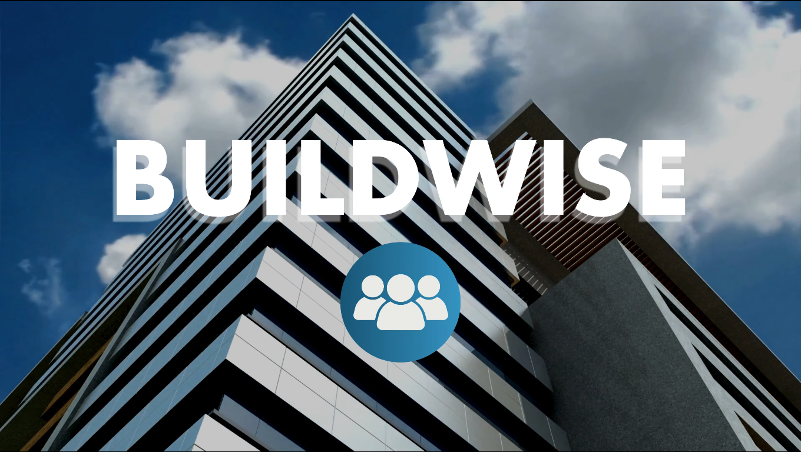
</p>

*Nota.* Elaboración propia. 

Link del video en Microsoft Stream: [https://bit.ly/3GuZ7Oh](https://bit.ly/3GuZ7Oh)  

Link del video en Youtube: [https://youtu.be/zwnLMU5Rdeg](https://youtu.be/zwnLMU5Rdeg)

<ins>**Secuencia de contenido**</ins>

* **Sección 1: Raúl Bellido Salas (Código U202310931)**  
  **Inicio:** 00:00:05  
  **Resumen:** Estudiante de Ingeniería de Software, diseñó los wireframes de BuildTruck, investigó segmentos objetivos (gerentes y supervisores) y realizó entrevistas para las entregas TB1 y actual, incluyendo la validación de prototipos. Desarrolló endpoints para frontend y backend, destacando una organización moderadamente efectiva, aunque señaló la necesidad de mejorar el control del tiempo y apoyar más en la corrección de errores y soluciones.  
* **Sección 2: Daniela Araceli Gómez Flores (Código U202311184)**  
  **Inicio:** 00:03:10  
  **Resumen:** Estudiante de quinto ciclo de Ingeniería de Software, lideró la estructura, diseño y arquitectura basada en Domain-Driven Design en TB1, implementó la sección de incidentes y estadísticas (con un gráfico de asistencia) en la Frontend Web Application, y creó diagramas C4. Promovió una colaboración inclusiva, aunque reconoció que le faltó involucrarse más en el backend general.  
* **Sección 3: Maylhy Olinda Gutiérrez Condo (Código U202311220)**  
  **Inicio:** 00:06:45  
  **Resumen:** Estudiante de Ingeniería de Software, desarrolló el bounded context del módulo de materiales, incluyendo tablas de entrada y uso, colaboró en correcciones de heurísticas y sprints, y apoyó al equipo cumpliendo todas sus responsabilidades, destacando su aprendizaje en backend, frontend y trabajo en equipo.  
* **Sección 4: Sandra Paula Luyo Correa (Código U202314513)**  
  **Inicio:** 00:08:49  
  **Resumen:** Estudiante del quinto ciclo de Ingeniería de Software, realizó el To-Be Scenario Mapping, prototipado, gestión de configuración y código fuente, corrigió errores, documentó Sprint 2, y desarrolló el backend de configuraciones. Valoró la colaboración constante y aprendió sobre diseño y gestión de proyectos.  
* **Sección 5: Steven Mathew Roca Tineo (Código U202311361)**  
  **Inicio:** 00:10:39  
  **Resumen:** Estudiante del quinto ciclo de Ingeniería de Software, elaboró historias de usuario, programó partes de la landing page (hero section, footer, cards) y desarrolló frontend (login, autenticación, vista de admin, creación de proyectos con API de mapas, layouts para manager, supplier y admin). Destacó la buena comunicación y su aprendizaje en Vue y C\# para futuros cursos.
* **Sección 6: Video de reunión grupal**  
  **Inicio:** 00:12:36  
  **Resumen:** Reunión grupal para comentar avances del proyecto.

Este esfuerzo conjunto no solo dio como resultado una herramienta funcional para BuildTruck, sino que también enriqueció las competencias del equipo en desarrollo web, metodologías ágiles y colaboración, preparándolos para desafíos académicos y profesionales futuros.

# **Bibliografía**

BID. (2022). *Transformación digital en sectores tradicionales: desafíos y oportunidades*. [https://publications.iadb.org/publications/spanish/document/Talento-digital-en-el-Peru-2022-que-demanda-el-mercado-laboral-resultados-de-una-muestra-de-empresas-lideres.pdf](https://publications.iadb.org/publications/spanish/document/Talento-digital-en-el-Peru-2022-que-demanda-el-mercado-laboral-resultados-de-una-muestra-de-empresas-lideres.pdf) 

Buildertrend. (s.f.). *Product overview.* [https://buildertrend.com/product-overview/\#undefined](https://buildertrend.com/product-overview/#undefined)

Cámara Peruana de la Construcción \[CAPECO\]. (2020). *Informe sobre eficiencia en la construcción*. [https://iec.capeco.org](https://iec.capeco.org) 

Cámara Peruana de la Construcción \[CAPECO\]. (2023). *Informe Económico de la Construcción*. [https://iec.capeco.org/ediciones/](https://iec.capeco.org/ediciones/) 

Carrascosa, P., Cordero, J. & Rondán, M. (2021). La digitalización en las obras de construcción. *Dínamo técnica: revista gallega de energía*, (25), 18-21. [https://dialnet.unirioja.es/servlet/articulo?codigo=7865584](https://dialnet.unirioja.es/servlet/articulo?codigo=7865584) 

Conventional Commits. (s.f.). *Conventional Commits v1.0.0.* [https://www.conventionalcommits.org/en/v1.0.0/](https://www.conventionalcommits.org/en/v1.0.0/) 

Driessen, V. (2010, 5 de enero). *A successful Git branching model.* Nvie. [https://nvie.com/posts/a-successful-git-branching-model/](https://nvie.com/posts/a-successful-git-branching-model/) 

González, L. (2009). *Sistema de capacitación para aumentar el desempeño y la seguridad en obra ejercida por los supervisores de obra en las pymes constructoras* [Tesis de maestría, Universidad autónoma de Nuevo León]. Repositorio Académico Digital. [http://eprints.uanl.mx/20359/](http://eprints.uanl.mx/20359/)

Google. (s.f.). *Google HTML/CSS style guide*. [https://google.github.io/styleguide/htmlcssguide.html](https://google.github.io/styleguide/htmlcssguide.html)  

Google. (s.f.). *Google Java style guide*. [https://google.github.io/styleguide/javaguide.html](https://google.github.io/styleguide/javaguide.html)  

Google. (s.f.). *Google JavaScript style guide*. [https://google.github.io/styleguide/jsguide.html](https://google.github.io/styleguide/jsguide.html)  

McKinsey & Company. (2020). *Transformación digital en el sector construcción*. [https://www.mckinsey.com/pe/transformacion-digital-elevando-el-desempeno-de-la-cadena-de-abastecimiento-a-un-nuevo-nivel](https://www.mckinsey.com/pe/transformacion-digital-elevando-el-desempeno-de-la-cadena-de-abastecimiento-a-un-nuevo-nivel) 

McKinsey Global Institute. (2017). *Reinventing Construction: A productivity revolution*. [https://www.mckinsey.com/capabilities/operations/our-insights/reinventing-construction-through-a-productivity-revolution](https://www.mckinsey.com/capabilities/operations/our-insights/reinventing-construction-through-a-productivity-revolution) 

Mesias, L. & Vásquez, R. (2020). *Propuesta de mejora en el área de calidad en la fase de acabados, mediante la digitalización móvil, para optimizar la gestión de observaciones en constructoras PYMES que realicen edificaciones multifamiliares en el sector socioeconómico B de Lima Top y Lima Moderna.* [Tesis de maestría, Universidad Peruana de Ciencias Aplicadas]. Repositorio Académico UPC. [https://repositorioacademico.upc.edu.pe/handle/10757/653222](https://repositorioacademico.upc.edu.pe/handle/10757/653222) 

Microsoft. (s.f.). *ASP.NET Core engineering guidelines: Coding guidelines*. [https://github.com/dotnet/aspnetcore/wiki/Engineering-guidelines\#coding-guidelines](https://github.com/dotnet/aspnetcore/wiki/Engineering-guidelines#coding-guidelines)  

Microsoft. (s.f.). *C\# coding conventions*. [https://docs.microsoft.com/en-us/dotnet/csharp/fundamentals/coding-style/coding-conventions](https://docs.microsoft.com/en-us/dotnet/csharp/fundamentals/coding-style/coding-conventions)  

Ministerio de Vivienda, Construcción y Saneamiento \[MVCS\]. (2023). *Boletín de Obras Ejecutadas*.  [https://www.mef.gob.pe/contenidos/inv\_publica/docs/metodologia\_sectorial/Pautas\_Saneamiento.pdf](https://www.mef.gob.pe/contenidos/inv_publica/docs/metodologia_sectorial/Pautas_Saneamiento.pdf) 

Mozilla Developer Network. (s.f.). *MDN JavaScript guidelines*. [https://developer.mozilla.org/en-US/docs/MDN/Guidelines/Code\_guidelines/JavaScript](https://developer.mozilla.org/en-US/docs/MDN/Guidelines/Code_guidelines/JavaScript)  

PlanGrid. (s.f.). *PlanGrid: Construction software. Autodesk Construction Cloud.* [https://construction.autodesk.com/products/plangrid/](https://construction.autodesk.com/products/plangrid/) 

PricewaterhouseCoopers LATAM \[PwC LATAM\]. (2021). *Diagnóstico de Madurez Digital en el Sector Construcción*. [https://www.pwc.pe/es/informe-de-sostenibilidad-impacto-y-transparencia-2022.pdf](https://www.pwc.pe/es/informe-de-sostenibilidad-impacto-y-transparencia-2022.pdf) 

PricewaterhouseCoopers \[PwC\]. (2021). *Impacto de la digitalización en las PYMEs peruanas*. [https://www.pwc.pe/es/pwc-advance-11-.pdf](https://www.pwc.pe/es/pwc-advance-11-.pdf) 

Procore. (s.f.). *Procore: Software de gestión de construcción.* [https://www.procore.com/es](https://www.procore.com/es) 

Semantic Versioning. (s.f.). *Semantic Versioning 2.0.0.* [https://semver.org/](https://semver.org/) 

SpecFlow. (s.f.). *Gherkin conventions for readable specifications*. [https://specflow.org/gherkin/gherkin-conventions-for-readable-specifications/](https://specflow.org/gherkin/gherkin-conventions-for-readable-specifications/)  

Vue.js. (s.f.). *Vue style guide*. [https://vuejs.org/v2/style-guide/](https://vuejs.org/v2/style-guide/)  

W3Schools. (s.f.). *JavaScript style guide and coding conventions*. [https://www.w3schools.com/js/js\_conventions.asp](https://www.w3schools.com/js/js_conventions.asp)  

W3Schools. (s.f.). *HTML style guide and coding conventions*. [https://www.w3schools.com/html/html5\_syntax.asp](https://www.w3schools.com/html/html5_syntax.asp)  

<hr>

# **Anexos**

Anexo A. Link de video de exposición TB2:  
[https://bit.ly/4lGI6iT](https://bit.ly/4lGI6iT)

Anexo B. Link de video de exposición TF:  
[https://bit.ly/3GxteEI](https://bit.ly/3GxteEI)

Anexo C. Link de About-the-team:
[https://bit.ly/3GuZ7Oh](https://bit.ly/3GuZ7Oh)

Anexo D. Video About-the-product:
[https://bit.ly/3GfwV1U](https://bit.ly/3GfwV1U)

Anexo E. Link del servicio de la aplicación web:
[http://52.23.83.194:5000/swagger/index.html](http://52.23.83.194:5000/swagger/index.html)

Anexo F. Link de la aplicación web:
[https://buildtruck-99bc0.web.app/login](https://buildtruck-99bc0.web.app/login)

Anexo G. Link de la landing page:
[https://buildtruck.github.io/LandingPage/](https://buildtruck.github.io/LandingPage/)
