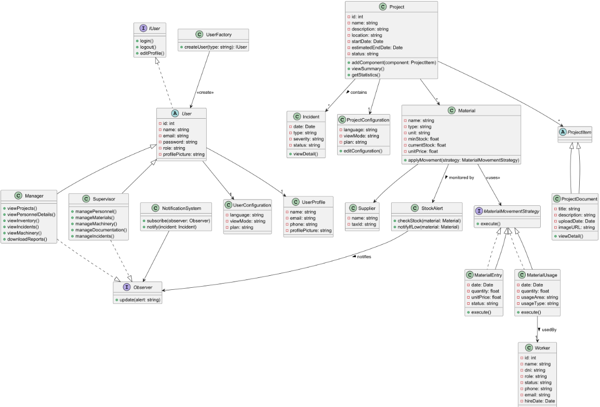

<h1 style="text-align: center;"><strong>Informe del Trabajo Final</strong></h1>
<h3 style="text-align: center;"><strong>Universidad Peruana de Ciencias Aplicadas</strong></h1>

  

<h4 style="text-align: center;"><strong>Ingeniería de Software</strong></h4>
<h4 style="text-align: center;"><strong>Aplicaciones Web - 4388</strong></h4>
<h4 style="text-align: center;"><strong>Docente: Alex Humberto Sánchez Ponce></h4>
<h4 style="text-align: center;"><strong>Startup: BuildTruck</strong></h4>

### **Team members:**

<table style="width: 100%; border-collapse: collapse; margin: 0 auto;">
  <tr>
    <th style="border: 1px solid black; padding: 8px; text-align: center;">Nombre</th>
    <th style="border: 1px solid black; padding: 8px; text-align: center;">Código</th>
  </tr>
  </tr>
    <tr>
    <td style="border: 1px solid black; padding: 8px; text-align: center;">Steven Mathew Roca Tineo</td>
    <td style="border: 1px solid black; padding: 8px; text-align: center;">U202311361</td>
  </tr>
  <tr>
    <td style="border: 1px solid black; padding: 8px; text-align: center;">Daniela Araceli Gómez Flores</td>
    <td style="border: 1px solid black; padding: 8px; text-align: center;">U202311184</td>
  </tr>
  </tr>
    <tr>
    <td style="border: 1px solid black; padding: 8px; text-align: center;">Maylhy Olinda Gutierrez Condo</td>
    <td style="border: 1px solid black; padding: 8px; text-align: center;">U202311220</td>
  </tr>  
  <tr>
    <td style="border: 1px solid black; padding: 8px; text-align: center;">Raúl Bellido Salas</td>
    <td style="border: 1px solid black; padding: 8px; text-align: center;">U202310931</td>  
  </tr>
    <tr>
    <td style="border: 1px solid black; padding: 8px; text-align: center;">Sandra Paula Luyo Correa</td>
    <td style="border: 1px solid black; padding: 8px; text-align: center;">U202314513</td>
  </tr>
</table>

<h3 style="text-align: center;"><strong>Ciclo 2025-01</strong></h3>

## Registro de Versiones del Informe
# 

| Versión | Fecha | Autor | Descripción de modificación |
| :---- | :---- | :---- | :---- |
| TB1 | 27/04/2025 | Bellido Salas, Raúl Daniela Araceli, Gómez Flores Gutiérrez Condo, Maylhy Olinda Luyo Correa, Sandra Paula Roca Tineo, Steven Mathew | En la primera entrega del informe de nuestro proyecto, hemos realizado los primeros 5 capítulos del informe y también entregamos la primera versión del landing page de BuilTruck. |

# 

## Project Report Collaboration Insights  

## Tabla de Contenidos

    
Capítulo I: Introducción 
    
        <ul>
            <li><a href="#11-Startup-Profile">1.1. Startup Profile</a></li>
            <li><a href="#111-Descripción-de-la-Startup">1.1.1. Descripción de la Startup</a></li>
            <li><a href="#112-Perfiles-de-Integrantes-del-Equipo">1.1.2. Perfiles de Integrantes del Equipo</a></li>
            <li><a href="#12-Solution-Profile">1.2. Solution Profile</a></li>
            <li><a href="#121-Antecedentes-y-Problemática">1.2.1. Antecedentes y Problemática</a></li>
            <li><a href="#122-Lean-UX-Process">1.2.2. Lean UX Process</a></li>
            <li><a href="#1221-Lean-UX-Problem-Statements">1.2.2.1. Lean UX Problem Statements</a></li>
            <li><a href="#1222-Lean-UX-Assumptions">1.2.2.2. Lean UX Assumptions</a></li>
            <li><a href="#1223-Lean-UX-Hypothesis-Statements">1.2.2.3. Lean UX Hypothesis Statements</a></li>
            <li><a href="#1224-Lean-UX-Canvas">1.2.2.4. Lean UX Canvas</a></li>
            <li><a href="#13-Segmentos-Objetivos">1.3. Segmentos Objetivos</a></li>
        </ul>    

    
Capítulo II: Requirements Elicitation & Analysis

        <ul>
            <li><a href="#21-competidores">2.1. Competidores</a></li>
            <li><a href="#211-Análisis-competitivo">2.1.1. Análisis competitivo</a></li>
            <li><a href="#212-Estrategias-y-tácticas-frente-a-competidores">2.1.2. Estrategias y tácticas frente a competidores</a></li>
            <li><a href="#22-Entrevistas">2.2. Entrevistas</a></li>
            <li><a href="#221-Diseño-de-entrevistas">2.2.1. Diseño de entrevistas</a></li>
            <li><a href="#222-Registro-de-entrevistas">2.2.2. Registro de entrevistas</a></li>
            <li><a href="#223-Análisis-de-entrevistas">2.2.3. Análisis de entrevistas</a></li>
            <li><a href="#23-Needfinding">2.3. Needfinding</a></li>
            <li><a href="#231-User-Personas">2.3.1. User Personas</a></li>
            <li><a href="#232-User-Task-Matrix">2.3.2. User Task Matrix</a></li>
            <li><a href="#233-User-Journey-Mapping">2.3.3. User Journey Mapping</a></li>
            <li><a href="#234-Empathy-Mapping">2.3.4. Empathy Mapping</a></li>
            <li><a href="#235-As-is-Scenario-Mapping">2.3.5. As-is Scenario Mapping</a></li>
            <li><a href="#24-Ubiquitous-Language">2.4. Ubiquitous Language</a></li>
        </ul>   

    
Capítulo III: Requirements Specification 

        <ul>
            <li><a href="#31-To-Be-Scenario-Mapping">3.1. To-Be Scenario Mapping</a></li>
            <li><a href="#32-User-Stories">3.2. User Stories</a></li>
            <li><a href="#33-Impact-Mapping">3.3. Impact Mapping</a></li>
            <li><a href="#34-Product-Backlog">3.4. Product Backlog</a></li>
        </ul>    

    
Capítulo IV: Product Design 

        <ul>
            <li><a href="#41-Style-Guidelines">4.1. Style Guidelines</a></li>
            <li><a href="#411-General-Style-Guidelines">4.1.1. General Style Guidelines</a></li>
            <li><a href="#412-Web-Style-Guidelines">4.1.2. Web Style Guidelines</a></li>
            <li><a href="#42-Information-Architecture">4.2. Information Architecture</a></li>
            <li><a href="#421-Organization-Systems">4.2.1. Organization Systems</a></li>
            <li><a href="#422-Labeling-Systems">4.2.2. Labeling Systems</a></li>
            <li><a href="#423-SEO-Tags-and-Meta-Tags">4.2.3. SEO Tags and Meta Tags</a></li>
            <li><a href="#424-Searching-Systems">4.2.4. Searching Systems</a></li>
            <li><a href="#425-Navigation-Systems">4.2.5. Navigation Systems</a></li>
            <li><a href="#43-Landing-Page-UI-Design">4.3. Landing Page UI Design</a></li>
            <li><a href="#431-Landing-Page-Wireframe">4.3.1. Landing Page Wireframe</a></li>
            <li><a href="#432-Landing-Page-Mock-up">4.3.2. Landing Page Mock-up</a></li>
            <li><a href="#44-Web-Applications-UXUI-Design">4.4. Web Applications UX/UI Design</a></li>
            <li><a href="#441-Web-Applications-Wireframes">4.4.1. Web Applications Wireframes</a></li>
            <li><a href="#442-Web-Applications-Wireflow-Diagrams">4.4.2. Web Applications Wireflow Diagrams</a></li>
            <li><a href="#443-Web-Applications-Mock-ups">4.4.3. Web Applications Mock-ups</a></li>
            <li><a href="#444-Web-Applications-User-Flow-Diagrams">4.4.4. Web Applications User Flow Diagrams</a></li>
            <li><a href="#45-Web-Applications-Prototyping">4.5. Web Applications Prototyping</a></li>
            <li><a href="#46-Domain-Driven-Software-Architecture">4.6. Domain-Driven Software Architecture</a></li>
            <li><a href="#461-Software-Architecture-Context-Diagrams">4.6.1. Software Architecture Context Diagrams</a></li>
            <li><a href="#462-Software-Architecture-Container-Diagrams">4.6.2. Software Architecture Container Diagrams</a></li>
            <li><a href="#463-Software-Architecture-Components-Diagrams">4.6.3. Software Architecture Components Diagrams</a></li>
            <li><a href="#47-Software-Object-Oriented-Design">4.7. Software Object-Oriented Design</a></li>
            <li><a href="#471-Class-Diagrams">4.7.1. Class Diagrams</a></li>
            <li><a href="#472-Class-Dictionary">4.7.2. Class Dictionary</a></li>
            <li><a href="#48-Database-Design">4.8. Database Design</a></li>
            <li><a href="#481-Database-Diagram">4.8.1. Database Diagram</a></li>
        </ul>    

    
Capítulo V: Product Implementation, Validation & Deployment 

        <ul>
            <li><a href="#51-software-configuration-management">5.1. Software Configuration Management</a></li>
            <li><a href="#511-software-development-environment-configuration">5.1.1. Software Development Environment Configuration</a></li>
            <li><a href="#512-source-code-management">5.1.2. Source Code Management</a></li>
            <li><a href="#513-source-code-style-guide-conventions">5.1.3. Source Code Style Guide & Conventions</a></li>
            <li><a href="#514-software-deployment-configuration">5.1.4. Software Deployment Configuration</a></li>
            <li><a href="#52-landing-page-services-applications-implementation">5.2. Landing Page, Services & Applications Implementation</a></li>
            <li><a href="#521-sprint-1">5.2.1. Sprint 1</a></li>
            <li><a href="#5211-sprint-planning-1">5.2.1.1. Sprint Planning 1</a></li>
            <li><a href="#5212-aspect-leaders-and-collaborators">5.2.1.2. Aspect Leaders and Collaborators</a></li>
            <li><a href="#5213-sprint-backlog-1">5.2.1.3. Sprint Backlog 1</a></li>
            <li><a href="#5214-development-evidence-for-sprint-review">5.2.1.4. Development Evidence for Sprint Review</a></li>
            <li><a href="#5215-execution-evidence-for-sprint-review">5.2.1.5. Execution Evidence for Sprint Review</a></li>
            <li><a href="#5216-services-documentation-evidence-for-sprint-review">5.2.1.6. Services Documentation Evidence for Sprint Review</a></li>
            <li><a href="#5217-software-deployment-evidence-for-sprint-review">5.2.1.7. Software Deployment Evidence for Sprint Review</a></li>
            <li><a href="#5218-team-collaboration-insights-during-sprint">5.2.1.8. Team Collaboration Insights during Sprint</a></li>
        </ul>        

## Student Outcome

| Criterio específico | Acciones realizadas  | Conclusiones  |
| :---- | :---- | :---- |
| **Comunica oralmente con efectividad a diferentes rangos de audiencia.**  |TB1: Bellido Salas, Raúl Participó en presentaciones orales de avances de los capítulos III, IV y V, explicando Style Guidelines, Web Guidelines y la base de datos.   TB1:Daniela Araceli Gómez Flores Realizó exposiciones claras sobre Lean UX Problem Statements, Impact Mapping y Domain-Driven Software Architecture, adaptando el lenguaje para el equipo y docentes.  TB1: Gutiérrez Condo, Maylhy Olinda Expuso el perfil de la Startup, los segmentos objetivo y los diseños de UI/UX de la Landing Page y la aplicación web, mostrando buena articulación y adaptabilidad según la audiencia.  TB1: Luyo Correa, Sandra Paula Presentó entrevistas realizadas, hallazgos de As-Is Scenario Mapping, y resultados de prototipos de aplicaciones, comunicándose de forma organizada y adecuada al público técnico y no técnico. TB1: Roca Tineo, Steven Mathew Expuso con claridad aspectos de arquitectura de información, SEO, navegación web y lideró la explicación técnica de la Landing Page desarrollada, facilitando la comprensión de temas complejos. | Todos los miembros demostraron habilidades efectivas de comunicación oral en reuniones de equipo, presentaciones de avances y defensas de entregables. La adaptación del lenguaje técnico y de negocio fue clave para facilitar el entendimiento de diferentes públicos: compañeros, docentes y revisores. Esto evidencia el cumplimiento del Student Outcome 3 de ABET-EAC respecto a la comunicación oral |
| **Comunica por escrito con efectividad a diferentes rangos de audiencia**  | TB1:Bellido Salas, Raúl Elaboró documentos técnicos como General Style Guidelines, Web Style Guidelines y Database Design Diagram. También redactó User Task Matrix y colaboró en la documentación de Sprint 1\.  TB1: Daniela Araceli Gómez Flores Desarrolló Lean UX Problem Statements, User Journey Mapping, Empathy Mapping, Organization Systems y Impact Mapping, escribiendo reportes claros y estructurados. Participó también en el armado de Domain-Driven Software Architecture. TB1:Gutiérrez Condo,   Maylhy Olinda Escribió descripciones detalladas de la Startup, segmentación de usuarios, y elaboró documentos de diseño de Landing Page UI y Web Applications UX/UI Design.   TB1: Luyo Correa, Sandra Paula Realizó Lean UX Assumptions, Lean UX Hypothesis Statements, As-Is Scenario Mapping, y reportes de entrevistas, además de documentación de Software Configuration Management.  TB1: Roca Tineo, Steven Mathew Redactó documentación técnica de Information Architecture, SEO & Meta Tags, Searching Systems, Navigation Systems, Class Diagrams, Class Dictionary y reportes de avance de la Landing Page. | Todos los integrantes demostraron habilidades sólidas para comunicar ideas de forma escrita, adaptándose a documentos técnicos, reportes de entrevistas, análisis de usuarios y especificaciones de software. La calidad y claridad en la redacción facilitó la correcta interpretación de requerimientos, diseños y resultados en cada fase del proyecto. Se destaca el trabajo de Steven Mathew Roca Tineo en la documentación técnica relacionada al desarrollo de la Landing Page. Esta comunicación escrita efectiva respalda el cumplimiento del Student Outcome 3 de ABET-EAC. |

# Capítulo I: Introducción 

## 1.1. Startup Profile

### 1.1.1. Descripción de la Startup

BuildWise es una startup tecnológica orientada al desarrollo de soluciones digitales que optimizan la gestión operativa de las empresas del sector construcción. Esta iniciativa surge como respuesta a la necesidad urgente de digitalizar y eficientizar los procesos relacionados con el control de almacén, personal y obreros, aspectos fundamentales en el éxito de cualquier proyecto constructivo.

Fundada por estudiantes de Ingeniería de Software de la Universidad de Ciencias Aplicadas de Perú, la startup tiene como propósito brindar herramientas tecnológicas accesibles, escalables y de fácil implementación que faciliten el seguimiento en tiempo real de recursos y personal en obra.

Servicios y Producto Principal:

Su producto principal es BuildTruck, una plataforma web diseñada para permitir a las empresas constructoras llevar un control eficiente y centralizado de sus operaciones en tres áreas clave: inventario, personal y obreros. 

Visión:
Ser la plataforma líder en soluciones tecnológicas para el sector construcción en América Latina, transformando la gestión de proyectos en obra a través de herramientas inteligentes y colaborativas.

Misión:
Proporcionar a las empresas constructoras una plataforma digital integral que facilite el control de recursos, personal y operatividad en obra, contribuyendo a una gestión más eficiente, transparente y productiva.

### 1.1.2. Perfiles de Integrantes del Equipo

  

  

 

  

 

  

 

  

 

## 1.2. Solution Profile

### 1.2.1. Antecedentes y problemática

*What:*

¿Cuál es el problema?

En las pequeñas y medianas empresas del sector construcción en Perú, hay una evidente falta de digitalización en los procesos operativos clave como el control de almacén, personal y obreros. Estas tareas siguen gestionándose en papel o con herramientas no especializadas, lo que genera retrasos, errores y dificultades para tomar decisiones. Según el Informe Económico de la Construcción 2023 de CAPECO, más del 65% de las constructoras MYPE aún usan métodos manuales para el seguimiento de sus recursos.

¿Cuál es la relación con la persona en cuestión?
Los supervisores de obra y asistentes administrativos son los principales afectados por esta ineficiencia. Ellos ejecutan el control diario de materiales y personal, pero no cuentan con herramientas que se adapten a la realidad del campo, por lo que terminan con sobrecarga de trabajo y dificultades para comunicar datos con rapidez a las oficinas administrativas.

*When:*

¿Cuándo sucede el problema?
El problema se presenta de forma constante durante toda la jornada laboral. Desde el ingreso de materiales al almacén, hasta el cierre diario con los reportes de asistencia del personal y el avance físico de la obra.

Como señala el Observatorio Laboral del Ministerio de Trabajo (2022), la intensidad operativa en obras hace que se necesite información actualizada en tiempo real, cosa que no se logra con registros manuales.

¿Cuándo utiliza el cliente el producto?
La plataforma BuildTruck sería utilizada durante horarios de trabajo, y especialmente en momentos clave como el inicio de faenas, recepción de insumos, control de asistencia y envío de reportes a las oficinas centrales.

*Where:*

¿Dónde está el cliente cuando utiliza el producto?
Los supervisores suelen estar físicamente en la obra, moviéndose entre áreas como almacén, oficinas temporales, y zonas de trabajo de obreros. Por su parte, los asistentes administrativos se encuentran en oficinas.

¿A dónde se dirige?
Se movilizan constantemente entre distintas áreas del proyecto: almacén, zonas de construcción y oficinas.

Según el Ministerio de Vivienda, Construcción y Saneamiento (2023), la dispersión del entorno de trabajo es un desafío clave en la coordinación de recursos en obra.

¿Dónde surge el problema?
Principalmente en campo. Por ejemplo, al no poder confirmar la disponibilidad de un material necesario o al detectar errores en los registros de asistencia. Pero también ocurre al emitir informes semanales desde oficinas sin una base de datos.

*Who:*

¿Quiénes están involucrados?
Supervisores de obra, asistentes administrativos, encargados de almacén, ingenieros residentes, jefes de proyecto y personal operativo de la constructora.

¿A quiénes les sucede el problema?
A los supervisores que no pueden verificar avances sin recorrer toda la obra y a los asistentes que deben consolidar manualmente datos desde múltiples fuentes. Esto genera presión adicional, pérdida de productividad y retrabajo.

¿Quién lo utilizará?
BuildTruck será utilizado principalmente por supervisores y asistentes, pero también puede ser una herramienta útil para ingenieros residentes o gerencias.

Como indica el BID (2022) en su informe sobre transformación digital en sectores tradicionales, herramientas adaptadas al flujo real de trabajo incrementan la productividad hasta en un 30%.

*Why:*

¿Por qué ocurre esta situación?
La razón principal es la baja madurez digital del sector construcción en el Perú. Muchas MYPES no invierten en software por desconocimiento, miedo al cambio o falta de personal capacitado. El estudio de PwC LATAM (2021) reveló que más del 70% de empresas constructoras en la región operan con bajo o nulo nivel de digitalización, especialmente en obras medianas y pequeñas.

*How:*

¿En qué condiciones los clientes usan nuestro producto?
En oficinas, la plataforma se usaría en PC o laptop, con conexión más estable y mayor necesidad de generar reportes o visualizar estadísticas.

¿Cómo nos conocieron los compradores?
Los compradores pueden conocer el servicio a través de redes como LinkedIn, o por alianzas estratégicas con gremios.

¿Cómo prefieren acceder al contenido?
Por medio de interfaces visuales, dashboards simples y reportes automáticos. Necesitan ver la información de forma clara y rápida, sin procesos complejos. Debe poder usarse sin formación técnica avanzada, ya que muchos usuarios no tienen experiencia previa con software especializado.

*How Much:*

La falta de digitalización en el sector construcción genera impactos significativos en la eficiencia operativa de las empresas:

- Pérdida de productividad: La gestión manual ralentiza los procesos y aumenta los costos operativos. Según PwC (2021), las empresas que implementan soluciones digitales experimentan mejoras en productividad y reducción de costos operativos.

- Errores y retrabajos: La falta de un sistema centralizado genera errores y retrabajos, afectando la calidad de las obras. Un informe de CAPECO (2020) menciona que la ineficiencia en la gestión es una de las principales causas de retrasos en la construcción.

- Dificultades en la toma de decisiones: La falta de datos en tiempo real limita la capacidad de tomar decisiones informadas, lo que afecta la rentabilidad y competitividad. McKinsey (2020) señala que las empresas digitales toman decisiones más rápidas y precisas, mejorando su competitividad.

  

### 1.2.2. Lean UX Process

#### 1.2.2.1. Lean UX Problem Statements

#### 1. Nuestra plataforma ha sido diseñada para permitir a pequeñas y medianas empresas constructoras, así como a trabajadores administrativos, gestionar eficientemente sus proyectos de construcción, desde la solicitud de servicios hasta el monitoreo de avances y gastos. A través de esta herramienta digital, buscamos facilitar la administración y mejorar la transparencia de los procesos constructivos.
#### Hemos observado que una de las principales dificultades para estas empresas es la falta de un sistema centralizado y amigable que les permita realizar un seguimiento detallado de los proyectos en curso, registrar avances, visualizar presupuestos y comunicarse de forma efectiva con los diferentes actores involucrados en la obra. Esto genera desorganización, demoras en la entrega de reportes y problemas en la toma de decisiones.
¿Cómo podemos mejorar la experiencia de las pequeñas y medianas empresas en la gestión de sus obras mediante una plataforma más intuitiva, accesible y con herramientas integradas que faciliten el seguimiento de cada fase del proyecto?

#### 2. Nuestro sistema fue creado con el objetivo de optimizar la gestión de proyectos de construcción, reducir errores administrativos y proporcionar a los usuarios una visión clara y precisa del estado de sus obras, recursos utilizados y cumplimiento de plazos.
#### Hemos identificado que muchos trabajadores administrativos aún dependen de hojas de cálculo, comunicaciones dispersas para registrar y compartir información. Esto no solo dificulta el acceso a datos actualizados, sino que también incrementa la posibilidad de errores y retrabajos.

¿Cómo podemos digitalizar y automatizar los procesos administrativos dentro de los proyectos de construcción, garantizando que los trabajadores administrativos cuenten con herramientas fáciles de usar que les permitan organizar, registrar y compartir información de forma eficiente?

#### 3. Además, hemos detectado que algunas pequeñas empresas enfrentan barreras tecnológicas, ya sea por desconocimiento en el uso de herramientas digitales o por la falta de plataformas diseñadas específicamente para su contexto. Esto puede llevar a que no aprovechen completamente los beneficios de una solución digital.

¿Cómo podemos diseñar una plataforma adaptable a diferentes niveles de experiencia tecnológica, que permita a empresas de distintos tamaños adoptar y aprovechar fácilmente todas las funcionalidades del sistema sin requerir una curva de aprendizaje elevada?

#### 1.2.2.2. Lean UX Assumptions

**Assumptions worksheet**

1. Creo que mis clientes necesitan una forma moderna de realizar la gestión de obras.

2. Estas necesidades se pueden resolver con una aplicación web simple de entender para poder realizar la gestión de los materiales y trabajadores de una obra.

3. Mis clientes iniciales son jóvenes de 20 a 30 años de edad y adultos de 40 a 60 años de edad que buscan mejorar la gestión de sus proyectos.

4. El valor #1 que un cliente quiere en mi servicio es eficiencia para poder realizar todas sus tareas en el menor tiempo posible.

5. Haré dinero a través de un sistema de subscripciones mensuales de diferentes escalones, cada uno ofreciendo más beneficios, pero a mayor costo.

6. Mi competencia principal en el mercado serán otras plataformas usadas para la gestión de obras.

7. Los venceremos debido a nuestra interfaz simple y eficaz. Ofreceremos herramientas entendibles para poder facilitar los procesos de los gerentes y supervisores.

8. Mi mayor riesgo de producto es que nuestros clientes no puedan adaptarse al funcionamiento de la plataforma.

9. Resolveremos a través de tutoriales y contenido informativo sobre el uso de nuestro producto.

**¿Quién es el usuario?**

Los gerentes  y los supervisores de obra .

**¿Dónde encaja nuestro producto en su trabajo o vida?**

Nuestro producto, buildtrack, encaja en la vida laboral de los usuarios al proporcionarles un sitio web en donde puedan gestionar el inventario y mano de obra.

**¿Qué problemas tiene nuestro producto y cómo se puede resolver?**

* Posible lentitud con gran cantidad de datos:

  Solución: Optimización del backend y uso de bases de datos eficientes.

* Conectividad limitada en zonas de obra:

  Solución: Implementación de un modo offline que sincronice datos cuando haya conexión.

* Resistencia al cambio por parte del personal:

  Solución: Capacitación y diseño intuitivo que reduzca la curva de aprendizaje.

**¿Cuándo y cómo es usado nuestro producto?**

Buildtrack es utilizado durante la jornada laboral, en especial en momentos clave como:

* Registro de ingreso/salida de materiales.

* Verificación de asistencia del personal.

* Generación de reportes semanales o diarios.

* Consulta del avance de obras.

**¿Qué características son importantes?**

Tiene que ofrecer Información actualizada al momento para una toma de decisiones precisa. Tiene que presentar una interfaz simple y de uso intuitivo. Tiene que ser accesible desde cualquier dispositivo. Finalmente, tiene que presentar soporte para una gran cantidad de datos sin perder estabilidad en el rendimiento.

**¿Cómo debe verse nuestro producto y cómo debe comportarse?**

Tiene que presentar un diseño simple y legible, con fuentes claras, y una jerarquia visual limpia.

Tiene que presentar una paleta de colores contrastante para facilitar su lectura.

Debe de presentar un comportamiento fluido en sus interacciones.
 
#### 1.2.2.3. Lean UX Hypothesis Statements
* Creemos que las funciones que brinda BuildTrack son útiles y eficientes para poder llevar un buen manejo de empresas de construcción. Sabremos que hemos tenido éxito cuando el 60% de nuestros usuarios haya renovado su suscripción.  
* Creemos que una funcionalidad que ajuste dinámicamente los niveles de inventario según el tamaño del proyecto reducirá los pedidos innecesarios de materiales, y lo sabremos porque el sistema registrará una disminución del 20% en órdenes de reposición duplicadas en los primeros dos meses.  
* Creemos que permitir la sincronización automática de datos entre inventario, personal y obreros en una sola plataforma web optimizará la toma de decisiones, y lo sabremos porque el tiempo promedio para generar reportes operativos completos será inferior a 30 minutos.  
* Creemos que una plataforma web que consolide todos los datos de inventario en un panel centralizado reducirá el tiempo necesario para conciliar existencias físicas y digitales, y lo sabremos porque el sistema registrará un promedio de actualización de inventario inferior a 40 minutos por operación.

# 
#### 1.2.2.4. Lean UX Canvas

  

## 1.3. Segmentos Objetivos

**Segmento Objetivo 1: Gerentes de obra**  
Este segmento está compuesto por profesionales encargados de supervisar y gestionar la ejecución de los proyectos de construcción. En muchas empresas pequeñas y medianas, este rol es , quien cumple múltiples funciones que van desde la supervisión directa en campo hasta la toma de decisiones administrativas y técnicas.

**Características demográficas:**

* Ubicación: Principalmente en zonas urbanas y semiurbanas de Lima Metropolitana, como San Juan de Lurigancho, Villa El Salvador, Ate y San Martín de Porres, donde se concentran pequeñas y medianas empresas constructoras.  
* Edad: Entre 28 y 50 años, con una media de 38 años.  
* Nivel socioeconómico: Clase media.  
* Desafíos:Los gerentes de obra suelen enfrentarse a la sobrecarga de responsabilidades, especialmente cuando también actúan como jefes de obra. La falta de herramientas digitales adaptadas a su rutina diaria limita su capacidad de monitoreo en tiempo real y dificulta el seguimiento de materiales, personal y avances. Además, muchas veces deben recurrir a registros manuales o aplicaciones genéricas que no están pensadas para el sector construcción.

**Segmento Objetivo 2:  Supervisores de obra**   
Este segmento está conformado por personal encargado de la logística documental y operativa de la obra. Gestionan los trámites de materiales, control de insumos, asistencia del personal, licencias, permisos y reportes dirigidos al área administrativa o a la supervisión.

**Características demográficas:**

* Ubicación: Lima Metropolitana, principalmente en distritos con alta actividad constructiva como La Victoria, El Agustino, Independencia y Cercado de Lima.  
* Edad: Entre 22 y 35 años.  
* Nivel socioeconómico: Clase media.  
* Desafíos:Los  supervisores de obra deben recopilar y organizar información dispersa en distintos formatos, lo cual ralentiza la toma de decisiones. Además, enfrentan dificultades para realizar reportes rápidos y precisos, así como para coordinar con múltiples actores del proyecto. La falta de una plataforma centralizada para registrar entradas/salidas de materiales y datos del personal aumenta el margen de error y el trabajo duplicado.

# Capítulo II: Requirements Elicitation & Analysis

## 2.1. Competidores

### 2.1.1. Análisis competitivo

<body>
<table class="c16">
<tr class="c1">
<td class="c13" colspan="6" rowspan="1">
Competitive Analysis Landscape
</td>
</tr>
<tr class="c1">
<td class="c11" colspan="2" rowspan="1">
¿Por qué llevar a cabo este análisis?
</td>
<td class="c17" colspan="4" rowspan="1">
Elaborar este análisis es esencial para entender el posicionamiento de BuildTruck en el mercado de software de gestión para la construcción, identificar oportunidades de diferenciación y anticipar amenazas de competidores establecidos. Esto permite ajustar la propuesta de valor, optimizar estrategias de marketing y producto, y garantizar que BuildTruck responda a las necesidades específicas de las empresas constructoras, especialmente en un sector que está adoptando rápidamente la digitalización.
</td>
</tr>
<tr class="c1">
<td class="c11" colspan="2" rowspan="1">

</td>
<td class="c0" colspan="1" rowspan="1">
BuildTruck

</td>
<td class="c0" colspan="1" rowspan="1">
Procore

</td>
<td class="c0" colspan="1" rowspan="1">
Buildertrend

</td>
<td class="c0" colspan="1" rowspan="1">
PlanGrid

</td>
</tr>
<tr class="c1">
<td class="c0" colspan="1" rowspan="2">
Perfil
</td>
<td class="c0" colspan="1" rowspan="1">
Overview
</td>
<td class="c0" colspan="1" rowspan="1">
BuildTruck es una plataforma web que centraliza la gestión operativa de empresas constructoras en tres áreas clave: inventario, personal y obreros, con un enfoque en accesibilidad y escalabilidad.
</td>
<td class="c0" colspan="1" rowspan="1">
Procore es una plataforma que ayuda a optimizar y administrar proyectos de construcción desde la etapa previa hasta su finalización.
</td>
<td class="c0" colspan="1" rowspan="1">
Buildertrend es un software de gestión de construcción diseñada para simplificar la comunicación y administrar proyectos, con un enfoque en construcciones de casas y remodeladores.
</td>
<td class="c0" colspan="1" rowspan="1">
PlanGrid es una herramienta enfocada en la gestión de planos y documentos en tiempo real, con capacidades extendidas para la gestión de proyectos.
</td>
</tr>
<tr class="c1">
<td class="c0" colspan="1" rowspan="1">
Ventaja competitiva ¿Qué valor ofrece a los clientes?
</td>
<td class="c0" colspan="1" rowspan="1">
Su diseño simple y específico para PYMES constructoras, combinado con un enfoque en seguimiento en tiempo real y costos asequibles, la posiciona como una alternativa práctica frente a soluciones más complejas y costosas.
</td>
<td class="c0" colspan="1" rowspan="1">
Ofrece productos y servicios de gestión de preconstrucción, administración de proyectos, finanzas, recursos y datos. También brinda soporte de expertos de construcción.
</td>
<td class="c0" colspan="1" rowspan="1">
Su facilidad de uso y herramientas específicas para la comunicación con clientes (portales de clientes) lo hacen ideal para pequeñas y medianas empresas que buscan mejorar la experiencia del cliente.
</td>
<td class="c0" colspan="1" rowspan="1">
Su integración con el ecosistema Autodesk (como AutoCAD y BIM 360) y su especialización en la gestión de planos digitales ofrecen un valor único para empresas que dependen de diseños técnicos precisos.
</td>
</tr>
<tr class="c1">
<td class="c0" colspan="1" rowspan="2">
Perfil de Marketing
</td>
<td class="c0" colspan="1" rowspan="1">
Mercado objetivo
</td>
<td class="c0" colspan="1" rowspan="1">
Gerentes de obra de obra y supervisores de obra de obra.
</td>
<td class="c0" colspan="1" rowspan="1">
Empresas constructoras de todos los tamaños, desde pequeñas firmas hasta grandes contratistas generales, con un enfoque en proyectos comerciales y residenciales.
</td>
<td class="c0" colspan="1" rowspan="1">
Principalmente constructores residenciales, remodeladores y contratistas especializados de pequeño a mediano tamaño.
</td>
<td class="c0" colspan="1" rowspan="1">
Contratistas, arquitectos e ingenieros en proyectos comerciales e industriales de mediano a gran tamaño.
</td>
</tr>
<tr class="c1">
<td class="c0" colspan="1" rowspan="1">
Estrategias de marketing
</td>
<td class="c0" colspan="1" rowspan="1">
Enfoque en marketing digital por redes sociales enfocado en gerentes de obra de obra y supervisores de obra de obra, webinars para explicar el funcionamiento de la plataforma y una versión de prueba gratuita.
</td>
<td class="c0" colspan="1" rowspan="1">
Publicidad digital enfocada en la productividad y la escalabilidad, presencia en eventos de la industria (como ferias de construcción), y contenido educativo (webinars, guías) para atraer a gerentes de proyectos y dueños de empresas.
</td>
<td class="c0" colspan="1" rowspan="1">
Marketing de contenido (blogs, videos tutoriales), campañas en redes sociales dirigidas a propietarios de negocios, y programas de referidos para fomentar la adopción.
</td>
<td class="c0" colspan="1" rowspan="1">
Colaboración con Autodesk para campañas globales, enfoque en la digitalización de planos, y presencia en conferencias técnicas y de diseño.
</td>
</tr>
<tr class="c1">
<td class="c0" colspan="1" rowspan="3">
Perfil de Producto
</td>
<td class="c0" colspan="1" rowspan="1">
Productos & Servicios
</td>
<td class="c0" colspan="1" rowspan="1">
Gestión de inventario, seguimiento del personal, reportes operativos en tiempo real, y herramientas móviles.
</td>
<td class="c0" colspan="1" rowspan="1">
Gestión de proyectos, control de documentos, seguimiento de recursos, reportes financieros, y aplicaciones móviles para uso en obra.
</td>
<td class="c0" colspan="1" rowspan="1">
Gestión de proyectos, programación, seguimiento de costos, comunicación con clientes, y herramientas móviles.
</td>
<td class="c0" colspan="1" rowspan="1">
Gestión de planos, colaboración en tiempo real, seguimiento de tareas, y reportes de campo.
</td>
</tr>
<tr class="c1">
<td class="c0" colspan="1" rowspan="1">
Precios & Costos
</td>
<td class="c0" colspan="1" rowspan="1">
Modelo de suscripción desde $50/mes (plan básico) hasta $200/mes para funciones avanzadas, con opciones escalables.
</td>
<td class="c0" colspan="1" rowspan="1">
Modelo de suscripción basado en proyectos o usuarios, con precios que comienzan en aproximadamente $375/mes (plan básico) hasta miles de dólares para grandes empresas.

</td>
<td class="c0" colspan="1" rowspan="1">
Suscripción mensual desde $99/mes (plan inicial) hasta $399/mes para funciones avanzadas, con costos adicionales por usuario.
</td>
<td class="c0" colspan="1" rowspan="1">
Desde $49/mes por usuario (plan básico) hasta planes personalizados para empresas grandes, integrados en el ecosistema Autodesk.
</td>
</tr>
<tr class="c1">
<td class="c0" colspan="1" rowspan="1">
Canales de distribución (Web y/o Móvil)
</td>
<td class="c0" colspan="1" rowspan="1">
Venta directa online a través de la aplicación web, soporte vía chat y email.
</td>
<td class="c0" colspan="1" rowspan="1">
Venta directa a través de su sitio web, equipo de ventas empresariales, y asociaciones con distribuidores de software.
</td>
<td class="c0" colspan="1" rowspan="1">
Venta directa online, soporte a través de equipos de atención al cliente, y partnerships con asociaciones de constructores.
</td>
<td class="c0" colspan="1" rowspan="1">
Venta a través de Autodesk, suscripciones directas online, y distribuidores autorizados.
</td>
</tr>
<tr class="c1">
<td class="c0" colspan="1" rowspan="4">
Análisis SWOT
</td>
<td class="c0" colspan="1" rowspan="1">
Fortalezas
</td>
<td class="c0" colspan="1" rowspan="1">
Costo accesible, facilidad de implementación, enfoque en necesidades operativas básicas.
</td>
<td class="c0" colspan="1" rowspan="1">
Es una marca consolidada con una amplia base de usuarios e integración robusta con otras herramientas.
</td>
<td class="c0" colspan="1" rowspan="1">
Interfaz intuitiva, fuerte enfoque en el cliente final, precios competitivos para PYMES.
</td>
<td class="c0" colspan="1" rowspan="1">
Respaldo de Autodesk, especialización en planos y BIM, alta precisión técnica.
</td>
</tr>
<tr class="c1">
<td class="c0" colspan="1" rowspan="1">
Debilidades
</td>
<td class="c0" colspan="1" rowspan="1">
Falta de reconocimiento de marca.

</td>
<td class="c0" colspan="1" rowspan="1">
Costo elevado para pequeñas empresas, curva de aprendizaje para usuarios no técnicos.
</td>
<td class="c0" colspan="1" rowspan="1">
Menor escalabilidad para proyectos grandes o complejos, menos integraciones que competidores como Procore.
</td>
<td class="c0" colspan="1" rowspan="1">
Dependencia del ecosistema Autodesk, menos enfoque en gestión de personal o inventario.
</td>
</tr>
<tr class="c1">
<td class="c0" colspan="1" rowspan="1">
Oportunidades
</td>
<td class="c0" colspan="1" rowspan="1">
Creciente digitalización en constructoras, nicho en mercados desatendidos por competidores grandes.
</td>
<td class="c0" colspan="1" rowspan="1">
Expansión en mercados emergentes con alta actividad constructiva, adopción de IA para análisis predictivo.
</td>
<td class="c0" colspan="1" rowspan="1">
Crecimiento en el segmento de remodelación residencial, expansión internacional.
</td>
<td class="c0" colspan="1" rowspan="1">
Creciente adopción de BIM en la construcción, expansión en mercados con alta regulación técnica.
</td>
</tr>
<tr class="c1">
<td class="c0" colspan="1" rowspan="1">
Amenazas
</td>
<td class="c0" colspan="1" rowspan="1">
Competencia de soluciones establecidas, riesgo de ser percibida como "básica" frente a plataformas más robustas.
</td>
<td class="c0" colspan="1" rowspan="1">
Competencia de soluciones más económicas, resistencia a la digitalización en algunas regiones.
</td>
<td class="c0" colspan="1" rowspan="1">
Competencia de soluciones más especializadas, saturación en el mercado residencial.
</td>
<td class="c0" colspan="1" rowspan="1">
Competencia de soluciones más completas, costo elevado para pequeñas empresas.
</td>
</tr>
</table>
</body>

#

### 2.1.2. Estrategias y tácticas frente a competidores

* Ofreceremos un plan de suscripción básico a $50/mes (como se sugirió) con funciones esenciales (gestión de inventario y personal), mucho más bajo que los $375/mes de Procore o los $99/mes de Buildertrend.  
* Al lanzar contenido gratuito como webinars y guías PDF sobre los beneficios de la digitalización operativa y sobre el funcionamiento de nuestra aplicación web dirigido a empresas que aún usan métodos manuales, posicionaremos a BuildTruck como el primer paso accesible frente a soluciones más avanzadas.  
* Implementaremos una prueba gratuita de 30 días, frente a los 14 días usuales de competidores, con acceso completo a la plataforma, destacando de esta manera la facilidad de uso y la implementación sin necesidad de soporte técnico extenso, a diferencia de otros competidores, que tienes una curva de aprendizaje pronunciada.  
* Desarrollaremos características específicas como alertas automáticas de bajo inventario para así diferenciarnos de las plataformas de competencia que se centran más en planos o que priorizan más la comunicación con clientes.  
* Ofreceremos soporte vía chat o teléfono con tiempos de respuesta rápidos, superando el soporte de la competencia que a menudo requiere obtener tickets y es más tardado.  
* Ofreceremos planes escalables según el número de proyectos, permitiendo a los usuarios crecer con BuildTruck sin sentirse forzados a pagar planes caros desde un inicio, a diferencia de algunos competidores.

#

## 2.2. Entrevistas

### 2.2.1. Diseño de entrevistas

***-Segmento objetivo \#1: Gerentes de obra*** 

***Características demográficas:***

*  ¿Cuál es tu edad?  
* ¿En qué lugar trabajas o estás actualmente asignado(a)?  
* ¿Cuál es tu cargo o rol específico dentro de tu trabajo?

***Preguntas Principales***

1. ¿Cuáles son tus principales responsabilidades diarias sobre las obras?  
2. ¿Cómo gestionas actualmente el seguimiento de materiales y personal en campo?  
3. ¿Utilizas algún software o herramienta digital para controlar las actividades en la obra? ¿Cuál(es)?  
4. ¿Cuántos proyectos diriges en tu cargo?  
5. ¿Cuáles son los mayores retos que enfrentas al momento de controlar el avance del proyecto?

***Preguntas sobre el Proyecto*** 

6. ¿Qué te parecería contar con una plataforma que te permita monitorear inventario, personal y actividades?  
7. ¿Qué funcionalidades serían esenciales para ti en una plataforma de gestión de obra?  
8. ¿Con qué frecuencia necesitarías revisar o actualizar la información sobre materiales o personal?  
9. ¿Qué tipo de notificaciones o alertas te serían realmente útiles para tomar decisiones rápidas?

***-Segmento objetivo \#2:  Supervisores de obra*** 

***Características demográficas:***

*  ¿Cuál es tu edad?  
* ¿En qué institución trabaja o estás actualmente asignado(a)?  
* ¿Cuál es tu cargo o rol específico dentro de tu trabajo?

***Preguntas Principales*** 

1. ¿Cómo organizas y almacenas la información relacionada con materiales, personal y documentos en la obra?  
2. ¿Cuánto tiempo te toma preparar reportes?  
3. ¿Qué herramientas digitales (si alguna) utilizas actualmente en tu trabajo?  
4. ¿Qué tan difícil es programar los horarios y reuniones para las coordinaciones a realizar con gerentes de obra, almacén y personal técnico en el día a día?   
5. ¿Has tenido problemas por datos incompletos, pérdidas de documentos o información mal registrada?

***Preguntas sobre el Proyecto***

6. ¿Cómo te ayudaría tener una plataforma centralizada para registrar y consultar entradas/salidas de materiales y datos del personal?  
7. ¿Qué tipo de reportes automatizados te serían más útiles en tu rutina diaria?  
8. ¿Qué esperas de una plataforma que ayude con la gestión operativa de obra?  
9. Si tuvieras que diseñar una app para tu trabajo, ¿qué funciones serían imprescindibles?

### 2.2.2. Registro de entrevistas
A continuación, se detallan las transcripciones, las pruebas recopiladas y un resumen de cada una de las entrevistas realizadas a los usuarios.  
***----Segmento objetivo \#1: Gerentes de obra*** 

**Figura 1** 

*Imagen del usuario número 1 entrevistado* 

 

  

*Nota. Elaboración propia. Se le presentaron al usuario las preguntas previamente elaboradas por el equipo.* 

### **Características demográficas**

* ¿Cuál es tu edad aproximadamente?.  
   61 años.

* ¿En qué lugar trabajas o estás actualmente asignado(a)?.  
   Trabajo en la Municipalidad de Maranura, La Convención, Cusco.

* ¿Cuál es tu cargo o rol específico dentro de tu trabajo?.  
   Jefe de Supervisión de Proyectos.

### **Preguntas principales**

* ¿Cuáles son tus principales responsabilidades diarias sobre las obras?.  
   Coordinar con los profesionales de supervisión para realizar el control y seguimiento de los proyectos que están actualmente en ejecución.

* ¿Cómo gestionas actualmente el seguimiento de materiales y personal en campo?.  
   Los requerimientos de materiales y servicios los realiza el residente de cada proyecto, y luego el supervisor da el visto bueno.

* ¿Utilizas algún software o herramienta digital para controlar las actividades en la obra? ¿Cuál(es)?.  
   Sí, utilizo MS Project para el control de proyectos y hojas de cálculo como el cronograma valorizado de obra.

* ¿Podrías explayarte más sobre qué exactamente compone el cronograma de obra?.  
   El cronograma de obra planifica la ejecución en el tiempo de cada una de las actividades del proyecto, como la cimentación, muros, techos, etc. Todo está organizado por tiempos y fases.

* ¿Cuántos proyectos diriges en tu cargo?.  
   Actualmente estoy a cargo de aproximadamente seis o siete proyectos.

* ¿Cuáles son los mayores retos que enfrentas al momento de controlar el avance del proyecto?.  
   Que se cumpla la programación inicial dentro de los plazos previstos, tanto en la ejecución de cada actividad como en la conclusión del proyecto, que está definido por hitos importantes.

### **Preguntas sobre el proyecto**

* ¿Qué te parecería contar con una plataforma que te permita monitorear inventario, personal y actividades?.  
   Sería importante contar con una plataforma así, para controlar tanto al personal como la utilización de materiales y servicios.

* ¿Qué funcionalidades serían esenciales para ti en una plataforma de gestión de obra?.  
   Que muestre el personal asignado a la obra, los materiales requeridos, el uso de maquinaria, y que incluya tanto al personal de campo como al obrero.

* ¿Con qué frecuencia necesitarías revisar o actualizar la información sobre materiales o personal?.  
   Mínimamente de forma semanal, y también se hace una verificación mensual sobre el uso de materiales, personal y maquinaria.

* ¿Qué tipo de notificaciones o alertas te serían realmente útiles para tomar decisiones rápidas?.  
   Alertas sobre el uso de materiales y cumplimiento de actividades programadas. Si no se cumple lo programado, se alerta al residente de obra. También se hacen alertas a los responsables de adquisiciones cuando no se entregan los materiales a tiempo, generalmente mediante documento.

**Figura 2** 

*Imagen del usuario número 2 entrevistado* 

  

*Nota. Elaboración propia. Se le presentaron al usuario las preguntas previamente elaboradas por el equipo.* 

### **Características demográficas**

* ¿Cuál es tu edad aproximadamente?.  
   48 años.

* ¿En qué lugar trabajas o estás actualmente asignado(a)?.  
   Dirijo una empresa actualmente, y estoy a cargo de ella.

* ¿Cuál es tu cargo o rol específico dentro de tu trabajo?.  
   Gerente General.

### **Preguntas principales**

* ¿Cuáles son tus principales responsabilidades diarias sobre las obras?.  
   Dirijo todas las áreas relacionadas con el control de obra: materiales, equipos, mano de obra.

* ¿Cómo gestionas actualmente el seguimiento de materiales y personal en campo?.  
   Generalmente se realiza mediante hojas de cálculo en Excel.

* ¿Cuántos proyectos diriges en tu cargo?.  
   Actualmente dos, pero varía entre tres o cuatro según la cantidad de proyectos ganados.

* ¿Cuáles son los mayores retos que enfrentas al momento de controlar el avance del proyecto?.  
   El control diario de materiales, movimiento de equipos y mano de obra.

### **Preguntas sobre el proyecto**

* ¿Qué te parecería contar con una plataforma que te permita monitorear inventario, personal y actividades?.  
   Sería importante, facilitaría los reportes y los haría más accesibles. También permitiría que cualquier trabajador o asistente pueda usarlos.

* ¿Qué funcionalidades serían esenciales para ti en una plataforma de gestión de obra?.  
   Control de materiales, control de maquinaria y control de personal.

* ¿Con qué frecuencia necesitarías revisar o actualizar la información sobre materiales o personal?.  
   Mínimo diariamente, y preferentemente en tiempo real.

* ¿Qué tipo de notificaciones o alertas te serían realmente útiles para tomar decisiones rápidas?.  
   Alertas sobre stock de materiales, ingresos y salidas; además, control diario del personal y los frentes de trabajo en los que se encuentran.

**Figura 3** 

*Imagen del usuario número 3 entrevistado* 

  

*Nota. Elaboración propia. Se le presentaron al usuario las preguntas previamente elaboradas por el equipo.* 

**Características demográficas**

* ¿Cuál es tu edad aproximadamente?.  
   28 años     
* ¿En qué lugar trabajas o estás actualmente asignado(a)?.  
  Actualmente estoy asignado en una obra de construcción de un complejo de oficinas en Lima.  
* ¿Cuál es tu cargo o rol específico dentro de tu trabajo?.  
  Soy gerente de obra. Me encargo de coordinar todo el proyecto en campo, asegurar que se cumplan los plazos, el presupuesto y la calidad esperada.

**Preguntas principales**

* ¿Cuáles son tus principales responsabilidades diarias sobre las obras?.  
  Mis principales responsabilidades son coordinar al personal, supervisar avances diarios, controlar el stock de materiales, hacer reportes diarios y comunicarme con el equipo de oficina técnica.

* ¿Cómo gestionas actualmente el seguimiento de materiales y personal en campo?.  
   Por ahora, usamos Excel para llevar un control de materiales. Para el personal, llevamos un registro manual en planillas diarias que luego entregamos al área administrativa.  
* ¿Cuántos proyectos diriges en tu cargo?.  
  Actualmente tengo dos proyectos a mi cargo. Uno está en la etapa final y el otro acaba de empezar.  
* ¿Cuáles son los mayores retos que enfrentas al momento de controlar el avance del proyecto?.  
  La falta de comunicación rápida entre los equipos, la pérdida de información entre tantos reportes manuales y la dificultad para actualizar en tiempo real el avance de materiales y recursos humanos.

**Preguntas sobre el proyecto**

* ¿Qué te parecería contar con una plataforma que te permita monitorear inventario, personal y actividades?.  
  ¡Sería ideal\! Nos ahorraría tiempo y nos permitiría tomar decisiones más rápido en el día a día.  
* ¿Qué funcionalidades serían esenciales para ti en una plataforma de gestión de obra?.  
   Que tenga un control claro de inventario, avance de actividades en tiempo real y alertas automáticas cuando falte algo crítico.  
* ¿Con qué frecuencia necesitarías revisar o actualizar la información sobre materiales o personal?.  
  Mínimo dos veces al día. Una al inicio de la jornada para saber con qué contamos y otra a mitad del día para ver el avance o si hay algo urgente que solucionar.  
* ¿Qué tipo de notificaciones o alertas te serían realmente útiles para tomar decisiones rápidas?.  
  Notificaciones cuando el stock esté por agotarse, alertas de ausencias de personal clave, y avisos cuando una actividad crítica esté retrasada.

***----Segmento objetivo \#2:  Supervisores de obra***   
**Figura 4** 

*Imagen del usuario número 4 entrevistado* 

  

*Nota. Elaboración propia. Se le presentaron al usuario las preguntas previamente elaboradas por el equipo.* 

 

### **Características demográficas**

* ¿Cuál es tu edad?  
   Tengo 55 años.

* ¿En qué institución trabaja o está actualmente asignada?  
   Trabajo en la empresa Hway, que se dedica a elaborar proyectos de construcción.

* ¿Cuál es su cargo o rol específico dentro de su trabajo?  
   Soy asistente administrativo.

### **Preguntas principales**

* ¿Cómo organiza y almacena la información relacionada con materiales, personal y documentos en la obra?  
   La organización se hace por rubros, por ejemplo: materiales eléctricos, materiales de construcción y otros. El personal se clasifica como parte técnica, obrera, ayudantes y guardianes.

* ¿Cuánto tiempo le toma preparar los reportes?  
   Depende de la organización del proyecto. Puede ser semanal, mensual u otro, según las necesidades.

* ¿Qué herramientas digitales (si alguna) utiliza actualmente en su trabajo?  
   Utilizo Excel, Word, PowerPoint para exposiciones e informes. También usamos WhatsApp y correo electrónico para coordinaciones.

* ¿Qué tan difícil es programar los horarios y reuniones para las coordinaciones con gerentes de obra, almacén y personal técnico en el día a día?  
   No es difícil. Se trata más de llegar a acuerdos y tener buena coordinación y comunicación. Programar reuniones pequeñas ayuda mucho.

* ¿Ha tenido problemas por datos incompletos, pérdidas de documentos o información mal registrada?  
   Sí, normalmente cuando otras personas no registran la información en el momento correcto. La información incompleta causa problemas, aunque cuando uno mismo lo hace con cuidado, no suele pasar.

### **Preguntas sobre el proyecto**

* ¿Cómo le ayudaría tener una plataforma centralizada para registrar y consultar entradas/salidas de materiales y datos del personal?  
   Ayudaría mucho a sintetizar la información. Por ejemplo, el almacenero podría registrar entradas y salidas diarias con mayor control. También se podría hacer un mejor seguimiento de la asistencia del personal, que suele ir de 7 a.m. a 5 p.m.

* ¿Qué tipo de reportes automatizados serían más útiles en su rutina diaria?  
   Reportes de movimientos de almacén, control de combustible, y asistencia del personal. Todo eso facilitaría bastante el trabajo.

* ¿Qué esperaría de una plataforma que ayude con la gestión operativa de la obra?  
   Que permita generar informes semanales y mensuales, y que ayude con la evaluación del avance físico de la obra.

**Figura 5** 

*Imagen del usuario número 5 entrevistado* 

  

*Nota. Elaboración propia. Se le presentaron al usuario las preguntas previamente elaboradas por el equipo.* 

### **Características demográficas**

* ¿Cuál es tu edad?  
   Tengo 22 años.

* ¿En qué institución trabaja o está actualmente asignado?  
   Actualmente trabajo en una empresa inmobiliaria.

* ¿Cuál es tu cargo o rol específico dentro de tu trabajo?  
   Soy asistente de obras.

### **Preguntas principales**

* ¿Cómo organizas y almacenas la información relacionada con materiales, personal y documentos en la obra?  
   Utilizo principalmente Excel para registrar los materiales utilizados y los informes diarios de las jornadas laborales.

* ¿Cuánto tiempo te toma preparar reportes diarios o semanales?  
   Entre 5 a 7 días, ya que estudio mientras trabajo.

* ¿Qué herramientas digitales (si alguna) utilizas actualmente en tu trabajo?  
   Principalmente Excel, y a veces AutoCAD para apoyar en el diseño, aunque no es mi labor principal.

* ¿Qué tan difícil es programar los horarios y reuniones para las coordinaciones con gerentes de obra, almacén y personal técnico en el día a día?  
   Toma tiempo, ya que hay que coordinar con diversas áreas como diseño, gestión y cálculos estructurales. Es un trabajo conjunto y requiere organización.

* ¿Has tenido problemas por datos incompletos, pérdidas de documentos o información mal registrada?  
   Problemas graves no, pero sí algunas confusiones menores, que pudieron corregirse a tiempo.

### **Preguntas sobre el proyecto**

* ¿Cómo te ayudaría tener una plataforma centralizada para registrar y consultar entradas/salidas de materiales y datos del personal?  
   Facilitaría y agilizaría el proceso de ejecución del proyecto, haciéndolo más eficiente.

* ¿Qué tipo de reportes automatizados te serían más útiles en tu rutina diaria?  
   Reportes sobre materiales, recursos y el uso de maquinaria como excavadoras, grúas o mezcladoras.

* ¿Qué esperas de una plataforma que ayude con la gestión operativa de obra?  
   Que ayude a agilizar la obra y que presente los materiales necesarios en tiempo real, lo cual mejoraría significativamente la ejecución.

* Si tuvieras que diseñar una app para tu trabajo, ¿qué funciones serían imprescindibles?  
   Que presente gráficos del avance del proyecto, y ofrezca resultados que evidencien eficiencia y buena ejecución.

**Figura 6** 

*Imagen del usuario número 6 entrevistado* 

  

*Nota. Elaboración propia. Se le presentaron al usuario las preguntas previamente elaboradas por el equipo.* 

### **Características demográficas**

* ¿Cuál es tu edad?.  
   Tengo 21 años.

* ¿En qué institución trabaja o estás actualmente asignado(a)?.  
   Actualmente trabajo como practicante de diseño estructural en la empresa RPG.

* ¿Cuál es tu cargo o rol específico dentro de tu trabajo?.  
   Hago los planos base e inserto elementos estructurales como columnas y vigas.

  ### **Preguntas principales**

* ¿Cómo organizas y almacenas la información relacionada con materiales, personal y documentos en la obra?.  
   Organizo mi información en subcarpetas dentro de mi laptop y también la almaceno en Autodesk Construction Cloud de la empresa.

* ¿Cuánto tiempo te toma preparar reportes?.  
   Aproximadamente 2 horas.

* ¿Qué herramientas digitales (si alguna) utilizas actualmente en tu trabajo?.  
   Trabajo con AutoCAD para realizar planos y modelar en 3D, y también uso Autodesk Construction Cloud.

* ¿Qué tan difícil es programar los horarios y reuniones para las coordinaciones a realizar con gerentes de obra, almacén y personal técnico en el día a día?.  
   No es tan difícil. Todas las coordinaciones se hacen vía Gmail y cumplo con presentar el trabajo a tiempo.

* ¿Has tenido problemas por datos incompletos, pérdidas de documentos o información mal registrada?.  
   Hasta el momento no. Me encargo de revisar minuciosamente los planos antes de enviarlos para asegurarme de que no haya errores ni información incompleta.

  ### **Preguntas sobre el proyecto**

* ¿Cómo te ayudaría tener una plataforma centralizada para registrar y consultar entradas/salidas de materiales y datos del personal?.  
   Aunque no estoy directamente en obra, considero que tener una plataforma que registre materiales es fundamental porque permite detectar robos o pérdidas gracias al inventario. Y respecto al personal, ayuda a controlar las horas trabajadas y evaluar si hay retrasos que puedan impactar en el presupuesto de la obra.

* ¿Qué tipo de reportes automatizados te serían más útiles en tu rutina diaria?.  
   Reportes diarios de avance de planos. Son útiles porque brindan información puntual y me permiten identificar detalles importantes que podrían perderse en reportes semanales.

* ¿Qué esperas de una plataforma que ayude con la gestión operativa de obra?.  
   Que ayude con la gestión documental centralizada, lo cual facilita mantener el orden de toda la información del proyecto.

* Si tuvieras que diseñar una app para tu trabajo, ¿qué funciones serían imprescindibles?.  
   Me gustaría una galería visual donde se pueda comparar el antes y el después del diseño estructural de los planos, para ver claramente el progreso del trabajo.

[Ver el video de las entrevistas en Microsoft Stream](https://upcedupe-my.sharepoint.com/:v:/g/personal/u202311220_upc_edu_pe/EcTa4QCn7SdBhY44MrPfIhEBPDr54LGCKhsWTHMfhgi4Yw?e=xQnplv)

### 2.2.3. Análisis de entrevistas

**Figura 7** 

*Gráfico de herramientas digitales más usadas por los entrevitados* 

  

*Nota. Elaboración propia* 

**Figura 8** 

*Gráfico de distribución de edad de los entrevistados* 

  

*Nota. Elaboración propia* 

**Figura 9** 

*Gráfico de frecuencia de actualización de información para los entrevistados* 

  

*Nota. Elaboración propia*

## 2.3. Needfinding

### 2.3.1. User Personas

### 2.3.2. User Task Matrix

| TASK MATRIX |  | Andrea Palacios Guzman  |  | Luis Alberto Ramirez |  |
| ----- | ----- | :---- | :---- | :---- | :---- |
|  |  | **frecuencia** | **importancia** | **frecuencia** | **importancia** |
| **Registrar asistencia del personal** |  | **Siempre** | **Alta** | **Siempre** | **Alta** |
| **Revisar cronogramas de obra** |  | **A veces** | **Alta** | **Siempre** | **Alta** |
| **Supervisar pedidos y uso de materiales** |  | **A veces** | **Alta** |  | **Alta** |
|  **Comunicar cambios en el proyecto** |  | **Siempre** | **Alta** | **Siempre** | **Alta** |
| **Tramitar permisos y licencias ante instituciones** |  | **A veces** | **Alta** |  | **Alta** |
| **Elaborar reportes diarios/semanales** |  | **A veces** | **Alta** |  | **Alta** |
|  **Inspeccionar cumplimiento de estándares** |  |  | **Alta** | **A veces** | **Alta** |

### 2.3.3. User Journey Mapping

### 2.3.4. Empathy Mapping

### 2.3.5. As-is Scenario Mapping

**Segmento objetivo \#1:**  

**Figura n**  
*As-Is Mapping del segmento \#1 de BuilTruck*  

  

 

*Nota.* Elaboración propia. Obtenido de [https://miro.com/app/board/uXjVI9rWV74=/?share\_link\_id=943914608011](https://miro.com/app/board/uXjVI9rWV74=/?share_link_id=943914608011)   

**Figura n**  
*Áreas positivas del As-Is Mapping del segmento \#1 de BuilTruck*

  

 

*Nota.* Elaboración propia. Obtenido de [https://miro.com/app/board/uXjVI9rWV74=/?share\_link\_id=943914608011](https://miro.com/app/board/uXjVI9rWV74=/?share_link_id=943914608011)   

**Figura n**  
*Áreas negativas del As-Is Mapping del segmento \#1 de BuilTruck*  

  

  

*Nota.* Elaboración propia. Obtenido de [https://miro.com/app/board/uXjVI9rWV74=/?share\_link\_id=943914608011](https://miro.com/app/board/uXjVI9rWV74=/?share_link_id=943914608011)   

**Figura n**  
*Blank areas del As-Is Mapping del segmento \#1 de BuilTruck*  

  

  

*Nota.* Elaboración propia. Obtenido de [https://miro.com/app/board/uXjVI9rWV74=/?share\_link\_id=943914608011](https://miro.com/app/board/uXjVI9rWV74=/?share_link_id=943914608011) 

**Segmento objetivo \#2:**  

**Figura n**  
*As-Is Mapping del segmento \#2 de BuilTruck*  

  

 

*Nota.* Elaboración propia. Obtenido de [https://miro.com/app/board/uXjVI9rWV74=/?share\_link\_id=943914608011](https://miro.com/app/board/uXjVI9rWV74=/?share_link_id=943914608011)   

**Figura n**  
*Áreas positivas del As-Is Mapping del segmento \#2 de BuilTruck*  

  

  

*Nota.* Elaboración propia. Obtenido de [https://miro.com/app/board/uXjVI9rWV74=/?share\_link\_id=943914608011](https://miro.com/app/board/uXjVI9rWV74=/?share_link_id=943914608011)   
**Figura n**  
*Áreas negativas del As-Is Mapping del segmento \#2 de BuilTruck*  

  

  

*Nota.* Elaboración propia. Obtenido de [https://miro.com/app/board/uXjVI9rWV74=/?share\_link\_id=943914608011](https://miro.com/app/board/uXjVI9rWV74=/?share_link_id=943914608011)

**Figura n**  
*Blank areas del As-Is Mapping del segmento \#2 de BuilTruck*  

  

*Nota.* Elaboración propia. Obtenido de [https://miro.com/app/board/uXjVI9rWV74=/?share\_link\_id=943914608011](https://miro.com/app/board/uXjVI9rWV74=/?share_link_id=943914608011) 

#

## 2.4. Ubiquitous Language

**Gerente de obra:** Persona que organiza, dirige y toma decisiones importantes en una construcción.

**Supervisor de obra:** Persona que revisa todos los días que el trabajo en la construcción se haga bien y a tiempo.

**Inventario:** Lista de todas las cosas (herramientas, materiales, maquinaria) que tiene una obra.

**Reporte (gráfico estadístico):** Imagen o gráfico que muestra de forma visual datos importantes de la obra, como avances, gastos o uso de materiales.

**Documento:** Cualquier archivo escrito que guarda información importante sobre la obra (como contratos, permisos, informes).

**Proyecto:** Plan completo que describe todo lo que se va a construir y cómo se va a hacer.

**Obra:** El lugar físico donde se está construyendo algo, como un edificio o una carretera.

**Maquinaria:** Equipos grandes usados en la obra para mover tierra, construir o levantar cosas (por ejemplo, grúas o excavadoras).

**Materiales:** Todo lo que se usa para construir, como cemento, ladrillos, varillas o pintura.

**Permisos:** Autorizaciones que se piden al gobierno para poder construir legalmente.

**Licencias:** Documentos oficiales que permiten a las personas o empresas hacer ciertas actividades de construcción.

# Capítulo III: Requirements Specification

## 3.1. To-Be Scenario Mapping

**Segmento objetivo \#1:**  

**Figura n**  
*To-be Scenario Mapping del segmento \#1 de BuilTruck*  

  

  

*Nota.* Elaboración propia. Obtenido de [https://miro.com/app/board/uXjVI9rWV74=/?share\_link\_id=943914608011](https://miro.com/app/board/uXjVI9rWV74=/?share_link_id=943914608011)   

**Figura n**  
*Áreas positivas del To-be Scenario Mapping del segmento \#1 de BuilTruck*  

  

  

*Nota.* Elaboración propia. Obtenido de [https://miro.com/app/board/uXjVI9rWV74=/?share\_link\_id=943914608011](https://miro.com/app/board/uXjVI9rWV74=/?share_link_id=943914608011)   

**Figura n**  
*Áreas negativas del To-be Scenario Mapping del segmento \#1 de BuilTruck*  

  

   

*Nota.* Elaboración propia. Obtenido de [https://miro.com/app/board/uXjVI9rWV74=/?share\_link\_id=943914608011](https://miro.com/app/board/uXjVI9rWV74=/?share_link_id=943914608011)   

**Figura n**  
*Blank areas del To-be Scenario Mapping del segmento \#1 de BuilTruck*  

  

*Nota.* Elaboración propia. Obtenido de [https://miro.com/app/board/uXjVI9rWV74=/?share\_link\_id=943914608011](https://miro.com/app/board/uXjVI9rWV74=/?share_link_id=943914608011)   

**Segmento objetivo \#2:**  

**Figura n**  
*To-be Scenario Mapping del segmento \#2 de BuilTruck*  

  

  

*Nota.* Elaboración propia. Obtenido de [https://miro.com/app/board/uXjVI9rWV74=/?share\_link\_id=943914608011](https://miro.com/app/board/uXjVI9rWV74=/?share_link_id=943914608011)   

**Figura n**  
*Áreas positivas del To-be Scenario Mapping del segmento \#2 de BuilTruck*  

  

  

*Nota.* Elaboración propia. Obtenido de [https://miro.com/app/board/uXjVI9rWV74=/?share\_link\_id=943914608011](https://miro.com/app/board/uXjVI9rWV74=/?share_link_id=943914608011)   

**Figura n**  
*Áreas negativas del To-be Scenario Mapping del segmento \#2 de BuilTruck*  

  

 

*Nota.* Elaboración propia. Obtenido de [https://miro.com/app/board/uXjVI9rWV74=/?share\_link\_id=943914608011](https://miro.com/app/board/uXjVI9rWV74=/?share_link_id=943914608011)   

**Figura n**  
*Blank areas del To-be Scenario Mapping del segmento \#2 de BuilTruck*  

  

  

*Nota.* Elaboración propia. Obtenido de [https://miro.com/app/board/uXjVI9rWV74=/?share\_link\_id=943914608011](https://miro.com/app/board/uXjVI9rWV74=/?share_link_id=943914608011)   

## 3.2. User Stories

| Epic | ID |
| ----- | :---: |
| Gestión de Obras | EP01 |
| Inventario de Materiales | EP02 |
| Registro de Incidentes | EP03 |
| Gestión de Personal | EP04 |
| Registro y Control de Maquinaria | EP05 |
| Panel Estadístico | EP06 |
| Documentación Visual  | EP07 |
| Configuración de Obra | EP08 |
| Perfil y Configuración del Usuario | EP09 |
| Landing Page | EP10 |
| Inicio de Sesión  | EP11 |

| Story ID | Título  | Descripción  | Criterios de Aceptación  | Relacionado con (Epic ID) |
| :---- | :---- | :---- | :---- | :---- |
| US01 | Visualizar lista de obras asignadas | Como gerente, quiero ver una lista de todas las obras registradas en el sistema, para poder ingresar a sus detalles y gestionarlas. | **Escenario 1: Acceso a la lista de proyectos Given** que estoy autenticado como gerente,   **When** accedo a la sección "Proyectos",   **Then** el sistema debe mostrar una lista de obras en formato de tarjetas con imagen, nombre, breve descripción y botón "Ingresar".     **Escenario 2: Crear nuevo proyecto Given** que estoy en la vista de proyectos,   **When** hago clic en “Añadir nuevo proyecto”,   **Then** el sistema debe redirigirme al formulario de registro de obra.  | EP01 |
| US02 |  Registrar nueva obra | Como **gerente**, quiero poder registrar una nueva obra, ingresando datos clave como nombre, ubicación, fecha, estado y supervisor asignado. | **Escenario : Completar el formulario correctamente Given** que estoy en el formulario “Nuevo Proyecto”,   **When** lleno todos los campos requeridos (nombre, ubicación, estado, descripción, fecha, supervisor),   **Then** el botón “Crear” debe estar habilitado y al hacer clic, debe aparecer la nueva obra en la lista.  | EP01 |
| US03 | Ver detalles de una obra | Como **gerente o supervisor**, quiero ver todos los datos registrados de una obra específica, para conocer su información general sin editarla directamente. | **Escenario : Visualización completa del proyecto Given** que soy gerente o supervisor,   **When** hago clic en “Ingresar” en una tarjeta de obra,   **Then** el sistema debe mostrar los datos de la obra en formato solo lectura, incluyendo imagen, nombre, ubicación, estado, fecha y supervisor asignado.  | EP01 |
| US04 | Editar obra existente | Como **gerente**, quiero poder editar los datos de una obra registrada, para mantener la información actualizada. | **Escenario 1: Acceso a edición solo para gerentes Given** que soy un gerente autenticado,   **When** visualizo los detalles de una obra,   **Then** debo ver un botón “Editar” habilitado.   **Escenario 2: Guardar cambios correctamente Given** que edito la información de una obra,   **When** presiono “Guardar”,   **Then** el sistema debe validar los campos, actualizar la información y mostrar un mensaje de confirmación.  | EP01 |
| US05 | Visualizar lista de materiales por obra | Como **gerente**, quiero ver una lista detallada de materiales registrados en una obra específica, para monitorear su uso y disponibilidad. | **Escenario 1: Acceso a la vista de inventario Given** que estoy autenticado como gerente,   **When** ingreso a una obra y hago clic en “Inventario”,   **Then** el sistema debe mostrar una tabla con columnas: fecha, nombre del material, tipo, unidad, cantidad, stock, precio unitario, proveedor, total y estado.  | EP02 |
| US06 | Ver detalle de un material registrado | Como **gerente o supervisor**, quiero hacer clic sobre un material y ver toda su información registrada, para conocer el historial o validar su estado. |  **Escenario 1: Acceder a los detalles del material Given** que estoy viendo la tabla de materiales,   **When** hago clic en un registro,   **Then** el sistema debe mostrar una vista con todos los datos: nombre, tipo, unidad, cantidad, stock, precio, proveedor, fecha, RUC, forma de pago, comprobante, estado y descripción. | EP02 |
| US07 | Añadir nuevo material al inventario | Como **supervisor**, quiero registrar un nuevo material en el inventario de obra, para mantener actualizado el control de insumos. | **Escenario 1: Visualizar el formulario para registrar material Given** que soy un supervisor en una obra,   **When** hago clic en el botón “Añadir material”,   **Then** el sistema debe mostrar un formulario con los campos necesarios.   **Escenario 2: Registrar el material exitosamente Given** que completé todos los campos requeridos del formulario,   **When** presiono “Crear”,   **Then** el sistema debe validar los campos y mostrar el nuevo material en la tabla general junto con un mensaje de confirmación. | EP02 |
| US08 | Editar material existente | Como **supervisor**, quiero editar la información de un material ya registrado, para corregir o actualizar sus datos. |  **Escenario 1: Acceder al modo de edición Given** que estoy viendo el detalle de un material,   **When** hago clic en el botón “Editar”,   **Then** todos los campos deben volverse editables.   **Escenario 2: Guardar los cambios del material Given** que edité la información de un material,   **When** presiono “Guardar”,   **Then** el sistema debe validar los cambios, actualizar la base de datos y mostrar un mensaje de éxito. | EP02 |
| US09 | Visualizar lista de incidentes por obra | Como **gerente o supervisor**, quiero ver una lista de los incidentes ocurridos en una obra, para monitorear problemas, accidentes o fallas. | **Escenario : Acceder al módulo de incidentes Given** que estoy autenticado como gerente o supervisor,   **When** ingreso a la sección “Incidentes” desde una obra,   **Then** el sistema debe mostrar una tabla con: fecha, tipo de incidente, gravedad, estado, responsable y botón “Ver más”. | EP03 |
| US10 | Registrar nuevo incidente | Como **supervisor**, quiero registrar cualquier incidente ocurrido en la obra, para documentar lo sucedido, sus consecuencias y medidas tomadas. | **Escenario 1: Visualizar formulario de registro Given** que soy un supervisor,   **When** hago clic en “Registrar nuevo incidente”,   **Then** el sistema debe mostrar un formulario con los siguientes campos: Fecha del incidente, Tipo de incidente, Gravedad, Descripción, Medidas tomadas, Estado    **Escenario 2: Registro exitoso del incidente Given** que he completado todos los campos obligatorios,   **When** hago clic en “Registrar”,   **Then** el sistema debe validar los datos y agregar el incidente a la lista con una notificación de confirmación. | EP03 |
| US11 | Ver detalle de un incidente registrado | Como **gerente o supervisor**, quiero ver toda la información de un incidente registrado, para entender qué ocurrió y cómo fue gestionado. | **Escenario 1: Acceder al detalle del incidente Given** que estoy en la lista de incidentes,   **When** hago clic en  una fila del la tabla  incidente,   **Then** el sistema debe mostrar todos los campos registrados.    **Escenario 2: Descargar ficha del incidente Given** que estoy viendo el detalle de un incidente,   **When** soy gerente,   **Then** debe haber un botón para descargar el reporte en PDF o documento compatible.  | EP03 |
| US12 | Editar un incidente registrado  | Como **supervisor**, quiero editar los datos de un incidente previamente registrado, para corregir errores o agregar nueva información. | **Escenario 1: Acceso a modo de edición Given** que soy supervisor,   **When** hago clic en “Editar” desde el detalle del incidente,   **Then** los campos deben volverse editables.   **Escenario 2: Guardar los cambios Given** que edité la información del incidente,   **When** presiono “Guardar”,   **Then** el sistema debe validar los campos y actualizar la información con una alerta de éxito. | EP03 |
| US13 |  Visualizar lista de personal en obra  | Como **gerente o supervisor**, quiero ver una lista del personal asignado a una obra, para tener control sobre los roles, estado y asistencia. | **Escenario 1: Acceder al módulo de personal Given** que estoy autenticado y dentro de una obra,   **When** ingreso a la pestaña “Personal”,   **Then** el sistema debe mostrar una tabla con columnas: nombre, DNI, rol, estado.   **Escenario 2:Descargar lista de personal Given** que estoy en la vista de personal,   **When** soy gerente y presiono el botón de descarga,   **Then** el sistema debe generar un archivo (PDF o Excel) con la información mostrada en la tabla.  | EP04 |
| US14 | Registrar nuevo personal | Como **supervisor**, quiero registrar a un nuevo miembro del personal, para que su información quede registrada en el sistema y asociada a la obra. |  **Escenario 1: Visualizar formulario de registro Given que soy supervisor y estoy en la vista de personal,   When presiono el botón “Nuevo”,   Then el sistema debe mostrar un formulario con los siguientes campos:** nombre, fecha de ingreso, DNI, teléfono, rol, correo .  **Escenario 2: Registro exitoso de personal Given** que he llenado todos los campos obligatorios,   **When** presiono “Confirmar”,   **Then** el sistema debe validar la información y mostrar al nuevo miembro en la tabla general con una notificación de éxito.  | EP04 |
| US15 | Ver detalle de un trabajador | Como **gerente o supervisor**, quiero hacer clic sobre un trabajador para ver sus datos completos, sin necesidad de editarlos. | **Escenario 1: Ver detalle del personal Given** que estoy visualizando la tabla de personal,   **When** hago clic sobre un registro,   **Then** el sistema debe mostrar la ficha del trabajador con sus datos y su foto.  **Escenario 2: Descargar ficha personal Given** que estoy visualizando el detalle de un trabajador,   **When** soy gerente,   **Then** el sistema debe mostrar un botón para descargar la ficha con todos sus datos. | EP04 |
| US16 | Editar información del personal | Como **supervisor**, quiero editar los datos de un miembro del personal, para actualizar su información o corregir errores. |  **Escenario 1: Acceder al modo edición Given** que soy supervisor,   **When** visualizo el detalle de un trabajador y presiono “Editar”,   **Then** los campos deben volverse editables.    **Escenario 2: Guardar cambios Given** que edité la información del trabajador,   **When** presiono “Guardar”,   **Then** el sistema debe validar y actualizar los datos con una notificación de éxito.  | EP04 |
| US17 | Visualizar lista de maquinaria en obra | Como **gerente o supervisor**, quiero ver una lista de todas las maquinarias registradas en la obra, para monitorear su estado y disponibilidad. | **Escenario 1: Acceder al módulo de maquinaria Given** que estoy autenticado y dentro de una obra,   **When** ingreso a la pestaña “Maquinaria”,   **Then** el sistema debe mostrar una tabla con columnas: nombre/tipo, código/placa, fecha de registro, estado. | EP05 |
| US18 | Registrar nueva maquinaria | Como **supervisor**, quiero poder registrar una nueva máquina en obra, para mantener actualizado el control de equipos disponibles. | **Escenario 1: Visualizar formulario de maquinaria Given** que estoy autenticado como supervisor,   **When** presiono “Añadir”,   **Then** el sistema debe mostrar un formulario con los siguientes campos: nombre de maquinaria, código o placa, estado actual, proveedor, fecha de registro, descripción.    **Escenario 2: Registro exitoso Given** que completé todos los campos,   **When** presiono “Confirmar”,   **Then** el sistema debe validar los datos y mostrar la nueva maquinaria en la tabla general con un mensaje de confirmación.  | EP05 |
| US19 | Ver detalle de una maquinaria | Como **gerente o supervisor**, quiero ver todos los datos de una máquina registrada, para conocer su estado, proveedor y descripción técnica. |   **Escenario 1: Acceder al detalle de la maquinaria Given** que estoy visualizando la lista de maquinaria,   **When** hago clic en una fila,   **Then** el sistema debe mostrar los campos registrados en formato solo lectura.  **Escenario 2: Descargar ficha técnica Given** que soy gerente y estoy visualizando los detalles,   **When** presiono el botón de descarga,   **Then** el sistema debe generar un documento con todos los datos de la máquina.  | EP05 |
| US20 | Editar datos de maquinaria existente | Como **supervisor**, quiero editar los datos de una máquina registrada, para actualizar su estado o corregir información. | **Escenario 1: Activar modo edición Given** que estoy en la vista detallada de maquinaria,   **When** presiono “Editar”,   **Then** los campos deben volverse editables.   **Escenario 2: Guardar cambios exitosamente Given** que edité la información,   **When** presiono “Guardar”,   **Then** el sistema debe actualizar los datos y mostrar una notificación de éxito.  | EP05 |
| US21 | Visualizar panel de estadísticas generales | Como **gerente**, quiero acceder a un panel con estadísticas generales por obra, para monitorear el desempeño global del personal y la operatividad. | **Escenario 1: Acceder al módulo de estadísticas Given** que estoy autenticado como gerente,   **When** hago clic en “Estadísticas generales” desde el menú lateral,   **Then** el sistema debe mostrar gráficos relacionados a asistencia, ausencias y cantidad de personal por obra. | EP06 |
| US22 | Visualizar resumen de asistencia por obra | Como **gerente**, quiero ver un gráfico de barras que muestre la asistencia registrada en cada obra, para identificar el nivel de cumplimiento laboral. | **Escenario 1: Ver gráfico de asistencia Given** que estoy en la vista de estadísticas,   **When** visualizo el gráfico superior,   **Then** el sistema debe mostrar un gráfico de barras con el porcentaje de asistencia por obra. | EP06 |
| US23 | Ver ranking de obras con más personal | Como **gerente**, quiero identificar visualmente qué obras tienen más personal registrado, para redistribuir recursos si es necesario. |  **Escenario 1: Ver gráfico de obras con más personal Given** que estoy en el panel estadístico,   **When** reviso el gráfico circular correspondiente,   **Then** el sistema debe mostrar un gráfico con el porcentaje de personal por obra de manera comparativa. | EP06 |
| US24 | Consultar tasa de ausencia laboral | Como **gerente**, quiero ver un gráfico con la tasa de ausencia laboral por obra, para detectar patrones de inasistencia. | **Escenario 1: Ver tasa de ausencias Given** que estoy en el panel de estadísticas generales,   **When** visualizo el gráfico de ausencias,   **Then** el sistema debe mostrar porcentajes por obra con representación visual tipo gráfico donut o circular. | EP06 |
| US25 | Visualizar galería de imágenes por obra | Como **supervisor**, quiero ver una galería de imágenes documentadas en la obra, con su título, descripción y fecha, para seguir el avance visual del proyecto. | **Escenario 1: Acceder a la galería visual Given** que estoy dentro de una obra,   **When** ingreso a la pestaña “Documentación”,   **Then** el sistema debe mostrar una galería tipo grid con imágenes miniatura, cada una acompañada de su descripción y fecha. | EP07 |
| US26 | Subir nueva imagen a la galería | Como **supervisor**, quiero subir una nueva foto con descripción, para dejar registrada visualmente una etapa del proceso constructivo. | **Given** que soy supervisor,   **When** presiono el botón “Añadir”,   **Then** el sistema debe mostrar un formulario con los siguientes campos: Título (tipo de registro), Fecha del registro, Ubicación (opcional), Imagen a subir y Descripción.   **Escenario 2: Registro exitoso de imagen Given** que completé todos los campos requeridos y subí la imagen,   **When** presiono “Confirmar”,   **Then** el sistema debe validar los datos, registrar la entrada y mostrar la nueva imagen al inicio de la galería.  | EP07 |
| US27 | Eliminar una imagen documentada | Como **supervisor**, quiero eliminar una imagen registrada por error o que no corresponde, para mantener limpia y precisa la galería visual. | **Escenario 1: Eliminar imagen con confirmación Given** que estoy viendo la galería,   **When** presiono el ícono de eliminar en una imagen,   **Then** el sistema debe mostrar una alerta de confirmación.   **And** si acepto, debe eliminarse la imagen de la galería. | EP07 |
| US28 | Acceder a la configuración general de una obra | Como **gerente**, quiero ingresar a la sección de configuración de obra para visualizar su información y tener opción de actualizarla. | **Escenario 1: Acceso a la sección de configuración Given** que estoy autenticado como gerente y dentro de una obra,   **When** ingreso a la pestaña “Configuración de la Obra”,   **Then** el sistema debe mostrar los datos actuales del proyecto en formato de formulario (nombre, ubicación, estado, fecha de inicio, supervisor, descripción). | EP08 |
| US29 | Editar información de la obra | Como **gerente**, quiero poder modificar los datos principales del proyecto, para mantener la información actualizada según el avance. | **Escenario 1: Activar modo edición Given** que estoy en la vista de configuración,   **When** presiono el botón “Configurar”,   **Then** los campos deben volverse editables.   **Escenario 2: Guardar cambios correctamente Given** que he editado algún campo,   **When** presiono “Guardar”,   **Then** el sistema debe validar los datos y mostrar una notificación visual de confirmación **Escenario 3: Cancelar cambios Given que ingresé al modo edición,   When** presiono “Cancelar”,   **Then** los cambios no deben guardarse y los campos deben volver al estado original.**  | EP08 |
| US30 | Visualizar perfil de usuario | Como **usuario**, quiero ver mi información personal en un panel claro, para identificar mis datos registrados. | **Escenario 1: Acceder a la vista de perfil Given** que estoy autenticado en el sistema,   **When** hago clic en “Mi perfil”,   **Then** el sistema debe mostrar mi nombre, correo y foto de perfil. | EP09 |
| US31 | Editar datos de perfil personal | Como **usuario**, quiero poder modificar mi nombre, correo o foto de perfil, para mantener actualizada mi información. | **Escenario 1: Activar modo edición de perfil Given** que estoy en la vista de perfil,   **When** presiono “Editar Perfil”,   **Then** el sistema debe mostrar los campos editables y permitir subir nueva imagen.    **Escenario 2: Guardar cambios del perfil Given** que edité los campos correctamente,   **When** presiono “Guardar”,   **Then** el sistema debe actualizar la información y mostrar confirmación de éxito.  | EP09 |
| US32 | Acceder a configuración de cuenta | Como **usuario**, quiero modificar configuraciones generales como idioma, tema visual y plan, para personalizar mi experiencia. | **Escenario 1: Ver opciones de configuración Given** que estoy en la opción “Configuraciones”,   **When** accedo a la sección,   **Then** el sistema debe mostrar campos para: Idioma, Modo de vista (claro / oscuro), Tipo de plan.   **Escenario 2: Guardar configuración personalizada Given** que seleccioné nuevas opciones,   **When** presiono “Guardar”,   **Then** el sistema debe aplicar los cambios y notificar que se actualizaron correctamente.  | EP09 |
| US33 | Visualizar propuesta de valor de BuildTruck | Como **visitante**, quiero entender de forma clara qué es BuildTruck y cómo mejora la gestión en obra, para evaluar si es una solución adecuada para mi empresa. | **Escenario 1: Mostrar mensaje principal de valor Given** que estoy en la Landing Page,   **When** ingreso por primera vez,   **Then** el sistema debe mostrar un título atractivo con un mensaje como “Transformando la gestión en obra” y un subtítulo explicativo.   **And** debe incluir un botón de llamado a la acción “Conoce más”. | EP10 |
| US34 | Visualizar características del sistema | Como **visitante**, quiero conocer las funcionalidades destacadas de la plataforma, para identificar si cubre las necesidades de mi negocio. |  **Escenario 1: Mostrar secciones con funcionalidades clave Given** que estoy en la Landing Page,   **When** hago scroll hacia la sección media,   **Then** debo ver tarjetas o bloques con funcionalidades como: Gestión inteligente de almacén Control de asistencia y personal Reportes y seguimiento del avance Alertas y notificaciones | EP10 |
| US35 | Visualizar misión, visión y origen de BuildTruck | Como **visitante**, quiero saber quién creó BuildTruck y con qué propósito, para confiar en la solución ofrecida. | **Escenario 1: Mostrar sección institucional Given** que estoy en la Landing Page,   **When** hago scroll hacia la parte baja,   **Then** debe mostrarse una sección con texto explicando que BuildTruck es desarrollado por estudiantes de ingeniería, junto con la misión y visión de la startup. | EP10 |
| US36 | Conocer planes de suscripción | Como **potencial cliente**, quiero ver claramente los diferentes planes de precios y sus beneficios, para elegir el que más se ajuste a mis necesidades. | **Escenario 1: Mostrar comparativa de planes Given** que estoy en la Landing Page,   **When** llego a la sección de precios,   **Then** debo ver al menos tres planes (Básico, Pro, Empresarial) con sus precios en dólares y características clave de cada uno. | EP10 |
| US37 | Enviar formulario de contacto | Como **visitante interesado**, quiero enviar un mensaje a través del formulario de contacto, para hacer consultas o solicitar una demostración. | **Escenario 1: Completar y enviar el formulario Given** que estoy en la Landing Page,   **When** completo los campos: nombre, correo, ciudad y mensaje,   **Then** al presionar “Enviar”, el sistema debe validar la información y mostrar un mensaje de confirmación si el envío fue exitoso. | EP10 |
| US38 | Visualizar encabezado con navegación  | Como **visitante**, quiero ver un encabezado con enlaces a las secciones principales (Producto, Nosotros, Planes, Registrar, Iniciar sesión), para navegar fácilmente. |  **Escenario 1: Encabezado visible y funcional Given** que estoy visualizando la landing page,   **When** se carga la página,   Then el sistema debe mostrar el encabezado con los enlaces: Producto, Nosotros, Planes, Registrar e Iniciar sesión.    **Escenario 2: Redirección desde enlaces Given** que hago clic en cualquiera de los enlaces del encabezado,   **When** selecciono una opción como "Planes",   **Then** el sistema debe llevarme automáticamente a la sección correspondiente dentro de la página.  | EP10 |
| US39 | Navegar a inicio de sesión desde botón | Como **visitante**, quiero hacer clic en “Iniciar sesión” y que me redirija al formulario de login, para acceder a la plataforma. | **Escenario 1: Redirección al login Given** que estoy en la landing page,   **When** hago clic en el botón “Iniciar sesión” en el encabezado,   **Then** el sistema debe redirigirme a la vista de inicio de sesión con el formulario correspondiente.** | EP10 |
| US40 | Visualizar información en el footer | Como **visitante**, quiero ver el footer con los derechos de autor, logotipo y redes sociales, para tener claridad sobre la autoría del sitio. |  **Escenario 1: Footer visible en todas las pantallas Given que me encuentro en cualquier parte de la landing,**    When hago scroll hasta el final,   Then el sistema debe mostrar un footer que incluya:Derechos reservados,Logotipo de BuildTruck e Íconos de redes sociales** | EP10 |
| US41 | Acceder a la pantalla de bienvenida | Como **usuario**, quiero ver una pantalla inicial con opciones para iniciar sesión o registrarme, para elegir cómo acceder al sistema. | **Escenario 1: Selección desde pantalla de inicio Given** que ingreso a la plataforma BuildTruck, **When** se carga la pantalla de bienvenida, **Then** debo ver dos botones: “Iniciar sesión” y “Crear cuenta”. | EP11 |
| US42 |  Iniciar sesión con cuenta existente | Como **usuario registrado**, quiero ingresar mi correo y contraseña, para acceder a mi panel según mi rol. | **Escenario 1: Autenticación válida Given que tengo una cuenta activa, **  **When** ingreso mis credenciales correctas y presiono “Iniciar sesión”,   **Then** el sistema debe mostrarme la vista de inicio correspondiente (gerente o supervisor).**  **Escenario 2: Credenciales inválidas Given que ingreso mal mis datos,**  When**  presiono “Iniciar sesión”, **Then** el sistema debe mostrar un mensaje de error que diga “Correo o contraseña incorrectos”.   **Escenario 3: Campos vacíos Given** que no completo los campos, **When** intento iniciar sesión, **Then** el sistema debe indicarme que debo llenar todos los campos requeridos.  | EP11 |
| US43 | Crear una nueva cuenta de usuario | Como nuevo usuario, quiero poder registrarme con mis datos personales, para crear una cuenta y usar la plataforma. | **Escenario 1: Registro exitoso** Given que completo el formulario con nombre, correo y contraseña, **When** presiono “Crear cuenta”, **Then** el sistema debe registrar mi cuenta y redirigirme a la plataforma o mostrar mensaje de éxito.   **Escenario 2: Datos incompletos o inválidos Given** que ingreso datos vacíos o mal formateados, **When** intento registrarme, **Then** el sistema debe mostrar un mensaje de validación como “Correo inválido” o “Campo obligatorio”.** | EP11 |
| US44 | Cerrar sesión | Como usuario, quiero cerrar sesión en cualquier momento, para proteger el acceso a mi cuenta. | **Escenario 1: Salir desde el menú lateral Given** que ya estoy en la plataforma, **When** presiono el botón “Salir” en el menú lateral, **Then** el sistema debe cerrar la sesión y redirigirme a la pantalla inicial de acceso.** | EP11 |

## 3.3. Impact Mapping

  

## 3.4. Product Backlog
[Ver diseño en Trello del Product Backlog](https://trello.com/invite/b/6809aa09bd1aed9ed6eabc41/ATTId2c3303b9daa2ee2a1550a5b3ac169cf3F5B76F3/trello-agile-sprint-buildtruck)

| \# Orden  | User Story Id | Título  | Descripción  | Story Points (1 / 2 / 3 / 5 / 8\)  |
| :---- | :---- | :---- | :---- | :---- |
| 1 | US01 | Visualizar lista de obras asignadas | Como gerente, quiero ver una lista de todas las obras registradas en el sistema, para poder ingresar a sus detalles y gestionarlas. | 2 |
| 2 | US02 |  Registrar nueva obra | Como **gerente**, quiero poder registrar una nueva obra, ingresando datos clave como nombre, ubicación, fecha, estado y supervisor asignado. | 3 |
| 3 | US03 | Ver detalles de una obra | Como **gerente o supervisor**, quiero ver todos los datos registrados de una obra específica, para conocer su información general sin editarla directamente. | 2 |
| 4 | US04 | Editar obra existente | Como **gerente**, quiero poder editar los datos de una obra registrada, para mantener la información actualizada. | 2 |
| 5 | US05 | Visualizar lista de materiales por obra | Como **gerente**, quiero ver una lista detallada de materiales registrados en una obra específica, para monitorear su uso y disponibilidad. | 2 |
| 6 | US06 | Ver detalle de un material registrado | Como **gerente o supervisor**, quiero hacer clic sobre un material y ver toda su información registrada, para conocer el historial o validar su estado. | 2 |
| 7 | US07 | Añadir nuevo material al inventario | Como **supervisor**, quiero registrar un nuevo material en el inventario de obra, para mantener actualizado el control de insumos. | 3 |
| 8 | US08 | Editar material existente | Como **supervisor**, quiero editar la información de un material ya registrado, para corregir o actualizar sus datos. | 3 |
| 9 | US09 | Visualizar lista de incidentes por obra | Como **gerente o supervisor**, quiero ver una lista de los incidentes ocurridos en una obra, para monitorear problemas, accidentes o fallas. | 2 |
| 10 | US10 | Registrar nuevo incidente | Como **supervisor**, quiero registrar cualquier incidente ocurrido en la obra, para documentar lo sucedido, sus consecuencias y medidas tomadas. | 3 |
| 11 | US11 | Ver detalle de un incidente registrado | Como **gerente o supervisor**, quiero ver toda la información de un incidente registrado, para entender qué ocurrió y cómo fue gestionado. | 2 |
| 12 | US12 | Editar un incidente registrado  | Como **supervisor**, quiero editar los datos de un incidente previamente registrado, para corregir errores o agregar nueva información. | 3 |
| 13 | US13 |  Visualizar lista de personal en obra  | Como **gerente o supervisor**, quiero ver una lista del personal asignado a una obra, para tener control sobre los roles, estado y asistencia. | 2 |
| 14 | US14 | Registrar nuevo personal | Como **supervisor**, quiero registrar a un nuevo miembro del personal, para que su información quede registrada en el sistema y asociada a la obra. | 3 |
| 15 | US15 | Ver detalle de un trabajador | Como **gerente o supervisor**, quiero hacer clic sobre un trabajador para ver sus datos completos, sin necesidad de editarlos. | 3 |
| 16 | US16 | Editar información del personal | Como **supervisor**, quiero editar los datos de un miembro del personal, para actualizar su información o corregir errores. | 5 |
| 17 | US17 | Visualizar lista de maquinaria en obra | Como **gerente o supervisor**, quiero ver una lista de todas las maquinarias registradas en la obra, para monitorear su estado y disponibilidad. | 2 |
| 18 | US18 | Registrar nueva maquinaria | Como **supervisor**, quiero poder registrar una nueva máquina en obra, para mantener actualizado el control de equipos disponibles. | 3 |
| 19 | US19 | Ver detalle de una maquinaria | Como **gerente o supervisor**, quiero ver todos los datos de una máquina registrada, para conocer su estado, proveedor y descripción técnica. | 2 |
| 20 | US20 | Editar datos de maquinaria existente | Como **supervisor**, quiero editar los datos de una máquina registrada, para actualizar su estado o corregir información. | 3 |
| 21 | US21 | Visualizar panel de estadísticas generales | Como **gerente**, quiero acceder a un panel con estadísticas generales por obra, para monitorear el desempeño global del personal y la operatividad. | 5 |
| 22 | US22 | Visualizar resumen de asistencia por obra | Como **gerente**, quiero ver un gráfico de barras que muestre la asistencia registrada en cada obra, para identificar el nivel de cumplimiento laboral. | 5 |
| 23 | US23 | Ver ranking de obras con más personal | Como **gerente**, quiero identificar visualmente qué obras tienen más personal registrado, para redistribuir recursos si es necesario. | 5 |
| 24 | US24 | Consultar tasa de ausencia laboral | Como **gerente**, quiero ver un gráfico con la tasa de ausencia laboral por obra, para detectar patrones de inasistencia. | 5 |
| 25 | US25 | Visualizar galería de imágenes por obra | Como **supervisor**, quiero ver una galería de imágenes documentadas en la obra, con su título, descripción y fecha, para seguir el avance visual del proyecto. | 5 |
| 26 | US26 | Subir nueva imagen a la galería | Como **supervisor**, quiero subir una nueva foto con descripción, para dejar registrada visualmente una etapa del proceso constructivo. | 5 |
| 27 | US27 | Eliminar una imagen documentada | Como **supervisor**, quiero eliminar una imagen registrada por error o que no corresponde, para mantener limpia y precisa la galería visual. | 3 |
| 28 | US28 | Acceder a la configuración general de una obra | Como **gerente**, quiero ingresar a la sección de configuración de obra para visualizar su información y tener opción de actualizarla. | 3 |
| 29 | US29 | Editar información de la obra | Como **gerente**, quiero poder modificar los datos principales del proyecto, para mantener la información actualizada según el avance. | 3 |
| 30 | US30 | Visualizar perfil de usuario | Como **usuario**, quiero ver mi información personal en un panel claro, para identificar mis datos registrados. | 2 |
| 31 | US31 | Editar datos de perfil personal | Como **usuario**, quiero poder modificar mi nombre, correo o foto de perfil, para mantener actualizada mi información. | 3 |
| 32 | US32 | Acceder a configuración de cuenta | Como **usuario**, quiero modificar configuraciones generales como idioma, tema visual y plan, para personalizar mi experiencia. | 3 |
| 33 | US33 | Visualizar propuesta de valor de BuildTruck | Como **visitante**, quiero entender de forma clara qué es BuildTruck y cómo mejora la gestión en obra, para evaluar si es una solución adecuada para mi empresa. | 1 |
| 34 | US34 | Visualizar características del sistema | Como **visitante**, quiero conocer las funcionalidades destacadas de la plataforma, para identificar si cubre las necesidades de mi negocio. | 1 |
| 35 | US35 | Visualizar misión, visión y origen de BuildTruck | Como **visitante**, quiero saber quién creó BuildTruck y con qué propósito, para confiar en la solución ofrecida. | 1 |
| 36 | US36 | Conocer planes de suscripción | Como **potencial cliente**, quiero ver claramente los diferentes planes de precios y sus beneficios, para elegir el que más se ajuste a mis necesidades. | 2 |
| 37 | US37 | Enviar formulario de contacto | Como **visitante interesado**, quiero enviar un mensaje a través del formulario de contacto, para hacer consultas o solicitar una demostración. | 3 |
| 38 | US38 | Visualizar encabezado con navegación  | Como **visitante**, quiero ver un encabezado con enlaces a las secciones principales (Producto, Nosotros, Planes, Registrar, Iniciar sesión), para navegar fácilmente. | 2 |
| 39 | US39 | Navegar a inicio de sesión desde botón | Como **visitante**, quiero hacer clic en “Iniciar sesión” y que me redirija al formulario de login, para acceder a la plataforma. | 1 |
| 40 | US40 | Visualizar información en el footer | Como **visitante**, quiero ver el footer con los derechos de autor, logotipo y redes sociales, para tener claridad sobre la autoría del sitio. | 1 |
| 41 | US41 | Acceder a la pantalla de bienvenida | Como **usuario**, quiero ver una pantalla inicial con opciones para iniciar sesión o registrarme, para elegir cómo acceder al sistema. | 1 |
| 42 | US42 |  Iniciar sesión con cuenta existente | Como **usuario registrado**, quiero ingresar mi correo y contraseña, para acceder a mi panel según mi rol. | 3 |
| 43 | US43 | Crear una nueva cuenta de usuario | Como nuevo usuario, quiero poder registrarme con mis datos personales, para crear una cuenta y usar la plataforma. | 3 |
| 44 | US44 | Cerrar sesión | Como usuario, quiero cerrar sesión en cualquier momento, para proteger el acceso a mi cuenta. | 1 |

# Capítulo IV: Product Design

## 4.1. Style Guidelines

### 4.1.1. General Style Guidelines

### Colores

La siguiente paleta de colores elegidos se basan en un contraste armónico que escogimos para representar comodidad visual y así desplegar nuestro servicio

Figura X

*Paleta de colores de la plataforma*

  

El color azul Munseli siguiere tranquilidad a la hora de usar nuestra aplicación.

El color Charcoal (o carbon) presenta la seguridad de nuestra aplicación.

El color Jet demuestra la formalidad y seriedad de nuestro servicio.

El color Blanco presenta elegancia.

El color Amarillo opaco sugiere felicidad en los usuarios sabiendo que su trabajo esta siendo realizado de mejor manera a través de nuestra aplicación.

El color naranja sugiere entusiasmo para usar nuestra aplicación.

Nuestra tipografia será Futura-Light. Esta fuente se caracteriza por ser moderna y por su versatilidad

Figura X

*Fuente de texto “Futura-light”*

 

  

### randing

El logo de nuestra propuesta busca comunicar de manera clara el próposito de nuestra aplicación. Representando una grúa para representar nuestro público objetivo, y los engranajes para demostrar proceso y movimiento.

Figura X

*Logo de BuildTruck*

  

### Tono de comunicación.

Profesional: La combinación entre la tipografía y las formas transmite un sentido formal, serio y profesional.

Confiable: Los tonos de colores usados transmiten un sentimiento de confianza sobre nuestro servicio.

Seguro: El balance en nuestro logo y las formas usadas buscan sugerir seguridad a nuestros usuarios, que estén seguros de usar nuestro servicio.

### Lenguaje Utilizado:

El lenguaje que empleamos en el sitio web y materiales relacionados sigue estas caracteristicas:

Formal: Usamos una estructura de comunicación respetuosa y adecuada al entorno corporativo.

Directo: Nos enfocamos en ser claros, sin rodeos, priorizando la funcionalidad y la comprensión inmediata.

Organizado: La información está estructurada de forma lógica, guiando al usuario de manera intuitiva. 

Sereno: Adoptamos un tono calmado y profesional, que invita a la confianza y evita la sobrecarga informativa.

### 4.1.2. Web Style Guidelines

El diseño de la aplicación web BuildTruck sigue una línea de sobriedad, simplicidad y eficiencia, orientada a optimizar los procesos de gestión de obra. La estructura prioriza la claridad visual, dividiendo los procesos en formularios amplios y secciones bien definidas que aprovechan la mayor parte del espacio de pantalla disponible.

### **Tarjetas:**

Se emplea el componente "mat-card" de Angular Material para mostrar avisos relevantes y notificaciones dentro de la plataforma. Cada tarjeta incluye:

* Una imagen representativa (asignada automáticamente si no se selecciona una imagen personalizada).  
* Un título, un subtítulo y una breve descripción.  
* Un hipervínculo que dirige a información o acciones relacionadas.

Las tarjetas son utilizadas principalmente en la sección de Menú de Proyectos para el Gerente y el Supervisor de Obra, facilitando el acceso rápido a los proyectos activos.

### **Imágenes:**

Las imágenes en BuildTruck cumplen funciones claras y específicas:

* Imagen de perfil: Tanto el Gerente como el Supervisor tienen su foto y la de la empresa visible en la parte superior izquierda, ayudando a identificar rápidamente la sesión activa.  
* Imágenes de proyecto: Cada proyecto activo cuenta con una imagen de portada para su fácil identificación dentro del menú de proyectos.

Nota: No se utilizan imágenes de fondo en las secciones de la aplicación, priorizando un entorno limpio y profesional, excepto en la pantalla de log-in donde se utiliza una imagen que refuerza la identidad visual de BuildTruck.

### **Botones:**

Los botones siguen un diseño uniforme:

* Se ubican en la parte inferior de los formularios y secciones principales.

* Permiten acciones como agregar, eliminar, actualizar registros (personal, inventario, proyectos).

* El diseño de los botones tiene un alto contraste para destacar su importancia, utilizando la teoría del color:

  * Botones rojos para acciones de eliminación o finalización de procesos.

  * Botones naranjas para acciones principales y confirmaciones, siguiendo la paleta de colores de BuildTruck.

### **Tablas:**

Las tablas en BuildTruck están diseñadas con un estilo sencillo y claro:

* Uso de colores distintivos de la marca (principalmente blanco y naranja).  
* Cada fila representa un registro individual (personal, inventario).  
* Son el eje principal de visualización de datos en secciones como Personal e Inventario para Supervisores.

### **Pantallas Emergentes (Pop-ups):**

Las pantallas emergentes se utilizan para confirmar acciones críticas, como:

* Eliminación de registros.  
* Confirmaciones de nuevos procesos.

El fondo de la aplicación se oscurece al activarse una ventana emergente, enfocando la atención del usuario en la acción que requiere su decisión. Los pop-ups utilizan colores más vivos para remarcar su importancia.

## 4.2. Information Architecture

### 4.2.1. Organization Systems

Se aplicarán distintos sistemas de organización de contenido tanto visual como estructural, adaptados al flujo operativo de nuestros usuarios. Esto nos permitirá ofrecer una experiencia más clara, intuitiva y eficaz durante el uso de la plataforma.
#
* Organización Visual del Contenido
#

1. Jerárquica:

   Este sistema se aplicará en las pantallas principales de navegación, como el Dashboard, donde los elementos más importantes (alertas de stock, avance físico de obra, asistencia del personal) estarán destacados con mayor tamaño, color contrastante y posición superior.

2. Secuencial:

   Utilizado en procesos como el registro de materiales, generación de reportes o asignación de personal a frentes de trabajo. Se presentarán pasos guiados (wizard) que aseguren que el usuario complete correctamente los procesos sin omitir información clave.

3. Matricial:

   Aplicada en módulos de consulta de información cruzada, como el seguimiento simultáneo de múltiples obras. Los datos serán organizados en una matriz que permita visualizar relaciones entre proyectos, materiales, personal y tiempo.
#
* Esquemas de Categorización del Contenido
#
1. Por Tópicos:

   Será el sistema predominante en el menú lateral de navegación. Las funcionalidades estarán agrupadas en temas específicos como:
   #

    * Inventario

    * Personal

    * Proyectos

    * Reportes

    * Configuración
#

2. Cronológico:

    Este sistema se aplicará en reportes de asistencia, movimientos de almacén y cronogramas de obra. La información se mostrará ordenada por fechas, facilitando el seguimiento diario, semanal o mensual.
#
3. Alfabético:

   Usado en listas de materiales, insumos o nombres del personal, para facilitar la búsqueda rápida por nombre o código.
#
4. Según audiencia:

   Algunos módulos y dashboards estarán personalizados según el perfil del usuario:

    * Gerente de obra: acceso completo a estadísticas, control de inventario, personal y alertas estratégicas.

    * Supervisor de obra: enfoque en carga de datos operativos, seguimiento diario y generación de reportes.

### 4.2.2. Labeling Systems

En BuildTruck, se ha implementado un sistema de etiquetado pensado para ser claro, funcional y adaptado al contexto operativo del sector construcción. Su propósito es reducir la sobrecarga cognitiva y permitir que los usuarios comprendan e interactúen con la plataforma de forma rápida e intuitiva.
#
1. Principios utilizados:
#
* Simplicidad y claridad:
 
   Se prioriza el uso de términos breves, directos y familiares para el entorno de obra (por ejemplo: “Reporte diario”, “Materiales”, “Asistencia”, “Obreros”, “Avance”, “Notificaciones”). Esto facilita que los usuarios identifiquen las funciones sin esfuerzo, incluso sin formación técnica.
#
* Evitar ambigüedad:
 
   Se evita el uso de tecnicismos o jerga innecesaria que pueda generar confusión. Por ejemplo, se prefiere utilizar la etiqueta “Registro de materiales” en lugar de “Logística de recursos”, manteniendo siempre un lenguaje claro y accesible.
#
* Consistencia visual:

   Las etiquetas mantienen una presentación uniforme en toda la interfaz, incluyendo botones, menús, formularios y tarjetas. Esto garantiza que el usuario reconozca patrones visuales y entienda de inmediato para qué sirve cada opción.
#
2. Asociaciones comunes entre etiquetas:
#
* “Reporte” siempre se relaciona con acciones como “Generar”, “Visualizar”, “Descargar”, “Compartir”.

* “Materiales” está vinculado con procesos como “Entrada”, “Salida” e “Inventario”.

* “Obreros” se asocia con aspectos como “Asistencia”, “Tareas” y “Evaluación”.

### 4.2.3. SEO Tags and Meta Tags

Las Meta Tags nos ayudan a indicar información codificada y especificar los metadatos. Estas no son visualizadas en los sitios web, estos son leídos por los navegadores o rastreadores web. Estas Meta Tags facilitan el análisis de archivos HTML y facilitan el mantenimiento del contenido del archivo. Además, estas etiquetas nos ayudan en el posicionamiento de nuestra página web en los buscadores.

### **Las Meta Tags que usaremos:**

#### **Título:**

Esta etiqueta es una de las más importantes y por lo general se pone antes que cualquier otra Meta Tag. Esta etiqueta es utilizada o leída por todos los motores de búsqueda como encabezado en las páginas de resultados de los motores de búsqueda (SERP).

**Para BuildTruck:** "BuildTruck | Gestión Digital para Construcción \- Control de Inventario y Personal"

#### **Codificación de carácteres:**

Esta etiqueta ayudará a que muestre correctamente los caracteres especiales en la página.

**Para BuildTruck:** `<meta charset="UTF-8">`

#### **Descripción:**

Esta Meta Tag nos sirve para proporcionar un resumen del contenido de la página web. Aquí debemos dar una breve información de lo que se puede visualizar en la página.

**Para BuildTruck:** "BuildTruck es una plataforma web especializada para empresas constructoras que optimiza la gestión de inventario, personal y obreros en obras. Digitaliza y eficientiza tus procesos operativos con nuestra solución integral."

#### **Palabras clave:**

En esta etiqueta se pone las palabras claves relacionadas con el tema o contenido de la página web.

**Para BuildTruck:** "gestión construcción, software construcción, control inventario, administración personal, plataforma construcción, digitalización construcción, BuildTruck, gestión de obras, control almacén, supervisión obras"

#### **Autor y Derechos de Autor:**

Se utiliza para registrar la información del autor de la página web y la propiedad y derechos de autor.

**Para BuildTruck:**

* `<meta name="author" content="BuildWise - UPC">`  
* `<meta name="copyright" content="BuildWise © 2025. Todos los derechos reservados.">`

#### **Viewport:**

Para asegurar la correcta visualización en dispositivos móviles.

**Para BuildTruck:** `<meta name="viewport" content="width=device-width, initial-scale=1.0">`

#### **Robots:**

Para indicar a los motores de búsqueda cómo indexar la página.

**Para BuildTruck:** `<meta name="robots" content="index, follow">`

#### **Open Graph Tags:**

Para optimizar el compartir en redes sociales.

**Para BuildTruck:**

* `<meta property="og:title" content="BuildTruck - Gestión Digital para Construcción">`  
* `<meta property="og:description" content="Plataforma web especializada para empresas constructoras. Optimiza la gestión de inventario, personal y obreros en obras.">`  
* `<meta property="og:type" content="website">`  
* `<meta property="og:url" content="https://www.buildtrack.com">`

### 4.2.4. Searching Systems

En esta sección se explican los medios de ayuda que se brindarán al usuario para la búsqueda de datos dentro del producto digital.

**Opciones de Búsqueda en la Aplicación**

**Barra de Búsqueda Global**

* Presente en el encabezado superior   
* Permite búsquedas generales en todos los módulos  
* Campo de texto con icono de lupa y placeholder "Buscar"

**Filtros por Módulo**

**Módulo de Inventario**

* **Filtros disponibles**:  
  * Tipo de material  
  * Estado (en stock, stock bajo, agotado)  
  * Ubicación  
  * Proveedor  
  * Fecha de ingreso  
* **Visualización**:  
  * Tabla con columnas   
  * Opción para exportar a PDF

**Módulo de Personal**

* **Filtros disponibles**:  
  * Tipo (administrativo, obrero, técnico)  
  * Estado (activo, inactivo)  
  * Especialidad  
  * Asistencia  
* **Visualización**:  
  * Lista de personal con foto y datos básicos  

**Módulo de Maquinarias**

* **Filtros disponibles**:  
  * Tipo de maquinaria  
  * Estado (disponible, en uso, en mantenimiento)  
  * Ubicación  
  * Responsable  
* **Visualización**:  
  * Tabla de equipos con indicadores de estado  
  * Reportes de utilización

**Presentación de Resultados**

* Resultados organizados por categorías  
* 10 resultados por página con paginación  
* Indicadores visuales de color según estado  
* Acciones rápidas disponibles para cada resultado

### 4.2.5. Navigation Systems

En esta sección se explican las acciones y técnicas que guiarán a los usuarios a través del Landing Page y las aplicaciones.

**Navegación del Landing Page**

**Menú Principal**

* Parte superior: Logo BuildTruck, Productos, Nosotros, Planes, Registrar, Iniciar Sesión  
* Diseño responsive con colores naranja para botones y azul oscuro para fondos

**Secciones Principales**

* **Hero Section**: "TRANSFORMANDO LA GESTIÓN EN OBRA" con botón "Conoce más"  
* **Características**: Tarjetas con 4 categorías principales (Gestión de almacén, Control de personal, Reportes, Alertas)  
* **Funcionalidad**: Botón central "Ver cómo funciona"  
* **Nosotros**: Información sobre la startup, misión y visión  
* **Planes**: Tres opciones (Básico $50, Pro $90, Empresarial $150)  
* **Contacto**: Formulario con campos para datos personales y mensaje

**Recorrido del Usuario**

1. Entrada a página principal  
2. Exploración de características y beneficios  
3. Conocimiento de la empresa  
4. Evaluación de planes  
5. Contacto o registro

**Navegación de la Aplicación Web**

**Estructura General**

* **Menú superior**: Logo, búsqueda, notificaciones, perfil  
* **Dashboard principal**: Vista general de obras  
* **Selector de obra**: Acceso a proyectos específicos

**Menú Lateral por Obra**

* Dashboard de obra  
* Personal  
* Inventario  
* Maquinarias    
* Configuración

**Elementos Auxiliares**

* Botones de acción rápida según contexto  
* Notificaciones   
* Enlaces entre módulos relacionados

## 4.3. Landing Page UI Design

### 4.3.1. Landing Page Wireframe

  

[Ver diseño en Figma del Wireframe Landing BuildTruck](https://www.figma.com/design/awxKE1YMs3M6vNmVuE4naE/BuildTruck?node-id=178-4373&t=5pm9hD3yZ8vMxGpa-1)

### 4.3.2. Landing Page Mock-up

  

[Ver diseño en Figma del MockUp Landing BuildTruck](https://www.figma.com/design/awxKE1YMs3M6vNmVuE4naE/BuildTruck?node-id=178-3564&t=5pm9hD3yZ8vMxGpa-1)

## 4.4. Web Applications UX/UI Design

### 4.4.1. Web Applications Wireframes.
 
 **Inicio de sesión**
 

  

  

  

### Gerente de Obra
**Menú de proyectos**
 

  

  

  

  

**Estadísticas generales**

  

**Reportes globales**

  

  

 

**Configuración**

  

Este es tanto para el gerente como para el supervisador
 

 

**Perfil**

  

  

Este es tanto para el gerente como para el supervisador
 

**Documentación**

  

**Personal**

  

  

**Inventario**

  

  

**Incidentes**

  

  

**Maquinaria**

  

  

**Configuración de la Obra**

  

  

  

### Supervisor de Obra

**Menú de proyectos**

  

**Personal**

  

  

  

**Inventario**

  

  

  

  

**Maquinaria**

  

  

  

  

**Incidentes**

  

  

**Documentación**

  

  

[Ver diseño en Figma del Web Applications Wireframes](https://www.figma.com/design/awxKE1YMs3M6vNmVuE4naE/BuildTruck?node-id=205-3584&t=5pm9hD3yZ8vMxGpa-1)

### 4.4.2. Web Applications Wireflow Diagrams

[Ver diseño en OverFlow del Web Applications Wireflow Diagrams](https://overflow.io/s/FH2VW9TR)

**User Goal 1: Gestión de Obras**  
 **Usuario:** Gerente de Obra y Supervisor

El objetivo principal de este flujo es permitir al gerente gestionar eficazmente las obras activas desde el sistema. Al ingresar al módulo “Proyectos”, el gerente puede visualizar una lista de obras presentadas en tarjetas que incluyen nombre, descripción, imagen y un botón para ingresar. Desde esta vista, tiene la opción de registrar nuevas obras mediante el botón “Añadir nuevo proyecto”, lo cual lo dirige a un formulario donde debe completar información como nombre del proyecto, ubicación, estado, fecha de inicio estimada y asignación del supervisor. Una vez registrados los datos, puede guardar los cambios y visualizar un mensaje de confirmación indicando que la obra fue añadida exitosamente.

Además, el gerente puede ingresar a cada obra y editar su información, incluyendo cambios en la ubicación, estado o fecha de inicio. Esta acción también genera un mensaje visual de éxito. Por otro lado, el supervisor solo puede visualizar las obras en las que ha sido asignado, sin acceso a las funciones de edición o creación. Su vista está limitada a modo de solo lectura para consulta operativa.

Este flujo garantiza que el gerente tenga control completo sobre la creación y mantenimiento de las obras, mientras que el supervisor puede centrarse en la ejecución operativa de las mismas sin alterar la información estructural.

  

**User Goal 2: Inventario de Materiales**  
 **Usuario:** Supervisor y Gerente

Este flujo tiene como objetivo central facilitar el control de materiales dentro de una obra. El supervisor accede al módulo de “Inventario” desde el menú principal del sistema. Al ingresar, visualiza una tabla con todos los materiales registrados en la obra actual. Esta tabla incluye columnas como nombre del material, tipo, unidad de medida, cantidad recibida, stock disponible, precio unitario, proveedor, total y estado del ingreso. Si el stock se encuentra por debajo del mínimo establecido, el sistema lo resalta visualmente (por ejemplo, en rojo) para alertar sobre posibles faltantes.

El supervisor puede hacer clic en el botón “Añadir” para registrar un nuevo ingreso de material. Esto lo lleva a un formulario donde debe ingresar los datos del material, incluyendo proveedor, tipo, unidad, cantidad, stock, precio unitario, RUC del proveedor, tipo y número de comprobante, forma de pago, fecha de adquisición, y una breve descripción del uso del material. Luego de confirmar, el sistema registra el nuevo ingreso y lo muestra en la tabla general.

Al hacer clic sobre cualquier fila de la tabla, el supervisor accede a una vista detallada del material, donde puede visualizar toda la información registrada, editarla si es necesario y guardar los cambios. En cambio, el gerente no tiene acceso a la edición ni al registro de nuevos materiales. Su vista es solo de lectura, permitiéndole consultar el inventario actualizado por obra y exportar la información si lo requiere.

Este flujo busca asegurar un seguimiento preciso de los materiales en campo, permitiendo que el supervisor mantenga actualizada la base de insumos, mientras que el gerente puede tomar decisiones basadas en datos reales y ordenados.

**Gerente**

  

**Supervisor**

  

**User Goal 3: Registro de Incidentes**  
 **Usuario:** Supervisor y Gerente

Este flujo permite a los supervisores reportar cualquier incidente ocurrido en la obra de forma rápida y ordenada, asegurando un registro completo de eventos que afecten la seguridad o el avance del proyecto. Desde el menú principal, el supervisor accede a la sección “Incidentes”, donde puede ver una tabla con todos los incidentes registrados, filtrarlos por tipo, gravedad, estado o responsable, y también utilizar la barra de búsqueda para encontrar casos específicos. Además, tiene un botón visible para “Registrar nuevo incidente”, lo cual abre un formulario.

En este formulario, el supervisor debe ingresar información como la fecha del incidente, tipo (accidente, retraso, daño, etc.), una descripción detallada, el estado del incidente (pendiente, en progreso o resuelto), la gravedad (leve, moderada o grave), las consecuencias y las medidas correctivas tomadas. También puede adjuntar documentos o imágenes relacionadas para respaldar el registro. Una vez completado, puede guardar el incidente y el sistema lo agrega automáticamente a la tabla general.

Por otro lado, el gerente accede a la misma sección, pero con privilegios distintos. Puede visualizar todos los incidentes de cada obra, filtrar por criterios similares al supervisor y, además, tiene la opción de **descargar los reportes** de incidentes en formato PDF o Excel. Sin embargo, no puede modificar ni registrar nuevos incidentes, ya que su función está centrada en la supervisión general y análisis de la información para la toma de decisiones.

Este flujo garantiza un control riguroso y documentado de los problemas ocurridos en obra, permitiendo una gestión responsable de la seguridad y la calidad en el desarrollo del proyecto.

**Gerente**

  

**Supervisor**

  

**User Goal 4: Gestión de Personal**  
 **Usuario:** Supervisor y Gerente

Este flujo tiene como objetivo organizar y mantener actualizado el registro del personal involucrado en cada obra. Desde el módulo “Personal”, tanto el supervisor como el gerente pueden visualizar una tabla con todos los trabajadores registrados. La tabla muestra columnas como nombre completo, DNI, rol (obrero, técnico, supervisor), estado (activo o inactivo), y estado de asistencia del día (presente o ausente).

El supervisor es quien tiene la responsabilidad de gestionar este apartado. Puede registrar un nuevo trabajador haciendo clic en el botón “Añadir”, lo cual lo dirige a un formulario donde debe ingresar datos como nombre, DNI, rol, estado, fecha de ingreso, teléfono y correo electrónico. También puede editar la información de un trabajador ya registrado o cambiar su estado (por ejemplo, de activo a inactivo si ya no pertenece a la obra).

Al hacer clic en el nombre de un trabajador dentro de la tabla, se accede a una ficha individual que presenta los datos completos del empleado, incluyendo su fotografía si ha sido subida. Desde esta vista, el supervisor puede actualizar la información y guardar los cambios. El sistema muestra una confirmación visual una vez que los datos han sido modificados exitosamente.
**Gerente**

  

**Supervisor**

  

**User Goal 5: Registro y Control de Maquinaria**  
 **Usuario:** Supervisor y Gerente

El objetivo de este flujo es gestionar la maquinaria asignada a cada obra. Desde el módulo “Maquinaria”, el usuario puede visualizar una tabla donde se muestran los registros de los equipos disponibles, incluyendo nombre o tipo de maquinaria, código o placa, estado, ubicación, proveedor y fecha de registro.

El supervisor puede añadir nueva maquinaria haciendo clic en el botón “Añadir”. Esto abre un formulario donde debe completar los datos requeridos, como nombre, placa, estado actual y proveedor. También puede editar información de la maquinaria existente para reflejar cambios como reparaciones o cambios de ubicación.

Por otro lado, el gerente tiene una vista solo de lectura. Puede revisar toda la información registrada y descargar una ficha detallada de cada maquinaria, pero no puede registrar ni editar.

Este flujo permite mantener actualizado el control de los equipos en obra, asegurando un uso más eficiente y reduciendo riesgos de pérdida o mal uso.

**Gerente**

  

**Supervisor**

  

**User Goal 6: Panel Estadístico**  
 **Usuario:** Gerente

El objetivo de este flujo es proporcionar al gerente una visión global del desempeño de las obras a través de gráficos e indicadores visuales.

Desde la sección “Estadísticas Generales”, el gerente puede ver gráficos de asistencia, ausencias, personal registrado y rankings de obras con mayor o menor actividad. Esta información está presentada de forma visual mediante gráficos de barras y circulares.

El gerente puede interpretar rápidamente los datos para identificar tendencias de productividad, inasistencias frecuentes o desbalances en la asignación de personal entre proyectos.

Este flujo está diseñado exclusivamente para el gerente. Los supervisores no tienen acceso a esta vista de análisis.

  

**User Goal 7: Documentación Visual**  
 **Usuario:** Supervisor y Gerente

Este flujo permite registrar de manera gráfica el avance de las obras mediante imágenes.

El supervisor puede acceder a la sección “Documentación” donde visualiza una galería de imágenes subidas previamente. También tiene la opción de subir nuevas fotos, agregando una breve descripción y fecha de registro a cada imagen.

El gerente, por su parte, puede ingresar a esta galería para visualizar todas las imágenes disponibles, permitiéndole supervisar el avance visual de las obras. No tiene permisos para subir ni eliminar imágenes.

Este flujo facilita el seguimiento visual del progreso de las obras y la generación de evidencia documental de los trabajos realizados.

**Gerente**

  

**Supervisor**

  

**User Goal 8: Configuración de Obra**  
 **Usuario:** Gerente

El objetivo de este flujo es permitir al gerente modificar la información general de una obra registrada.

Desde la sección “Configuración de Obra”, el gerente puede actualizar datos como el nombre de la obra, ubicación, fecha de inicio, estado actual y supervisor asignado. Estos cambios se realizan a través de un formulario editable.

El sistema valida que los campos obligatorios estén correctamente llenados antes de guardar los cambios, mostrando luego una confirmación visual.

Este módulo es exclusivo para el gerente. Los supervisores no tienen acceso a esta funcionalidad de edición.

  

**User Goal 9: Perfil y Configuración del Usuario**  
 **Usuario:** Supervisor y Gerente

Este flujo permite a los usuarios personalizar su perfil y sus preferencias dentro de la plataforma.

Tanto el gerente como el supervisor pueden acceder a su sección de “Perfil”, donde visualizan sus datos personales como nombre, correo y teléfono. Desde esta vista pueden editar su información y cambiar su foto de perfil.

Además, tienen acceso a la sección de “Configuraciones”, donde pueden seleccionar el idioma, el modo de vista (claro u oscuro) y el tipo de plan contratado.

El sistema asegura que las modificaciones se guarden correctamente y muestra un mensaje de confirmación tras cada cambio exitoso.

  

**User Goal 10: Inicio de Sesión**  
 **Usuario:** Supervisor y Gerente

Este flujo permite a los usuarios acceder de forma segura a la plataforma de BuildTruck.

Desde la pantalla de bienvenida, el usuario puede elegir entre “Iniciar Sesión” o “Crear Cuenta”. Si selecciona iniciar sesión, debe ingresar su correo electrónico y contraseña. El sistema valida las credenciales y, si son correctas, redirige al usuario a su respectiva vista (gerente o supervisor).

En caso de errores en las credenciales o campos vacíos, el sistema muestra mensajes de validación apropiados para guiar al usuario.

Este flujo asegura que solo usuarios autorizados accedan al sistema, protegiendo la información de las obras y el control operativo.

  

### 4.4.3. Web Applications Mock-ups

 **Inicio de sesión**
 

  

  

  

### Gerente de Obra
**Menú de proyectos**
 

  

  

  

  

**Estadísticas generales**

  

**Reportes globales**

  

  

 

**Configuración**

  

Este es tanto para el gerente como para el supervisador
 

 

**Perfil**

  

  

Este es tanto para el gerente como para el supervisador
 

**Documentación**

  

**Personal**

  

  

**Inventario**

  

  

**Incidentes**

  

  

**Maquinaria**

  

  

**Configuración de la Obra**

  

  

  

### Supervisor de Obra

**Menú de proyectos**

  

**Personal**

  

  

  

**Inventario**

  

  

  

  

**Maquinaria**

  

  

  

  

**Incidentes**

  

  

**Documentación**

  

  

[Ver diseño en Figma del Web Applications Mock-ups](https://www.figma.com/design/awxKE1YMs3M6vNmVuE4naE/BuildTruck?node-id=151-10074&t=5pm9hD3yZ8vMxGpa-1)

### 4.4.4. Web Applications User Flow Diagrams

## 4.5. Web Applications Prototyping

## 4.6. Domain-Driven Software Architecture

### 4.6.1. Software Architecture Context Diagrams

#

  

### 4.6.2. Software Architecture Container Diagrams

  

### 4.6.3. Software Architecture Components Diagrams

## 4.7. Software Object-Oriented Design

### 4.7.1. Class Diagrams

  

### 4.7.2. Class Dictionary

## BaseEntity

| Attribute | Type | Description |
|-----------|------|-------------|
| id | int | Unique identifier for each entity in the system |
| creationDate | Date | Date when the entity was created in the system |
| status | String | Current status of the entity (active, inactive, etc.) |

## Project

| Attribute | Type | Description |
|-----------|------|-------------|
| name | String | Name or title of the construction project |
| location | String | Physical location where the project is being developed |
| startDate | Date | Date when the project officially started |
| estimatedEndDate | Date | Expected completion date for the project |
| description | String | Detailed description of the project's scope and objectives |
| status | String | Current status of the project (planning, in progress, finished) |

## User

| Attribute | Type | Description |
|-----------|------|-------------|
| name | String | First name of the user |
| email | String | Email address used for authentication and notifications |
| role | String | Role of the user within the system (admin, supervisor, etc.) |
| password | String | Encrypted password for user authentication |

## Material

| Attribute | Type | Description |
|-----------|------|-------------|
| name | String | Name of the construction material |
| type | String | Category or type of material |
| quantity | int | Total quantity of the material registered |
| stock | int | Current available quantity in stock |
| unitPrice | double | Cost per unit of the material |

## Staff

| Attribute | Type | Description |
|-----------|------|-------------|
| name | String | Full name of the staff member |
| id | String | National identification number or document ID |
| role | String | Role or position of the staff member in the project |
| hiringDate | Date | Date when the staff member was hired |

## Machinery

| Attribute | Type | Description |
|-----------|------|-------------|
| name | String | Name or model of the machinery |
| type | String | Category or type of machinery |
| code | String | Unique identification code or serial number |
| status | String | Current operational status (operational, in maintenance, etc.) |

## Notification

| Attribute | Type | Description |
|-----------|------|-------------|
| message | String | Content of the notification |
| type | String | Type of notification (alert, information, warning) |
| date | Date | Date and time when the notification was created |
| read | boolean | Indicates whether the notification has been read by the user |

## UserSession

| Attribute | Type | Description |
|-----------|------|-------------|
| instance | static UserSession | Single instance of the session management class |
| currentUser | User | Reference to the currently authenticated user |

## NotificationObserver

| Attribute | Type | Description |
|-----------|------|-------------|
| observers | List\<Observer\> | Collection of observers that will receive notifications |

## AccessControlProxy

| Attribute | Type | Description |
|-----------|------|-------------|
| currentUser | User | Reference to the currently authenticated user for permission checks |

## MaterialRepository

| Attribute | Type | Description |
|-----------|------|-------------|
| (inherits from IRepository) | | Repository responsible for Material entity persistence |

## StaffRepository

| Attribute | Type | Description |
|-----------|------|-------------|
| (inherits from IRepository) | | Repository responsible for Staff entity persistence |

## ProjectRepository

| Attribute | Type | Description |
|-----------|------|-------------|
| (inherits from IRepository) | | Repository responsible for Project entity persistence |

## Interfaces

### IEntity
Interface that defines the basic CRUD operations for all entities in the system.

### Observer
Interface that defines the notification mechanism for objects that need to be updated when changes occur.

### IRepository
Interface that defines the standard operations for data access repositories.

## 4.8. Database Design

### 4.8.1. Database Diagram

  

# Capítulo V: Product Implementation, Validation & Deployment

## 5.1. Software Configuration Management.

### 5.1.1. Software Development Environment Configuration.

En este proyecto se han utilizado distintas herramientas para cada aspecto de nuestro proyecto: Project Management, Product UX/UI Design, Software Development, Software Deployment y Software Documentation. A continuación, daremos una breve presentación de cada uno de estos programas y los usos que les dimos.

* **Project Management**

  
  - **Git**
Es un sistema de control de versiones que se utiliza ampliamente en el desarrollo de software. Los desarrolladores con esta herramienta realizan un seguimiento de los cambios en el código, pueden colaborar de forma eficiente y mantener un historial completo de cada modificación hecha en el proyecto. Cada usuario tiene una copia completa del repositorio en su máquina local ya que Git funciona de manera distribuida. Este permite crear ramas para desarrollar nuevas funciones o para solucionar errores sin afectar el código principal. Los cambios pueden fusionarse con el repositorio principal cuando se finalice una tarea, de esta forma te aseguras una integración ordenada.  
**Figura 5**  
*Logo de Git*

  

*Nota.* Obtenido de: [https://images.app.goo.gl/LrRXiPXPNboAr5LY7](https://images.app.goo.gl/LrRXiPXPNboAr5LY7)   
  - **Github**

Es una plataforma en línea que permite almacenar, compartir y colaborar en proyectos de programación utilizando el sistema de control de versiones Git. Es útil porque facilita el trabajo en equipo, permite llevar un historial de los cambios realizados en el código, recuperar versiones anteriores si algo sale mal y coordinar contribuciones de varios desarrolladores desde distintas ubicaciones. Además, ofrece herramientas para revisar código, reportar errores, gestionar tareas y documentar el proyecto, lo que mejora la organización, la calidad del software y acelera el desarrollo. En nuestro proyecto, utilizaremos GitHub para el informe de nuestro proyecto, Landing Page, Web Services y Frontend Web Applications.

**Figura 6**  
*Logo de Github*

  

*Nota.* Obtenido de: [https://images.app.goo.gl/pnqQ8SUDrhUb9AMb8](https://images.app.goo.gl/pnqQ8SUDrhUb9AMb8) 

* **Requirements Management**  
  - **Trello**

Trello es una herramienta de gestión de proyectos basada en tableros y tarjetas que permite organizar tareas de manera visual y flexible. Es especialmente útil para manejar un product backlog en proyectos de desarrollo, ya que facilita la priorización, categorización y seguimiento de historias de usuario, tareas o funcionalidades pendientes. Su interfaz intuitiva permite a nuestro equipo ver el estado de cada elemento del backlog, colaborar en tiempo real, asignar responsables y fechas límite, y adaptarse fácilmente a cambios en las prioridades, lo que mejora la organización y la eficiencia en el flujo de trabajo ágil. Por estas razones, decidimos usar esta herramienta.

* **Product UX/UI Design**  
  - **UXPressia**

Es una herramienta en línea diseñada para crear los siguientes ítems que implementamos en nuestro informe: User Personas, Empathy maps, Journey Maps e Impact Maps. Es útil porque permite entender mejor las necesidades, emociones y puntos de contacto de los usuarios con un producto o servicio, lo que ayuda a tomar decisiones centradas en el usuario. Además, ofrece plantillas personalizables, integración con otras plataformas y la posibilidad de compartir fácilmente los resultados con interesados, mejorando así la comunicación y la planificación estratégica en proyectos de diseño o desarrollo.

- **Miro**

Miro es una plataforma de pizarras colaborativas en línea que permite visualizar ideas, procesos y flujos de trabajo de forma dinámica y compartida. La utilizamos para realizar el As-Is y To-Be Scenario Mapping por sus herramientas de diagramación, plantillas, colaboración en tiempo real y facilidad para integrar comentarios de manera visual e interactiva.

- **Figma**

Figma es una herramienta de diseño de interfaces y prototipado colaborativo en línea que permite crear, probar y refinar diseños de productos digitales en tiempo real. Es especialmente útil para el diseño centrado en el usuario, ya que facilita la creación de wireframes, mockups y prototipos interactivos que pueden ser compartidos y comentados por todo el equipo, sin necesidad de instalar software. Además, su capacidad para trabajar simultáneamente en un mismo archivo mejora la colaboración entre diseñadores, desarrolladores y otros interesados, acelerando el ciclo de diseño, asegurando la coherencia visual y reduciendo errores antes del desarrollo final.

**Figura 1**  
*Logo de Figma*

  

*Nota.* Obtenido de: [https://images.app.goo.gl/CChj4WHkrcpoj8o86](https://images.app.goo.gl/CChj4WHkrcpoj8o86) 

* **Software Development**

  - **WEBSTORM**
Es un entorno de desarrollo integrado (IDE) desarrollado por JetBrains, se especializa en tecnologías web como JavaScript, TypeScript, Angular, React y Node.js. Incluso, ofrece funciones avanzadas como autocompletado inteligente. También, proporciona optimización para desarrollar aplicaciones web modernas y gestiona proyectos de forma eficiente, ya que se integra con herramientas como GitHub.

**Figura 2**  
*Logo de WebStorm*

  

*Nota.* Obtenido de: [https://images.app.goo.gl/7nFfHpyKEJwk53nNA](https://images.app.goo.gl/7nFfHpyKEJwk53nNA)   

  - **HTML**

HTML (HyperText Markup Language) es el lenguaje de marcado estándar que se utiliza para estructurar y presentar contenido en la web. Es esencial en cualquier proyecto de desarrollo web, ya que define la estructura básica de las páginas, organizando elementos como textos, imágenes, enlaces, formularios y más. Usar HTML permite que los navegadores interpreten y muestren correctamente la información al usuario, y es la base sobre la cual se aplican estilos (CSS) y comportamientos (JavaScript), lo que lo convierte en un componente fundamental para construir sitios web funcionales y accesibles.

- **CSS**

CSS (Cascading Style Sheets) es el lenguaje utilizado para definir la apariencia visual de los elementos HTML en una página web. Es fundamental en un proyecto de desarrollo porque permite controlar el diseño, los colores, las fuentes, los márgenes, las animaciones y la disposición de los contenidos, logrando que las interfaces sean atractivas, coherentes y adaptables a distintos dispositivos. Separar el contenido (HTML) de la presentación (CSS) facilita el mantenimiento, mejora la accesibilidad y permite aplicar estilos de forma eficiente a múltiples páginas o componentes, optimizando tanto la experiencia del usuario como el flujo de trabajo del equipo de diseño y desarrollo.

- **JavaScript**

JavaScript es un lenguaje de programación orientado a objetos y basado en eventos que se utiliza principalmente para crear interactividad en sitios web. Es fundamental en proyectos de desarrollo web porque permite dinamizar el contenido HTML, responder a acciones del usuario, validar formularios, manipular el DOM y comunicarse con servidores sin recargar la página. Gracias a su versatilidad y compatibilidad con todos los navegadores modernos, así como a su uso en frameworks como React, Vue o Angular, JavaScript permite construir aplicaciones web dinámicas, rápidas y con una excelente experiencia de usuario.

- **C\#**

C\# (pronunciado "C sharp") es un lenguaje de programación moderno, orientado a objetos, desarrollado por Microsoft, ideal para crear aplicaciones de escritorio, web, móviles y videojuegos, especialmente dentro del ecosistema .NET. Es útil en proyectos de programación porque combina la potencia de lenguajes como C++ con una sintaxis más sencilla y segura, lo que permite desarrollar software robusto, escalable y de alto rendimiento. Además, cuenta con una amplia comunidad, soporte continuo, y herramientas integradas como Visual Studio, lo que facilita la depuración, el mantenimiento del código y el desarrollo colaborativo en equipos profesionales.

- **TYPESCRIPT**
Es un lenguaje de programación creado por Microsoft que está diseñado para facilitar el desarrollo de aplicaciones mantenibles, robustas y escalables. Este lenguaje mejora la calidad del código al detectar errores en el tiempo de desarrollo, lo que disminuye los fallos en la producción. Es utilizado ampliamente en frameworks modernos como Angular, lo que permite la creación de componentes reutilizables y una arquitectura de aplicación clara y organizada  
**Figura 3**  
*Logo de TypeScript*  

  

*Nota.* Obtenido de: [https://images.app.goo.gl/gG7rMNP4BM3nZBwE6](https://images.app.goo.gl/gG7rMNP4BM3nZBwE6)   
- **ANGULAR**
Es un framework de desarrollo de web basado en TypeScript, mantenido por Google y permite construir aplicaciones web dinámicas y escalables a través de una arquitectura basada en componentes, servicios y módulos. Este facilita la creación de interfaces reactivas, maneja eficientemente el estado de la aplicación y su conexión con APIs. La estructura modular que presenta favorece el trabajo en equipo y el mantenimiento de proyectos de gran escala.   
**Figura 4**  
*Logo de Angular*

  

*Nota.* Obtenido de: [https://images.app.goo.gl/vchNL7nTDhGaoSff8](https://images.app.goo.gl/vchNL7nTDhGaoSff8) 

* **Software Deployment**  
  - **GitHub Pages:**

GitHub Pages es un servicio gratuito de GitHub que permite publicar sitios web estáticos directamente desde un repositorio. Es muy útil en proyectos de desarrollo web porque permite desplegar fácilmente una página sin necesidad de configurar servidores ni servicios externos, lo que agiliza la presentación de portafolios, documentación, prototipos o productos finales. Al estar integrado con Git, cualquier cambio en el repositorio puede reflejarse automáticamente en el sitio, facilitando la colaboración, el control de versiones y la actualización continua del contenido de manera sencilla y eficiente.

* **Software Documentation**  
  - **Google Docs**

Es una herramienta de procesamiento de texto en línea que permite crear, editar y compartir documentos de forma colaborativa y en tiempo real. Es útil para la documentación de software porque facilita la redacción de manuales de usuario, guías paso a paso, especificaciones técnicas y otros materiales sin necesidad de instalar software adicional. Además, su sistema de comentarios, control de versiones, compatibilidad con múltiples formatos y facilidad para compartir con distintos niveles de acceso lo convierten en una opción práctica para equipos que buscan una solución sencilla, accesible y colaborativa para organizar y mantener su documentación.

- **Markdown**

Es un lenguaje de marcado ligero que permite escribir documentación de forma simple y legible, usando solo texto plano con una sintaxis fácil de aprender. Es especialmente útil en proyectos de software porque permite crear documentación técnica directamente en el repositorio, facilitando su mantenimiento junto al código fuente. Al ser compatible con plataformas como GitHub, GitLab, Read the Docs y otros generadores estáticos, Markdown permite generar documentación clara, versionada y accesible, manteniendo el enfoque en la simplicidad, portabilidad y colaboración entre desarrolladores.  

#

### 5.1.2. Source Code Management

### 5.1.3. Source Code Style Guide & Conventions

En esta sección, detallaremos las convenciones y guías de estilo adoptadas para los lenguajes utilizados en el proyecto: **HTML**, **CSS**, **JavaScript**, **TypeScript** y **Java**. Todas las nomenclaturas se realizarán en inglés, siguiendo estándares ampliamente reconocidos para garantizar consistencia, legibilidad y mantenimiento del código. Las guías de referencia adoptadas son estándares de la industria, incluyendo las recomendaciones de W3Schools, Google, Angular, Spring Boot y SpecFlow (para Gherkin). A continuación, se describen las convenciones para cada lenguaje.

**HTML:**

Se seguirán las recomendaciones de la guía ["HTML Style Guide and Coding Conventions"](https://www.w3schools.com/html/html5_syntax.asp) de W3Schools y la ["Google HTML/CSS Style Guide"](https://google.github.io/styleguide/htmlcssguide.html). Las principales convenciones son:  
**Sintaxis**: Usar HTML5 con DOCTYPE \<\!DOCTYPE html\>.

**Nomenclatura**:

* Nombres de archivos en minúsculas, con guiones para separar palabras (e.g., index-page.html).  
  * Atributos y etiquetas en minúsculas (e.g., \
).

  **Formato**:

  * Indentar con 2 espacios para anidamiento.  
  * Evitar líneas excesivamente largas (máximo 80 caracteres).  
  * Usar comillas dobles para valores de atributos (e.g., class="container").

  **Buenas prácticas**:

  * Incluir atributo alt en etiquetas \ para accesibilidad.  
  * Usar etiquetas semánticas (\<header\>, \<footer\>, \<article\>, etc.).  
  * Evitar estilos en línea; usar CSS externo.

**CSS:**

Se adoptará la ["Google HTML/CSS Style Guide"](https://google.github.io/styleguide/htmlcssguide.html) para CSS. Las convenciones incluyen:  
**Nomenclatura**:

* Clases en minúsculas, separadas por guiones (e.g., button-primary, main-container).  
  * Evitar IDs para estilos, priorizar clases.

  **Formato**:

  * Indentar con 2 espacios.  
  * Agrupar propiedades por categoría (e.g., posicionamiento, display, tipografía).  
  * Usar notación abreviada cuando sea posible (e.g., margin: 10px 20px en lugar de especificar cada lado).

  **Buenas prácticas**:

  * Usar unidades relativas (rem, vw, %) en lugar de absolutas (px) cuando sea adecuado.  
  * Evitar \!important salvo casos excepcionales.  
  * Organizar archivos CSS por módulos o componentes.

**JavaScript:**

Para JavaScript, se seguirán las prácticas recomendadas por la ["Google TypeScript Style Guide"](https://google.github.io/styleguide/tsguide.html) adaptadas a JavaScript, dado que comparten similitudes. Las convenciones son:  
**Nomenclatura**:

* Variables y funciones en camelCase (e.g., userProfile).  
  * Constantes en UPPER\_SNAKE\_CASE (e.g., MAX\_PROJECTS).  
  * Clases en PascalCase (e.g., UserService).

  **Formato**:

  * Indentar con 2 espacios.  
  * Usar comillas simples (') para cadenas de texto.  
  * Terminar declaraciones con punto y coma (;).

  **Buenas prácticas**:

  * Usar const por defecto, let solo si es necesario reasignar, evitar var.  
  * Preferir funciones de flecha para callbacks (() \=\> {}) y funciones tradicionales para métodos (function name() {}).  
  * Incluir comentarios JSDoc para funciones públicas.

**TypeScript:**

Se adoptará la ["Google TypeScript Style Guide"](https://google.github.io/styleguide/tsguide.html) y la ["Angular Coding Style Guide"](https://angular.io/guide/styleguide) para proyectos con Angular. Las convenciones incluyen:  
**Nomenclatura**:

* Igual que JavaScript: camelCase para variables y funciones, PascalCase para clases e interfaces (e.g., UserInterface, AuthService).  
  * Interfaces con prefijo I solo si es necesario para claridad (e.g., IUser).

  **Formato**:

  * Indentar con 2 espacios.  
  * Usar tipos explícitos para parámetros y retornos de funciones.  
  * Evitar any salvo en casos excepcionales.

  **Buenas prácticas** (específicas para Angular):

  * Usar sufijos para componentes (Component), servicios (Service), etc..  
  * Organizar módulos Angular por funcionalidad (e.g., auth.module.ts).  
  * Usar decoradores Angular de forma consistente (e.g., @Input, @Output).

**Java:**

Para Java, se seguirá la ["Google Java Style Guide"](https://google.github.io/styleguide/javaguide.html) y las recomendaciones de ["Spring Boot Features"](https://docs.spring.io/spring-boot/docs/current/reference/html/features.html). Las convenciones son:  
**Nomenclatura**:

* Clases en PascalCase.  
  * Métodos y variables en camelCase.  
  * Constantes en UPPER\_SNAKE\_CASE.

  **Formato**:

  * Indentar con 2 espacios.  
  * Líneas de máximo 100 caracteres.  
  * Usar llaves {} para todos los bloques, incluso si son de una sola línea.

  **Buenas prácticas** (específicas para Spring Boot):

  * Usar anotaciones Spring de forma clara.  
  * Estructurar proyectos con paquetes por funcionalidad (e.g., com.example.service).  
  * Implementar manejo de excepciones centralizado con @ControllerAdvice.

**Gherkin (para especificaciones):**

Aunque Gherkin no es un lenguaje de programación, se utilizará para escribir pruebas de aceptación en un formato legible, siguiendo las ["Gherkin Conventions for Readable Specifications"](https://specflow.org/gherkin/gherkin-conventions-for-readable-specifications/). Las convenciones son:  
**Nomenclatura**:

* Escenarios en inglés, con títulos descriptivos en tercera persona (e.g., User logs in with valid credentials).  
  * Usar palabras clave de Gherkin (Given, When, Then) de forma consistente.

  **Formato**:

  * Escribir pasos claros y concisos.  
  * Usar tablas para datos estructurados.

  **Buenas prácticas**:

  * Evitar detalles técnicos en los pasos; centrarse en el comportamiento.  
  * Reutilizar pasos comunes para mantener especificaciones DRY (Don't Repeat Yourself).

Todas las convenciones detalladas en esta sección, nos garantizan un código limpio, consistente y alineado con estándares de la industria, facilitando la colaboración y el mantenimiento del proyecto.  

### 5.1.4. Software Deployment Configuration

## 5.2. Landing Page, Services & Applications Implementation

### 5.2.1. Sprint 1

##### 5.2.1.1. Sprint Planning 1

Ahora, mostraremos nuestro sprint planning. En esta sección, vamos a explicar la reunión inicial del sprint realizado, detallando lo que se planeó, acordó y revisó en la reunión.

| Sprint \# | Sprint 1 |
| :---- | :---- |
| **Sprint Planning Background:**  | En el sprint decidimos reunirnos para verificar el progreso de cada uno de los participantes y  el progreso desde el punto de vista grupal, luego de ello buscamos formas y acciones de mejora    |  |
| Date | 2025-04-17 |
| Time | 23:35 PM |
| Location | Google Meet Group Call |
| Prepared By | Gomez Flores, Daniela Aracelli |
| Attendees (to planning meeting) | Bellido Salas, Raúl  Gómez Flores, Daniela Araceli Luyo Correa, Sandra Paula Gutiérrez Condo, Maylhy Olinda Roca Tineo, Steven Mathew |
| Sprint n \- Review Summary | Revisamos nuestras business goals, discutimos sobre las user stories y dimos feedback. También revisamos los riesgos futuros que podríamos encontrar en la realización del producto. Finalmente revisamos el avance individual y grupal. |
| Sprint n \- Retrospective Summary | Start: Debemos empezar a comunicarnos más entre nosotros Debemos planear con anticipación las tareas en grupo e individuales Stop: Dejar de esperar al último momento para culminar las tareas Continue: Hacer preguntas al product owner Hacer reuniones interdiarias para priorizar el avance  |
| **Sprint Goal & User Stories** |  |
| Sprint n Goal | Our focus is on **implementing the core functionalities of the landing page and user registration module**. We believe it delivers **a clear entry point and structured onboarding experience** to **construction SMEs and administrative staff**, This will be confirmed when **users are able to successfully access the platform, complete the registration process, and navigate to their project dashboard without friction**. |
| Sprint n Velocity | 3 |
| Sum of Story Points | 12 |

##### 5.2.1.2. Aspect Leaders and Collaborators

| Team Member (Last Name, First Name) | GitHub Username | Landing page Leader (L) / Collaborator (C) | DocumentationLeader (L) / Collaborator (C) | Epics Leader (L) / Collaborator (C) |
| :---- | :---- | :---- | :---- | :---- |
| Bellido Salas, Raúl | raulbellidosalas | C | C | C |
| Gómez Flores, Daniela Araceli | DanieGF1 | C | C | C |
| Gutiérrez Condo, Maylhy Olinda | Ly009463 | C | L | C |
| Luyo Correa, Sandra Paula | Paulu27 | C | C | L |
| Roca Tineo, Steven Mathew | matthewsrt29 | L | C | C |

##### 5.2.1.3. Sprint Backlog 1

En este primer sprint, nos enfocamos en desarrollar la Landing Page de BuildTruck. Para lograrlo, dividimos el trabajo en tareas específicas basadas en cada historia de usuario relacionada con la Landing Page, asignándolas a diferentes miembros del equipo. Además, utilizamos la herramienta “Trello” para organizar de manera más eficiente nuestro Backlog. 

*sprint 1 de BuildTruck* 

  

[Visualizar el Sprint1 en Trello ](https://trello.com/invite/b/6809aa09bd1aed9ed6eabc41/ATTId2c3303b9daa2ee2a1550a5b3ac169cf3F5B76F3/trello-agile-sprint-buildtruck) 

| Sprint \# | Sprint 1 |  |  |  |  |  |  |
| :---- | :---- | :---- | :---- | :---- | :---- | :---- | :---- |
| User Story |  | Work Item/Task |  |  |  |  |  |
| Id | Title | Id | Title | Description | Estimation (Hours) | Assigned To | Status (To-do / InProcess / ToReview / Done) |
| US33 | Visualizar propuesta de valor de BuildTruck | T1 | Crear sección principal con propuesta de valor | Diseñar y programar un bloque en la parte superior de la landing page que contenga el título “Transformando la gestión en obra” y un subtítulo explicativo. | 2 | Maylhy Gutiérrez | Done |
|  |  | T2 | Crear botón "Conoce más" | Crear un botón “Conoce más” que sea visible debajo del subtítulo y esté estilizado para resaltar. Configurar para que redirija a la sección de funcionalidades. | 1 | Maylhy Gutiérrez | Done |
| US34 | Visualizar características del sistema | T1 | Crear sección de funcionalidades destacadas | Implementar tarjetas o bloques en la sección media de la landing page que presenten funcionalidades como Gestión inteligente de almacén, Control de asistencia y persona, Reportes y seguimiento del avance, Alertas y notificaciones. | 3 | Daniela Gómez | Done |
| US35 | Visualizar misión, visión y origen de BuildTruck | T1 | Crear sección institucional | Diseñar sección baja con texto que explique que BuildTruck es desarrollado por estudiantes de ingeniería, más misión y visión. | 2 | Daniela Gómez | Done |
| US36 | Conocer planes de suscripción | T1 | Crear sección comparativa de planes | Implementar tarjetas o una tabla para mostrar los planes Básico, Pro y Empresarial con precios en dólares y características principales. | 3 | Raúl Bellido | Done |
| US37 | Enviar formulario de contacto | T1 | Crear formulario de contacto | Implementar formulario con campos obligatorios: nombre, correo, ciudad y mensaje. | 2 | Mathew | Done |
|  |  | T2 | Crear botón "Enviar" en el formulario de contacto | Diseñar y agregar el botón “Enviar” que dispare la validación y envío del formulario. | 1 | Mathew | Done |
|  |  | T3 | Validar formulario y mostrar mensajes de éxito/error | Programar validaciones para datos requeridos y formato de correo. Mostrar mensaje de confirmación o advertencia según el caso. | 3 | Mathew | InProcess |
| US38 | Visualizar encabezado con navegación  | T1 | Crear encabezado con enlaces principales | Diseñar un encabezado visible en la parte superior con los enlaces: Producto, Nosotros, Planes, Registrar, Iniciar sesión. | 3 | Mathew | Done |
|  |  | T2 | Implementar desplazamiento o redirección desde enlaces del encabezado | Configurar cada enlace para navegar a la sección correspondiente dentro de la misma página o a otras vistas. | 3 | Mathew | Done |
|  |  | T3 | Estilizar el botón “Iniciar Sesión” para resaltar | Darle un diseño especial al botón "Iniciar Sesión" para que destaque del resto de los enlaces normales. | 1 | Mathew | Done |
| US39 | Navegar a inicio de sesión desde botón | T1 | Configurar redirección del botón “Iniciar sesión” | Al hacer clic en “Iniciar sesión”, redirigir al formulario de login de la plataforma. | 2 | Raúl Bellido  | InProcess |
| US40 | Visualizar información en el footer | T1 | Crear footer con derechos reservados y logotipo | Diseñar un footer que incluya los derechos de autor y el logotipo de BuildTruck. | 1 | Paula | Done |
|  |  | T2 | Añadir íconos de redes sociales en el footer | Incluir los íconos de redes sociales activos y funcionales, enlazándolos a sus respectivas páginas oficiales. | 1 | Paula | Done |
|  |  | T3 | Configurar enlaces de íconos para abrir en nueva pestaña | Asegurarse que los íconos de redes sociales abran la página externa en una nueva pestaña del navegador. | 1 | Paula | Done |

##### 5.2.1.4. Development Evidence for Sprint Review

##### 5.2.1.5. Execution Evidence for Sprint Review

##### 5.2.1.6. Services Documentation Evidence for Sprint Review

##### 5.2.1.7. Software Deployment Evidence for Sprint Review

##### 5.2.1.8. Team Collaboration Insights during Sprint

## Conclusiones

## Bibliografía

BID. (2022). *Transformación digital en sectores tradicionales: desafíos y oportunidades*. [https://publications.iadb.org/publications/spanish/document/Talento-digital-en-el-Peru-2022-que-demanda-el-mercado-laboral-resultados-de-una-muestra-de-empresas-lideres.pdf](https://publications.iadb.org/publications/spanish/document/Talento-digital-en-el-Peru-2022-que-demanda-el-mercado-laboral-resultados-de-una-muestra-de-empresas-lideres.pdf) 

Buildertrend. (s.f.). *Product overview.* [https://buildertrend.com/product-overview/\#undefined](https://buildertrend.com/product-overview/#undefined)

Cámara Peruana de la Construcción \[CAPECO\]. (2020). *Informe sobre eficiencia en la construcción*. [https://iec.capeco.org](https://iec.capeco.org) 

Cámara Peruana de la Construcción \[CAPECO\]. (2023). *Informe Económico de la Construcción*. [https://iec.capeco.org/ediciones/](https://iec.capeco.org/ediciones/) 

Conventional Commits. (s.f.). *Conventional Commits v1.0.0.* [https://www.conventionalcommits.org/en/v1.0.0/](https://www.conventionalcommits.org/en/v1.0.0/) 

McKinsey & Company. (2020). *Transformación digital en el sector construcción*. [https://www.mckinsey.com/pe/transformacion-digital-elevando-el-desempeno-de-la-cadena-de-abastecimiento-a-un-nuevo-nivel](https://www.mckinsey.com/pe/transformacion-digital-elevando-el-desempeno-de-la-cadena-de-abastecimiento-a-un-nuevo-nivel) 

McKinsey Global Institute. (2017). *Reinventing Construction: A productivity revolution*. [https://www.mckinsey.com/capabilities/operations/our-insights/reinventing-construction-through-a-productivity-revolution](https://www.mckinsey.com/capabilities/operations/our-insights/reinventing-construction-through-a-productivity-revolution) 

Ministerio de Vivienda, Construcción y Saneamiento \[MVCS\]. (2023). *Boletín de Obras Ejecutadas*.  [https://www.mef.gob.pe/contenidos/inv\_publica/docs/metodologia\_sectorial/Pautas\_Saneamiento.pdf](https://www.mef.gob.pe/contenidos/inv_publica/docs/metodologia_sectorial/Pautas_Saneamiento.pdf) 

PricewaterhouseCoopers \[PwC\]. (2021). *Impacto de la digitalización en las PYMEs peruanas*. [https://www.pwc.pe/es/pwc-advance-11-.pdf](https://www.pwc.pe/es/pwc-advance-11-.pdf) 

PricewaterhouseCoopers LATAM \[PwC LATAM\]. (2021). *Diagnóstico de Madurez Digital en el Sector Construcción*. [https://www.pwc.pe/es/informe-de-sostenibilidad-impacto-y-transparencia-2022.pdf](https://www.pwc.pe/es/informe-de-sostenibilidad-impacto-y-transparencia-2022.pdf) 

Driessen, V. (2010, 5 de enero). *A successful Git branching model.* Nvie. [https://nvie.com/posts/a-successful-git-branching-model/](https://nvie.com/posts/a-successful-git-branching-model/) 

Semantic Versioning. (s.f.). *Semantic Versioning 2.0.0.* [https://semver.org/](https://semver.org/) 

PlanGrid. (s.f.). *PlanGrid: Construction software. Autodesk Construction Cloud.* [https://construction.autodesk.com/products/plangrid/](https://construction.autodesk.com/products/plangrid/) 

Procore. (s.f.). *Procore: Software de gestión de construcción.* [https://www.procore.com/es](https://www.procore.com/es) 

## Anexos
